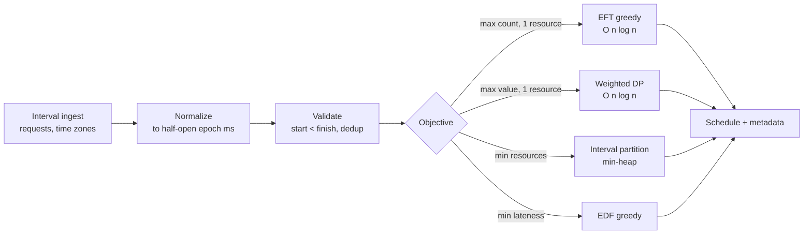
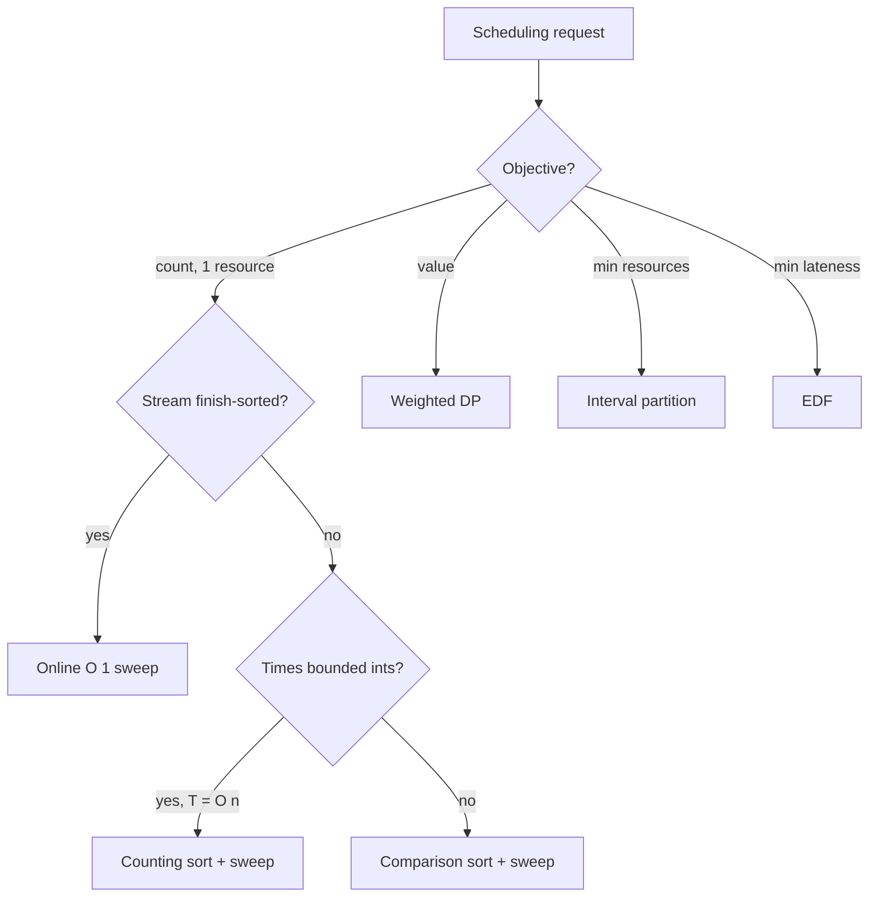

# Activity Selection — Senior Level

> At the senior level Activity Selection stops being "sort and sweep" and becomes a building block inside real scheduling services — calendar back-ends, reservation systems, batch-job admission controllers — where the engineering is in *ingestion and normalization* of intervals, *choosing the right objective* (count vs value vs rooms vs lateness), *scaling the `O(n log n)` kernel*, and *exposing it as a robust, observable service* that never silently returns a non-optimal schedule.

## Table of Contents
1. [Introduction](#1-introduction)
2. [System Design with Activity Selection](#2-system-design-with-activity-selection)
3. [Large-Scale Computation: Sort, Stream, Shard](#3-large-scale-computation-sort-stream-shard)
4. [Concurrency and Parallelism](#4-concurrency-and-parallelism)
5. [Comparison with Alternatives at Scale](#5-comparison-with-alternatives-at-scale)
6. [Architecture Patterns](#6-architecture-patterns)
7. [Code: Production-Grade Scheduling Kernel](#7-code-production-grade-scheduling-kernel)
8. [Observability](#8-observability)
9. [Failure Modes](#9-failure-modes)
10. [Capacity Planning](#10-capacity-planning)
11. [Summary](#11-summary)

---

## 1. Introduction

A senior engineer rarely "selects activities" as a toy. The earliest-finish-time greedy is the kernel inside larger systems:

- **Calendar / meeting-room back-ends** — "what is the maximum set of bookings this room can host?" is literal activity selection; "fit all meetings into the fewest rooms" is interval partitioning; "pick the most valuable bookings" is weighted DP. One front door, three kernels.
- **Reservation and admission control** — a single resource (a GPU, a machine, a broadcast channel) accepts non-overlapping reservation windows; the greedy maximizes accepted-request count, an SLA-relevant throughput metric.
- **Batch-job schedulers** — fixed-window jobs on one executor; the greedy chooses the maximum number that run without conflict, while weighted/lateness objectives route to other schedulers.
- **Resource-utilization analytics** — "how many non-conflicting tasks *could* we have run?" is an offline optimum used to benchmark a live scheduler's efficiency.
- **Telecom / broadcast slot allocation** — a single channel accepts the maximum number of non-overlapping transmission windows; revenue-weighted variants escalate to DP.
- **CI/CD runner allocation** — a fixed-window pipeline stage on one runner; maximize the count of jobs that fit without contention.

The senior decisions are therefore not "how does the greedy work" but:

1. Which **objective** does this workload actually have — count, value, rooms, or lateness? Picking the wrong one ships a correct algorithm for the wrong problem.
2. How do I **normalize and validate** messy interval input (time zones, open/closed conventions, zero-length, overlapping duplicates) before the kernel?
3. How do I **scale** an `O(n log n)` sort-and-sweep — across a stream, across shards, across requests?
4. How do I **observe** it so a silently sub-optimal or invalid schedule does not ship?

---

## 2. System Design with Activity Selection

### 2.1 Where the kernel sits



The ingest, normalization, and validation stages are *shared and cheap*; the **objective** is the design knob that selects the kernel. The most common senior mistake is hard-wiring the EFT greedy and discovering later that the product actually needed weighted value or minimum rooms — a correct algorithm for the wrong objective.

### 2.2 Three service tiers

| Tier | Scale | Kernel | Latency | When right |
|------|-------|--------|---------|-----------|
| Inline library | `n ≤ ~10⁴` per request | EFT greedy in-process | sub-ms to ms | A request handler computes "max bookings" for one room. |
| Scheduling microservice | `n ≤ ~10⁶` per job | EFT greedy / DP, possibly counting-sort | ms to seconds | Batch admission for many resources; one objective per call. |
| Offline analytics job | `n ≥ 10⁷`, many resources | external/parallel sort + sweep | seconds to minutes | Utilization benchmarking, capacity reports over historical intervals. |

A reservation service that only needs *count* tolerates the trivial kernel; an analytics job over a year of bookings needs an external sort and a streaming sweep.

### 2.3 The objective is the riskiest decision

Of all the choices a senior makes here, picking the objective is the one most likely to ship a *correct algorithm that solves the wrong problem*. A vivid failure: a calendar team builds "maximize bookings" with the EFT greedy; months later, product asks "but premium customers' bookings should count more" — that is now weighted scheduling, and the greedy is silently wrong for it. Because the greedy never errors and produces a plausible schedule, the bug can survive to production and degrade revenue invisibly. The mitigation is structural: make the objective an **explicit, typed contract** on the request, route through a strategy selector, and forbid the count-greedy on any value-bearing route at the type level. Treat "which objective" as a first-class design decision recorded in the response metadata, not an implicit assumption baked into a function name.

### 2.4 Boundaries the kernel must not own

Keep these *out* of the greedy kernel so it stays pure and testable:

- **Time-zone and DST handling** — belongs in normalization.
- **Authorization** (may this requester book this resource?) — belongs upstream.
- **Conflict policy** (what to do with rejected requests — waitlist, notify, retry) — belongs in the orchestrator.
- **Persistence** of the chosen schedule — belongs in a repository.

The kernel does exactly one thing: given clean half-open intervals and the `count` objective, return a maximum compatible set deterministically. Everything else is the system around it.

---

## 3. Large-Scale Computation: Sort, Stream, Shard

Because the kernel is "sort by finish, sweep once," scaling is fundamentally a *sorting and streaming* problem.

### 3.1 The cost ladder

1. **Comparison sort + sweep** — `O(n log n)` time, `O(1)` extra. The default for `n` up to tens of millions in memory.
2. **Counting / bucket sort + sweep** — `O(n + T)` when finish times are bounded integers in `[0, T)` (e.g. minute-of-day `T = 1440`, or epoch-second within a window). Beats comparison sort when `T = O(n)`.
3. **External (on-disk) merge sort + streaming sweep** — when `n` exceeds RAM. Sort runs to disk by finish time, then a single streaming pass with one `lastEnd` scalar selects activities without ever holding the whole set in memory.
4. **Sharded sort + merge** — partition intervals across machines, sort each shard by finish, k-way merge the shards, and run a single global sweep on the merged stream. The sweep itself is inherently sequential (each decision depends on `lastEnd`), but the *sort* parallelizes perfectly.

### 3.2 The sweep is sequential — and that is fine

The greedy decision for activity `i` depends on `lastEnd`, which depends on all earlier accepted activities. So the **sweep does not parallelize** in the naive sense. But the sweep is `O(n)` with a tiny constant; the expensive part is the **sort**, which is embarrassingly parallel (parallel/external merge sort). At scale you spend cores on the sort and run a single fast streaming sweep at the end. This is the senior insight: *do not try to parallelize the sweep; parallelize the sort feeding it.*

### 3.3 Worked sizing of a large offline sweep

Suppose an analytics job must compute the maximum non-overlapping booking count over **`n = 5 × 10⁸`** historical reservations on one logical resource. The intervals (40 bytes each) total 20 GB — too big for a 16 GB box. Plan: external merge sort by finish time (multiple sorted runs to disk, then a k-way merge), `O(n log n)` ≈ `5×10⁸ · 29 ≈ 1.5×10¹⁰` comparisons, I/O-bound at a few hundred MB/s → minutes for the sort. The streaming sweep then reads the merged run once, holding a single `lastEnd` and a counter — constant memory, one linear pass, I/O-bound. Total wall-clock: dominated by the external sort's disk passes, not the trivial sweep. If finish times were integer epoch-seconds within a one-year window (`T ≈ 3.15×10⁷`), a counting sort would replace the comparison sort and the I/O passes shrink accordingly.

### 3.4 Time normalization is part of the kernel's correctness

At scale, the subtle bug is not the algorithm — it is the *data*. Intervals arrive in local time zones, DST transitions, mixed open/closed conventions, and millisecond vs second resolution. **Normalize everything to half-open `[start, finish)` in a single monotonic unit (e.g. UTC epoch milliseconds) before the kernel.** A DST "fall back" that repeats an hour can make `finish < start` if naively converted; validate `start < finish` post-normalization and reject or repair degenerate intervals. The greedy is only as correct as the comparability of the times you feed it.

### 3.5 When the objective is value, the DP scales differently

If the workload is actually *weighted* (maximize total value, not count), the kernel is the weighted-interval DP, and its scaling profile differs subtly:

- The sort is still `O(n log n)` and parallelizable.
- The predecessor computation `p(i)` (latest compatible activity) is `n` binary searches, `O(n log n)`, also parallelizable since each `p(i)` is independent.
- The DP table fill `dp[i] = max(dp[i−1], v_i + dp[p(i)])` is a **sequential** `O(n)` recurrence — like the greedy sweep, it cannot be naively parallelized because `dp[i]` depends on earlier `dp` entries.

So the same senior lesson applies: parallelize the sort and the predecessor searches, keep the final recurrence sequential. The DP needs `O(n)` memory for the `dp` and `p` arrays, versus the greedy's `O(1)`, which matters when `n` is very large and you are memory-bound — another reason to confirm the objective is genuinely value-weighted before paying for the DP.

### 3.6 Sweep-line for the concurrency objective

A frequent sibling request is "what is the maximum number of activities live at once?" (peak concurrency / overlap depth). That is *not* activity selection — it is an endpoint sweep line: sort all `2n` endpoints, walk left to right, `+1` on a start, `−1` on a finish, track the running maximum. Same `O(n log n)` sort, different semantics. A senior service often exposes both ("max non-overlapping count" and "peak concurrency") and must not confuse them; they answer different questions about the same intervals.

---

## 4. Concurrency and Parallelism

The single `O(n log n)` sort-and-sweep is the unit of work. Parallelism comes at three levels:

1. **Across requests / resources.** A scheduling service handles many independent resources (rooms, machines, channels); each resource's activity selection is an independent job. A worker pool sized to `cores` saturates CPU with no shared mutable state — the intervals and `lastEnd` are per-resource. This is the highest-leverage parallelism.
2. **Within the sort.** Parallel merge sort (or a parallel external sort) uses all cores for the dominant `O(n log n)` step. The subsequent sweep is a fast sequential tail.
3. **Not within the sweep.** The sweep is inherently sequential because each decision reads `lastEnd`. Do not attempt to parallelize it; the dependency chain is fundamental. (You *can* parallelize *independent* sub-streams that are known a priori not to interact — e.g. activities separated by a guaranteed gap — but that is a data property, not a general technique.)

**Thread-safety rules:**

- The kernel must be **pure**: intervals in, schedule out, no shared cache mutated during a solve.
- The result is **deterministic** given a fixed tie-break on equal finish times, so results are reproducible and safe to cache. Pin the tie-break (e.g. by original index) for bit-reproducibility across runs.
- If you memoize schedules by a canonical hash of the (normalized) interval multiset, the cache is read-mostly; use a concurrent map and treat misses as recompute, never block a solve on a lock.

---

## 5. Comparison with Alternatives at Scale

| Goal | Activity-selection greedy | Alternative | When the alternative wins |
|------|---------------------------|-------------|---------------------------|
| Max count, one resource | `O(n log n)` EFT greedy | Brute-force subsets | Never at scale — exponential; only for `n ≤ 20` tests. |
| Max value, one resource | — | Weighted-interval DP | Always when activities carry values — greedy is wrong. |
| Schedule all, fewest resources | — | Interval partitioning (min-heap) | Always for the min-rooms objective. |
| Min max lateness, one machine | — | Earliest Deadline First | Always for the lateness objective. |
| Max concurrency / overlap depth | — | Endpoint sweep line | When you measure congestion, not select a set. |
| Already finish-sorted stream | `O(n)` online sweep | re-sorting | Never — skip the sort, sweep directly. |
| Bounded integer times | `O(n + T)` counting sort + sweep | comparison sort | When `T = O(n)` — counting sort is faster. |

**Strategic rule:** the EFT greedy is *only* the answer to "maximum count of non-overlapping intervals on one resource." For any other objective, a different (still `O(n log n)`) algorithm is correct, and shipping the greedy there is a silent correctness bug, not a performance one.

### 5.1 Decision flow for picking the kernel



Wire this flow into the service's strategy selector so the EFT greedy is *never* chosen for a value, rooms, or lateness contract.

---

## 6. Architecture Patterns

### 6.1 Strategy pattern over the objective

Encapsulate the scheduler behind an interface with `MaxCountGreedy`, `MaxValueDP`, `MinResourcesPartition`, and `MinLatenessEDF` implementations. The service picks the strategy from the request's "objective contract." This keeps ingest/normalization/validation shared, isolates the algorithmic risk, and makes choosing the wrong objective an explicit, reviewable decision rather than a hard-coded assumption.

### 6.2 Objective contract on the response

Every result carries metadata: the objective used (`count` / `value` / `min_resources` / `min_lateness`), the interval convention (half-open), the tie-break rule, and the optimum value plus the reconstructed schedule. A consumer must never confuse a max-*count* schedule with a max-*value* one.

### 6.3 Normalize-validate-schedule pipeline

A three-stage pipeline — normalize to UTC epoch-ms half-open, validate (`start < finish`, dedup, drop zero-length), then schedule — keeps the correctness-critical data hygiene out of the kernel and centralized. Reject (with a clear error) rather than silently coerce malformed intervals.

### 6.4 Caching by canonical interval-set hash

The greedy is deterministic in the (normalized, tie-broken) interval multiset and objective, so cache on a canonical hash. For dashboards that re-query the same resource's bookings, this turns repeated `O(n log n)` into `O(1)`.

### 6.5 Incremental maintenance

When intervals are added one at a time to a long-lived resource (a calendar that grows), keep the set sorted by finish (insert in `O(log n)` into a balanced structure) and re-sweep `O(n)` on demand, rather than re-sorting from scratch. For append-only finish-monotonic streams, maintain the running greedy in `O(1)` per arrival.

### 6.6 A worked architecture: meeting-room maximizer

Consider a real "how many meetings can this room host?" feature in a calendar product. The end-to-end path:

1. **Ingest** — the room's bookings for a day arrive as `(localStart, localEnd, tz)` triples plus tentative new requests.
2. **Normalize** — convert each to UTC epoch-ms half-open `[start, finish)`; reject DST-broken or inverted intervals.
3. **Validate / dedup** — drop zero-length holds and exact duplicates on a canonical key.
4. **Strategy select** — the feature's objective contract is `count`, so route to `MaxCountGreedy`.
5. **Solve** — sort by finish (with ID tie-break), sweep, produce the selected booking IDs.
6. **Respond** — return the schedule plus metadata: objective `count`, convention half-open, optimum size, and the chosen IDs in time order.
7. **Cache** — key on the canonical normalized interval-set hash + objective; subsequent identical queries are `O(1)`.
8. **Observe** — emit `solve_latency_ms`, `selection_ratio`, `rejected_intervals_total`; sample the brute-force oracle on small days.

This pipeline shows the senior reality: the *algorithm* is ten lines; the *system* around it — normalization, validation, strategy selection, caching, observability — is where correctness and reliability actually live.

### 6.7 Multi-resource fan-out

A booking system with thousands of rooms runs one independent activity selection per room. Fan out the per-room solves across a worker pool (Section 4), aggregate the per-room schedules, and roll up utilization metrics. Because the per-room problems share no state, this scales linearly with cores until the sort/normalize stages or I/O saturate.

---

## 7. Code: Production-Grade Scheduling Kernel

A reusable kernel with an **objective contract**: max-count greedy (the focus here) plus a validated, normalized intake. The greedy is deterministic given a pinned tie-break, so its output is safe to cache. All three print `selected = 4` for the validated 8-activity example and reject a malformed interval.

#### Go

```go
package main

import (
	"errors"
	"fmt"
	"sort"
)

type Activity struct {
	ID            int
	Start, Finish int64 // normalized half-open [Start, Finish), e.g. epoch ms
}

var ErrBadInterval = errors.New("invalid interval: start must be < finish")

// validate normalizes intent: reject zero-length / inverted intervals.
func validate(acts []Activity) error {
	for _, a := range acts {
		if a.Start >= a.Finish {
			return fmt.Errorf("%w: id=%d [%d,%d)", ErrBadInterval, a.ID, a.Start, a.Finish)
		}
	}
	return nil
}

// MaxCount returns a maximum set of compatible activities (by ID), earliest
// finish first, with a deterministic tie-break on ID for reproducibility.
func MaxCount(acts []Activity) ([]int, error) {
	if err := validate(acts); err != nil {
		return nil, err
	}
	a := append([]Activity(nil), acts...)
	sort.Slice(a, func(i, j int) bool {
		if a[i].Finish != a[j].Finish {
			return a[i].Finish < a[j].Finish
		}
		return a[i].ID < a[j].ID // deterministic tie-break
	})
	chosen := []int{}
	var lastEnd int64 = -1 << 62
	for _, x := range a {
		if x.Start >= lastEnd {
			chosen = append(chosen, x.ID)
			lastEnd = x.Finish
		}
	}
	return chosen, nil
}

func main() {
	acts := []Activity{
		{0, 1, 4}, {1, 3, 5}, {2, 0, 6}, {3, 5, 7},
		{4, 3, 8}, {5, 5, 9}, {6, 8, 10}, {7, 10, 12},
	}
	chosen, err := MaxCount(acts)
	if err != nil {
		fmt.Println("error:", err)
		return
	}
	fmt.Println("selected =", len(chosen), "ids =", chosen) // 4

	bad := []Activity{{0, 5, 5}} // zero-length -> rejected
	if _, err := MaxCount(bad); err != nil {
		fmt.Println("rejected:", err)
	}
}
```

#### Java

```java
import java.util.*;

public class SchedulingKernel {
    record Activity(int id, long start, long finish) {}

    static class BadIntervalException extends RuntimeException {
        BadIntervalException(String m) { super(m); }
    }

    static void validate(List<Activity> acts) {
        for (Activity a : acts)
            if (a.start() >= a.finish())
                throw new BadIntervalException(
                    "invalid interval id=" + a.id() + " [" + a.start() + "," + a.finish() + ")");
    }

    // Max set of compatible activities by id, earliest finish first,
    // deterministic tie-break on id.
    static List<Integer> maxCount(List<Activity> acts) {
        validate(acts);
        List<Activity> a = new ArrayList<>(acts);
        a.sort((x, y) -> x.finish() != y.finish()
                ? Long.compare(x.finish(), y.finish())
                : Integer.compare(x.id(), y.id()));
        List<Integer> chosen = new ArrayList<>();
        long lastEnd = Long.MIN_VALUE;
        for (Activity x : a)
            if (x.start() >= lastEnd) { chosen.add(x.id()); lastEnd = x.finish(); }
        return chosen;
    }

    public static void main(String[] args) {
        List<Activity> acts = List.of(
            new Activity(0, 1, 4), new Activity(1, 3, 5), new Activity(2, 0, 6),
            new Activity(3, 5, 7), new Activity(4, 3, 8), new Activity(5, 5, 9),
            new Activity(6, 8, 10), new Activity(7, 10, 12));
        List<Integer> chosen = maxCount(acts);
        System.out.println("selected = " + chosen.size() + " ids = " + chosen); // 4

        try {
            maxCount(List.of(new Activity(0, 5, 5))); // zero-length
        } catch (BadIntervalException e) {
            System.out.println("rejected: " + e.getMessage());
        }
    }
}
```

#### Python

```python
from dataclasses import dataclass


class BadIntervalError(ValueError):
    pass


@dataclass(frozen=True)
class Activity:
    id: int
    start: int     # normalized half-open [start, finish)
    finish: int


def validate(acts):
    for a in acts:
        if a.start >= a.finish:
            raise BadIntervalError(f"invalid interval id={a.id} [{a.start},{a.finish})")


def max_count(acts):
    """Max set of compatible activity IDs, earliest finish first, with a
    deterministic tie-break on ID for reproducible, cacheable output."""
    validate(acts)
    a = sorted(acts, key=lambda x: (x.finish, x.id))
    chosen = []
    last_end = float("-inf")
    for x in a:
        if x.start >= last_end:
            chosen.append(x.id)
            last_end = x.finish
    return chosen


if __name__ == "__main__":
    acts = [
        Activity(0, 1, 4), Activity(1, 3, 5), Activity(2, 0, 6), Activity(3, 5, 7),
        Activity(4, 3, 8), Activity(5, 5, 9), Activity(6, 8, 10), Activity(7, 10, 12),
    ]
    chosen = max_count(acts)
    print("selected =", len(chosen), "ids =", chosen)  # 4

    try:
        max_count([Activity(0, 5, 5)])  # zero-length
    except BadIntervalError as e:
        print("rejected:", e)
```

**What it does:** a kernel that validates and normalizes intervals, then runs a deterministic (pinned tie-break) earliest-finish-time greedy producing a reproducible, cacheable schedule.
**Run:** `go run main.go` | `javac SchedulingKernel.java && java SchedulingKernel` | `python kernel.py`

---

## 8. Observability

What to instrument when this runs in production:

- **Per-solve latency histogram**, bucketed by `n`. The `O(n log n)` sort means a few huge interval sets dominate p99; alert on outliers.
- **Objective-mode counter** — how many requests use `count` vs `value` vs `min_resources` vs `min_lateness`. A spike in `count` on a route that should be `value` is a contract violation.
- **Rejected-interval rate** — how often validation rejects `start ≥ finish` or zero-length intervals. A rising rate signals upstream normalization/time-zone bugs; correlate with ingest health.
- **Selection ratio** — selected / total activities. A sudden drop can mean the input got denser (more overlaps) or a normalization bug collapsed intervals.
- **Cache hit ratio** by interval-set hash — drives capacity; a low ratio means recomputation dominates.
- **Oracle cross-check sampling** — for a small fraction of small requests (`n ≤ 18`), recompute with the brute-force subset oracle and assert the greedy's count matches; a mismatch is a correctness alarm (wrong sort key, boundary bug, bad tie-break).
- **Convention-drift detector** — assert no two *selected* activities overlap under half-open semantics; any violation flags a `>` vs `>=` boundary regression.

### 8.1 A minimal metric set (with example SLOs)

| Metric | Type | Example SLO / alert |
|--------|------|---------------------|
| `solve_latency_ms{n_bucket}` | histogram | p99 for `n ≤ 10⁴` under 20 ms |
| `objective_mode_total{mode}` | counter | `count` on a `value` route ⇒ page immediately |
| `rejected_intervals_total` | counter | rate spike ⇒ inspect upstream time normalization |
| `selection_ratio` | gauge | sudden drop ⇒ investigate density / collapse bug |
| `oracle_mismatch_total` | counter | any non-zero ⇒ correctness alarm |
| `selected_overlap_violations_total` | counter | any non-zero ⇒ boundary/convention regression |
| `cache_hit_ratio` | gauge | below 0.3 ⇒ revisit caching key/TTL |

The single most valuable alert is `oracle_mismatch_total > 0` paired with `selected_overlap_violations_total > 0`: together they distinguish a *plausible but wrong* schedule from a correct one — the failure class a greedy scheduler is uniquely prone to (it never crashes; it just returns a smaller-than-optimal or subtly invalid set).

---

## 9. Failure Modes

The defining characteristic of this algorithm's failures is that **they are silent**: a greedy scheduler almost never crashes. A wrong sort key, a boundary off-by-one, or a wrong objective produces a perfectly valid-looking schedule that is merely *not optimal* or *subtly invalid*. There is no exception, no stack trace — only a smaller-than-possible accepted set or two selected activities that quietly overlap. This is why the mitigations below lean so heavily on *assertions and oracle cross-checks* rather than exception handling.

| Failure | Symptom | Root cause | Mitigation |
|---------|---------|------------|------------|
| Silently sub-optimal schedule | Fewer activities than possible | Sorted by start/duration instead of finish | Pin the sort key to finish; oracle cross-check in CI. |
| Boundary off-by-one | Back-to-back rejected, or 1-tick overlap accepted | `>` vs `>=` mismatch with interval convention | Fix the convention (half-open ⇒ `>=`); assert no selected overlap. |
| Wrong objective shipped | Correct algorithm, wrong product behavior | EFT greedy used for a value/rooms problem | Strategy pattern keyed by an explicit objective contract. |
| Invalid intervals corrupt output | Garbage or crash | `start ≥ finish` (DST, time-zone, unit mismatch) | Normalize to UTC epoch-ms; validate and reject pre-kernel. |
| Non-reproducible cache | Cache returns different schedules | Unstable tie-break on equal finish times | Pin a deterministic tie-break (e.g. by ID); only then cache. |
| OOM on huge input | Crash on large `n` | Holding all intervals in memory to sort | External/streaming sort + single streaming sweep. |
| Sweep "parallelized" wrongly | Subtly wrong count under threads | Treating the `lastEnd`-dependent sweep as parallel | Parallelize the sort, keep the sweep sequential. |
| Duplicate intervals inflate input | Slow, or skewed metrics | Same booking ingested twice | Dedup in the validate stage on canonical key. |

---

## 10. Capacity Planning

- **CPU.** One `O(n log n)` solve at `n = 10⁶` is ~`2×10⁷` comparisons — single-digit milliseconds per core. At `n = 10⁸` it is ~`2.7×10⁹` comparisons — seconds; budget accordingly and consider counting sort if times are bounded integers.
- **Memory.** The interval array is `n` records; at ~40 bytes each, `n = 10⁶` ≈ 40 MB, `n = 10⁸` ≈ 4 GB. Beyond RAM, switch to external sort + streaming sweep (constant working memory for the sweep).
- **Parallel budget for the sort.** Parallel merge sort gives near-linear speedup on the dominant step; the sweep is a fast sequential tail, so wall-clock ≈ (parallel sort time) + (one linear pass).
- **Throughput for a service.** With per-request interval sets of `n ≤ 10⁴`, a single core does many thousands of solves/sec; size the worker pool to `cores` and front with the interval-set-hash cache to absorb repeats.
- **Tail latency.** The `O(n log n)` cost makes the largest interval sets the p99 drivers. Either cap `n` per request, route large sets to a separate "heavy" pool, or precompute and cache.
- **Worked back-of-envelope.** A reservation service receiving 5,000 req/s with `n ≤ 500` intervals each (≈`4.5×10³` comparisons per solve) needs ≈`2.3×10⁷` comparisons/s — a fraction of a single core. Here the bottleneck is *not* the kernel but request overhead, serialization, and the validate/normalize stage; size for I/O and parsing, not for the trivial sort-and-sweep, and cache aggressively on the interval-set hash.
- **Cache sizing.** If 40% of requests repeat the same room-day interval set, a modest LRU on the interval-set hash eliminates 40% of solves outright. Size the cache to the working set of distinct `(resource, day)` keys; even a few hundred MB of cached schedules can absorb most of the load for a calendar product, shifting the bottleneck firmly to parsing and I/O.

---

### 10.1 Latency budget breakdown

For a typical inline call (`n = 500`, in-process), the time splits roughly as:

| Stage | Share | Notes |
|-------|-------|-------|
| Deserialize / parse request | 40–60% | Dominated by I/O and JSON, not the kernel. |
| Normalize + validate | 15–25% | Time-zone conversion is the heavy part. |
| Sort by finish | 10–20% | `O(n log n)`, tiny for small `n`. |
| Sweep | <5% | One linear pass. |
| Serialize response | 10–20% | Output the schedule + metadata. |

The senior insight from this table: at small-to-moderate `n`, the algorithm itself is *not* the cost — parsing, time normalization, and serialization are. Optimization effort belongs there, plus caching, not in micro-tuning a sweep that is already negligible.

### 10.2 Regression and correctness testing at scale

A production scheduler needs a layered test strategy:

- **Oracle tests** — random `n ≤ 18` interval sets; assert greedy count equals brute-force subset maximum.
- **Property tests** — for any input, assert (a) no two selected activities overlap (half-open), (b) the selected count is `≥` any single arbitrary compatible chain you construct, (c) re-running yields an identical schedule (determinism).
- **Convention tests** — explicit cases for touching intervals (`finish == next start`) under half-open semantics.
- **Normalization tests** — DST transitions, mixed time zones, second-vs-ms resolution, all reduced to the same UTC epoch-ms.
- **Scale smoke tests** — `n = 10⁶`–`10⁸` for latency/OOM regressions and to exercise the external-sort path.

These tests catch the silent failure modes (wrong key, boundary drift, non-determinism) that never throw an exception.

---

## 11. Summary

At senior scale, Activity Selection is a fixed `O(n log n)` sort-and-sweep kernel wrapped in engineering judgment. The ingest, normalization, and validation stages are correctness-critical and shared; the decision that matters is the **objective** — max count (EFT greedy), max value (weighted DP), minimum resources (interval partition), or minimum lateness (EDF) — and shipping the greedy for the wrong objective is a silent correctness bug, not a performance one. Scaling is a *sorting* problem: parallelize or externalize the sort (the dominant cost), and run a single sequential streaming sweep, which must not be parallelized because each decision depends on `lastEnd`. Stability demands normalizing all times to a single monotonic unit (UTC epoch-ms, half-open), validating `start < finish`, and pinning a deterministic tie-break so results are reproducible and cacheable. Observability centers on detecting *silent* failures — a plausible-but-suboptimal schedule from a wrong sort key, a `>`/`>=` boundary regression, or a wrong-objective contract — because the failure that hurts is not a crash but a correct-looking, smaller-than-optimal schedule. Reach for the online `O(1)` sweep when the stream is finish-sorted, counting sort when times are bounded integers, and an external sort when the data exceeds RAM.

### 11.1 The one-paragraph senior takeaway

If you remember nothing else: the EFT greedy is an `O(n log n)` kernel whose *correctness in production is an objective decision and a data-hygiene decision, not an algorithmic one*. Pin the objective (count only), normalize and validate the intervals, sort by finish with a deterministic tie-break, and run a single sequential sweep — then cross-check against a brute-force oracle on small inputs, because the failure that ships is the schedule that looks right and is one activity short.

### 11.2 Checklist before shipping a scheduling service

- [ ] Explicit objective contract on every request and response (`count` / `value` / `min_resources` / `min_lateness`).
- [ ] EFT greedy gated behind the `count` objective; never selectable for value/rooms/lateness.
- [ ] All times normalized to a single monotonic unit (UTC epoch-ms), half-open convention documented.
- [ ] Validation rejects `start ≥ finish` and dedups before the kernel.
- [ ] Deterministic tie-break pinned (e.g. by ID) so results are reproducible and cacheable.
- [ ] Brute-force oracle wired into CI on random `n ≤ 18` inputs; assert greedy count equals the oracle.
- [ ] Selected-set overlap assertion (`no two selected overlap under half-open`) on every response in tests.

Tick all seven and the sort-and-sweep kernel is production-ready; miss the oracle cross-check and you will eventually ship a confidently sub-optimal schedule.

### 11.3 Anti-patterns to avoid

- **Hard-coding the objective in a function name** (`scheduleMeetings`) instead of an explicit contract — invites the wrong-objective bug.
- **Skipping normalization** and feeding local-time intervals to the kernel — produces incomparable times and a wrong (or invalid) schedule.
- **Parallelizing the sweep** to "speed it up" — corrupts the `lastEnd` dependency chain; parallelize the sort instead.
- **Caching float-time or unstable-tie-break results** — non-reproducible cache entries; pin the tie-break and use integer epoch units.
- **Treating a `0`/small selection as an error** — a dense, highly-overlapping input legitimately admits few activities; surface the count, not an exception.
- **No oracle in CI** — the greedy's failures are silent, so without a brute-force cross-check on small inputs, a wrong sort key can pass every functional test.

Internalizing these anti-patterns is what turns a textbook-correct greedy into a production-correct scheduling service.

---

## 12. Related Topics

The senior-level mastery of Activity Selection is best consolidated by studying how its objective variants and proof techniques generalize:

- **[Exchange Argument](../05-exchange-argument/)** — the formal proof machinery that certifies the earliest-finish-time greedy is optimal; the same swap-without-worsening schema underpins every greedy in this section.
- **[Interval Scheduling Variations](../06-interval-scheduling-variations/)** — the four-objective decision tree (max count, max weight, min resources, min lateness) and why only the count objective admits the simple greedy.
- **[Fractional Knapsack](../03-fractional-knapsack/)** — a sibling ratio-greedy whose optimality also rests on an exchange argument.
- **[Job Scheduling](../04-job-scheduling/)** — deadline-driven greedy with a union-find slot allocator, the natural next step from EFT selection.
- **Weighted Interval Scheduling (DP)** — the cautionary counterexample showing that adding weights breaks greedy and forces dynamic programming.

### 12.1 Where this kernel shows up in real systems

Calendar and meeting-room services (Google Calendar, Calendly), CPU and batch-job schedulers, ad-slot allocation, lecture-hall and classroom assignment, and bandwidth-reservation admission control all reduce — at their core — to one of the four interval objectives above. Recognizing which objective a product requirement actually encodes is the senior skill; the kernel itself is then a few lines of sort-and-sweep.

---

## 13. Further Reading

- **CLRS, *Introduction to Algorithms*, Ch. 16 (Greedy Algorithms)** — the canonical activity-selection treatment and its exchange-argument proof.
- **Kleinberg & Tardos, *Algorithm Design*, Ch. 4** — interval scheduling, interval partitioning, and minimizing lateness presented as a unified greedy family.
- **cp-algorithms.com — "Scheduling jobs"** — competitive-programming framing of the deadline and lateness variants.
