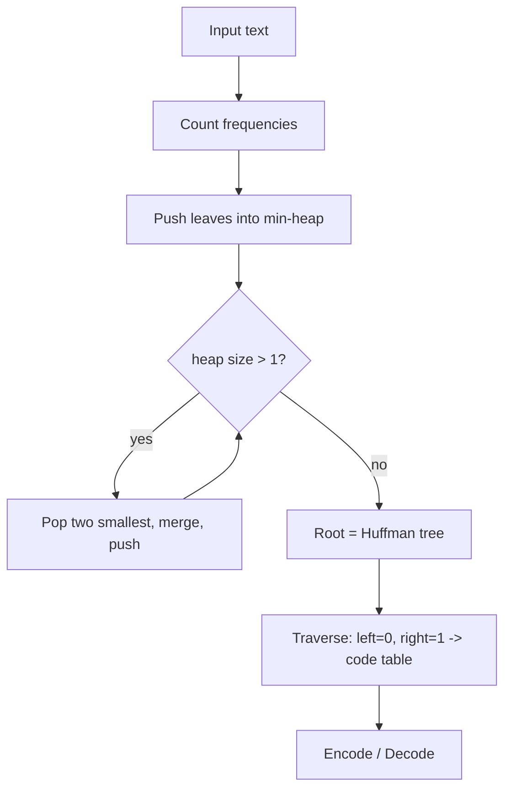

# Huffman Coding — Junior Level

> **One-line summary:** Huffman coding builds an **optimal prefix-free binary code** by repeatedly taking the **two lowest-frequency symbols** out of a **min-heap**, merging them into a new node whose frequency is their sum, and pushing that node back — until one node (the root of the code tree) remains. Frequent symbols end up near the root (short codes); rare symbols sink deep (long codes), so the total encoded size is the smallest any prefix-free code can achieve.

---

## Table of Contents

1. [Introduction](#introduction)
2. [Prerequisites](#prerequisites)
3. [Glossary](#glossary)
4. [Core Concepts](#core-concepts)
5. [Big-O Summary](#big-o-summary)
6. [Real-World Analogies](#real-world-analogies)
7. [Pros & Cons](#pros--cons)
8. [Step-by-Step Walkthrough](#step-by-step-walkthrough)
9. [Code Examples](#code-examples)
10. [Coding Patterns](#coding-patterns)
11. [Error Handling](#error-handling)
12. [Performance Tips](#performance-tips)
13. [Best Practices](#best-practices)
14. [Edge Cases & Pitfalls](#edge-cases--pitfalls)
15. [Common Mistakes](#common-mistakes)
16. [Cheat Sheet](#cheat-sheet)
17. [Visual Animation](#visual-animation)
18. [Summary](#summary)
19. [Further Reading](#further-reading)

---

## Introduction

Imagine you must store a long message — say a book — as a stream of bits. The naive plan gives every distinct character the same number of bits. ASCII uses 8 bits per character; if your text only uses 16 distinct symbols you could fixed-width them into 4 bits each. Either way, **every symbol costs the same**, whether it appears a million times or once.

That is wasteful. In English text the letter `e` is enormously more common than `z`. If we spent **fewer** bits on `e` and were willing to spend **more** bits on `z`, the total would shrink. This is the idea of a **variable-length code**: common symbols get short codewords, rare symbols get long ones.

But variable-length codes have a trap. If `a = 0` and `b = 01`, then the bit stream `001` could be `a, b` or `a, a, ?` — you cannot tell where one codeword ends and the next begins. The fix is the **prefix-free property** (also called the "prefix property"): **no codeword is a prefix of another codeword**. With a prefix-free code, decoding is unambiguous — you read bits until they exactly spell a codeword, emit that symbol, and start over.

**Huffman coding**, invented by **David A. Huffman in 1952** while he was a graduate student at MIT (he produced it for a term-paper assignment, beating his own professor's known approach), answers the precise question: *among all prefix-free codes for a given set of symbol frequencies, which one makes the encoded message shortest?* The answer is a beautifully simple **greedy** algorithm:

1. Put every symbol into a **min-heap** keyed by its frequency.
2. **Pop the two smallest**, make a new internal node whose frequency is their sum, with the two popped nodes as its children, and **push** the new node back.
3. Repeat until **one node remains** — that node is the root of the **Huffman tree**.
4. Read codewords off the tree: going **left appends a `0`**, going **right appends a `1`**, and each **leaf** is a symbol whose path from the root is its codeword.

Because the two rarest symbols are merged first, they end up deepest in the tree (longest codes); the most frequent symbols stay near the root (shortest codes). Huffman proved this greedy choice is **optimal**: no prefix-free code achieves a smaller total. The algorithm runs in `O(n log n)` for `n` distinct symbols, and it is the compression heart of real formats — **DEFLATE (used by gzip, zlib, PNG, ZIP)** and **JPEG** both lean on Huffman coding.

---

## Prerequisites

Before reading this file you should be comfortable with:

- **Binary numbers and bits** — what a bit is, that `0` and `1` are the only digits, and that a "codeword" is a short string of bits.
- **Binary trees** — nodes, left/right children, leaves vs internal nodes, depth/path from the root.
- **A priority queue / min-heap** — a structure that gives you the smallest element in `O(log n)` (siblings `10-heaps` cover this). You `push` items and `pop` the minimum.
- **Frequencies / counts** — how often each symbol appears in the input.
- **Big-O notation** — `O(n log n)` for the heap-driven construction.

Optional but helpful:

- **Greedy algorithms** in general (the parent folder `14-greedy-algorithms`) — the idea that a locally best choice can be globally optimal.
- A little intuition about **logarithms** — useful for the entropy discussion in `professional.md`, not required here.

---

## Glossary

| Term | Meaning |
|------|---------|
| **Symbol / character** | A unit of the input we want to encode (a letter, byte, token). |
| **Frequency / weight** | How many times a symbol appears (or its probability). Drives everything. |
| **Codeword** | The string of bits assigned to a symbol, e.g. `e → 010`. |
| **Prefix-free code** | A code where no codeword is a prefix of another — guarantees unambiguous decoding. Also called a "prefix code." |
| **Variable-length code** | Codewords may differ in length (vs fixed-length like ASCII's 8 bits). |
| **Min-heap / priority queue** | Structure returning the smallest-frequency node first; the engine of Huffman construction. |
| **Huffman tree** | The binary tree built by merging; leaves are symbols, the root spans the whole alphabet. |
| **Leaf node** | A node holding an actual symbol; its root-to-leaf path is its codeword. |
| **Internal node** | A merged node with two children and no symbol; its frequency is the sum of its children. |
| **Code length `len(s)`** | Number of bits in symbol `s`'s codeword = its depth in the tree. |
| **Weighted path length (WPL)** | `Σ freq(s) · len(s)` — the total encoded size in bits. Huffman minimizes this. |
| **Optimal code** | A prefix-free code achieving the minimum possible WPL. |
| **Entropy `H`** | Shannon's lower bound (in bits/symbol) that no code can beat: `H = −Σ p(s) log₂ p(s)`. |

---

## Core Concepts

### 1. Why Prefix-Free Codes

A code assigns each symbol a string of bits. To decode a concatenated stream without separators, the code must be **prefix-free**: no codeword is the start of another. Then decoding is a simple walk — read bits one at a time, descend the tree, and the instant you hit a leaf you have a complete symbol.

Prefix-free codes correspond **exactly** to binary trees where symbols sit at the leaves. Left edge = `0`, right edge = `1`, and the path spells the codeword. Because leaves have no descendants, **no leaf's path is a prefix of another leaf's path** — the tree *guarantees* the prefix-free property for free.

### 2. The Greedy Merge Rule

Huffman's insight: in an optimal tree, the **two least-frequent symbols are siblings at the maximum depth**. Intuitively, if a rare symbol were shallow and a common one deep, swapping them would lower the total — so the optimum never does that. This means we can safely merge the two rarest symbols *now*, treat their combined node as a single "super-symbol" of summed frequency, and recurse on the smaller problem.

That recursion is implemented with a **min-heap**:

```
while heap has more than one node:
    a = pop_min(heap)          # smallest frequency
    b = pop_min(heap)          # next smallest
    merged = Node(freq = a.freq + b.freq, left = a, right = b)
    push(heap, merged)
root = pop_min(heap)           # the last node is the tree root
```

Each merge reduces the node count by one, so for `n` symbols there are exactly `n − 1` merges and the final tree has `n` leaves and `n − 1` internal nodes.

### 3. Reading Codewords Off the Tree

Once the tree is built, do one traversal. Carry a bit-string `path`. Going left appends `0`, going right appends `1`. When you reach a leaf, record `code[symbol] = path`. The result is a dictionary mapping each symbol to its codeword.

```
e → 0
n → 10
c → 110
o → 111   (example shapes; actual codes depend on frequencies)
```

### 4. Encoding and Decoding

- **Encode:** replace each symbol of the input with its codeword and concatenate the bits.
- **Decode:** start at the root; for each bit go left on `0`, right on `1`; on reaching a leaf emit its symbol and return to the root.

Decoding is `O(total bits)` and needs no codeword-length table — the tree itself resolves boundaries.

### 5. Why It Is Optimal (intuition)

Two facts power the optimality proof (formalized in `professional.md`):

1. **Exchange argument** — the two lowest-frequency symbols can be assumed to be the deepest siblings; any other arrangement can be improved or matched by swapping.
2. **Induction** — merging those two into one super-symbol yields a smaller instance; an optimal tree for the smaller instance, expanded back, is optimal for the original.

The result: Huffman's WPL `Σ freq(s)·len(s)` is the minimum over **all** prefix-free codes. And Shannon's entropy `H` bounds it from below: `H ≤ average bits/symbol < H + 1`.

---

## Big-O Summary

| Step | Time | Space | Notes |
|------|------|-------|-------|
| Count frequencies | `O(N)` | `O(n)` | `N` = input length, `n` = distinct symbols. |
| Build initial heap | `O(n)` | `O(n)` | Heapify all `n` leaves at once. |
| `n − 1` merges (2 pops + 1 push each) | `O(n log n)` | `O(n)` | Dominant cost of construction. |
| Build code table (one traversal) | `O(n)` | `O(n)` | Plus total codeword length in the worst case. |
| Encode the message | `O(N)` | `O(output bits)` | Concatenate codewords. |
| Decode the message | `O(output bits)` | `O(1)` extra | Walk the tree bit by bit. |
| **Total construction** | **`O(n log n)`** | **`O(n)`** | `n` = distinct symbols. |

The headline cost is `O(n log n)` for building the tree; everything else is linear in input size.

---

## Real-World Analogies

| Concept | Analogy |
|---------|---------|
| Variable-length codes | Morse code: common letters like `E` (`·`) and `T` (`−`) get short signals; rare letters like `Q` (`−−·−`) get long ones — so frequent letters are faster to send. |
| Merging the two rarest | Tournament seeding from the bottom: the two weakest teams play first and the loser bracket sinks deepest, while the strongest team gets a bye near the top. |
| The min-heap | A triage queue at a hospital that always hands you the *least urgent* (smallest) two cases to "combine" into a follow-up appointment. |
| Prefix-free property | Phone numbers in a country where no number is a prefix of another — you can dial without a "finished dialing" button because each number is self-terminating. |
| Frequent symbols near the root | A library shelving best-sellers by the front door (short walk) and obscure titles in the back stacks (long walk). |
| Weighted path length | Total walking distance for all patrons combined — minimized by putting popular books closest. |
| Decoding by tree walk | Following a "choose-your-own-adventure" book: each bit is a page-turn instruction (left/right) until you reach an ending (a leaf = a symbol). |

Where the analogy breaks: Morse code is *not* prefix-free (it needs pauses between letters), whereas a Huffman code is — that is precisely what lets Huffman streams run with no separators.

---

## Pros & Cons

| Pros | Cons |
|------|------|
| **Provably optimal** prefix-free code for known symbol frequencies. | Needs the frequencies up front (a first pass) or a shipped/standard table. |
| Simple `O(n log n)` greedy build with a min-heap. | Operates symbol-by-symbol; cannot exploit correlations between symbols (a Markov source) by itself. |
| Decoding is fast and needs only the tree (or canonical lengths). | Worst case (near-uniform frequencies) saves almost nothing — close to fixed-length. |
| Integral codeword lengths — no fractional bits, easy to emit. | Because lengths are integers, it can be up to ~1 bit/symbol above the entropy bound (arithmetic/range coding closes that gap). |
| Battle-tested: powers DEFLATE (gzip, zlib, PNG, ZIP) and JPEG. | The tree/table must be stored or agreed upon, adding overhead for tiny inputs. |
| **Canonical Huffman** lets you ship only the code *lengths*, not the whole tree. | Single-symbol alphabets and skewed sets need careful edge-case handling. |

**When to use:** compressing data with a skewed symbol distribution, as the entropy-coding stage of a larger pipeline (after LZ77 in DEFLATE), or whenever you need a fast, optimal, integer-length prefix code.

**When NOT to use:** when you can tolerate more complexity for the last fraction of a bit (use **arithmetic / range coding**); when the source has strong context dependence better captured by a model (PPM, context mixing); or when the alphabet is essentially uniform (Huffman barely helps).

---

## Step-by-Step Walkthrough

Let us build a Huffman code for the string `"abracadabra"`. First, **count frequencies**:

```
a : 5
b : 2
r : 2
c : 1
d : 1
```

Total = 11 characters. We start with five leaf nodes in a **min-heap** keyed by frequency.

**Heap (sorted view):** `c:1, d:1, b:2, r:2, a:5`

**Merge 1.** Pop the two smallest: `c:1` and `d:1`. Create internal node `[cd]:2`. Push it back.

```
Heap: b:2, r:2, [cd]:2, a:5
```

**Merge 2.** Pop the two smallest. Say we pop `b:2` and `r:2` (ties broken by insertion order; any consistent rule works). Create `[br]:4`. Push.

```
Heap: [cd]:2, a:5, [br]:4
```

**Merge 3.** Pop the two smallest: `[cd]:2` and `[br]:4`. Create `[cdbr]:6`. Push.

```
Heap: a:5, [cdbr]:6
```

**Merge 4 (last).** Pop `a:5` and `[cdbr]:6`. Create the root `[root]:11`. The heap now has one node — done.

The tree (one valid shape; ties may yield a different but equally optimal tree):

```
            [11]
           /    \
        a:5     [6]
                /  \
            [cd]2   [br]4
            /  \    /  \
          c:1 d:1 b:2  r:2
```

**Read codewords** (left = `0`, right = `1`):

```
a → 0        (length 1)
c → 100      (length 3)
d → 101      (length 3)
b → 110      (length 3)
r → 111      (length 3)
```

**Check the prefix-free property:** no codeword starts another. `a = 0`; everything else starts with `1`. Good.

**Compute the compressed size (WPL):**

```
a: 5 × 1 = 5
b: 2 × 3 = 6
r: 2 × 3 = 6
c: 1 × 3 = 3
d: 1 × 3 = 3
-------------------
total      = 23 bits
```

A fixed-length code for 5 symbols needs `⌈log₂ 5⌉ = 3` bits each, so `11 × 3 = 33` bits. Huffman gives **23 bits — a 30% saving** on this tiny example, purely because `a` is so common it earned a 1-bit code.

**Encode `"abracadabra"`:**

```
a  b   r   a c   a d   a  b   r   a
0 110 111 0 100 0 101 0 110 111 0
= 0110111010001010110111 0   (23 bits)
```

**Decode** by walking the tree from the root: `0` → leaf `a`; `110` → `b`; `111` → `r`; `0` → `a`; `100` → `c`; … recovering `"abracadabra"` exactly.

---

## Code Examples

### Example: Build a Huffman Tree, Emit a Code Table, Encode and Decode

We count frequencies, push leaves into a min-heap, merge `n − 1` times, then traverse to produce the code table. All three programs build the code for `"abracadabra"`, print each symbol's codeword, and verify that decoding the encoded bits reproduces the original string. We break frequency ties deterministically so the three languages agree.

#### Go

```go
package main

import (
	"container/heap"
	"fmt"
	"sort"
	"strings"
)

// node of the Huffman tree. Leaves carry a symbol; internal nodes have children.
type node struct {
	freq  int
	sym   rune // valid only for leaves
	leaf  bool
	order int // tie-breaker so ties are deterministic
	left  *node
	right *node
}

// minHeap orders by (freq, order) so ties are broken consistently.
type minHeap []*node

func (h minHeap) Len() int { return len(h) }
func (h minHeap) Less(i, j int) bool {
	if h[i].freq != h[j].freq {
		return h[i].freq < h[j].freq
	}
	return h[i].order < h[j].order
}
func (h minHeap) Swap(i, j int)      { h[i], h[j] = h[j], h[i] }
func (h *minHeap) Push(x any)        { *h = append(*h, x.(*node)) }
func (h *minHeap) Pop() any          { old := *h; n := len(old); x := old[n-1]; *h = old[:n-1]; return x }

func build(freq map[rune]int) *node {
	h := &minHeap{}
	ord := 0
	// Sort symbols for deterministic leaf insertion order.
	syms := make([]rune, 0, len(freq))
	for s := range freq {
		syms = append(syms, s)
	}
	sort.Slice(syms, func(i, j int) bool { return syms[i] < syms[j] })
	for _, s := range syms {
		heap.Push(h, &node{freq: freq[s], sym: s, leaf: true, order: ord})
		ord++
	}
	if h.Len() == 1 { // single distinct symbol: give it a parent so its code is "0"
		only := heap.Pop(h).(*node)
		return &node{freq: only.freq, left: only, order: ord}
	}
	for h.Len() > 1 {
		a := heap.Pop(h).(*node)
		b := heap.Pop(h).(*node)
		heap.Push(h, &node{freq: a.freq + b.freq, left: a, right: b, order: ord})
		ord++
	}
	return heap.Pop(h).(*node)
}

func codes(root *node) map[rune]string {
	out := map[rune]string{}
	var walk func(n *node, path string)
	walk = func(n *node, path string) {
		if n == nil {
			return
		}
		if n.leaf {
			if path == "" {
				path = "0" // single-symbol edge case
			}
			out[n.sym] = path
			return
		}
		walk(n.left, path+"0")
		walk(n.right, path+"1")
	}
	walk(root, "")
	return out
}

func main() {
	text := "abracadabra"
	freq := map[rune]int{}
	for _, c := range text {
		freq[c]++
	}
	root := build(freq)
	table := codes(root)

	syms := make([]rune, 0, len(table))
	for s := range table {
		syms = append(syms, s)
	}
	sort.Slice(syms, func(i, j int) bool { return syms[i] < syms[j] })
	for _, s := range syms {
		fmt.Printf("%c -> %s\n", s, table[s])
	}

	// Encode.
	var enc strings.Builder
	for _, c := range text {
		enc.WriteString(table[c])
	}
	bits := enc.String()
	fmt.Println("encoded:", bits, "(", len(bits), "bits )")

	// Decode by walking the tree.
	var dec strings.Builder
	cur := root
	for _, bit := range bits {
		if bit == '0' {
			cur = cur.left
		} else {
			cur = cur.right
		}
		if cur.leaf {
			dec.WriteRune(cur.sym)
			cur = root
		}
	}
	fmt.Println("decoded:", dec.String(), "match:", dec.String() == text)
}
```

#### Java

```java
import java.util.*;

public class Huffman {
    static class Node {
        int freq;
        char sym;
        boolean leaf;
        int order;
        Node left, right;
        Node(int freq, char sym, boolean leaf, int order) {
            this.freq = freq; this.sym = sym; this.leaf = leaf; this.order = order;
        }
    }

    static Node build(Map<Character, Integer> freq) {
        // Min-heap by (freq, order) for deterministic ties.
        PriorityQueue<Node> heap = new PriorityQueue<>(
            (a, b) -> a.freq != b.freq ? a.freq - b.freq : a.order - b.order);
        int[] ord = {0};
        List<Character> syms = new ArrayList<>(freq.keySet());
        Collections.sort(syms);
        for (char s : syms) heap.add(new Node(freq.get(s), s, true, ord[0]++));

        if (heap.size() == 1) {            // single distinct symbol
            Node only = heap.poll();
            Node parent = new Node(only.freq, '\0', false, ord[0]++);
            parent.left = only;
            return parent;
        }
        while (heap.size() > 1) {
            Node a = heap.poll(), b = heap.poll();
            Node m = new Node(a.freq + b.freq, '\0', false, ord[0]++);
            m.left = a; m.right = b;
            heap.add(m);
        }
        return heap.poll();
    }

    static void walk(Node n, String path, Map<Character, String> out) {
        if (n == null) return;
        if (n.leaf) { out.put(n.sym, path.isEmpty() ? "0" : path); return; }
        walk(n.left, path + "0", out);
        walk(n.right, path + "1", out);
    }

    public static void main(String[] args) {
        String text = "abracadabra";
        Map<Character, Integer> freq = new HashMap<>();
        for (char c : text.toCharArray()) freq.merge(c, 1, Integer::sum);

        Node root = build(freq);
        Map<Character, String> table = new TreeMap<>();
        walk(root, "", table);
        for (var e : table.entrySet())
            System.out.println(e.getKey() + " -> " + e.getValue());

        StringBuilder enc = new StringBuilder();
        for (char c : text.toCharArray()) enc.append(table.get(c));
        String bits = enc.toString();
        System.out.println("encoded: " + bits + " ( " + bits.length() + " bits )");

        StringBuilder dec = new StringBuilder();
        Node cur = root;
        for (char bit : bits.toCharArray()) {
            cur = bit == '0' ? cur.left : cur.right;
            if (cur.leaf) { dec.append(cur.sym); cur = root; }
        }
        System.out.println("decoded: " + dec + " match: " + dec.toString().equals(text));
    }
}
```

#### Python

```python
import heapq
from collections import Counter
from itertools import count


def build(freq):
    """Build a Huffman tree. Nodes are [freq, order, symbol_or_None, left, right]."""
    tie = count()  # deterministic tie-breaker
    heap = []
    for sym in sorted(freq):
        heapq.heappush(heap, [freq[sym], next(tie), sym, None, None])

    if len(heap) == 1:  # single distinct symbol -> give it a parent
        only = heapq.heappop(heap)
        return [only[0], next(tie), None, only, None]

    while len(heap) > 1:
        a = heapq.heappop(heap)
        b = heapq.heappop(heap)
        heapq.heappush(heap, [a[0] + b[0], next(tie), None, a, b])
    return heap[0]


def codes(root):
    out = {}

    def walk(node, path):
        if node is None:
            return
        freq, order, sym, left, right = node
        if sym is not None:                  # leaf
            out[sym] = path or "0"
            return
        walk(left, path + "0")
        walk(right, path + "1")

    walk(root, "")
    return out


if __name__ == "__main__":
    text = "abracadabra"
    freq = Counter(text)
    root = build(freq)
    table = codes(root)
    for sym in sorted(table):
        print(f"{sym} -> {table[sym]}")

    bits = "".join(table[c] for c in text)
    print("encoded:", bits, "(", len(bits), "bits )")

    # Decode by walking the tree.
    out, node = [], root
    for bit in bits:
        node = node[3] if bit == "0" else node[4]
        if node[2] is not None:
            out.append(node[2])
            node = root
    decoded = "".join(out)
    print("decoded:", decoded, "match:", decoded == text)
```

**What it does:** counts frequencies, builds the Huffman tree via a min-heap, derives the code table by traversal, then encodes and decodes `"abracadabra"` to prove round-trip correctness.
**Run:** `go run main.go` | `javac Huffman.java && java Huffman` | `python huffman.py`

---

## Coding Patterns

### Pattern 1: Count, Heapify, Merge

**Intent:** The three-line skeleton every Huffman implementation shares.

```python
freq = Counter(text)                 # 1. counts
heap = [[f, i, s, None, None] for i, (s, f) in enumerate(freq.items())]
heapq.heapify(heap)                  # 2. heapify O(n)
while len(heap) > 1:                 # 3. merge n-1 times
    a, b = heapq.heappop(heap), heapq.heappop(heap)
    heapq.heappush(heap, [a[0] + b[0], ..., None, a, b])
```

### Pattern 2: Deterministic Tie-Breaking

**Intent:** When two nodes share a frequency, the heap must break the tie *consistently* (e.g. by an insertion counter), or different runs produce different (still optimal) trees. Store a monotonically increasing `order` field and compare it second.

```python
from itertools import count
tie = count()
node = [freq, next(tie), sym, left, right]   # (freq, tie) is the heap key
```

This is also why we never put raw tree objects directly into a heap that compares tuples — without a tie-breaker, Python would try to compare the unorderable child lists.

### Pattern 3: Derive Codes by One Traversal

**Intent:** Build the `symbol → bits` table with a single DFS carrying the path string.

```python
def walk(node, path, out):
    if node.is_leaf:
        out[node.sym] = path or "0"
    else:
        walk(node.left, path + "0", out)
        walk(node.right, path + "1", out)
```

### Pattern 4: Decode by Tree Walk (no length table needed)

**Intent:** Decode purely from the tree — the prefix-free property makes boundaries self-evident.

```python
node = root
for bit in bitstream:
    node = node.left if bit == "0" else node.right
    if node.is_leaf:
        emit(node.sym); node = root
```



---

## Error Handling

| Error | Cause | Fix |
|-------|-------|-----|
| Decoder produces garbage or runs off the end | The decode bit stream was truncated or the tree differs from the one used to encode. | Ship/agree on the exact tree (or canonical lengths); store the bit count to know when to stop. |
| Crash on a single distinct symbol | Building a tree from one leaf leaves an empty path; codes come out as `""`. | Special-case: give the lone symbol the code `"0"` (or a one-node parent), as in the examples. |
| Heap comparison error (Python) | Two equal-frequency nodes force comparison of their child lists. | Add a unique tie-breaker field so the heap never compares the payloads. |
| Empty input | No symbols means no tree. | Return an empty table and emit zero bits; handle `len(freq) == 0` explicitly. |
| Wrong counts | Frequencies were computed on different data than what you encode. | Count on the *exact* bytes you will encode; treat bytes, not Unicode display characters, if compressing binary. |
| Off-by-one bit padding | Bits packed into bytes need padding; the decoder reads phantom trailing bits. | Store the true bit length (or a count of padding bits) in the header. |
| Non-deterministic output across machines | Unstable tie-breaking. | Fix a canonical ordering (sort symbols, use an insertion counter). |

---

## Performance Tips

- **Heapify once** (`O(n)`) instead of pushing leaves one at a time (`O(n log n)`); the merges still dominate, but it is a clean constant-factor win and clearer code.
- **Use canonical Huffman** when you must transmit the code: ship only the per-symbol code *lengths* (sorted), and both sides reconstruct identical codewords — far smaller than serializing a tree. Covered in `senior.md`.
- **For a fixed, small alphabet** (e.g. 256 byte values), arrays beat hash maps for both frequencies and the code table — direct indexing, no hashing.
- **Decode with a lookup table**, not a bit-by-bit tree walk, in hot paths: precompute, for every `k`-bit chunk, the symbol(s) it decodes to. Real decoders (zlib) use exactly this trick.
- **Avoid string concatenation for codewords** in tight loops; emit bits into a growable buffer / `int` accumulator and flush bytes.
- **Reuse the heap buffer** if you build many codes for same-size alphabets.

---

## Best Practices

- Always **verify round-trip** (encode then decode equals the original) in tests — it catches tree/table mismatches instantly.
- **Compare against the entropy bound** `H = −Σ p log₂ p`: Huffman's average length should sit in `[H, H + 1)`. A value outside that range signals a bug.
- Decide and **document your tie-breaking rule** so output is reproducible.
- **Special-case** the empty alphabet and the single-symbol alphabet before the main loop.
- Keep **frequencies and the code table as arrays** for byte alphabets; use maps only for sparse symbol sets.
- When persisting, prefer **canonical Huffman lengths** over a serialized tree — smaller and standard.
- Treat the input as **bytes** when compressing binary data; do not let Unicode normalization silently change your counts.

---

## Edge Cases & Pitfalls

- **Empty input (`n = 0`)** — no tree, no codes; emit nothing. Handle before building the heap.
- **Single distinct symbol (`n = 1`)** — there is no "left vs right" to distinguish; assign the code `"0"` (1 bit) so the output is non-empty and decodable.
- **All frequencies equal** — Huffman degenerates toward a balanced tree and saves little over fixed-length; that is expected, not a bug.
- **Ties in frequency** — multiple optimal trees exist; pick a deterministic rule. Different rules give different *shapes* but the **same minimal total bits**.
- **Very skewed frequencies** — the deepest codeword can be long (up to `n − 1` bits for a degenerate chain); use **length-limited Huffman** (`senior.md`) if your format caps code length (DEFLATE caps at 15 bits).
- **Bit packing** — the encoded bits must be packed into bytes with explicit length/padding metadata, or the decoder reads stray bits.
- **Counting the wrong unit** — counting characters vs bytes vs tokens changes the code; be explicit about the symbol unit.

---

## Common Mistakes

1. **Forgetting prefix-freeness reasoning** — trying to assign arbitrary short codes and producing an ambiguous, undecodable stream. The tree structure is what guarantees correctness.
2. **No tie-breaker in the heap** — non-deterministic trees, or (in Python) a crash from comparing node payloads.
3. **Mishandling a single-symbol alphabet** — emitting an empty codeword `""` and an unrecoverable stream.
4. **Not storing the bit length** — packing bits into bytes and then reading the padding as real data when decoding.
5. **Encoding with one tree and decoding with another** — the tables must match exactly; transmit the tree or canonical lengths.
6. **Assuming Huffman reaches the entropy** — it does not in general; integer code lengths leave up to ~1 bit/symbol on the table (use arithmetic coding to close it).
7. **Recomputing codeword strings repeatedly** — build the table once, then look symbols up; do not re-traverse per symbol.

---

## Cheat Sheet

| Step | Operation |
|------|-----------|
| 1. Count | `freq[s] += 1` for every symbol in the input. |
| 2. Heapify | Push all `n` leaves into a min-heap keyed by frequency (with a tie-breaker). |
| 3. Merge | `n − 1` times: pop two smallest, make a parent of summed frequency, push it. |
| 4. Root | The last node popped/left is the Huffman-tree root. |
| 5. Codes | DFS: left appends `0`, right appends `1`; each leaf's path is its codeword. |
| 6. Encode/Decode | Encode = concatenate codewords; decode = walk the tree bit by bit. |

Key facts:

```
prefix-free  ⇔  symbols at the leaves of a binary tree
construction:  O(n log n)  with a min-heap   (n = distinct symbols)
WPL = Σ freq(s)·len(s)        ← Huffman minimizes this
entropy bound:  H ≤ avg bits/symbol < H + 1,   H = −Σ p·log₂ p
single symbol → code "0";   empty input → nothing
used in: DEFLATE (gzip, zlib, PNG, ZIP), JPEG
```

Tiny verified example (`"abracadabra"`):

```
a→0  c→100  d→101  b→110  r→111      (one optimal shape)
fixed-length 3 bits/symbol:  33 bits
Huffman WPL:                 23 bits   (≈30% smaller)
```

---

## Visual Animation

> See [`animation.html`](./animation.html) for an interactive visualization of Huffman coding.
>
> The animation demonstrates:
> - An editable string whose character frequencies are computed live
> - The min-heap of nodes, showing each "pop two smallest, merge, push" step
> - The Huffman tree growing merge by merge, with `0`/`1` edge labels
> - The resulting code table and the encoded bit stream with its length
> - A side-by-side fixed-length vs Huffman size comparison and the saving

---

## Summary

Huffman coding turns a pile of symbol frequencies into the **shortest possible prefix-free binary code**. The engine is a **min-heap**: repeatedly pop the two lowest-frequency nodes, merge them into a parent whose frequency is their sum, and push it back until one node — the tree root — remains. Reading the tree (left = `0`, right = `1`) yields a codeword per leaf, with frequent symbols near the root (short codes) and rare ones deep (long codes). The greedy merge is **provably optimal**: no prefix-free code beats its total `Σ freq(s)·len(s)`. Construction is `O(n log n)`, decoding is a simple tree walk, and the only real care is tie-breaking, the single-symbol case, and packing bits with a length header. Master the four-step recipe — count, heapify, merge, read — and you have the junior-level core of one of compression's most enduring algorithms, the same one beating inside gzip, PNG, ZIP, and JPEG.

---

## Further Reading

- David A. Huffman (1952), *A Method for the Construction of Minimum-Redundancy Codes* — the original two-page paper.
- *Introduction to Algorithms* (CLRS), §16.3 — Huffman codes with the greedy optimality proof.
- Claude Shannon (1948), *A Mathematical Theory of Communication* — entropy, the lower bound Huffman approaches.
- RFC 1951 — the DEFLATE specification, showing Huffman (canonical, length-limited) in a real format.
- Sibling topic `10-heaps` — the min-heap / priority queue that drives the construction.
- Sibling parent `14-greedy-algorithms` — the greedy paradigm Huffman exemplifies.
