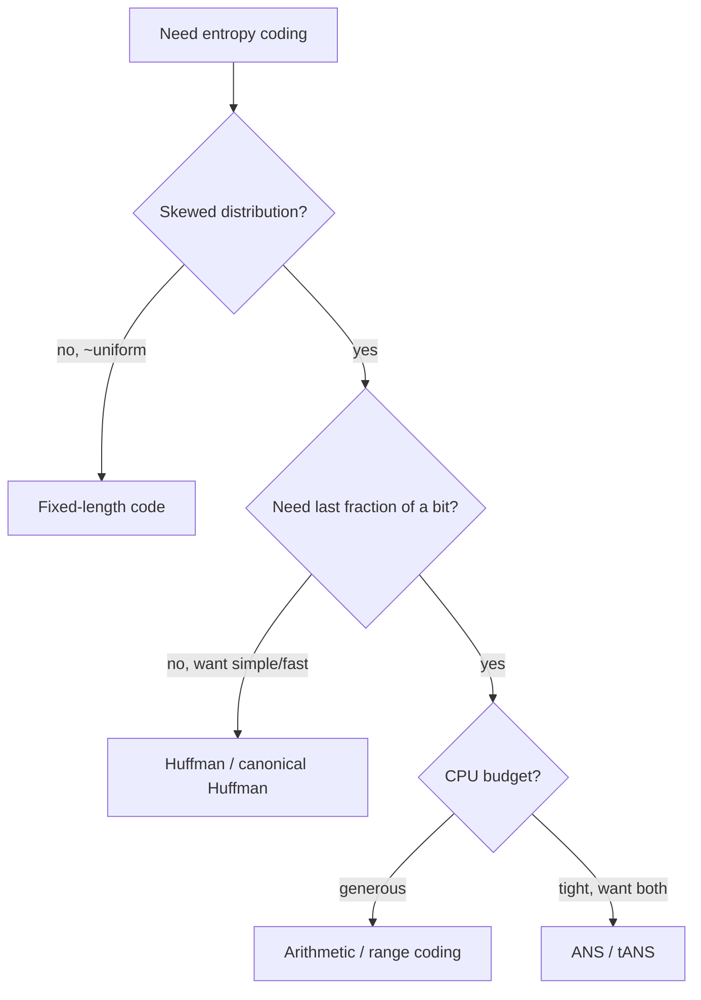

# Huffman Coding — Middle Level

> At the middle level Huffman coding stops being "merge two nodes" and becomes a question of **why the greedy choice is optimal**, **how close it gets to the Shannon entropy bound**, **when to reach for it versus arithmetic coding or a fixed table**, and how the variants — canonical, adaptive, length-limited, `k`-ary — change the trade-offs you actually make in a real codec.

## Table of Contents

1. [Recap and Framing](#recap-and-framing)
2. [Why the Greedy Choice Is Optimal](#why-the-greedy-choice-is-optimal)
3. [The Entropy Bound and How Close Huffman Gets](#the-entropy-bound-and-how-close-huffman-gets)
4. [Comparison: Huffman vs Fixed vs Arithmetic Coding](#comparison-huffman-vs-fixed-vs-arithmetic-coding)
5. [Variant — Canonical Huffman](#variant--canonical-huffman)
6. [Variant — Adaptive (Dynamic) Huffman](#variant--adaptive-dynamic-huffman)
7. [Variant — Length-Limited Huffman](#variant--length-limited-huffman)
8. [Variant — k-ary Huffman](#variant--k-ary-huffman)
9. [Code: Canonical Huffman With Encode/Decode](#code-canonical-huffman-with-encodedecode)
10. [Performance Analysis](#performance-analysis)
11. [Edge Cases & Pitfalls](#edge-cases--pitfalls)
12. [Best Practices](#best-practices)
13. [Cheat Sheet](#cheat-sheet)
14. [Summary](#summary)
15. [Further Reading](#further-reading)

---

## Recap and Framing

A junior reader knows the recipe: count frequencies, push leaves into a **min-heap**, merge the two smallest `n − 1` times, and read codewords off the resulting tree (left = `0`, right = `1`). That produces a **prefix-free** code in `O(n log n)`.

The middle-level questions are different:

1. **Why** is repeatedly merging the two *smallest* nodes optimal — not merely a reasonable heuristic?
2. **How good** is the result — what is the gap between Huffman's average code length and the theoretical minimum (Shannon entropy)?
3. **When** is Huffman the right tool versus a fixed-length code, a static standard table, or arithmetic/range coding?
4. **Which variant** do real systems use — canonical (to ship the table cheaply), adaptive (one pass, no pre-scan), length-limited (to obey a format cap), or `k`-ary (for non-binary output)?

These are the decisions a working engineer makes when wiring Huffman into a compressor.

---

## Why the Greedy Choice Is Optimal

Huffman's optimality rests on two lemmas. The full proof lives in `professional.md`; here is the intuition every middle engineer should be able to reproduce.

### Lemma 1 — Greedy-choice property

> In **some** optimal prefix-free code, the two symbols with the **lowest** frequencies are **siblings at the deepest level** of the tree.

*Why:* In any optimal tree, the two deepest leaves are siblings (a leaf with no sibling could move up, shortening a codeword — contradiction with optimality). Now suppose the two lowest-frequency symbols `x, y` are *not* those deepest siblings `a, b`. Swap `x` with `a` and `y` with `b`. Because `x, y` have the smallest frequencies and `a, b` were deepest, the swap **cannot increase** the weighted path length `Σ freq·depth` — frequent-but-deep and rare-but-shallow only ever helps to undo. So there is an optimal tree with `x, y` as the deepest siblings.

### Lemma 2 — Optimal substructure

> Merge `x` and `y` into a super-symbol `z` with `freq(z) = freq(x) + freq(y)`. If `T'` is an optimal tree for the **smaller** alphabet (with `z` replacing `x, y`), then expanding `z` back into the pair `x, y` yields an **optimal** tree `T` for the original alphabet.

*Why:* The cost of `T` is the cost of `T'` plus exactly `freq(x) + freq(y)` (the two children sit one level below where `z` sat). That additive offset is the same for *every* tree that merges `x, y` first, so minimizing `T'` minimizes `T`.

Together: the greedy merge of the two smallest is *safe* (Lemma 1) and reduces the problem to a provably equivalent smaller one (Lemma 2). Induction finishes it. This is the textbook example of a greedy algorithm with both the **greedy-choice property** and **optimal substructure** — the two conditions the parent folder `14-greedy-algorithms` teaches.

---

## The Entropy Bound and How Close Huffman Gets

Shannon's source-coding theorem sets a floor. For a source with symbol probabilities `p(s)`, the **entropy** is

```
H = − Σ p(s) · log₂ p(s)      (bits per symbol)
```

No prefix-free (in fact no uniquely decodable) code can have an average length below `H`. Huffman, being optimal among prefix-free codes, satisfies a tight sandwich:

```
H  ≤  L_Huffman  <  H + 1
```

where `L = Σ p(s)·len(s)` is the average codeword length. The lower bound is Shannon; the upper bound says Huffman is **never more than 1 bit per symbol** above the entropy.

**Why the slack of up to ~1 bit?** Huffman codeword lengths are **integers**. The "ideal" length for a symbol is `−log₂ p(s)`, which is usually fractional. Huffman must round to whole bits, and the rounding loss can approach 1 bit/symbol for badly matched distributions.

**Worked numbers** for `"abracadabra"` (`a:5, b:2, r:2, c:1, d:1` out of 11):

```
p(a)=5/11, p(b)=p(r)=2/11, p(c)=p(d)=1/11
H = −[ (5/11)log₂(5/11) + 2·(2/11)log₂(2/11) + 2·(1/11)log₂(1/11) ]
  ≈ 2.04 bits/symbol
L_Huffman = 23 bits / 11 symbols ≈ 2.09 bits/symbol
```

Huffman (`2.09`) sits just above entropy (`2.04`) and comfortably inside `[H, H+1)`. The ~0.05-bit gap is the integer-length rounding — small here, larger when one symbol's probability is far from a power of two (e.g. `p = 0.9` wants `0.15` bits but gets `1`).

**Blocking closes the gap.** Coding *pairs* or *triples* of symbols as single super-symbols spreads the ≤1-bit overhead across multiple symbols, so per-symbol slack shrinks toward 0 — at the cost of a quadratically larger alphabet. Arithmetic coding achieves the same effect without the blow-up.

---

## Comparison: Huffman vs Fixed vs Arithmetic Coding

| Property | Fixed-length | Huffman | Arithmetic / Range |
|----------|-------------|---------|---------------------|
| Average length vs entropy `H` | `⌈log₂ n⌉` (often ≫ `H`) | `[H, H+1)` | `≈ H` (within a tiny constant) |
| Codeword granularity | integer bits | integer bits | fractional bits (effectively) |
| Build cost | `O(1)` | `O(n log n)` | `O(n)` model + streaming |
| Decode cost | `O(1)/symbol` | `O(len)/symbol` (or table) | arithmetic per symbol (slower) |
| Adapts to skew | no | yes | yes, and more precisely |
| Patent/complexity history | trivial | simple, free | historically patent-encumbered, more complex |
| Where used | raw formats, alignment | **DEFLATE, JPEG, MP3 (part)** | JPEG2000, H.264/265 CABAC, modern codecs |

**Reading the table:** Huffman is the **sweet spot** — near-optimal, simple, fast, integer-length, and unencumbered. Fixed-length wins only when you need `O(1)` random access or alignment. Arithmetic/range coding wins the **last fraction of a bit** and handles probabilities not near powers of two, at higher CPU cost and historically patent friction (which is partly why DEFLATE chose Huffman). The modern compromise is **ANS (Asymmetric Numeral Systems)** — arithmetic-coding compression at Huffman-like speed, used in Zstandard and modern formats.



---

## Variant — Canonical Huffman

The plain tree assigns *some* optimal codeword to each symbol, but the exact bit patterns are arbitrary (ties, traversal order). **Canonical Huffman** fixes a *standard* assignment determined **only by the code lengths**:

1. Run normal Huffman to get each symbol's **code length** `len(s)`.
2. Sort symbols by `(len, symbol)`.
3. Assign codes in order: the first code of each length is the previous code incremented and left-shifted to the new length.

The payoff: to transmit the code, you ship **only the per-symbol lengths** (often as a compact list), not a serialized tree. Both encoder and decoder reconstruct **identical** codewords from the lengths alone. This is exactly what **DEFLATE** does (RFC 1951 §3.2.2), and it makes the header tiny.

**Codeword construction rule:**

```
code = 0
for length L = 1 .. maxLen:
    code <<= 1                       # shift left when length increases
    for each symbol s with len(s) == L (in symbol order):
        assign code to s
        code += 1
```

Canonical codes are still optimal (same lengths ⇒ same WPL) and additionally allow **table-driven decoding** because codes of a given length are consecutive integers.

---

## Variant — Adaptive (Dynamic) Huffman

Static Huffman needs **two passes**: one to count frequencies, one to encode. **Adaptive Huffman** (FGK algorithm, and Vitter's improved variant) does it in **one pass** with no pre-scan and no transmitted table:

- Encoder and decoder start with an identical tree (often just an "escape"/NYT — *Not Yet Transmitted* — node).
- After each symbol is processed, **both** sides update the tree the same way (increment the symbol's count and restructure to keep the **sibling property**).
- Because both sides apply the identical deterministic update, the decoder always has the same tree the encoder used.

Trade-off: no two-pass scan and no header overhead (great for streaming), but **more CPU per symbol** (tree updates) and slightly worse compression than the static optimum on known data. Used historically in `compress`/modems; today static canonical Huffman dominates because the pre-scan is cheap and gives strictly better codes.

---

## Variant — Length-Limited Huffman

Some formats cap codeword length: **DEFLATE limits codes to 15 bits**; JPEG to 16. Plain Huffman on a very skewed alphabet can produce codewords longer than the cap (a near-degenerate chain reaches `n − 1` bits). **Length-limited Huffman** finds the optimal prefix code subject to `len(s) ≤ L_max`.

The standard solution is the **package-merge algorithm** (Larmore–Hirschberg), which runs in `O(n·L_max)`: it builds the code by treating the problem as choosing `2·(n−1)` cheapest "coins" across `L_max` denominations under the **Kraft** budget `Σ 2^(−len) ≤ 1`. A simpler (suboptimal) production hack is to run normal Huffman and then **redistribute** overlong leaves, but package-merge is the optimal, standard answer.

The cost of limiting length is a *slightly* higher WPL — you pay a few bits to satisfy the format constraint.

---

## Variant — k-ary Huffman

If the output alphabet is not binary but **`k`-ary** (e.g. ternary), generalize: each merge combines the `k` smallest nodes into one parent. The catch is the **count condition** — for a full `k`-ary tree you need `(n − 1) mod (k − 1) == 0`. If not, **pad with zero-frequency dummy leaves** until it holds, then merge `k` at a time. Binary Huffman is the `k = 2` case where the condition is always satisfied.

```
ternary (k=3): repeatedly merge the 3 smallest; pad so (n-1) % 2 == 0
```

This matters when symbols are emitted over a non-binary channel (DNA storage with 4 bases, some hardware codes).

---

## Code: Canonical Huffman With Encode/Decode

We compute optimal code **lengths** with the heap, then derive **canonical** codewords from the lengths alone — so the "table" we would transmit is just the length list. All three print the canonical code table for `"abracadabra"` and verify a full encode→decode round trip.

#### Go

```go
package main

import (
	"container/heap"
	"fmt"
	"sort"
	"strings"
)

type hnode struct {
	freq, order int
	sym         rune
	leaf        bool
	left, right *hnode
}
type pq []*hnode

func (p pq) Len() int { return len(p) }
func (p pq) Less(i, j int) bool {
	if p[i].freq != p[j].freq {
		return p[i].freq < p[j].freq
	}
	return p[i].order < p[j].order
}
func (p pq) Swap(i, j int) { p[i], p[j] = p[j], p[i] }
func (p *pq) Push(x any)   { *p = append(*p, x.(*hnode)) }
func (p *pq) Pop() any     { o := *p; n := len(o); x := o[n-1]; *p = o[:n-1]; return x }

// codeLengths returns len(s) for each symbol via standard Huffman.
func codeLengths(freq map[rune]int) map[rune]int {
	syms := make([]rune, 0, len(freq))
	for s := range freq {
		syms = append(syms, s)
	}
	sort.Slice(syms, func(i, j int) bool { return syms[i] < syms[j] })

	h := &pq{}
	ord := 0
	for _, s := range syms {
		heap.Push(h, &hnode{freq: freq[s], sym: s, leaf: true, order: ord})
		ord++
	}
	lengths := map[rune]int{}
	if h.Len() == 1 {
		lengths[(*h)[0].sym] = 1
		return lengths
	}
	for h.Len() > 1 {
		a := heap.Pop(h).(*hnode)
		b := heap.Pop(h).(*hnode)
		heap.Push(h, &hnode{freq: a.freq + b.freq, left: a, right: b, order: ord})
		ord++
	}
	var walk func(n *hnode, d int)
	walk = func(n *hnode, d int) {
		if n.leaf {
			lengths[n.sym] = d
			return
		}
		walk(n.left, d+1)
		walk(n.right, d+1)
	}
	walk(heap.Pop(h).(*hnode), 0)
	return lengths
}

// canonical assigns standard codewords from lengths.
func canonical(lengths map[rune]int) map[rune]string {
	type sl struct {
		s rune
		l int
	}
	arr := make([]sl, 0, len(lengths))
	for s, l := range lengths {
		arr = append(arr, sl{s, l})
	}
	sort.Slice(arr, func(i, j int) bool {
		if arr[i].l != arr[j].l {
			return arr[i].l < arr[j].l
		}
		return arr[i].s < arr[j].s
	})
	out := map[rune]string{}
	code, prevLen := 0, 0
	for _, e := range arr {
		code <<= (e.l - prevLen)
		out[e.s] = fmt.Sprintf("%0*b", e.l, code)
		code++
		prevLen = e.l
	}
	return out
}

func main() {
	text := "abracadabra"
	freq := map[rune]int{}
	for _, c := range text {
		freq[c]++
	}
	table := canonical(codeLengths(freq))

	syms := make([]rune, 0, len(table))
	for s := range table {
		syms = append(syms, s)
	}
	sort.Slice(syms, func(i, j int) bool { return syms[i] < syms[j] })
	for _, s := range syms {
		fmt.Printf("%c -> %s\n", s, table[s])
	}

	var enc strings.Builder
	for _, c := range text {
		enc.WriteString(table[c])
	}
	bits := enc.String()

	// Decode using a reverse map (canonical codes are uniquely decodable).
	rev := map[string]rune{}
	for s, c := range table {
		rev[c] = s
	}
	var dec strings.Builder
	cur := ""
	for _, b := range bits {
		cur += string(b)
		if s, ok := rev[cur]; ok {
			dec.WriteRune(s)
			cur = ""
		}
	}
	fmt.Println("bits:", len(bits), "decoded matches:", dec.String() == text)
}
```

#### Java

```java
import java.util.*;

public class CanonicalHuffman {
    static class N {
        int freq, order; char sym; boolean leaf; N left, right;
        N(int f, int o, char s, boolean l) { freq=f; order=o; sym=s; leaf=l; }
    }

    static Map<Character, Integer> codeLengths(Map<Character, Integer> freq) {
        List<Character> syms = new ArrayList<>(freq.keySet());
        Collections.sort(syms);
        PriorityQueue<N> h = new PriorityQueue<>(
            (a, b) -> a.freq != b.freq ? a.freq - b.freq : a.order - b.order);
        int[] ord = {0};
        for (char s : syms) h.add(new N(freq.get(s), ord[0]++, s, true));
        Map<Character, Integer> len = new HashMap<>();
        if (h.size() == 1) { len.put(h.peek().sym, 1); return len; }
        while (h.size() > 1) {
            N a = h.poll(), b = h.poll();
            N m = new N(a.freq + b.freq, ord[0]++, '\0', false);
            m.left = a; m.right = b; h.add(m);
        }
        walk(h.poll(), 0, len);
        return len;
    }
    static void walk(N n, int d, Map<Character, Integer> len) {
        if (n.leaf) { len.put(n.sym, d); return; }
        walk(n.left, d + 1, len); walk(n.right, d + 1, len);
    }

    static Map<Character, String> canonical(Map<Character, Integer> len) {
        List<Map.Entry<Character, Integer>> arr = new ArrayList<>(len.entrySet());
        arr.sort((a, b) -> a.getValue().equals(b.getValue())
            ? Character.compare(a.getKey(), b.getKey())
            : a.getValue() - b.getValue());
        Map<Character, String> out = new TreeMap<>();
        int code = 0, prev = 0;
        for (var e : arr) {
            int L = e.getValue();
            code <<= (L - prev);
            String bits = String.format("%" + L + "s",
                Integer.toBinaryString(code)).replace(' ', '0');
            out.put(e.getKey(), bits);
            code++; prev = L;
        }
        return out;
    }

    public static void main(String[] args) {
        String text = "abracadabra";
        Map<Character, Integer> freq = new HashMap<>();
        for (char c : text.toCharArray()) freq.merge(c, 1, Integer::sum);
        Map<Character, String> table = canonical(codeLengths(freq));
        for (var e : table.entrySet())
            System.out.println(e.getKey() + " -> " + e.getValue());

        StringBuilder enc = new StringBuilder();
        for (char c : text.toCharArray()) enc.append(table.get(c));
        String bits = enc.toString();

        Map<String, Character> rev = new HashMap<>();
        for (var e : table.entrySet()) rev.put(e.getValue(), e.getKey());
        StringBuilder dec = new StringBuilder(); StringBuilder cur = new StringBuilder();
        for (char b : bits.toCharArray()) {
            cur.append(b);
            Character s = rev.get(cur.toString());
            if (s != null) { dec.append(s); cur.setLength(0); }
        }
        System.out.println("bits: " + bits.length() + " matches: " + dec.toString().equals(text));
    }
}
```

#### Python

```python
import heapq
from collections import Counter
from itertools import count


def code_lengths(freq):
    tie = count()
    heap = [[freq[s], next(tie), s, None, None] for s in sorted(freq)]
    heapq.heapify(heap)
    lengths = {}
    if len(heap) == 1:
        lengths[heap[0][2]] = 1
        return lengths
    while len(heap) > 1:
        a = heapq.heappop(heap)
        b = heapq.heappop(heap)
        heapq.heappush(heap, [a[0] + b[0], next(tie), None, a, b])

    def walk(node, d):
        _, _, sym, left, right = node
        if sym is not None:
            lengths[sym] = d
        else:
            walk(left, d + 1)
            walk(right, d + 1)

    walk(heap[0], 0)
    return lengths


def canonical(lengths):
    order = sorted(lengths, key=lambda s: (lengths[s], s))
    out, code, prev = {}, 0, 0
    for s in order:
        L = lengths[s]
        code <<= (L - prev)
        out[s] = format(code, "0{}b".format(L))
        code += 1
        prev = L
    return out


if __name__ == "__main__":
    text = "abracadabra"
    freq = Counter(text)
    table = canonical(code_lengths(freq))
    for s in sorted(table):
        print(f"{s} -> {table[s]}")

    bits = "".join(table[c] for c in text)
    rev = {v: k for k, v in table.items()}
    out, cur = [], ""
    for b in bits:
        cur += b
        if cur in rev:
            out.append(rev[cur])
            cur = ""
    print("bits:", len(bits), "matches:", "".join(out) == text)
```

**What it does:** derives optimal code *lengths* via the heap, builds **canonical** codewords from the lengths alone (so the transmittable "table" is just lengths), and round-trips the message.
**Run:** `go run main.go` | `javac CanonicalHuffman.java && java CanonicalHuffman` | `python canonical.py`

---

## Performance Analysis

| Operation | Time | Space | Notes |
|-----------|------|-------|-------|
| Frequency count | `O(N)` | `O(n)` | `N` input length, `n` distinct symbols. |
| Heapify | `O(n)` | `O(n)` | Build all leaves at once. |
| Merges (`n−1` × heap ops) | `O(n log n)` | `O(n)` | Dominant construction cost. |
| Derive lengths (traversal) | `O(n)` | `O(n)` | One DFS. |
| Canonical assignment | `O(n log n)` | `O(n)` | Sort by `(len, symbol)`. |
| Encode | `O(N)` | `O(output)` | Concatenate codewords. |
| Decode (tree walk) | `O(output bits)` | `O(1)` | Or `O(output/k)` with `k`-bit table decode. |
| Length-limited (package-merge) | `O(n·L_max)` | `O(n·L_max)` | Optimal under a length cap. |
| Adaptive (per symbol) | `O(len)` update | `O(n)` | One pass, no table transmitted. |

The `O(n log n)` is in the number of **distinct symbols**, which for byte data is at most 256 — effectively constant — so for real files the **`O(N)` passes over the data** dominate wall-clock time.

---

## Edge Cases & Pitfalls

- **Single distinct symbol** — assign length 1 / code `"0"`; canonical assignment must not divide by an empty length set.
- **Empty alphabet** — emit nothing; guard before heapify.
- **Ties** — multiple optimal trees; canonical form *removes* the ambiguity, which is one reason real formats prefer it.
- **Overlong codewords** — skewed data can exceed a format's length cap; use length-limited (package-merge), not plain Huffman, when a cap exists.
- **Header overhead** — for tiny inputs the cost of shipping the table/lengths can exceed the savings; consider a fixed standard table (DEFLATE's "fixed Huffman" block type) for small blocks.
- **Probability not near powers of two** — Huffman's integer-length slack grows; if those last bits matter, switch to arithmetic/ANS.
- **Wrong symbol unit** — counting characters vs bytes vs LZ tokens changes the optimal code; be explicit.

---

## Best Practices

- Prefer **canonical Huffman** in any format that must persist or transmit the code — ship lengths, not trees.
- **Validate the Kraft inequality** `Σ 2^(−len) ≤ 1` on your computed lengths; equality holds for a complete optimal code and is a cheap correctness check.
- **Compare `L` to `H`** in tests; assert `H ≤ L < H + 1`.
- For format compliance, use **length-limited** construction when a maximum code length is mandated (15 for DEFLATE, 16 for JPEG).
- Use **adaptive** Huffman only when a pre-scan is impossible (true streaming with no buffering); otherwise static canonical compresses better.
- For byte alphabets, keep counts and tables as **256-entry arrays**, and **table-decode** in hot paths.
- Decide blocking (single symbols vs pairs) by measuring: blocking helps skewed-but-not-extreme sources, but multiplies alphabet size.

---

## Cheat Sheet

```
optimality:    greedy-choice (two smallest are deepest siblings)
               + optimal substructure (merge then recurse)
bound:         H ≤ L_Huffman < H + 1,   H = −Σ p log₂ p   (integer-length slack ≤ 1 bit)
canonical:     transmit lengths only; code = (prev+1) << (Δlength)
adaptive:      one pass, sibling-property tree updated on both sides
length-limit:  package-merge, O(n·L_max); DEFLATE cap = 15, JPEG = 16
k-ary:         merge k smallest; pad dummies until (n-1) mod (k-1) == 0
vs arithmetic: Huffman simpler/faster, integer bits; arithmetic ~H, fractional bits
used in:       DEFLATE (gzip/zlib/PNG/ZIP), JPEG, MP3
```

| Decision | Choose |
|----------|--------|
| Need to transmit the code cheaply | Canonical Huffman (lengths only) |
| Pure streaming, no pre-scan | Adaptive (FGK / Vitter) |
| Format caps code length | Length-limited (package-merge) |
| Need the last fraction of a bit | Arithmetic / range / ANS |
| Near-uniform distribution | Fixed-length (Huffman barely helps) |

---

## Summary

At the middle level, Huffman coding is understood through **why** and **when**, not just **how**. Its optimality follows from two clean properties — the two lowest-frequency symbols can always be made the deepest siblings (greedy choice), and merging them yields an equivalent smaller problem (optimal substructure). Its quality is pinned by Shannon: the average length lands in `[H, H+1)`, with the up-to-1-bit slack coming from integer codeword lengths — slack that blocking or arithmetic coding can remove. In practice you rarely ship a raw tree: **canonical Huffman** transmits only code lengths, **adaptive** Huffman trades CPU for a single pass, **length-limited** (package-merge) obeys format caps like DEFLATE's 15 bits, and **`k`-ary** handles non-binary channels. Choosing among Huffman, fixed-length, and arithmetic/ANS is the real middle-level skill — and for the vast majority of general-purpose compression, canonical Huffman remains the pragmatic, optimal-enough, unencumbered default.

---

## Further Reading

- CLRS §16.3 — the greedy-choice and optimal-substructure proofs in full.
- RFC 1951 (DEFLATE) §3.2 — canonical and length-limited Huffman in a shipping format.
- Larmore & Hirschberg (1990), *A fast algorithm for optimal length-limited Huffman codes* — package-merge.
- Vitter (1987), *Design and analysis of dynamic Huffman codes* — adaptive Huffman.
- Witten, Neal & Cleary (1987), *Arithmetic coding for data compression* — the alternative that reaches `H`.
- Sibling topic `10-heaps` — the priority queue underpinning construction.
