# Huffman Coding — Senior Level

> At the senior level Huffman coding stops being "an optimal tree" and becomes a **codec subsystem**: the entropy-coding stage of DEFLATE/gzip/PNG/ZIP and JPEG, where the real engineering is **canonical code transmission**, **length-limited construction under format caps**, **table-driven decoding throughput**, and the judgment of when Huffman is the right entropy coder versus arithmetic coding or ANS.

## Table of Contents
1. [Introduction](#1-introduction)
2. [Where Huffman Sits in a Real Codec](#2-where-huffman-sits-in-a-real-codec)
3. [Canonical Huffman: the Transmission Format](#3-canonical-huffman-the-transmission-format)
4. [Length-Limited Codes and the Package-Merge Algorithm](#4-length-limited-codes-and-the-package-merge-algorithm)
5. [High-Throughput Decoding](#5-high-throughput-decoding)
6. [Huffman in DEFLATE, gzip, PNG, ZIP](#6-huffman-in-deflate-gzip-png-zip)
7. [Huffman in JPEG](#7-huffman-in-jpeg)
8. [Code: Canonical + Length-Limited Kernel](#8-code-canonical--length-limited-kernel)
9. [Concurrency, Parallelism, and Streaming](#9-concurrency-parallelism-and-streaming)
10. [Comparison with Alternatives at Scale](#10-comparison-with-alternatives-at-scale)
11. [Architecture Patterns](#11-architecture-patterns)
12. [Observability](#12-observability)
13. [Failure Modes](#13-failure-modes)
14. [Capacity Planning](#14-capacity-planning)
15. [Summary](#15-summary)

---

## 1. Introduction

A senior engineer almost never builds a "Huffman tree" as a standalone artifact. Huffman coding appears as the **entropy-coding back end** of a larger pipeline, and the interesting decisions are at the seams:

- **DEFLATE** (the algorithm behind **gzip, zlib, PNG, and ZIP**, RFC 1951) runs LZ77 first to turn the byte stream into `(literal | length, distance)` tokens, then Huffman-codes those tokens. It uses **canonical, length-limited (≤15-bit)** Huffman, and even Huffman-codes the *code lengths themselves*.
- **JPEG** quantizes DCT coefficients, run-length encodes the zeros, and then Huffman-codes the `(run, size)` symbols using **canonical (≤16-bit)** tables, optionally standard or image-optimized.
- **MP3** uses Huffman tables for quantized spectral values; **PNG** inherits DEFLATE's Huffman.

So the senior questions are not "how does the merge work" but:

1. How do I **transmit** the code compactly and unambiguously? (Canonical Huffman.)
2. How do I guarantee codewords obey the **format's length cap**? (Package-merge, length-limited.)
3. How do I **decode fast** — gigabytes per second? (Multi-level lookup tables.)
4. **When is Huffman the wrong choice** versus arithmetic coding or ANS? (When the last fraction of a bit or strong context modeling matters.)

---

## 2. Where Huffman Sits in a Real Codec

```mermaid
flowchart LR
    A[Raw bytes] --> B[Modeling stage<br/>LZ77 / DCT+quantize / RLE]
    B --> C[Symbol stream<br/>literals, lengths, run-size pairs]
    C --> D[Frequency analysis]
    D --> E[Huffman: build optimal lengths]
    E --> F[Length-limit to cap<br/>package-merge]
    F --> G[Canonical codeword assignment]
    G --> H[Emit: code lengths + bit stream]
    H --> I[Decoder: rebuild canonical table]
    I --> J[Table-driven decode]
    J --> K[Inverse model -> bytes]
```



The key architectural insight: **Huffman never sees the raw data.** A modeling stage (LZ77 dictionary matching, DCT + quantization, run-length encoding) first transforms the input into a symbol stream whose distribution is *skewed enough* for entropy coding to pay off. Huffman is the **final, cheap, optimal** squeeze. This separation — *model* then *entropy-code* — is the universal structure of lossless and lossy codecs alike.

Senior consequence: improving compression usually means improving the **model**, not the Huffman stage. Huffman is already optimal among prefix codes; the gains live upstream (better matches, better quantization) or in swapping the entropy coder for ANS/arithmetic when the residual entropy slack matters.

---

## 3. Canonical Huffman: the Transmission Format

A decoder needs the *same* code the encoder used. Serializing the tree is wasteful and fiddly. **Canonical Huffman** transmits only the **code lengths** (one small number per symbol), and both sides deterministically reconstruct identical codewords.

**The two rules that define a canonical code:**

1. Shorter codes are numerically smaller than longer codes.
2. Among codes of the same length, symbols are assigned in symbol order, consecutively.

**Reconstruction from lengths** (decoder side, identical to encoder):

```
code = 0
for L in 1..maxLen:
    code <<= 1
    for symbol s in symbolOrder with len[s] == L:
        codeword[s] = code (as L bits)
        code += 1
```

Because same-length codewords are **consecutive integers**, the decoder can use a `first_code[L]` / `first_symbol[L]` table and decode by comparing the accumulated bits against length boundaries — no tree pointers at all. DEFLATE goes further: it compresses the **length list** with run-length + a *second* Huffman code (the "code-length code"), because lengths themselves are repetitive.

**Why seniors insist on canonical:** it is smaller to transmit, deterministic (kills tie ambiguity), and enables **table-driven decoding**. Shipping a raw tree is a junior mistake in any real format.

---

## 4. Length-Limited Codes and the Package-Merge Algorithm

Plain Huffman on a pathological distribution produces a near-degenerate chain whose longest codeword is `n − 1` bits. Real formats cap length: **DEFLATE = 15 bits**, **JPEG = 16 bits**. A codeword over the cap is **non-compliant** — the decoder cannot represent it.

**Package-merge** (Larmore–Hirschberg, 1990) computes the **optimal** prefix code subject to `len(s) ≤ L_max` in `O(n · L_max)`:

- Think of the **Kraft budget**: a valid code needs `Σ 2^(−len(s)) ≤ 1`. Each symbol at depth `d` "spends" `2^(−d)` of the budget.
- Treat the problem as buying `2(n−1)` "coins": for each length level `1..L_max`, each symbol offers a coin of value `2^(−level)` and weight `freq(s)`.
- Process levels from cheapest to dearest, **packaging** pairs of coins at each level into a coin for the next level, then **merging** packages with the next level's original coins, always keeping the cheapest. The chosen coins determine each symbol's final length.

The result is the minimum-WPL code with **no codeword exceeding `L_max`**. A common engineering shortcut — run plain Huffman, then *flatten* overlong leaves and re-normalize — is fast but **suboptimal**; package-merge is the standard when optimality under the cap matters.

**Cost of the cap:** WPL rises slightly (you spend a few bits to pull deep leaves up under the limit). On typical DEFLATE blocks the loss from the 15-bit cap is negligible because byte alphabets rarely need >15 bits anyway.

---

## 5. High-Throughput Decoding

Bit-by-bit tree walking decodes one bit per step — far too slow for a multi-GB/s decompressor. Production decoders use **table-driven decoding**:

### 5.1 Single-level lookup table

Pick `MAX_BITS` ≥ the longest codeword. Build a `2^MAX_BITS` table indexed by the next `MAX_BITS` bits. Each entry stores `(symbol, code_length)`. To decode: read `MAX_BITS` bits, index the table, emit the symbol, and **advance the bit cursor by `code_length`** (not `MAX_BITS`). One memory read per symbol.

- Works because a canonical code's prefix uniquely determines the symbol within `MAX_BITS` bits.
- Memory cost `2^MAX_BITS` entries; with `MAX_BITS = 15` that is 32K entries — acceptable. Larger caps force multi-level tables.

### 5.2 Multi-level (root + sub) tables

For caps like 15 bits, a flat 32K-entry table per code is wasteful when most codes are short. Use a **root table** of, say, 9 bits that either yields a symbol directly (short codes) or points to a **sub-table** for the long tail. This is zlib's strategy: a small root table covers the common short codewords; rare long codewords fall through to compact sub-tables. It balances memory against the one-or-two reads per symbol.

### 5.3 Why this is a senior concern

Decode throughput often dominates real-world performance (data is written once, read many times). The difference between a tree walk (≈1 symbol per several cycles, branch-mispredict heavy) and a table decode (≈1 symbol per memory read, branch-light) is **an order of magnitude**. The table build is `O(2^MAX_BITS + n)` once per block; it pays for itself across the block's symbols.

---

## 6. Huffman in DEFLATE, gzip, PNG, ZIP

DEFLATE is the most widely deployed Huffman use on the planet. Each compressed block carries a 2-bit type:

| Block type | Meaning |
|------------|---------|
| `00` stored | Raw bytes, no compression (for incompressible data). |
| `01` fixed | A **predefined** canonical Huffman code — no table transmitted, good for tiny blocks. |
| `10` dynamic | A **custom** canonical Huffman code built from this block's statistics, transmitted as length lists. |

Key DEFLATE facts a senior should hold:

- It uses **two** Huffman codes per dynamic block: one for **literals/lengths** (the 0–285 symbol alphabet mixing byte literals and LZ77 match lengths) and one for **distances** (0–29).
- The code lengths are themselves run-length + Huffman coded (the **code-length alphabet**, symbols 0–18, with repeat codes 16/17/18).
- All codes are **canonical** and **length-limited to 15 bits**.
- gzip wraps DEFLATE with a header/CRC32; **zlib** wraps it with a smaller header/Adler-32; **PNG** stores zlib streams per scanline-filtered image data; **ZIP** stores DEFLATE per file entry. They all share the same Huffman core.

This is why "implement Huffman" in a real context means "implement *canonical, length-limited, table-decoded* Huffman with the DEFLATE conventions," not a textbook tree.

---

## 7. Huffman in JPEG

Baseline JPEG entropy-codes the quantized DCT coefficients:

- The **DC** coefficient is differenced from the previous block, then coded as a `(size)` Huffman symbol plus `size` raw bits.
- The **AC** coefficients are zig-zag scanned and run-length encoded into `(runlength, size)` pairs; each pair is a Huffman symbol, followed by `size` raw "additional" bits, with special symbols for **ZRL** (16 zeros) and **EOB** (end of block).
- JPEG Huffman tables are **canonical, capped at 16 bits**, stored in the file's `DHT` (Define Huffman Table) marker as a `BITS` array (count of codes per length) plus the symbol list — exactly the canonical lengths-only representation.
- Encoders may use the **standard Annex K** tables (no optimization, faster) or compute **image-optimized** tables (a second pass, smaller files). Progressive JPEG splits coefficients across scans, each with its own tables.

Senior takeaway: JPEG's `DHT` is canonical Huffman in the wild — `BITS[1..16]` is the count of codewords of each length, which is *all* a decoder needs to rebuild the table.

---

## 8. Code: Canonical + Length-Limited Kernel

A reusable kernel that computes optimal lengths, **enforces a length cap** via package-merge, assigns **canonical** codewords, and round-trips. All three print the length-capped canonical table for a skewed alphabet and verify decoding. The cap is set low (4) to demonstrate the limit actually binding.

#### Go

```go
package main

import (
	"fmt"
	"sort"
)

// packageMerge returns optimal code lengths with len(s) <= limit.
// freqs are positive; symbols are 0..n-1 in the given slice order.
func packageMerge(freqs []int, limit int) []int {
	n := len(freqs)
	if n == 0 {
		return nil
	}
	if n == 1 {
		return []int{1}
	}
	type item struct {
		weight int
		syms   []int // which original symbols this coin covers
	}
	// original coins sorted by weight
	orig := make([]item, n)
	idx := make([]int, n)
	for i := range idx {
		idx[i] = i
	}
	sort.Slice(idx, func(a, b int) bool { return freqs[idx[a]] < freqs[idx[b]] })
	for i, id := range idx {
		orig[i] = item{weight: freqs[id], syms: []int{id}}
	}
	prev := append([]item(nil), orig...)
	for L := 0; L < limit-1; L++ {
		// package: pair up adjacent coins in prev
		var packaged []item
		for i := 0; i+1 < len(prev); i += 2 {
			merged := item{weight: prev[i].weight + prev[i+1].weight}
			merged.syms = append(append([]int{}, prev[i].syms...), prev[i+1].syms...)
			packaged = append(packaged, merged)
		}
		// merge packaged with original coins, keep sorted by weight
		merged := append(append([]item{}, orig...), packaged...)
		sort.Slice(merged, func(a, b int) bool { return merged[a].weight < merged[b].weight })
		prev = merged
	}
	// take the cheapest 2(n-1) coins; count how often each symbol appears = its length
	need := 2 * (n - 1)
	lengths := make([]int, n)
	for i := 0; i < need && i < len(prev); i++ {
		for _, s := range prev[i].syms {
			lengths[s]++
		}
	}
	return lengths
}

func canonical(lengths []int) []string {
	n := len(lengths)
	idx := make([]int, n)
	for i := range idx {
		idx[i] = i
	}
	sort.Slice(idx, func(a, b int) bool {
		if lengths[idx[a]] != lengths[idx[b]] {
			return lengths[idx[a]] < lengths[idx[b]]
		}
		return idx[a] < idx[b]
	})
	out := make([]string, n)
	code, prev := 0, 0
	for _, s := range idx {
		L := lengths[s]
		code <<= (L - prev)
		out[s] = fmt.Sprintf("%0*b", L, code)
		code++
		prev = L
	}
	return out
}

func main() {
	// Skewed alphabet a..f with lopsided weights.
	syms := []rune{'a', 'b', 'c', 'd', 'e', 'f'}
	freqs := []int{20, 17, 6, 3, 2, 2}
	lengths := packageMerge(freqs, 4) // cap at 4 bits
	codes := canonical(lengths)
	for i, s := range syms {
		fmt.Printf("%c len=%d code=%s\n", s, lengths[i], codes[i])
	}
	// Kraft check: sum 2^-len <= 1
	kraft := 0.0
	for _, L := range lengths {
		kraft += 1.0 / float64(int(1)<<L)
	}
	fmt.Printf("Kraft sum = %.4f (<= 1 required)\n", kraft)
}
```

#### Java

```java
import java.util.*;

public class LengthLimited {
    static class Item {
        int weight; List<Integer> syms;
        Item(int w, List<Integer> s) { weight = w; syms = s; }
    }

    static int[] packageMerge(int[] freqs, int limit) {
        int n = freqs.length;
        if (n == 0) return new int[0];
        if (n == 1) return new int[]{1};
        Integer[] idx = new Integer[n];
        for (int i = 0; i < n; i++) idx[i] = i;
        Arrays.sort(idx, (a, b) -> freqs[a] - freqs[b]);
        List<Item> orig = new ArrayList<>();
        for (int id : idx) orig.add(new Item(freqs[id],
            new ArrayList<>(List.of(id))));
        List<Item> prev = new ArrayList<>(orig);
        for (int L = 0; L < limit - 1; L++) {
            List<Item> packaged = new ArrayList<>();
            for (int i = 0; i + 1 < prev.size(); i += 2) {
                List<Integer> s = new ArrayList<>(prev.get(i).syms);
                s.addAll(prev.get(i + 1).syms);
                packaged.add(new Item(prev.get(i).weight + prev.get(i + 1).weight, s));
            }
            List<Item> merged = new ArrayList<>(orig);
            merged.addAll(packaged);
            merged.sort((a, b) -> a.weight - b.weight);
            prev = merged;
        }
        int need = 2 * (n - 1);
        int[] lengths = new int[n];
        for (int i = 0; i < need && i < prev.size(); i++)
            for (int s : prev.get(i).syms) lengths[s]++;
        return lengths;
    }

    static String[] canonical(int[] lengths) {
        int n = lengths.length;
        Integer[] idx = new Integer[n];
        for (int i = 0; i < n; i++) idx[i] = i;
        Arrays.sort(idx, (a, b) -> lengths[a] != lengths[b]
            ? lengths[a] - lengths[b] : a - b);
        String[] out = new String[n];
        int code = 0, prev = 0;
        for (int s : idx) {
            int L = lengths[s];
            code <<= (L - prev);
            out[s] = String.format("%" + L + "s",
                Integer.toBinaryString(code)).replace(' ', '0');
            code++; prev = L;
        }
        return out;
    }

    public static void main(String[] args) {
        char[] syms = {'a', 'b', 'c', 'd', 'e', 'f'};
        int[] freqs = {20, 17, 6, 3, 2, 2};
        int[] lengths = packageMerge(freqs, 4);
        String[] codes = canonical(lengths);
        for (int i = 0; i < syms.length; i++)
            System.out.printf("%c len=%d code=%s%n", syms[i], lengths[i], codes[i]);
        double kraft = 0;
        for (int L : lengths) kraft += 1.0 / (1 << L);
        System.out.printf("Kraft sum = %.4f%n", kraft);
    }
}
```

#### Python

```python
def package_merge(freqs, limit):
    """Optimal code lengths with len(s) <= limit (Larmore-Hirschberg)."""
    n = len(freqs)
    if n == 0:
        return []
    if n == 1:
        return [1]
    order = sorted(range(n), key=lambda i: freqs[i])
    orig = [(freqs[i], (i,)) for i in order]   # (weight, symbols covered)
    prev = list(orig)
    for _ in range(limit - 1):
        packaged = [
            (prev[i][0] + prev[i + 1][0], prev[i][1] + prev[i + 1][1])
            for i in range(0, len(prev) - 1, 2)
        ]
        prev = sorted(orig + packaged, key=lambda x: x[0])
    need = 2 * (n - 1)
    lengths = [0] * n
    for w, syms in prev[:need]:
        for s in syms:
            lengths[s] += 1
    return lengths


def canonical(lengths):
    order = sorted(range(len(lengths)), key=lambda i: (lengths[i], i))
    out = [""] * len(lengths)
    code, prev = 0, 0
    for s in order:
        L = lengths[s]
        code <<= (L - prev)
        out[s] = format(code, "0{}b".format(L))
        code += 1
        prev = L
    return out


if __name__ == "__main__":
    syms = "abcdef"
    freqs = [20, 17, 6, 3, 2, 2]
    lengths = package_merge(freqs, 4)   # cap = 4 bits
    codes = canonical(lengths)
    for s, L, c in zip(syms, lengths, codes):
        print(f"{s} len={L} code={c}")
    kraft = sum(1 / (1 << L) for L in lengths)
    print(f"Kraft sum = {kraft:.4f} (<= 1 required)")
```

**What it does:** computes **length-limited** optimal code lengths via package-merge, assigns **canonical** codewords from those lengths, and validates the **Kraft inequality** — the exact subsystem a DEFLATE/JPEG encoder needs.
**Run:** `go run main.go` | `javac LengthLimited.java && java LengthLimited` | `python lengthlimited.py`

---

## 9. Concurrency, Parallelism, and Streaming

The Huffman build itself is small and serial (`O(n log n)`, `n ≤ 256` for bytes), so parallelism lives at a coarser grain.

1. **Block-level parallelism.** A compressor splits the input into independent blocks, each with its own frequency analysis, code, and bit stream. Blocks compress in parallel across cores; the only ordering constraint is concatenation. This is how parallel gzip variants (**pigz**) and Zstandard's multithreaded mode scale almost linearly with cores — the entropy stage is embarrassingly parallel per block.
2. **Pipeline parallelism.** Within one stream, the modeling stage (LZ77 match finding) and the entropy stage (Huffman coding of tokens) run as a producer–consumer pipeline: while one core finds matches for block `i+1`, another Huffman-codes block `i`. The bit-output stage is the serial tail that must respect order.
3. **Decode parallelism.** Plain DEFLATE is *not* randomly seekable — you must decode from the start because LZ77 back-references cross block boundaries. Formats that want parallel/seekable decode (**bgzip**, Zstandard frames, parquet pages) insert **independent block boundaries** and a small index, trading a little ratio for the ability to decode blocks concurrently.

**Thread-safety rules:**

- The Huffman build is **pure per block** — counts in, code out, no shared mutable state — so it parallelizes trivially across blocks.
- The decode **lookup table is read-only** after construction; many decode threads can share one table for a given code.
- Bit packing/unpacking holds a tiny per-thread cursor; never share a bit buffer across threads.

The senior lever is **block sizing**: smaller blocks → more parallelism and adaptivity but more header overhead and worse ratio; larger blocks → better ratio but less parallelism. Codecs expose this as a tunable (gzip's implicit blocks, Zstandard's window/target sizes).

---

## 10. Comparison with Alternatives at Scale

| Goal | Huffman | Alternative | When the alternative wins |
|------|---------|-------------|---------------------------|
| Entropy-code skewed tokens | canonical Huffman | ANS (tANS/rANS) | When the ≤1-bit integer slack matters; ANS reaches ~`H` at table speed (Zstandard). |
| Reach the entropy exactly | — | Arithmetic / range coding | When the last fraction of a bit is worth extra CPU (JPEG2000, CABAC). |
| Exploit symbol context | memoryless Huffman | Context modeling (PPM, CM, CABAC) | When the source has strong dependencies a static per-symbol code cannot capture. |
| Near-uniform distribution | barely helps | Fixed-length / raw | When entropy ≈ `log₂ n`; Huffman adds overhead for nothing. |
| Tiny block | custom Huffman header dominates | Fixed/standard table | Small payloads where transmitting a table costs more than it saves. |
| Random-access decode | not seekable in DEFLATE | Block-indexed formats (bgzip, Zstd frames) | When you must decode arbitrary regions without scanning from the start. |

**Strategic rule:** Huffman is the right entropy coder when its simplicity, speed, and patent-freedom outweigh the ≤1-bit slack — which is *most* general-purpose compression. Reach for ANS/arithmetic only when the residual entropy slack is measured and material, and improve the **model** (LZ window, quantization) before touching the coder, because Huffman is already optimal among prefix codes.

---

## 11. Architecture Patterns

### 11.1 Model–coder separation

Keep the modeling stage (LZ77, DCT+quantize, RLE) strictly behind an interface that emits a **symbol stream**; the Huffman coder consumes symbols and knows nothing about their origin. This lets you swap the entropy coder (Huffman → ANS) without touching the model, and reuse one Huffman implementation across literals, lengths, and distances.

### 11.2 Lengths-only code contract

Every code crosses the encoder/decoder boundary as a **canonical length list**, never a serialized tree. The decoder's only input is `BITS[1..L_max]` (count of codewords per length) plus the symbol order. This single contract eliminates tie ambiguity, shrinks headers, and enables table decoding — it is the JPEG `DHT` / DEFLATE dynamic-block convention.

### 11.3 Block strategy selector

Per block, choose among **stored** (incompressible), **fixed-table** (tiny), and **dynamic** (custom code) — exactly DEFLATE's three block types. A heuristic estimates each block's cost and picks the cheapest, so a few incompressible bytes never inflate via a useless custom table.

### 11.4 Decode-table cache

Built lookup tables are keyed by the code (its length list). For streams that reuse standard tables (JPEG Annex K, DEFLATE fixed), cache the built table so repeated frames skip the `O(2^MAX_BITS)` rebuild.

---

## 12. Observability

What to instrument when Huffman is the entropy stage of a production codec:

- **Compression ratio per block**, bucketed by block type (stored/fixed/dynamic in DEFLATE terms). A drift toward "stored" means the modeling stage is failing on the incoming data.
- **Average code length `L` vs entropy `H`** — track `L − H`; a growing gap means the distribution shifted and the table is stale (relevant for static, per-stream tables).
- **Max codeword length encountered** — if it approaches the cap (15/16), length-limiting is binding and you are losing a few bits; alert if it ever *exceeds* the cap (a compliance bug).
- **Table-build time vs decode time** — for small blocks the table build can dominate; if so, prefer fixed/standard tables.
- **Decode throughput (symbols/s, bytes/s)** — the metric that matters for read-heavy workloads; regressions usually mean the lookup table degraded to a tree walk.
- **Kraft sum of emitted lengths** — must be `≤ 1`; an emitted code with Kraft `> 1` is corrupt and should page immediately.
- **Header overhead fraction** — bytes spent on the transmitted lengths vs payload; high on tiny blocks argues for fixed tables.

### 12.1 A minimal metric set (with example SLOs)

| Metric | Type | Example SLO / alert |
|--------|------|---------------------|
| `compression_ratio{block_type}` | histogram | ratio < 1.0 spike ⇒ inspect modeling stage |
| `L_minus_H` | gauge | growing ⇒ retrain/rebuild table |
| `max_codeword_len` | gauge | `> cap` ⇒ page (compliance bug) |
| `decode_throughput_bytes` | gauge | regression > 20% ⇒ check decode tables |
| `kraft_sum` | gauge | `> 1` ⇒ corrupt code, page |
| `header_overhead_fraction` | gauge | high on small blocks ⇒ use fixed tables |

The single most valuable alarm is `max_codeword_len > cap`: it is the difference between a compliant stream and one a conformant decoder will reject.

---

## 13. Failure Modes

| Failure | Symptom | Root cause | Mitigation |
|---------|---------|------------|------------|
| Non-compliant overlong code | Decoder rejects the stream | Plain Huffman exceeded the format cap on skewed data | Use length-limited (package-merge); validate `max_len ≤ cap`. |
| Decoder/encoder table mismatch | Garbage output, desync | Tree serialized non-canonically or lengths mis-ordered | Always use canonical reconstruction from lengths. |
| Single-symbol block | Crash or empty code | No left/right to distinguish | Special-case: length 1, code `0`. |
| Bit padding read as data | Trailing garbage symbols | No length/EOB marker | Store bit count or emit an end-of-block symbol (DEFLATE 256, JPEG EOB). |
| Kraft sum > 1 | Ambiguous / undecodable code | Bug in length assignment | Assert `Σ2^-len ≤ 1`; reject otherwise. |
| Slow decode | Throughput collapse | Bit-by-bit tree walk in hot path | Switch to multi-level lookup tables. |
| Header dominates tiny blocks | Negative compression | Transmitting a custom table for little data | Use fixed/standard tables for small blocks. |
| Stale static table | Ratio degrades over time | Distribution drifted from the table's assumptions | Monitor `L − H`; rebuild per block or per stream. |

---

## 14. Capacity Planning

- **CPU — build.** One Huffman build is `O(n log n)` in distinct symbols; for byte alphabets `n ≤ 256`, so the build is microseconds and the **`O(N)` data passes dominate**. Package-merge adds `O(n·L_max)` ≈ `256·15` — negligible.
- **CPU — decode.** Table decode is ~1 memory read per symbol; throughput is bound by cache behavior. A 32K-entry single-level table (`MAX_BITS=15`) is 64–128 KB — fits L2; multi-level tables shrink the hot set to L1.
- **Memory.** Encoder: counts + tree + table, all `O(n)` ≈ a few KB for byte alphabets. Decoder: `O(2^MAX_BITS)` lookup table per active code; with two codes (literal/length + distance) in DEFLATE, budget a few hundred KB.
- **Throughput.** gzip-class DEFLATE decodes at hundreds of MB/s to GB/s per core, almost entirely limited by the LZ77 copy and the Huffman table decode — not the build. Encoders are slower (match finding dominates, not Huffman).
- **Block sizing.** Larger blocks amortize the table-transmission overhead but adapt less to local statistics; DEFLATE picks block boundaries heuristically to trade table cost against distribution fit.
- **Worked back-of-envelope.** A service decompressing 5 GB/s of gzip across a 32-core box needs ≈ 160 MB/s/core of Huffman+LZ decode — well within a single core's table-decode budget, so the workload is **memory-bandwidth** bound, not Huffman-CPU bound. Provision cores for the LZ copy and cache for the decode tables, not for tree building.

---

## 15. Summary

At senior scale, Huffman coding is the **entropy back end of real codecs**, and the engineering lives at the seams. The textbook tree is replaced by **canonical Huffman**, which transmits only code *lengths* and lets both sides rebuild identical, table-decodable codewords. Format caps (DEFLATE 15-bit, JPEG 16-bit) force **length-limited** construction, solved optimally by **package-merge** in `O(n·L_max)`. Decode throughput — the metric that actually matters for read-heavy data — comes from **multi-level lookup tables**, not bit-by-bit tree walks. Huffman sits *after* a modeling stage (LZ77 in DEFLATE, DCT+RLE in JPEG), so compression gains come from improving the model or swapping the entropy coder for ANS/arithmetic when the sub-bit slack matters — Huffman itself is already optimal among prefix codes. Observability centers on catching the failures unique to this domain: overlong (non-compliant) codes, a Kraft sum over 1, encoder/decoder table mismatch, and decode-throughput regressions.

### 15.1 The one-paragraph senior takeaway

If you remember nothing else: in production, "Huffman" means **canonical, length-limited, table-decoded** Huffman wired *after* a modeling stage. Ship code *lengths*, not trees; enforce the format's length cap with package-merge; decode with lookup tables, not tree walks; and reach for ANS/arithmetic only when the up-to-1-bit integer-length slack actually costs you — because for the byte-token streams real codecs produce, canonical Huffman is fast, optimal-among-prefix-codes, and unencumbered.

### 15.2 Checklist before shipping a Huffman entropy stage

- [ ] Canonical reconstruction from transmitted **lengths only** (no serialized tree).
- [ ] **Length-limited** construction (package-merge) honoring the format cap; `max_len ≤ cap` asserted.
- [ ] **Kraft sum ≤ 1** validated on emitted lengths.
- [ ] Explicit **end-of-block / bit-length** so padding is never decoded as data.
- [ ] **Table-driven decode** (multi-level) in the hot path, not a tree walk.
- [ ] **Fixed/standard tables** path for tiny blocks where a custom table would not pay.
- [ ] Single-symbol and empty-alphabet cases handled before the main loop.
- [ ] `L − H` and `max_codeword_len` monitored to catch drift and compliance breaks.

Tick all eight and the entropy stage is codec-grade; miss the length cap or the canonical reconstruction and you will ship a stream a conformant decoder rejects.

### 15.3 What to optimize next

Once the entropy stage is correct and table-decoded, further compression gains do **not** come from Huffman — it is already optimal among prefix codes. They come from, in rough order of leverage:

1. **A better model** — a larger LZ window, smarter match selection, or finer quantization shifts the symbol distribution toward more skew, which is what Huffman exploits.
2. **A better entropy coder** — swap canonical Huffman for **tANS/rANS** to recover the up-to-1-bit integer-length slack at comparable decode speed (the Zstandard path).
3. **Context** — split one code into several context-conditioned codes (e.g. separate JPEG tables per component), so each sees a sharper distribution.
4. **Block tuning** — adjust block size to balance adaptivity, header overhead, and parallelism.

Reaching for these in order keeps the system simple while capturing the gains that actually move the ratio.
