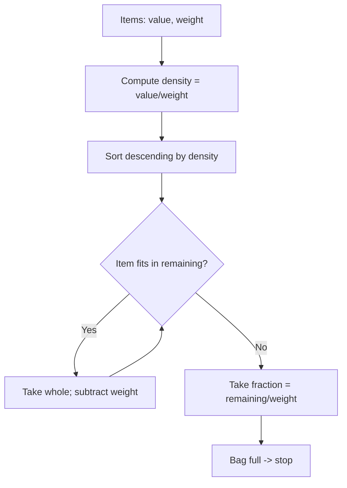

# Fractional Knapsack — Junior Level

> **One-line summary:** The Fractional Knapsack problem lets you take **fractions** of items into a bag of fixed capacity. The greedy rule is dead simple and provably optimal: sort items by **value-per-unit-weight** (`value / weight`), grab the densest item first, then the next, and so on — taking a *fraction* of the last item to fill the bag exactly to capacity.

---

## Table of Contents

1. [Introduction](#introduction)
2. [Prerequisites](#prerequisites)
3. [Glossary](#glossary)
4. [Core Concepts](#core-concepts)
5. [Big-O Summary](#big-o-summary)
6. [Real-World Analogies](#real-world-analogies)
7. [Pros & Cons](#pros--cons)
8. [Step-by-Step Walkthrough](#step-by-step-walkthrough)
9. [Code Examples](#code-examples)
10. [Coding Patterns](#coding-patterns)
11. [Error Handling](#error-handling)
12. [Performance Tips](#performance-tips)
13. [Best Practices](#best-practices)
14. [Edge Cases & Pitfalls](#edge-cases--pitfalls)
15. [Common Mistakes](#common-mistakes)
16. [Cheat Sheet](#cheat-sheet)
17. [Visual Animation](#visual-animation)
18. [Summary](#summary)
19. [Further Reading](#further-reading)

---

## Introduction

Imagine you are a gold-and-spice merchant with a single sack that can hold only `W` kilograms. In front of you sit several piles of goods: gold dust, saffron, sugar, sand. Each pile has a **total weight** and a **total value**, and — crucially — you are allowed to scoop out *any fraction* of a pile. You do not have to take the whole pile or none of it; you can take 37% of the saffron if you like. **Which scoops maximize the value you carry away?**

This is the **Fractional Knapsack problem**. The word "fractional" is the entire point: because you can split items, the problem has a beautifully simple optimal strategy, and that strategy is **greedy**.

The greedy insight is this: a kilogram in your sack is a kilogram you can never get back, so you should spend each kilogram of capacity on the **most valuable-per-kilogram** good available. Compute, for every item, its **density** `ratio = value / weight` — the value of one kilogram of that item. Then:

1. **Sort** items from highest density to lowest.
2. **Take** whole items greedily, densest first, while they fit.
3. When the next item does not fully fit, **take a fraction** of it — exactly enough to top the sack off to capacity `W`.

That is the whole algorithm. It runs in `O(n log n)` time (dominated by the sort), and — unlike its famous sibling the **0/1 Knapsack** (where you must take each item whole or not at all) — the greedy choice here is **provably optimal**. The ability to take fractions is exactly what makes greed work.

A warning you must internalize early: **this greedy strategy is optimal ONLY because fractions are allowed.** For the 0/1 version (no splitting), the same "sort by density" greed can be wrong, and you need dynamic programming instead. We will return to this contrast again and again — it is the single most-tested idea around this topic.

---

## Prerequisites

Before reading this file you should be comfortable with:

- **Arrays / lists** — storing items as `(value, weight)` pairs.
- **Sorting** — and the idea of a **custom comparator** (sorting by a computed key rather than the raw values). The sibling `sorting-algorithms` skill covers this.
- **Floating-point arithmetic** — the answer is generally a real number (because of the fraction), so we use `double` / `float`.
- **Big-O notation** — `O(n log n)` for the sort.
- **The idea of a "greedy" algorithm** — making the locally best choice at each step and never undoing it. The parent topic `14-greedy-algorithms` and the `greedy-algorithms` skill introduce this.

Optional but helpful:

- A glance at **0/1 Knapsack** (the DP version) so you can appreciate the contrast. We summarize it here; `middle.md` and `professional.md` go deeper.
- A little intuition about **exchange arguments** (why "swap toward the better choice" proves optimality) — fully developed in `professional.md`.

---

## Glossary

| Term | Meaning |
|------|---------|
| **Item** | A good with a total `value` and total `weight`. You may take any fraction `0 ≤ f ≤ 1` of it. |
| **Capacity `W`** | The maximum total weight the knapsack (bag) can hold. |
| **Density / ratio** | `value / weight` — the value of one unit of weight of that item. The key sorting key. |
| **Greedy choice** | Always take from the item with the highest remaining density first. |
| **Fraction `f`** | A number in `[0, 1]` saying how much of an item you take. The last item taken often gets a fraction `< 1`. |
| **Fractional Knapsack** | The variant where items may be split — greedy is optimal. |
| **0/1 Knapsack** | The variant where each item is all-or-nothing — greedy can fail; needs DP. |
| **Optimal solution** | A selection of fractions maximizing total value subject to total weight `≤ W`. |
| **Exchange argument** | A proof technique: show any non-greedy solution can be improved (or matched) by swapping toward the greedy choice. |
| **Quickselect** | A selection algorithm to find a pivot density in `O(n)` average — an optimization over full sorting (see `senior.md`). |

---

## Core Concepts

### 1. Density Is King

Every kilogram of capacity is a scarce, non-refundable resource. The value you can extract per kilogram differs by item — that is the **density** `value / weight`. Spending a kilogram on a high-density item is strictly better than spending it on a low-density one. So the *only* thing that matters when ranking items is their density.

```
item:    gold   saffron  sugar  sand
value:    60      100      120    10
weight:   10       20       30    50
density:  6.0      5.0      4.0    0.2
```

Sorted by density: gold (6), saffron (5), sugar (4), sand (0.2). That order is the order you fill the bag.

### 2. Take Whole, Then Take a Fraction

Walking the sorted list, you take each item **whole** as long as it fits in the remaining capacity. The moment an item does not fully fit, you take the **fraction** of it that exactly fills the remaining space, and then you stop — the bag is full.

```
remaining = W
for each item in sorted-by-density order:
    if item.weight <= remaining:
        take all of it;  value += item.value;  remaining -= item.weight
    else:
        take fraction f = remaining / item.weight
        value += f * item.value;  remaining = 0
        break        # bag is full
```

### 3. Why Greedy Works Here (Intuition)

Suppose your final bag does NOT spend its last bit of capacity on the densest available item. Then there is some capacity going to a lower-density item while a higher-density item is only partially used (or unused). **Swap** a tiny bit of weight from the low-density item to the high-density one: same weight, strictly more value. So any non-greedy filling can be improved — meaning the greedy filling is optimal. This "swap toward the better item" reasoning is the **exchange argument**, proved rigorously in `professional.md`.

The swap only works because we can move *a tiny bit* of weight — i.e., because **fractions are allowed.** That is precisely why the same trick fails for 0/1 Knapsack.

### 4. The Contrast with 0/1 Knapsack (Preview)

In **0/1 Knapsack** you must take each item whole or skip it. Greedy-by-density can be badly wrong there. Classic counterexample with `W = 10`:

```
item A: value 60, weight 10  -> density 6.0
item B: value 100, weight 20 ... (too heavy)
```

Better example: `W = 50`, items `(60,10)`, `(100,20)`, `(120,30)`. Fractional greedy gives `240`. The 0/1 optimum is `220` (take the `100`+`120` items, weight `50`) — greedy-by-density would take `(60,10)+(100,20)` then a fraction it *cannot* take, so the all-or-nothing version needs DP. The lesson: **fractional → greedy; 0/1 → dynamic programming.** `middle.md` develops this fully.

### 5. The Last Fraction

In an optimal fractional solution, **at most one item is taken fractionally** — the one where the bag fills up. Everything before it is taken whole; everything after it is taken not at all. This "one partial item" structure is a hallmark of the problem and a frequent interview point.

---

## Big-O Summary

| Step | Time | Space | Notes |
|------|------|-------|-------|
| Compute densities | `O(n)` | `O(1)` extra | One pass over items. |
| Sort by density (descending) | `O(n log n)` | `O(log n)`–`O(n)` | Dominant cost in the standard algorithm. |
| Greedy fill | `O(n)` | `O(1)` | One pass over sorted items. |
| **Total (sort-based)** | **`O(n log n)`** | **`O(n)`** | Standard textbook approach. |
| Selection-based (quickselect) | `O(n)` average | `O(1)`–`O(n)` | Avoid full sort; see `senior.md`. |

The sort dominates. If you only need the optimal **value** (not the full sorted order), a clever `O(n)` quickselect-style partition around the "critical density" suffices — that is a senior-level optimization.

---

## Real-World Analogies

| Concept | Analogy |
|---------|---------|
| Items with value & weight | Goods at a market, each with a price and a mass. |
| Capacity `W` | The size of your single carrying sack. |
| Density `value/weight` | "Bang for the buck per kilogram" — value of one kilo of that good. |
| Greedy by density | A trader who always reaches for the most valuable-per-kilo good first. |
| Taking a fraction | Pouring gold dust until the sack is full — you can stop mid-pour. |
| 0/1 contrast | Trying to pack indivisible suitcases into a car trunk — you cannot take "half a suitcase." |
| At most one partial item | Only the final pour is partial; everything before is a full pile, everything after is left behind. |

Where the analogy breaks: real goods are often **indivisible** (you cannot take 0.4 of a laptop), and *that* indivisibility is exactly the jump from this easy fractional problem to the hard 0/1 problem. Fractional Knapsack is the friendly cousin precisely because its goods pour like sand.

---

## Pros & Cons

| Pros | Cons |
|------|------|
| Simple greedy rule: sort by density, fill. | Only valid when items are **divisible** (fractions allowed). |
| Provably optimal — no DP table needed. | Uses floating point; needs care with rounding/precision. |
| Fast: `O(n log n)`, or `O(n)` with quickselect. | The greedy intuition tempts people to (wrongly) apply it to 0/1 Knapsack. |
| Tiny memory: `O(1)` beyond the item list. | Ties in density need a defined (but value-irrelevant) order. |
| Easy to extend (resource allocation, scheduling-like splits). | Not applicable when an item must be taken whole or skipped. |
| The exchange-argument proof is short and teachable. | Real-world goods are often indivisible, limiting direct use. |

**When to use:** any resource-allocation problem where a budget/capacity is filled by **divisible** resources ranked by efficiency — fuel blending, bandwidth/CPU allocation by "value per unit," cutting stock that can be sliced, portfolio "fill by best return-per-dollar" toy models.

**When NOT to use:** when items are indivisible (0/1 Knapsack — use DP), when there are extra constraints (multiple capacities, dependencies), or when value is non-linear in the fraction taken.

---

## Step-by-Step Walkthrough

Let us solve a concrete instance. Capacity `W = 50`. Items (value, weight):

```
item 0:  value 60,  weight 10
item 1:  value 100, weight 20
item 2:  value 120, weight 30
```

**Step 1 — Compute densities.**

```
item 0:  60 / 10  = 6.0
item 1: 100 / 20  = 5.0
item 2: 120 / 30  = 4.0
```

**Step 2 — Sort by density (descending).** They are already in order: `[0 (6.0), 1 (5.0), 2 (4.0)]`.

**Step 3 — Greedy fill, `remaining = 50`.**

- **Item 0** (weight 10): fits (`10 ≤ 50`). Take all. `value = 60`, `remaining = 40`.
- **Item 1** (weight 20): fits (`20 ≤ 40`). Take all. `value = 60 + 100 = 160`, `remaining = 20`.
- **Item 2** (weight 30): does **not** fully fit (`30 > 20`). Take fraction `f = remaining / weight = 20 / 30 = 0.6667`. Add `0.6667 × 120 = 80`. `value = 160 + 80 = 240`, `remaining = 0`. **Bag full — stop.**

**Result: maximum value = 240.0**, taking item 0 fully, item 1 fully, and two-thirds of item 2.

Note the structure: items 0 and 1 are whole, item 2 is the single partial item, and nothing comes after it. That "one partial item" pattern always holds.

**Sanity contrast (0/1 version):** if we could NOT take fractions, the best whole-item packing within `W = 50` is items 1 and 2 (`100 + 120 = 220`, weight `50`). So fractional (`240`) beats what 0/1 (`220`) can do — the freedom to pour the extra two-thirds of item 2 is worth `20` more. This is *why* the two problems are genuinely different.

### Two more worked instances

It helps to see the algorithm hit each branch. Reuse the same three items but vary the capacity.

**Instance A — `W = 5` (smaller than every item).** Sorted order is still `[0, 1, 2]`. Item 0 has weight 10 > remaining 5, so we *immediately* slice it: `f = 5/10 = 0.5`, value `0.5 × 60 = 30`. Bag full. **Answer = 30.** Notice the very first item is the partial one — there is no "whole" item at all when capacity is tiny.

**Instance B — `W = 100` (larger than total weight `60`).** Item 0 (10) fits → value 60, remaining 90. Item 1 (20) fits → value 160, remaining 70. Item 2 (30) fits → value 280, remaining 40. The loop ends with the bag *not even full* and **no fractional item**. **Answer = 280** = sum of all values. When capacity exceeds total supply, you simply take everything.

These two extremes — "slice the first item" and "take everything, slice nothing" — together with the main walkthrough ("take some whole, slice one") cover every shape the answer can take. In all three, **at most one** item is ever sliced.

---

## Code Examples

### Example: Fractional Knapsack — Maximum Value

We compute the density of each item, sort descending, and fill greedily, taking a fraction of the last item. All three programs print `240` for the walkthrough instance.

#### Go

```go
package main

import (
	"fmt"
	"sort"
)

// Item has a value and a weight; we may take any fraction of it.
type Item struct {
	value  float64
	weight float64
}

// fractionalKnapsack returns the maximum value obtainable in a knapsack of
// capacity W when items may be split. Greedy by value/weight density.
func fractionalKnapsack(W float64, items []Item) float64 {
	// Sort by density descending. Copy so we do not mutate the caller's slice.
	sorted := append([]Item(nil), items...)
	sort.Slice(sorted, func(i, j int) bool {
		return sorted[i].value/sorted[i].weight > sorted[j].value/sorted[j].weight
	})

	remaining := W
	total := 0.0
	for _, it := range sorted {
		if it.weight <= remaining {
			total += it.value // take the whole item
			remaining -= it.weight
		} else {
			f := remaining / it.weight // take just enough to fill the bag
			total += f * it.value
			break // bag is full
		}
	}
	return total
}

func main() {
	items := []Item{{60, 10}, {100, 20}, {120, 30}}
	fmt.Printf("%.4f\n", fractionalKnapsack(50, items)) // 240.0000
}
```

#### Java

```java
import java.util.*;

public class FractionalKnapsack {
    // Maximum value in a knapsack of capacity W when items may be split.
    static double fractionalKnapsack(double W, double[][] items) {
        // items[i] = {value, weight}. Sort by density descending.
        Double[][] sorted = new Double[items.length][2];
        for (int i = 0; i < items.length; i++) {
            sorted[i][0] = items[i][0];
            sorted[i][1] = items[i][1];
        }
        Arrays.sort(sorted, (a, b) ->
            Double.compare(b[0] / b[1], a[0] / a[1])); // descending by value/weight

        double remaining = W, total = 0.0;
        for (Double[] it : sorted) {
            double value = it[0], weight = it[1];
            if (weight <= remaining) {
                total += value;            // take the whole item
                remaining -= weight;
            } else {
                total += (remaining / weight) * value; // take a fraction
                break;                     // bag is full
            }
        }
        return total;
    }

    public static void main(String[] args) {
        double[][] items = {{60, 10}, {100, 20}, {120, 30}};
        System.out.printf("%.4f%n", fractionalKnapsack(50, items)); // 240.0000
    }
}
```

#### Python

```python
def fractional_knapsack(W, items):
    """Maximum value in a knapsack of capacity W when items may be split.
    items: list of (value, weight). Greedy by value/weight density."""
    # Sort by density descending.
    order = sorted(items, key=lambda it: it[0] / it[1], reverse=True)

    remaining = W
    total = 0.0
    for value, weight in order:
        if weight <= remaining:
            total += value              # take the whole item
            remaining -= weight
        else:
            total += (remaining / weight) * value  # take a fraction
            break                        # bag is full
    return total


if __name__ == "__main__":
    items = [(60, 10), (100, 20), (120, 30)]
    print(f"{fractional_knapsack(50, items):.4f}")  # 240.0000
```

**What it does:** sorts items by density, then fills the bag greedily, slicing the last item to exactly hit capacity.
**Run:** `go run main.go` | `javac FractionalKnapsack.java && java FractionalKnapsack` | `python knapsack.py`

---

## Coding Patterns

### Pattern 1: Sort by a Computed Key (Density)

**Intent:** Do not store density separately if your language supports a comparator; compute `value/weight` inside the comparator. (For large `n`, precompute it once to avoid recomputing in every comparison — see Performance Tips.)

```python
order = sorted(items, key=lambda it: it[0] / it[1], reverse=True)
```

### Pattern 2: Whole-Then-Fraction Fill Loop

**Intent:** A single loop handles both the "take all" and "take a fraction" cases; `break` after the fraction because the bag is full.

```python
remaining, total = W, 0.0
for value, weight in order:
    if weight <= remaining:
        total += value
        remaining -= weight
    else:
        total += (remaining / weight) * value
        break
```

### Pattern 3: Return the Chosen Fractions, Not Just the Value

**Intent:** Sometimes you need *what* to take, not just the max value. Record a fraction per item.

```python
def knapsack_plan(W, items):
    order = sorted(enumerate(items), key=lambda p: p[1][0] / p[1][1], reverse=True)
    remaining = W
    plan = [0.0] * len(items)   # fraction taken of each original item
    for idx, (value, weight) in order:
        if weight <= remaining:
            plan[idx] = 1.0
            remaining -= weight
        else:
            plan[idx] = remaining / weight
            break
    return plan
```



---

## Error Handling

| Error | Cause | Fix |
|-------|-------|-----|
| Division by zero in density | An item has `weight == 0`. | A zero-weight item with positive value is "free value": take it fully (treat density as `+∞`), or filter and add its value unconditionally. Document the rule. |
| Wrong (too-low) answer | Sorted **ascending** instead of descending. | Sort by density **descending** (highest first). |
| Off-by-a-bit answer | Floating-point rounding accumulated over many items. | Acceptable for most uses; print with fixed precision, or use exact rationals if the grader is strict. |
| Negative capacity or negative weights | Bad input. | Validate: `W ≥ 0`, `weight > 0`. Reject or clamp invalid input. |
| Took more than capacity | Forgot to `break` after the fraction, or compared `<` vs `<=` wrong. | After a fractional take, `remaining = 0` and you must `break`. |
| Mutated caller's list | Sorted the input slice in place. | Sort a copy if the caller still needs the original order. |
| Applied this to indivisible items | Used fractional greedy on a 0/1 problem. | If items cannot be split, use the 0/1 DP (`dynamic-programming` skill). |

---

## Performance Tips

- **Precompute density once.** Comparators may call the key function `O(n log n)` times; computing `value/weight` repeatedly is wasteful. Store density in the struct (or a parallel array) before sorting.
- **Avoid the division in comparisons.** Compare `a.value * b.weight` vs `b.value * a.weight` (cross-multiplication) to dodge floating-point division and its error — assuming weights are positive. This also enables exact integer comparison.
- **Use quickselect for value-only queries.** If you only need the maximum value (not the full ordering), an `O(n)` partition around the critical density beats the `O(n log n)` sort — see `senior.md`.
- **Stop early.** `break` the moment the bag fills; you never need to look at items past the partial one.
- **Reuse buffers.** If you solve many instances of the same size, reuse the sort buffer to avoid re-allocation.

---

## Best Practices

- Sort by density **descending** and document it loudly — the most common bug is the wrong direction.
- Decide and document the **zero-weight** policy up front (treat as infinite density / free value).
- Prefer **cross-multiplication** over division in the comparator for both speed and numerical robustness when weights are positive integers.
- Keep the fill loop tiny and `break` immediately after the fractional take.
- Write a brute-force or DP check on small instances to confirm your greedy value, and always test the "one partial item" structure.
- Make the function **pure**: do not mutate the caller's item list; sort a copy.
- Clearly separate "max value" from "the plan" (fractions) — expose both if callers need them.

---

## Edge Cases & Pitfalls

- **Capacity larger than total weight** — you take *everything* (all fractions = 1), and the answer is the sum of all values. The loop never enters the fractional branch.
- **Capacity zero** — you take nothing; the answer is `0`.
- **A single item heavier than `W`** — you take a fraction of just that item: `(W / weight) * value`.
- **Zero-weight items** — infinite density; take them all for free. Guard the division.
- **Ties in density** — any order among equal-density items gives the same total value (they are interchangeable per unit weight). Pick a stable tie-break for deterministic *plans*.
- **Negative values or weights** — outside the standard problem; reject or define behavior explicitly.
- **Indivisible items** — the cardinal mistake: this is then 0/1 Knapsack and greedy may be suboptimal. Use DP.
- **Floating-point output** — `240.0000000001`; round for display, or use exact arithmetic if required.

---

## Common Mistakes

1. **Sorting ascending instead of descending** — fills the bag with the *worst* items first; the most common bug.
2. **Forgetting the fractional take** — taking only whole items leaves capacity unused and undershoots the optimum.
3. **Not breaking after the fraction** — keeps adding items past full, overshooting capacity.
4. **Applying greedy to 0/1 Knapsack** — the classic trap; greedy-by-density is *not* optimal when items are indivisible.
5. **Dividing by zero** — a zero-weight item crashes the density computation; handle it.
6. **Recomputing density in every comparison** — slow; precompute once.
7. **Mutating the input** — sorting the caller's array in place causes surprising bugs elsewhere.
8. **Comparing weight with `<` when it should be `<=`** — an item whose weight equals the remaining capacity should be taken **whole**, not fractionally.

---

## Cheat Sheet

| Step | Operation |
|------|-----------|
| 1. Density | For each item: `ratio = value / weight`. |
| 2. Sort | Order items by `ratio` **descending**. |
| 3. Fill | While capacity remains, take whole items; take a fraction of the one that does not fit. |
| 4. Stop | After the fractional take, the bag is full — `break`. |

Key facts:

```
greedy key      = value / weight  (density), sort DESCENDING
take whole while item.weight <= remaining
take fraction f = remaining / weight  for the one that does not fit
at most ONE item is taken fractionally
optimal because fractions are allowed (exchange argument)
complexity      = O(n log n)  (sort);  O(n) with quickselect
0/1 Knapsack    = items indivisible -> greedy may FAIL -> use DP
```

Tiny verified examples:

```
W=50, items (60,10)(100,20)(120,30)   -> 240.0
W=10, item  (60,10)                    -> 60.0
W=10, item  (100,20)                   -> 50.0  (half of it)
W=0,  anything                         -> 0.0
```

---

## Walkthrough Recap Table

A compact trace of the main `W = 50` instance, one row per loop iteration, makes the state changes explicit:

| Iteration | Item (sorted) | Density | Weight | Remaining before | Action | Value added | Remaining after |
|-----------|---------------|---------|--------|------------------|--------|-------------|-----------------|
| 1 | 0 | 6.0 | 10 | 50 | take whole | 60 | 40 |
| 2 | 1 | 5.0 | 20 | 40 | take whole | 100 | 20 |
| 3 | 2 | 4.0 | 30 | 20 | slice `20/30` | 80 | 0 |

Total value `60 + 100 + 80 = 240`. The "Remaining after" column reaching `0` on iteration 3 is the signal to `break`. Building this table by hand for a few instances is the fastest way to internalize the loop before you trust the code.

---

## Visual Animation

> See [`animation.html`](./animation.html) for an interactive visualization of Fractional Knapsack.
>
> The animation demonstrates:
> - An editable list of items with live-computed densities `value/weight`
> - Sorting the items by density (highest first)
> - The knapsack filling up bar-by-bar as whole items are taken
> - The final item being **sliced** to a fraction to top off the bag exactly
> - A running total value and the remaining capacity
> - A side-by-side hint of how the 0/1 (no-fraction) answer would differ

---

## Summary

The Fractional Knapsack problem asks for the maximum value you can carry in a fixed-capacity bag when items can be split. The optimal strategy is purely greedy and famously short: rank items by **density** `value/weight`, take the densest first, and slice the last item to fill the bag exactly. It runs in `O(n log n)` (the sort), uses `O(1)` extra space, and yields **at most one fractionally-taken item**. Its optimality follows from a one-line **exchange argument** — any non-greedy filling can be improved by shifting weight toward a denser item — and that argument works *only* because fractions are allowed. The all-important caveat: do **not** carry this greed over to the **0/1 Knapsack**, where items are indivisible and you must use dynamic programming. Master the four steps — density, sort, fill, slice — and you have mastered the junior core.

---

## Further Reading

- Cormen, Leiserson, Rivest, Stein, *Introduction to Algorithms* (CLRS), §16.2 — "Elements of the greedy strategy" presents Fractional Knapsack and its proof.
- Kleinberg & Tardos, *Algorithm Design*, Ch. 4 — greedy algorithms and exchange arguments.
- Sibling topic `04-job-sequencing` / `01-activity-selection` — other greedy classics with exchange-argument proofs.
- Sibling topic in `15-dynamic-programming` — **0/1 Knapsack** DP, the indivisible counterpart.
- The `greedy-algorithms` skill — when locally optimal choices yield globally optimal solutions.
- The `dynamic-programming` skill — for the 0/1 variant where greedy fails.
</content>
</invoke>
