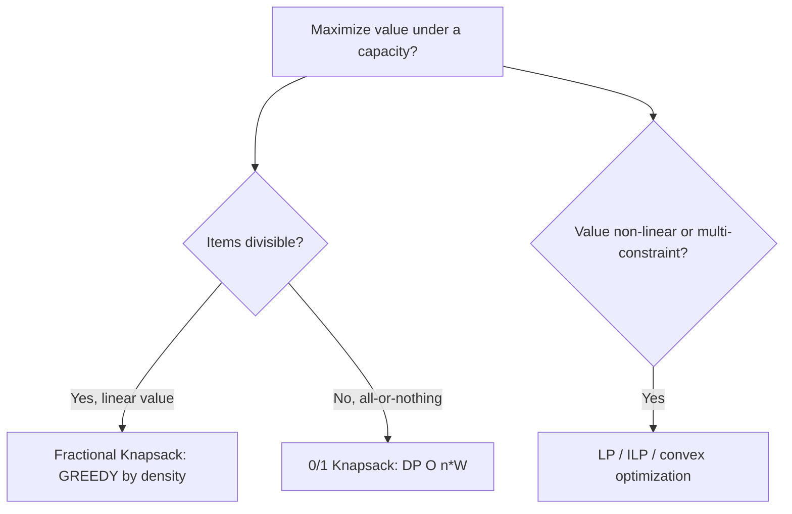

# Fractional Knapsack — Middle Level

> At the middle level the question shifts from *"how do I fill the bag"* to *"why is greedy correct here, when is it the right tool, and how does it relate to its harder sibling — 0/1 Knapsack?"* The headline: Fractional Knapsack is the canonical example where a greedy density rule is provably optimal, and the single reason is that **items are divisible**. Remove divisibility and the same greed collapses, forcing dynamic programming.

## Table of Contents
1. [Introduction](#1-introduction)
2. [Why Greedy Is Optimal (the Exchange Argument)](#2-why-greedy-is-optimal-the-exchange-argument)
3. [Fractional vs 0/1 Knapsack — The Core Contrast](#3-fractional-vs-01-knapsack--the-core-contrast)
4. [When to Use It (and When Not)](#4-when-to-use-it-and-when-not)
5. [Variants and Generalizations](#5-variants-and-generalizations)
6. [Implementation Deep-Dive](#6-implementation-deep-dive)
7. [Code: Value, Plan, and a 0/1 Comparison](#7-code-value-plan-and-a-01-comparison)
8. [Complexity Analysis](#8-complexity-analysis)
9. [Testing Strategy](#9-testing-strategy)
10. [Common Misconceptions](#10-common-misconceptions)
11. [Summary](#11-summary)

---

## 1. Introduction

You already know the recipe from `junior.md`: density, sort, fill, slice. The middle level is about *judgment* — knowing why the recipe is correct, recognizing when a real problem is "fractional" versus "0/1," and being able to defend the greedy choice under interview pressure.

Three questions organize this file:

1. **Why** is sorting by `value/weight` and filling greedily *guaranteed* optimal? (Exchange argument.)
2. **When** does a real-world problem qualify as fractional, and when is it secretly 0/1? (Divisibility test.)
3. **How** do the two problems differ in structure, complexity, and code? (Greedy `O(n log n)` vs DP `O(nW)`.)

Getting these right is what separates "I memorized the algorithm" from "I understand why it works and when to reach for it."

A useful framing: Fractional Knapsack is the *easy* member of a family whose other members are hard. Knowing precisely *which* assumption (divisibility, linearity, single capacity) buys the easiness — and what breaks when each is removed — is the real middle-level competency. The algorithm itself is four lines; the judgment around it is the skill.

---

### 1.1 Mental model: the "fill the bag with the best per-kilo first" rule

Before the formalism, hold one image: capacity is a *budget of weight*, and each unit of that budget should buy the most value possible. Since item `i` returns `vᵢ/wᵢ` value per unit of weight, you spend the budget on the highest return-per-unit first, exactly as a rational shopper with a fixed amount of cargo space would. The only subtlety is the *last* purchase: when the next best item does not fully fit, you buy just enough of it to spend the remaining budget. Everything in the algorithm — and its proof — flows from this single principle of "best return per unit of the scarce resource."

This is the same principle behind **water-filling** in signal processing and **marginal-value** reasoning in economics; Fractional Knapsack is its discrete, teachable face. Keeping the principle (not the code) in mind is what lets you recognize the problem when it appears disguised as bandwidth allocation, budget pacing, or fuel blending.

---

## 2. Why Greedy Is Optimal (the Exchange Argument)

> **Two ingredients to remember.** A greedy algorithm is optimal when the problem has both the *greedy-choice property* (a locally optimal choice is part of some global optimum) and *optimal substructure* (the optimum decomposes into an optimal sub-solution plus that choice). Fractional Knapsack has both; the exchange argument below is the standard tool for *establishing* the greedy-choice property.

The greedy strategy says: process items in non-increasing density order, taking each as fully as capacity allows. Here is the argument that this is optimal. (The fully formal version with all cases is in `professional.md`; this is the working intuition every middle engineer should be able to reproduce on a whiteboard.)

**Claim.** Let `G` be the greedy solution and `O` any optimal solution. Then `value(G) = value(O)`.

**Setup.** A *solution* assigns each item `i` a fraction `xᵢ ∈ [0, 1]`, with `Σ xᵢ·wᵢ ≤ W`. Its value is `Σ xᵢ·vᵢ`. Order items so that `v₁/w₁ ≥ v₂/w₂ ≥ … ≥ vₙ/wₙ` (densest first).

**Key observation: an optimal solution fills the bag completely** whenever total weight `≥ W` (otherwise add a sliver of any unused item with positive value — strictly better, contradiction). So `Σ xᵢ·wᵢ = W` in the interesting case.

**Exchange step.** Suppose `O` differs from `G`. Then there exist indices `j < k` (so `densityⱼ ≥ densityₖ`) with `O` taking *less* of the denser item `j` than greedy would (`xⱼ < 1` while capacity is used on `k`) and *more* of the less-dense item `k`. Move a small weight `δ > 0` of capacity from `k` to `j`:

- Weight unchanged (we removed `δ` of weight from `k`, added `δ` of weight to `j`).
- Value change `= δ·(vⱼ/wⱼ) − δ·(vₖ/wₖ) = δ·(densityⱼ − densityₖ) ≥ 0`.

So the swap **does not decrease** value and moves `O` one step closer to `G`. Repeat finitely many times; we reach `G` without ever losing value. Therefore `value(G) ≥ value(O)`, and since `O` is optimal, `value(G) = value(O)`. ∎

**The crux:** the swap moves a *small δ of weight*. That is only possible because items are **divisible**. If `j` and `k` were all-or-nothing, you could not shift `δ`, and the argument breaks — which is exactly why 0/1 Knapsack is not solved by greed.

**Greedy-choice property + optimal substructure.** Two ingredients make greedy work (the `greedy-algorithms` skill names these): (1) the *greedy-choice property* — taking as much of the densest item as fits is part of *some* optimal solution; (2) *optimal substructure* — after that choice, the remaining problem (reduced capacity, remaining items) is a smaller Fractional Knapsack whose optimal solution combines with the greedy choice. Both hold here.

---

## 3. Fractional vs 0/1 Knapsack — The Core Contrast

This is the single most important comparison around this topic. Memorize it.

| Aspect | **Fractional Knapsack** | **0/1 Knapsack** |
|--------|------------------------|------------------|
| Item rule | Take any fraction `0 ≤ x ≤ 1` | All-or-nothing: `x ∈ {0, 1}` |
| Optimal algorithm | **Greedy** by `value/weight` | **Dynamic programming** (or branch & bound) |
| Is greedy optimal? | **Yes**, provably | **No** — greedy-by-density can fail |
| Time complexity | `O(n log n)` (sort); `O(n)` with quickselect | `O(n·W)` pseudo-polynomial DP |
| Space | `O(1)` extra | `O(W)` (rolling array) or `O(n·W)` |
| Answer type | Real number (a fraction appears) | Integer-combinatorial selection |
| Partial items in solution | At most **one** | **Zero** — every item is in or out |
| Complexity class | P (strongly polynomial) | NP-complete (decision) |
| Why the difference | Divisibility enables the exchange swap | Indivisibility blocks the swap |

### A concrete counterexample (why greedy fails for 0/1)

`W = 50`. Items `(value, weight)`: `A=(60,10)`, `B=(100,20)`, `C=(120,30)`. Densities: `A=6.0`, `B=5.0`, `C=4.0`.

- **Fractional greedy:** take `A` (10), `B` (20), then `2/3` of `C` → `60 + 100 + 80 = 240`. Optimal.
- **0/1 greedy-by-density:** take `A` (10), `B` (20) → weight 30, value 160. `C` (30) does not fit; you cannot take a fraction. Greedy yields **160**.
- **0/1 optimum:** take `B` + `C` → weight 50, value **220**. Greedy (160) is worse than optimal (220).

So greedy-by-density is not just "a bit off" for 0/1 — it can miss the optimum entirely. The fix for 0/1 is the DP recurrence:

```
dp[i][c] = max( dp[i-1][c],                       # skip item i
                dp[i-1][c - wᵢ] + vᵢ )            # take item i (if wᵢ ≤ c)
```

filled for `i = 1..n`, `c = 0..W`, in `O(n·W)`. The `dynamic-programming` skill develops this.

### Why the same numbers behave differently

In the fractional world, item `C`'s lower density is harmless — you take just `2/3` of it to use leftover capacity. In the 0/1 world, you must commit to a whole item, so a slightly-less-dense-but-better-fitting combination (`B+C`) can beat the greedy prefix (`A+B`). **Fitting matters when you cannot split; density alone suffices when you can.**

---

### 3.1 A second counterexample, and why "fix-ups" fail for 0/1

Engineers new to the contrast often propose patches to make density-greedy work for 0/1: "what if I also try skipping the densest item?" or "what if I take the best of greedy-by-density and greedy-by-value?" These heuristics improve some cases but are *not* optimal in general. Here is a clean failure for the "best of density-greedy and value-greedy" heuristic:

`W = 6`. Items `(value, weight)`: `P=(7,3)`, `Q=(7,3)`, `R=(8,4)`. Densities: `P=Q≈2.33`, `R=2.0`.
- **Density-greedy:** take `P` then `Q` (weight 6, value 14). 
- **Value-greedy (by raw value):** take `R` (value 8, weight 4), then nothing fits well; value 8.
- **Best of the two:** 14.

Here greedy happens to be optimal (14). Now perturb: `W = 7`, items `P=(7,3)`, `Q=(7,3)`, `R=(9,4)`. Densities `2.33, 2.33, 2.25`.
- **Density-greedy:** `P`+`Q` = weight 6, value 14; `R` (weight 4) does not fit in remaining 1. Value **14**.
- **0/1 optimum:** `P`+`R` = weight 7, value **16**.

Greedy (14) misses the optimum (16). The point: there is *no* simple sort-and-sweep that solves 0/1 Knapsack optimally — the problem is NP-complete, so any polynomial greedy is provably suboptimal on some input. The only general remedies are exact (DP / branch-and-bound) or approximate (FPTAS). Do not chase a greedy fix-up; recognize the wall.

---

## 4. When to Use It (and When Not)

The decision hinges on one test: **are the resources divisible?**

**Use Fractional Knapsack (greedy) when:**

- Resources pour or split continuously: fuel, liquid, sand, bandwidth, CPU-seconds, money allocated by rate.
- You maximize total value/return under a single capacity/budget, and value is **linear** in the amount taken.
- You want speed and a tiny footprint and an easy proof.

**Use 0/1 Knapsack (DP) when:**

- Items are indivisible (a project is funded or not, a file is downloaded or not, a passenger boards or not).
- "Half an item" is meaningless.

**Use neither / something else when:**

- Value is **non-linear** in the fraction (diminishing returns) → convex/LP optimization.
- There are **multiple** capacities or side constraints → multidimensional knapsack, ILP.
- Items have dependencies ("can't take B without A") → constrained optimization.
- You need to *sample* or *enumerate* solutions rather than optimize a single value.



---

### 4.1 A divisibility checklist for real problems

When a stakeholder hands you a "pick the best subset under a budget" problem, run this checklist to decide which knapsack you actually have:

1. **Can a chosen item be partially used and still deliver proportional value?** If yes (fuel, bandwidth, money, time), it is fractional → greedy.
2. **Is the value of taking fraction `f` exactly `f × (full value)`?** Linearity is required. Diminishing returns break greed → optimization.
3. **Is there exactly one capacity constraint?** Multiple simultaneous limits (weight *and* volume) → multidimensional → not pure greedy.
4. **Are there dependencies or incompatibilities between items?** "Take B only with A," "A and C are mutually exclusive" → constrained → not pure greedy.
5. **Do you need a single optimal value/plan, or many candidate solutions?** Greedy gives one optimum; enumeration/sampling is a different problem.

Only when answers are (1) yes, (2) yes, (3) one, (4) none does the clean `O(n log n)` greedy apply. The discipline of running this checklist is what separates "I pattern-matched to knapsack" from "I verified the problem is actually fractional."

---

## 5. Variants and Generalizations

- **Continuous (LP) view.** Fractional Knapsack is a *linear program*: maximize `Σ vᵢxᵢ` subject to `Σ wᵢxᵢ ≤ W`, `0 ≤ xᵢ ≤ 1`. The greedy solution is exactly the LP optimum at a vertex of the feasible polytope — that is why at most one variable is strictly between 0 and 1 (a single "basic" fractional variable).
- **Minimization variant.** Minimize cost to *reach at least* a target (e.g., buy at least `W` units cheaply): sort by **lowest cost-per-unit** ascending and fill — the mirror image.
- **Multiple bags / bins.** Splitting across several capacities turns it into a transportation/assignment LP; pure greedy no longer suffices in general.
- **Bounded quantities.** If you can take up to `qᵢ` units of item `i` (not just one copy), the same density-greedy works — take from densest until exhausted, then the next. This is "continuous knapsack with supplies."
- **Profit/weight with deadlines or order constraints.** Becomes scheduling-flavored; see `senior.md`'s resource-allocation framing.
- **0/1 relaxation.** The fractional solution is an **upper bound** on the 0/1 optimum — this is the bound used in branch-and-bound solvers for 0/1 Knapsack. A neat bridge: solving the easy fractional problem *helps* solve the hard 0/1 problem by pruning.

---

### 5.1 The LP-relaxation bridge, in detail

The single most useful generalization for a working engineer is the **LP-relaxation bound** for 0/1 Knapsack. Because every 0/1-feasible vector `x ∈ {0,1}ⁿ` is also fractional-feasible (`{0,1} ⊂ [0,1]`), maximizing over the larger set cannot give a smaller optimum:

```
OPT_fractional(I)  ≥  OPT_0/1(I)   for every instance I.
```

So the fast greedy gives a *free upper bound* on the hard problem. Branch-and-bound solvers exploit this at every node of their search tree:

```
solve_01(items, W):
    sort items by density desc (once)
    best = 0
    dfs(i, capacity, value_so_far):
        best = max(best, value_so_far)
        bound = value_so_far + fractional(remaining items, capacity)  # the relaxation
        if bound <= best: return        # prune: this subtree cannot beat best
        # branch: take item i (if it fits), or skip it
        ...
```

The tighter the fractional bound, the more aggressively the tree is pruned — which is precisely why a fast, *correct* Fractional Knapsack is the inner loop of practical exact 0/1 solvers (Task 12 in `tasks.md` implements this). The pattern — *relax the hard constraint, solve the relaxation greedily, use it to bound the original* — recurs throughout integer programming and is worth internalizing here, where it is at its simplest.

### 5.2 The greedy-choice and exchange templates reused

Fractional Knapsack is a clean instance of two reusable greedy templates:

- **Sort-then-sweep.** Many greedy algorithms reduce to "sort by a clever key, then make one linear pass": activity selection (sort by finish time), Huffman-adjacent problems, job sequencing, and this. Recognizing the template lets you transfer the proof structure (exchange argument) across problems.
- **Exchange argument as a proof skeleton.** "Take any optimal solution; if it differs from greedy, find an improving/neutral swap toward greedy; conclude greedy is optimal." This skeleton proves activity selection, MST (Kruskal/Prim), and Fractional Knapsack alike. The only per-problem work is identifying the swap and showing it does not hurt the objective.

Carrying these templates means you do not memorize each greedy proof in isolation — you instantiate a pattern.

---

## 6. Implementation Deep-Dive

A few engineering refinements over the junior code:

**1. Precompute density (or cross-multiply).** Computing `value/weight` inside a comparator runs it `O(n log n)` times and uses floating-point division. Precompute once, or compare `aᵥ·b_w` vs `bᵥ·a_w` (valid for positive weights) to stay in exact integer arithmetic and avoid division error.

**2. Track the plan, not just the value.** Real callers usually want *what to take*. Carry an array of fractions indexed by the original item index.

**3. Handle zero-weight items.** A zero-weight, positive-value item has infinite density — always take it fully and for free. Filter these out (adding their value) before sorting to avoid division by zero.

**4. Stable, deterministic tie-breaking.** Equal-density items give the same *value*, but if you report a *plan*, break ties deterministically (e.g., by original index) so output is reproducible across runs and languages.

**5. Stop early.** `break` immediately after the fractional take — nothing past the partial item is ever taken.

---

### 6.1 Comparator pitfalls across languages

The "sort by density descending" step hides language-specific traps worth knowing:

- **Go.** `sort.Slice` is *not stable*; for deterministic tie-breaking among equal densities, add a secondary key (original index) in the less-function. Cross-multiplication (`v[a]*w[b] > v[b]*w[a]`) avoids float division but watch `int64` overflow for large inputs.
- **Java.** `Arrays.sort(Integer[], comparator)` uses a stable merge sort, but the comparator must be a *total order* — returning inconsistent results (e.g., from float rounding) can throw `IllegalArgumentException: Comparison method violates its general contract`. Cross-multiplication with `long` sidesteps this.
- **Python.** `sorted(..., key=...)` with `reverse=True` is stable and simplest, but the `key` is computed once per element (good). Using `functools.cmp_to_key` with cross-multiplication is the exact-integer route; it is slower than a plain key but avoids float ties.

In all three, the recurring lesson is: **a comparator built on floating-point division can violate the total-order contract near ties**, producing crashes (Java) or non-deterministic order (Go). Cross-multiplication in integers is the robust default whenever values and weights are integers.

---

## 7. Code: Value, Plan, and a 0/1 Comparison

The function returns both the optimal value and the per-item fraction plan. We also include a small 0/1 DP so you can see, in code, how the answers diverge. All three print the fractional value `240.0`, the plan `[1.0, 1.0, 0.6667]`, and the 0/1 value `220`.

#### Go

```go
package main

import (
	"fmt"
	"sort"
)

type Item struct {
	value, weight float64
	idx           int
}

// fractionalKnapsack returns (maxValue, fractionPerOriginalIndex).
func fractionalKnapsack(W float64, items []Item) (float64, []float64) {
	sorted := append([]Item(nil), items...)
	sort.Slice(sorted, func(i, j int) bool {
		return sorted[i].value/sorted[i].weight > sorted[j].value/sorted[j].weight
	})
	plan := make([]float64, len(items))
	remaining, total := W, 0.0
	for _, it := range sorted {
		if it.weight <= remaining {
			plan[it.idx] = 1.0
			total += it.value
			remaining -= it.weight
		} else {
			f := remaining / it.weight
			plan[it.idx] = f
			total += f * it.value
			break
		}
	}
	return total, plan
}

// knapsack01 is the indivisible DP, for contrast (integer weights).
func knapsack01(W int, vals, wts []int) int {
	dp := make([]int, W+1)
	for i := range vals {
		for c := W; c >= wts[i]; c-- {
			if dp[c-wts[i]]+vals[i] > dp[c] {
				dp[c] = dp[c-wts[i]] + vals[i]
			}
		}
	}
	return dp[W]
}

func main() {
	items := []Item{{60, 10, 0}, {100, 20, 1}, {120, 30, 2}}
	v, plan := fractionalKnapsack(50, items)
	fmt.Printf("fractional = %.1f, plan = %.4f\n", v, plan) // 240.0, [1 1 0.6667]
	fmt.Println("0/1        =", knapsack01(50, []int{60, 100, 120}, []int{10, 20, 30})) // 220
}
```

#### Java

```java
import java.util.*;

public class Knapsack {
    static double[] result = new double[2]; // value, leftover (demo)

    static double fractional(double W, double[][] items, double[] plan) {
        Integer[] order = new Integer[items.length];
        for (int i = 0; i < order.length; i++) order[i] = i;
        Arrays.sort(order, (a, b) ->
            Double.compare(items[b][0] / items[b][1], items[a][0] / items[a][1]));
        double remaining = W, total = 0.0;
        for (int idx : order) {
            double value = items[idx][0], weight = items[idx][1];
            if (weight <= remaining) {
                plan[idx] = 1.0; total += value; remaining -= weight;
            } else {
                double f = remaining / weight;
                plan[idx] = f; total += f * value;
                break;
            }
        }
        return total;
    }

    static int knapsack01(int W, int[] vals, int[] wts) {
        int[] dp = new int[W + 1];
        for (int i = 0; i < vals.length; i++)
            for (int c = W; c >= wts[i]; c--)
                dp[c] = Math.max(dp[c], dp[c - wts[i]] + vals[i]);
        return dp[W];
    }

    public static void main(String[] args) {
        double[][] items = {{60, 10}, {100, 20}, {120, 30}};
        double[] plan = new double[3];
        double v = fractional(50, items, plan);
        System.out.printf("fractional = %.1f, plan = %s%n", v, Arrays.toString(plan));
        System.out.println("0/1        = " +
            knapsack01(50, new int[]{60, 100, 120}, new int[]{10, 20, 30})); // 220
    }
}
```

#### Python

```python
def fractional_knapsack(W, items):
    """Return (max_value, plan) where plan[i] is the fraction of original item i."""
    order = sorted(range(len(items)), key=lambda i: items[i][0] / items[i][1],
                   reverse=True)
    plan = [0.0] * len(items)
    remaining, total = W, 0.0
    for i in order:
        value, weight = items[i]
        if weight <= remaining:
            plan[i] = 1.0; total += value; remaining -= weight
        else:
            f = remaining / weight
            plan[i] = f; total += f * value
            break
    return total, plan


def knapsack_01(W, vals, wts):
    """Indivisible DP, for contrast."""
    dp = [0] * (W + 1)
    for v, w in zip(vals, wts):
        for c in range(W, w - 1, -1):
            dp[c] = max(dp[c], dp[c - w] + v)
    return dp[W]


if __name__ == "__main__":
    items = [(60, 10), (100, 20), (120, 30)]
    v, plan = fractional_knapsack(50, items)
    print(f"fractional = {v:.1f}, plan = {[round(x, 4) for x in plan]}")  # 240.0, [1,1,0.6667]
    print("0/1        =", knapsack_01(50, [60, 100, 120], [10, 20, 30]))  # 220
```

**What it does:** computes the fractional optimum *and* the take-plan, alongside the 0/1 DP so the divergence (240 vs 220) is visible.
**Run:** `go run main.go` | `javac Knapsack.java && java Knapsack` | `python knapsack.py`

---

## 8. Complexity Analysis

| Quantity | Fractional (greedy) | 0/1 (DP) |
|----------|---------------------|----------|
| Time | `O(n log n)` sort + `O(n)` fill | `O(n·W)` |
| Time (selection variant) | `O(n)` average (quickselect) | — |
| Space | `O(1)` extra (or `O(n)` for plan) | `O(W)` rolling, `O(n·W)` full |
| Depends on `W`? | **No** | **Yes** — pseudo-polynomial |

Two subtle points:

- Fractional Knapsack is **strongly polynomial** in `n` — independent of the magnitude of `W` or the values. 0/1 Knapsack's DP is **pseudo-polynomial** (it scales with `W`), and the 0/1 decision problem is NP-complete. The divisibility relaxation does not just simplify the algorithm; it changes the complexity class.
- The `O(n)` selection variant (find the critical density by quickselect, sum the prefix) removes the sort entirely. It is the right tool when you only need the **value** and `n` is large. Details in `senior.md`.

---

### 8.1 Why `W` does not appear in the fractional complexity

A subtle but important point worth dwelling on: the fractional algorithm's `O(n log n)` has **no `W` term**, while the 0/1 DP's `O(nW)` does. This is not a cosmetic difference — it is a complexity-class boundary.

- The fractional algorithm processes each *item* a constant number of times. Capacity `W` only ever affects *how much* of the final item is sliced — a single division — never *how many operations* run. So time depends on `n` alone.
- The 0/1 DP fills a table indexed by capacity `0..W`, so its size — and thus time — scales with the *numeric value* of `W`. Since `W` is written in `O(log W)` bits, `O(nW)` is *exponential in the input size* — the definition of **pseudo-polynomial**.

The consequence: doubling all weights and `W` leaves the fractional runtime unchanged but doubles the 0/1 DP runtime. A fractional instance with `W = 10¹⁸` is trivial; the same magnitude makes the 0/1 DP table infeasible (forcing branch-and-bound or an FPTAS instead). This is the algorithmic shadow of the deeper truth that 0/1 Knapsack's decision problem is NP-complete while the fractional version is in P (indeed strongly polynomial).

### 8.2 Reading the complexity for the selection variant

The `O(n)` selection variant (developed in `senior.md`) computes the *value* without sorting. Its complexity story:

- **Expected `O(n)`** with random pivots — the same recurrence as randomized quickselect, `T(n) = T(3n/4) + O(n) = O(n)`.
- **Worst-case `O(n)`** with median-of-medians pivots, at a larger constant.
- It computes the **value** in linear time; the full **plan** needs either the sort or an extra linear pass to assign fractions around the critical density.

So the honest complexity table has two rows for "fractional": `O(n log n)` if you need the sorted plan, `O(n)` if you need only the value. Stating which you need is part of giving a correct complexity answer.

---

## 9. Testing Strategy

- **Known instances.** `W=50, (60,10)(100,20)(120,30) → 240.0`. `W=10, (60,10) → 60`. `W=10, (100,20) → 50` (half). `W=5, (60,10)(100,20)(120,30) → 30` (slice the first item). `W=100, same → 280` (take everything).
- **Boundary capacities.** `W=0 → 0`; `W ≥ Σwᵢ → Σvᵢ` (take everything, no fraction).
- **Empty input.** `n=0 → 0`, exercising the loop-never-runs path.
- **Single partial-item invariant.** Assert that in any returned plan, **at most one** fraction is strictly in `(0, 1)`. This is the single strongest structural check and should run on every test instance.
- **Monotonicity.** Increasing `W` never decreases the value. Adding an item never decreases it.
- **Scaling invariance.** Multiplying every value by a constant `c > 0` multiplies the optimal value by `c`; scaling all weights and `W` by `c > 0` leaves the optimal value unchanged. Both are quick sanity checks.
- **Greedy ≥ any whole-item packing.** The fractional value is an **upper bound** on the 0/1 value — assert `fractional ≥ knapsack01` on random instances. This doubles as a correctness check for both.
- **Sort-direction guard.** Deliberately sort ascending in a test and assert the value drops — confirming your production path sorts descending.
- **Pure-function check.** Assert the input item list is unchanged after the call (no in-place mutation).
- **Brute-force fractional check (LP).** For tiny instances, verify against an exact rational computation (cross-multiplied densities, exact fractions) to dodge float ambiguity.
- **Zero-weight items.** Confirm they are taken fully and add their full value.
- **Large inputs.** With values/weights near `10⁹`, confirm cross-multiplication uses a wide enough integer type (no overflow) and that the float fallback still rounds correctly.
- **Tie densities.** Confirm equal-density permutations all yield the same value.
- **One-oversized-item.** A single item heavier than `W` yields `(W/weight)·value` and is the sole (fractional) item.
- **Property-based testing.** Generate random instances and assert invariants rather than hard-coded answers: (a) value is monotone non-decreasing in `W`; (b) value never exceeds `Σvᵢ`; (c) total taken weight equals `min(W, Σwᵢ)`; (d) at most one fractional item; (e) `fractional ≥ knapsack01`. These catch whole classes of bugs that example tests miss (see the `property-based-testing` skill).
- **Differential testing.** Run the float implementation and the exact-rational implementation on the same random inputs and assert agreement to a tolerance; a divergence flags a numerical or logic bug in one of them.

---

## 10. Common Misconceptions

1. **"Greedy by density works for 0/1 too."** False — the headline trap. `B+C=220` beats greedy's `A+B=160`. Divisibility is essential.
2. **"Sort by value (or by weight)."** No — sort by the **ratio** `value/weight`. Sorting by value alone or weight alone is wrong.
3. **"Multiple items can be fractional."** No — at most **one** item is taken fractionally in an optimal solution (the LP basic variable).
4. **"It needs DP because knapsack does."** Only the 0/1 version needs DP. The fractional version is strictly easier — greedy and `O(n log n)`.
5. **"The fractional answer is always an integer."** Usually not — the slice produces a real number.
6. **"Bigger capacity might lower the value."** Never — value is monotonically non-decreasing in `W`.
7. **"You must take the highest-value item first."** No — highest *density*, not highest value. A huge-value, huge-weight item can be low density.
8. **"Greedy needs the items pre-sorted by the caller."** No — the algorithm sorts internally (or selects); the caller passes items in any order. Sorting a copy keeps the function pure.
9. **"The fractional and 0/1 answers are usually equal."** They coincide only when the greedy prefix happens to fill `W` exactly with whole items; in general fractional `>` 0/1, sometimes by a lot.
10. **"Cross-multiplication is always safe."** It is exact but can *overflow* fixed-width integers for large values/weights; use 128-bit or big integers past ~`2³¹` inputs.

---

## 10.5 Deeper Worked Comparison — Tracing Both Algorithms

To cement the contrast, trace both algorithms on `W = 50`, items `A=(60,10)`, `B=(100,20)`, `C=(120,30)` side by side.

**Fractional greedy (sorted by density `6, 5, 4`):**

| Step | Item | Fits? | Take | Running value | Remaining |
|------|------|-------|------|---------------|-----------|
| 1 | A | yes | whole | 60 | 40 |
| 2 | B | yes | whole | 160 | 20 |
| 3 | C | no | `20/30` | 240 | 0 |

Result **240**, one partial item (C).

**0/1 DP (`dp[c]` = best value with capacity `c`, processing A, B, C):**

```
after A (60,10):  dp[10..50] = 60
after B (100,20): dp[20] = 100, dp[30] = 160, dp[50] = 160 ...
after C (120,30): dp[30] = max(160, 120) = 160,
                  dp[50] = max(160, dp[20]+120 = 220) = 220
```

Result **220**, taking B and C whole (weight 50). The DP "discovers" that pairing B+C (filling capacity exactly with whole items) beats the density-greedy prefix A+B — something greedy structurally cannot see, because greedy commits to A first based on density alone.

**The takeaway in one sentence:** when you can pour, density is destiny; when you must pack whole, *fit* matters as much as density, and only an exhaustive method (DP) can balance the two.

---

## 10.6 Edge Cases the Middle Engineer Must Handle

Beyond the happy path, production-quality code addresses:

- **Empty item list.** Return `0`; the loop never runs.
- **`W = 0`.** Return `0`; the first item already fails `weight <= 0`.
- **All items fit (`W ≥ Σwᵢ`).** Return `Σvᵢ`; the fractional branch is never reached, so *zero* partial items — a valid and common case.
- **First item too big.** The very first sorted item is sliced; there are zero whole items. Confirm the loop handles slicing on iteration one.
- **Zero-weight, positive-value items.** Infinite density. Filter and add their value before sorting to avoid `value/0`. Document this as policy.
- **Zero-value items.** Density `0`; they sort last and are only taken if capacity is otherwise unfilled. Harmless but worth a test.
- **Duplicate items.** Identical `(value, weight)` pairs are fine — they have equal density and are interchangeable.
- **Floating-point capacity.** If `W` and weights are reals, comparisons need an epsilon or fixed-point representation to avoid `weight <= remaining` flapping near equality.

A robust signature returns both the value and a per-item plan, validates `weight > 0` (or routes zero-weight items specially), and never mutates the caller's list.

---

## 11. Summary

At the middle level, Fractional Knapsack is the textbook demonstration of a **provably optimal greedy algorithm**. The proof is a one-paragraph exchange argument: any non-greedy filling can be improved by shifting a small amount of weight toward a denser item — and that shift is possible *only* because items are divisible. That same divisibility is the dividing line from **0/1 Knapsack**, where indivisibility blocks the swap, greedy-by-density can be arbitrarily wrong, and you must fall back on `O(n·W)` dynamic programming. Know the contrast cold (fractional → greedy `O(n log n)`; 0/1 → DP, NP-complete decision), know the "at most one partial item" structure, know that the fractional optimum upper-bounds the 0/1 optimum (and powers branch-and-bound), and you can both implement the algorithm and defend *why* it is correct and *when* it applies.

For the formal proofs (exchange argument in full, LP duality, complexity), continue to `professional.md`. For production framing (the `O(n)` selection, the dual price as a clearing price, streaming and resource-allocation applications), continue to `senior.md`. The `dynamic-programming` and `greedy-algorithms` skills give the broader context for when each paradigm applies.
</content>
