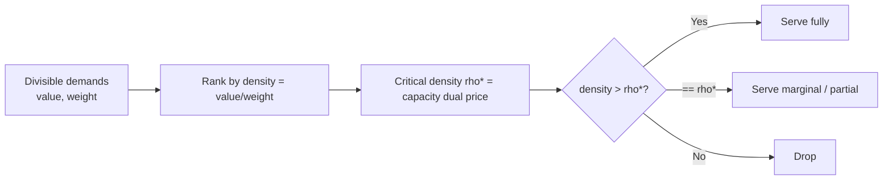

# Fractional Knapsack — Senior Level

> At the senior level Fractional Knapsack stops being "sort and fill" and becomes a *resource-allocation kernel*: a tiny, blazing-fast primitive that allocates a scarce capacity to divisible resources by efficiency. The engineering lives in (1) replacing the `O(n log n)` sort with an `O(n)` **selection** around the critical density, (2) streaming and partitioning at scale, (3) numerical/exact-arithmetic choices, and (4) recognizing the dozens of real systems that are this problem in disguise — bandwidth shaping, CPU/GPU budgeting, ad-budget pacing, fuel blending, and the LP-relaxation bound that drives 0/1-knapsack branch-and-bound.

## Table of Contents
1. [Introduction](#1-introduction)
2. [O(n) Selection Instead of Sorting](#2-on-selection-instead-of-sorting)
3. [Resource-Allocation and Scheduling Framing](#3-resource-allocation-and-scheduling-framing)
4. [Large-Scale and Streaming Computation](#4-large-scale-and-streaming-computation)
5. [Numerical and Exact-Arithmetic Choices](#5-numerical-and-exact-arithmetic-choices)
6. [Concurrency and Parallelism](#6-concurrency-and-parallelism)
7. [Code: O(n) Quickselect Kernel](#7-code-on-quickselect-kernel)
8. [Comparison with Alternatives at Scale](#8-comparison-with-alternatives-at-scale)
9. [Observability and Failure Modes](#9-observability-and-failure-modes)
10. [Capacity Planning](#10-capacity-planning)
11. [Summary](#11-summary)

---

## 1. Introduction

A senior engineer rarely "solves Fractional Knapsack" as a puzzle. The pattern shows up embedded in systems that allocate a fixed budget across divisible demands ranked by efficiency:

- **Bandwidth / rate shaping** — distribute a link's bits-per-second across flows by "value per bit," topping off the last flow partially.
- **Compute budgeting** — allocate a fixed pool of CPU-seconds or GPU memory to jobs by "utility per unit," splitting the marginal job (when a job's progress is divisible, e.g., a batch you can run partially).
- **Ad-budget pacing / bidding** — spend a daily budget on impressions ranked by expected-value-per-dollar; the marginal impression is fractionally funded.
- **Fuel / material blending** — mix divisible feedstocks to maximize value (or minimize cost) under a capacity, slicing the marginal feedstock.
- **0/1-knapsack solvers** — the fractional optimum is the **LP-relaxation upper bound** that prunes the branch-and-bound search tree for the *hard* indivisible problem.

The senior decisions are therefore not "how does greedy work" but:

1. Can I avoid the `O(n log n)` sort with an **`O(n)` selection** around the critical density?
2. How do I run this over **streams** or **datasets too large to sort in memory**?
3. Which **arithmetic** — float, scaled integer, or exact rational — does correctness require?
4. How do I **parallelize** across cores or shards, and **observe** it so a silently-wrong allocation does not ship?

The rest of this file works through each in turn, with a production-grade `O(n)` kernel, failure modes, and a shipping checklist.

---

## 2. O(n) Selection Instead of Sorting

The textbook algorithm sorts (`O(n log n)`), but the *value* of the optimum depends only on partitioning items at the **critical density** `ρ*` — the density of the single partially-taken item. Everything denser than `ρ*` is taken whole; everything less dense is left; the item at `ρ*` is sliced. We can find `ρ*` and sum the result in **`O(n)` expected time** using a quickselect-style partition — no full sort needed.

### 2.1 The idea

Treat the multiset of item densities as the data. We want the prefix (by descending density) whose total weight first reaches `W`. That is a **weighted selection** problem: partition around a pivot density `p` into `Heavier` (density `> p`) and `Lighter` (density `< p`), then recurse into the side that contains the capacity boundary.

```
function select_value(items, W):
    if items empty: return 0
    pick pivot density p (random item's density)
    Heavier = items with density > p
    Equal   = items with density == p
    Lighter = items with density < p
    wH = total weight of Heavier
    if wH >= W:
        recurse into Heavier with capacity W       # boundary is among the densest
    else:
        take all of Heavier (value vH, weight wH)
        # now fill from Equal, then maybe Lighter
        cap = W - wH
        take from Equal up to cap (they are interchangeable)
        if Equal exhausts cap: done
        else recurse into Lighter with capacity (cap - weight(Equal))
        return vH + (Equal/Lighter contribution)
```

Each partition is `O(size)`; expected geometric shrinkage gives `O(n)` expected, `O(n²)` worst case (mitigated by median-of-medians for a deterministic `O(n)`).

### 2.2 Median-of-medians for worst-case O(n)

Random pivots give `O(n)` *expected* but `O(n²)` worst case. Substituting **median-of-medians** pivot selection makes it deterministic `O(n)` worst case, at a higher constant factor. In practice, randomized quickselect with a fallback to sorting after a few unlucky partitions (introselect) is the pragmatic choice — the same strategy `std::nth_element` and Go's `sort.Select`-style routines use.

### 2.3 When the O(n) selection is worth it

| Situation | Sort `O(n log n)` | Quickselect `O(n)` |
|-----------|-------------------|--------------------|
| Need full sorted plan | ✅ required | partial — only the critical split |
| Need value only, large `n` | wasteful | ✅ best |
| `n` small (≤ a few thousand) | fine, simpler | overkill |
| Repeated queries, varying `W` | sort once, binary-search `ρ*` | re-select each time |
| Streaming / can't sort in memory | ✗ | ✅ (selection adapts) |

A senior heuristic: **if you only need the maximum value and `n` is large, use selection; if you need the actual plan or will reuse the order, sort once.**

---

### 2.4 Reusing a sorted structure across many queries

A distinct senior scenario: the *item set is stable* but `W` varies across many queries (e.g., re-pricing a fixed catalog under fluctuating budgets). Here neither a fresh sort nor a fresh selection per query is best. Instead:

1. **Sort once** by density descending — `O(n log n)`, amortized over all queries.
2. **Prefix-sum** the weights and values in density order: `Wpre[j] = Σ_{i≤j} wᵢ`, `Vpre[j] = Σ_{i≤j} vᵢ`.
3. **Per query `W`:** binary-search `Wpre` for the critical index `k` (the first prefix weight `≥ W`) in `O(log n)`, then the value is `Vpre[k−1] + ((W − Wpre[k−1]) / w_k)·v_k`.

Each query is `O(log n)` after the one-time `O(n log n)` preprocessing — far better than `O(n)` per query when there are many queries. This is the right structure for a re-pricing service or a capacity sweep (plotting value-vs-`W`, which traces the piecewise-linear concave curve of `professional.md` Prop 9.1). The senior judgment: **match the data structure to the query pattern** — selection for one-shot value, sort-once-+-binary-search for repeated queries on a fixed set.

---

## 3. Resource-Allocation and Scheduling Framing

Fractional Knapsack is the discrete face of a continuous **linear program**:

```
maximize   Σ vᵢ xᵢ
subject to Σ wᵢ xᵢ ≤ W,   0 ≤ xᵢ ≤ 1.
```

Recognizing this LP form unlocks the senior framings:

- **The greedy solution is an LP vertex.** At most one variable is fractional (one basic variable away from a bound) — this is *why* exactly one item is partial. Any LP solver would return the same allocation; greedy is just the specialized, `O(n)`-fast simplex for this structure.
- **Dual / shadow price.** The critical density `ρ*` is the LP **dual variable** on the capacity constraint — the marginal value of one more unit of capacity. In a bandwidth or budget system, `ρ*` is the *clearing price*: any flow above `ρ*` is fully served, anything below is dropped, the marginal flow is partially served. This is a direct analogue of **water-filling** in information theory and of **market-clearing** in pricing.
- **Online / pacing variant.** When demands arrive over time and you must commit irrevocably, the offline greedy becomes an online threshold policy: serve a request iff its density exceeds an estimated `ρ*`, adapting the threshold as budget burns down. This is exactly how ad-budget pacers and rate limiters approximate the offline optimum.
- **Scheduling cousin.** "Maximize value of divisible jobs run within a time budget, where a job's value accrues linearly with the fraction of it completed" is Fractional Knapsack with time as capacity — densest (value-per-time) first, split the marginal job.



---

### 3.1 The online threshold policy, made precise

The offline greedy needs to see all items before committing. Many real systems (ad pacing, admission control, rate shaping) must decide on each request *as it arrives*, irrevocably. The senior translation of greedy to this online regime is a **threshold policy**:

```
maintain an estimate rho* of the clearing density (from history / a control loop)
on request (value, weight):
    if budget_remaining == 0: reject
    elif value/weight >= rho*: accept (fully, or a fraction to exhaust the budget)
    else: reject
```

The quality of this policy is entirely the quality of `rho*`. If `rho*` equals the true offline critical density, the online policy *matches* the offline optimum (it accepts exactly the items the offline greedy would). If `rho*` is too low, the budget burns out early on mediocre requests; too high, and budget is left unspent. Production pacers therefore run a **control loop** that nudges `rho*` based on burn rate: if budget is depleting too fast relative to the time horizon, raise `rho*` (be choosier); if too slow, lower it. This is a PID-style controller wrapped around the greedy threshold — the same structure as TCP congestion control and ad-budget smoothing. The connection to Fractional Knapsack is exact: `rho*` *is* the LP dual price, and the controller is estimating it online.

### 3.2 Why the dual price is the right abstraction

Exposing `rho*` (the critical density) as a first-class output, rather than just the value or the plan, is a senior design choice with leverage:

- It is the **marginal value of capacity** — answering "should we buy more capacity?" (buy iff the marginal cost `< rho*`).
- It is the **admission threshold** for the online variant — directly reusable by a streaming policy.
- It is **stable** under small input perturbations (it changes only when the critical item changes), making it a good thing to cache, alert on, and reason about, whereas the raw plan churns with every input tweak.

Designing the allocator's API around the dual price turns a one-shot optimizer into a reusable pricing/admission primitive.

---

## 4. Large-Scale and Streaming Computation

When the item set does not fit in memory or arrives as a stream:

- **External / distributed selection.** Shard items across workers. Each worker computes a **density histogram** (bucket counts and weight sums by density range). A coordinator binary-searches the global critical density `ρ*` across the merged histograms in a few passes — `O(n)` total work, `O(buckets)` communication — without ever sorting globally. This is the MapReduce/Spark realization of the `O(n)` selection.
- **Two-pass streaming.** Pass 1: build a density histogram and total weights per bucket (one pass, `O(1)` memory per bucket). Locate the bucket containing `ρ*`. Pass 2: stream again, taking everything above the bucket, slicing within it. Two passes, constant memory.
- **Approximate single-pass.** With a sketch (e.g., a fixed-resolution density histogram or a quantile sketch like t-digest), estimate `ρ*` in one pass to within ε — good enough for pacing/shaping where exactness is not required.
- **Top-k pre-filter.** If `W` is small relative to total supply, only the densest items matter. A bounded max-heap or `O(n)` partial selection keeps just the candidates that could possibly be taken, discarding the long low-density tail early.

The unifying senior insight: **at scale you never need a global sort — you need the critical density**, and a histogram/selection finds it in linear time and minimal communication.

---

### 4.1 Top-k pre-filtering when capacity is small

A common production shape: total supply vastly exceeds capacity (`Σwᵢ ≫ W`), so only the densest sliver of items can possibly be taken. Sorting or fully selecting over *all* `n` items wastes work on a long tail that never enters the bag. The fix: a bounded **partial selection** that keeps only enough of the densest items to cover `W`.

Maintain a structure (a fixed-size max-heap by density, or a one-shot `O(n)` partition that retains the top items whose cumulative weight first exceeds `W`). Everything below the retained set is provably rejected and can be discarded in a single pass. The retained set has total weight just over `W`, so its size is `O(W / w_min)` in the worst case but typically far smaller — and the subsequent fill is over that small set. For a rate-shaper with thousands of flows but a link that admits only a handful, this turns `O(n log n)` into `O(n)` discard + `O(k log k)` over the tiny candidate set. The senior instinct: **never sort the part of the input that cannot affect the answer.**

---

## 5. Numerical and Exact-Arithmetic Choices

The naive `value/weight` division invites floating-point error, especially in comparisons near ties.

| Mode | Use when | Note |
|------|----------|------|
| Float density | Most workloads; tolerant of tiny error | Compare via cross-multiplication `vᵢ·wⱼ ? vⱼ·wᵢ` (positive weights) to avoid division and its rounding. |
| Scaled integers | Values/weights are integers; need exact ranking | Cross-multiply with 64/128-bit integers; no division at all. |
| Exact rational | Graders/contracts demand exact answers | `big.Rat` / `Fraction`; slower, but the slice and total are exact. |
| Fixed-point | Money / budgets | Represent in smallest units (cents, bytes) to avoid float entirely. |

**Rules of thumb:**

- **Never compare densities with raw `==` on floats.** Use cross-multiplication or an epsilon for ties.
- **For monetary/budget systems, use integer minor units.** A bandwidth allocator counts bytes, not fractional megabytes; an ad pacer counts micro-dollars.
- **The slice is where float error concentrates.** `remaining / weight` for the partial item is the one division you cannot avoid; do it in the widest available type and, if the output must be exact, return it as a rational `remaining/weight` rather than a rounded float.

---

### 5.1 Fixed-point arithmetic for money and bytes — a worked design

For a budget pacer denominated in dollars and impressions, the temptation is `float64` density `value/cost`. Resist it. Represent budget in **micro-dollars** (integer `µ$`) and value in integer "expected-conversion units." Then:

- **Density comparison** is cross-multiplication of two `int64`s — exact, deterministic, and reproducible across replicas.
- **The budget constraint** `Σ costᵢ·xᵢ ≤ B` is integer until the single sliced item.
- **The slice** `remaining_µ$ / cost_µ$` is the *only* place a ratio appears; represent the taken fraction as the exact pair `(remaining, cost)` and the partial value as `(remaining · value)/cost` computed in 128-bit before any rounding.

This design eliminates an entire class of "the two replicas disagreed by a cent" bugs and makes the allocation **auditable**: given the same integer inputs, every machine produces byte-identical output. The cost is mild — wider integers and a rational for one item — and the payoff is determinism, which for money-handling systems is often a hard requirement, not a nicety.

---

## 6. Concurrency and Parallelism

The `O(n)` selection and the fill are both parallelizable:

1. **Parallel partition (across cores).** Quickselect's partition step is a parallel filter; the density histogram approach parallelizes trivially — each thread/shard histograms its slice, then a `O(buckets)` merge finds `ρ*`. Near-linear speedup for large `n`.
2. **Across requests / shards.** A budget-allocation service handles many independent `(items, W)` instances; a worker pool sized to cores saturates CPU with no shared mutable state — fully data-parallel.
3. **Within the fill.** Summing the value of all "fully taken" items (those above `ρ*`) is an embarrassingly parallel reduction; only the single partial item needs special handling.

**Thread-safety rules:**

- The kernel is **pure**: `(items, W)` in, `(value, plan)` out, no shared state mutated mid-solve.
- Use **integer / fixed-point** arithmetic for bit-reproducibility across cores and machines (float reductions are order-sensitive and non-deterministic) — important when allocations are audited or cached.
- If you cache results by a canonical hash of `(item multiset, W)`, the cache is read-mostly; treat misses as recompute, never block the solve on a lock.

---

### 6.1 Caching strategy for an allocation service

Because the optimal value (and plan) is a deterministic function of `(item multiset, W, arithmetic mode)`, allocation results are cacheable. Design notes:

- **Key on a canonical hash** of the *sorted* edge/item multiset plus `W` and mode. Sorting first makes the key order-insensitive (the same items in any input order map to the same cache entry).
- **Cache only deterministic results.** Float-based plans can differ across CPUs; never cache them. Integer/fixed-point results are bit-reproducible and safe.
- **Invalidate on item-set change, not on time.** Unlike a TTL cache, the correct answer never "expires" — it changes only when the inputs do. Use content-addressed keys and let new content miss naturally.
- **Two-level caching.** Cache the expensive *sorted structure* (or density histogram) separately from the cheap *per-`W` query*, so a changed `W` on a stable item set reuses the sort (the prefix-sum + binary-search trick of §2.4).

For a dashboard re-querying the same topology under varying budgets, this turns repeated `O(n log n)` work into `O(log n)` lookups — the dominant capacity win for read-heavy allocation services.

---

## 7. Code: O(n) Quickselect Kernel

A production-flavored kernel that computes the optimal **value** in `O(n)` expected time using a quickselect-style partition around the critical density — no full sort. It uses cross-multiplication to compare densities without floating-point division except for the final slice. All three print `240` for the canonical instance and `280` for a larger one.

#### Go

```go
package main

import (
	"fmt"
	"math/rand"
)

type Item struct {
	v, w int64 // integer value and weight (positive)
}

// denser reports whether a is strictly denser than b: a.v/a.w > b.v/b.w,
// via cross-multiplication (no division). Assumes positive weights.
func denser(a, b Item) bool { return a.v*b.w > b.v*a.w }

// maxValue returns the optimal fractional-knapsack value in O(n) expected time.
func maxValue(W int64, items []Item) float64 {
	its := append([]Item(nil), items...)
	var total float64
	cap := W
	for len(its) > 0 && cap > 0 {
		pivot := its[rand.Intn(len(its))]
		var heavier, equal, lighter []Item
		var wH int64
		for _, it := range its {
			if denser(it, pivot) {
				heavier = append(heavier, it)
				wH += it.w
			} else if denser(pivot, it) {
				lighter = append(lighter, it)
			} else {
				equal = append(equal, it)
			}
		}
		if wH >= cap {
			its = heavier // boundary is among the densest
			continue
		}
		// take all heavier
		for _, it := range heavier {
			total += float64(it.v)
		}
		cap -= wH
		// take from equal-density items (interchangeable)
		for _, it := range equal {
			if it.w <= cap {
				total += float64(it.v)
				cap -= it.w
			} else {
				total += float64(cap) / float64(it.w) * float64(it.v)
				cap = 0
				break
			}
		}
		if cap == 0 {
			break
		}
		its = lighter // continue into the less-dense items
	}
	return total
}

func main() {
	a := []Item{{60, 10}, {100, 20}, {120, 30}}
	fmt.Printf("%.4f\n", maxValue(50, a)) // 240.0000
	b := []Item{{60, 10}, {100, 20}, {120, 30}, {80, 10}}
	fmt.Printf("%.4f\n", maxValue(50, b)) // 280.0000 (80/10=8 densest)
}
```

#### Java

```java
import java.util.*;

public class QuickselectKnapsack {
    record Item(long v, long w) {}

    static boolean denser(Item a, Item b) { return a.v() * b.w() > b.v() * a.w(); }

    static double maxValue(long W, List<Item> items) {
        List<Item> its = new ArrayList<>(items);
        double total = 0.0; long cap = W;
        Random rng = new Random(1);
        while (!its.isEmpty() && cap > 0) {
            Item pivot = its.get(rng.nextInt(its.size()));
            List<Item> heavier = new ArrayList<>(), equal = new ArrayList<>(), lighter = new ArrayList<>();
            long wH = 0;
            for (Item it : its) {
                if (denser(it, pivot)) { heavier.add(it); wH += it.w(); }
                else if (denser(pivot, it)) lighter.add(it);
                else equal.add(it);
            }
            if (wH >= cap) { its = heavier; continue; }
            for (Item it : heavier) total += it.v();
            cap -= wH;
            boolean full = false;
            for (Item it : equal) {
                if (it.w() <= cap) { total += it.v(); cap -= it.w(); }
                else { total += (double) cap / it.w() * it.v(); cap = 0; full = true; break; }
            }
            if (full || cap == 0) break;
            its = lighter;
        }
        return total;
    }

    public static void main(String[] args) {
        System.out.printf("%.4f%n", maxValue(50,
            List.of(new Item(60,10), new Item(100,20), new Item(120,30)))); // 240
        System.out.printf("%.4f%n", maxValue(50,
            List.of(new Item(60,10), new Item(100,20), new Item(120,30), new Item(80,10)))); // 280
    }
}
```

#### Python

```python
import random


def denser(a, b):
    """True if a is strictly denser than b, via cross-multiplication."""
    return a[0] * b[1] > b[0] * a[1]   # a.v*b.w > b.v*a.w


def max_value(W, items):
    """Optimal fractional-knapsack value in O(n) expected time (quickselect)."""
    its = list(items)
    total, cap = 0.0, W
    while its and cap > 0:
        pivot = its[random.randrange(len(its))]
        heavier = [it for it in its if denser(it, pivot)]
        lighter = [it for it in its if denser(pivot, it)]
        equal = [it for it in its if not denser(it, pivot) and not denser(pivot, it)]
        wH = sum(it[1] for it in heavier)
        if wH >= cap:
            its = heavier               # boundary among densest
            continue
        total += sum(it[0] for it in heavier)
        cap -= wH
        full = False
        for v, w in equal:
            if w <= cap:
                total += v; cap -= w
            else:
                total += cap / w * v; cap = 0; full = True; break
        if full or cap == 0:
            break
        its = lighter
    return total


if __name__ == "__main__":
    print(f"{max_value(50, [(60,10),(100,20),(120,30)]):.4f}")            # 240.0000
    print(f"{max_value(50, [(60,10),(100,20),(120,30),(80,10)]):.4f}")    # 280.0000
```

**What it does:** finds the optimal value without sorting, partitioning items around a random pivot density and recursing only into the side holding the capacity boundary — `O(n)` expected.
**Run:** `go run main.go` | `javac QuickselectKnapsack.java && java QuickselectKnapsack` | `python knapsack.py`

---

### 7.1 Reading the kernel critically

A few design decisions in the `O(n)` kernel above deserve a senior's scrutiny:

- **Cross-multiplication everywhere except the slice.** `denser` compares `a.v*b.w > b.v*a.w` — exact integer arithmetic, no division, no float error in the *ordering*. The single unavoidable division is the final slice `cap/it.w`, isolated to one line. If even that must be exact, return the value as a rational instead of a `float64`.
- **Pivot from the live set.** The pivot is drawn from the *current* `its`, not the original list, so the expected geometric shrinkage holds across recursion levels. A fixed pivot (e.g., always element 0) would degrade to `O(n²)` on sorted input.
- **Equal-density handling.** Items exactly equal to the pivot density are *interchangeable*; we absorb them after the heavier side and slice within them if needed. Mishandling ties (e.g., dropping equal items into both partitions) double-counts weight and corrupts the answer — a subtle, high-severity bug.
- **No allocation in the hot loop (ideal).** The shown code allocates `H/E/L` slices per level for clarity; a production version partitions *in place* (Hoare-style three-way partition) to keep memory `O(1)` and avoid GC pressure on huge `n`.
- **Determinism.** The randomized pivot makes wall-clock and *tie-breaking* non-deterministic. If allocations are audited, seed the RNG or use median-of-medians so the same input always yields the same plan.

### 7.2 From value to plan in the selection variant

The kernel returns only the *value*. To also produce the *plan* (fraction per original item) without a full sort, run the selection to find the **critical density** `ρ*` and the **leftover capacity** within the critical-density tier, then a single `O(n)` pass assigns: fraction `1` to every item denser than `ρ*`, fraction `0` to every item less dense, and the residual fraction to the critical tier (split among equal-density items if there are several). This gives the plan in `O(n)` total — still beating the sort when `n` is large — at the cost of more bookkeeping than "just sort it." The senior call: if you need the plan *and* `n` is only moderately large, the `O(n log n)` sort is simpler and usually fast enough; reserve the selection-plan for genuinely huge `n`.

---

## 8. Comparison with Alternatives at Scale

| Goal | Fractional greedy | Alternative | When the alternative wins |
|------|-------------------|-------------|---------------------------|
| Max value, value only, large `n` | `O(n)` quickselect | Full sort `O(n log n)` | Never for value-only; sort only if you need the order. |
| Max value + full plan order | Sort `O(n log n)` | Quickselect | When you reuse the sorted order or need ranked output. |
| Indivisible items (0/1) | — (gives only an LP bound) | DP `O(n·W)` / branch-and-bound | Always — greedy is not optimal for 0/1; but the fractional value *bounds* B&B. |
| Streaming / out-of-core | Histogram selection, 2 passes | In-memory sort | Sort loses when data exceeds memory. |
| Online / irrevocable commits | Threshold on estimated `ρ*` | Offline greedy | When you cannot see all items first (pacing, shaping). |
| Multiple capacities / constraints | — | LP / ILP solver | Always — single-capacity greed does not generalize. |
| Non-linear value in fraction | — | Convex optimization | Always — greed assumes linearity. |

**Strategic rule:** reach for the `O(n)` selection when you need only the value at scale; keep the sort for plans and small `n`; and the moment items become indivisible or constraints multiply, leave greedy behind for DP/LP — but still compute the fractional optimum as the **bounding** primitive.

---

## 9. Observability and Failure Modes

What to instrument when this runs as an allocation service:

- **Allocation latency by `n`** — `O(n)`/`O(n log n)` means a few huge instances drive p99; alert on outliers.
- **Critical density `ρ*` distribution** — `ρ*` is the clearing price; sudden shifts indicate demand/supply changes (e.g., budget exhausted earlier than usual).
- **Capacity utilization** — fraction of `W` actually filled. Persistently `< 1` means supply `<` capacity (no scarcity); `== 1` with many dropped demands means contention.
- **Partial-item rate** — confirm at most one fractional item per solve; more than one is a correctness bug.
- **Float-vs-exact divergence** — periodically recompute a sample with exact rationals; a growing gap flags numerical degradation.
- **Cache hit ratio** by `(items, W)` hash — drives capacity.

| Failure | Symptom | Root cause | Mitigation |
|---------|---------|------------|------------|
| Wrong (low) value | Allocation undershoots | Sorted ascending / compared density backwards | Unit test the comparator; assert `value ≥ any whole-item packing`. |
| Division by zero | Crash | Zero-weight item | Filter zero-weight positive-value items (take free) before selection. |
| Non-reproducible totals | Cached value differs across runs | Float reduction order / nondeterministic pivots | Use integer/fixed-point arithmetic; cache only deterministic results. |
| Over-allocation | Σ taken weight > `W` | Missing `break` after slice / `<` vs `<=` bug | Assert total taken weight `== min(W, Σwᵢ)`. |
| Quadratic blow-up | Latency spikes on adversarial input | Bad quickselect pivots | Median-of-medians or introselect fallback to sort. |
| Silent precision loss | Slightly wrong totals at scale | Float density comparisons near ties | Cross-multiplication / exact rationals; epsilon ties. |
| Misapplied to 0/1 | Confidently wrong allocations | Items actually indivisible | Gate on a divisibility contract; route indivisible to DP. |

The most valuable signal is the **partial-item invariant** combined with **utilization**: together they confirm the allocation is structurally a valid fractional-knapsack optimum, not a plausible-looking wrong answer.

---

### 9.1 A concrete production incident pattern

Consider a realistic post-mortem shape. A bandwidth allocator ships using `float64` densities and raw `==` tie-breaking. For weeks it works. Then a customer onboards thousands of flows with *identical* value-per-bit (a uniform pricing tier). Now many densities are exactly equal, and float comparison `a/b == c/d` flips unpredictably across machines due to rounding. The allocator returns **different plans on different replicas** for the *same* input. Downstream reconciliation flags a "split-brain" allocation; on-call is paged.

The root cause is not the algorithm — greedy is still optimal in *value* — but the *non-deterministic tie-break* under float. The fix is the senior playbook: (1) switch density comparison to **cross-multiplication** in integers (exact, machine-independent), (2) add an explicit deterministic tie-break (by flow ID) so equal-density items get a stable order, (3) assert the **partial-item invariant** and bit-reproducibility in a canary, and (4) cache only the now-deterministic results. The lesson generalizes: *optimal value is not the same as reproducible plan*, and at scale the plan's determinism is often the real contract.

### 9.2 What to alert on versus what to dashboard

Not every metric deserves a page. Triage:

- **Page immediately:** `partial_items > 1` (structural bug), `allocated_weight > W` (over-allocation), `cross_check_mismatch > 0` (float vs exact disagreement).
- **Dashboard / weekly review:** critical-density distribution, capacity utilization, latency percentiles by `n`, cache hit ratio.
- **Log-only:** per-request `ρ*`, partition depth in quickselect (spikes hint at adversarial input).

The single highest-value alert is the **partial-item invariant**: a correct fractional-knapsack optimum has at most one sliced item, so `partial_items > 1` is a guaranteed bug, never a false positive.

---

## 10. Capacity Planning

- **CPU.** One `O(n)` selection at `n = 10⁶` is ~a few million comparisons — sub-millisecond to low-millisecond per core. The sort variant is `~20×` more work at that size (`log₂ 10⁶ ≈ 20`).
- **Memory.** `O(n)` for the items; the quickselect partition can be done in place or with `O(n)` scratch. The histogram/streaming variant is `O(buckets)` — kilobytes regardless of `n`.
- **Throughput for a service.** With per-request `n ≤ 10⁴`, a single core does tens of thousands of solves/sec; size the pool to cores and front with a `(items, W)`-hash cache for repeats (same flow set, same budget).
- **Streaming budget.** Two passes over `n` items at memory `O(buckets)`; the bottleneck is I/O, not CPU — size to disk/network bandwidth.
- **Worked back-of-envelope.** A rate-shaper re-solving allocation for 50k flows every 100 ms needs `~5·10⁴` items × 10 solves/s = `5·10⁵` item-ops/s of selection per shard — negligible CPU; the real cost is rebuilding the flow set each tick, so cache the density structure and only re-select when `W` or the flow set changes.

---

### 10.1 Sizing the streaming histogram

For the two-pass histogram approach, the accuracy/memory trade-off is governed by bucket count `B`. The relative error in the estimated value is bounded by the density resolution within the critical bucket: with `B` uniform buckets over `[ρ_min, ρ_max]`, the critical density is known to within `(ρ_max − ρ_min)/B`, and the value error is at most the weight in the critical bucket times that resolution. Doubling `B` halves the worst-case error at double the memory. For a pacer tolerating `1%` error, a few thousand buckets (tens of KB) suffice regardless of `n`; for near-exact answers, use a non-uniform (logarithmic or quantile-sketch) bucketing concentrated near the expected `ρ*`. The senior point: histogram memory is a function of *desired accuracy*, not of `n`, which is exactly what makes the approach scale to `n` in the billions.

---

## 11. Summary

At senior scale, Fractional Knapsack is a **resource-allocation kernel**, not a puzzle. The two senior moves are (1) replacing the `O(n log n)` sort with an **`O(n)` quickselect** (or median-of-medians for worst-case linearity) around the **critical density** `ρ*` when you need only the value, and (2) realizing `ρ*` is the **LP dual / clearing price** of the capacity constraint, which connects the algorithm to water-filling, market-clearing pricing, bandwidth shaping, compute budgeting, and ad-budget pacing — and to the **LP-relaxation bound** that prunes 0/1-knapsack branch-and-bound. At scale you never sort globally; a density **histogram** finds `ρ*` in two streaming passes with constant memory and trivial parallelism. Correctness is an arithmetic decision — cross-multiplication for exact ranking, fixed-point for money/bytes, exact rationals when contracts demand it — and the failure that ships is the plausible-but-wrong allocation, caught by the **partial-item invariant**, **utilization == min(W, Σw)**, and periodic exact cross-checks.

### 11.05 The one-paragraph senior takeaway

If you remember nothing else: Fractional Knapsack is an `O(n)`-computable *clearing-price* primitive, not a textbook puzzle. Its correctness in production is a *determinism and arithmetic* decision (cross-multiply for exact, reproducible ordering; fixed-point for money/bytes), and its scalability is a *selection-not-sort* decision (quickselect or a streaming histogram around the critical density `ρ*`). Expose `ρ*` — the LP dual price — as a first-class output, because it doubles as the admission threshold for the online variant and the marginal-value signal for capacity planning. The failure that ships is never a crash; it is a plausible-but-non-reproducible allocation, caught only by the partial-item invariant, the utilization check, and a second-method cross-check.

### 11.1 Checklist before shipping an allocation service

- [ ] Value-only path uses `O(n)` selection; plan path sorts once and reuses the order.
- [ ] Density comparisons use cross-multiplication (or fixed-point), never raw float `==`.
- [ ] Partial-item invariant (≤ 1 fractional item) asserted in tests and monitored in prod.
- [ ] Utilization asserted to equal `min(W, Σwᵢ)`; over-allocation alarms.
- [ ] Zero-weight positive-value items filtered (taken free) before selection.
- [ ] Quickselect has an introselect/median-of-medians fallback against adversarial pivots.
- [ ] Indivisible inputs gated behind a divisibility contract and routed to DP — with the fractional value retained as the branch-and-bound bound.

Tick all seven and the kernel is production-ready; miss the invariants and you will eventually ship a confidently wrong allocation.

### 11.2 Where to go next

For the proofs behind the optimality and the strong-polynomiality claims, see `professional.md` (exchange argument, LP duality certificate, median-of-medians linear-time analysis). For the contrast that defines the topic — divisible vs indivisible — and the `O(nW)` DP, see `middle.md` and the `dynamic-programming` skill. For interview framing of the senior optimizations (quickselect, dual price, streaming), see `interview.md`.
</content>
