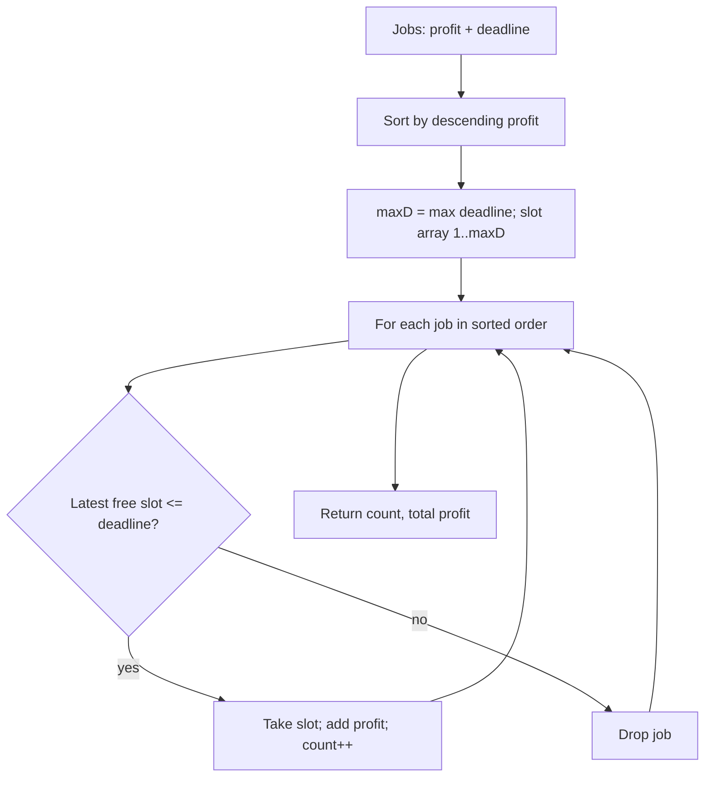

# Job Scheduling (Job Sequencing with Deadlines) — Junior Level

> **One-line summary:** You have a set of jobs, each with a **profit** and a **deadline** (a job takes one unit of time, and you have one machine). To maximize total profit, **sort the jobs by descending profit** and greedily place each job in the **latest still-free time slot at or before its deadline**. Jobs that find no free slot are dropped. The result is the maximum profit you can earn.

---

## Table of Contents

1. [Introduction](#introduction)
2. [Prerequisites](#prerequisites)
3. [Glossary](#glossary)
4. [Core Concepts](#core-concepts)
5. [Big-O Summary](#big-o-summary)
6. [Real-World Analogies](#real-world-analogies)
7. [Pros & Cons](#pros--cons)
8. [Step-by-Step Walkthrough](#step-by-step-walkthrough)
9. [Code Examples](#code-examples)
10. [Coding Patterns](#coding-patterns)
11. [Error Handling](#error-handling)
12. [Performance Tips](#performance-tips)
13. [Best Practices](#best-practices)
14. [Edge Cases & Pitfalls](#edge-cases--pitfalls)
15. [Common Mistakes](#common-mistakes)
16. [Cheat Sheet](#cheat-sheet)
17. [Visual Animation](#visual-animation)
18. [Summary](#summary)
19. [Further Reading](#further-reading)

---

## Introduction

Imagine you run a tiny print shop with **one** printer. Customers bring you jobs. Each job takes exactly **one hour** of printer time, pays you a certain **profit**, and must be finished **by a deadline** (e.g. "I need it by 3 PM or I won't pay"). You only have so many hours in the day, so you cannot do every job. Which jobs do you accept, and in what order, so your total earnings are as large as possible?

This is the **Job Sequencing with Deadlines** problem. Formally:

- You are given `n` jobs. Job `i` has a profit `p_i` and an integer deadline `d_i`.
- Each job occupies **exactly one unit of time** on a **single machine**.
- A job earns its profit **only if it is completed at or before its deadline**.
- Time is sliced into unit slots `1, 2, 3, …`. At most one job runs per slot.

The naive approach is to try every possible ordering of jobs and every choice of which to keep — that is exponential and hopeless for more than a handful of jobs. But this problem has a beautiful **greedy** solution that is provably optimal:

1. **Sort the jobs by profit, highest first.**
2. Walk through them. For each job, try to schedule it in the **latest free slot** that is `≤` its deadline. If such a slot exists, take it (earn the profit). If not, skip the job.

That is the whole algorithm. The non-obvious part — *why* grabbing the highest-profit jobs first and pushing each into its latest slot is optimal — is the heart of the topic, and we prove it rigorously in `professional.md` (via an **exchange argument** and a **matroid** view). For now, internalize the recipe: **profit-descending, latest-slot-first.**

There are two classic ways to find that "latest free slot":

- A **linear scan** of the slots before the deadline (simple, `O(n²)` overall). Easiest to understand — we start here.
- A **disjoint-set / union-find** structure that jumps straight to the latest free slot in nearly `O(1)` amortized time (`O(n α(n))` overall). This is the senior-level optimization, introduced in `senior.md`.

A close cousin is the **slot-based vs heap-based** framing, where instead of slots you keep a min-heap of accepted profits and evict the smallest when you run out of time. We compare those in `middle.md`. This file teaches the *what* and the *how* with the simplest correct version.

---

## Prerequisites

Before reading this file you should be comfortable with:

- **Sorting** — sorting an array by a key (here, descending profit). The sibling `01-sorting-algorithms` covers the mechanics.
- **Arrays** — indexing, iterating, marking slots as used with a boolean array.
- **Greedy thinking** — the idea that making the locally best choice (here, the most profitable available job) can lead to a globally best result. Sibling `02-activity-selection` and `03-fractional-knapsack` are warm-ups.
- **Big-O notation** — `O(n log n)` for the sort, `O(n²)` or `O(n α(n))` for the scheduling.

Optional but helpful:

- **Disjoint Set Union (union-find)** — used in the optimized `O(n α(n))` version (see `senior.md` and the sibling `11-graphs/.../dsu` topic). Not required to understand the basic algorithm.
- **Priority queues / heaps** (`10-heaps`) — used in the heap-based variant discussed in `middle.md`.

---

## Glossary

| Term | Meaning |
|------|---------|
| **Job** | A unit of work with a profit and a deadline. Takes exactly 1 time unit. |
| **Profit `p_i`** | The money (or value) earned if job `i` is completed on time. |
| **Deadline `d_i`** | The latest time slot by which job `i` must finish to earn its profit. Usually a positive integer. |
| **Time slot** | A discrete unit of machine time, numbered `1, 2, 3, …`. One job per slot. |
| **Schedule** | An assignment of (some) jobs to distinct slots, each job in a slot `≤` its deadline. |
| **Feasible schedule** | A schedule where every chosen job sits in a free slot at or before its deadline. |
| **Greedy choice** | Always take the highest-profit job next and place it as late as possible. |
| **Latest free slot** | For a job with deadline `d`, the largest slot index `t ≤ d` that is not yet occupied. |
| **Slot-based method** | Maintain an explicit array of slots; scan or union-find to find the latest free one. |
| **Heap-based method** | Maintain a min-heap of accepted profits; evict the smallest when capacity is exceeded. |
| **`max deadline`** | The largest deadline among all jobs; you never need more than this many slots. |
| **Union-Find / DSU** | A data structure that, here, points each slot to the next free slot to its left, giving near-`O(1)` lookups. |

---

## Core Concepts

### 1. One Machine, Unit Jobs, Discrete Slots

The model is deliberately simple: there is a single machine, every job takes exactly one time unit, and time is chopped into integer slots `1, 2, 3, …`. A job with deadline `d` can legally occupy any one of slots `1, 2, …, d`. If all of those slots are already taken, the job cannot be scheduled and earns nothing.

Because each job needs exactly one slot, **you never need more slots than the maximum deadline.** If the largest deadline is `D`, the answer involves at most `D` jobs (one per slot `1..D`).

### 2. The Greedy Rule: Profit-Descending

Sort all jobs so the most profitable comes first. Process them in that order. The intuition: a high-profit job is "worth more" than a low-profit one, so we should give it first claim on the limited slots. If two jobs compete for the same slot, the more profitable one should win — sorting by descending profit guarantees the more profitable one is *considered first* and grabs its slot before the cheaper job gets a chance.

### 3. Place Each Job in Its **Latest** Free Slot

This is the subtle, crucial detail. When scheduling a job with deadline `d`, do **not** put it in the earliest free slot. Put it in the **latest** free slot `≤ d`. Why? Because later jobs (cheaper ones we have not processed yet) with **small** deadlines can *only* use early slots. By packing the current job as late as possible, we leave the early slots open for jobs that have no other choice. Filling slots front-to-back would needlessly block tight-deadline jobs.

> **Mantra:** *Take the richest job; tuck it in as late as it is allowed.* This preserves the most flexibility for the jobs still to come.

### 4. Drop Jobs That Don't Fit

If a job's slots `1..d` are all occupied when its turn comes, you simply skip it — it contributes nothing. Because we processed in profit-descending order, the jobs we skip are (provably) never better than the ones we kept.

### 5. Two Ways to Find the Latest Free Slot

- **Linear scan (this file).** Keep a boolean array `slot[1..D]`. For a job with deadline `d`, scan `t = min(d, D)` downward to 1 and grab the first free slot. Worst case `O(D)` per job → `O(n·D)` ≈ `O(n²)`.
- **Union-Find (senior file).** Keep a parent array where `find(t)` returns the latest free slot `≤ t`. After filling a slot, union it to `t-1`. Each `find` is nearly `O(1)` amortized, giving `O(n α(n))` overall after the sort.

Both produce **the same profit**; they differ only in speed.

---

## Big-O Summary

| Step | Time | Space | Notes |
|------|------|-------|-------|
| Sort jobs by descending profit | `O(n log n)` | `O(1)`–`O(n)` | Dominates the optimized version. |
| Schedule via **linear scan** | `O(n · D)` ≈ `O(n²)` | `O(D)` | `D` = max deadline. Simple, this file. |
| Schedule via **union-find** | `O(n · α(n))` | `O(D)` | Near-linear. See `senior.md`. |
| **Total (linear scan)** | **`O(n log n + n·D)`** | **`O(n + D)`** | Easiest correct version. |
| **Total (union-find)** | **`O(n log n)`** | **`O(n + D)`** | Sort dominates. Production choice. |
| Brute force (compare) | `O(n! )` or `O(2ⁿ · n)` | `O(n)` | Exponential — only for tiny tests. |

`α(n)` is the inverse Ackermann function — effectively a small constant (`≤ 4`) for any real input.

---

## Real-World Analogies

| Concept | Analogy |
|---------|---------|
| Jobs with profit + deadline | Freelance gigs: each pays a fee and is "due by Friday"; you can only do one per day. |
| Single machine, unit jobs | One oven that bakes exactly one cake per hour; orders are "ready by 5 PM." |
| Profit-descending greedy | Always start the **most valuable** order first so you never lose a big payday to a small one. |
| Latest free slot | Schedule a "due Friday" task on Friday, not Monday — keep Monday open for "due Monday" tasks. |
| Dropping a job | An order whose deadline has fully passed (no oven hour left before it) is declined. |
| Max deadline = slot count | If the latest "ready by" is 5 PM, you only ever plan 5 hourly bake slots. |
| Union-Find speed-up | A receptionist who instantly knows "the latest free appointment before 3 PM" instead of checking each slot. |

Where the analogy breaks: real jobs have varying durations, multiple machines, and setup times. The clean "unit job, one machine" model is what makes the *greedy* provably optimal. Once durations vary, the problem becomes much harder (often NP-hard) — see the `senior.md` discussion of real scheduling systems and EDF.

---

## Pros & Cons

| Pros | Cons |
|------|------|
| Simple to state and implement — sort, then place. | Only models **unit-length** jobs on a **single** machine. |
| Provably **optimal** (exchange argument / matroid). | Variable durations or multiple machines break the simple greedy. |
| Fast: `O(n log n)` with union-find, `O(n²)` with a plain scan. | Requires integer deadlines; continuous time needs a different model. |
| Greedy with no backtracking — no DP table, no recursion. | The optimal *set* is unique in profit but the slot assignment may not be. |
| Generalizes cleanly to a **matroid**, unlocking deep theory. | Ties in profit need a documented tie-break to be deterministic. |
| The union-find trick is reusable for many "latest free slot" problems. | The naive scan degrades to `O(n²)` when deadlines are large. |

**When to use:** maximizing reward from unit-time tasks with hard deadlines on one resource — task selection, ad-slot assignment, simple CPU job admission, exam-style "maximize profit" problems.

**When NOT to use:** jobs with different processing times, preemption, multiple machines, or soft/penalty deadlines — those need EDF, weighted completion-time scheduling, LP/DP, or approximation algorithms.

---

## Step-by-Step Walkthrough

Let us schedule these five jobs. Each takes one time unit.

| Job | Profit | Deadline |
|-----|-------|----------|
| a   | 100   | 2        |
| b   | 19    | 1        |
| c   | 27    | 2        |
| d   | 25    | 1        |
| e   | 15    | 3        |

**Step 0 — Find the max deadline.** The largest deadline is `3`, so we have slots `1, 2, 3`, all free: `[ _, _, _ ]`.

**Step 1 — Sort by descending profit.**

```
a(100, d2), c(27, d2), d(25, d1), b(19, d1), e(15, d3)
```

**Step 2 — Place `a` (profit 100, deadline 2).** Latest free slot `≤ 2` is slot **2**. Take it.
Slots: `[ _, a, _ ]`. Profit = 100.

**Step 3 — Place `c` (profit 27, deadline 2).** Latest free slot `≤ 2`: slot 2 is taken, so slot **1**. Take it.
Slots: `[ c, a, _ ]`. Profit = 127.

**Step 4 — Place `d` (profit 25, deadline 1).** Latest free slot `≤ 1`: slot 1 is taken → **no free slot**. Drop `d`.
Slots: `[ c, a, _ ]`. Profit = 127.

**Step 5 — Place `b` (profit 19, deadline 1).** Latest free slot `≤ 1`: slot 1 taken → **no free slot**. Drop `b`.
Slots: `[ c, a, _ ]`. Profit = 127.

**Step 6 — Place `e` (profit 15, deadline 3).** Latest free slot `≤ 3`: slot **3** is free. Take it.
Slots: `[ c, a, e ]`. Profit = 142.

**Result.** Scheduled jobs `{c, a, e}` in slots `1, 2, 3`. **Maximum profit = 142.** Two jobs (`d`, `b`) were dropped because their only legal slot (1) was already claimed by the more profitable `c`.

**Why "latest slot" mattered:** when we placed `a`, we put it in slot 2 (not 1). That left slot 1 open for `c`. Had we greedily put `a` in slot 1, then `c` would have gone to slot 2 — and the answer would still be 127 here — but in general, hogging early slots blocks tight-deadline jobs and loses profit. The "latest slot" rule is what keeps the greedy optimal across all inputs.

---

## Code Examples

### Example: Maximize Profit with the Latest-Slot Greedy (Linear Scan)

We sort jobs by descending profit, keep a boolean `slot[]` array up to the max deadline, and for each job scan downward from its deadline to find the latest free slot. All three programs print `count = 3, profit = 142` for the walkthrough above.

#### Go

```go
package main

import (
	"fmt"
	"sort"
)

type Job struct {
	Profit   int
	Deadline int
}

// schedule returns (number of jobs done, total profit) using the
// profit-descending, latest-free-slot greedy with a linear slot scan.
func schedule(jobs []Job) (int, int) {
	// 1. Sort by descending profit.
	sort.Slice(jobs, func(i, j int) bool {
		return jobs[i].Profit > jobs[j].Profit
	})
	// 2. Slots 1..maxDeadline (index 0 unused).
	maxD := 0
	for _, j := range jobs {
		if j.Deadline > maxD {
			maxD = j.Deadline
		}
	}
	slot := make([]bool, maxD+1) // slot[t] == true means slot t is taken
	count, profit := 0, 0
	// 3. Place each job in its latest free slot <= deadline.
	for _, j := range jobs {
		for t := j.Deadline; t >= 1; t-- {
			if !slot[t] {
				slot[t] = true
				count++
				profit += j.Profit
				break
			}
		}
	}
	return count, profit
}

func main() {
	jobs := []Job{
		{100, 2}, {19, 1}, {27, 2}, {25, 1}, {15, 3},
	}
	c, p := schedule(jobs)
	fmt.Printf("count = %d, profit = %d\n", c, p) // count = 3, profit = 142
}
```

#### Java

```java
import java.util.*;

public class JobScheduling {
    static class Job {
        int profit, deadline;
        Job(int p, int d) { profit = p; deadline = d; }
    }

    // Returns {count, profit} via profit-descending latest-free-slot greedy.
    static int[] schedule(Job[] jobs) {
        // 1. Sort by descending profit.
        Arrays.sort(jobs, (a, b) -> b.profit - a.profit);
        // 2. Slots 1..maxDeadline.
        int maxD = 0;
        for (Job j : jobs) maxD = Math.max(maxD, j.deadline);
        boolean[] slot = new boolean[maxD + 1];
        int count = 0, profit = 0;
        // 3. Place each job in its latest free slot.
        for (Job j : jobs) {
            for (int t = j.deadline; t >= 1; t--) {
                if (!slot[t]) {
                    slot[t] = true;
                    count++;
                    profit += j.profit;
                    break;
                }
            }
        }
        return new int[]{count, profit};
    }

    public static void main(String[] args) {
        Job[] jobs = {
            new Job(100, 2), new Job(19, 1), new Job(27, 2),
            new Job(25, 1), new Job(15, 3)
        };
        int[] r = schedule(jobs);
        System.out.println("count = " + r[0] + ", profit = " + r[1]); // 3, 142
    }
}
```

#### Python

```python
def schedule(jobs):
    """jobs: list of (profit, deadline). Returns (count, total_profit)
    via the profit-descending, latest-free-slot greedy (linear scan)."""
    # 1. Sort by descending profit.
    jobs = sorted(jobs, key=lambda j: -j[0])
    # 2. Slots 1..max_deadline (index 0 unused).
    max_d = max((d for _, d in jobs), default=0)
    slot = [False] * (max_d + 1)
    count = profit = 0
    # 3. Place each job in its latest free slot <= deadline.
    for p, d in jobs:
        for t in range(d, 0, -1):
            if not slot[t]:
                slot[t] = True
                count += 1
                profit += p
                break
    return count, profit


if __name__ == "__main__":
    jobs = [(100, 2), (19, 1), (27, 2), (25, 1), (15, 3)]
    c, p = schedule(jobs)
    print(f"count = {c}, profit = {p}")  # count = 3, profit = 142
```

**What it does:** sorts jobs by descending profit, then for each job scans from its deadline down to 1 to claim the latest free slot.
**Run:** `go run main.go` | `javac JobScheduling.java && java JobScheduling` | `python jobs.py`

---

## Coding Patterns

### Pattern 1: Sort by Descending Profit First

**Intent:** The greedy only works if the most valuable job gets first claim on slots.

```python
jobs.sort(key=lambda j: -j[0])   # j = (profit, deadline)
```

Sort once, up front. Everything after assumes this order.

### Pattern 2: Cap the Slot Array at the Max Deadline

**Intent:** You never need slots beyond the largest deadline. Allocating `max_deadline + 1` (1-indexed) keeps memory tight.

```python
max_d = max(d for _, d in jobs)
slot = [False] * (max_d + 1)
```

### Pattern 3: Scan from Deadline Down to 1

**Intent:** Place the job in its **latest** free slot, preserving early slots for tight-deadline jobs.

```python
for t in range(d, 0, -1):
    if not slot[t]:
        slot[t] = True
        # accept the job
        break
else:
    pass  # no free slot -> job dropped
```

Note the downward range `range(d, 0, -1)` — scanning *up* would put the job in the earliest slot and break optimality.

### Pattern 4: Track Both Count and Profit

**Intent:** Many problem variants ask for the number of jobs done *and* the total profit.

```python
count, profit = 0, 0
# on accept:
count += 1
profit += p
```



---

## Error Handling

| Error | Cause | Fix |
|-------|-------|-----|
| Profit smaller than expected | Sorted **ascending** instead of descending. | Sort by `-profit` (or comparator `b.profit - a.profit`). |
| Some tight-deadline jobs wrongly dropped | Scanned slots **upward** (earliest-first), hogging early slots. | Scan from `deadline` **down to 1** (latest-first). |
| `IndexError` / array-bounds | Slot array sized `maxD` not `maxD + 1`, or 0-indexed deadlines. | Use 1-indexed slots `1..maxD`, allocate `maxD + 1`. |
| Crash on empty job list | `max()` of empty sequence. | Default `maxD = 0`; return `(0, 0)`. |
| Job with deadline `0` always dropped | Deadlines must be `≥ 1` (you need at least slot 1). | Validate `deadline ≥ 1`; treat `0` as "cannot schedule." |
| Wrong answer with negative profits | Sorting still works, but you should never schedule a negative-profit job. | Skip jobs with `profit ≤ 0` if the model forbids them. |
| Non-deterministic output across runs | Equal-profit ties resolved by unstable sort. | Add a documented tie-break (e.g. by deadline) for reproducibility. |

---

## Performance Tips

- **Sort once.** The single `O(n log n)` sort dominates the optimized version; do not re-sort inside the loop.
- **Use union-find for large deadlines.** When `D` (max deadline) is large, the linear scan's `O(n·D)` hurts. Union-find brings scheduling to `O(n α(n))` — see `senior.md`.
- **Cap slots at `min(deadline, n)`.** You can never schedule more than `n` jobs, so slots beyond index `n` are useless even if some deadline is huge. Use `maxD = min(maxD, n)` to shrink the array.
- **Avoid per-job allocation.** Reuse the same `slot[]` buffer across calls if scheduling many independent job sets of similar size.
- **Stable, documented tie-break.** Break profit ties by ascending deadline (or job id) so results are deterministic and testable.

---

## Best Practices

- Write a brute-force verifier first (try all subsets / orderings for `n ≤ 10`) and test the greedy against it. This catches sort-direction and scan-direction bugs instantly.
- Document clearly that slots are **1-indexed** and that deadlines are **`≥ 1`** at the top of the function.
- Separate the two phases — *sort* then *schedule* — so each is easy to read and test independently.
- Return both the count and the profit (and optionally the chosen job indices); different callers want different outputs.
- Decide the tie-break rule explicitly and write it in a comment; never rely on the sort's incidental behavior.
- Keep the slot array size at `min(max_deadline, n) + 1` — both correct and memory-frugal.

---

## Edge Cases & Pitfalls

- **Empty input** — return `(0, 0)`; guard the `max()` over deadlines with a default.
- **All deadlines equal to 1** — only the single highest-profit job is scheduled; the rest are dropped.
- **Deadline larger than `n`** — harmless, but you only ever use up to `n` slots; cap the array.
- **Duplicate profits** — define and apply a tie-break so the output is deterministic.
- **Zero or negative profit** — a `0`-profit job adds nothing; a negative-profit job should generally be skipped if the model allows refusing jobs.
- **Scanning upward** — the single most common bug; it earns the right total *sometimes* but fails when tight-deadline jobs collide. Always scan from `deadline` down to 1.
- **Large max deadline with few jobs** — `O(n·D)` blows up; switch to union-find or cap slots at `n`.

---

## Common Mistakes

1. **Sorting ascending by profit** — schedules the cheap jobs first; loses the expensive ones. Always sort **descending**.
2. **Placing jobs in the earliest free slot** — blocks tight-deadline jobs and breaks optimality. Use the **latest** free slot.
3. **Forgetting to drop infeasible jobs** — a job with no free slot earns nothing; do not force it in or crash.
4. **Off-by-one on slots** — deadlines are 1-indexed; allocate `maxD + 1` and use slots `1..maxD`.
5. **Ignoring ties** — unstable tie-breaking makes results non-reproducible across languages/runs.
6. **Re-sorting or re-scanning unnecessarily** — keep the algorithm to one sort plus one pass with slot lookups.
7. **Assuming the greedy works for non-unit jobs** — it does **not**; variable durations need different techniques.

---

## Cheat Sheet

| Step | Operation |
|------|-----------|
| 1. Sort | Jobs by **descending profit**. |
| 2. Slots | `slot[1..maxD]`, all free; `maxD = min(max deadline, n)`. |
| 3. Place | For each job, take the **latest** free slot `≤ deadline`; else drop. |
| 4. Result | Sum of profits of accepted jobs = **maximum profit**. |

Key facts:

```
greedy rule         : highest profit first, latest free slot
slot indexing       : 1..maxDeadline (one job per slot)
find latest slot    : linear scan O(D)  or  union-find O(α(n))
total complexity    : O(n log n + n·D)  (scan)  /  O(n log n)  (union-find)
self-jobs that fail : dropped, earn nothing
optimality proof    : exchange argument / matroid  (see professional.md)
```

Tiny verified examples:

```
{(100,2),(19,1),(27,2),(25,1),(15,3)}  → 3 jobs, profit 142
{(20,2),(15,2),(10,1),(5,3),(1,3)}     → 3 jobs, profit 45
all deadline 1                          → 1 job (the richest)
empty                                   → 0 jobs, profit 0
```

---

## Visual Animation

> See [`animation.html`](./animation.html) for an interactive visualization of Job Sequencing with Deadlines.
>
> The animation demonstrates:
> - An editable list of jobs (profit, deadline) and a row of time slots
> - Sorting the jobs by descending profit, shown step by step
> - For each job, scanning from its deadline down to find the latest free slot
> - Accepted jobs lighting up their slot (green) and rejected jobs marked (red)
> - A running total of scheduled count and accumulated profit
> - A toggle between the linear-scan and union-find slot-finding strategies

---

## Summary

Job Sequencing with Deadlines asks you to pick and order unit-time jobs on one machine to maximize profit, where each job earns only if finished by its deadline. The greedy solution is short and provably optimal: **sort by descending profit, then place each job in the latest free slot at or before its deadline, dropping any job that finds no slot.** The "latest slot" rule is the clever bit — it keeps early slots open for tight-deadline jobs that have nowhere else to go. The simplest implementation uses a boolean slot array and a downward linear scan (`O(n²)`); the production version replaces the scan with union-find for `O(n log n)` total. Master the four-step recipe — sort, size the slots, place latest-first, sum the profit — and you have the junior-level core. The *why* (exchange argument, matroid structure) and the *speed* (union-find, real scheduling systems) come next in `middle.md`, `senior.md`, and `professional.md`.

---

## Further Reading

- *Introduction to Algorithms* (CLRS), greedy chapter — the matroid framing of job sequencing.
- *Algorithm Design* (Kleinberg & Tardos), §4 — exchange arguments for greedy scheduling.
- GeeksforGeeks — "Job Sequencing Problem" (linear-scan and DSU versions).
- CP-Algorithms — disjoint-set union with the "next free slot" application.
- Sibling topic `02-activity-selection` — a related greedy on intervals.
- Sibling topic `03-fractional-knapsack` — another provably optimal greedy by value.
- Sibling topic `11-graphs/.../dsu` — the union-find structure used in the optimized version.
</content>
</invoke>
