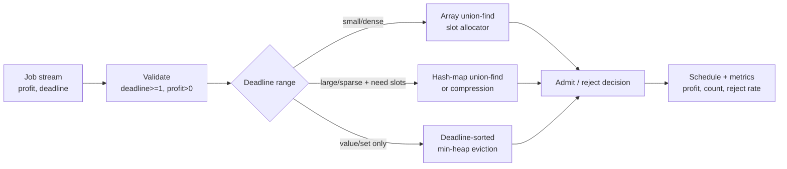

# Job Scheduling (Job Sequencing with Deadlines) — Senior Level

> At the senior level, job sequencing stops being "sort and place" and becomes a **slot-allocation kernel** — a union-find that answers "latest free slot ≤ d" in amortized `O(α(n))` — wrapped in the engineering of real scheduling systems: coordinate compression for huge deadlines, `k`-machine capacity, EDF/deadline-scheduling framing, batch admission control, and observability so a wrong (sub-optimal) admission decision does not silently ship.

## Table of Contents
1. [Introduction](#1-introduction)
2. [The Union-Find Slot Allocator: O(n α(n))](#2-the-union-find-slot-allocator-on-αn)
3. [Coordinate Compression for Huge / Sparse Deadlines](#3-coordinate-compression-for-huge--sparse-deadlines)
4. [Real Scheduling Systems and the EDF / Deadline Framing](#4-real-scheduling-systems-and-the-edf--deadline-framing)
5. [System Design: A Job-Admission Service](#5-system-design-a-job-admission-service)
6. [Concurrency and Parallelism](#6-concurrency-and-parallelism)
7. [Comparison with Alternatives at Scale](#7-comparison-with-alternatives-at-scale)
8. [Code: Production-Grade Slot Allocator Kernel](#8-code-production-grade-slot-allocator-kernel)
9. [Observability](#9-observability)
10. [Failure Modes](#10-failure-modes)
11. [Capacity Planning](#11-capacity-planning)
12. [Summary](#12-summary)

---

## 1. Introduction

A senior engineer rarely "sequences jobs" as a textbook exercise. The pattern shows up embedded in real systems:

- **Ad-slot / impression allocation** — each campaign has a value (bid) and a flight deadline; you fill a limited inventory of slots to maximize revenue. The latest-slot greedy maps directly.
- **Batch / cron admission control** — a scheduler admits unit-cost tasks that must finish before a wall-clock deadline on a bounded pool of workers; reject the rest. This is `k`-machine job sequencing.
- **Spot/preemptible compute auctions** — short, interchangeable tasks with willingness-to-pay and a hard expiry; maximize captured value within capacity.
- **Real-time systems** — the deadline framing connects directly to **Earliest-Deadline-First (EDF)** scheduling, the optimal uniprocessor policy for meeting deadlines when feasible.

The senior decisions are therefore not "how does the greedy work" but:

1. How do I make the slot lookup **near-constant** so admission scales to millions of jobs?
2. How do I handle **astronomical or sparse deadlines** without an `O(D)` array?
3. How does the unit-job model relate to **real schedulers** (EDF, weighted completion time) and where does it break?
4. How do I **observe** the scheduler so a sub-optimal or starving admission policy is caught before it costs revenue?

---

## 2. The Union-Find Slot Allocator: O(n α(n))

The linear-scan slot finder is `O(D)` per job — fine for tiny `D`, fatal at scale. The fix is a **disjoint-set (union-find) "next free slot" structure**, the canonical senior optimization.

**Idea.** Maintain `parent[t]` for slots `0..D` with the invariant: `find(t)` returns the **latest free slot ≤ t**, or `0` (a sentinel "no slot") if all of `1..t` are taken. Initially `parent[t] = t` (every slot is free, points to itself). To allocate the slot returned by `find(d)`, we "remove" it by pointing it to the slot just left of it: `parent[s] = s - 1`. Future `find` calls then skip over `s` automatically.

```
find(t):                      # path-compressed
    while parent[t] != t:
        parent[t] = parent[parent[t]]
        t = parent[t]
    return t

allocate(d):                  # latest free slot <= d, or 0
    s = find(d)
    if s == 0: return 0       # rejected
    parent[s] = s - 1         # slot s consumed; chain to s-1
    return s
```

**Why `0` is the sentinel.** Slot `0` is never a valid time unit (slots are `1..D`). When all early slots are gone, the chain compresses down to `0`, and `find` returns `0`, signaling rejection. `parent[0] = 0` is the fixed point.

**Complexity.** With path compression (and optionally union by rank, though pointing to `s-1` already keeps chains short), the `n` allocations plus the sort cost `O(n log n + n α(n)) = O(n log n)`. The `α(n)` (inverse Ackermann) is `≤ 4` for any input the universe will ever produce — effectively constant.

**Why it is correct.** The structure only ever *removes* slots (it never frees them), exactly matching the greedy that processes jobs once in profit order and permanently claims a slot. The invariant "`find(t)` = latest free slot ≤ t" is preserved by `parent[s] = s-1` because after consuming `s`, the latest free slot ≤ `s` is the latest free slot ≤ `s-1`.

This is the single most important senior fact: **the slow `O(D)` scan becomes `O(α(n))` by reinterpreting "find the latest free slot" as a union-find query.**

### 2.1 A worked trace of the allocator

Jobs sorted by descending profit: `a(100,d2), c(27,d2), d(25,d1), b(19,d1), e(15,d3)`. Initialize `parent = [0,1,2,3]` (slots 0..3; 0 is the sentinel).

| Job | `find(d)` walk | Slot taken | `parent` after `parent[s]=s-1` | Result |
|-----|----------------|-----------|--------------------------------|--------|
| a (d2) | `find(2)=2` | 2 | `[0,1,1,3]` | accept slot 2 |
| c (d2) | `find(2)`: 2→1, root 1 | 1 | `[0,0,1,3]` | accept slot 1 |
| d (d1) | `find(1)`: 1→0, root 0 | — | unchanged | **reject** (sentinel 0) |
| b (d1) | `find(1)`: 1→0, root 0 | — | unchanged | **reject** |
| e (d3) | `find(3)=3` | 3 | `[0,0,1,2]` | accept slot 3 |

Profit `100 + 27 + 15 = 142`, three jobs — matching the linear-scan result exactly, but every `find` touched only a handful of pointers and path compression flattened the chains as it went. Note how, after `c` consumed slot 1, `parent[1] = 0` so any future `find(1)` instantly returns the sentinel `0` — the rejection of `d` and `b` is `O(1)`, not an `O(d)` scan.

### 2.2 Determinism and tie-breaking

Because Proposition 6.3 of `professional.md` guarantees the optimal *profit* is unique but the optimal *set* may not be (under profit ties), a production scheduler must fix a **total order** for the sort to be reproducible across languages and runs: **profit descending, then deadline ascending, then a stable job id.** Without the secondary keys, Go's `sort.Slice` (unstable), Java's primitive `Arrays.sort` (unstable for objects only via comparator), and Python's `sorted` (stable) can each pick a *different but equally optimal* set, which breaks golden-file tests and cross-service caching. The kernel in §8 encodes this tie-break explicitly.

---

## 3. Coordinate Compression for Huge / Sparse Deadlines

Deadlines in production are wall-clock timestamps or epoch seconds — values like `1_700_000_000`, not `1..10`. Allocating `parent[0..D]` for `D ≈ 10⁹` is impossible. Two senior fixes:

**Option A — Coordinate compression.** Only `n` distinct deadlines matter, and a job with deadline `d` only ever uses slots that are *also* deadlines (or the gaps between them). More carefully: cap every deadline at `min(d, n)` is **wrong** for sparse deadlines because slots must remain distinct integers ≤ the true deadline. The correct compression is:

- Sort the distinct deadlines.
- Recognize that you only need as many slots as jobs, and a job with deadline `d` can use any of the *first* `min(rank(d), n)` compressed slots where `rank(d)` counts deadlines `≤ d`. Map each deadline to its rank, run union-find over `1..n`. This preserves feasibility because the relative order of deadlines is all the greedy uses.

**Option B — Hash-map union-find.** Replace the array `parent[]` with a hash map that lazily initializes `parent[t] = t` on first touch. Only `O(n)` distinct slots are ever visited (each allocation touches a bounded number of new keys), so memory is `O(n)` regardless of `D`. Simpler to reason about than compression; slightly higher constant.

**Option C — Heap-based method (from `middle.md`).** When you do **not** need the concrete slot assignment, the deadline-sorted min-heap approach has **no `D` dependence at all** — its memory is `O(n)`. For huge sparse deadlines where only the max profit / chosen set matters, this is often the cleanest production choice.

> Senior rule: if deadlines are bounded by `~n` (or small), use the array union-find. If they are large/sparse but you need slots, use hash-map union-find or compression. If you only need the value/set, use the heap method.

---

## 4. Real Scheduling Systems and the EDF / Deadline Framing

The unit-job greedy is a discrete cousin of classic real-time scheduling theory.

### 4.1 Earliest Deadline First (EDF)

EDF is the optimal **dynamic-priority** uniprocessor policy: always run the ready task with the **earliest deadline**. For a set of jobs that *can* all meet their deadlines, EDF finds a feasible schedule. The heap-based variant in `middle.md` is essentially **EDF with profit-based eviction**: process in deadline order, and when capacity is exceeded, drop the least valuable job. Pure EDF maximizes *feasibility* (jobs completed on time); profit-weighted job sequencing maximizes *value* among feasible sets.

### 4.2 When the unit-job assumption breaks

The clean greedy relies on **unit processing times** and a **single machine** (or `k` identical machines). Real schedulers face:

- **Variable durations** → weighted job scheduling becomes NP-hard in general (e.g. minimizing weighted number of late jobs with arbitrary processing times is `1 || Σ wⱼ Uⱼ`, solvable by Moore-Hodgson only for the *unweighted* case; the weighted case is NP-hard).
- **Release times** → jobs that arrive over time; EDF still optimal for feasibility on one processor, but the offline profit-greedy no longer applies directly.
- **Preemption** → changes which policies are optimal; EDF remains optimal for meeting deadlines with preemption.

So the senior takeaway: **job sequencing is the tractable, optimal core; real systems layer EDF, admission control, and approximation on top once the unit assumption is relaxed.**

### 4.3 Moore-Hodgson connection

The unweighted "maximize number of on-time jobs" variant is exactly the **Moore-Hodgson algorithm**: sort by deadline, add jobs, and when total processing time exceeds the current deadline, drop the longest job so far. With unit jobs and a min-heap on profit instead of length, this becomes the profit-weighted heap method. Recognizing this lineage tells you which generalizations are still polynomial (unit/unweighted) and which turn NP-hard (weighted, variable-length).

### 4.4 A taxonomy of related scheduling problems

It pays to know where unit-job sequencing sits in the broader scheduling landscape, because interviewers and architects will push on the boundaries:

| Problem (Graham notation) | Description | Tractability |
|---------------------------|-------------|--------------|
| `1 \| \| Σ Uⱼ` | Minimize number of late jobs, unit-ish via Moore-Hodgson | Polynomial `O(n log n)` |
| `1 \| \| Σ wⱼ Uⱼ` | Minimize **weighted** number of late jobs, arbitrary lengths | **NP-hard** (pseudo-poly DP, FPTAS) |
| `1 \| pⱼ=1 \| Σ wⱼ Uⱼ` | Our problem: unit jobs, maximize on-time profit | Polynomial (matroid greedy) |
| `1 \| \| Lmax` | Minimize maximum lateness | Polynomial via EDF |
| `1 \| rⱼ \| Lmax` | With release times | NP-hard (preemptive case polynomial via EDF) |
| `P \| pⱼ=1 \| Σ wⱼ Uⱼ` | `k` identical machines, unit jobs | Polynomial (partition matroid) |

The lesson: the tractable island is **unit processing times**. The instant lengths vary and weights are involved (`Σ wⱼ Uⱼ`), the problem crosses into NP-hardness, and you pivot to pseudo-polynomial DP, an FPTAS, or an LP-rounding approximation. Knowing this map lets you immediately classify a new requirement ("jobs now take 1–4 hours") as a regime change rather than a tweak.

---

## 5. System Design: A Job-Admission Service



The validator and the decision sink are uniform; the **allocator strategy** is the design knob, chosen by deadline characteristics and whether the caller needs concrete slot assignments.

### 5.0 Request lifecycle and the precision/contract surface

A production scheduling endpoint should expose a small, explicit contract on every response so downstream consumers cannot misinterpret a result:

- **`objective`** — `max_profit` or `max_count`. The same kernel serves both (weights = profit vs weights = 1); stating it prevents a caller from reading a count as a profit.
- **`allocator`** — which strategy ran (`array_uf`, `hash_uf`, `heap`). Useful for debugging and for confirming the auto-selection picked the right path for the deadline profile.
- **`schedule_available`** — boolean. The heap path returns only the value/set; if the caller needs slot assignments, it must request a slot-capable allocator. Surfacing this avoids the silent "I asked for the timeline but got only a number" bug.
- **`rejected`** — the dropped jobs (or at least their count and total value), so capacity planners can quantify lost revenue.

This contract is the scheduling analogue of a precision contract: it makes the *meaning* of the answer machine-checkable rather than relying on tribal knowledge about which endpoint returns what.

### 5.1 Service tiers

| Tier | Scale | Allocator | Latency | When right |
|------|-------|-----------|---------|-----------|
| Inline library | `n ≤ ~10⁴` | array union-find | sub-ms | Embedded admission in a request handler; small dense deadlines. |
| Batch scheduler | `n ≤ ~10⁷` | hash-map union-find or heap | ms–seconds | Periodic batch admission over large epoch deadlines. |
| Streaming admission | unbounded stream | online heap with capacity | per-event | Continuous bidding/impression allocation; only value matters. |

The most common senior mistake is shipping the **array** allocator into a service whose deadlines are **epoch timestamps**, allocating gigabytes — or worse, silently truncating deadlines and producing a wrong (sub-optimal) schedule.

---

### 5.2 Auto-selecting the allocator

A robust service does not force the caller to choose the data structure. It inspects the batch and routes:

```
selectAllocator(jobs, needSchedule):
    D = max deadline
    n = len(jobs)
    if not needSchedule:
        return HEAP                      # value/set only: D-independent memory
    if D <= ALPHA * n:                   # ALPHA ~ 8..16, dense regime
        return ARRAY_UNION_FIND          # fastest constant, O(D) memory acceptable
    return HASH_UNION_FIND               # sparse/huge D but slots still required
```

The threshold `ALPHA · n` captures "is the slot universe within a small multiple of the job count?" Below it, the `O(D)` array is both fastest and memory-affordable; above it, the array would waste (or exhaust) memory, so you pay the hash constant. Emitting the chosen path as a metric (`allocator_path_total`, §9) lets you confirm the selector matches the real traffic and catch misconfigurations where, say, every batch unexpectedly lands on the hash path because deadlines are timestamps.

### 5.3 Idempotency and caching

Scheduling is a pure function of `(sorted job multiset, objective, k)`. Canonicalize the input — sort jobs, hash the `(profit, deadline)` pairs plus `objective` and `k` — and cache the result. For dashboards or retried requests that re-submit the same batch, this turns repeated `O(n log n)` work into an `O(1)` lookup. Because the kernel is deterministic (given the §2.2 tie-break), the cache is safe and bit-reproducible across machines; never cache a result computed without the fixed tie-break, or two nodes may disagree on the *set* (though never the profit).

---

## 6. Concurrency and Parallelism

The slot allocator is inherently **sequential within one job set** — each allocation mutates shared `parent[]`, and the greedy order matters. Parallelism comes at three levels:

1. **Across independent job sets.** A scheduling service handles many independent batches (per tenant, per time window). Each batch is a pure function (jobs in → schedule out) with its own `parent[]` — fully data-parallel across a worker pool sized to cores.
2. **Sort parallelism.** The dominant `O(n log n)` sort parallelizes (parallel merge/sample sort) for very large `n`; the union-find pass is cheap and stays serial.
3. **Sharded admission (approximate).** For streaming admission at extreme scale, shard by deadline range across nodes; each node runs an independent heap. This is an *approximation* (a globally optimal swap across shards is missed), acceptable when shards are coarse and traffic is balanced.

**Thread-safety rules:**

- The allocator kernel must be **pure**: job set in, schedule out, no shared `parent[]` mutated across batches.
- Union-find with path compression is **not** safe to share mutably across threads; give each batch its own arrays.
- If you cache schedules by a canonical job-set hash, the cache is read-mostly; treat misses as recompute, never block the solve on a lock.

---

## 7. Comparison with Alternatives at Scale

| Goal | Job-sequencing greedy | Alternative | When the alternative wins |
|------|----------------------|-------------|---------------------------|
| Max profit, unit jobs, 1 machine | `O(n log n)` union-find greedy | DP / brute force | Never at scale — greedy is optimal and near-linear. |
| Max **count**, unit jobs | greedy (weights = 1) | Moore-Hodgson | Same algorithm; either framing. |
| Huge/sparse deadlines, value only | heap method `O(n log n)`, `O(n)` mem | array union-find | Heap wins — no `O(D)` memory. |
| Variable durations, weighted | — (NP-hard) | DP (pseudo-poly), LP relaxation, approximation | Always — greedy is no longer optimal. |
| Meet all deadlines if feasible | profit greedy (sets profit aside) | EDF | EDF when feasibility (not value) is the goal. |
| `k` machines | capacity-`k` greedy | min-cost flow / matching | Flow when constraints are richer (machine eligibility, conflicts). |
| Online / streaming | online heap eviction | competitive online algorithms | When future jobs are unknown; analyze competitive ratio. |

**Strategic rule:** the greedy is the right tool **only** for unit-length jobs on identical machines. The moment durations vary, switch to DP/flow/approximation; the moment you only care about feasibility, switch to EDF.

---

## 8. Code: Production-Grade Slot Allocator Kernel

A reusable allocator exposing both an **array union-find** path (small dense deadlines, returns slot assignment) and a **hash-map union-find** path (large/sparse deadlines). All three print `count = 3, profit = 142` and the slot each job got.

#### Go

```go
package main

import (
	"fmt"
	"sort"
)

type Job struct {
	ID       int
	Profit   int
	Deadline int
}

// DSU over slots: find returns the latest free slot <= t, or 0 if none.
type SlotDSU struct{ parent map[int]int }

func NewSlotDSU() *SlotDSU { return &SlotDSU{parent: map[int]int{0: 0}} }

func (d *SlotDSU) find(t int) int {
	if t <= 0 {
		return 0
	}
	if _, ok := d.parent[t]; !ok {
		d.parent[t] = t // lazy init: slot t is free
	}
	root := t
	for d.parent[root] != root {
		root = d.parent[root]
	}
	// path compression
	for d.parent[t] != root {
		d.parent[t], t = root, d.parent[t]
	}
	return root
}

// allocate consumes the latest free slot <= d and returns it, or 0 if rejected.
func (d *SlotDSU) allocate(deadline int) int {
	s := d.find(deadline)
	if s == 0 {
		return 0
	}
	d.parent[s] = d.find(s - 1) // chain s to the next free slot left of it
	return s
}

// Schedule returns count, total profit, and the slot assigned to each accepted job id.
func Schedule(jobs []Job) (int, int, map[int]int) {
	sort.Slice(jobs, func(i, j int) bool {
		if jobs[i].Profit != jobs[j].Profit {
			return jobs[i].Profit > jobs[j].Profit
		}
		return jobs[i].Deadline < jobs[j].Deadline // deterministic tie-break
	})
	dsu := NewSlotDSU()
	assign := make(map[int]int)
	count, profit := 0, 0
	for _, j := range jobs {
		if s := dsu.allocate(j.Deadline); s > 0 {
			assign[j.ID] = s
			count++
			profit += j.Profit
		}
	}
	return count, profit, assign
}

func main() {
	jobs := []Job{
		{0, 100, 2}, {1, 19, 1}, {2, 27, 2}, {3, 25, 1}, {4, 15, 3},
	}
	c, p, a := Schedule(jobs)
	fmt.Printf("count = %d, profit = %d\n", c, p) // 3, 142
	fmt.Println("assignments (job->slot):", a)
}
```

#### Java

```java
import java.util.*;

public class SlotAllocator {
    static class Job {
        int id, profit, deadline;
        Job(int id, int p, int d) { this.id = id; profit = p; deadline = d; }
    }

    // Hash-map DSU over slots; find = latest free slot <= t, 0 if none.
    static final Map<Integer, Integer> parent = new HashMap<>();

    static int find(int t) {
        if (t <= 0) return 0;
        parent.putIfAbsent(t, t);             // lazy init
        int root = t;
        while (parent.get(root) != root) root = parent.get(root);
        while (parent.get(t) != root) {       // path compression
            int next = parent.get(t);
            parent.put(t, root);
            t = next;
        }
        return root;
    }

    static int allocate(int deadline) {
        int s = find(deadline);
        if (s == 0) return 0;
        parent.put(s, find(s - 1));           // consume slot s
        return s;
    }

    static int[] schedule(Job[] jobs, Map<Integer, Integer> assign) {
        parent.clear();
        parent.put(0, 0);
        Arrays.sort(jobs, (a, b) ->
            a.profit != b.profit ? b.profit - a.profit : a.deadline - b.deadline);
        int count = 0, profit = 0;
        for (Job j : jobs) {
            int s = allocate(j.deadline);
            if (s > 0) { assign.put(j.id, s); count++; profit += j.profit; }
        }
        return new int[]{count, profit};
    }

    public static void main(String[] args) {
        Job[] jobs = {
            new Job(0,100,2), new Job(1,19,1), new Job(2,27,2),
            new Job(3,25,1), new Job(4,15,3)
        };
        Map<Integer,Integer> assign = new HashMap<>();
        int[] r = schedule(jobs, assign);
        System.out.println("count = " + r[0] + ", profit = " + r[1]); // 3, 142
        System.out.println("assignments (job->slot): " + assign);
    }
}
```

#### Python

```python
class SlotDSU:
    """Union-find over slots; find(t) = latest free slot <= t, or 0 if none."""
    def __init__(self):
        self.parent = {0: 0}

    def find(self, t):
        if t <= 0:
            return 0
        if t not in self.parent:
            self.parent[t] = t          # lazy init: slot t is free
        root = t
        while self.parent[root] != root:
            root = self.parent[root]
        while self.parent[t] != root:    # path compression
            self.parent[t], t = root, self.parent[t]
        return root

    def allocate(self, deadline):
        s = self.find(deadline)
        if s == 0:
            return 0
        self.parent[s] = self.find(s - 1)  # consume slot s
        return s


def schedule(jobs):
    """jobs: list of (id, profit, deadline). Returns (count, profit, {id: slot})."""
    jobs = sorted(jobs, key=lambda j: (-j[1], j[2]))  # profit desc, deadline asc
    dsu = SlotDSU()
    assign = {}
    count = profit = 0
    for jid, p, d in jobs:
        s = dsu.allocate(d)
        if s > 0:
            assign[jid] = s
            count += 1
            profit += p
    return count, profit, assign


if __name__ == "__main__":
    jobs = [(0, 100, 2), (1, 19, 1), (2, 27, 2), (3, 25, 1), (4, 15, 3)]
    c, p, a = schedule(jobs)
    print(f"count = {c}, profit = {p}")          # 3, 142
    print("assignments (job->slot):", a)
```

**What it does:** a hash-map union-find slot allocator that handles large/sparse deadlines in `O(n α(n))`, returns the concrete slot per job, and uses a deterministic profit-then-deadline tie-break.
**Run:** `go run main.go` | `javac SlotAllocator.java && java SlotAllocator` | `python allocator.py`

---

## 9. Observability

What to instrument when this runs in production:

- **Admission rate** — accepted / total. A sudden drop means tighter deadlines or higher contention; correlate with upstream load.
- **Realized profit per batch** — the objective itself; alert on regressions versus a rolling baseline.
- **Rejected high-value jobs** — count and total profit of *dropped* jobs above a value threshold. A spike means you are leaving money on the table and may need more capacity (`k`).
- **Slot utilization** — fraction of available slots filled; low utilization with high rejection signals deadline skew (everyone wants the same early slots).
- **Allocator path counter** — array vs hash-map vs heap. A hash-map path on a small-deadline workload (or vice versa) is a misconfiguration.
- **Union-find chain length / find cost** — average path length per `find`; a creeping value signals a pathological deadline distribution (rare, but worth a gauge).
- **Cross-check sampling** — for a fraction of batches, recompute the profit with the **heap** method and assert equality. A mismatch is a correctness alarm (a bug in one path).

### 9.1 A minimal metric set (with example SLOs)

| Metric | Type | Example SLO / alert |
|--------|------|---------------------|
| `admission_ratio` | gauge | below 0.5 for 5 min ⇒ investigate capacity |
| `realized_profit{batch}` | gauge | drop > 10% vs baseline ⇒ page |
| `rejected_high_value_total` | counter | spike ⇒ raise `k` or re-tier |
| `slot_utilization` | gauge | low + high rejection ⇒ deadline skew |
| `allocator_path_total{path}` | counter | mismatch with deadline profile ⇒ misconfig |
| `crosscheck_mismatch_total` | counter | any non-zero ⇒ correctness alarm |

The single most valuable alert is `crosscheck_mismatch_total > 0`: two independent optimal methods disagreeing is the only signal that distinguishes a *plausible* schedule from a *correct* one — the failure class greedy code is uniquely prone to (a subtle sort or scan-direction bug yields a valid-but-suboptimal answer that never crashes).

---

## 10. Failure Modes

| Failure | Symptom | Root cause | Mitigation |
|---------|---------|------------|------------|
| Sub-optimal but valid schedule | Profit lower than baseline, no crash | Sorted ascending, or scanned earliest-first | Cross-check vs heap method; unit tests with the matroid identity. |
| Memory blow-up | OOM allocating slot array | Array union-find on epoch-second deadlines | Use hash-map union-find / compression / heap. |
| Truncated deadlines | Wrong (under-filled) schedule | `min(d, smallCap)` applied incorrectly | Cap only at `n`; never truncate below true relative order. |
| Starvation of tight-deadline jobs | Many `d=1` jobs rejected | Early slots hogged (earliest-first placement) | Latest-free-slot rule (union-find naturally does this). |
| Non-deterministic output | Different schedule across runs/langs | Unstable profit-tie ordering | Documented tie-break (profit then deadline then id). |
| Wrong `k`-machine fill | Under-utilized machines | Forgot capacity-`k` threshold | Scale slot capacity to `k` / heap threshold to `k·d`. |
| Shared-state corruption | Garbage under load | One `parent[]` shared across concurrent batches | Per-batch arrays; pure kernel. |
| Online regret | Poor value on streams | Offline greedy applied to unknown future | Use online eviction heap; analyze competitive ratio. |

---

## 11. Capacity Planning

- **CPU.** The cost is one `O(n log n)` sort plus `O(n α(n))` allocations. At `n = 10⁷`, sort dominates at ~`10⁷·24 ≈ 2.4·10⁸` comparisons — sub-second per core. The union-find pass is `~n` near-constant operations — negligible beside the sort.
- **Memory.** Array union-find: `O(D)` words — fatal for epoch deadlines. Hash-map union-find: `O(n)` entries (each allocation touches `O(1)` amortized new keys) — `n = 10⁷` ≈ a few hundred MB of map overhead; size the box accordingly or prefer the heap. Heap method: `O(n)` integers — the leanest.
- **Choosing the allocator by memory budget.** If `D ≤ ~10·n`, array union-find is both fastest and memory-fine. If `D ≫ n`, hash-map (need slots) or heap (need only value).
- **Throughput for a service.** With per-batch `n ≤ 10⁴`, a single core handles thousands of batches/sec; size the pool to cores and front with a job-set-hash cache to absorb repeats.
- **Tail latency.** The sort drives p99; a few huge batches dominate. Cap batch size, or route large batches to a "heavy" pool. Streaming admission is per-event `O(log n)` (heap), bounded and predictable.
- **Worked back-of-envelope.** A bidding service admitting 50,000 jobs/s in 1,000-job batches (50 batches/s) with epoch deadlines: use the heap method, `O(n log n)` ≈ `1000·10 = 10⁴` ops/batch → `5·10⁵` ops/s — trivial on one core. Memory `O(1000)` integers/batch — negligible. The bottleneck is I/O and serialization, not the scheduler.

---

## 12. Summary

At senior scale, job sequencing is a **union-find slot-allocation kernel** running in `O(n log n + n α(n)) = O(n log n)`: the slow `O(D)` scan becomes an amortized-constant "latest free slot ≤ d" query by reinterpreting it as a disjoint-set lookup that points each consumed slot to the one on its left. The engineering judgment lives in the **allocator choice** — array union-find for small dense deadlines (and concrete slot output), hash-map union-find or coordinate compression for large/sparse deadlines, and the deadline-sorted **heap** method when only the value/set matters and `O(D)` memory is unacceptable. The unit-job model is the tractable core of real scheduling: it connects to **EDF** (the heap method is EDF with profit eviction) and **Moore-Hodgson** (the unweighted count variant), but the moment durations vary or machines differ, it becomes NP-hard and you switch to DP, flow, or approximation. Observability must center on detecting *silent sub-optimality* — a valid-but-poorer schedule from a sort/scan bug — via cross-checking two independent optimal methods, because the failure that ships is not a crash but a quietly worse answer.

### 12.1 The one-paragraph senior takeaway

If you remember nothing else: job sequencing is an `O(n log n)` greedy whose **speed is a union-find decision and whose correctness in production is a tie-break-and-cross-check discipline**. Use array union-find for dense deadlines, hash-map union-find or the heap method for huge/sparse ones, scale capacity to `k` machines, recognize EDF/Moore-Hodgson as the relatives, and always cross-check against a second optimal method — because the failure that ships is the schedule that looks valid and is quietly leaving money on the table.

### 12.2 Checklist before shipping a scheduling service

- [ ] Allocator chosen by deadline profile (array / hash-map / heap), documented.
- [ ] No `O(D)` array on large/sparse deadlines; memory bounded by `O(n)`.
- [ ] Deterministic tie-break (profit → deadline → id) so output is reproducible.
- [ ] `k`-machine capacity wired in if the resource pool > 1.
- [ ] Second-method cross-check sampled and alerting on mismatch.
- [ ] Pure per-batch kernel; no shared `parent[]` across concurrent batches.
- [ ] Rejected-high-value and realized-profit metrics with baselines and alerts.

Tick all seven and the kernel is production-ready; miss the cross-check and you will eventually ship a confidently sub-optimal schedule.

### 12.3 Migration notes — evolving the scheduler safely

Real schedulers grow new requirements over time. Sequence the changes so each stays in the tractable regime:

- **From 1 to `k` machines.** A backward-compatible change: scale slot capacity to `k` (or the heap threshold to `k·d`). `k = 1` reproduces the original. Ship behind a config flag, validate with the cross-check, then roll out.
- **From small to timestamp deadlines.** Switch the default allocator from array to hash/heap *before* deadlines grow, or you will OOM. Add the `selectAllocator` router (§5.2) and a deadline-range metric so the migration is observable.
- **Adding a second resource constraint (machine eligibility).** This leaves the single-matroid regime; the greedy is no longer optimal. Migrate to matroid intersection / min-cost flow (`professional.md` §10.2) — a genuine algorithm change, not a tweak. Gate it carefully and keep the greedy as a fast path for the unconstrained majority of batches.
- **Adding variable durations.** This crosses into NP-hardness (`1 || Σ wⱼ Uⱼ`). Replace the greedy with a pseudo-polynomial DP or an FPTAS, accept the latency hit, and bound input sizes. Do not pretend the greedy still applies — it will silently return sub-optimal schedules.

The discipline: classify every new requirement as *parameter change* (stays optimal: `k` machines, weights), *data-structure change* (stays optimal: allocator swap for large `D`), or *regime change* (leaves the greedy: second matroid, variable lengths). Only the first two are safe incremental edits; the third demands a new algorithm and a new round of correctness proofs.
</content>
</invoke>
