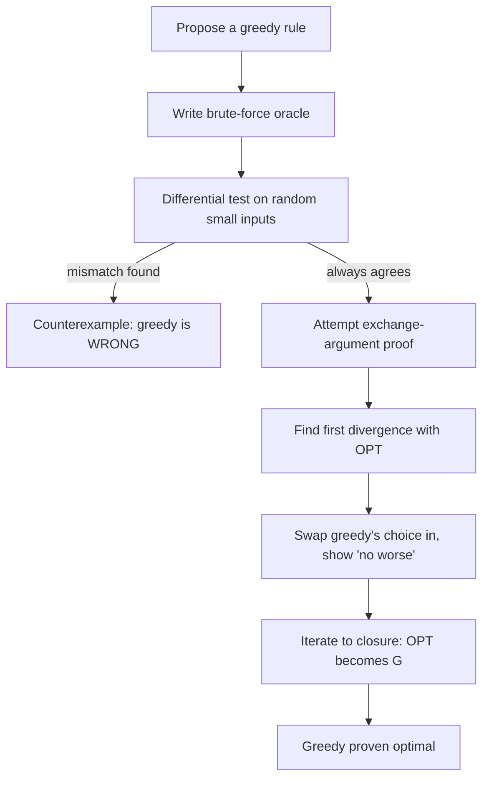

# Exchange Argument — Junior Level

> **One-line summary:** An **exchange argument** is the standard way to *prove* a greedy algorithm is correct: take any optimal solution, then repeatedly **swap** one of its pieces for the piece greedy would have chosen — showing each swap never makes the solution worse — until the optimal solution has been transformed into the greedy one. If you can always do that swap without loss, greedy must be optimal too.

---

## Table of Contents

1. [Introduction](#introduction)
2. [Prerequisites](#prerequisites)
3. [Glossary](#glossary)
4. [Core Concepts](#core-concepts)
5. [Big-O Summary](#big-o-summary)
6. [Real-World Analogies](#real-world-analogies)
7. [Pros & Cons](#pros--cons)
8. [Step-by-Step Walkthrough](#step-by-step-walkthrough)
9. [Code Examples](#code-examples)
10. [Coding Patterns](#coding-patterns)
11. [Error Handling](#error-handling)
12. [Performance Tips](#performance-tips)
13. [Best Practices](#best-practices)
14. [Edge Cases & Pitfalls](#edge-cases--pitfalls)
15. [Common Mistakes](#common-mistakes)
16. [Cheat Sheet](#cheat-sheet)
17. [Visual Animation](#visual-animation)
18. [Summary](#summary)
19. [Further Reading](#further-reading)

---

## Introduction

You have written a greedy algorithm. It sorts the input by some rule, then walks through and grabs whatever looks best right now. It produces an answer fast. But a nagging question remains: **how do you know the answer is actually optimal?** Greedy algorithms are famous for being *seductive* — they look obviously right, and then they quietly fail on some innocent-looking input. "Take the largest coin that fits" works for US coins but gives a wrong answer for denominations `{1, 3, 4}` and target `6` (greedy picks `4 + 1 + 1 = 3 coins`, but `3 + 3 = 2 coins` is better).

So a greedy algorithm is only worth trusting once you have a *proof* of correctness. The single most common, most reusable proof technique is the **exchange argument**. The idea is disarmingly simple:

1. Suppose, for contradiction or comparison, there is some **optimal** solution `OPT` that differs from the **greedy** solution `G`.
2. Find the **first place** they disagree. At that point greedy made a choice; `OPT` made a different one.
3. **Exchange** the element `OPT` used for the element greedy used. Argue that this swap is *legal* (still a valid solution) and *does not make `OPT` worse*.
4. Repeat. Each exchange makes `OPT` agree with `G` in one more position, and never increases cost (or never decreases value). After finitely many exchanges, `OPT` has become `G`. Since `OPT` was optimal and `G` is no worse, **`G` is also optimal**.

That is the whole machine. The art is in step 3 — proving the swap is always legal and never harmful. This file teaches you the intuition and walks through two complete, concrete examples (a coin-change disproof and a "minimize maximum lateness" scheduling proof) so the technique stops feeling like magic.

A closely related cousin is **"greedy stays ahead"**: instead of transforming `OPT` into `G`, you prove by induction that after every step greedy's partial solution is *at least as good* as any other solution's partial solution on the same prefix. Both are tools for the same job — certifying greedy correctness — and `middle.md` contrasts them carefully.

---

## Prerequisites

Before reading this file you should be comfortable with:

- **Greedy algorithms** — the basic shape: sort by a key, then iterate making a locally best choice. The sibling `01-activity-selection`, `02-huffman`, and `03-fractional-knapsack` are concrete examples we will prove correct here.
- **Sorting** — most greedy algorithms begin by sorting; the proof usually reasons about adjacent elements in sorted order.
- **Proof by contradiction** — "assume the opposite, derive an impossibility." The exchange argument is a structured form of this.
- **Proof by induction** — used by the "greedy stays ahead" variant and to formalize "repeat the swap until done."
- **Big-O notation** — to talk about the cost of the algorithm being proved (the proof itself adds no runtime).

Optional but helpful:

- A little experience writing **brute-force solvers** — we use one as an *oracle* to empirically test "is greedy really optimal here?" before trusting a paper proof.
- Familiarity with classic problems: **activity selection**, **coin change**, **interval scheduling**, **minimizing lateness**.

---

## Glossary

| Term | Meaning |
|------|---------|
| **Greedy choice** | The locally-best decision the algorithm makes at each step (e.g. "earliest finishing activity"). |
| **Greedy solution `G`** | The full output produced by repeatedly making the greedy choice. |
| **Optimal solution `OPT`** | Any solution achieving the best possible objective value (there may be several). |
| **Objective** | The quantity being optimized — minimized (cost, lateness, coins) or maximized (count, value). |
| **Exchange / swap** | Replacing one element of `OPT` with the element greedy chose, producing a new valid solution. |
| **Exchange argument** | A proof that transforms `OPT` into `G` by a sequence of harmless exchanges, proving `G` optimal. |
| **Greedy stays ahead** | An inductive proof that greedy's partial solution dominates any other after each step. |
| **Matroid** | An abstract structure (ground set + "independent" subsets) where greedy is *guaranteed* optimal. Introduced at `senior.md`. |
| **Counterexample** | A single input where greedy gives a non-optimal answer — disproves the strategy. |
| **Oracle / brute force** | An exhaustive solver that returns the true optimum; used to test greedy empirically. |
| **Optimal substructure** | The property that an optimal solution contains optimal solutions to subproblems — what lets the "repeat the swap" step recurse. |
| **Inversion** | A pair of elements out of greedy's preferred order; exchange arguments often "remove inversions" one at a time. |

---

## Core Concepts

### 1. Why greedy needs a proof at all

A greedy algorithm commits to a choice and never reconsiders it. That is exactly what makes it fast — and exactly what makes it dangerous. The choice that looks best now might block a better choice later. So for every greedy algorithm there are really two questions:

- **Does it run fast?** Usually yes — sort plus a single pass, so `O(n log n)`.
- **Is it correct (optimal)?** This is *not* obvious and must be proven. The exchange argument is the proof.

### 2. The exchange argument skeleton

Every exchange-argument proof has the same four moving parts:

1. **Set up the comparison.** Let `G` be greedy's solution and `OPT` an optimal solution. If `G = OPT`, done. Otherwise they differ somewhere.
2. **Locate the disagreement.** Order both solutions the way greedy considers elements. Find the first index where they differ — greedy took element `g`, `OPT` took element `o ≠ g`.
3. **Exchange and argue "no worse."** Modify `OPT` by swapping in `g` for `o` (and possibly removing whatever conflict that creates). Show the result is (a) still a valid solution and (b) at least as good as `OPT`.
4. **Iterate to closure.** Each exchange increases agreement with `G` by one and never worsens the objective. After at most `n` exchanges, `OPT` equals `G`, so `G` is optimal. ∎

### 3. "No worse," not "strictly better"

A subtle but crucial point: the exchange must show the swap **does not hurt** — it produces a solution *at least as good* as `OPT`. It does *not* need to produce a strictly better one (that would contradict `OPT` being optimal). The whole argument leans on the fact that you can keep `OPT`'s quality while making it look more like greedy.

### 4. Greedy stays ahead (the inductive sibling)

Instead of editing `OPT`, you can argue forward. Define a measure of "how good is the solution after `k` steps." Prove by induction that **greedy's measure after `k` steps is at least as good as any other valid solution's measure after `k` steps**. If greedy never falls behind, its final solution is optimal. This avoids talking about swaps at all and is sometimes cleaner (interval scheduling is the classic case).

### 5. When greedy *fails* — the counterexample

The flip side of proving correctness is *disproving* it. To show a greedy strategy is wrong you need exactly **one counterexample**: an input where greedy's answer is provably worse than the true optimum (found by brute force). Coin change with denominations `{1, 3, 4}` is the textbook example. A single counterexample is a complete disproof; no proof can survive it.

### 6. Optimal substructure makes the iteration valid

The "repeat the swap until done" step quietly relies on **optimal substructure**: after fixing greedy's first choice, the *rest* of the problem is a smaller instance of the same problem, and an optimal solution to the whole contains an optimal solution to that smaller part. Greedy algorithms that admit exchange proofs almost always have this property; it is what lets the argument recurse cleanly.

---

## Big-O Summary

The exchange argument is a *proof technique*, so it adds **zero** runtime. What matters is the cost of the algorithm it certifies and the cost of the brute-force oracle you test against.

| Item | Time | Space | Notes |
|------|------|-------|-------|
| Greedy algorithm (typical) | `O(n log n)` | `O(n)` | Sort by a key, single pass. |
| Exchange-argument proof | `O(1)` runtime | — | A pen-and-paper argument; no execution cost. |
| Brute-force oracle (subset/permutation search) | `O(2ⁿ)` or `O(n!)` | `O(n)` | Only for tiny `n`; used to *test* greedy. |
| Verification harness (greedy vs brute on all small inputs) | `O(#inputs · cost)` | `O(n)` | Empirical confidence before the formal proof. |

The lesson: greedy is cheap to *run* but the *guarantee* comes from the proof, and we cross-check the proof against an exponential oracle on small inputs.

---

## Real-World Analogies

| Concept | Analogy |
|---------|---------|
| Exchange argument | A chess coach proves your move is best by taking *any* winning line and swapping in your move at the first divergence, showing the line stays winning — so your move is at least as good. |
| Greedy choice | At a buffet you always take the dish nearest the entrance first; the proof asks whether any "smarter" ordering could beat it. |
| "No worse" swap | Trading one employee's shift for another without lowering total coverage — the schedule stays just as good. |
| Greedy stays ahead | Two runners on the same course; you show greedy is never behind at any checkpoint, so it finishes no later. |
| Counterexample | One receipt where "always grab the biggest coin" forces extra coins proves the cashier's rule is not optimal. |
| Optimal substructure | After you've correctly packed the first box, packing the remaining items is the *same* puzzle, just smaller. |
| Matroid | A "fairness rulebook" so well-behaved that grabbing the best legal item every time is guaranteed to win. |

Where the analogy breaks: real swaps in life can have side effects; in a clean exchange proof the swap is *provably* side-effect-free with respect to the objective — that rigor is the whole point.

---

## Pros & Cons

| Pros | Cons |
|------|------|
| One reusable template proves correctness for a whole family of greedy algorithms. | Requires you to *find* the right exchange — sometimes subtle (which element to swap, what conflict it creates). |
| Turns "it looks right" into a rigorous guarantee. | Only proves correctness; it does not make the algorithm faster. |
| Pairs naturally with a brute-force oracle for empirical confidence first. | If greedy is *wrong*, the exchange will fail — but recognizing *why* it fails takes practice. |
| Localizes the argument to *adjacent* elements (swap neighbors), keeping it simple. | The iteration-to-closure step needs optimal substructure, which must itself be argued. |
| Generalizes to the matroid framework, where greedy optimality is automatic. | Not every greedy problem fits a matroid; some need a bespoke exchange. |

**When to use:** to prove a sorting-based greedy (activity selection, scheduling, Huffman, fractional knapsack, MST) is optimal; to decide *whether* a proposed greedy rule is even correct.

**When NOT to use:** when the problem has no optimal substructure or greedy demonstrably fails (then use dynamic programming — sibling `13-dynamic-programming` — instead); when you only need an *approximation* guarantee (different proof style, see `07-set-cover-approximation`).

---

## Step-by-Step Walkthrough

We do two walkthroughs: first a **disproof** (coin change), then a **proof** (minimize maximum lateness). Seeing both halves makes the technique click.

### Walkthrough A — Disproving greedy coin change

**Claim to test:** "To make change for amount `V` with coin set `C`, always take the largest coin `≤` the remaining amount."

**Coins:** `C = {1, 3, 4}`. **Target:** `V = 6`.

- **Greedy:** largest coin `≤ 6` is `4`. Remaining `2`. Largest `≤ 2` is `1`. Remaining `1`. Take `1`. Total = `4 + 1 + 1` → **3 coins**.
- **Optimal (by inspection / brute force):** `3 + 3` → **2 coins**.

Greedy uses 3 coins, optimum uses 2. **One counterexample is enough**: the greedy strategy is *not* optimal for general coin systems. (It happens to be optimal for "canonical" systems like US coins, but proving *that* needs more than greedy intuition.)

This shows the *first* job of the exchange mindset: before proving, ask "can I break it?" If a brute-force oracle disagrees with greedy on any small input, stop — there is nothing to prove.

### Walkthrough B — Proving "minimize maximum lateness"

**Problem.** You have `n` jobs sharing one machine. Job `i` takes time `tᵢ` and has deadline `dᵢ`. You schedule them back-to-back in some order. If job `i` finishes at time `fᵢ`, its **lateness** is `Lᵢ = max(0, fᵢ − dᵢ)`. Goal: order the jobs to **minimize the maximum lateness** `L = maxᵢ Lᵢ`.

**Greedy rule:** **Earliest Deadline First (EDF)** — sort jobs by deadline ascending and run them in that order.

**Exchange-argument proof that EDF is optimal:**

**Step 1 — Set up.** Let `G` be the EDF order. Let `OPT` be any optimal order. If `OPT` already equals `G`, done.

**Step 2 — Find an inversion.** Since `OPT ≠ G` (and assuming no ties), `OPT` must contain an **inversion**: two jobs `a, b` scheduled *adjacent* with `a` before `b` but `dₐ > d_b` (the later-deadline job runs first — the opposite of EDF). A classic fact: any schedule with an inversion has one with *adjacent* inverted jobs.

**Step 3 — Exchange (swap the adjacent inverted pair).** Swap `a` and `b` so `b` now runs before `a`. We claim the maximum lateness does **not increase**:

- Only `a` and `b` change their finish times; every other job finishes at the same time.
- Let the pair occupy times `[s, s + tₐ + t_b]`. Before the swap `b` finishes last at `s + tₐ + t_b`; after the swap `a` finishes last at the *same* time `s + tₐ + t_b`.
- The job that now finishes last is `a`, with lateness `(s + tₐ + t_b) − dₐ`. Before the swap the last finisher `b` had lateness `(s + tₐ + t_b) − d_b`. Since `dₐ > d_b`, we have `(…) − dₐ < (…) − d_b`. So the new last-finisher's lateness is **no larger** than the old one's.
- Therefore `max(Lₐ, L_b)` does not increase, and no other job changed — the overall maximum lateness does not increase.

**Step 4 — Iterate.** Each adjacent swap removes one inversion without increasing the maximum lateness. A schedule with no inversions *is* the EDF order `G`. So we transformed `OPT` into `G` without ever making it worse. Hence `G` is optimal. ∎

That is a complete, rigorous exchange argument. Notice the shape: *set up → find an inversion → swap adjacent → prove "no worse" → iterate to closure.* Memorize that shape; it recurs in nearly every greedy proof.

---

## Code Examples

### Example: Verify EDF optimality empirically (greedy vs brute force)

A proof is reassuring, but a **verification harness** that compares greedy against an exhaustive oracle on every small input is how you *catch a wrong greedy rule before you waste time proving it*. Below, `greedyMaxLateness` runs EDF; `bruteMaxLateness` tries every permutation. They must always agree. All three programs print `EDF matches brute on all tested instances: true`.

#### Go

```go
package main

import (
	"fmt"
	"sort"
)

type Job struct{ t, d int } // processing time, deadline

// greedyMaxLateness schedules by Earliest Deadline First and returns max lateness.
func greedyMaxLateness(jobs []Job) int {
	js := append([]Job(nil), jobs...)
	sort.Slice(js, func(i, j int) bool { return js[i].d < js[j].d })
	time, maxLate := 0, 0
	for _, j := range js {
		time += j.t
		if late := time - j.d; late > maxLate {
			maxLate = late
		}
	}
	return maxLate
}

// bruteMaxLateness tries every ordering and returns the minimum achievable max lateness.
func bruteMaxLateness(jobs []Job) int {
	idx := make([]int, len(jobs))
	for i := range idx {
		idx[i] = i
	}
	best := 1 << 30
	var perm func(k int)
	perm = func(k int) {
		if k == len(idx) {
			time, maxLate := 0, 0
			for _, i := range idx {
				time += jobs[i].t
				if late := time - jobs[i].d; late > maxLate {
					maxLate = late
				}
			}
			if maxLate < best {
				best = maxLate
			}
			return
		}
		for i := k; i < len(idx); i++ {
			idx[k], idx[i] = idx[i], idx[k]
			perm(k + 1)
			idx[k], idx[i] = idx[i], idx[k]
		}
	}
	perm(0)
	return best
}

func main() {
	instances := [][]Job{
		{{2, 2}, {1, 3}, {3, 5}},
		{{4, 4}, {2, 3}, {1, 9}, {3, 8}},
		{{1, 1}, {1, 1}, {1, 2}},
		{{5, 2}, {2, 10}, {1, 3}},
	}
	ok := true
	for _, inst := range instances {
		if greedyMaxLateness(inst) != bruteMaxLateness(inst) {
			ok = false
		}
	}
	fmt.Println("EDF matches brute on all tested instances:", ok)
}
```

#### Java

```java
import java.util.*;

public class ExchangeEDF {
    record Job(int t, int d) {}

    static int greedyMaxLateness(List<Job> jobs) {
        List<Job> js = new ArrayList<>(jobs);
        js.sort(Comparator.comparingInt(Job::d));
        int time = 0, maxLate = 0;
        for (Job j : js) {
            time += j.t();
            maxLate = Math.max(maxLate, time - j.d());
        }
        return maxLate;
    }

    static int best;
    static int bruteMaxLateness(List<Job> jobs) {
        best = Integer.MAX_VALUE;
        permute(jobs, new boolean[jobs.size()], new ArrayList<>());
        return best;
    }
    static void permute(List<Job> jobs, boolean[] used, List<Job> cur) {
        if (cur.size() == jobs.size()) {
            int time = 0, maxLate = 0;
            for (Job j : cur) { time += j.t(); maxLate = Math.max(maxLate, time - j.d()); }
            best = Math.min(best, maxLate);
            return;
        }
        for (int i = 0; i < jobs.size(); i++) {
            if (used[i]) continue;
            used[i] = true; cur.add(jobs.get(i));
            permute(jobs, used, cur);
            cur.remove(cur.size() - 1); used[i] = false;
        }
    }

    public static void main(String[] args) {
        List<List<Job>> instances = List.of(
            List.of(new Job(2, 2), new Job(1, 3), new Job(3, 5)),
            List.of(new Job(4, 4), new Job(2, 3), new Job(1, 9), new Job(3, 8)),
            List.of(new Job(1, 1), new Job(1, 1), new Job(1, 2)),
            List.of(new Job(5, 2), new Job(2, 10), new Job(1, 3))
        );
        boolean ok = true;
        for (List<Job> inst : instances)
            if (greedyMaxLateness(inst) != bruteMaxLateness(inst)) ok = false;
        System.out.println("EDF matches brute on all tested instances: " + ok);
    }
}
```

#### Python

```python
from itertools import permutations


def greedy_max_lateness(jobs):
    """Earliest Deadline First; jobs are (processing_time, deadline)."""
    time = 0
    max_late = 0
    for t, d in sorted(jobs, key=lambda j: j[1]):
        time += t
        max_late = max(max_late, time - d)
    return max_late


def brute_max_lateness(jobs):
    best = float("inf")
    for order in permutations(jobs):
        time = 0
        max_late = 0
        for t, d in order:
            time += t
            max_late = max(max_late, time - d)
        best = min(best, max_late)
    return best


if __name__ == "__main__":
    instances = [
        [(2, 2), (1, 3), (3, 5)],
        [(4, 4), (2, 3), (1, 9), (3, 8)],
        [(1, 1), (1, 1), (1, 2)],
        [(5, 2), (2, 10), (1, 3)],
    ]
    ok = all(greedy_max_lateness(i) == brute_max_lateness(i) for i in instances)
    print("EDF matches brute on all tested instances:", ok)
```

**What it does:** runs EDF and an exhaustive permutation oracle, confirming they agree on every test instance — the empirical mirror of the exchange proof.
**Run:** `go run main.go` | `javac ExchangeEDF.java && java ExchangeEDF` | `python edf.py`

---

## Coding Patterns

### Pattern 1: Build the brute-force oracle first

**Intent:** Before proving (or even trusting) greedy, write the exhaustive solver. It is your ground truth on small inputs.

```python
from itertools import permutations

def brute(jobs, score):
    """score(order) -> objective; returns the best (min) over all orders."""
    return min(score(order) for order in permutations(jobs))
```

This is the same oracle used in every verification harness; keep it generic over a `score` function so you can reuse it for many greedy rules.

### Pattern 2: Express greedy as "sort by key, then sweep"

**Intent:** Almost every exchange-provable greedy has this exact shape, which makes the proof reason about adjacent elements in sorted order.

```python
def greedy(items, key, take):
    chosen = []
    for x in sorted(items, key=key):
        if take(chosen, x):
            chosen.append(x)
    return chosen
```

### Pattern 3: Randomized differential testing (greedy vs brute)

**Intent:** Generate many random tiny inputs and assert greedy equals brute. A single mismatch is a counterexample that *disproves* the greedy rule.

```python
import random

def differential_test(greedy, brute, gen, trials=2000):
    for _ in range(trials):
        inst = gen()
        if greedy(inst) != brute(inst):
            return inst          # <- a counterexample!
    return None                  # greedy survived all trials
```



---

## Error Handling

| Error | Cause | Fix |
|-------|-------|-----|
| Greedy and brute disagree on a tiny input | The greedy rule is simply not optimal for this problem. | That input is a counterexample — abandon (or fix) the greedy rule; do not try to "prove" a false claim. |
| Exchange step seems to *increase* the objective | You picked the wrong element to swap, or swapped non-adjacent elements. | Restrict to swapping the *adjacent* inverted pair; recheck the "no worse" inequality. |
| Proof "works" but greedy fails in tests | The proof has a hidden gap (often an unstated tie-breaking or substructure assumption). | Trust the failing test; re-examine the exchange for the case the test exposes. |
| Brute force too slow to test | Oracle is `O(n!)`; you used too large an `n`. | Keep test instances tiny (`n ≤ 8`); randomized differential testing on small inputs is enough. |
| Off-by-one in lateness/finish times | Mixing up "finish at `time`" vs "finish at `time + t`". | Accumulate `time += t` *before* computing lateness `time − d`. |
| Floating objective rounding | Comparing greedy/brute scores that involve division. | Use exact integer or fraction arithmetic in the oracle and the greedy (see fractional knapsack at `professional.md`). |

---

## Performance Tips

- **The proof costs nothing at runtime** — do not conflate "proving correctness" with "optimizing speed." The exchange argument is offline reasoning.
- **Keep the oracle tiny.** Test greedy against brute force only on inputs small enough that `O(n!)` or `O(2ⁿ)` finishes instantly (`n ≤ 8`–`10`).
- **Reuse one generic oracle** parameterized by a scoring function across all your greedy proofs, rather than re-writing exhaustive search per problem.
- **Sort once.** The greedy algorithms themselves dominate at `O(n log n)` because of the initial sort; the sweep is linear.
- **Cache the sorted order** if you re-run greedy with the same key on the same data during testing.
- **Prefer adjacent swaps in the proof** — they keep the "only two finish times change" argument airtight and make the inequality trivial to check.

---

## Best Practices

- **Disprove before you prove.** Always run a differential test against a brute-force oracle first. If greedy is wrong, you save the entire proof effort.
- **Name your objective precisely** ("minimize the maximum lateness," not "make it good"). Half of failed proofs come from a fuzzy objective.
- **State the greedy rule as a sort key.** "Earliest deadline first" = sort by `d`. This makes "the first place greedy and OPT differ" well-defined.
- **Swap adjacent inverted elements only.** It localizes the "no worse" argument to two jobs.
- **Prove "no worse," not "strictly better."** Aiming for strict improvement contradicts `OPT`'s optimality and is the wrong target.
- **Close the loop explicitly.** Say *why* finitely many swaps terminate (each removes an inversion; there are finitely many inversions).
- **Re-test after you "fix" a greedy rule.** A patched rule needs its own fresh differential test.

---

## Edge Cases & Pitfalls

- **Ties.** If two elements share the greedy key (equal deadlines), `G` and `OPT` may differ only in tie order; handle by allowing the swap to be cost-neutral or fixing a deterministic tie-break.
- **Empty input.** Zero jobs/coins → trivially optimal (objective `0` or "no solution needed"). Make sure greedy and oracle both handle `n = 0`.
- **Single element.** One choice; greedy and optimum coincide trivially — a useful base case for the induction.
- **Multiple optima.** There can be many optimal solutions; the exchange transforms *one* of them into `G`. You do not need `G` to equal *every* optimum, just to be *as good as one*.
- **Greedy correct only on a subclass.** Coin change greedy is optimal for *canonical* systems but not general ones — be explicit about the class of inputs your proof covers.
- **Non-adjacent swaps.** Swapping far-apart elements can change many finish times at once and break the clean inequality; always reduce to adjacent swaps.
- **Forgetting optimal substructure.** Without it, "iterate the swap" may not terminate cleanly; check that fixing greedy's choice leaves a smaller instance of the same problem.

---

## Common Mistakes

1. **Skipping the disproof step** and trying to prove a greedy rule that is actually false (coin change `{1,3,4}` is the classic trap).
2. **Swapping non-adjacent elements**, which changes multiple finish times and ruins the "no worse" inequality.
3. **Aiming for a strictly better swap** instead of a "no worse" one — this contradicts `OPT`'s optimality and confuses the argument.
4. **Computing lateness before advancing time** (`time − d` before `time += t`), an off-by-one that silently corrupts the oracle.
5. **Testing on inputs too large** for the brute force, so you never actually verify and ship a wrong rule.
6. **Assuming greedy equals every optimum**; it only needs to match *one* optimal solution after the exchanges.
7. **Forgetting tie-breaking**, so `G` and `OPT` "differ" only cosmetically and the proof gets confused about what to swap.

---

## Cheat Sheet

| Step | Operation |
|------|-----------|
| 1. Disprove first | Differential-test greedy vs brute on small random inputs. A mismatch = counterexample = stop. |
| 2. Set up | Let `G` = greedy, `OPT` = any optimum. If equal, done. |
| 3. Find divergence | Order both by greedy's key; locate the first index they differ (an *inversion*). |
| 4. Exchange | Swap the *adjacent* inverted pair so greedy's choice comes first. |
| 5. Show "no worse" | Prove the swap keeps validity and does not worsen the objective. |
| 6. Iterate | Each swap removes one inversion; finitely many ⇒ `OPT` becomes `G` ⇒ `G` optimal. |

Key facts:

```
exchange argument = transform OPT into G via harmless swaps
swap must be: (a) still valid, (b) objective no worse
swap ADJACENT inverted elements (keeps argument local)
goal of swap = "no worse," NOT "strictly better"
greedy stays ahead = inductive sibling (prove greedy never falls behind)
one counterexample fully disproves a greedy rule
matroid = structure where greedy is automatically optimal (see senior.md)
proof runtime cost = 0; algorithm runtime usually O(n log n)
```

Tiny verified examples:

```
EDF (minimize max lateness)  → provably optimal (exchange argument)
activity selection (earliest finish) → provably optimal
coin change greedy {1,3,4}, V=6 → WRONG (greedy 3 coins, opt 2)
fractional knapsack (by value/weight) → provably optimal
```

---

## Visual Animation

> See [`animation.html`](./animation.html) for an interactive visualization of the exchange argument.
>
> The animation demonstrates:
> - A set of jobs with deadlines, an optimal schedule, and the greedy (EDF) schedule side by side
> - Locating the first **inversion** where the optimal schedule disagrees with greedy
> - Performing the **adjacent swap** and showing the maximum lateness does not increase
> - Repeating swaps until the optimal schedule has been transformed into the greedy one
> - A toggle to a coin-change view that shows greedy *failing* on `{1, 3, 4}` (the disproof side)

---

## Summary

A greedy algorithm is fast because it never reconsiders a choice — and *suspect* for the very same reason. The **exchange argument** is the standard, reusable proof that turns suspicion into certainty: take any optimal solution `OPT`, find the first place it disagrees with the greedy solution `G`, swap greedy's choice in, and prove that swap keeps the solution valid and **no worse**. Because each swap makes `OPT` agree with `G` in one more spot and never hurts the objective, finitely many swaps transform `OPT` into `G` — so `G` must be optimal too. The mirror-image skill is **disproof**: one counterexample from a brute-force oracle (like coin change on `{1, 3, 4}`) instantly kills a false greedy rule, so always test before you prove. Master the five-beat shape — *set up, find an inversion, swap adjacent, show "no worse," iterate* — and you can certify (or refute) almost any sorting-based greedy you will meet.

---

## Further Reading

- Kleinberg & Tardos, *Algorithm Design*, Chapter 4 — the canonical treatment of exchange arguments and "greedy stays ahead."
- Cormen, Leiserson, Rivest, Stein (CLRS), *Introduction to Algorithms*, Chapter 16 — greedy algorithms, matroids, and proofs of optimality.
- Jeff Erickson, *Algorithms* (free online), greedy chapter — many worked exchange arguments.
- Sibling topic `01-activity-selection` — the earliest-finish greedy proven by exchange.
- Sibling topic `02-huffman` — an exchange argument on the two least-frequent symbols.
- Sibling topic `03-fractional-knapsack` — exchange by value-to-weight ratio.
- Sibling topic `13-dynamic-programming` — what to reach for when greedy (and its exchange proof) fails.
