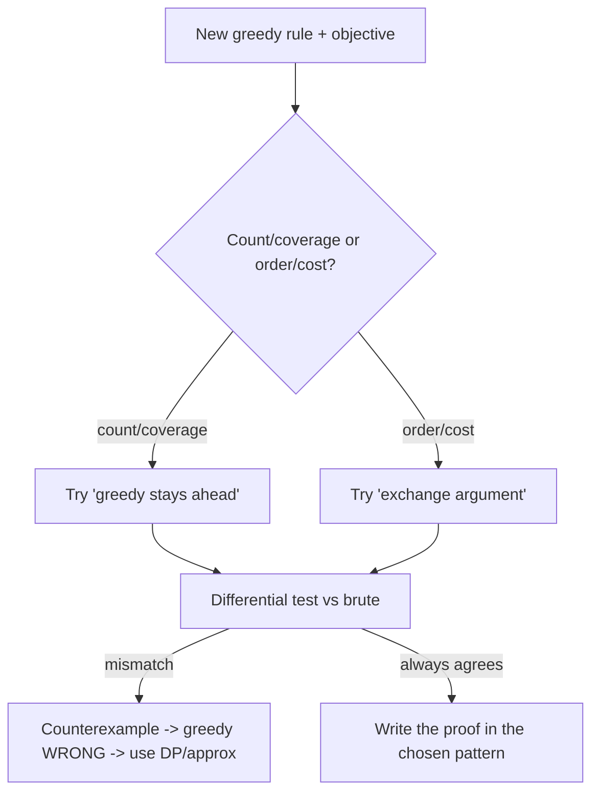

# Exchange Argument — Middle Level

> **One-line summary:** At the middle level the question shifts from "what is an exchange argument" to "**when** does greedy actually work, and **which** proof technique fits?" You learn to recognize the two signature patterns — the **exchange argument** (transform `OPT` into `G` by harmless swaps) and **"greedy stays ahead"** (induct that greedy never falls behind) — to map each to the problems it fits, and to spot the structural smell of a greedy strategy that is doomed to fail.

---

## Table of Contents

1. [Introduction](#introduction)
2. [Two Greedy-Correctness Proof Patterns](#two-greedy-correctness-proof-patterns)
3. [When Greedy Works vs When It Fails](#when-greedy-works-vs-when-it-fails)
4. [Pattern Selection: Which Proof for Which Problem](#pattern-selection-which-proof-for-which-problem)
5. [Worked Proofs](#worked-proofs)
6. [Code Examples](#code-examples)
7. [Coding Patterns](#coding-patterns)
8. [Complexity Analysis](#complexity-analysis)
9. [Testing and Verification](#testing-and-verification)
10. [Common Pitfalls](#common-pitfalls)
11. [Decision Guide](#decision-guide)
12. [Summary](#summary)

---

## Introduction

You can now run an exchange argument when handed one. The middle-level skill is *judgment*: faced with a new optimization problem and a tempting greedy rule, can you predict whether greedy is correct — and if so, choose the cleanest proof? Two failure modes are common in practice:

- **Proving a false claim.** Engineers fall in love with a greedy heuristic, "prove" it with a hand-wavy exchange, and ship a subtly wrong algorithm. The cure is *disproof-first*: a brute-force oracle and differential testing.
- **Using the wrong proof tool.** Some problems yield instantly to "greedy stays ahead" (interval scheduling) and resist a clean swap; others are natural exchanges (minimize lateness, Huffman). Forcing the wrong tool produces a tangled, unconvincing argument.

This file builds that judgment. We contrast the two proof patterns precisely, catalog the structural signals that say "greedy will work here" versus "greedy will fail here," and walk through several proofs end-to-end. By the end you should be able to look at a greedy rule and say, with confidence, *"this is provable by exchange because…"* or *"this fails — here is the counterexample."*

---

## Two Greedy-Correctness Proof Patterns

### Pattern 1 — Exchange argument ("transform OPT into G")

**Shape.** Start from an arbitrary optimum `OPT`. Repeatedly modify it toward the greedy solution `G` by swapping in greedy's choices, proving each swap is valid and **no worse**. After finitely many swaps `OPT` *becomes* `G`, so `G` is optimal.

**You reason about:** a *single* exchange between two (usually adjacent) elements, plus a termination argument (each swap removes an inversion).

**Fits when:** the objective is sensitive to *local order* and you can show swapping an out-of-order adjacent pair never hurts. Minimize-maximum-lateness, Huffman's two-smallest merge, fractional knapsack, MST cut/cycle arguments.

### Pattern 2 — Greedy stays ahead ("greedy never falls behind")

**Shape.** Define a per-step *progress measure* `μ`. Prove by induction: after greedy's `k`-th choice, `μ(G_k)` is at least as good as `μ(S_k)` for *any* valid solution `S`. If greedy is never behind at any step, its final solution is optimal.

**You reason about:** an *inductive invariant* comparing greedy's prefix to an arbitrary solution's prefix — no swapping required.

**Fits when:** there is a natural "how far along / how much room left" measure that greedy maximizes step by step. Interval scheduling (maximize number of non-overlapping intervals), where the measure is "earliest finish time of the `k`-th chosen interval."

### Side-by-side

| Aspect | Exchange argument | Greedy stays ahead |
|--------|-------------------|--------------------|
| Core move | Swap elements of `OPT` toward `G` | Induct that greedy dominates after each step |
| Object of reasoning | One adjacent swap + termination | A progress measure + inductive step |
| Typical objective | Cost/value sensitive to order | Count/coverage that accumulates |
| Classic example | Minimize max lateness, Huffman | Interval scheduling (earliest finish) |
| Failure signal | No "no worse" swap exists | Greedy's measure can fall behind |
| Relationship | Two faces of the same coin | Two faces of the same coin |

They are interchangeable in principle — anything provable one way is provable the other — but in practice one is usually far cleaner. Recognizing which is the middle-level payoff.

---

## When Greedy Works vs When It Fails

Greedy correctness is not luck; it correlates with structure. Here are the signals.

### Signals that greedy WILL work

- **Optimal substructure.** After fixing greedy's first (correct) choice, the remaining problem is a smaller instance of the same problem, and an optimal whole contains an optimal remainder. This is what lets the exchange *iterate*.
- **The greedy-choice property.** There exists an optimal solution that *makes the greedy choice first*. (This is exactly what one exchange proves: you can always shuffle an optimum so its first choice is greedy's.)
- **Matroid structure (introduced fully at `senior.md`).** If the feasible sets form a matroid, greedy is *guaranteed* optimal for any linear objective — no bespoke proof needed.
- **An exchange that never hurts.** You can swap any "wrong" adjacent element for greedy's preferred one without worsening the objective.

### Signals that greedy will FAIL

- **Choices interact globally.** A locally great choice forecloses a better global combination (0/1 knapsack: grabbing the best ratio item can waste capacity).
- **No "no worse" swap.** Every attempt to swap greedy's choice into an optimum *strictly worsens* it — the exchange breaks.
- **The objective is not separable.** Coin change with arbitrary denominations: the best first coin depends on the whole remaining structure, so "largest coin" is myopic.
- **A small counterexample exists.** The empirical signal: brute force beats greedy on some tiny input. One counterexample is a complete disproof.

### The classic contrast: fractional vs 0/1 knapsack

- **Fractional knapsack** (you may take fractions of items): greedy by **value/weight ratio** is optimal. Exchange proof: if an optimum takes less of a higher-ratio item and more of a lower-ratio one, swap an `ε` of weight from low-ratio to high-ratio — value strictly rises or stays, contradiction. *Greedy works.*
- **0/1 knapsack** (each item all-or-nothing): greedy by ratio **fails**. Counterexample: capacity `10`, items `(value 60, weight 10)` ratio `6`, `(100, 20)`... wait — simpler: capacity `5`, items `A=(v6,w4,ratio1.5)`, `B=(v5,w3)`, `C=(v5,w2)`. Greedy by ratio may take `A` (uses 4, leaves room for nothing of weight 3) for value `6`, while `B+C` fits in weight `5` for value `10`. *Greedy fails — use DP (sibling `13-dynamic-programming`).*

The *only* difference is divisibility, and it flips greedy from provably optimal to provably wrong. That is the lesson: tiny structural changes break greedy, so always re-test.

---

## Pattern Selection: Which Proof for Which Problem

| Problem | Greedy rule | Correct? | Best proof | Why |
|---------|-------------|----------|-----------|-----|
| Interval scheduling (max # non-overlapping) | Earliest finish time | Yes | Greedy stays ahead | Natural progress measure: finish time of `k`-th pick. |
| Minimize maximum lateness | Earliest deadline first | Yes | Exchange | Adjacent swap of an inversion never raises max lateness. |
| Huffman coding | Merge two least-frequent | Yes | Exchange | Swap the two rarest symbols to the deepest leaves. |
| Fractional knapsack | Highest value/weight ratio | Yes | Exchange | Move `ε` weight to higher ratio item, value ↑. |
| Minimum spanning tree | Lightest safe edge (Kruskal/Prim) | Yes | Exchange (cut/cycle) | Swap a tree edge for a lighter one across a cut. |
| Coin change (general coins) | Largest coin first | **No** | — (disproved) | `{1,3,4}`, `V=6` counterexample. |
| 0/1 knapsack | Highest ratio | **No** | — (disproved) | Indivisibility wastes capacity. |
| Set cover (min sets) | Most-new-elements set | Approx only | Stays-ahead (`ln n` bound) | Not optimal, but provably within `ln n` — see `07-set-cover-approximation`. |

The actionable rule: **count/coverage objectives → try "stays ahead"; order/cost objectives → try "exchange."** And for anything on the "No" rows, do not attempt a proof — produce the counterexample and switch to DP or an approximation guarantee.

---

## Worked Proofs

### Proof 1 — Interval scheduling via "greedy stays ahead"

**Problem.** Given intervals `[s_i, f_i)`, select the maximum number that are pairwise non-overlapping.

**Greedy.** Sort by finish time; repeatedly take the next interval that starts at or after the last taken interval's finish.

**Stays-ahead proof.** Let `G = g_1, g_2, …, g_k` be greedy's picks (in order taken) and `O = o_1, o_2, …, o_m` any optimal selection, both sorted by finish time. Claim: for all `r ≤ k`, `f(g_r) ≤ f(o_r)` ("greedy's `r`-th interval finishes no later than the optimum's `r`-th").

*Induction.* Base `r = 1`: greedy picks the globally earliest-finishing interval, so `f(g_1) ≤ f(o_1)`. Step: assume `f(g_{r-1}) ≤ f(o_{r-1})`. Since `O` is non-overlapping, `s(o_r) ≥ f(o_{r-1}) ≥ f(g_{r-1})`, so `o_r` was *available* to greedy when it chose `g_r`; greedy takes the earliest-finishing available interval, hence `f(g_r) ≤ f(o_r)`.

*Conclusion.* If `m > k`, then `o_{k+1}` exists with `s(o_{k+1}) ≥ f(o_k) ≥ f(g_k)`, so `o_{k+1}` was available to greedy after `g_k` — but greedy stopped, a contradiction. Hence `k ≥ m`, so greedy is optimal. ∎

Notice: no swapping. The whole proof is "greedy's `r`-th choice never finishes later," an invariant. This is why interval scheduling is the textbook *stays-ahead* problem.

### Proof 2 — Fractional knapsack via exchange

**Problem.** Capacity `W`; items with value `v_i`, weight `w_i`; you may take any fraction `x_i ∈ [0,1]`. Maximize `Σ x_i v_i` subject to `Σ x_i w_i ≤ W`.

**Greedy.** Sort by ratio `v_i / w_i` descending; fill greedily, taking a fraction of the last item if needed.

**Exchange proof.** Let `OPT = (x_i)` be optimal and `G = (g_i)` greedy. Suppose they differ. Then there exist items `a` (higher ratio) and `b` (lower ratio) with `OPT` taking *less* of `a` than greedy (`x_a < g_a`) and *more* of `b` (`x_b > 0` where greedy would have taken less). Move a tiny weight `δ > 0` from `b` to `a`: decrease `x_b` by `δ/w_b`, increase `x_a` by `δ/w_a`, keeping total weight fixed. The value changes by `δ·(v_a/w_a − v_b/w_b) ≥ 0` since `a`'s ratio is higher. So the swap does not lower value and moves `OPT` toward `G`. Repeat until `OPT = G`. Hence `G` is optimal. ∎

The signature is identical to minimize-lateness: *find the inversion (lower-ratio item taken over higher), swap `ε`, show value no worse, iterate.*

### Proof 2b — Minimum spanning tree via the cut-property exchange

**Problem.** Given a connected weighted graph, find a spanning tree of minimum total edge weight.

**Greedy.** Kruskal: sort edges ascending; add each edge if it does not form a cycle.

**Exchange proof (cut property).** Let `T` be Kruskal's tree and `T*` any minimum spanning tree. If `T = T*`, done. Otherwise let `e` be the lightest edge in `T` but not in `T*` (it exists since both are spanning trees of the same size). Adding `e` to `T*` creates a unique cycle; that cycle must contain some edge `f` not in `T` (otherwise `T` would contain the cycle). Since Kruskal added `e` over `f` when both were candidates across the cut `e` defines, `w(e) ≤ w(f)`. Form `T' = (T* \ {f}) ∪ {e}` — still a spanning tree, with `w(T') = w(T*) − w(f) + w(e) ≤ w(T*)`. As `T*` was minimum, `w(T') = w(T*)`, so `T'` is also a minimum spanning tree agreeing with `T` on one more edge. Iterate until `T* = T`. Hence Kruskal is optimal. ∎

This is the **cut/cycle swap** shape: swap a heavier cycle edge for the lighter cross-cut edge greedy chose. `senior.md` shows it is exactly the matroid exchange axiom on the graphic matroid. (See sibling `11-graphs/10-mst-kruskal-prim`.)

### Proof 3 — Why coin change greedy has no exchange proof

You cannot prove a false statement. Attempting an exchange for greedy coin change on `{1,3,4}`, `V=6`: greedy = `{4,1,1}` (3 coins), `OPT = {3,3}` (2 coins). Try to swap a `3` from `OPT` for greedy's `4` — but `4 > 3` overshoots unless you also remove value elsewhere, and any legal rearrangement that introduces greedy's `4` *increases* the coin count. The "no worse" swap simply does not exist; the exchange *fails*, which is the formal shadow of the counterexample. Recognizing a *failing* exchange is itself a skill: it tells you greedy is wrong here.

---

## Code Examples

### Example: A reusable greedy-vs-brute differential tester for three problems

We bundle three greedy rules — interval scheduling (correct), fractional knapsack (correct), and 0/1 knapsack-by-ratio (wrong) — each with a brute-force oracle, and report which survive differential testing. All three programs print that interval scheduling and fractional knapsack agree with brute, while 0/1-by-ratio is caught failing.

#### Go

```go
package main

import (
	"fmt"
	"sort"
)

// ---- interval scheduling: greedy by earliest finish (CORRECT) ----
func greedyIntervals(iv [][2]int) int {
	s := append([][2]int(nil), iv...)
	sort.Slice(s, func(i, j int) bool { return s[i][1] < s[j][1] })
	count, lastFinish := 0, -1<<30
	for _, x := range s {
		if x[0] >= lastFinish {
			count++
			lastFinish = x[1]
		}
	}
	return count
}

func bruteIntervals(iv [][2]int) int {
	best := 0
	n := len(iv)
	for mask := 0; mask < (1 << n); mask++ {
		var sel [][2]int
		for i := 0; i < n; i++ {
			if mask&(1<<i) != 0 {
				sel = append(sel, iv[i])
			}
		}
		sort.Slice(sel, func(i, j int) bool { return sel[i][1] < sel[j][1] })
		ok := true
		for i := 1; i < len(sel); i++ {
			if sel[i][0] < sel[i-1][1] {
				ok = false
				break
			}
		}
		if ok && len(sel) > best {
			best = len(sel)
		}
	}
	return best
}

// ---- 0/1 knapsack by ratio (WRONG) vs exact brute ----
func greedy01ByRatio(W int, vw [][2]int) int {
	idx := make([]int, len(vw))
	for i := range idx {
		idx[i] = i
	}
	sort.Slice(idx, func(i, j int) bool {
		return float64(vw[idx[i]][0])/float64(vw[idx[i]][1]) >
			float64(vw[idx[j]][0])/float64(vw[idx[j]][1])
	})
	cap, val := W, 0
	for _, i := range idx {
		if vw[i][1] <= cap {
			cap -= vw[i][1]
			val += vw[i][0]
		}
	}
	return val
}

func brute01(W int, vw [][2]int) int {
	best, n := 0, len(vw)
	for mask := 0; mask < (1 << n); mask++ {
		w, v := 0, 0
		for i := 0; i < n; i++ {
			if mask&(1<<i) != 0 {
				w += vw[i][1]
				v += vw[i][0]
			}
		}
		if w <= W && v > best {
			best = v
		}
	}
	return best
}

func main() {
	ivs := [][][2]int{
		{{0, 3}, {1, 4}, {3, 5}, {4, 6}},
		{{0, 6}, {1, 2}, {2, 4}, {4, 7}, {5, 6}},
	}
	intOK := true
	for _, iv := range ivs {
		if greedyIntervals(iv) != bruteIntervals(iv) {
			intOK = false
		}
	}
	fmt.Println("interval scheduling greedy correct:", intOK)

	// 0/1 knapsack counterexample: capacity 5
	W := 5
	items := [][2]int{{6, 4}, {5, 3}, {5, 2}} // {value, weight}
	fmt.Printf("0/1-by-ratio = %d, brute optimal = %d, greedy correct: %v\n",
		greedy01ByRatio(W, items), brute01(W, items),
		greedy01ByRatio(W, items) == brute01(W, items))
}
```

#### Java

```java
import java.util.*;

public class GreedyDiff {
    static int greedyIntervals(int[][] iv) {
        int[][] s = Arrays.stream(iv).map(int[]::clone).toArray(int[][]::new);
        Arrays.sort(s, Comparator.comparingInt(a -> a[1]));
        int count = 0, lastFinish = Integer.MIN_VALUE;
        for (int[] x : s) if (x[0] >= lastFinish) { count++; lastFinish = x[1]; }
        return count;
    }

    static int bruteIntervals(int[][] iv) {
        int best = 0, n = iv.length;
        for (int mask = 0; mask < (1 << n); mask++) {
            List<int[]> sel = new ArrayList<>();
            for (int i = 0; i < n; i++) if ((mask & (1 << i)) != 0) sel.add(iv[i]);
            sel.sort(Comparator.comparingInt(a -> a[1]));
            boolean ok = true;
            for (int i = 1; i < sel.size(); i++)
                if (sel.get(i)[0] < sel.get(i - 1)[1]) { ok = false; break; }
            if (ok) best = Math.max(best, sel.size());
        }
        return best;
    }

    static int greedy01ByRatio(int W, int[][] vw) {
        Integer[] idx = new Integer[vw.length];
        for (int i = 0; i < vw.length; i++) idx[i] = i;
        Arrays.sort(idx, (a, b) ->
            Double.compare((double) vw[b][0] / vw[b][1], (double) vw[a][0] / vw[a][1]));
        int cap = W, val = 0;
        for (int i : idx) if (vw[i][1] <= cap) { cap -= vw[i][1]; val += vw[i][0]; }
        return val;
    }

    static int brute01(int W, int[][] vw) {
        int best = 0, n = vw.length;
        for (int mask = 0; mask < (1 << n); mask++) {
            int w = 0, v = 0;
            for (int i = 0; i < n; i++) if ((mask & (1 << i)) != 0) { w += vw[i][1]; v += vw[i][0]; }
            if (w <= W) best = Math.max(best, v);
        }
        return best;
    }

    public static void main(String[] args) {
        int[][][] ivs = {
            {{0, 3}, {1, 4}, {3, 5}, {4, 6}},
            {{0, 6}, {1, 2}, {2, 4}, {4, 7}, {5, 6}}
        };
        boolean intOK = true;
        for (int[][] iv : ivs) if (greedyIntervals(iv) != bruteIntervals(iv)) intOK = false;
        System.out.println("interval scheduling greedy correct: " + intOK);

        int W = 5;
        int[][] items = {{6, 4}, {5, 3}, {5, 2}};
        int g = greedy01ByRatio(W, items), b = brute01(W, items);
        System.out.printf("0/1-by-ratio = %d, brute optimal = %d, greedy correct: %b%n", g, b, g == b);
    }
}
```

#### Python

```python
from itertools import combinations


def greedy_intervals(iv):
    count, last_finish = 0, float("-inf")
    for s, f in sorted(iv, key=lambda x: x[1]):
        if s >= last_finish:
            count += 1
            last_finish = f
    return count


def brute_intervals(iv):
    best = 0
    n = len(iv)
    for k in range(n + 1):
        for sel in combinations(iv, k):
            ss = sorted(sel, key=lambda x: x[1])
            if all(ss[i][0] >= ss[i - 1][1] for i in range(1, len(ss))):
                best = max(best, len(ss))
    return best


def greedy_01_by_ratio(W, items):  # items: (value, weight) -- WRONG strategy
    cap, val = W, 0
    for v, w in sorted(items, key=lambda it: it[0] / it[1], reverse=True):
        if w <= cap:
            cap -= w
            val += v
    return val


def brute_01(W, items):
    best = 0
    n = len(items)
    for mask in range(1 << n):
        w = sum(items[i][1] for i in range(n) if mask & (1 << i))
        v = sum(items[i][0] for i in range(n) if mask & (1 << i))
        if w <= W:
            best = max(best, v)
    return best


if __name__ == "__main__":
    ivs = [
        [(0, 3), (1, 4), (3, 5), (4, 6)],
        [(0, 6), (1, 2), (2, 4), (4, 7), (5, 6)],
    ]
    int_ok = all(greedy_intervals(iv) == brute_intervals(iv) for iv in ivs)
    print("interval scheduling greedy correct:", int_ok)

    W, items = 5, [(6, 4), (5, 3), (5, 2)]
    g, b = greedy_01_by_ratio(W, items), brute_01(W, items)
    print(f"0/1-by-ratio = {g}, brute optimal = {b}, greedy correct: {g == b}")
```

**What it does:** confirms interval-scheduling greedy is optimal on test instances while *catching* 0/1-knapsack-by-ratio failing — empirically separating provable greedy from doomed greedy.
**Run:** `go run main.go` | `javac GreedyDiff.java && java GreedyDiff` | `python diff.py`

---

## Coding Patterns

### Pattern 1: Generic differential tester over random small inputs

**Intent:** Decide *empirically* whether a greedy rule is even worth proving.

```python
import random

def random_search_counterexample(greedy, brute, gen, trials=5000):
    for _ in range(trials):
        inst = gen()
        if greedy(inst) != brute(inst):
            return inst         # counterexample -> greedy is WRONG
    return None                 # survived -> attempt a proof
```

### Pattern 2: Encode "greedy stays ahead" as an explicit invariant check

**Intent:** For count/coverage problems, *measure* greedy's prefix vs an optimum's prefix on the same data and assert greedy never falls behind — a runnable sanity check of the inductive claim.

```python
def stays_ahead_holds(greedy_order, opt_order, measure):
    g = list(map(measure, prefixes(greedy_order)))
    o = list(map(measure, prefixes(opt_order)))
    return all(gi <= oi for gi, oi in zip(g, o))   # "no later finish" style
```

### Pattern 3: Inversion-counting to sanity-check an exchange proof

**Intent:** An exchange argument terminates because each swap removes one inversion. Counting inversions between greedy's order and any candidate confirms the swaps strictly decrease.

```python
def inversions(seq, key):
    inv = 0
    for i in range(len(seq)):
        for j in range(i + 1, len(seq)):
            if key(seq[i]) > key(seq[j]):
                inv += 1
    return inv
```



---

## Complexity Analysis

| Item | Time | Space | Notes |
|------|------|-------|-------|
| Greedy (sort + sweep) | `O(n log n)` | `O(n)` | The sort dominates; the proof adds nothing. |
| Brute oracle (subsets) | `O(2ⁿ · n)` | `O(n)` | Interval scheduling / knapsack testing. |
| Brute oracle (permutations) | `O(n! · n)` | `O(n)` | Scheduling/order problems. |
| Differential test | `O(trials · oracle)` | `O(n)` | Keep `n` tiny so the oracle is fast. |
| Inversion count (debug) | `O(n²)` | `O(1)` | Only for verifying termination logic. |

The proof technique is *free* at runtime; the cost in practice is the exponential oracle, which is why every test instance must stay small. A greedy that is `O(n log n)` to run can take exponential effort to *disprove by search* — so be strategic: random small inputs catch most wrong rules quickly.

---

## Testing and Verification

- **Differential testing is non-negotiable.** Before any proof, run greedy against brute on thousands of random tiny inputs. A single mismatch saves a futile proof.
- **Cover the boundary.** Include `n = 0`, `n = 1`, all-equal keys (ties), and adversarial near-ties — these are where greedy proofs quietly assume something.
- **Test the *measure*, not just the answer.** For stays-ahead claims, assert the per-step invariant (`f(g_r) ≤ f(o_r)`), not only the final count. A passing final count with a violated invariant means your *measure* is wrong even if the answer is right.
- **Shrink counterexamples.** When a mismatch is found, minimize it (remove elements while the mismatch persists) to get the cleanest disproof.
- **Re-test after edits.** Any tweak to the greedy rule (new tie-break, new key) invalidates the previous proof and demands fresh testing.
- **Pin known truths.** Keep regression checks: interval scheduling on the textbook instance, fractional knapsack ratio answer, the `{1,3,4}` coin counterexample.

---

## Common Pitfalls

- **Forcing the wrong pattern.** Trying to "swap" your way through interval scheduling is painful; it wants stays-ahead. Trying to "induct a measure" through Huffman is painful; it wants exchange.
- **Proving a false rule.** The most expensive mistake — always disprove first.
- **Non-adjacent swaps.** Swapping distant elements changes many quantities at once; reduce to adjacent swaps.
- **Confusing "an optimum" with "the optimum."** There may be many optima; the exchange only needs to reach *one* of them (namely `G`).
- **Ignoring ties.** Equal keys make "the first difference" ambiguous; fix a deterministic tie-break and prove around it.
- **Stopping at the final answer in tests.** Matching the optimum value once is weak evidence; test invariants and many random inputs.
- **Assuming optimal substructure.** It must be argued, not assumed; without it the exchange may not iterate to closure.

---

## Mini Case Studies

A few compact case studies cement the "which pattern, is it even correct?" judgment.

### Case A — Gas station / jump game (greedy reachability)

**Problem.** You start with a tank; each station gives fuel and costs distance to the next. Can you complete the loop, and from where? **Greedy:** track running tank; if it ever goes negative, reset the start to the next station. **Pattern:** a *stays-ahead*-flavored argument — greedy's candidate start is never worse than any feasible start, because any station between a failed start and the reset point also fails. *Correct.* The proof is a clean invariant, not a swap.

### Case B — Minimum number of arrows to burst balloons (interval point cover)

**Problem.** Given intervals, find the minimum number of points hitting all of them. **Greedy:** sort by right endpoint; shoot at the current earliest right endpoint; skip all intervals it hits; repeat. **Pattern:** *exchange* — any optimal point set can have its first point moved to the earliest right endpoint without covering fewer intervals, an adjacency-style swap. *Correct.* Note the dual structure to interval scheduling.

### Case C — "Largest number from concatenation"

**Problem.** Arrange numbers as strings to form the largest concatenation. **Greedy:** sort by the comparator `a+b > b+a`. **Pattern:** *exchange* — adjacent swap under this comparator never decreases the result, and the comparator is a total order (it is transitive — a subtle point worth verifying). *Correct, but the proof hinges on the comparator being a valid total order*, a common trap. Differential-test it.

These show the same triage: name the objective, guess the pattern, and *test before trusting*.

## Decision Guide

| Situation | Do this |
|-----------|---------|
| New greedy rule, unsure if correct | Differential-test vs brute on random tiny inputs *first*. |
| Objective is "maximize count / coverage" | Reach for **greedy stays ahead** (progress measure). |
| Objective is "minimize cost / lateness, sensitive to order" | Reach for an **exchange argument** (adjacent swap). |
| Items are indivisible and interact (knapsack-like) | Suspect greedy fails; verify, then switch to **DP**. |
| Need a guarantee but greedy isn't optimal | Prove an **approximation ratio** (stays-ahead style), see `07-set-cover-approximation`. |
| Feasible sets look like a "fair rulebook" | Check for a **matroid** — greedy is then automatically optimal (`senior.md`). |
| Exchange "no worse" step fails | That failure *is* a disproof signal — find the counterexample. |

---

## Summary

The middle-level skill is choosing — and justifying — the right tool. There are two signature proofs of greedy optimality: the **exchange argument**, which transforms an optimum `OPT` into the greedy solution `G` by harmless adjacent swaps, and **"greedy stays ahead,"** which inductively shows greedy never falls behind a per-step progress measure. Order- and cost-sensitive objectives (minimize lateness, Huffman, fractional knapsack, MST) want exchange; count- and coverage-objectives (interval scheduling) want stays-ahead — though either can be made to work in principle. Crucially, greedy is *not always correct*: indivisibility and global interaction (0/1 knapsack, general coin change) break it, and a single brute-force counterexample is a complete disproof. So the disciplined workflow is **disprove first** (differential testing against an exhaustive oracle), then pick the matching proof pattern, then prove. Internalize the structural signals — optimal substructure, the greedy-choice property, the existence of a no-worse swap — and you can predict greedy correctness before writing a line of the proof.
