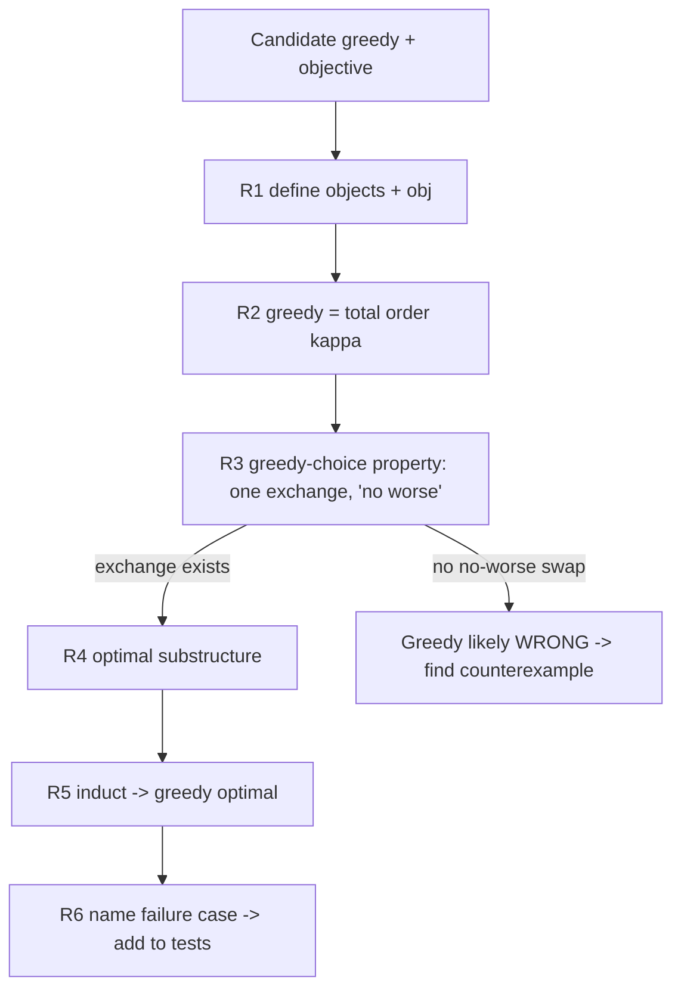
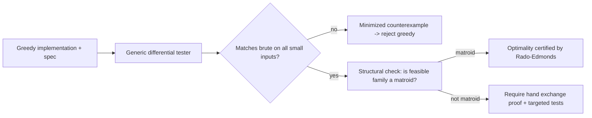

# Exchange Argument — Senior Level

> At the senior level the exchange argument stops being "a clever swap" and becomes a **systematic engineering procedure**: a repeatable recipe for constructing a correctness proof for any candidate greedy, backed by the **matroid framework** that explains *why* whole classes of greedy algorithms are optimal at once — and by a verification harness that turns "I think this is right" into "this is machine-checked on every small input."

## Table of Contents
1. [Introduction](#1-introduction)
2. [The Systematic Exchange-Proof Recipe](#2-the-systematic-exchange-proof-recipe)
3. [The Matroid Framework](#3-the-matroid-framework)
4. [Greedy on a Matroid is Optimal — and Only on a Matroid](#4-greedy-on-a-matroid-is-optimal--and-only-on-a-matroid)
5. [A Library of Reusable Exchange Lemmas](#5-a-library-of-reusable-exchange-lemmas)
6. [Architecture of a Greedy-Correctness Verification Service](#6-architecture-of-a-greedy-correctness-verification-service)
7. [Code: A Generic Greedy/Matroid Verifier](#7-code-a-generic-greedymatroid-verifier)
8. [Observability and Test Strategy](#8-observability-and-test-strategy)
9. [Failure Modes](#9-failure-modes)
10. [When Exchange Is the Wrong Hammer](#10-when-exchange-is-the-wrong-hammer)
11. [Summary](#11-summary)

---

## 1. Introduction

A senior engineer is handed a greedy heuristic — by a teammate, a paper, or their own intuition — and must answer, defensibly, "is this optimal, and how do we know?" Ad-hoc cleverness does not scale across a codebase of optimization routines. What scales is a **procedure**:

1. A fixed *recipe* for attempting an exchange proof that you can run mechanically on any candidate greedy.
2. A *structural theory* — matroids — that proves optimality for an entire family at once, so you do not re-derive a swap for every cousin problem.
3. A *verification harness* that empirically certifies the proof's claims on all small inputs and flags any rule the proof would falsely bless.

The senior decisions are therefore: *Which lemma library applies? Does this problem hide a matroid (instant optimality) or merely admit a bespoke exchange? Where will the proof's hidden assumption (ties, substructure) break, and is that case in the test suite?* This file makes each of those mechanical.

---

## 2. The Systematic Exchange-Proof Recipe

Treat the proof like a checklist. For a maximization problem (minimization is symmetric):

**R1 — State the objects precisely.** Define the ground set, what a *feasible* solution is, and the exact objective `obj(S)`. Vague objectives are the #1 cause of broken proofs.

**R2 — State the greedy choice as a total order.** "Greedy picks elements in order of key `κ`, taking each if feasible." The total order makes "the first place greedy and `OPT` differ" well-defined.

**R3 — Establish the greedy-choice property.** Prove: *there exists an optimal solution that agrees with greedy's first choice.* This is a single exchange — take any `OPT`, if it lacks greedy's first element `g₁`, swap `g₁` in for whatever `OPT` chose instead and show the objective does not worsen.

**R4 — Establish optimal substructure.** Prove: *after committing greedy's first choice, the remaining problem is a smaller instance of the same type, and an optimal whole restricted to the remainder is optimal for it.* This licenses induction.

**R5 — Induct (close the loop).** By R3 the first choice is safe; by R4 the rest is a smaller problem with the same property; by induction greedy solves the remainder optimally. Therefore greedy is optimal. ∎

**R6 — Identify the swap's failure case.** Explicitly name where R3's "no worse" could fail (ties, indivisibility, capacity interaction). Put that case in the test suite. If R3 *cannot* be established, you have likely found that greedy is wrong — go produce the counterexample.

The recipe's heart is **R3 — the single exchange.** Everything else is bookkeeping. The four standard exchange *shapes* (adjacency swap, `ε`-transfer, leaf swap, cut/cycle swap) are catalogued in §5; matching your problem to a shape is the senior move.

### 2.1 The recipe as a flow



---

## 3. The Matroid Framework

The deepest senior insight: many greedy proofs are *the same proof*, abstracted. The abstraction is the **matroid**.

**Definition (matroid).** A matroid is a pair `M = (E, ℐ)` where `E` is a finite ground set and `ℐ ⊆ 2^E` is a family of *independent sets* satisfying:

1. **(Non-emptiness)** `∅ ∈ ℐ`.
2. **(Hereditary / downward-closed)** If `A ∈ ℐ` and `B ⊆ A`, then `B ∈ ℐ`.
3. **(Exchange property)** If `A, B ∈ ℐ` and `|A| < |B|`, then there exists `x ∈ B \ A` such that `A ∪ {x} ∈ ℐ`.

Property 3 — the **matroid exchange property** — is the abstract heart of *every* exchange argument: a smaller independent set can always be grown by an element borrowed from a larger one. That is exactly "if `OPT` is bigger, greedy can always extend toward it."

**Canonical matroids:**

| Matroid | Ground set `E` | Independent sets `ℐ` | Greedy specializes to |
|---------|----------------|----------------------|-----------------------|
| **Graphic (cycle) matroid** | edges of a graph | acyclic edge subsets (forests) | Kruskal's MST |
| **Uniform matroid `U_{k,n}`** | `n` elements | all subsets of size `≤ k` | "take the `k` heaviest" |
| **Partition matroid** | elements in groups | `≤ c_i` from group `i` | bounded selection per category |
| **Linear (vector) matroid** | columns of a matrix | linearly independent column sets | max-weight independent columns |
| **Transversal matroid** | left vertices of a bipartite graph | sets matchable into the right | scheduling/assignment greedy |

A **weighted matroid** attaches a weight `w(e) ≥ 0` to each element; the optimization problem is to find a maximum-weight independent set (a *basis*, if weights are positive). The **matroid greedy** sorts `E` by weight descending and adds each element if it keeps the set independent.

---

## 4. Greedy on a Matroid is Optimal — and Only on a Matroid

**Theorem (Rado–Edmonds).** For *every* weight function `w`, the matroid greedy returns a maximum-weight independent set **if and only if** `(E, ℐ)` is a matroid.

*Proof of optimality (the "if" direction).* This is the abstracted exchange argument. Let `G = {g₁, …, g_k}` be greedy's output (sorted so `w(g₁) ≥ … ≥ w(g_k)`) and let `O = {o₁, …, o_m}` be any independent set with `w(o₁) ≥ … ≥ w(o_m)`. We show `w(g_i) ≥ w(o_i)` for all `i ≤ min(k, m)` — greedy's `i`-th element is at least as heavy as the optimum's `i`-th.

Suppose not; let `i` be the smallest index with `w(g_i) < w(o_i)`. Consider `A = {g₁, …, g_{i-1}}` and `B = {o₁, …, o_i}`, both independent with `|A| = i-1 < i = |B|`. By the **exchange property**, some `o_j ∈ B \ A` has `A ∪ {o_j} ∈ ℐ`. Since `w(o_j) ≥ w(o_i) > w(g_i)`, this element `o_j` was *available and heavier* than `g_i` when greedy chose `g_i` — but greedy takes the heaviest feasible element, contradiction. Hence `w(g_i) ≥ w(o_i)` for all `i`, and a basis-exchange argument shows `k = m` (all maximal independent sets in a matroid have equal size — the *rank*). Therefore `w(G) = Σ w(g_i) ≥ Σ w(o_i) = w(O)`, so greedy is optimal. ∎

*The "only if" direction* is the striking part: if `(E, ℐ)` is downward-closed but **not** a matroid (the exchange property fails for some `A, B`), then there is a weight function on which greedy is *suboptimal*. So matroids are *exactly* the structures where greedy always wins — a complete characterization. This is why "does my problem have a matroid?" is the single highest-leverage question a senior can ask about a greedy.

### 4.1 Worked instance: Kruskal as matroid greedy

In the graphic matroid, "independent" = "acyclic." Kruskal sorts edges by weight (ascending for *minimum* spanning tree — negate to fit the maximization template) and adds an edge if it does not form a cycle (i.e., keeps the set independent). By Rado–Edmonds, Kruskal is optimal *because forests form a matroid* — the cut/cycle exchange you may have proven by hand is just the matroid exchange property instantiated on graphs. One theorem subsumes the bespoke MST proof. (See sibling `11-graphs/10-mst-kruskal-prim`.)

### 4.2 Beyond matroids: matroid intersection and greedoids

Some problems are *intersections* of two matroids (e.g., bipartite matching = intersection of two partition matroids). Greedy alone fails on a 2-matroid intersection, but a polynomial **matroid-intersection algorithm** still solves it optimally — a senior should recognize when a problem is "one matroid" (greedy works) versus "two matroids" (need intersection) versus "three+" (NP-hard in general). **Greedoids** relax the hereditary axiom and capture some greedy algorithms (like certain shortest-path/Dijkstra-style sweeps) that matroids do not; they are the right abstraction when the order of insertion matters.

---

## 5. A Library of Reusable Exchange Lemmas

Stop reinventing swaps. Four shapes cover the vast majority of greedy proofs; match your problem to one.

| Lemma shape | The swap | Proves "no worse" by | Classic uses |
|-------------|----------|----------------------|--------------|
| **Adjacency swap** | Exchange two *adjacent* out-of-order elements in a sequence | Only their two positions/finish-times change; inequality on the pair | Minimize max lateness, minimize weighted completion time (Smith's rule) |
| **`ε`-transfer** | Move an infinitesimal amount from a worse to a better element | Objective derivative has a consistent sign | Fractional knapsack, continuous LP-relaxation greedy |
| **Leaf / deepest-node swap** | Swap two elements at the extreme of a tree | Cost contribution is monotone in depth × weight | Huffman coding (two least-frequent to deepest leaves) |
| **Cut / cycle swap** | Replace a heavy edge on a cycle (or across a cut) with a lighter one | The replaced edge is provably no lighter | MST (Kruskal/Prim), graphic matroid |

**Smith's rule (a clean adjacency-swap example).** To minimize total weighted completion time `Σ wⱼ Cⱼ` on one machine, sequence jobs by `pⱼ / wⱼ` ascending (shortest weighted processing time). Exchange proof: swapping an adjacent inverted pair `(a before b with pₐ/wₐ > p_b/w_b)` changes the objective by `w_b pₐ − wₐ p_b > 0`, so the swap toward Smith order strictly *reduces* cost — hence Smith order is optimal. Same five-beat shape, different inequality.

The senior workflow: **identify the swap shape from §5, instantiate its inequality, run R1–R6.** This converts proof-writing from invention into pattern-matching.

### 5.1 Choosing the swap shape from the problem signature

| Problem signature | Swap shape | Why |
|-------------------|-----------|-----|
| Solution is a *permutation*; objective sums over positions | Adjacency swap | Only two positions change; the inequality is local. |
| Variables are *continuous* fractions in `[0,1]` | `ε`-transfer | The objective's directional derivative has a fixed sign. |
| Solution is a *tree*; cost = Σ weight × depth | Leaf/depth swap | Cost contribution is monotone in depth × weight. |
| Solution is a *subgraph*; objective = Σ edge weights | Cut/cycle swap | A cycle or cut always exposes a swappable heavier edge. |
| Feasible sets are *downward-closed* with the exchange axiom | (none — cite Rado–Edmonds) | The matroid theorem proves optimality directly. |

The senior reflex is to read the *shape of a solution* (permutation, fraction vector, tree, subgraph, independent set) and immediately know which exchange lemma to instantiate — turning a blank-page proof into filling in one inequality.

### 5.2 A worked R1–R6 run: minimize-lateness in the recipe form

To show the recipe is mechanical, here is EDF run through R1–R6:

- **R1.** Ground set = jobs `(tⱼ, dⱼ)`; feasible = any permutation; `obj` = `L_max = maxⱼ(Cⱼ − dⱼ)⁺`, to minimize.
- **R2.** Greedy = total order by deadline `dⱼ` ascending (EDF).
- **R3.** Greedy-choice via the **adjacency swap** shape (§5): an adjacent inversion `(a before b, dₐ > d_b)` swapped makes the new last finisher `a` with lateness `< d_b`'s old lateness, so `L_max` is *no worse*.
- **R4.** Optimal substructure: removing idle time and the first job leaves a smaller minimize-lateness instance of the same type.
- **R5.** Induct: each swap removes one inversion; the inversion-free order is EDF; so EDF is optimal.
- **R6.** Failure case to test: *ties* in deadlines (the swap is cost-neutral) — add equal-deadline inputs to the suite.

Every classic greedy proof reduces to this same fill-in-the-blanks procedure.

---

## 6. Architecture of a Greedy-Correctness Verification Service

When a team ships many greedy routines, "is it optimal?" becomes a recurring engineering question. Build a small internal harness.

### 6.1 Where it sits



### 6.2 Three layers

| Layer | Responsibility | Output |
|-------|----------------|--------|
| **Differential testing** | Run greedy vs an exhaustive oracle on exhaustive small + random inputs | pass / minimized counterexample |
| **Structural analysis** | Test the three matroid axioms on the feasibility predicate over small ground sets | "matroid" / "not a matroid (witness `A,B`)" |
| **Proof binding** | If matroid → cite Rado–Edmonds; else require a recorded hand proof + the §2 R6 failure-case tests | a correctness certificate |

The highest-value layer is *structural analysis*: empirically checking the exchange property on small ground sets tells you whether to *expect* a clean proof at all. A failed exchange-property check is an early, cheap signal that greedy will not be universally optimal.

### 6.3 Design rules

- **Oracle is the source of truth** on small inputs; greedy must never disagree.
- **Minimize counterexamples** automatically (delta-debugging) so failures are legible.
- **Encode the matroid axioms as predicates** and fuzz them — this is how you *discover* whether your feasibility family is a matroid without a human proof.
- **Tie handling is explicit**: test equal-key inputs deliberately, because that is where exchange proofs hide assumptions.

---

## 7. Code: A Generic Greedy/Matroid Verifier

A reusable verifier: given a feasibility predicate and a weight, it (a) runs the matroid greedy, (b) brute-forces the true optimum, and (c) checks the three matroid axioms on the ground set — answering *both* "is greedy optimal here?" and "is this a matroid?". All three print that the uniform/partition example is a matroid where greedy is optimal, and a non-matroid example where greedy can fail.

#### Go

```go
package main

import (
	"fmt"
	"sort"
)

// indep is the independence oracle: is subset S (bitmask over ground set) independent?
type indep func(mask int) bool

// matroidGreedy: sort elements by weight desc, add if it keeps the set independent.
func matroidGreedy(n int, w []int, ind indep) int {
	idx := make([]int, n)
	for i := range idx {
		idx[i] = i
	}
	sort.Slice(idx, func(a, b int) bool { return w[idx[a]] > w[idx[b]] })
	mask, total := 0, 0
	for _, e := range idx {
		if ind(mask | (1 << e)) {
			mask |= 1 << e
			total += w[e]
		}
	}
	return total
}

// bruteOptimal: max weight over all independent subsets.
func bruteOptimal(n int, w []int, ind indep) int {
	best := 0
	for mask := 0; mask < (1 << n); mask++ {
		if !ind(mask) {
			continue
		}
		s := 0
		for e := 0; e < n; e++ {
			if mask&(1<<e) != 0 {
				s += w[e]
			}
		}
		if s > best {
			best = s
		}
	}
	return best
}

func popcount(x int) int { c := 0; for x != 0 { c += x & 1; x >>= 1 }; return c }

// isMatroid: empirically check the three axioms on all subsets of an n-element ground set.
func isMatroid(n int, ind indep) bool {
	if !ind(0) {
		return false // empty set must be independent
	}
	for a := 0; a < (1 << n); a++ {
		if !ind(a) {
			continue
		}
		for b := a; ; b = (b - 1) & a { // subsets of a (hereditary)
			if !ind(b) {
				return false
			}
			if b == 0 {
				break
			}
		}
	}
	// exchange property
	for a := 0; a < (1 << n); a++ {
		if !ind(a) {
			continue
		}
		for b := 0; b < (1 << n); b++ {
			if !ind(b) || popcount(b) <= popcount(a) {
				continue
			}
			ok := false
			for e := 0; e < n; e++ {
				if b&(1<<e) != 0 && a&(1<<e) == 0 && ind(a|(1<<e)) {
					ok = true
					break
				}
			}
			if !ok {
				return false
			}
		}
	}
	return true
}

func main() {
	n := 4
	w := []int{8, 5, 4, 3}
	// Uniform matroid U_{2,4}: independent iff size <= 2 (a matroid).
	uniform := func(mask int) bool { return popcount(mask) <= 2 }
	fmt.Printf("uniform: matroid=%v greedy=%d optimal=%d ok=%v\n",
		isMatroid(n, uniform), matroidGreedy(n, w, uniform),
		bruteOptimal(n, w, uniform), matroidGreedy(n, w, uniform) == bruteOptimal(n, w, uniform))

	// A NON-matroid: independent iff mask is empty, {0}, {1}, {2,3}. Hereditary but
	// exchange fails: |{2,3}|=2 > |{0}|=1 yet neither 2 nor 3 extends {0}.
	allowed := map[int]bool{0: true, 1: true, 2: true, 0b1100: true}
	notMat := func(mask int) bool { return allowed[mask] }
	fmt.Printf("non-matroid: matroid=%v greedy=%d optimal=%d ok=%v\n",
		isMatroid(n, notMat), matroidGreedy(n, w, notMat),
		bruteOptimal(n, w, notMat), matroidGreedy(n, w, notMat) == bruteOptimal(n, w, notMat))
}
```

#### Java

```java
import java.util.*;

public class MatroidVerifier {
    interface Indep { boolean test(int mask); }

    static int popcount(int x) { int c = 0; while (x != 0) { c += x & 1; x >>= 1; } return c; }

    static int matroidGreedy(int n, int[] w, Indep ind) {
        Integer[] idx = new Integer[n];
        for (int i = 0; i < n; i++) idx[i] = i;
        Arrays.sort(idx, (a, b) -> w[b] - w[a]);
        int mask = 0, total = 0;
        for (int e : idx)
            if (ind.test(mask | (1 << e))) { mask |= 1 << e; total += w[e]; }
        return total;
    }

    static int bruteOptimal(int n, int[] w, Indep ind) {
        int best = 0;
        for (int mask = 0; mask < (1 << n); mask++) {
            if (!ind.test(mask)) continue;
            int s = 0;
            for (int e = 0; e < n; e++) if ((mask & (1 << e)) != 0) s += w[e];
            best = Math.max(best, s);
        }
        return best;
    }

    static boolean isMatroid(int n, Indep ind) {
        if (!ind.test(0)) return false;
        for (int a = 0; a < (1 << n); a++) {
            if (!ind.test(a)) continue;
            for (int b = a; ; b = (b - 1) & a) {
                if (!ind.test(b)) return false;
                if (b == 0) break;
            }
        }
        for (int a = 0; a < (1 << n); a++) {
            if (!ind.test(a)) continue;
            for (int b = 0; b < (1 << n); b++) {
                if (!ind.test(b) || popcount(b) <= popcount(a)) continue;
                boolean ok = false;
                for (int e = 0; e < n; e++)
                    if ((b & (1 << e)) != 0 && (a & (1 << e)) == 0 && ind.test(a | (1 << e))) { ok = true; break; }
                if (!ok) return false;
            }
        }
        return true;
    }

    public static void main(String[] args) {
        int n = 4;
        int[] w = {8, 5, 4, 3};
        Indep uniform = mask -> popcount(mask) <= 2;
        System.out.printf("uniform: matroid=%b greedy=%d optimal=%d ok=%b%n",
            isMatroid(n, uniform), matroidGreedy(n, w, uniform),
            bruteOptimal(n, w, uniform), matroidGreedy(n, w, uniform) == bruteOptimal(n, w, uniform));

        Set<Integer> allowed = Set.of(0, 1, 2, 0b1100);
        Indep notMat = allowed::contains;
        System.out.printf("non-matroid: matroid=%b greedy=%d optimal=%d ok=%b%n",
            isMatroid(n, notMat), matroidGreedy(n, w, notMat),
            bruteOptimal(n, w, notMat), matroidGreedy(n, w, notMat) == bruteOptimal(n, w, notMat));
    }
}
```

#### Python

```python
def popcount(x):
    c = 0
    while x:
        c += x & 1
        x >>= 1
    return c


def matroid_greedy(n, w, ind):
    mask, total = 0, 0
    for e in sorted(range(n), key=lambda i: w[i], reverse=True):
        if ind(mask | (1 << e)):
            mask |= 1 << e
            total += w[e]
    return total


def brute_optimal(n, w, ind):
    best = 0
    for mask in range(1 << n):
        if not ind(mask):
            continue
        s = sum(w[e] for e in range(n) if mask & (1 << e))
        best = max(best, s)
    return best


def subsets(a):
    b = a
    while True:
        yield b
        if b == 0:
            break
        b = (b - 1) & a


def is_matroid(n, ind):
    if not ind(0):
        return False
    for a in range(1 << n):
        if not ind(a):
            continue
        if any(not ind(b) for b in subsets(a)):  # hereditary
            return False
    for a in range(1 << n):
        if not ind(a):
            continue
        for b in range(1 << n):
            if not ind(b) or popcount(b) <= popcount(a):
                continue
            if not any((b >> e) & 1 and not (a >> e) & 1 and ind(a | (1 << e))
                       for e in range(n)):
                return False  # exchange property fails
    return True


if __name__ == "__main__":
    n, w = 4, [8, 5, 4, 3]
    uniform = lambda mask: popcount(mask) <= 2
    print("uniform: matroid={} greedy={} optimal={} ok={}".format(
        is_matroid(n, uniform), matroid_greedy(n, w, uniform),
        brute_optimal(n, w, uniform), matroid_greedy(n, w, uniform) == brute_optimal(n, w, uniform)))

    allowed = {0, 1, 2, 0b1100}
    not_mat = lambda mask: mask in allowed
    print("non-matroid: matroid={} greedy={} optimal={} ok={}".format(
        is_matroid(n, not_mat), matroid_greedy(n, w, not_mat),
        brute_optimal(n, w, not_mat), matroid_greedy(n, w, not_mat) == brute_optimal(n, w, not_mat)))
```

**What it does:** runs the matroid greedy, brute-forces the optimum, and empirically checks the three matroid axioms — answering "is greedy optimal?" and "is this a matroid?" at once. On the non-matroid it surfaces the exchange-property violation.
**Run:** `go run main.go` | `javac MatroidVerifier.java && java MatroidVerifier` | `python verifier.py`

---

## 8. Observability and Test Strategy

For a greedy that ships in production, "correctness" is a property to *monitor*, not just prove once.

- **Exhaustive small-input certification.** Run greedy vs oracle on *all* inputs up to some size (`n ≤ 8`) in CI; a single divergence fails the build.
- **Property-based / fuzz testing.** Generate random tiny inputs (including ties, zeros, duplicates) and assert greedy = oracle. Track the *minimized* counterexample on failure.
- **Matroid-axiom monitoring.** If your feasibility predicate evolves (new constraints), re-run the axiom checker — a constraint that breaks the exchange property silently breaks optimality.
- **Invariant assertions in the algorithm.** For stays-ahead-style greedy, assert the per-step progress invariant in debug builds (`f(g_r) ≤ f(o_r)` analog).
- **Regression oracles.** Pin known answers: Kruskal on a fixed graph, Huffman on a fixed frequency table, the `{1,3,4}` coin counterexample, Smith's rule on a fixed job set.

| Signal | What it tells you | Action |
|--------|-------------------|--------|
| Greedy ≠ oracle on any small input | greedy is *not* optimal | reject; switch to DP/approx |
| Axiom checker reports "not a matroid" | no universal optimality guarantee | require a bespoke proof + targeted tests |
| Exchange-property witness `(A,B)` found | the precise structure greedy can't handle | construct a weighted counterexample from it |
| Ties cause divergence | proof's tie assumption is wrong | fix tie-break; re-prove and re-test |

---

## 9. Failure Modes

| Failure | Symptom | Root cause | Mitigation |
|---------|---------|------------|------------|
| Proving a false greedy | "Proof" exists but tests fail | R3's no-worse swap was hand-waved | Differential test *before* writing R3; trust the test. |
| Mistaking 2-matroid intersection for 1 matroid | Greedy off on some inputs | Two independent constraints (e.g., bipartite matching) | Recognize intersection; use matroid-intersection algorithm. |
| Tie-break gap | Greedy optimal except on equal keys | Proof assumed strict order | Make tie-break explicit; test equal-key inputs. |
| Non-adjacent swap in proof | Inequality unprovable / messy | Tried to swap distant elements | Reduce to adjacency-swap lemma (§5). |
| Capacity interaction | Greedy wastes resource (0/1 knapsack) | Indivisibility breaks `ε`-transfer | Detect non-matroid structure; switch to DP. |
| Greedoid masquerading as matroid | Order-dependent correctness | Hereditary axiom actually fails | Use greedoid theory or a direct proof. |
| Oracle too slow → untested large case | Confidence without coverage | `O(n!)` oracle on big `n` | Keep test `n` tiny; rely on exhaustive-small + fuzz. |

---

## 10. When Exchange Is the Wrong Hammer

The senior must also know when *not* to reach for an exchange argument:

- **Greedy is provably wrong.** If the feasibility family is not a matroid and no no-worse swap exists, stop proving and switch to **dynamic programming** (sibling `13-dynamic-programming`) for exact optimality.
- **You only need an approximation.** For NP-hard problems (set cover, vertex cover), greedy gives a *ratio* guarantee, proved with a charging/stays-ahead argument, not an exact exchange — see `07-set-cover-approximation` and `08-vertex-cover-approximation`.
- **The objective is multi-criteria.** Exchange arguments assume a single scalar objective; Pareto-optimal problems need different machinery.
- **Online / adversarial input.** Competitive-ratio analysis replaces exact optimality; the exchange template does not directly apply.

Knowing the boundary of the technique is as valuable as wielding it.

---

### 10.1 A decision checklist for "exchange or something else"

Run this top to bottom on any new greedy:

- [ ] **Disprove first.** Differential-test greedy vs an exhaustive oracle on small + random inputs. A mismatch ends the analysis — greedy is wrong.
- [ ] **Is the feasibility family a matroid?** Check the three axioms on small ground sets. If yes → cite Rado–Edmonds, done.
- [ ] **Is it a two-matroid intersection?** (e.g., assignment, bipartite matching.) If yes → greedy fails; use matroid intersection.
- [ ] **Does a solution have a recognizable shape** (permutation / fraction vector / tree / subgraph)? If yes → pick the matching swap shape from §5 and run R1–R6.
- [ ] **NP-hard?** Switch to an approximation guarantee (charging / primal-dual), not exact exchange.
- [ ] **Multi-criteria or online?** Exchange does not apply; use Pareto/competitive analysis.

Ticking these in order means you never waste effort proving a false claim, and you reach for the *cheapest* sufficient argument (matroid citation > bespoke exchange > approximation).

### 10.2 Why the structural question dominates

The reason "is it a matroid?" is the senior's first instinct is leverage: a single structural fact (the exchange axiom) certifies optimality for *every* weight function at once, replacing an open-ended search for the right swap. When the structure is present, you write *no* problem-specific proof — you instantiate Rado–Edmonds. When it is absent, the axiom checker hands you the exact witness `(A, B)` that breaks greedy, which you turn into a concrete counterexample weight. Either way the structural check is strictly more informative than guessing at a swap, which is why the verification harness in §6 leads with it.

## 11. Summary

At the senior level the exchange argument becomes a *procedure*, not an inspiration. The **R1–R6 recipe** mechanizes proof construction: define objects and objective, express greedy as a total order, establish the greedy-choice property via a *single exchange*, establish optimal substructure, induct to close, and name the swap's failure case for the test suite. The four reusable swap shapes — **adjacency, `ε`-transfer, leaf, cut/cycle** — turn proof-writing into pattern-matching. The unifying theory is the **matroid**: by the **Rado–Edmonds theorem**, the matroid greedy is optimal for every weight function *exactly when* the feasibility family is a matroid, with the **exchange property** axiom being the abstract heart of every concrete swap. So the highest-leverage senior question is "does this problem hide a matroid?" — if yes, optimality is automatic (Kruskal, partition/uniform selection); if it is a *two*-matroid intersection, greedy fails but a polynomial algorithm exists; if it is neither, greedy is likely wrong and DP or approximation takes over. Wrap all of this in a verification harness that differential-tests greedy against an exhaustive oracle and empirically checks the matroid axioms on small ground sets, and "is this greedy correct?" stops being a debate and becomes a machine-checkable certificate.

### 11.1 The one-paragraph senior takeaway

If you remember nothing else: the exchange argument's *correctness in practice is a structural decision, not an act of cleverness*. First disprove (differential-test against an oracle); then ask the one high-leverage question — "is this a matroid?" — because a yes certifies optimality for every weight at once via Rado–Edmonds, a "two-matroid" answer means greedy fails but a polynomial algorithm exists, and a no usually means greedy is wrong and DP or approximation takes over. When you do need a bespoke proof, read the *shape* of a solution (permutation, fraction vector, tree, subgraph) to pick the swap (adjacency, `ε`-transfer, leaf, cut/cycle), instantiate its one inequality, and close with the inversion-count termination argument. The art collapses into pattern-matching backed by a machine-checked harness.

### 11.2 Checklist before certifying a greedy as optimal

- [ ] Differential test vs an exhaustive oracle on all inputs up to `n ≈ 8` plus random ties/zeros/duplicates — zero mismatches.
- [ ] Matroid-axiom check on small ground sets; if a matroid, cite Rado–Edmonds and stop.
- [ ] If not a matroid, a recorded R1–R6 exchange proof with the swap shape named.
- [ ] The R6 failure case (ties, capacity) explicitly in the test suite.
- [ ] A regression oracle pinning known answers (Kruskal, Huffman, Smith's rule, the coin counterexample).
- [ ] No float comparison in the proof's inequality — exact integer or rational arithmetic.
- [ ] A documented decision: exact (matroid/DP), or approximation ratio (NP-hard), or competitive (online).

Tick all seven and the greedy is certified; skip the structural check and you risk a bespoke proof of a claim a matroid citation would have settled — or worse, a confident proof of a false rule.
