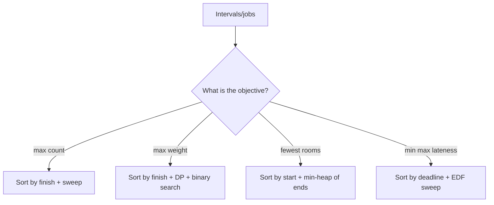

# Interval Scheduling Variations — Junior Level

> **One-line summary:** Basic activity selection (the classic "maximize the number of non-overlapping intervals") is just *one* member of a whole family. The same input — a set of intervals with start/finish times — gives rise to several different questions: pick the most jobs (greedy by finish time), pick the most *valuable* jobs (weighted → dynamic programming, **not** greedy), pack everyone into the fewest "rooms" (interval partitioning → min-heap of end times), or order jobs to minimize the worst lateness (earliest-deadline-first). Recognizing *which question you are being asked* is the whole game.

---

## Table of Contents

1. [Introduction](#introduction)
2. [Prerequisites](#prerequisites)
3. [Glossary](#glossary)
4. [Core Concepts](#core-concepts)
5. [Big-O Summary](#big-o-summary)
6. [Real-World Analogies](#real-world-analogies)
7. [Pros & Cons](#pros--cons)
8. [Step-by-Step Walkthrough](#step-by-step-walkthrough)
9. [Code Examples](#code-examples)
10. [Coding Patterns](#coding-patterns)
11. [Error Handling](#error-handling)
12. [Performance Tips](#performance-tips)
13. [Best Practices](#best-practices)
14. [Edge Cases & Pitfalls](#edge-cases--pitfalls)
15. [Common Mistakes](#common-mistakes)
16. [Cheat Sheet](#cheat-sheet)
17. [Visual Animation](#visual-animation)
18. [Summary](#summary)
19. [Further Reading](#further-reading)

---

## Introduction

You are handed a list of intervals. Each interval has a **start** time and a **finish** time — a lecture that runs `9:00–10:00`, a job that occupies a machine from `t=3` to `t=7`, a meeting that books a room from `2pm` to `3:30pm`. Depending on *what someone asks you to optimize*, you reach for a completely different algorithm. This is the trap and the beauty of interval problems: the input always looks the same, but the right tool changes.

The classic starting point is **Activity Selection** (covered in the sibling `01-activity-selection`): given `n` intervals, choose the **largest subset of mutually non-overlapping** intervals. The famous greedy answer is *sort by finish time, then repeatedly take the next interval that starts after the last one you took finishes.* That single rule is provably optimal, runs in `O(n log n)`, and is one of the cleanest greedy arguments in all of computer science.

But the moment the problem changes slightly, the greedy rule can collapse:

- **Weighted Interval Scheduling.** Now each interval carries a *value* (a payment, a priority), and you want the maximum **total value** of a non-overlapping subset — not the maximum *count*. Greedy-by-finish-time is **wrong** here. You need **dynamic programming** with binary search.
- **Interval Partitioning (a.k.a. Minimum Number of Machines / "Meeting Rooms II").** Now you must schedule *all* intervals, and you ask: what is the **fewest number of rooms (machines, tracks)** needed so that no two overlapping intervals share a room? The answer is a sweep with a **min-heap of end times**, and it always equals the **maximum overlap** (the "depth") at any instant.
- **Minimizing Maximum Lateness.** Now each job has a *length* and a *deadline*. You run them one at a time on a single machine and want to **minimize the maximum lateness** (how far past its deadline the worst job finishes). The answer is **Earliest-Deadline-First (EDF)** — sort by deadline and run in that order.
- **Multi-machine scheduling.** Combine the above: distribute jobs across `k` machines to optimize some objective. Often a heap of machine-available-times.

This file (junior level) does three things: it **recaps** basic activity selection, **introduces the four variation families**, and gives you a *recognition checklist* so that when a problem lands on your desk you immediately know whether to reach for greedy, a heap, or DP.

---

## Prerequisites

Before reading this file you should be comfortable with:

- **Sorting** — sorting an array of structs/objects by a key (e.g. by finish time). The sibling `07-sorting-algorithms` covers this; here we only *use* it.
- **Greedy intuition** — the idea that you can sometimes make a locally optimal choice and stay globally optimal. The sibling `05-exchange-argument` and `01-activity-selection` build this.
- **Binary search** — finding, in a sorted array, the last element with key `≤ x`. Needed for weighted interval scheduling.
- **Priority queues / heaps** — a min-heap that lets you peek/pop the smallest element in `O(log n)`. The sibling `10-heaps` covers the structure; here we use it to track "earliest-finishing room."
- **Dynamic programming basics** — the idea of `dp[i]` depending on smaller subproblems. The sibling `13-dynamic-programming` is the deep dive; here we apply one clean recurrence.
- **Big-O notation** — `O(n log n)` for the sorting-and-sweeping algorithms.

Optional but helpful:

- A little comfort with **intervals as `[start, end)` half-open ranges** — it removes a lot of "do touching intervals overlap?" confusion.

---

## Glossary

| Term | Meaning |
|------|---------|
| **Interval** | A pair `(start, finish)` representing an occupied time range. |
| **Overlap / conflict** | Two intervals overlap if they share any instant: `a.start < b.finish && b.start < a.finish` (half-open). |
| **Compatible** | Two intervals are *compatible* if they do **not** overlap. |
| **Activity Selection** | Choose the maximum *number* of mutually compatible intervals. Greedy by finish time. |
| **Weighted Interval Scheduling** | Choose a compatible subset of maximum total *weight*. Solved by DP, not greedy. |
| **Interval Partitioning** | Assign all intervals to the fewest "rooms" so each room holds only compatible intervals. |
| **Depth / max overlap** | The maximum number of intervals covering any single point in time. Equals the minimum rooms needed. |
| **Lateness** | For a job with deadline `d` finishing at time `f`, lateness `= max(0, f − d)`. |
| **Maximum lateness** | The largest lateness over all jobs in a schedule — the objective EDF minimizes. |
| **EDF (Earliest-Deadline-First)** | Schedule jobs in increasing order of deadline. Optimal for minimizing max lateness on one machine. |
| **Machine / room / track / resource** | The thing an interval occupies exclusively while running. |
| **`p(j)`** | In weighted scheduling: the largest index `i < j` whose interval is compatible with job `j` (found by binary search). |

---

## Core Concepts

### 1. The Baseline: Activity Selection (Greedy by Finish Time)

Given `n` intervals, pick the most that are pairwise non-overlapping.

**Rule:** sort by **finish** time. Scan left to right. Keep a variable `lastEnd`. For each interval, if its `start ≥ lastEnd`, take it and set `lastEnd = its finish`.

**Why finish time?** Choosing the interval that finishes earliest leaves the maximum amount of remaining time for everything else. This is a textbook *exchange argument* (see `05-exchange-argument`): any optimal solution can be transformed, swap by swap, into the greedy one without losing intervals.

This is `O(n log n)` (the sort dominates). It maximizes **count**, and only count.

### 2. Variation A — Weighted Interval Scheduling (DP, **not** greedy)

Now each interval `j` has a weight `w_j`. We want the compatible subset with maximum **total weight**.

**Greedy fails.** Sort by finish time and take greedily? A single fat-weight interval can be worth more than three skinny ones it overlaps. Sort by weight and take greedily? One huge-weight interval might block two even-bigger ones. No simple greedy rule survives.

**The DP recurrence.** Sort intervals by finish time. Define `p(j)` = the largest index `i < j` such that interval `i` is compatible with `j` (found by **binary search** on finish times). Then:

```
dp[j] = max( dp[j-1],                 // skip job j
             w_j + dp[ p(j) ] )       // take job j, then best compatible-before-it
```

`dp[n]` is the answer. Each `p(j)` is an `O(log n)` binary search, so the whole thing is `O(n log n)`.

### 3. Variation B — Interval Partitioning (Min-Heap of End Times)

Now you must schedule **everyone**, and you want the **fewest rooms** so no room ever double-books.

**Rule:** sort by **start** time. Keep a **min-heap** of the *finish times of currently-busy rooms*. For each interval, if the room that frees earliest (the heap's minimum) frees at or before this interval's start, reuse it (pop, push the new finish). Otherwise open a new room (push). The heap's maximum size is the number of rooms.

**Key theorem:** the number of rooms equals the **depth** = maximum number of intervals overlapping at any single instant. You can never do better than the depth (those overlapping intervals all genuinely conflict), and this greedy achieves exactly the depth. Runtime `O(n log n)`.

This is exactly **LeetCode "Meeting Rooms II."**

### 4. Variation C — Minimizing Maximum Lateness (EDF)

Now each job `j` has a processing time `t_j` and a deadline `d_j`. You run jobs back-to-back on **one** machine (no gaps help). Lateness of a job is `max(0, finish − deadline)`. Minimize the **maximum** lateness.

**Rule:** sort by **deadline** ascending (Earliest-Deadline-First) and run in that order. That single ordering minimizes the maximum lateness. The proof is again an **exchange argument**: any "inversion" (a later-deadline job scheduled before an earlier-deadline one) can be swapped without increasing max lateness. Runtime `O(n log n)`.

### 5. The Recognition Checklist

| If the question asks… | Reach for… |
|-----------------------|-----------|
| "Most non-overlapping intervals (by count)" | Greedy by finish time (`01-activity-selection`) |
| "Maximum total *value/weight* of non-overlapping intervals" | **DP** + binary search (`p(j)` recurrence) |
| "Fewest rooms/machines to host *all* intervals" | **Min-heap of end times** (= max overlap depth) |
| "Order jobs to minimize the worst lateness" | **EDF** (sort by deadline) |
| "Fewest intervals to *remove* so the rest don't overlap" | Greedy by finish time (complement of activity selection) |

The single biggest junior mistake is using greedy-by-finish on the **weighted** problem. Burn the rule into memory: **weight ⇒ DP.**

---

## Big-O Summary

| Variation | Algorithm | Time | Space | Notes |
|-----------|-----------|------|-------|-------|
| Activity selection (count) | Sort by finish + sweep | `O(n log n)` | `O(1)` extra | Sort dominates. |
| Weighted interval scheduling | Sort by finish + DP + binary search | `O(n log n)` | `O(n)` | `dp` array of size `n`. |
| Interval partitioning (min rooms) | Sort by start + min-heap | `O(n log n)` | `O(n)` heap | Heap holds at most `depth` ends. |
| Minimize max lateness | Sort by deadline (EDF) | `O(n log n)` | `O(1)` extra | Just an ordering. |
| Multi-machine assignment | Sort + heap of machine free-times | `O(n log n)` | `O(k)` | `k` = number of machines. |

Every member of the family is `O(n log n)`. The *difference* is which key you sort on and whether you sweep, heap, or DP.

---

## Real-World Analogies

| Concept | Analogy |
|---------|---------|
| Activity selection | A single TV studio that can air one show at a time; pick the most shows that fit without overlap. |
| Weighted interval scheduling | The studio now charges different ad-revenue per show; pick the set that earns the most money, not the most shows. |
| Interval partitioning | A conference with many talks that overlap; how many **lecture halls** must you rent so no two simultaneous talks clash? |
| Depth = min rooms | At the busiest minute of the conference, five talks run at once — so you need at least five halls, no fewer. |
| Minimizing max lateness | A printer with a queue of jobs, each "due" at some time; order them so the most-overdue job is as little overdue as possible. |
| EDF (earliest deadline first) | A short-order cook firing tickets by *which is due soonest*, not by which arrived first. |
| Multi-machine | A call center with `k` agents; route each call to the agent who frees up first. |

Where the analogy breaks: real calendars allow gaps, travel time between rooms, and preemption — the clean theory assumes intervals are fixed and machines are identical. Those wrinkles are the senior/professional levels.

---

## Pros & Cons

| Pros | Cons |
|------|------|
| Every variation is `O(n log n)` — fast and scalable. | You must *correctly identify* which variation you face; wrong identification ⇒ wrong algorithm. |
| Greedy versions (count, partitioning, lateness) are short and provably optimal. | The greedy proofs are subtle; "it looks reasonable" is not enough — see `05-exchange-argument`. |
| Interval partitioning's answer (depth) has a clean lower-bound argument. | Weighted scheduling needs DP — people reflexively (and wrongly) try greedy. |
| The min-heap pattern for rooms generalizes to many resource-allocation problems. | Heaps add a log factor and some implementation care (correct comparator). |
| Maps directly onto common interview problems (Meeting Rooms II, Non-overlapping Intervals). | Edge cases around *touching* intervals (`end == start`) bite hard if `[start,end)` vs `[start,end]` is unclear. |

**When to use:** any single-resource or multi-resource time-conflict problem — calendars, CPU scheduling, room booking, lecture-hall assignment, ad-slot selection.

**When NOT to use:** when intervals can be *split/preempted* arbitrarily, when there are precedence constraints between jobs, or when the objective is something exotic (weighted completion time, total tardiness) — those are different (often harder) scheduling problems.

---

## Step-by-Step Walkthrough

### Walkthrough 1 — Activity selection (count)

Intervals: `A[1,4) B[3,5) C[0,6) D[5,7) E[3,9) F[5,9) G[6,10) H[8,11)`.

Sort by **finish**: `A(4) B(5) C(6) D(7) E(9) F(9) G(10) H(11)`.

Sweep with `lastEnd = -∞`:

- `A[1,4)`: `1 ≥ -∞` → take. `lastEnd = 4`. Chosen: {A}
- `B[3,5)`: `3 ≥ 4`? No → skip.
- `C[0,6)`: `0 ≥ 4`? No → skip.
- `D[5,7)`: `5 ≥ 4`? Yes → take. `lastEnd = 7`. Chosen: {A, D}
- `E[3,9)`: `3 ≥ 7`? No → skip.
- `F[5,9)`: `5 ≥ 7`? No → skip.
- `G[6,10)`: `6 ≥ 7`? No → skip.
- `H[8,11)`: `8 ≥ 7`? Yes → take. `lastEnd = 11`. Chosen: {A, D, H}

**Result: 3 intervals** — `{A[1,4), D[5,7), H[8,11)}`. Optimal.

### Walkthrough 2 — Interval partitioning (min rooms)

Same intervals. Sort by **start**: `C[0,6) A[1,4) B[3,5) E[3,9) D[5,7) F[5,9) G[6,10) H[8,11)`.

Maintain a min-heap of busy-room finish times:

- `C[0,6)`: heap empty → open room 1. Heap `{6}`. Rooms = 1.
- `A[1,4)`: earliest free = 6 > 1 → open room 2. Heap `{4,6}`. Rooms = 2.
- `B[3,5)`: earliest free = 4 > 3 → open room 3. Heap `{5,6}`... wait, push 5 → `{5,6,?}`. Heap `{5,6}` plus the still-busy 6 → `{5,6,6}`? Let me track: after A heap was `{4,6}`. B start=3, min=4 > 3 → open room. Heap `{4,5,6}`. Rooms = 3.

  Hmm, but `A` finishes at 4 and B starts at 3, so they genuinely overlap. Correct: 3 rooms now.
- `E[3,9)`: min = 4 > 3 → open room. Heap `{4,5,6,9}`. Rooms = 4.
- `D[5,7)`: min = 4 ≤ 5 → reuse that room (pop 4, push 7). Heap `{5,6,7,9}`. Rooms stay 4.
- `F[5,9)`: min = 5 ≤ 5 → reuse (pop 5, push 9). Heap `{6,7,9,9}`. Rooms 4.
- `G[6,10)`: min = 6 ≤ 6 → reuse (pop 6, push 10). Heap `{7,9,9,10}`. Rooms 4.
- `H[8,11)`: min = 7 ≤ 8 → reuse (pop 7, push 11). Heap `{9,9,10,11}`. Rooms 4.

**Result: 4 rooms.** And indeed at instant `t = 3.5`, intervals `C, B, E` plus... let us check the true depth: at `t = 5.5`, who is live? `C[0,6)` yes, `E[3,9)` yes, `D[5,7)` yes, `F[5,9)` yes → **4 overlapping** → depth 4. The heap's peak size matched the depth. 

### Walkthrough 3 — Minimizing maximum lateness (EDF)

Jobs `(length t, deadline d)`: `J1(3, 6) J2(2, 8) J3(1, 9) J4(4, 9) J5(3, 14) J6(2, 15)`.

Sort by **deadline**: `J1(d6) J2(d8) J3(d9) J4(d9) J5(d14) J6(d15)`.

Run back-to-back from `t = 0`, tracking finish and lateness `= max(0, finish − d)`:

| Job | start | finish | deadline | lateness |
|-----|-------|--------|----------|----------|
| J1 | 0 | 3 | 6 | 0 |
| J2 | 3 | 5 | 8 | 0 |
| J3 | 5 | 6 | 9 | 0 |
| J4 | 6 | 10 | 9 | 1 |
| J5 | 10 | 13 | 14 | 0 |
| J6 | 13 | 15 | 15 | 0 |

**Maximum lateness = 1**, achieved by J4. No ordering does better — EDF is optimal.

---

## Code Examples

We give all three core greedy/DP variations in **Go, Java, and Python**. Each program is self-contained and prints a verifiable answer.

### Example 1: Activity Selection (count) + Weighted Interval Scheduling (DP)

#### Go

```go
package main

import (
	"fmt"
	"sort"
)

type Interval struct{ start, finish, weight int }

// activitySelection: max number of mutually compatible intervals.
func activitySelection(iv []Interval) int {
	sort.Slice(iv, func(i, j int) bool { return iv[i].finish < iv[j].finish })
	count, lastEnd := 0, -1<<62
	for _, x := range iv {
		if x.start >= lastEnd {
			count++
			lastEnd = x.finish
		}
	}
	return count
}

// weightedSchedule: max total weight of a compatible subset (DP + binary search).
func weightedSchedule(iv []Interval) int {
	sort.Slice(iv, func(i, j int) bool { return iv[i].finish < iv[j].finish })
	n := len(iv)
	// p[j] = last index i < j with iv[i].finish <= iv[j].start, else -1.
	p := make([]int, n)
	for j := 0; j < n; j++ {
		lo, hi, ans := 0, j-1, -1
		for lo <= hi {
			mid := (lo + hi) / 2
			if iv[mid].finish <= iv[j].start {
				ans = mid
				lo = mid + 1
			} else {
				hi = mid - 1
			}
		}
		p[j] = ans
	}
	dp := make([]int, n+1) // dp[j] uses 1-based jobs; dp[0]=0
	for j := 1; j <= n; j++ {
		take := iv[j-1].weight
		if p[j-1] >= 0 {
			take += dp[p[j-1]+1]
		}
		skip := dp[j-1]
		if take > skip {
			dp[j] = take
		} else {
			dp[j] = skip
		}
	}
	return dp[n]
}

func main() {
	iv := []Interval{
		{1, 4, 10}, {3, 5, 20}, {0, 6, 100}, {5, 7, 30}, {8, 11, 40},
	}
	fmt.Println("max count   =", activitySelection(append([]Interval(nil), iv...))) // 3
	fmt.Println("max weight  =", weightedSchedule(append([]Interval(nil), iv...)))  // 140 = C[0,6)=100 + H[8,11)=40 (beats A+D+H=80)
}
```

#### Java

```java
import java.util.*;

public class IntervalBasics {
    record Interval(int start, int finish, int weight) {}

    static int activitySelection(List<Interval> iv) {
        iv.sort(Comparator.comparingInt(Interval::finish));
        int count = 0, lastEnd = Integer.MIN_VALUE;
        for (Interval x : iv) {
            if (x.start() >= lastEnd) { count++; lastEnd = x.finish(); }
        }
        return count;
    }

    static int weightedSchedule(List<Interval> in) {
        List<Interval> iv = new ArrayList<>(in);
        iv.sort(Comparator.comparingInt(Interval::finish));
        int n = iv.size();
        int[] p = new int[n];
        for (int j = 0; j < n; j++) {
            int lo = 0, hi = j - 1, ans = -1;
            while (lo <= hi) {
                int mid = (lo + hi) / 2;
                if (iv.get(mid).finish() <= iv.get(j).start()) { ans = mid; lo = mid + 1; }
                else hi = mid - 1;
            }
            p[j] = ans;
        }
        int[] dp = new int[n + 1];
        for (int j = 1; j <= n; j++) {
            int take = iv.get(j - 1).weight();
            if (p[j - 1] >= 0) take += dp[p[j - 1] + 1];
            dp[j] = Math.max(take, dp[j - 1]);
        }
        return dp[n];
    }

    public static void main(String[] args) {
        List<Interval> iv = new ArrayList<>(List.of(
            new Interval(1, 4, 10), new Interval(3, 5, 20),
            new Interval(0, 6, 100), new Interval(5, 7, 30),
            new Interval(8, 11, 40)));
        System.out.println("max count  = " + activitySelection(new ArrayList<>(iv))); // 3
        System.out.println("max weight = " + weightedSchedule(iv));                   // 140
    }
}
```

#### Python

```python
from bisect import bisect_right


def activity_selection(intervals):
    """Max number of mutually compatible intervals (greedy by finish)."""
    iv = sorted(intervals, key=lambda x: x[1])  # (start, finish, weight)
    count, last_end = 0, float("-inf")
    for s, f, _w in iv:
        if s >= last_end:
            count += 1
            last_end = f
    return count


def weighted_schedule(intervals):
    """Max total weight of a compatible subset (DP + binary search)."""
    iv = sorted(intervals, key=lambda x: x[1])
    n = len(iv)
    finishes = [iv[i][1] for i in range(n)]
    dp = [0] * (n + 1)
    for j in range(1, n + 1):
        s, f, w = iv[j - 1]
        # p(j): last index with finish <= s, via binary search on finishes[0..j-2]
        i = bisect_right(finishes, s, 0, j - 1) - 1
        take = w + (dp[i + 1] if i >= 0 else 0)
        dp[j] = max(take, dp[j - 1])
    return dp[n]


if __name__ == "__main__":
    iv = [(1, 4, 10), (3, 5, 20), (0, 6, 100), (5, 7, 30), (8, 11, 40)]
    print("max count  =", activity_selection(iv))   # 3
    print("max weight =", weighted_schedule(iv))     # 140
```

**What it does:** computes both the max *count* (greedy) and the max *weight* (DP) for the same intervals — and they differ, showing why weight needs DP.
**Run:** `go run main.go` | `javac IntervalBasics.java && java IntervalBasics` | `python intervals.py`

### Example 2: Interval Partitioning (min rooms) + EDF (min max lateness)

#### Go

```go
package main

import (
	"container/heap"
	"fmt"
	"sort"
)

type MinHeap []int

func (h MinHeap) Len() int            { return len(h) }
func (h MinHeap) Less(i, j int) bool  { return h[i] < h[j] }
func (h MinHeap) Swap(i, j int)       { h[i], h[j] = h[j], h[i] }
func (h *MinHeap) Push(x interface{}) { *h = append(*h, x.(int)) }
func (h *MinHeap) Pop() interface{} {
	old := *h
	n := len(old)
	v := old[n-1]
	*h = old[:n-1]
	return v
}

// minRooms: fewest rooms so no two overlapping intervals share a room.
func minRooms(intervals [][2]int) int {
	sort.Slice(intervals, func(i, j int) bool { return intervals[i][0] < intervals[j][0] })
	h := &MinHeap{}
	heap.Init(h)
	best := 0
	for _, iv := range intervals {
		if h.Len() > 0 && (*h)[0] <= iv[0] {
			heap.Pop(h) // a room frees up; reuse it
		}
		heap.Push(h, iv[1])
		if h.Len() > best {
			best = h.Len()
		}
	}
	return best
}

// maxLateness: schedule jobs (length, deadline) by EDF, return max lateness.
func maxLateness(jobs [][2]int) int {
	sort.Slice(jobs, func(i, j int) bool { return jobs[i][1] < jobs[j][1] }) // by deadline
	t, worst := 0, 0
	for _, j := range jobs {
		t += j[0]
		late := t - j[1]
		if late > worst {
			worst = late
		}
	}
	return worst
}

func main() {
	rooms := [][2]int{{0, 6}, {1, 4}, {3, 5}, {3, 9}, {5, 7}, {5, 9}, {6, 10}, {8, 11}}
	fmt.Println("min rooms   =", minRooms(rooms)) // 4
	jobs := [][2]int{{3, 6}, {2, 8}, {1, 9}, {4, 9}, {3, 14}, {2, 15}}
	fmt.Println("max lateness =", maxLateness(jobs)) // 1
}
```

#### Java

```java
import java.util.*;

public class IntervalResources {
    static int minRooms(int[][] intervals) {
        Arrays.sort(intervals, Comparator.comparingInt(a -> a[0])); // by start
        PriorityQueue<Integer> pq = new PriorityQueue<>();          // min-heap of end times
        int best = 0;
        for (int[] iv : intervals) {
            if (!pq.isEmpty() && pq.peek() <= iv[0]) pq.poll();     // reuse a freed room
            pq.add(iv[1]);
            best = Math.max(best, pq.size());
        }
        return best;
    }

    static int maxLateness(int[][] jobs) {
        Arrays.sort(jobs, Comparator.comparingInt(a -> a[1]));      // EDF: by deadline
        int t = 0, worst = 0;
        for (int[] j : jobs) { t += j[0]; worst = Math.max(worst, t - j[1]); }
        return worst;
    }

    public static void main(String[] args) {
        int[][] rooms = {{0,6},{1,4},{3,5},{3,9},{5,7},{5,9},{6,10},{8,11}};
        System.out.println("min rooms    = " + minRooms(rooms));    // 4
        int[][] jobs = {{3,6},{2,8},{1,9},{4,9},{3,14},{2,15}};
        System.out.println("max lateness = " + maxLateness(jobs));  // 1
    }
}
```

#### Python

```python
import heapq


def min_rooms(intervals):
    """Fewest rooms so no two overlapping intervals share a room."""
    iv = sorted(intervals, key=lambda x: x[0])  # by start
    heap = []  # min-heap of end times of busy rooms
    best = 0
    for s, e in iv:
        if heap and heap[0] <= s:
            heapq.heappop(heap)   # a room freed; reuse it
        heapq.heappush(heap, e)
        best = max(best, len(heap))
    return best


def max_lateness(jobs):
    """Schedule (length, deadline) jobs by EDF; return max lateness."""
    js = sorted(jobs, key=lambda x: x[1])  # by deadline
    t, worst = 0, 0
    for length, deadline in js:
        t += length
        worst = max(worst, t - deadline)
    return worst


if __name__ == "__main__":
    rooms = [(0, 6), (1, 4), (3, 5), (3, 9), (5, 7), (5, 9), (6, 10), (8, 11)]
    print("min rooms    =", min_rooms(rooms))   # 4
    jobs = [(3, 6), (2, 8), (1, 9), (4, 9), (3, 14), (2, 15)]
    print("max lateness =", max_lateness(jobs))  # 1
```

**What it does:** computes the fewest rooms (heap sweep) and the minimum achievable max lateness (EDF) for the walkthrough data.
**Run:** `go run main.go` | `javac IntervalResources.java && java IntervalResources` | `python resources.py`

---

## Coding Patterns

### Pattern 1: Sort First — But on the Right Key

**Intent:** Every variation begins with a sort. The *key* encodes which problem you are solving.

```python
by_finish   = sorted(iv, key=lambda x: x[1])   # activity selection, weighted DP
by_start    = sorted(iv, key=lambda x: x[0])   # interval partitioning
by_deadline = sorted(jobs, key=lambda x: x[1]) # EDF / min max lateness
```

Memorize: **finish** for selection, **start** for rooms, **deadline** for lateness.

### Pattern 2: Sweep with a Running Boundary (count / lateness)

**Intent:** For activity selection and EDF, a single scan with one running variable suffices — no heap.

```python
last_end = float("-inf")
for s, f in by_finish:
    if s >= last_end:        # compatible with what we've taken
        take(s, f)
        last_end = f
```

### Pattern 3: Min-Heap of End Times (rooms / multi-machine)

**Intent:** The heap's minimum is "the resource that frees up soonest." Reuse it if possible, else allocate a new one.

```python
import heapq
heap = []
for s, e in by_start:
    if heap and heap[0] <= s:
        heapq.heappop(heap)   # reuse earliest-freeing room
    heapq.heappush(heap, e)
rooms = max(len(heap) ...)    # peak size = answer
```

### Pattern 4: DP over Finish-Sorted Intervals (weighted)

**Intent:** When weights matter, replace greedy with `dp[j] = max(skip, take)` and binary-search `p(j)`.

```python
from bisect import bisect_right
finishes = [f for s, f, w in iv]   # iv sorted by finish
for j in range(1, n + 1):
    i = bisect_right(finishes, iv[j-1][0], 0, j-1) - 1
    dp[j] = max(dp[j-1], iv[j-1][2] + (dp[i+1] if i >= 0 else 0))
```



---

## Error Handling

| Error | Cause | Fix |
|-------|-------|-----|
| Weighted answer too small / wrong | Used greedy-by-finish on the weighted problem | Switch to the DP recurrence; greedy is only for the *count* problem. |
| Rooms count off by one for touching intervals | `[start,end]` vs `[start,end)` confusion: is `end == next.start` an overlap? | Decide the convention; use `heap[0] <= s` (half-open) so touching intervals share a room. |
| Heap comparator wrong (max instead of min) | Used a max-heap or wrong `Less` | The heap must pop the *smallest* end time first. |
| `p(j)` returns a too-large index | Binary search included `j` itself or used start instead of finish | Search only `[0, j-1]`, compare `finish ≤ start_j`. |
| EDF gives a non-optimal lateness | Sorted by length or arrival, not deadline | EDF means sort by **deadline**. |
| Integer overflow on `t` in lateness | Many long jobs summed | Use 64-bit; cap or validate input ranges. |
| Empty input crash | No intervals | Return `0` (count / rooms / lateness) explicitly. |

---

## Performance Tips

- **One sort, not many.** Each variation needs exactly one sort on the correct key; do not re-sort inside loops.
- **Avoid heap when a scalar suffices.** Activity selection and EDF need only a running `lastEnd` / running clock — no heap, so prefer the `O(1)`-space sweep.
- **Binary search, not linear scan, for `p(j)`.** A linear scan makes weighted scheduling `O(n²)`; binary search keeps it `O(n log n)`.
- **Reuse the same finish-sorted array** for both `p(j)` and the DP — do not sort twice.
- **For interval partitioning, the heap never exceeds `depth` elements**, so its operations are `O(log depth)`, not `O(log n)` in the worst sense — a small but real saving when depth is small.
- **Coordinate-compress** start/finish times if they are huge but few in number; it does not change asymptotics but helps cache locality and event-sweep variants.

---

## Best Practices

- State the interval convention (`[start, end)` half-open is the cleanest) at the top of every function and stick to it.
- Write the *recognition checklist* as a comment in scheduling code so the next reader sees *why* you picked greedy vs DP vs heap.
- For weighted scheduling, keep a separate `parent` array if you must *reconstruct* the chosen set, not just the optimal value.
- Test each variation against a brute-force oracle on tiny inputs (try all subsets / all orderings) — greedy and DP bugs hide in plain sight otherwise.
- Keep the heap comparator and the sort key visibly consistent; a min-heap of *end* times paired with a sort by *start* is the partitioning invariant.
- Treat "fewest intervals to remove" as "total − activity_selection" rather than re-deriving it.

---

## Edge Cases & Pitfalls

- **Touching intervals (`a.end == b.start`).** Under `[start,end)` they do **not** overlap (compatible). Under `[start,end]` they do. This single choice flips room counts and selection results — pin it down.
- **All identical intervals.** Activity selection picks 1; partitioning needs `n` rooms (all overlap); weighted picks the single best weight.
- **Zero-length intervals (`start == finish`).** Degenerate; decide whether they conflict with anything (usually they do not).
- **Empty input.** Count `0`, rooms `0`, lateness `0`. Handle before sorting.
- **Negative weights (weighted).** The DP still works (it can choose to skip), but a "take everything non-negative" shortcut does not.
- **Deadlines in the past / jobs that cannot meet deadline.** EDF still minimizes the *maximum* lateness even if every job is late.
- **Ties in finish/start/deadline.** Any consistent tie-break is fine for correctness of count/rooms/lateness; document it for reproducibility.

---

## Common Mistakes

1. **Using greedy-by-finish on the weighted problem.** The #1 error. Weight ⇒ DP.
2. **Sorting by start for activity selection.** Selection sorts by **finish**; sorting by start can pick a long early interval that blocks many.
3. **Using a max-heap for rooms.** You must reuse the *earliest*-freeing room → min-heap of end times.
4. **Forgetting that min rooms = max overlap (depth).** People recompute it the hard way or doubt the heap's answer.
5. **Sorting EDF by job length (SPT) instead of deadline.** Shortest-processing-time minimizes *average* completion, not *max lateness*.
6. **Off-by-one in `p(j)`** by including job `j` in its own binary-search range.
7. **Mixing `[start,end)` and `[start,end]` conventions** between the sort and the overlap test.
8. **Re-sorting inside the DP loop**, turning `O(n log n)` into `O(n² log n)`.

---

## Cheat Sheet

| Problem | Sort key | Engine | Answer | Time |
|---------|----------|--------|--------|------|
| Max count of compatible intervals | finish | sweep + `lastEnd` | count | `O(n log n)` |
| Max weight of compatible subset | finish | DP `dp[j]=max(skip,take)` + binary search | total weight | `O(n log n)` |
| Fewest rooms for all intervals | start | min-heap of end times | peak heap size = depth | `O(n log n)` |
| Min of max lateness (1 machine) | deadline | EDF sweep clock | `max(0, finish−deadline)` | `O(n log n)` |
| Fewest intervals to delete | finish | `n − activity_selection` | removals | `O(n log n)` |

Key facts:

```
overlap (half-open): a.start < b.finish && b.start < a.finish
activity selection : sort by FINISH, greedy take if start >= lastEnd
weighted           : DP (greedy is WRONG); dp[j]=max(dp[j-1], w_j+dp[p(j)])
interval partition : min rooms = MAX OVERLAP DEPTH = min-heap of end times
min max lateness   : EDF = sort by DEADLINE (exchange-argument optimal)
everything is O(n log n)
```

Tiny verified examples:

```
intervals A[1,4) D[5,7) H[8,11) ...  -> max count   = 3
same with weights, C[0,6)=100        -> max weight  = 140 (C + H[8,11)=40)
8 overlapping talks, peak depth 4    -> min rooms   = 4
6 jobs, EDF                          -> max lateness = 1
```

---

## Visual Animation

> See [`animation.html`](./animation.html) for an interactive visualization of interval scheduling variations.
>
> The animation demonstrates:
> - An editable set of intervals drawn on a timeline
> - **Interval partitioning** mode: a left-to-right sweep assigning each interval to a colored "room," with a live min-heap of end times and a running room count
> - **Meeting Rooms II** style overlap counter highlighting the busiest instant (the depth)
> - A toggle to show the max-overlap lower bound matching the room count
> - Step and auto-play controls with a speed slider

---

## Summary

Interval scheduling is not one algorithm but a **family**, all sharing the same input — intervals with start/finish times — and all running in `O(n log n)`. The junior-level skill is *recognition*: read the objective and pick the engine. **Max count** of compatible intervals → greedy by finish time (basic activity selection). **Max weight** → dynamic programming with binary search; greedy is provably wrong here. **Fewest rooms** to host everyone → a min-heap of end times, whose peak size equals the maximum overlap depth and is the true lower bound. **Minimum of the maximum lateness** on one machine → Earliest-Deadline-First. Memorize the three sort keys (finish, start, deadline), the one DP recurrence, and the single fact that *min rooms = max overlap* — and you have the junior core of every interval-scheduling problem you will meet, including the interview staples "Meeting Rooms II" and "Non-overlapping Intervals."

---

## Further Reading

- *Algorithm Design* (Kleinberg & Tardos), Chapter 4 — the canonical treatment of interval scheduling, weighted interval scheduling, interval partitioning, and minimizing lateness, all with exchange-argument proofs.
- *Introduction to Algorithms* (CLRS), Chapter 16 — activity selection and the greedy-choice property.
- LeetCode 253 "Meeting Rooms II" — interval partitioning in disguise.
- LeetCode 435 "Non-overlapping Intervals" — `n − activity_selection`.
- LeetCode 1235 "Maximum Profit in Job Scheduling" — weighted interval scheduling, exactly the DP here.
- Sibling topic `01-activity-selection` — the greedy baseline this file extends.
- Sibling topic `05-exchange-argument` — the proof technique behind the greedy variations.
- Sibling topic `13-dynamic-programming` — the DP machinery behind weighted scheduling.
</content>
</invoke>
