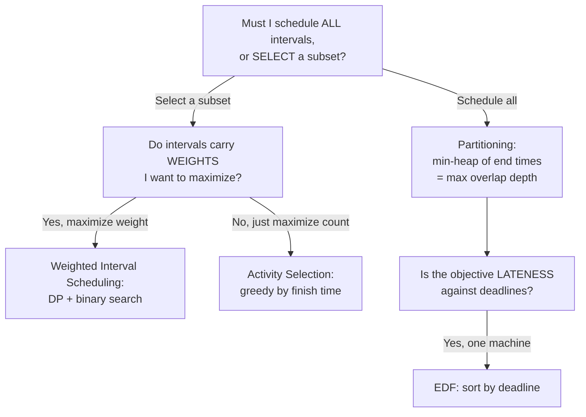

# Interval Scheduling Variations — Middle Level

> At the middle level the goal is **decision skill**: given a fuzzy real-world scheduling request, classify it into one of the four interval-scheduling variations and pick the *correct* engine — greedy-by-finish (count), DP-with-binary-search (weighted), min-heap-of-ends (partitioning), or EDF (lateness) — while understanding *why each greedy works or fails*, how the variations compose, and how to reconstruct the actual schedule, not just its score.

## Table of Contents
1. [Introduction](#1-introduction)
2. [The Decision Framework](#2-the-decision-framework)
3. [Variation A: Weighted Interval Scheduling — Why Greedy Dies, DP Lives](#3-variation-a-weighted-interval-scheduling)
4. [Variation B: Interval Partitioning — The Heap and the Depth Bound](#4-variation-b-interval-partitioning)
5. [Variation C: Minimizing Maximum Lateness — EDF](#5-variation-c-minimizing-maximum-lateness--edf)
6. [Variation D: Multi-Machine Scheduling](#6-variation-d-multi-machine-scheduling)
7. [Reconstructing the Actual Schedule](#7-reconstructing-the-actual-schedule)
8. [Code: A Unified Scheduling Toolkit](#8-code-a-unified-scheduling-toolkit)
9. [Complexity & Trade-offs](#9-complexity--trade-offs)
10. [Testing Against Brute Force](#10-testing-against-brute-force)
11. [Pitfalls That Bite at This Level](#11-pitfalls-that-bite-at-this-level)
12. [Summary](#12-summary)

---

## 1. Introduction

A junior recognizes the four variations. A mid-level engineer **chooses correctly under ambiguity** and can justify it. Real requests do not arrive labeled "weighted interval scheduling"; they arrive as:

- "Book the most client meetings into my one office tomorrow." → *count* → greedy by finish.
- "Book the meetings that bring in the most revenue into my one office." → *weighted* → DP.
- "How many offices must we rent so every booked meeting has a room?" → *partitioning* → min-heap.
- "We have one printer and a pile of due-dated jobs; minimize the worst overdue." → *lateness* → EDF.

Misclassify and you ship a subtly wrong system: a calendar that maximizes meeting *count* when the business wanted *revenue*, or one that uses greedy where DP was required. This level teaches the classification reflex, the *correctness intuition* behind each engine (deferring full proofs to `professional.md`), how the pieces compose, and how to recover the schedule itself.

---

## 2. The Decision Framework

Ask three questions, in order:



The discriminators:

| Discriminator | Implication |
|---------------|-------------|
| **Select vs schedule-all** | Selecting → activity selection / weighted. Scheduling all → partitioning / lateness. |
| **Count vs weight** | Count → greedy. Weight → DP. *This is the most-missed branch.* |
| **One resource vs many** | One → selection or lateness. Many (must place all) → partitioning / multi-machine. |
| **Deadlines present** | Lateness objective → EDF. |

A useful litmus test for "is greedy safe?": *greedy is safe exactly when every interval is interchangeable in value (count) or when the objective is a min-max over a single resource (lateness/partitioning).* The moment values differ **and** you are selecting a subset, greedy can be tricked — use DP.

---

## 3. Variation A: Weighted Interval Scheduling

### 3.1 Why greedy dies

Consider three intervals on one resource:

```
 A [0,2)  weight 1
 B [1,3)  weight 1
 C [0,3)  weight 1.9
```

`A` and `B` are compatible (under `[start,end)`, `A` ends at 2, `B` starts at 1 — wait, they overlap on `[1,2)`). Let us make it crisp:

```
 A [0,2)  weight 1
 B [2,4)  weight 1
 C [0,4)  weight 1.9
```

`A` and `B` are compatible (touch at 2, non-overlapping) → total weight 2. `C` alone → 1.9. The **optimal is {A, B} = 2.** Now run greedy-by-weight: it grabs `C` first (heaviest), then nothing else fits → 1.9. Wrong. Run greedy-by-finish: it takes `A` (finishes at 2), then `B` (starts at 2) → 2 here, but flip the weights to `A=1, B=1, C=100` and greedy-by-finish takes `A,B = 2` while optimal is `C = 100`. **No fixed greedy rule survives all weightings.** Selecting-with-values demands DP.

### 3.2 The DP recurrence (the heart of this level)

Sort intervals by **finish** time. For job `j` (1-indexed), define `p(j)` = the largest index `i < j` whose interval is **compatible** with `j` (i.e. `finish_i ≤ start_j`), or `0` if none. Then:

```
OPT(j) = max( OPT(j-1),                  // do not take job j
              w_j + OPT( p(j) ) )         // take job j; jump to last compatible job
OPT(0) = 0
```

- `OPT(j-1)` = best using jobs `1..j-1` and *not* taking `j`.
- `w_j + OPT(p(j))` = take `j`, then optimally fill the time *before* `start_j` using jobs `1..p(j)`.

Because intervals are finish-sorted, `p(j)` is found by **binary search** on the finish times in `O(log n)`. Total: `O(n log n)` (sort + n searches + linear DP).

### 3.3 Why finish-sort makes `p(j)` clean

Sorting by finish means: for any job `j`, every job compatible-and-before it forms a *prefix* `1..p(j)` of the finish-sorted order. That is exactly why a single binary search suffices and the DP reads `OPT(p(j))` instead of scanning. This is the structural insight that converts an exponential subset search into a linear scan.

### 3.4 When weighted reduces to unweighted

If all weights are equal (say `1`), `OPT(j)` counts intervals and the DP *coincides* with greedy-by-finish's count — a nice sanity check. So weighted scheduling **generalizes** activity selection; you could always use the DP, paying an extra `O(n)` space for the `dp` array. In practice, when weights are uniform, prefer the `O(1)`-space greedy.

---

## 4. Variation B: Interval Partitioning

### 4.1 The problem and the bound

Schedule **all** `n` intervals into the fewest "rooms" so that no room ever holds two overlapping intervals. The answer is the **depth** `d` = the maximum number of intervals that are simultaneously live at any instant.

- **Lower bound:** at the instant where `d` intervals overlap, every one of them needs its own room *right then* — no two can share. So you need *at least* `d` rooms. (Full argument in `professional.md`.)
- **Upper bound (greedy achieves it):** sort by start; sweep; maintain a min-heap of the end times of currently-open rooms. For each interval, if the earliest-freeing room is free (`heap.min ≤ start`), reuse it; else open a new room. The number of rooms opened never exceeds `d`, because a new room is opened only when *all* current rooms are busy, which means `d` intervals overlap at that moment.

So **min rooms = depth**, and the greedy is optimal. `O(n log n)`.

### 4.2 The sweep-line alternative (no heap)

You do not even need a heap to get the *count*. Create `+1` events at each start and `−1` at each end, sort all `2n` events (ties: process `−1` before `+1` for half-open intervals so a room is freed exactly when another wants it), and track a running counter; its maximum is the depth.

```
events = [(start, +1) for each] + [(end, -1) for each]
sort by (time, delta)     # -1 before +1 at equal time (half-open)
cur = 0; depth = 0
for (t, d) in events: cur += d; depth = max(depth, cur)
```

The heap is needed only if you must also know *which* room each interval lands in (an assignment, not just the count). Both are `O(n log n)`.

### 4.3 "Meeting Rooms II" is exactly this

LeetCode 253 asks for the minimum number of conference rooms — verbatim interval partitioning. The min-heap solution and the sweep-line solution both pass. Know both: the heap gives assignments, the sweep gives the cleanest count.

---

## 5. Variation C: Minimizing Maximum Lateness — EDF

### 5.1 Setup

One machine. Jobs `j` have processing time `t_j` and deadline `d_j`. You order them (no benefit to idle gaps), run back-to-back; job finishing at `f_j` has lateness `ℓ_j = max(0, f_j − d_j)`. Minimize `max_j ℓ_j`.

### 5.2 EDF and the exchange intuition

**Sort by deadline ascending; run in that order.** Why optimal? Suppose an optimal schedule has an **inversion**: a job `a` with `d_a > d_b` scheduled immediately before `b`. Swapping `a` and `b`:

- `b` now finishes earlier → its lateness cannot increase.
- `a` now finishes where `b` did → `a`'s new finish ≤ old `max(f_a, f_b)`, and since `d_a > d_b`, `a`'s lateness ≤ the old max lateness of the pair.

So the swap never increases the maximum lateness. Repeatedly removing inversions turns any schedule into the deadline-sorted one without making things worse → EDF is optimal. (Rigorous in `professional.md`.) `O(n log n)`.

### 5.3 What EDF does *not* optimize

EDF minimizes the **maximum** lateness. It does **not** minimize:

- *Average* lateness or total tardiness (that is harder; sometimes NP-hard).
- *Number* of late jobs (that is the Moore–Hodgson algorithm — a different greedy).
- *Weighted* completion time (Smith's rule: shortest weighted processing time).

Mid-level engineers must not over-apply EDF. Match the *exact* objective.

---

## 6. Variation D: Multi-Machine Scheduling

When you have `k` identical machines and want to place jobs to optimize a makespan-like or feasibility objective, the workhorse is again a **heap — this time of machine-available times**.

- **Assign each job to the earliest-available machine.** Sort jobs by start (for intervals) or process greedily (for load balancing); keep a min-heap of `k` "free-at" timestamps; pop the smallest, schedule, push back the new free time.
- **Interval partitioning is the special case** where `k` is *unbounded* and you minimize the number actually used.
- **Feasibility check:** "Can all intervals fit in exactly `k` rooms?" ⇔ `depth ≤ k`. Compute depth via the sweep; compare to `k`.

For *load-balancing* `k` machines to minimize makespan (sum of job lengths per machine), the classic **Longest-Processing-Time (LPT)** greedy — sort jobs descending, always add to the least-loaded machine (min-heap of loads) — gives a `4/3`-approximation. That is an *approximation* (true min-makespan is NP-hard), distinct from the *exact* interval-partitioning result. Knowing which problems are exactly solvable (partitioning, lateness, count, weighted) versus only approximable (makespan load balancing) is a key middle-level distinction.

---

## 7. Reconstructing the Actual Schedule

Computing the optimal *value* is half the job; often you must output the chosen intervals or the room assignment.

### 7.1 Weighted: backtrack the DP

Keep the `dp` array; walk backward. At job `j`: if `w_j + dp[p(j)] ≥ dp[j-1]`, job `j` was taken — record it and jump to `p(j)`; else move to `j-1`.

### 7.2 Partitioning: tag rooms in the heap

Store `(end_time, room_id)` in the heap. When you reuse a room, the popped entry tells you which room id to assign this interval; when you open a new room, mint a fresh id. The resulting per-interval room labels are a valid optimal coloring.

### 7.3 Activity selection / EDF: record as you sweep

For selection, append the interval whenever `start ≥ lastEnd`. For EDF, the deadline-sorted order *is* the schedule; emit it directly.

---

## 8. Code: A Unified Scheduling Toolkit

A single module exposing all four engines plus schedule reconstruction. All three print:
`count=3  weight=140  rooms=4  lateness=1`.

#### Go

```go
package main

import (
	"container/heap"
	"fmt"
	"sort"
)

type Iv struct{ start, finish, weight int }

// --- A. activity selection (count) ---
func maxCount(iv []Iv) int {
	s := append([]Iv(nil), iv...)
	sort.Slice(s, func(i, j int) bool { return s[i].finish < s[j].finish })
	cnt, last := 0, -1<<62
	for _, x := range s {
		if x.start >= last {
			cnt++
			last = x.finish
		}
	}
	return cnt
}

// --- B. weighted interval scheduling (DP + binary search) ---
func maxWeight(iv []Iv) int {
	s := append([]Iv(nil), iv...)
	sort.Slice(s, func(i, j int) bool { return s[i].finish < s[j].finish })
	n := len(s)
	dp := make([]int, n+1)
	for j := 1; j <= n; j++ {
		// p(j): last index i (1-based) with finish <= start_j
		lo, hi, p := 0, j-1, 0
		for lo <= hi {
			mid := (lo + hi) / 2
			if mid == 0 || s[mid-1].finish <= s[j-1].start {
				p = mid
				lo = mid + 1
			} else {
				hi = mid - 1
			}
		}
		take := s[j-1].weight + dp[p]
		if take > dp[j-1] {
			dp[j] = take
		} else {
			dp[j] = dp[j-1]
		}
	}
	return dp[n]
}

// --- C. interval partitioning (min-heap of end times) ---
type MinHeap []int

func (h MinHeap) Len() int            { return len(h) }
func (h MinHeap) Less(i, j int) bool  { return h[i] < h[j] }
func (h MinHeap) Swap(i, j int)       { h[i], h[j] = h[j], h[i] }
func (h *MinHeap) Push(x interface{}) { *h = append(*h, x.(int)) }
func (h *MinHeap) Pop() interface{} {
	o := *h
	v := o[len(o)-1]
	*h = o[:len(o)-1]
	return v
}

func minRooms(iv []Iv) int {
	s := append([]Iv(nil), iv...)
	sort.Slice(s, func(i, j int) bool { return s[i].start < s[j].start })
	h := &MinHeap{}
	heap.Init(h)
	best := 0
	for _, x := range s {
		if h.Len() > 0 && (*h)[0] <= x.start {
			heap.Pop(h)
		}
		heap.Push(h, x.finish)
		if h.Len() > best {
			best = h.Len()
		}
	}
	return best
}

// --- D. minimize maximum lateness (EDF) ---
func minMaxLateness(jobs [][2]int) int { // [length, deadline]
	s := append([][2]int(nil), jobs...)
	sort.Slice(s, func(i, j int) bool { return s[i][1] < s[j][1] })
	t, worst := 0, 0
	for _, j := range s {
		t += j[0]
		if t-j[1] > worst {
			worst = t - j[1]
		}
	}
	return worst
}

func main() {
	iv := []Iv{{1, 4, 10}, {3, 5, 20}, {0, 6, 100}, {5, 7, 30}, {8, 11, 40}}
	rooms := []Iv{{0, 6, 0}, {1, 4, 0}, {3, 5, 0}, {3, 9, 0}, {5, 7, 0}, {5, 9, 0}, {6, 10, 0}, {8, 11, 0}}
	jobs := [][2]int{{3, 6}, {2, 8}, {1, 9}, {4, 9}, {3, 14}, {2, 15}}
	fmt.Printf("count=%d  weight=%d  rooms=%d  lateness=%d\n",
		maxCount(iv), maxWeight(iv), minRooms(rooms), minMaxLateness(jobs))
}
```

#### Java

```java
import java.util.*;

public class SchedulingToolkit {
    record Iv(int start, int finish, int weight) {}

    static int maxCount(List<Iv> in) {
        List<Iv> s = new ArrayList<>(in);
        s.sort(Comparator.comparingInt(Iv::finish));
        int cnt = 0, last = Integer.MIN_VALUE;
        for (Iv x : s) if (x.start() >= last) { cnt++; last = x.finish(); }
        return cnt;
    }

    static int maxWeight(List<Iv> in) {
        List<Iv> s = new ArrayList<>(in);
        s.sort(Comparator.comparingInt(Iv::finish));
        int n = s.size();
        int[] dp = new int[n + 1];
        for (int j = 1; j <= n; j++) {
            int lo = 0, hi = j - 1, p = 0;
            while (lo <= hi) {
                int mid = (lo + hi) / 2;
                if (mid == 0 || s.get(mid - 1).finish() <= s.get(j - 1).start()) { p = mid; lo = mid + 1; }
                else hi = mid - 1;
            }
            dp[j] = Math.max(dp[j - 1], s.get(j - 1).weight() + dp[p]);
        }
        return dp[n];
    }

    static int minRooms(List<Iv> in) {
        List<Iv> s = new ArrayList<>(in);
        s.sort(Comparator.comparingInt(Iv::start));
        PriorityQueue<Integer> pq = new PriorityQueue<>();
        int best = 0;
        for (Iv x : s) {
            if (!pq.isEmpty() && pq.peek() <= x.start()) pq.poll();
            pq.add(x.finish());
            best = Math.max(best, pq.size());
        }
        return best;
    }

    static int minMaxLateness(int[][] jobs) {
        int[][] s = jobs.clone();
        Arrays.sort(s, Comparator.comparingInt(a -> a[1]));
        int t = 0, worst = 0;
        for (int[] j : s) { t += j[0]; worst = Math.max(worst, t - j[1]); }
        return worst;
    }

    public static void main(String[] args) {
        List<Iv> iv = List.of(new Iv(1,4,10), new Iv(3,5,20), new Iv(0,6,100),
                               new Iv(5,7,30), new Iv(8,11,40));
        List<Iv> rooms = List.of(new Iv(0,6,0), new Iv(1,4,0), new Iv(3,5,0), new Iv(3,9,0),
                                 new Iv(5,7,0), new Iv(5,9,0), new Iv(6,10,0), new Iv(8,11,0));
        int[][] jobs = {{3,6},{2,8},{1,9},{4,9},{3,14},{2,15}};
        System.out.printf("count=%d  weight=%d  rooms=%d  lateness=%d%n",
            maxCount(iv), maxWeight(iv), minRooms(rooms), minMaxLateness(jobs));
    }
}
```

#### Python

```python
import heapq
from bisect import bisect_right


def max_count(iv):
    s = sorted(iv, key=lambda x: x[1])
    cnt, last = 0, float("-inf")
    for st, fi, _w in s:
        if st >= last:
            cnt += 1
            last = fi
    return cnt


def max_weight(iv):
    s = sorted(iv, key=lambda x: x[1])
    n = len(s)
    finishes = [s[i][1] for i in range(n)]
    dp = [0] * (n + 1)
    for j in range(1, n + 1):
        st, fi, w = s[j - 1]
        p = bisect_right(finishes, st, 0, j - 1)  # count of finishes <= st in prefix
        dp[j] = max(dp[j - 1], w + dp[p])
    return dp[n]


def min_rooms(iv):
    s = sorted(iv, key=lambda x: x[0])
    heap = []
    best = 0
    for st, fi, *_ in s:
        if heap and heap[0] <= st:
            heapq.heappop(heap)
        heapq.heappush(heap, fi)
        best = max(best, len(heap))
    return best


def min_max_lateness(jobs):
    s = sorted(jobs, key=lambda x: x[1])
    t, worst = 0, 0
    for length, deadline in s:
        t += length
        worst = max(worst, t - deadline)
    return worst


if __name__ == "__main__":
    iv = [(1, 4, 10), (3, 5, 20), (0, 6, 100), (5, 7, 30), (8, 11, 40)]
    rooms = [(0, 6, 0), (1, 4, 0), (3, 5, 0), (3, 9, 0), (5, 7, 0), (5, 9, 0), (6, 10, 0), (8, 11, 0)]
    jobs = [(3, 6), (2, 8), (1, 9), (4, 9), (3, 14), (2, 15)]
    print(f"count={max_count(iv)}  weight={max_weight(iv)}  "
          f"rooms={min_rooms(rooms)}  lateness={min_max_lateness(jobs)}")
```

**What it does:** one toolkit, four engines — count (greedy), weight (DP), rooms (heap), lateness (EDF).
**Run:** `go run main.go` | `javac SchedulingToolkit.java && java SchedulingToolkit` | `python toolkit.py`

> Note on the Python `max_weight`: because `finishes` is the finish-sorted prefix, `bisect_right(finishes, st, 0, j-1)` returns exactly the count of compatible jobs before `j`, which is the 1-based index `p`; `dp[p]` is then `OPT(p(j))`. This matches the Go/Java `p` computed by the explicit binary search.

---

## 9. Complexity & Trade-offs

| Variation | Time | Space | Greedy or DP? | Optimal? |
|-----------|------|-------|---------------|----------|
| Activity selection (count) | `O(n log n)` | `O(1)` | Greedy (finish) | Exact |
| Weighted interval scheduling | `O(n log n)` | `O(n)` | **DP** | Exact |
| Interval partitioning (min rooms) | `O(n log n)` | `O(depth)` | Greedy (heap) | Exact |
| Min max lateness (1 machine) | `O(n log n)` | `O(1)` | Greedy (EDF) | Exact |
| Multi-machine partition feasibility (`depth ≤ k`) | `O(n log n)` | `O(n)` | Sweep | Exact |
| Min makespan on `k` machines (load balance) | `O(n log n)` (LPT) | `O(k)` | Greedy (approx) | **NP-hard; LPT is 4/3-approx** |

The clean takeaway: the four *core* interval variations are all exactly solvable in `O(n log n)`. The moment you cross into makespan/total-tardiness territory, exactness is lost and you trade to approximations.

---

## 10. Testing Against Brute Force

Greedy and DP bugs hide in plain sight. Validate on small `n` against exhaustive oracles:

- **Count / weighted:** enumerate all `2^n` subsets, keep the compatible ones, take max count / max weight. Compare.
- **Partitioning:** the depth is checkable directly by the event sweep — and the heap answer must equal it.
- **Lateness:** enumerate all `n!` orderings (for `n ≤ 8`), compute max lateness of each, take the min; EDF must match.

```python
from itertools import permutations, combinations

def brute_weight(iv):
    best = 0
    for r in range(len(iv) + 1):
        for sub in combinations(iv, r):
            ss = sorted(sub, key=lambda x: x[0])
            ok = all(ss[i][1] <= ss[i+1][0] for i in range(len(ss)-1))
            if ok:
                best = max(best, sum(x[2] for x in sub))
    return best

def brute_lateness(jobs):
    best = float("inf")
    for perm in permutations(jobs):
        t, worst = 0, 0
        for length, d in perm:
            t += length
            worst = max(worst, t - d)
        best = min(best, worst)
    return best
```

If `max_weight == brute_weight` and `min_max_lateness == brute_lateness` over hundreds of random tiny instances, you trust the fast versions.

---

## 11. Pitfalls That Bite at This Level

- **Choosing greedy for weighted because "it looked fine on the examples."** Always ask: do values differ *and* am I selecting a subset? If yes → DP.
- **Confusing min-max lateness (EDF) with min-number-of-late-jobs (Moore–Hodgson) or min-total-tardiness (hard).** They are different problems with different algorithms.
- **Believing min-rooms needs the heap.** The sweep-line gives the count alone; the heap is only for *assignment*.
- **Applying LPT load-balancing thinking to interval partitioning.** Partitioning is exact; makespan is approximate — do not conflate.
- **Forgetting reconstruction.** Many real tasks need the *schedule*, not the score; design the backtrack/room-tagging up front.
- **Half-open vs closed inconsistency between sort and overlap test**, which silently changes room counts at touch points.
- **Re-sorting per DP step**, blowing up complexity.

---

## 11.5 A Worked Classification Drill

Practice the framework on five disguised requests — say the variation and engine out loud before reading the answer.

1. *"Pick the most podcast episodes I can record in one studio today, given each episode's fixed slot."* → **count / activity selection** (greedy by finish). No weights, select a subset, one resource.
2. *"Same studio, but each episode has a sponsorship value — maximize revenue."* → **weighted interval scheduling** (DP). Weights + subset selection = DP, not greedy.
3. *"How many studios must I rent so every requested recording has a room?"* → **interval partitioning** (min-heap / depth). Must place all; choose resource count.
4. *"One render farm node, each render job has a deadline — minimize the worst overrun."* → **min max lateness** (EDF). Deadlines, single resource, min-max objective.
5. *"Distribute 200 jobs across 8 render nodes to finish as early as possible."* → **makespan load balancing** (LPT, *approximate*). Note the trap: this is NOT exact interval partitioning; it is NP-hard, so you reach for the LPT heuristic, not a provably-optimal greedy.

The fifth is the one that catches people: the first four are exactly solvable, but "minimize makespan on `m ≥ 2` machines" crosses into NP-hard territory. Saying "this looks like partitioning" there would be wrong — partitioning minimizes *resource count* for full placement, not *makespan* for a fixed machine count. Spotting that boundary is the whole middle-level skill.

A second drill on the *count vs weight* branch, since it is the most-missed: *"Select non-overlapping ad slots."* If all slots are equally valuable → **count** (greedy). If slots have different revenue → **weight** (DP). The word that flips the engine is "valuable / revenue / priority." Train yourself to listen for it; its presence with subset-selection is the unambiguous DP signal.

## 12. Summary

The middle-level skill is *correct classification under ambiguity*. Run the decision framework: **schedule-all or select?** → partitioning/lateness vs selection/weighted. **Count or weight?** → greedy vs DP (the most-missed branch). **One machine with deadlines?** → EDF. Each engine is `O(n log n)`: greedy-by-finish for count, the `OPT(j)=max(skip, w_j+OPT(p(j)))` DP with binary search for weight, a min-heap of end times (equal to the max-overlap depth) for rooms, and Earliest-Deadline-First for minimizing the maximum lateness. Understand *why* greedy fails on weighted (no fixed rule survives all weightings) and *why* it succeeds on the other three (interchangeable values, or a min-max over one resource). Compose them for multi-machine work, know that makespan load-balancing is only approximable while the four core variations are exact, always be ready to *reconstruct* the schedule, and validate every fast routine against a brute-force oracle on small inputs.
</content>
