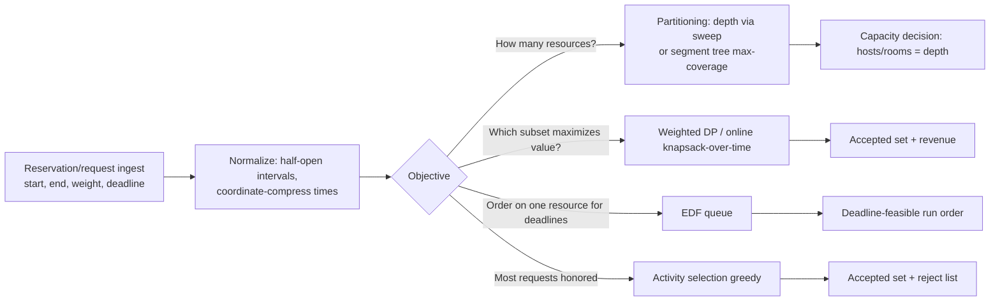

# Interval Scheduling Variations — Senior Level

> At the senior level interval scheduling stops being four textbook algorithms and becomes the math kernel inside real **resource-allocation systems** — CPU/thread schedulers, calendar and meeting-room booking, lecture-hall assignment, ad-slot auctions, VM/container bin-packing over time. The engineering is in turning an `O(n log n)` core into a service: streaming/incremental updates, dynamic inserts and deletes, the **max-overlap (depth) lower bound** as a provable capacity number, weighted scheduling at scale, and the operational concerns — observability, failure modes, capacity planning — around a scheduler that must never double-book.

## Table of Contents
1. [Introduction](#1-introduction)
2. [System Design: Where the Variations Live](#2-system-design-where-the-variations-live)
3. [The Depth Lower Bound as a Capacity Contract](#3-the-depth-lower-bound-as-a-capacity-contract)
4. [Dynamic & Streaming Interval Scheduling](#4-dynamic--streaming-interval-scheduling)
5. [Weighted Scheduling at Scale](#5-weighted-scheduling-at-scale)
6. [Real Systems: CPU, Calendar, Lecture Halls, Ads](#6-real-systems)
7. [Concurrency and Parallelism](#7-concurrency-and-parallelism)
8. [Code: A Production Room-Booking / Partitioning Kernel](#8-code-a-production-kernel)
9. [Observability](#9-observability)
10. [Failure Modes](#10-failure-modes)
11. [Capacity Planning](#11-capacity-planning)
12. [Summary](#12-summary)

---

## 1. Introduction

A senior engineer rarely writes `activity_selection` as a leaf function. The variations show up *embedded*:

- **CPU / thread scheduling** — deadline-driven real-time scheduling (EDF) is the textbook-optimal single-core policy for meeting deadlines; admission control asks "does the depth of requested reservations exceed core capacity?"
- **Calendar & meeting-room booking** — interval partitioning answers "how many rooms?"; weighted scheduling answers "which subset of requested meetings, given priorities, maximizes value on a constrained room?"
- **Lecture-hall / exam-slot assignment** — partition overlapping sessions into the fewest halls; the depth is the registrar's hard room-count requirement.
- **Ad-slot / sponsorship auctions** — weighted interval scheduling: pick the non-overlapping set of bids maximizing revenue on a single inventory channel.
- **Cloud time-based bin-packing** — reservations of VMs/containers with start/end; the number of physical hosts needed at peak equals the depth of the reservation intervals.

The senior decisions are not "how does EDF work" but:

1. Is the workload **static (batch)** or **dynamic (inserts/deletes/streaming)**? That changes the data structure entirely (sort-once vs balanced-BST/segment-tree).
2. What is the **provable lower bound** I can quote to capacity planning — the **depth** — and how do I keep it correct under churn?
3. Where does **weighted** value enter, and can the DP keep up at scale, or do I need an incremental/online variant?
4. How do I make the scheduler **observable and safe** so it never silently double-books a resource?

---

## 2. System Design: Where the Variations Live



The **ingest/normalize** stage is shared and load-bearing: pick one interval convention (`[start, end)`), coordinate-compress timestamps to small integers (real systems have millisecond epochs — compress to event ranks), and validate `start < end`. Every downstream engine assumes clean, half-open, compressed intervals.

### 2.1 Three deployment shapes

| Shape | Pattern | When |
|-------|---------|------|
| **Batch planner** | Sort once, run the relevant `O(n log n)` engine, emit a plan | Nightly lecture-hall assignment, daily ad schedule. |
| **Online admission controller** | Maintain a live structure; each request → accept/reject in `O(log n)` | Real-time room booking, VM reservation, EDF runqueue. |
| **Hybrid replan** | Online accepts greedily; periodic batch re-optimizes (esp. weighted) | Calendar apps that accept instantly but nightly re-pack for value. |

The most common senior mistake is using a *batch* sort-once design behind a high-churn API, forcing an `O(n log n)` recompute on every insert when an `O(log n)` incremental structure was needed.

---

## 3. The Depth Lower Bound as a Capacity Contract

### 3.1 Why depth is the number you ship

For interval partitioning, the minimum number of resources equals the **depth** `d` — the maximum number of intervals overlapping at any instant. This is not a heuristic; it is a *tight lower and upper bound* (greedy achieves it; the busiest instant forbids fewer). For a senior, that makes `d` a **capacity contract**: "to honor every booked interval without conflict you need exactly `d` rooms/hosts/cores — provably no fewer." You can put `d` in an SLA.

### 3.2 Computing depth robustly

The clean computation is the **event sweep**: `+1` at each start, `−1` at each end, sorted with `−1` before `+1` at equal times (half-open), running max of the prefix sum. `O(n log n)`. For *dynamic* depth (intervals come and go), use a **segment tree with range-add and range-max** over compressed time: inserting interval `[s, e)` does `+1` on `[s, e)`, deleting does `−1`, and the tree root holds the live depth in `O(log n)` per op. This is the structure that turns the depth bound from a one-shot number into a *live gauge* you can alert on.

### 3.3 Depth vs capacity in admission control

Admission control for `k` resources is exactly: *will accepting this interval push the depth above `k` anywhere on its span?* With the range-add/range-max segment tree, you tentatively add the interval, check if the max over its span exceeds `k`, and roll back if so — `O(log n)` per request. This is the production heart of "can this booking fit in our 12 rooms?"

---

## 4. Dynamic & Streaming Interval Scheduling

Static algorithms sort once. Real schedulers face **inserts, deletes, and queries** interleaved forever.

### 4.1 Data-structure menu

| Need | Structure | Op cost |
|------|-----------|---------|
| Live depth / "fits in k?" | Segment tree, range-add + range-max over compressed time | `O(log n)` per insert/delete/query |
| "Is this interval free on resource r?" | Per-resource ordered set (balanced BST) of intervals | `O(log n)` |
| Earliest-free resource (multi-machine) | Min-heap of resource free-times | `O(log k)` |
| Streaming max-overlap on append-only data | Online sweep with a counter + max | `O(log n)` amortized (insertion-sorted) |
| Weighted accept/reject online | Incremental DP is hard; use greedy admission + periodic batch re-pack | see §5 |

### 4.2 The "delete" problem

Greedy partitioning is beautiful for static data but does not gracefully support **deletes** (cancelled meetings). A min-heap cannot remove an arbitrary interior end time cheaply. Two senior fixes:

1. **Lazy deletion** — mark ends as cancelled; skip them when popped. Bounds the heap by total-ever-inserted, fine for moderate churn.
2. **Segment tree of coverage** — abandon the heap; maintain depth directly with range-add/range-max, which supports `−1` on delete natively. This is the robust choice for long-lived schedulers with cancellations.

### 4.3 Streaming caution

For a true *stream* (intervals arrive in arbitrary time order, unbounded), you cannot "sort once." Either buffer-and-batch in windows, or use the segment tree over a *pre-known* compressed time domain. If timestamps are unbounded and unknown, fall back to a balanced BST keyed by time with order-statistics for depth — more machinery, same `O(log n)` guarantees.

---

## 5. Weighted Scheduling at Scale

### 5.1 The batch DP is fine — until it isn't

The `OPT(j) = max(OPT(j-1), w_j + OPT(p(j)))` DP is `O(n log n)` and trivially handles millions of intervals in one pass. At scale the issues are:

- **Reconstruction memory** — storing the back-pointer chain for the chosen set is `O(n)`; for huge `n` stream the decisions to disk during backtrack.
- **Re-optimization churn** — if requests change, a full DP re-run per change is wasteful. There is no clean `O(log n)` incremental weighted-interval DP in general; the practical pattern is **greedy online admission** (accept if compatible with current plan and value-positive) plus **periodic batch re-pack** that re-runs the exact DP to recover any value lost to greedy.

### 5.2 When weighted becomes multi-resource

"Maximum-value non-overlapping subset on **`k` resources**" generalizes weighted interval scheduling. With `k` unbounded it is just partitioning + take-all. With `k` fixed and weights, it becomes a **min-cost flow / matching** problem (intervals to resource-slots), solvable in polynomial time but well beyond the simple DP — a senior recognizes the jump from "single-resource DP" to "multi-resource flow" and sizes the system accordingly.

### 5.3 Approximation escape hatches

When the exact model is too heavy (e.g. weighted multi-resource with side constraints), seniors fall back to:

- **Greedy by value-density** (`weight / length`) — fast, no optimality guarantee, but a sane online heuristic.
- **LP relaxation + rounding** for the offline weighted-packing variant.
- **Local search / re-pack** windows in the hybrid design.

Knowing *which* problems remain exactly polynomial (single-resource weighted DP, partitioning, EDF) versus which have crossed into flow/NP territory is the core senior judgment here.

---

## 6. Real Systems

### 6.1 CPU / real-time scheduling

**EDF is provably optimal for single-core deadline scheduling**: if any schedule meets all deadlines, EDF does. Real-time OS kernels implement EDF (and its cousin, Rate-Monotonic) directly. The **utilization bound** `Σ (t_i / period_i) ≤ 1` is the admission test — the temporal analog of the depth bound. Senior insight: EDF's optimality is exactly the exchange argument from `professional.md`, now running in a microkernel under microsecond budgets.

### 6.2 Calendar & meeting-room booking

A booking service is *interval partitioning + admission control*. "Schedule this 2pm–3pm meeting" → check depth over `[2pm, 3pm)` against room count `k` via the segment tree; accept if `depth+1 ≤ k`. "How many rooms do we need next quarter?" → depth of all projected bookings. "Given a priority on a single VIP room, which meetings maximize importance?" → weighted interval DP on that room's requests.

### 6.3 Lecture-hall / exam assignment

The registrar's problem is partitioning: assign overlapping sessions to the fewest halls, where the hall count is the depth. The min-heap (or graph-coloring view: interval graphs are perfectly colorable, and the chromatic number equals the clique number equals the depth) yields an explicit hall-per-session assignment. The fact that **interval graphs color optimally in polynomial time** (unlike general graph coloring, which is NP-hard) is the structural reason this is easy — a key senior talking point.

### 6.4 Ad-slot / sponsorship auctions

A single ad channel over a day is a line of time; bids are weighted intervals; revenue-maximizing non-overlapping selection is *exactly* weighted interval scheduling. At scale (millions of bids) the `O(n log n)` DP runs in the auction's batch window; online, an admission heuristic accepts high-density bids and a periodic re-pack recovers optimality.

---

## 7. Concurrency and Parallelism

The schedulers must be safe under concurrent requests.

1. **Admission must be atomic.** Checking "does depth stay ≤ k?" and committing the interval must be one critical section (or a CAS on a versioned segment-tree node), or two requests both see room and double-book. This is the cardinal safety property — a scheduler that races is worse than a slow one.
2. **Read-mostly depth queries** can be lock-free (snapshot the segment tree); only mutations serialize.
3. **Sharding by resource.** Per-room/per-core structures are independent — shard the scheduler by resource id so each resource's BST/heap is contended only by requests targeting it. Cross-resource queries (global depth) aggregate shard maxima.
4. **Batch engines are embarrassingly parallel across independent groups** — connected components of the overlap graph never interact, so partition them and schedule each on its own worker.
5. **EDF runqueues** are per-core; work-stealing across cores must preserve per-core deadline order to retain the optimality guarantee.

**Determinism for audit:** booking systems must be reproducible (who got the room?). Use a total order on requests (timestamp + tiebreak id) so replays produce identical accept/reject decisions — critical for billing disputes.

---

## 8. Code: A Production Kernel

A reusable kernel exposing: **min rooms (depth) via heap**, **live depth via a range-add/range-max segment tree** (for dynamic admission), and **admission control** ("fits in `k` rooms?"). All three print `minRooms=4  depth=4  fits(4)=true  fits(3)=false`.

#### Go

```go
package main

import (
	"container/heap"
	"fmt"
	"sort"
)

// ---- static min-rooms via min-heap of end times ----
type MinHeap []int

func (h MinHeap) Len() int            { return len(h) }
func (h MinHeap) Less(i, j int) bool  { return h[i] < h[j] }
func (h MinHeap) Swap(i, j int)       { h[i], h[j] = h[j], h[i] }
func (h *MinHeap) Push(x interface{}) { *h = append(*h, x.(int)) }
func (h *MinHeap) Pop() interface{} {
	o := *h
	v := o[len(o)-1]
	*h = o[:len(o)-1]
	return v
}

func minRooms(iv [][2]int) int {
	s := append([][2]int(nil), iv...)
	sort.Slice(s, func(i, j int) bool { return s[i][0] < s[j][0] })
	h := &MinHeap{}
	heap.Init(h)
	best := 0
	for _, x := range s {
		if h.Len() > 0 && (*h)[0] <= x[0] {
			heap.Pop(h)
		}
		heap.Push(h, x[1])
		if h.Len() > best {
			best = h.Len()
		}
	}
	return best
}

// ---- dynamic depth: range-add / range-max segment tree over compressed time ----
type SegTree struct {
	n    int
	max  []int
	lazy []int
}

func NewSegTree(n int) *SegTree {
	return &SegTree{n: n, max: make([]int, 4*n), lazy: make([]int, 4*n)}
}
func (t *SegTree) push(node int) {
	if t.lazy[node] != 0 {
		for _, c := range []int{2 * node, 2*node + 1} {
			t.max[c] += t.lazy[node]
			t.lazy[c] += t.lazy[node]
		}
		t.lazy[node] = 0
	}
}

// add delta on [l, r) (compressed indices), 1-call range update
func (t *SegTree) Add(node, lo, hi, l, r, delta int) {
	if r <= lo || hi <= l {
		return
	}
	if l <= lo && hi <= r {
		t.max[node] += delta
		t.lazy[node] += delta
		return
	}
	t.push(node)
	mid := (lo + hi) / 2
	t.Add(2*node, lo, mid, l, r, delta)
	t.Add(2*node+1, mid, hi, l, r, delta)
	if t.max[2*node] > t.max[2*node+1] {
		t.max[node] = t.max[2*node]
	} else {
		t.max[node] = t.max[2*node+1]
	}
}

// query max on [l, r)
func (t *SegTree) Query(node, lo, hi, l, r int) int {
	if r <= lo || hi <= l {
		return 0
	}
	if l <= lo && hi <= r {
		return t.max[node]
	}
	t.push(node)
	mid := (lo + hi) / 2
	a := t.Query(2*node, lo, mid, l, r)
	b := t.Query(2*node+1, mid, hi, l, r)
	if a > b {
		return a
	}
	return b
}

func main() {
	iv := [][2]int{{0, 6}, {1, 4}, {3, 5}, {3, 9}, {5, 7}, {5, 9}, {6, 10}, {8, 11}}
	fmt.Println("minRooms =", minRooms(iv)) // 4

	// compress times to [0..T); here times are small already (0..11)
	const T = 12
	st := NewSegTree(T)
	for _, x := range iv {
		st.Add(1, 0, T, x[0], x[1], +1)
	}
	depth := st.Query(1, 0, T, 0, T)
	fmt.Println("depth =", depth) // 4

	fits := func(k int) bool { return st.Query(1, 0, T, 0, T) <= k }
	fmt.Println("fits(4) =", fits(4)) // true
	fmt.Println("fits(3) =", fits(3)) // false
}
```

#### Java

```java
import java.util.*;

public class SchedulerKernel {
    static int minRooms(int[][] iv) {
        int[][] s = iv.clone();
        Arrays.sort(s, Comparator.comparingInt(a -> a[0]));
        PriorityQueue<Integer> pq = new PriorityQueue<>();
        int best = 0;
        for (int[] x : s) {
            if (!pq.isEmpty() && pq.peek() <= x[0]) pq.poll();
            pq.add(x[1]);
            best = Math.max(best, pq.size());
        }
        return best;
    }

    // range-add / range-max segment tree over [0, T)
    static class SegTree {
        int n; int[] mx, lazy;
        SegTree(int n) { this.n = n; mx = new int[4 * n]; lazy = new int[4 * n]; }
        void push(int node) {
            if (lazy[node] != 0) {
                for (int c : new int[]{2 * node, 2 * node + 1}) { mx[c] += lazy[node]; lazy[c] += lazy[node]; }
                lazy[node] = 0;
            }
        }
        void add(int node, int lo, int hi, int l, int r, int d) {
            if (r <= lo || hi <= l) return;
            if (l <= lo && hi <= r) { mx[node] += d; lazy[node] += d; return; }
            push(node);
            int mid = (lo + hi) / 2;
            add(2 * node, lo, mid, l, r, d);
            add(2 * node + 1, mid, hi, l, r, d);
            mx[node] = Math.max(mx[2 * node], mx[2 * node + 1]);
        }
        int query(int node, int lo, int hi, int l, int r) {
            if (r <= lo || hi <= l) return 0;
            if (l <= lo && hi <= r) return mx[node];
            push(node);
            int mid = (lo + hi) / 2;
            return Math.max(query(2 * node, lo, mid, l, r), query(2 * node + 1, mid, hi, l, r));
        }
    }

    public static void main(String[] args) {
        int[][] iv = {{0,6},{1,4},{3,5},{3,9},{5,7},{5,9},{6,10},{8,11}};
        System.out.println("minRooms = " + minRooms(iv)); // 4
        final int T = 12;
        SegTree st = new SegTree(T);
        for (int[] x : iv) st.add(1, 0, T, x[0], x[1], +1);
        int depth = st.query(1, 0, T, 0, T);
        System.out.println("depth = " + depth);            // 4
        System.out.println("fits(4) = " + (depth <= 4));   // true
        System.out.println("fits(3) = " + (depth <= 3));   // false
    }
}
```

#### Python

```python
import heapq


def min_rooms(iv):
    s = sorted(iv, key=lambda x: x[0])
    heap, best = [], 0
    for st, en in s:
        if heap and heap[0] <= st:
            heapq.heappop(heap)
        heapq.heappush(heap, en)
        best = max(best, len(heap))
    return best


class SegTree:
    """Range-add / range-max over [0, n)."""
    def __init__(self, n):
        self.n = n
        self.mx = [0] * (4 * n)
        self.lazy = [0] * (4 * n)

    def _push(self, node):
        if self.lazy[node]:
            for c in (2 * node, 2 * node + 1):
                self.mx[c] += self.lazy[node]
                self.lazy[c] += self.lazy[node]
            self.lazy[node] = 0

    def add(self, node, lo, hi, l, r, d):
        if r <= lo or hi <= l:
            return
        if l <= lo and hi <= r:
            self.mx[node] += d
            self.lazy[node] += d
            return
        self._push(node)
        mid = (lo + hi) // 2
        self.add(2 * node, lo, mid, l, r, d)
        self.add(2 * node + 1, mid, hi, l, r, d)
        self.mx[node] = max(self.mx[2 * node], self.mx[2 * node + 1])

    def query(self, node, lo, hi, l, r):
        if r <= lo or hi <= l:
            return 0
        if l <= lo and hi <= r:
            return self.mx[node]
        self._push(node)
        mid = (lo + hi) // 2
        return max(self.query(2 * node, lo, mid, l, r),
                   self.query(2 * node + 1, mid, hi, l, r))


if __name__ == "__main__":
    iv = [(0, 6), (1, 4), (3, 5), (3, 9), (5, 7), (5, 9), (6, 10), (8, 11)]
    print("minRooms =", min_rooms(iv))  # 4
    T = 12
    st = SegTree(T)
    for s, e in iv:
        st.add(1, 0, T, s, e, +1)
    depth = st.query(1, 0, T, 0, T)
    print("depth =", depth)              # 4
    print("fits(4) =", depth <= 4)       # True
    print("fits(3) =", depth <= 3)       # False
```

**What it does:** static min-rooms (heap), live depth (segment tree), and admission control (`fits(k)`) — the kernel of a room-booking / capacity service.
**Run:** `go run main.go` | `javac SchedulerKernel.java && java SchedulerKernel` | `python kernel.py`

---

## 9. Observability

What to instrument when a scheduler runs in production:

- **Live depth gauge** per resource group — the current max-overlap. The single most important number: it *is* the capacity demand. Alert when `depth ≥ k − margin`.
- **Accept / reject rate** for admission control. A rising reject rate means demand is outgrowing provisioned resources (`k`).
- **Rooms-used vs rooms-provisioned** — partitioning's output vs the SLA. A persistent gap means over- or under-provisioning.
- **Weighted plan value** (achieved revenue/priority) and the *gap* between the online-greedy value and the nightly batch-DP optimum — quantifies how much value the fast path leaves on the table.
- **EDF deadline-miss count** — for deadline scheduling, the number of jobs that finished late (lateness > 0). Zero is the goal; nonzero means over-subscription.
- **Double-booking alarm** — a *correctness* invariant check: no resource ever hosts two overlapping committed intervals. Any hit is a sev-1 (a race in admission).
- **Tail latency of admission** — `O(log n)` per request; a spike signals an unbalanced/oversized structure or lock contention.

### 9.1 Minimal metric set

| Metric | Type | Example SLO / alert |
|--------|------|---------------------|
| `live_depth{group}` | gauge | `≥ k` ⇒ page (at capacity / double-book risk) |
| `admission_reject_ratio` | gauge | sustained `> 0.1` ⇒ add resources |
| `double_booking_total` | counter | any `> 0` ⇒ sev-1 correctness alarm |
| `edf_deadline_miss_total` | counter | any `> 0` on a hard-RT route ⇒ page |
| `greedy_vs_optimal_value_gap` | gauge | persistent large gap ⇒ tune re-pack cadence |
| `admission_latency_ms` | histogram | p99 over a few ms ⇒ investigate structure |

The decisive alert is `double_booking_total > 0`: it is the only signal distinguishing a *plausibly-fine* scheduler from one that has corrupted the resource invariant — the failure this whole domain exists to prevent.

---

## 10. Failure Modes

| Failure | Symptom | Root cause | Mitigation |
|---------|---------|------------|------------|
| Double-booking | Two overlapping intervals on one resource | Non-atomic check-then-commit (race) | Atomic admission (lock / CAS on versioned node). |
| Wrong room count at touch points | Off-by-one rooms | `[start,end]` vs `[start,end)` mismatch between sort and overlap test | Pin half-open everywhere; `heap.peek <= start` reuse. |
| Greedy-on-weighted under-earning | Revenue below optimum | Used count-greedy where weighted DP was required | Route weighted objectives to the DP / re-pack. |
| Stale depth after cancellation | Capacity over-reported | Heap can't delete interior ends | Use range-add/range-max segment tree (native `−1`) or lazy deletion. |
| EDF misses despite optimality | Deadlines missed | System is *over-subscribed* — no schedule meets all deadlines | Admission test on utilization/depth; shed or scale. |
| Coordinate explosion | Memory blow-up in segment tree | Built tree over raw epoch ms, not compressed ranks | Coordinate-compress times to `O(n)` distinct points. |
| Non-reproducible bookings | Billing disputes on "who got the room" | No total order on concurrent requests | Total-order requests (timestamp + id); deterministic replay. |
| Re-pack thrash | CPU spikes, plan churn | Batch DP re-run too frequently | Window the re-pack; only re-optimize changed components. |

---

## 11. Capacity Planning

- **The depth IS the capacity number.** Provision rooms/hosts/cores ≥ peak depth of projected intervals. Forecast depth growth from booking trends; the segment-tree gauge gives the live value.
- **Admission cost.** Each request is `O(log n)` on the live structure — sub-microsecond for `n` in the millions. A single core handles hundreds of thousands of admissions/sec; size the pool to request rate, shard by resource for contention.
- **Batch DP cost.** Weighted scheduling over `n` intervals is `O(n log n)`; `n = 10⁷` runs in seconds on one core. Re-pack cadence (how often you re-run it) is the real cost knob — nightly is cheap, per-request is wasteful.
- **Memory.** Segment tree over `m` compressed time points is `O(m)`; per-resource BSTs total `O(n)`. For `n = 10⁶` intervals, low hundreds of MB — modest.
- **Worked back-of-envelope.** A booking API at 5,000 req/s, each an `O(log n)` admission on a structure with `n ≈ 10⁶` (≈20 comparisons), is ~`10⁵` ops/s — trivially one core. The cost is *not* the algorithm; it is the atomic-commit serialization. Shard by room so commits on different rooms proceed in parallel; with 200 rooms you get ~200-way commit concurrency, eliminating the bottleneck.
- **Tail control.** Large connected components (a day where everything overlaps) make depth queries touch more of the tree; cap component size or pre-aggregate per-day depth.

---

## 11.5 A Worked End-to-End Scenario: Meeting-Room Service

To make the senior decisions concrete, trace one realistic feature from request to capacity number.

**Setup.** A company runs a booking service over 40 conference rooms across a campus. Bookings arrive at ~3,000/min during business hours; ~5% are cancellations. Product asks three questions: (1) accept/reject each booking in real time, (2) show a live "rooms in use" dashboard, (3) tell facilities how many rooms next quarter needs.

**Design choices.**

1. **Normalize** every booking to half-open `[start, end)` in epoch seconds, then coordinate-compress per-day (a day has at most a few thousand distinct boundary times) so the segment tree domain is small.
2. **Admission (question 1):** a per-campus range-add/range-max segment tree. Each booking tentatively does `+1` on `[start, end)`; if the max over that span exceeds 40, roll back and reject; else commit. Cancellations do `−1` natively — the reason we chose the segment tree over a min-heap. The check-and-commit is wrapped in a per-campus lock (or CAS), so two simultaneous bookings cannot both consume the 40th slot.
3. **Dashboard (question 2):** the segment-tree root is the live depth — read it lock-free on a snapshot every second. This *is* "rooms in use," provably (depth = min rooms).
4. **Capacity planning (question 3):** nightly batch replays the next quarter's confirmed bookings through the event sweep; the peak depth is the provable minimum room count. Facilities provisions `peak_depth + safety_margin`.

**Why each variation appears.** Admission and dashboard are *interval partitioning / depth*. If the company later adds "VIP room auctions" where high-priority meetings outbid others for a single premium room, that single room's schedule becomes *weighted interval scheduling* (the DP), run in the nightly batch. If the campus shuttle that resets rooms imposes a 10-minute turnaround, the cooldown-gap variant (a shifted `p(j)`) applies. One service, three variations, each chosen by the decision framework — and the depth is the load-bearing number tying admission, dashboard, and capacity together.

**What would break a naive design.** Using a sort-once batch partitioner behind the real-time API would force an `O(n log n)` recompute per booking (thousands of times a minute) instead of `O(log n)` admission; using a min-heap would fail to support the 5% cancellations cleanly. The senior choice — segment tree + atomic commit + nightly sweep — is what makes all three questions answerable correctly and cheaply from one structure.

**The single failure to fear.** Across all three features, the catastrophe is not slowness — it is a *double-booking*, two meetings handed the same room because the admission check and the commit were not atomic. That is a correctness defect a customer sees and a slow path is not. So the senior review gate for this service is one question: *is check-depth-and-commit a single, uncontended-or-serialized operation per resource?* If yes, the rest is tuning; if no, no amount of capacity planning saves it. This is why §10's `double_booking_total > 0` is the sev-1 alarm and why sharding-by-room (to keep commits parallel yet per-room serialized) is the load-bearing concurrency decision.

**Scaling the worked numbers.** At 3,000 bookings/min (~50/s) plus 5% cancellations, each an `O(log n)` segment-tree op over a few-thousand-point domain (~12 comparisons), the algorithmic cost is microseconds — utterly dominated by network and lock latency. So capacity here is bounded by *commit serialization*, not computation: with 40 rooms sharded into independent per-room trees you get 40-way commit parallelism, and a single modest node serves the campus with headroom. Doubling to 80 rooms doubles both the capacity contract (depth ceiling) and the commit parallelism — the system scales linearly in rooms with no algorithmic change. This is the payoff of choosing the right structure: the `O(log n)` admission and the depth contract both compose cleanly as the business grows.

**Senior review checklist for this service:**

- [ ] One interval convention (half-open) enforced at ingest; sort comparator and overlap test agree.
- [ ] Coordinate compression bounds the segment-tree domain to `O(n)` distinct times.
- [ ] Admission is atomic per resource (lock or CAS); no check-then-commit race.
- [ ] Cancellations supported natively (`−1` on the segment tree), not bolted onto a min-heap.
- [ ] Live depth exposed as the dashboard gauge and the capacity contract.
- [ ] Nightly batch sweep computes peak depth for provisioning.
- [ ] `double_booking_total > 0` wired as a sev-1 alarm.
- [ ] Sharding by resource for commit parallelism.
- [ ] Escalation path identified for typed/heterogeneous resources (flow model).

**One generalization worth naming.** If "rooms" are not interchangeable — some have projectors, some seat 50 — the clean depth bound no longer suffices, because a booking must land on a *compatible* room. This is the jump from interval partitioning (identical resources) to **interval scheduling on typed resources**, which is bipartite matching / min-cost flow between intervals and resource classes. A senior recognizes the moment a requirement ("this meeting needs a video-conference room") breaks the identical-resource assumption and escalates the model from a heap/segment-tree to a flow solver — the same `P`-but-heavier escalation noted in §5.2. Knowing *when* the simple depth model stops applying is as important as knowing the model itself.

---

## 12. Summary

At senior scale, the four interval variations become the kernel of resource-allocation systems, and the engineering moves from "which algorithm" to "static or dynamic, what is my provable capacity bound, and how do I never double-book." The **depth (max overlap)** is the load-bearing concept: a tight, provable lower bound on resources that you ship as a capacity contract and monitor as a live gauge — computed by an event sweep statically, or a range-add/range-max segment tree dynamically (which, unlike the min-heap, supports cancellations natively). Weighted scheduling's `O(n log n)` DP scales fine in batch; online, the pattern is greedy admission plus periodic exact re-pack, with the value gap monitored. EDF is the deadline-optimal single-resource policy (the same exchange argument, now in a real-time kernel) gated by a utilization/depth admission test. The cardinal safety property is **atomic admission** — check-depth-and-commit as one operation — because the failure that defines this domain is the silent double-booking, not a crash. Shard by resource for concurrency, compress coordinates to bound memory, keep half-open conventions consistent, and treat `double_booking_total > 0` as the sev-1 it is. Recognize, finally, which problems stay exactly polynomial (single-resource weighted DP, partitioning, EDF, interval-graph coloring) and which cross into flow/NP (multi-resource weighted, makespan load balancing) — that boundary is the senior judgment that keeps a scheduler both correct and right-sized.
</content>
