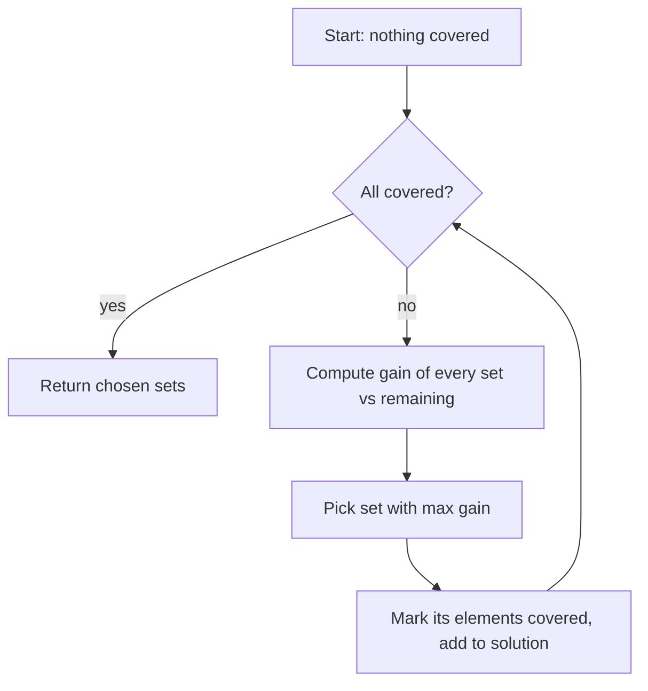

# Set Cover Approximation — Junior Level

> **One-line summary:** The **Set Cover** problem asks for the fewest sets (chosen from a given collection) whose union covers every element of a universe. Finding the true minimum is **NP-hard**, so we use a fast **greedy algorithm**: repeatedly pick the set that covers the most *still-uncovered* elements. This greedy approach is guaranteed to use at most `H(n) = 1 + 1/2 + 1/3 + … + 1/n ≈ ln(n) + 1` times the optimal number of sets — and that is essentially the best any polynomial algorithm can do unless P = NP.

---

## Table of Contents

1. [Introduction](#introduction)
2. [Prerequisites](#prerequisites)
3. [Glossary](#glossary)
4. [Core Concepts](#core-concepts)
5. [Big-O Summary](#big-o-summary)
6. [Real-World Analogies](#real-world-analogies)
7. [Pros & Cons](#pros--cons)
8. [Step-by-Step Walkthrough](#step-by-step-walkthrough)
9. [Code Examples](#code-examples)
10. [Coding Patterns](#coding-patterns)
11. [Error Handling](#error-handling)
12. [Performance Tips](#performance-tips)
13. [Best Practices](#best-practices)
14. [Edge Cases & Pitfalls](#edge-cases--pitfalls)
15. [Common Mistakes](#common-mistakes)
16. [Cheat Sheet](#cheat-sheet)
17. [Visual Animation](#visual-animation)
18. [Summary](#summary)
19. [Further Reading](#further-reading)

---

## Introduction

Suppose you are running a vaccination campaign. You have a list of `n` neighborhoods that must all be reached, and a list of candidate clinics — each clinic, once opened, serves a *specific subset* of those neighborhoods. Opening a clinic costs money, so you want to open **as few clinics as possible** while still reaching **every** neighborhood. Which clinics do you open?

This is the **Set Cover** problem, one of the most famous problems in computer science. Formally:

- You are given a **universe** `U = {1, 2, …, n}` of elements that must all be covered.
- You are given a collection of **sets** `S₁, S₂, …, S_m`, each a subset of `U`.
- You must choose a **sub-collection** of these sets whose **union equals `U`** (covers everything).
- The goal is to **minimize the number of sets** you choose.

The obvious approach is to try every possible sub-collection and keep the smallest one that covers `U`. That works for 5 sets. It explodes immediately afterward: with `m` sets there are `2^m` sub-collections, so even `m = 60` is already `2^60 ≈ 10^18` — hopeless. Worse, **no fast (polynomial-time) algorithm is known to find the exact minimum**, and there is strong evidence none exists: Set Cover is **NP-hard**.

So we change the question from "what is the *perfect* answer?" to "what is a *provably good* answer I can compute *quickly*?" The answer is the **greedy algorithm**:

> **Repeat until everything is covered:** pick the set that covers the **largest number of still-uncovered elements**, add it to the solution, and mark those elements as covered.

This is astonishingly simple, runs fast, and — this is the magic — comes with a **mathematical guarantee**: it never uses more than about `ln(n) + 1` times the optimal number of sets. For a universe of a million elements, `ln(1,000,000) ≈ 13.8`, so the greedy answer is at worst ~14× the optimum, and in practice usually far closer. This `H(n) = ln(n) + 1` bound is the heart of this topic, and remarkably it is **the best possible** ratio for any efficient algorithm (a deep result by Feige proved in `professional.md`).

---

## Prerequisites

Before reading this file you should be comfortable with:

- **Sets** — what a set is, union (`∪`), intersection (`∩`), subset (`⊆`), and set membership.
- **Arrays / lists / hash sets** — basic collections and how to test membership in `O(1)` with a hash set or boolean array.
- **Loops and counting** — iterating over a collection and counting matches.
- **Big-O notation** — `O(n)`, `O(m·n)`, and what "polynomial" vs "exponential" means.
- **The idea of "optimal"** — the best possible answer to a minimization problem (here, the fewest sets).

Optional but helpful:

- **The harmonic number** `H(n) = 1 + 1/2 + … + 1/n`, and the fact that `H(n) ≈ ln(n) + 0.577`.
- A first encounter with **NP-hardness** — "no known polynomial algorithm finds the exact answer."
- **Greedy algorithms** generally (the sibling topics in `14-greedy-algorithms`) — making the locally best choice at each step.

---

## Glossary

| Term | Meaning |
|------|---------|
| **Universe `U`** | The set of all `n` elements that must be covered. |
| **Set / subset `Sᵢ`** | One of the `m` available sets; a subset of the universe. |
| **Cover** | A sub-collection of sets whose union equals `U` (covers every element). |
| **Set Cover problem** | Find a cover using the **fewest** sets. |
| **OPT** | The size of the optimal (minimum) cover — the best possible answer. |
| **Greedy algorithm** | Repeatedly pick the set covering the most still-uncovered elements. |
| **Coverage / gain** | The number of *currently uncovered* elements a set would newly cover. |
| **Approximation ratio** | (greedy answer) / OPT — how much worse than optimal the algorithm can be. |
| **`H(n)`** | The `n`-th harmonic number `1 + 1/2 + … + 1/n ≈ ln(n) + 1`; the greedy ratio. |
| **NP-hard** | A class of problems with no known polynomial-time exact algorithm (and likely none). |
| **Weighted set cover** | Each set has a cost; minimize *total cost* instead of *count* (see `middle.md`). |
| **Feasible** | A cover exists at all (the union of *all* sets equals `U`). |

---

## Core Concepts

### 1. The Problem: Minimum Set Cover

You have a universe `U = {1, …, n}` and sets `S₁, …, S_m ⊆ U`. A **cover** is any group of sets whose union is `U`. The **minimum set cover** is a cover using the fewest sets. Its size is called **OPT**.

A quick feasibility note: a cover exists **if and only if** the union of *all* the sets equals `U`. If some element belongs to no set, the problem is unsolvable — that element can never be covered.

### 2. Why It Is Hard

The number of ways to choose a sub-collection of `m` sets is `2^m`. Checking each one for coverage is `O(n)`, so brute force is `O(2^m · n)` — exponential. For `m = 40` that is already a trillion sub-collections. And Set Cover is **NP-hard**: it is one of Karp's original 21 NP-complete problems (in its decision form). No one knows a polynomial-time algorithm that always finds OPT, and most computer scientists believe none exists. So we settle for a *good approximation*.

### 3. The Greedy Idea

The greedy algorithm is the natural human strategy: **at each step, grab the set that helps the most right now.**

> **Greedy Set Cover.**
> 1. Start with nothing covered.
> 2. While some element is still uncovered:
>    - Among all sets, find the one that covers the **most still-uncovered** elements.
>    - Add it to your solution; mark its elements covered.
> 3. Return the chosen sets.

The crucial detail is **"still-uncovered."** A set's value *shrinks* as the algorithm proceeds, because elements it shares with already-chosen sets no longer count. So the same set can look great early and useless later.

### 4. The Approximation Guarantee

Greedy is not always optimal — sometimes it uses more sets than OPT. But it is never *much* worse. The theorem:

> **Greedy uses at most `H(n) = 1 + 1/2 + … + 1/n` times OPT sets**, where `n = |U|`.

Since `H(n) ≈ ln(n) + 1`, the answer is at most about `ln(n) + 1` times optimal. The intuition (full proof in `professional.md`): when greedy picks a set, OPT could cover all the *remaining* `r` uncovered elements with at most OPT sets, so *some* available set covers at least `r/OPT` of them. Greedy picks at least that good a set, so the uncovered count shrinks by a factor each round, and the "charge" each element pays sums to at most `H(n)`.

### 5. Essentially Optimal

You might hope a cleverer polynomial algorithm beats `ln(n)`. It cannot (much): **Feige (1998)** proved that, unless P = NP, **no polynomial algorithm achieves a ratio better than `(1 − o(1))·ln(n)`.** So greedy's `ln(n) + 1` is, up to lower-order terms, the **best possible**. That is why this simple algorithm is the canonical method — it is not just easy, it is provably near-optimal among all efficient algorithms.

---

## Big-O Summary

| Step | Time | Space | Notes |
|------|------|-------|-------|
| Compute one set's current gain | `O(set size)` | `O(1)` | Count uncovered elements in the set. |
| One greedy round (scan all sets) | `O(Σ\|Sᵢ\|)` = `O(total size)` | — | Recompute gains, pick the max. |
| Number of rounds | `≤ m` and `≤ n` | — | At least one new element covered per round. |
| **Greedy total (simple)** | **`O(m·n)`** roughly, or `O(rounds · total size)` | `O(n + total size)` | Dominant cost; scales well. |
| With a priority queue (lazy) | `O(total size · log m)` | `O(m)` | See `senior.md` for the scalable version. |
| Brute-force exact (for comparison) | `O(2^m · n)` | `O(n)` | Exponential — only for tiny instances / testing. |

The point of greedy: replace an exponential search with a near-linear-per-round scan that delivers a provably good answer.

---

## Real-World Analogies

| Concept | Analogy |
|---------|---------|
| Universe `U` | All the neighborhoods that must receive service. |
| Sets `Sᵢ` | Candidate clinics, each serving a fixed group of neighborhoods. |
| Minimum cover | The fewest clinics that together reach every neighborhood. |
| Greedy "pick the biggest gain" | Open the clinic that reaches the most *not-yet-served* neighborhoods next. |
| Coverage shrinking each round | A clinic that overlaps already-served areas adds little new value. |
| `H(n) ≈ ln(n) + 1` ratio | "You will never open more than about `ln(n)+1` times the ideal number of clinics." |
| NP-hardness | "Finding the perfect plan is computationally hopeless at scale, so we accept a provably-good plan." |
| Weighted version | Clinics cost different amounts; minimize total budget, not just count. |

Where the analogy breaks: in real campaigns the subsets and costs are messy and uncertain; the clean theorem assumes the sets are given exactly and fixed. The guarantee is about the *worst case*, and real data is usually much friendlier than the worst case.

---

## Pros & Cons

| Pros | Cons |
|------|------|
| Dead simple to implement and explain. | Does **not** find the true minimum (NP-hard). |
| Fast — roughly `O(m·n)`, scales to large inputs. | The `ln(n)+1` ratio is a worst case; pathological inputs really do hit it. |
| Comes with a **provable** `H(n) = ln(n)+1` guarantee. | Greedy choices are irrevocable — no backtracking. |
| That guarantee is essentially **optimal** (Feige). | Recomputing gains naively each round can be wasteful (fix: priority queue). |
| Extends naturally to **weighted** set cover. | Ties (multiple sets with equal gain) are broken arbitrarily; the choice can matter. |
| Works as a building block for many real systems (sensors, features, ads). | Needs the instance to be **feasible** (union of all sets = `U`). |

**When to use:** any "cover everything with as few/as-cheap resources as possible" problem at scale — sensor placement, feature selection, ad targeting, facility location, test-suite minimization.

**When NOT to use:** when `m` is tiny enough for exact search (ILP / brute force) and you truly need OPT; or when the structure is special (intervals on a line, for example) and an exact polynomial algorithm exists.

---

## Step-by-Step Walkthrough

Let the universe be `U = {1, 2, 3, 4, 5}` and the available sets be:

```
S0 = {1, 2, 3}
S1 = {2, 4}
S2 = {3, 4}
S3 = {4, 5}
S4 = {5}
```

We want the fewest sets whose union is `{1,2,3,4,5}`.

**Round 1 — nothing covered yet.** Count how many uncovered elements each set covers:

```
S0 covers {1,2,3} → 3   ← largest
S1 covers {2,4}   → 2
S2 covers {3,4}   → 2
S3 covers {4,5}   → 2
S4 covers {5}     → 1
```

Greedy picks **S0** (gain 3). Covered = `{1,2,3}`. Remaining = `{4,5}`.

**Round 2 — covered `{1,2,3}`.** Recount gains against the *remaining* `{4,5}`:

```
S0 → 0   (all of {1,2,3} already covered)
S1 → 1   (only 4 is new)
S2 → 1   (only 4 is new)
S3 → 2   (4 and 5 both new)   ← largest
S4 → 1   (5 is new)
```

Greedy picks **S3** (gain 2). Covered = `{1,2,3,4,5}`. Remaining = `{}`.

**Done.** Greedy returns `{S0, S3}` — **2 sets**. That is also the true optimum here (you cannot cover 5 elements with one of these sets), so greedy is optimal on this instance.

**Watch the gain shrink.** Notice S3 was worth 2 in round 1 and *still* 2 in round 2 (its elements 4,5 were untouched), while S0 dropped from 3 to 0. This re-evaluation against the *remaining* set is the entire algorithm — get it wrong (use original sizes) and you get wrong answers.

**A trickier instance (where greedy is NOT optimal).** A classic bad case: `U = {1,…,2^k − 1-ish}` with two "halving" sets that perfectly cover `U` in 2 sets, plus a chain of sets that each cover the largest remaining half, luring greedy into `≈ log₂ n` picks. These constructions are exactly what make the `ln n` ratio tight — we explore one in the tasks.

---

## Code Examples

### Example: Greedy Set Cover

We implement the greedy algorithm: represent covered elements in a boolean array (or hash set), and in each round scan every set to find the one with the largest count of still-uncovered elements. All three programs print the chosen set indices and confirm the universe is fully covered.

#### Go

```go
package main

import "fmt"

// greedySetCover returns the indices of chosen sets that cover the universe
// {0, 1, ..., n-1}. Each set is a slice of element ids in [0, n).
func greedySetCover(n int, sets [][]int) []int {
	covered := make([]bool, n)
	numCovered := 0
	var chosen []int

	for numCovered < n {
		best := -1
		bestGain := 0
		// Find the set covering the most still-uncovered elements.
		for i, s := range sets {
			gain := 0
			for _, e := range s {
				if !covered[e] {
					gain++
				}
			}
			if gain > bestGain {
				bestGain = gain
				best = i
			}
		}
		if best == -1 || bestGain == 0 {
			break // no progress possible -> infeasible
		}
		chosen = append(chosen, best)
		for _, e := range sets[best] {
			if !covered[e] {
				covered[e] = true
				numCovered++
			}
		}
	}
	return chosen
}

func main() {
	sets := [][]int{
		{0, 1, 2}, // S0 = {1,2,3} in 0-indexed
		{1, 3},    // S1 = {2,4}
		{2, 3},    // S2 = {3,4}
		{3, 4},    // S3 = {4,5}
		{4},       // S4 = {5}
	}
	chosen := greedySetCover(5, sets)
	fmt.Println("chosen sets:", chosen) // [0 3]
	fmt.Println("count:", len(chosen))  // 2
}
```

#### Java

```java
import java.util.*;

public class GreedySetCover {
    // Greedy minimum set cover over universe {0..n-1}.
    static List<Integer> greedySetCover(int n, int[][] sets) {
        boolean[] covered = new boolean[n];
        int numCovered = 0;
        List<Integer> chosen = new ArrayList<>();

        while (numCovered < n) {
            int best = -1, bestGain = 0;
            for (int i = 0; i < sets.length; i++) {
                int gain = 0;
                for (int e : sets[i])
                    if (!covered[e]) gain++;
                if (gain > bestGain) { bestGain = gain; best = i; }
            }
            if (best == -1 || bestGain == 0) break; // infeasible
            chosen.add(best);
            for (int e : sets[best]) {
                if (!covered[e]) { covered[e] = true; numCovered++; }
            }
        }
        return chosen;
    }

    public static void main(String[] args) {
        int[][] sets = {
            {0, 1, 2}, {1, 3}, {2, 3}, {3, 4}, {4}
        };
        List<Integer> chosen = greedySetCover(5, sets);
        System.out.println("chosen sets: " + chosen); // [0, 3]
        System.out.println("count: " + chosen.size()); // 2
    }
}
```

#### Python

```python
def greedy_set_cover(n, sets):
    """Greedy minimum set cover over the universe {0, 1, ..., n-1}.
    Each set is a collection of element ids in [0, n). Returns chosen indices."""
    covered = [False] * n
    num_covered = 0
    chosen = []

    while num_covered < n:
        best, best_gain = -1, 0
        for i, s in enumerate(sets):
            gain = sum(1 for e in s if not covered[e])
            if gain > best_gain:
                best_gain, best = gain, i
        if best == -1 or best_gain == 0:
            break  # no progress -> infeasible
        chosen.append(best)
        for e in sets[best]:
            if not covered[e]:
                covered[e] = True
                num_covered += 1
    return chosen


if __name__ == "__main__":
    sets = [
        [0, 1, 2],  # S0 = {1,2,3}
        [1, 3],     # S1 = {2,4}
        [2, 3],     # S2 = {3,4}
        [3, 4],     # S3 = {4,5}
        [4],        # S4 = {5}
    ]
    chosen = greedy_set_cover(5, sets)
    print("chosen sets:", chosen)  # [0, 3]
    print("count:", len(chosen))   # 2
```

**What it does:** repeatedly scans all sets, picks the one with the most still-uncovered elements, and marks those elements covered until the whole universe is covered.
**Run:** `go run main.go` | `javac GreedySetCover.java && java GreedySetCover` | `python greedy.py`

---

## Coding Patterns

### Pattern 1: Track Coverage with a Boolean Array

**Intent:** Membership tests must be `O(1)`. A boolean array indexed by element id is the simplest fast "covered" tracker.

```python
covered = [False] * n
num_covered = 0

def mark(s):
    global num_covered
    for e in s:
        if not covered[e]:
            covered[e] = True
            num_covered += 1
```

Keep a running `num_covered` counter so the loop condition is `O(1)` instead of re-scanning the array each round.

### Pattern 2: Recompute Gain Against the *Remaining* Universe

**Intent:** A set's value is how many *currently uncovered* elements it has — not its original size. Recompute every round.

```python
def gain(s, covered):
    return sum(1 for e in s if not covered[e])
```

Using the original `len(s)` instead of the live gain is the single most common bug in this algorithm.

### Pattern 3: Pick the Argmax Each Round

**Intent:** Among all sets, choose the one with the largest gain; break ties arbitrarily (e.g. smallest index).

```python
best, best_gain = -1, 0
for i, s in enumerate(sets):
    g = gain(s, covered)
    if g > best_gain:
        best_gain, best = g, i
```



---

## Error Handling

| Error | Cause | Fix |
|-------|-------|-----|
| Loop never ends | Every remaining set has gain 0 (an element is in no set) → the instance is infeasible. | Break when `bestGain == 0` and report "no cover exists." |
| Wrong (too many) sets chosen | Using original set sizes instead of live gain. | Recompute gain against `covered` every round. |
| Index out of range | Element ids not in `[0, n)`, or `n` set too small. | Validate inputs; remap element ids to a contiguous `[0, n)` range. |
| Same set chosen twice | A picked set still has gain because its elements were not all marked. | Mark *every* element of the chosen set covered before the next round. |
| Off-by-one in "all covered" check | Comparing `numCovered` against the wrong total. | Maintain `numCovered` precisely and compare to `n`. |
| Empty result on a valid instance | Returned before the loop, or `bestGain` initialized wrong. | Initialize `bestGain = 0` and only `break` when no positive-gain set exists. |

---

## Performance Tips

- **Use a boolean array, not a hash set, when element ids are dense in `[0, n)`.** Array access is faster and cache-friendly; a hash set is only better when ids are sparse.
- **Keep a `numCovered` counter** so the termination test is `O(1)` rather than scanning the covered array each round.
- **Store sets as lists of ids** (or bitsets for small universes) so gain counting is a tight loop.
- **Stop early** the moment `numCovered == n`; do not run an extra empty round.
- **For repeated queries on the same sets**, precompute set sizes and consider the priority-queue ("lazy greedy") version in `senior.md` to avoid rescanning every set every round.
- **Bitset trick (small `n`):** represent each set and the covered mask as an integer; `gain = popcount(setMask & ~coveredMask)` computes the gain in a few machine instructions.

---

## Best Practices

- Write a **brute-force exact** solver first (try all `2^m` sub-collections) and test greedy against it on tiny instances — it catches gain and marking bugs instantly.
- Always **check feasibility** up front: the union of all sets must equal `U`, or no cover exists.
- **Recompute gain against the remaining universe** every round; never reuse original sizes.
- Decide and document a **deterministic tie-break** (e.g. smallest index) so results are reproducible.
- Report **both** the chosen sets and a confirmation that they cover `U` — never trust the loop blindly.
- For large inputs, measure before optimizing: the simple `O(m·n)` version is often fine; reach for the priority queue only when profiling says so.

---

## Edge Cases & Pitfalls

- **Infeasible instance** — some element belongs to no set; no cover exists. Detect via `bestGain == 0` while elements remain, and report it.
- **Empty universe (`n = 0`)** — already covered; return an empty solution.
- **A set equal to the whole universe** — greedy picks it first and finishes in one round (and that is optimal).
- **Duplicate / nested sets** — a set contained in another never gets picked once the larger one is chosen; harmless but wasteful to keep.
- **Ties in gain** — multiple sets with equal gain; the tie-break can change the answer (and the ratio). Make it deterministic.
- **Using original size, not live gain** — the #1 correctness bug; produces covers that are wrong or larger than necessary.
- **Greedy ≠ optimal** — do not claim the greedy answer is the minimum; it is a guaranteed *approximation*.

---

## Common Mistakes

1. **Counting a set's *original* size instead of its *current* gain** — the algorithm must re-evaluate against the uncovered elements each round.
2. **Forgetting to mark all of a chosen set's elements covered** — leaves the same set looking valuable and risks infinite loops.
3. **Not handling infeasibility** — looping forever when an element is uncoverable.
4. **Claiming optimality** — greedy approximates; it does not generally find OPT.
5. **Re-scanning the covered array to count coverage** — wasteful; keep a running counter.
6. **Non-deterministic tie-breaking** — makes results irreproducible and tests flaky.
7. **Confusing maximize-coverage-with-k-sets (a different problem) with minimize-sets-to-cover-all** — they are related but distinct; this topic is the latter.

---

## Cheat Sheet

| Step | Operation |
|------|-----------|
| 1. Init | `covered[] = false`, `numCovered = 0`, `chosen = []`. |
| 2. Loop | While `numCovered < n`: compute each set's **gain** = uncovered elements it contains. |
| 3. Pick | Choose the set with **max gain** (deterministic tie-break). |
| 4. Mark | Add it to `chosen`; mark its elements covered; update `numCovered`. |
| 5. Stop | When `numCovered == n` (success) or max gain is `0` with elements left (infeasible). |

Key facts:

```
Problem:        cover universe U with the fewest given sets   (NP-hard)
Greedy rule:    pick the set covering the most STILL-UNCOVERED elements
Guarantee:      greedy ≤ H(n) · OPT,   H(n) = 1 + 1/2 + ... + 1/n ≈ ln(n) + 1
Optimality:     no poly algo beats (1 - o(1))·ln(n)  unless P = NP   (Feige)
Time:           ~O(m·n) simple;  O(total size · log m) with a priority queue
Feasible iff:   union of all sets = U
```

Tiny verified examples:

```
U={1..5}, sets {123},{24},{34},{45},{5}   → greedy {S0,S3} = 2 sets (optimal)
A single set = U                          → 1 set
n elements, n singletons                  → n sets (forced)
```

---

## Visual Animation

> See [`animation.html`](./animation.html) for an interactive visualization of greedy Set Cover.
>
> The animation demonstrates:
> - A universe of elements and a palette of candidate sets
> - Each round, the **gain** of every set highlighted, and the **max-gain** set chosen
> - Coverage growing as chosen sets fill in the universe
> - A running count of chosen sets vs the universe size
> - A comparison against the brute-force optimum for tiny instances, so you can see when greedy matches OPT and when it overshoots

---

## Summary

Set Cover asks for the fewest given sets whose union covers a universe — a fundamental, **NP-hard** optimization problem. Because exact minimization is intractable, we use the **greedy algorithm**: repeatedly pick the set that covers the most *still-uncovered* elements. It is trivially simple, runs in roughly `O(m·n)`, and — the key result — is guaranteed to use at most `H(n) = ln(n) + 1` times the optimal number of sets. That bound is essentially the best any polynomial algorithm can achieve (Feige's `ln n` lower bound, unless P = NP), which is why greedy is the canonical method. The one detail that makes or breaks an implementation is recomputing each set's value as the number of *currently uncovered* elements every round. Master "pick the biggest current gain, mark, repeat," and you have mastered the junior-level core.

---

## Further Reading

- Vazirani, *Approximation Algorithms*, Ch. 2 — greedy Set Cover and the `H(n)` analysis.
- Williamson & Shmoys, *The Design of Approximation Algorithms*, Ch. 1 — Set Cover as the canonical example.
- Cormen et al., *Introduction to Algorithms* (CLRS), §35.3 — the greedy set-cover approximation.
- U. Feige (1998), "A threshold of ln n for approximating set cover" — the matching lower bound.
- Sibling topic `14-greedy-algorithms` overview — greedy choice and exchange arguments.
- Sibling topic on Vertex Cover / LP rounding — related covering problems and rounding techniques.
</content>
</invoke>
