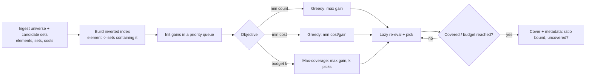
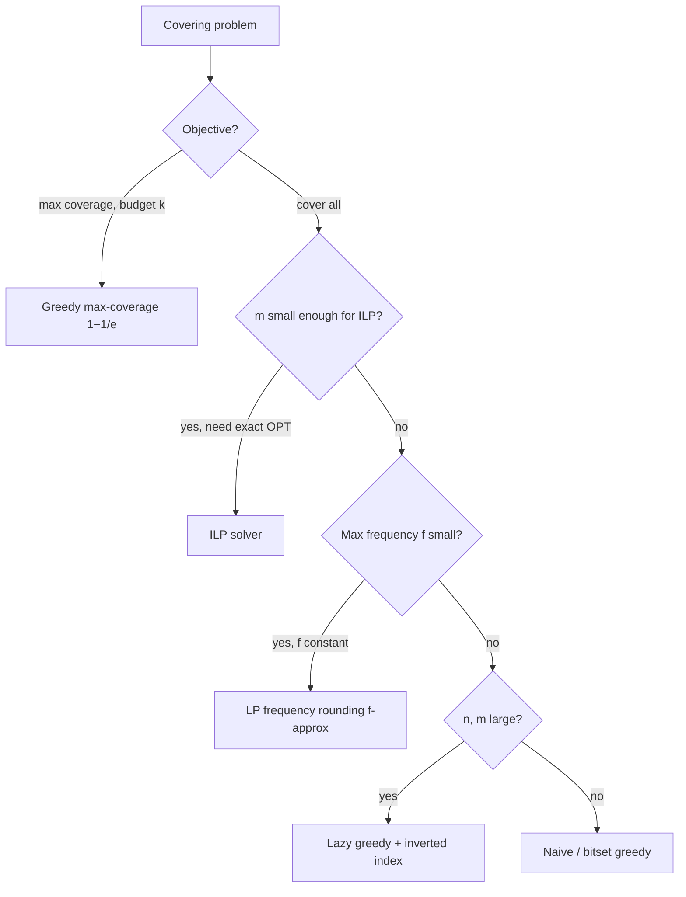

# Set Cover Approximation — Senior Level

> At the senior level greedy Set Cover stops being "pick the biggest set" and becomes a workhorse embedded in real systems — sensor placement, feature selection, ad/virus targeting, facility location, test-suite minimization — where the real engineering is in *scaling the greedy loop* (lazy evaluation with priority queues, inverted indices, bitsets), *choosing the objective* (count vs cost vs coverage-under-budget), and *making an `O(total · log m)` kernel survive at production scale*.

## Table of Contents
1. [Introduction](#1-introduction)
2. [Real Applications](#2-real-applications)
3. [System Design with Greedy Set Cover](#3-system-design-with-greedy-set-cover)
4. [Scaling the Greedy Loop: Priority Queues, Inverted Indices, Bitsets](#4-scaling-the-greedy-loop-priority-queues-inverted-indices-bitsets)
5. [Lazy Greedy and Submodularity](#5-lazy-greedy-and-submodularity)
6. [Concurrency and Parallelism](#6-concurrency-and-parallelism)
7. [Comparison with Alternatives at Scale](#7-comparison-with-alternatives-at-scale)
8. [Architecture Patterns](#8-architecture-patterns)
9. [Code: Production-Grade Lazy-Greedy Kernel](#9-code-production-grade-lazy-greedy-kernel)
10. [Observability](#10-observability)
11. [Failure Modes](#11-failure-modes)
12. [Capacity Planning](#12-capacity-planning)
13. [Summary](#13-summary)

---

## 1. Introduction

A senior engineer rarely "solves set cover" as a toy. The greedy algorithm shows up embedded in real systems whenever the question is *"select the fewest / cheapest resources so that everything is covered."* The senior decisions are not "how does greedy work" but:

1. Which **objective** does this workload need — minimize *count* (set cover), minimize *cost* (weighted), or maximize *coverage under a budget of `k`* (max-coverage, `1−1/e`)?
2. How do I keep the greedy loop **fast** when there are millions of elements and sets — avoid rescanning every set every round?
3. How do I **scale** it — inverted indices, lazy evaluation, bitsets, partitioning?
4. How do I **observe** it so a degraded cover (too many sets, an uncovered element) does not silently ship?

The algorithm is fixed and simple; the engineering is in the data structures and the objective.

---

## 2. Real Applications

Greedy set cover (and its max-coverage twin) is one of the most widely deployed approximation algorithms in industry. Concrete examples:

- **Sensor / monitor placement.** Universe = locations (or events) to observe; each candidate sensor covers the subset it can sense. Greedy picks the fewest sensors covering all locations — used in environmental monitoring, network tap placement, and observability (which log sources cover all failure modes). The **budgeted** variant ("best coverage with `k` sensors") is max-coverage with the `1−1/e` guarantee.

- **Feature selection (ML).** Universe = training examples (or "concepts" each feature can distinguish); each feature "covers" the examples it correctly classifies or the variance it explains. Greedy selects a small, informative feature subset — a submodular-maximization formulation closely related to set cover. Coverage's diminishing returns (submodularity) is exactly why greedy is principled here.

- **Influence / virus / ad targeting.** Universe = users to reach; each seed (influencer, ad placement) covers the users it would influence. Greedy max-coverage picks `k` seeds maximizing reach — the foundational result of Kempe–Kleinberg–Tardos on influence maximization, a submodular-coverage problem with the `1−1/e` bound. Ad campaigns minimize placements to cover an audience (set cover) or maximize reach under budget (max coverage).

- **Facility location (uncapacitated).** Universe = customers to serve; each candidate facility covers the customers within range, at an opening cost. **Weighted** greedy (cost per newly covered customer) gives an `H(n)` solution; LP-rounding and primal-dual give constant-factor variants for the metric case.

- **Test-suite minimization / data deduplication.** Universe = code lines or requirements to exercise; each test covers a subset. Greedy finds a minimal test set retaining full coverage — standard in CI pipelines. Similarly, document/shingle deduplication picks a minimal covering set of representatives.

- **IP routing / rule compaction, antivirus signature selection, gene/probe selection in bioinformatics** — all are set cover or max coverage under the hood.

The recurring shape: **a universe to cover, candidate resources with subsets, a budget or a "cover everything" goal.** Recognizing it lets you reach for a 30-line greedy with a provable `ln n` (or `1−1/e`) guarantee instead of an ad-hoc heuristic.

---

## 3. System Design with Greedy Set Cover

### 3.1 Where the kernel sits



The inverted index (element → sets containing it) is the key structure: when a set is chosen, only the sets that *share an element* with it have their gain changed, so we touch a fraction of all sets per round instead of all of them.

### 3.2 Three deployment tiers

| Tier | Scale | Structure | Latency | When right |
|------|-------|-----------|---------|-----------|
| Inline library | `n, m ≤ ~10⁴` | naive scan or bitset | sub-ms to ms | Embedded in a request handler; small cover. |
| Batch service | `n, m ≤ ~10⁷` | inverted index + lazy PQ | seconds | Sensor/feature/test selection on medium data. |
| Distributed job | `n, m ≥ 10⁸` | partitioned / streaming greedy | minutes to hours | Influence maximization, web-scale dedup; approximate greedy across shards. |

The most common senior mistake is shipping the **naive `O(m·n)` rescan** into a service where `m` and `n` are large — it works on the demo and times out in production. The fix is the inverted index plus lazy evaluation.

---

## 4. Scaling the Greedy Loop: Priority Queues, Inverted Indices, Bitsets

The naive loop recomputes **every** set's gain **every** round: `O(rounds · Σ|Sᵢ|)`. Three structures eliminate the waste.

### 4.1 Inverted index (element → sets)

Precompute, for each element `e`, the list of sets containing it. When a set `Sⱼ` is chosen and an element `e ∈ Sⱼ` becomes newly covered, only the sets in `index[e]` lose one unit of gain. So a round's gain-update cost is proportional to `Σ_{e newly covered} |index[e]|` — the total work across the whole run is `O(Σ over all (element, set) incidences)` = `O(total input size)`, independent of the number of rounds. This is the single biggest speedup.

### 4.2 Priority queue on gains

Keep sets in a max-heap (or min-heap on `cost/gain`) keyed by current gain. Pop the top, pick it, and **decrement** the gains of affected sets via the inverted index, updating the heap. With lazy deletion (below) you avoid expensive decrease-key operations.

### 4.3 Bitsets

For universes up to a few hundred thousand, represent each set and the "covered" mask as bit arrays. Then:

```
gain(Sᵢ) = popcount(setBits[i] AND NOT coveredBits)
```

is a handful of word operations — 64 elements per instruction. Bitset greedy is often 10–50× faster than element-by-element loops and is the right call whenever the universe fits comfortably in memory as bits (`n/8` bytes per set).

### 4.4 Streaming / one-pass variants

When sets arrive as a stream and cannot all be stored, **streaming set cover** keeps a partial solution and admits a set only if its marginal gain clears a threshold, achieving `O(log n)`-style guarantees with bounded memory — relevant for web-scale dedup and log coverage.

---

## 5. Lazy Greedy and Submodularity

The coverage function is **monotone submodular**: adding a set never decreases total coverage (monotone), and a set's marginal gain only *shrinks* as more sets are chosen (diminishing returns / submodular). This property powers the **lazy greedy** (a.k.a. CELF) optimization:

> **Lazy greedy.** Keep each set's gain in a max-heap, tagged with the round it was last computed. Pop the top. If its tag is current, it is genuinely the best — pick it. Otherwise its stored gain is *stale and an upper bound* (gains only shrink), so recompute it, reinsert, and pop again.

Because gains only decrease, a set whose *stale* gain is already below the current best can be skipped entirely — it can never become the maximum. In practice lazy greedy re-evaluates a tiny fraction of sets per round, turning the naive `O(m)` per round into near-`O(log m)` amortized. This is the standard production technique for large submodular maximization (influence, sensor placement, feature selection) and is **exact** — it returns the same cover as eager greedy, just faster. The `1−1/e` (max-coverage) and `H(n)` (set cover) guarantees are preserved because the chosen sequence is identical.

---

### 5.1 Worked case study — sensor placement at scale

Concretely, suppose an observability team must place log/metric collectors so that **every** one of `n = 200,000` failure signatures is covered by at least one of `m = 50,000` candidate collectors, each collector covering the subset of signatures it can observe, with `~5,000,000` total (signature, collector) incidences.

- **Naive greedy** rescans all `50,000` collectors each round; with up to a few hundred rounds that is `~50,000 × few-hundred` gain recomputations over `5M` incidences — minutes, and it grows with the number of rounds.
- **Inverted-index lazy greedy** touches each incidence a constant number of times: total gain-update work `~5M`, plus heap operations `~O(5M log 50,000)` — **sub-second to a few seconds** on one core. Memory is `~5M` ints for sets + `~5M` for the index + `200K` covered bits ≈ tens of MB.
- **The objective decision.** If the team instead has a *budget* of `k = 30` collectors and wants to maximize coverage, this is max-coverage: greedy's `1 − 1/e` guarantee says the chosen 30 cover at least 63% of what the *best possible* 30 would. That is a concrete, defensible SLA: "with 30 collectors we provably cover ≥ 63% of the optimum's reach."

The senior takeaway from this instance: the **algorithm** is identical to the 30-line textbook greedy; the **data structure** (inverted index + lazy heap) is what turns a multi-minute job into a sub-second one, and the **objective** (`cover-all H(n)` vs `budget-k 1−1/e`) is a product decision that changes the guarantee you can promise.

### 5.2 Feature selection as submodular coverage

A second common deployment: selecting `k` features for a model. Frame each feature as "covering" the training examples it correctly classifies (or the units of explained variance / mutual information it contributes). The coverage/utility function is monotone submodular, so greedy picks the `k` most marginally-useful features and achieves `1 − 1/e` of the best `k`-feature utility. Lazy greedy (CELF) is essential here because evaluating a feature's marginal gain (retraining or computing mutual information) is *expensive* — lazy evaluation skips most re-evaluations, often cutting the number of expensive gain computations by `10–700×` in practice. This is the same kernel as sensor placement, with a costlier gain oracle.

---

## 6. Concurrency and Parallelism

Greedy is inherently **sequential** — each pick depends on the previous one (the gains change). Parallelism comes at three levels:

1. **Parallel gain evaluation within a round.** Computing the gain of all candidate sets is embarrassingly parallel; fan the `O(m)` (or the affected subset) gain computations across cores, then reduce to the argmax. Highest-leverage parallelism for a single large instance.

2. **Across requests.** A selection service handles many independent instances; a worker pool sized to `cores` saturates CPU. Each instance owns its covered-state, so no shared mutable state.

3. **Distributed/approximate greedy across shards.** For web scale, partition elements (or sets) across machines, run greedy locally, then merge — accepting a slightly worse ratio for horizontal scalability (the GREEDI / distributed-submodular framework). True sequential greedy does not parallelize across the *picks*, so the distributed versions trade a small guarantee loss for scale.

**Thread-safety rules:**

- The kernel must be **pure**: instance in, cover out, no shared caches mutated during a solve.
- The covered bitset/array is per-instance; never share it across threads working different instances.
- Lazy-greedy heaps are per-instance; if you parallelize gain evaluation, treat the heap as owned by the coordinating thread and only fan out the read-only gain computations.
- Determinism: fix the **tie-break** (smallest index) so results are reproducible across runs and machines — important for caching, audits, and reproducible CI test selection.

---

## 7. Comparison with Alternatives at Scale

| Goal | Greedy | Alternative | When the alternative wins |
|------|--------|-------------|---------------------------|
| Min sets to cover all (general) | `H(n)` greedy, `O(total·log m)` | ILP exact solver | Small `m`; you truly need OPT and can afford exponential worst case. |
| Min sets, low frequency `f` | `H(n)` greedy | LP frequency rounding | `f` small (vertex cover `f=2` → 2-approx beats `ln n`). |
| Min cost cover | weighted greedy `H(n)` | Primal-dual `f`-approx | Low frequency; want a dual certificate. |
| Max coverage with budget `k` | greedy `1−1/e` | (none better in poly time) | Never — `1−1/e` is tight unless P=NP. |
| Huge sequential instance | lazy greedy | distributed/streaming greedy | Data does not fit one machine; accept slight ratio loss. |
| Want a certified bound | (greedy has implicit dual) | LP relaxation `OPT_LP` | When you must *prove* near-optimality to a stakeholder. |

**Strategic rule:** if the instance is small enough for an **ILP** and you need the true optimum, use a solver (CBC, Gurobi). Otherwise greedy (lazy, with an inverted index) is the default; reach for LP rounding only when the **frequency is low** enough to beat `ln n`.

### 7.1 Decision flow for picking a method



This flow encodes the senior judgment: *max-coverage → `1−1/e` greedy; cover-all small → ILP; low frequency → LP rounding; large general → lazy greedy*. Wire it into the service's strategy selector so the slow naive path is never chosen for a large instance.

---

### 7.2 Cost models: count vs cost vs coverage-per-dollar

A subtle senior decision is *which ratio greedy optimizes*, because the same data supports three different business questions:

- **Minimize set count** (`max gain`): "fewest sensors/tests/clinics." Use when each resource costs roughly the same.
- **Minimize total cost** (`min cost/gain`): "cheapest plan." Use when resources have heterogeneous costs (a satellite link vs a fiber link).
- **Maximize coverage under budget `k`** (`max gain, k picks`): "best reach for the money we have." Use when the budget is fixed and full coverage is unaffordable or unnecessary.

Picking the wrong one is a *correctness-of-objective* bug that no unit test on the greedy loop will catch — the loop is right, the question is wrong. Make the objective explicit in the request schema and echo it in the response so consumers cannot silently assume the wrong one. A reliability team asking "cover everything cheaply" and getting a "max reach with k=10" answer is a real, hard-to-detect incident.

### 7.3 Budgeted (cost + cardinality) variants

Real instances sometimes combine a **budget** (total cost `≤ B`) with maximizing coverage — the *budgeted maximum coverage* problem. Plain greedy by gain can be arbitrarily bad here (it ignores cost), and plain greedy by gain/cost can also fail; the correct algorithm runs **both** greedy-by-ratio and greedy-by-single-best-affordable-set and takes the better, achieving `(1 − 1/e)` (Khuller–Moss–Naor). Knowing this guards against the trap of naively reusing the cover-all greedy when a budget constraint is present — a common production mistake when requirements shift from "cover all" to "cover as much as $X buys."

---

## 8. Architecture Patterns

### 8.1 Strategy pattern over objective

Encapsulate selection behind an interface with `MinCount`, `MinCost`, and `MaxCoverageK` implementations. The service picks the strategy from the request's objective. The inverted index, covered-state, and lazy heap are shared machinery; only the *scoring* differs (max gain vs min cost/gain vs max gain under a `k` budget).

### 8.2 Solution metadata / guarantee on the response

Every result carries metadata: the objective used, the number of sets/total cost, whether the universe is **fully covered** (and which elements are not, if infeasible), and the **guarantee** (`≤ H(n)·OPT` or `≥ (1−1/e)·OPT_coverage`). A consumer must never assume the cover is exactly optimal.

### 8.3 Caching by canonical instance hash

Greedy is deterministic in the instance (sets, costs, objective, tie-break), so cache on a canonical hash of the input. For dashboards that re-query the same topology (same sensors, same locations), this turns repeated solves into `O(1)`.

### 8.4 Incremental / online cover

When sets or elements change slightly (a new sensor, a removed location), recomputing from scratch is wasteful. Maintain the cover incrementally: a new high-gain set can be admitted; a removed set may force re-covering only its uniquely-covered elements. Full guarantees on incremental greedy are weaker, but the practical savings are large.

---

## 9. Code: Production-Grade Lazy-Greedy Kernel

A reusable kernel using an **inverted index** and **lazy greedy** (CELF) with a max-heap on gains. It re-evaluates only stale top candidates and updates affected gains via the index. All three print the chosen cover for the same instance (`[0, 3]`, fully covering `{0..4}`).

#### Go

```go
package main

import (
	"container/heap"
	"fmt"
)

type item struct {
	set   int
	gain  int
	stamp int // round when gain was computed
}
type maxHeap []item

func (h maxHeap) Len() int            { return len(h) }
func (h maxHeap) Less(i, j int) bool  { return h[i].gain > h[j].gain } // max-heap
func (h maxHeap) Swap(i, j int)       { h[i], h[j] = h[j], h[i] }
func (h *maxHeap) Push(x interface{}) { *h = append(*h, x.(item)) }
func (h *maxHeap) Pop() interface{} {
	old := *h
	n := len(old)
	it := old[n-1]
	*h = old[:n-1]
	return it
}

// lazyGreedySetCover covers {0..n-1} using an inverted index and lazy greedy.
func lazyGreedySetCover(n int, sets [][]int) []int {
	covered := make([]bool, n)
	numCovered := 0
	// inverted index: element -> sets containing it
	index := make([][]int, n)
	gain := make([]int, len(sets))
	for i, s := range sets {
		gain[i] = len(s)
		for _, e := range s {
			index[e] = append(index[e], i)
		}
	}
	h := &maxHeap{}
	for i := range sets {
		if gain[i] > 0 {
			heap.Push(h, item{set: i, gain: gain[i], stamp: 0})
		}
	}
	round := 0
	var chosen []int
	for numCovered < n && h.Len() > 0 {
		top := heap.Pop(h).(item)
		if top.gain != gain[top.set] { // stale -> refresh and reinsert
			top.gain = gain[top.set]
			if top.gain > 0 {
				heap.Push(h, top)
			}
			continue
		}
		if top.gain == 0 {
			break // no progress possible -> infeasible
		}
		// pick this set
		round++
		chosen = append(chosen, top.set)
		for _, e := range sets[top.set] {
			if !covered[e] {
				covered[e] = true
				numCovered++
				for _, j := range index[e] { // affected sets lose a unit of gain
					gain[j]--
				}
			}
		}
	}
	return chosen
}

func main() {
	sets := [][]int{{0, 1, 2}, {1, 3}, {2, 3}, {3, 4}, {4}}
	fmt.Println("chosen:", lazyGreedySetCover(5, sets)) // [0 3]
}
```

#### Java

```java
import java.util.*;

public class LazyGreedy {
    // Lazy greedy set cover with an inverted index. Returns chosen set indices.
    static List<Integer> cover(int n, int[][] sets) {
        boolean[] covered = new boolean[n];
        int numCovered = 0;
        List<List<Integer>> index = new ArrayList<>();
        for (int e = 0; e < n; e++) index.add(new ArrayList<>());
        int[] gain = new int[sets.length];
        for (int i = 0; i < sets.length; i++) {
            gain[i] = sets[i].length;
            for (int e : sets[i]) index.get(e).add(i);
        }
        // max-heap of (gain, set); we store gain snapshot and validate against live gain
        PriorityQueue<int[]> pq = new PriorityQueue<>((a, b) -> b[0] - a[0]);
        for (int i = 0; i < sets.length; i++)
            if (gain[i] > 0) pq.add(new int[]{gain[i], i});

        List<Integer> chosen = new ArrayList<>();
        while (numCovered < n && !pq.isEmpty()) {
            int[] top = pq.poll();
            int s = top[1];
            if (top[0] != gain[s]) {        // stale -> refresh
                if (gain[s] > 0) pq.add(new int[]{gain[s], s});
                continue;
            }
            if (gain[s] == 0) break;        // infeasible
            chosen.add(s);
            for (int e : sets[s]) {
                if (!covered[e]) {
                    covered[e] = true; numCovered++;
                    for (int j : index.get(e)) gain[j]--;
                }
            }
        }
        return chosen;
    }

    public static void main(String[] args) {
        int[][] sets = {{0, 1, 2}, {1, 3}, {2, 3}, {3, 4}, {4}};
        System.out.println("chosen: " + cover(5, sets)); // [0, 3]
    }
}
```

#### Python

```python
import heapq

def lazy_greedy_set_cover(n, sets):
    """Lazy greedy with an inverted index. Returns chosen set indices."""
    covered = [False] * n
    num_covered = 0
    index = [[] for _ in range(n)]          # element -> sets containing it
    gain = [0] * len(sets)
    for i, s in enumerate(sets):
        gain[i] = len(s)
        for e in s:
            index[e].append(i)

    # max-heap via negated gain; validate snapshot against live gain (lazy)
    heap = [(-gain[i], i) for i in range(len(sets)) if gain[i] > 0]
    heapq.heapify(heap)

    chosen = []
    while num_covered < n and heap:
        neg_g, s = heapq.heappop(heap)
        if -neg_g != gain[s]:               # stale -> refresh and reinsert
            if gain[s] > 0:
                heapq.heappush(heap, (-gain[s], s))
            continue
        if gain[s] == 0:
            break                           # infeasible
        chosen.append(s)
        for e in sets[s]:
            if not covered[e]:
                covered[e] = True
                num_covered += 1
                for j in index[e]:          # affected sets lose a unit
                    gain[j] -= 1
    return chosen


if __name__ == "__main__":
    sets = [[0, 1, 2], [1, 3], [2, 3], [3, 4], [4]]
    print("chosen:", lazy_greedy_set_cover(5, sets))  # [0, 3]
```

**What it does:** an inverted-index, lazy-greedy kernel that re-evaluates only stale top candidates and decrements affected gains — the scalable production form of greedy, returning the same cover as eager greedy.
**Run:** `go run main.go` | `javac LazyGreedy.java && java LazyGreedy` | `python lazy.py`

---

## 10. Observability

What to instrument when this runs in production:

- **Cover size / total cost** per solve, and the **ratio to the LP lower bound** (if computed) — a rising ratio means instances are getting harder or a bug crept in.
- **Uncovered-element rate** — how often an instance is infeasible (some element in no set). A spike means upstream data dropped sets or added uncoverable elements.
- **Rounds and re-evaluations** (lazy greedy) — the number of heap refreshes per solve; a surge signals gains changing more than expected (dense overlap) and predicts latency.
- **Per-solve latency histogram**, bucketed by `n`/`m`. Greedy is near-linear per total size; a few huge instances dominate p99 — alert on outliers.
- **Objective-mode counter** — min-count vs min-cost vs max-coverage usage; a wrong objective on a route is a contract violation.
- **Cache hit ratio** by instance hash — drives capacity; a low ratio means recomputation dominates.
- **Coverage drift** — for incremental/online cover, track how far the maintained cover has drifted from a periodic from-scratch recompute.

### 10.1 A minimal metric set (with example SLOs)

| Metric | Type | Example SLO / alert |
|--------|------|---------------------|
| `cover_size` / `cover_cost` | histogram | sudden upward shift ⇒ investigate input or regression |
| `uncovered_elements_total` | counter | any non-zero on a "must-be-feasible" route ⇒ page |
| `lazy_reevals_per_solve` | histogram | p99 surge ⇒ dense overlap, latency risk |
| `solve_latency_ms{size_bucket}` | histogram | p99 for `n≤10⁵` under target |
| `objective_mode_total{mode}` | counter | unexpected mode on a route ⇒ alarm |
| `cache_hit_ratio` | gauge | below 0.3 ⇒ revisit caching key/TTL |

The single most valuable alert is `uncovered_elements_total > 0` on a route that must always be feasible — it is the difference between "a slightly larger cover" and "a cover that silently leaves part of the universe unmonitored."

---

## 11. Failure Modes

| Failure | Symptom | Root cause | Mitigation |
|---------|---------|------------|------------|
| Infeasible misread as success | Returns a cover that omits some element | Element belongs to no set; loop ended on empty heap | Explicitly detect `numCovered < n` at end; return uncovered set + flag. |
| Naive rescan times out | Latency explodes on large `m`,`n` | `O(m·n)` per-round rescan in production | Use inverted index + lazy greedy. |
| Stale-gain bug | Wrong (too-large) cover | Heap returns a stale gain that is treated as live | Validate snapshot against live gain; refresh-and-reinsert. |
| Float ratio mis-order (weighted) | Slightly suboptimal cost cover | Comparing `cost/gain` floats near-equal | Cross-multiply integers when costs/gains are integral. |
| Wrong objective selected | Cover all when caller wanted budget-k | Strategy selector mis-wired | Make objective explicit in request + metadata. |
| Non-reproducible cover | Cache returns different covers | Non-deterministic tie-break / map iteration order | Fix tie-break (smallest index); deterministic iteration. |
| Memory blow-up (bitsets) | OOM on huge `n` | `n/8` bytes × `m` sets exceeds RAM | Use sparse sets + inverted index instead of dense bitsets. |
| Unbounded incremental drift | Maintained cover degrades over time | Online updates never reconciled | Periodic from-scratch recompute; track drift. |

---

## 12. Capacity Planning

- **CPU.** With an inverted index, total work is `O(Σ incidences)` = `O(total input size)`, near-linear. A 10-million-incidence instance is sub-second to a few seconds per core (lazy greedy). The naive rescan is `O(rounds · total)` — multiply by rounds (up to `min(m, n)`), which is what blows up.
- **Memory.** Sparse representation: `O(total incidences)` for sets + the same for the inverted index, plus `O(n)` covered array and `O(m)` heap. A 10⁸-incidence instance is a few GB. **Dense bitsets** cost `n/8` bytes per set — `n = 10⁶`, `m = 10⁴` is `~1.25 GB`; use only when the universe is moderate.
- **Rounds.** At most `min(m, n)` rounds; in practice far fewer because each round covers many elements. Lazy greedy keeps per-round work tiny.
- **Throughput for a service.** With per-request instances of `n, m ≤ 10⁴`, a single core does hundreds–thousands of solves/sec; size the pool to `cores` and front with an instance-hash cache to absorb repeats.
- **Tail latency.** Near-linear cost makes the largest instances the p99 drivers. Cap instance size per request, route large instances to a "heavy" pool, or precompute and cache.
- **Worked back-of-envelope.** A service receiving 1,000 req/s of instances with `~10⁵` incidences each (lazy greedy, near-linear) needs `~10⁸` incidence-ops/s; at `~10⁸`–`10⁹` ops/s/core that is ~1–10 cores fully utilized — so a modest node with an instance-hash cache (even 40% hits) serves the load with headroom, routing the occasional huge instance to a side pool.

---

## 13. Summary

At senior scale, greedy Set Cover is a fixed, simple selection loop wrapped in engineering judgment. The decisions live in **objective** (min count / min cost / max coverage under budget `k`), in **data structures** (inverted index + lazy greedy + bitsets to turn the naive `O(m·n)` rescan into near-linear total work), and in **scale strategy** (sequential lazy greedy for one big instance, distributed/streaming greedy when data does not fit). The algorithm is **monotone submodular**, which is *why* greedy is provably good (`H(n)` for set cover, `1−1/e` for max coverage) and *why* lazy evaluation is correct and exact. Real deployments — sensor placement, feature selection, influence/ad targeting, facility location, test minimization — are all this same kernel with a different objective. Observability centers on detecting *silent* degradation: an infeasible instance misread as a valid cover, a stale-gain bug inflating the cover, or the naive path quietly timing out. Reach for an ILP only when `m` is small and you need true OPT; reach for LP frequency rounding only when the frequency is low enough to beat `ln n`; otherwise lazy greedy with an inverted index is the production default.

### 13.1 The one-paragraph senior takeaway

If you remember nothing else: greedy Set Cover is a near-linear, deterministic, submodular selection loop whose *production viability is a data-structure decision, not an algorithmic one*. Use an inverted index plus lazy greedy to avoid rescanning every set every round, pick the objective deliberately (`H(n)` to cover all, `1−1/e` to maximize under a budget), and always verify full coverage on the way out — because the failure that ships is the cover that *looks* complete and silently leaves an element uncovered.

### 13.2 Anti-patterns seen in real deployments

A short catalogue of mistakes that ship to production and the senior fix for each:

- **"It worked in the demo."** The naive `O(m·n)` rescan passes a 100-set demo and times out on the 50,000-set production instance. *Fix:* build the inverted index from day one; gate the naive path to tiny inputs.
- **Silent infeasibility.** The loop ends on an empty queue and the caller assumes full coverage; a monitoring blind spot ships. *Fix:* assert `numCovered == n` on exit; return uncovered elements with an explicit flag.
- **Objective drift.** Requirements change from "cover all" to "cover as much as budget `B` buys," but the cover-all greedy is reused; results are quietly wrong. *Fix:* explicit objective in the request; budgeted-coverage uses the Khuller–Moss–Naor variant.
- **Float ratio flakiness.** Weighted greedy compares `cost/gain` floats; near-ties order differently across machines, breaking caches and reproducibility. *Fix:* integer cross-multiplication for ratio comparison.
- **Caching floats.** Caching a result that depended on float tie-breaks returns inconsistent covers. *Fix:* deterministic integer tie-break; cache only deterministic results.
- **Re-solving on tiny deltas.** A single added sensor triggers a full from-scratch solve. *Fix:* incremental cover maintenance with periodic reconciliation.

Each of these is an *engineering* failure around a *correct* algorithm — which is exactly the senior lesson: the greedy loop is the easy part.

### 13.3 Checklist before shipping a set-cover service

- [ ] Objective explicit on every request and echoed in response metadata (min-count / min-cost / max-coverage-k).
- [ ] Inverted index + lazy greedy for any instance beyond a few thousand sets; naive path gated to small inputs.
- [ ] Full-coverage check on exit; uncovered elements returned with an explicit infeasible flag.
- [ ] Deterministic tie-break (smallest index) for reproducible, cacheable results.
- [ ] Instance-hash cache for deterministic solves only.
- [ ] Integer cross-multiplication for weighted ratio comparisons when costs/gains are integral.
- [ ] Brute-force / ILP oracle wired into CI on small instances, plus known identities (single set = 1, `n` singletons = `n`).

Tick all seven and the greedy kernel is production-ready; miss the coverage check and you will eventually ship a confidently incomplete cover.

### 13.4 Quick decision reference

A one-screen summary a senior can keep at hand when a covering problem lands on the desk:

| If the requirement is… | Use… | Guarantee |
|------------------------|------|-----------|
| Cover everything, fewest resources | unweighted greedy (lazy + inverted index) | `H(n) ≈ ln n + 1` |
| Cover everything, cheapest total cost | weighted greedy (min cost/gain) | `H(n)` against cost |
| Best coverage with a fixed count `k` | greedy max-coverage | `1 − 1/e ≈ 0.63` |
| Best coverage within a fixed budget `B` | Khuller–Moss–Naor budgeted greedy | `1 − 1/e` |
| Each element in ≤ small `f` sets | LP frequency rounding | `f`-approx |
| `m` small, need exact OPT | ILP solver | exact |
| Need a certified near-optimal proof | greedy + dual fitting, or LP `OPT_LP` | bound emitted |
| Huge data, single machine | lazy greedy (CELF) | same as greedy |
| Huge data, multiple machines | distributed/streaming greedy | slightly weaker |

The discipline this table encodes: **the objective and the structure choose the method; the data size chooses the implementation.** Get those two axes right and the rest is the same simple, submodular, near-linear loop — solved approximately, certified if needed, and verified for full coverage on the way out.

Keep this table next to the request schema: most production incidents in covering systems trace back to a mismatch between the *question the caller asked* and the *objective the service optimized*, not to a bug in the greedy loop itself.
</content>
