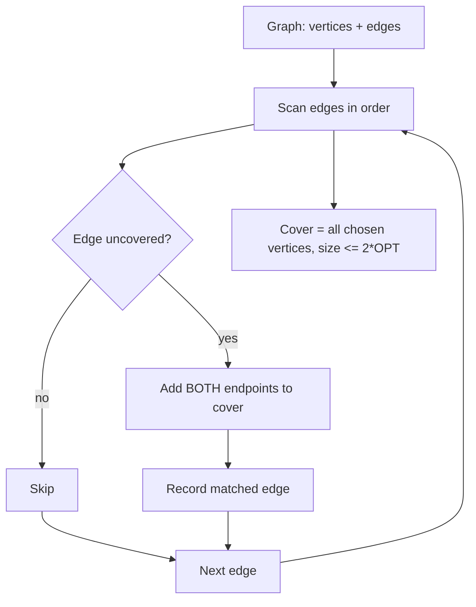

# Vertex Cover Approximation — Junior Level

> **One-line summary:** A *vertex cover* is a set of vertices that touches every edge. Finding the *smallest* one is NP-hard, but a beautiful greedy gives a guaranteed-good answer: **repeatedly pick any uncovered edge and add BOTH of its endpoints** to the cover. This is the classic **2-approximation** — its cover is never more than twice the size of the true optimum.

---

## Table of Contents

1. [Introduction](#introduction)
2. [Prerequisites](#prerequisites)
3. [Glossary](#glossary)
4. [Core Concepts](#core-concepts)
5. [Big-O Summary](#big-o-summary)
6. [Real-World Analogies](#real-world-analogies)
7. [Pros & Cons](#pros--cons)
8. [Step-by-Step Walkthrough](#step-by-step-walkthrough)
9. [Code Examples](#code-examples)
10. [Coding Patterns](#coding-patterns)
11. [Error Handling](#error-handling)
12. [Performance Tips](#performance-tips)
13. [Best Practices](#best-practices)
14. [Edge Cases & Pitfalls](#edge-cases--pitfalls)
15. [Common Mistakes](#common-mistakes)
16. [Cheat Sheet](#cheat-sheet)
17. [Visual Animation](#visual-animation)
18. [Summary](#summary)
19. [Further Reading](#further-reading)

---

## Introduction

Imagine you run a museum with a floor plan of hallways. Each hallway connects two rooms, and you must place a guard in some of the rooms so that **every hallway is watched by a guard in at least one of its two endpoint rooms**. Guards cost money, so you want to place as few as possible. That, in graph language, is the **minimum vertex cover** problem: choose the fewest vertices so that every edge has at least one chosen endpoint.

The obvious approach is to try every subset of rooms and keep the smallest valid one. That works for a 5-room museum. It collapses immediately afterward: a graph on 40 vertices has `2^40 ≈ 10^12` subsets — you cannot test them all. In fact, **minimum vertex cover is NP-hard**: nobody knows a polynomial-time algorithm that always finds the exact minimum, and most computer scientists believe none exists.

So we settle for an *approximation*: an answer that is provably "close" to optimal even if not exactly optimal. The headline algorithm of this topic is astonishingly simple:

1. Look at the edges. While some edge is **uncovered** (neither endpoint chosen yet):
2. Pick **any** such edge `(u, v)`.
3. Add **both** `u` and `v` to the cover.
4. Repeat.

That's it. The set you build is always a valid vertex cover, and it is never larger than **twice** the smallest possible cover. We call this a **2-approximation**. Equivalently, the edges you picked form a **maximal matching** (a set of edges with no shared endpoints that cannot be extended), and you take *all* the matched vertices.

The "add both endpoints" rule looks wasteful — why not add just one? The surprise of this topic is that adding both is exactly what *guarantees* the 2× bound, while the "smarter looking" rule of always grabbing the highest-degree vertex has **no such guarantee** and can be arbitrarily bad. We will see why in `middle.md`.

---

## Prerequisites

Before reading this file you should be comfortable with:

- **Graphs** — vertices (nodes) and edges, what "undirected" means, and an adjacency list or edge list representation. The sibling `01-representation` covers this.
- **Sets** — adding elements, membership testing, set size. A hash set or boolean array suffices.
- **Greedy algorithms** — the idea of making a locally sensible choice and never undoing it. The chapter intro `14-greedy-algorithms` frames this.
- **Big-O notation** — `O(V + E)` for a single pass over a graph.
- **The notion of NP-hardness (informally)** — "no known fast exact algorithm; we believe none exists." You do *not* need the formal proof here.

Optional but helpful:

- **Matchings** — a set of edges that share no endpoints. We connect vertex cover to *maximal matchings* below; the sibling graph chapter touches matchings.
- **Approximation ratio** — the idea that an algorithm's answer is within a factor `c` of optimal. We define it precisely below.

---

## Glossary

| Term | Meaning |
|------|---------|
| **Vertex cover** | A set `S` of vertices such that every edge has at least one endpoint in `S`. |
| **Minimum vertex cover** | A vertex cover of the smallest possible size. Its size is written `OPT`. |
| **Covered edge** | An edge with at least one endpoint already in the cover. |
| **Uncovered edge** | An edge with *neither* endpoint in the cover yet. |
| **Matching** | A set of edges, no two of which share a vertex. |
| **Maximal matching** | A matching you cannot grow — every remaining edge touches a matched vertex. (Not necessarily the *largest* matching.) |
| **Maximum matching** | The *largest possible* matching. (Note: "maximal" ≠ "maximum".) |
| **Approximation ratio** | A guarantee that `ALG ≤ c · OPT`. Here `c = 2`. |
| **2-approximation** | An algorithm whose output is at most twice the optimum. |
| **NP-hard** | A problem with no known polynomial exact algorithm; believed to require exponential time. |
| **Independent set** | A set of vertices with *no* edge between any two. The complement of a vertex cover. |
| **Endpoint** | One of the two vertices an edge connects. |

---

## Core Concepts

### 1. What "covers an edge" means

An edge `(u, v)` is **covered** by a set `S` if `u ∈ S` *or* `v ∈ S` (or both). A set `S` is a **vertex cover** when *every* edge is covered. Equivalently: there is no edge with both endpoints *outside* `S`.

A quick way to picture it: shine a flashlight from each chosen vertex down all its edges. A valid cover means every edge gets lit from at least one end.

### 2. The problem is to make `S` small

Any graph has a trivial vertex cover: *all* the vertices. Every edge is obviously covered. The challenge is to use as *few* vertices as possible. The minimum size is called `OPT`. Computing `OPT` exactly is NP-hard, so we approximate.

### 3. The maximal-matching 2-approximation

The algorithm builds the cover by repeatedly consuming an uncovered edge:

```
S = {}                       # the cover we are building
for each edge (u, v):
    if u not in S and v not in S:   # edge is uncovered
        add u to S
        add v to S
return S
```

Each time we hit an uncovered edge, we add **both** endpoints. The edges we trigger on form a **maximal matching** `M`: they share no endpoints (we only trigger on edges where *neither* endpoint is covered yet), and after we finish, every edge is covered (so no edge can be added to `M`). The cover is exactly the `2·|M|` matched vertices.

### 4. Why the answer is a valid cover

When the loop ends, there is no uncovered edge left — if there were, the loop would have processed it. "No uncovered edge" *is* the definition of a vertex cover. So `S` is always valid, no matter which edges we picked or in what order.

### 5. Why it is at most twice optimal (the intuition)

Here is the key insight, made rigorous in `professional.md`:

- The picked edges form a matching `M` — they share no vertices.
- **Any** vertex cover, including the optimal one, must contain at least one endpoint of *each* matched edge (because that edge must be covered). Since matched edges share no vertices, that means `OPT ≥ |M|` — the optimum needs at least one distinct vertex per matched edge.
- Our cover has exactly `2·|M|` vertices.
- Combining: `|S| = 2·|M| ≤ 2·OPT`.

So the "wasteful" rule of taking both endpoints is precisely what lets us *count*: each matched edge forces the optimum to spend at least one vertex, and we spend two — a clean factor of 2.

### 6. Vertex cover and independent set are complements

If `S` is a vertex cover, then its complement `V \ S` is an **independent set** (no edge lives entirely outside `S`, so no edge connects two vertices of `V \ S`). Minimizing the cover is the same as maximizing the independent set. This duality reappears in `middle.md` with König's theorem on bipartite graphs.

---

## Big-O Summary

| Step | Time | Space | Notes |
|------|------|-------|-------|
| Scan all edges once | `O(E)` | `O(V)` | One pass; for each edge a constant-time membership check. |
| Membership test `u ∈ S` | `O(1)` | — | Boolean array indexed by vertex. |
| **Total (maximal-matching 2-approx)** | **`O(V + E)`** | **`O(V)`** | Linear — as fast as reading the graph. |
| Highest-degree greedy (the *wrong* one) | `O((V + E) log V)` | `O(V)` | Needs a priority queue; and it is **not** a 2-approximation. |
| Exact (brute force) | `O(2^V · E)` | `O(V)` | Try every subset; only for tiny graphs / tests. |
| Exact (FPT, cover size ≤ k) | `O(2^k · (V + E))` | `O(k)` | Fast *if* the optimum is small; see `senior.md`. |

The maximal-matching approximation is **linear time** — you cannot do asymptotically better, since you must at least look at every edge.

---

## Real-World Analogies

| Concept | Analogy |
|---------|---------|
| Vertex cover | Placing security cameras at street intersections so that every street segment is watched from at least one of its two ends. |
| Minimum cover is NP-hard | The "perfect" camera placement is astronomically expensive to compute; you accept a provably-good plan instead. |
| Picking an edge and taking both endpoints | A road needs watching, so you put a guard at *each* end of that road — guaranteeing it is covered no matter what. |
| Maximal matching | A set of roads with no shared intersections, chosen until every remaining road already touches a guarded intersection. |
| The 2× guarantee | "Whatever the cheapest plan costs, ours costs at most double" — a contract you can promise a client. |
| Independent set (complement) | The intersections with *no* camera, none of which share a street — the "free" intersections. |
| Why degree-greedy can fail | Grabbing the busiest intersection first *seems* clever but can be tricked into a plan far larger than double the optimum. |

Where the analogy breaks: real camera placement has costs and coverage radii; the clean "one vertex covers all its edges" model is an idealization. The 2× guarantee is about *counts of vertices*, not dollars.

---

## Pros & Cons

| Pros | Cons |
|------|------|
| Dead simple: one pass over the edges. | Gives an *approximate* cover, not the true minimum. |
| Linear time `O(V + E)` — as fast as reading the graph. | The 2× factor is the worst case; you may do better or land exactly at 2×. |
| Provable guarantee: `|S| ≤ 2·OPT`, always. | Often returns *both* endpoints when one would suffice (some redundancy). |
| Works on any undirected graph; no special structure needed. | Cannot beat factor 2 with this method (and no simple method beats ~1.36 — see `professional.md`). |
| The matching it produces is independently useful. | For bipartite graphs an *exact* minimum exists (König) — the 2-approx is overkill there. |
| Easy to verify: just check every edge is covered. | The optimum is NP-hard, so you cannot easily check how close you got on big graphs. |

**When to use:** you need a guaranteed-good vertex cover fast on a large general graph — monitoring, conflict resolution, "hit every edge with a node."

**When NOT to use:** the graph is bipartite (use König for the exact minimum), the cover is known to be tiny (use the FPT exact algorithm in `senior.md`), or you genuinely need the optimum on a small graph (brute force / ILP).

---

## Step-by-Step Walkthrough

Let us run the maximal-matching 2-approximation on a small graph. Vertices `{0, 1, 2, 3, 4}` with edges:

```
0–1,  1–2,  2–3,  3–4,  4–0,  1–3
```

This is a 5-cycle `0-1-2-3-4-0` plus a chord `1–3`.

**Start.** Cover `S = {}`. Process edges in the listed order.

**Edge `0–1`.** Neither `0` nor `1` is in `S` → uncovered. Add both. `S = {0, 1}`. Matched edge #1: `0–1`.

**Edge `1–2`.** `1 ∈ S` already → covered. Skip.

**Edge `2–3`.** Neither `2` nor `3` is in `S` → uncovered. Add both. `S = {0, 1, 2, 3}`. Matched edge #2: `2–3`.

**Edge `3–4`.** `3 ∈ S` → covered. Skip.

**Edge `4–0`.** `0 ∈ S` → covered. Skip.

**Edge `1–3`.** Both `1, 3 ∈ S` → covered. Skip.

**End.** Cover `S = {0, 1, 2, 3}`, size `4`. Matching `M = {0–1, 2–3}`, size `2`.

**Check validity.** Every edge has an endpoint in `S`: `0–1`✓, `1–2`✓(1), `2–3`✓, `3–4`✓(3), `4–0`✓(0), `1–3`✓. Valid cover.

**Check the bound.** The true minimum cover of this graph is `{1, 3, 4}` of size `3` (you can verify: `0–1`✓(1), `1–2`✓(1), `2–3`✓(3), `3–4`✓(3 or 4), `4–0`✓(4), `1–3`✓). So `OPT = 3`. Our answer is `4 ≤ 2·3 = 6` — comfortably within the guarantee. And `OPT = 3 ≥ |M| = 2`, exactly the lower bound the matching gives us.

Notice the algorithm returned 4 where 3 was possible — that single extra vertex is the "waste" of taking both endpoints. The guarantee is that this waste never exceeds a factor of 2.

---

## Code Examples

### Example: Maximal-Matching 2-Approximation for Vertex Cover

We scan the edges once. For each *uncovered* edge, we add both endpoints to the cover. The function returns the cover as a sorted list. All three programs print the cover and confirm it is valid.

#### Go

```go
package main

import (
	"fmt"
	"sort"
)

// vertexCover2Approx returns a vertex cover within 2x of optimal using the
// maximal-matching rule: for each uncovered edge, add BOTH endpoints.
func vertexCover2Approx(n int, edges [][2]int) []int {
	inCover := make([]bool, n)
	for _, e := range edges {
		u, v := e[0], e[1]
		if u == v {
			continue // self-loop: a single vertex covers it; handle separately if needed
		}
		if !inCover[u] && !inCover[v] { // edge is uncovered
			inCover[u] = true
			inCover[v] = true
		}
	}
	cover := []int{}
	for i := 0; i < n; i++ {
		if inCover[i] {
			cover = append(cover, i)
		}
	}
	sort.Ints(cover)
	return cover
}

// isValidCover checks every edge has at least one endpoint in the cover.
func isValidCover(n int, edges [][2]int, cover []int) bool {
	inCover := make([]bool, n)
	for _, c := range cover {
		inCover[c] = true
	}
	for _, e := range edges {
		if e[0] != e[1] && !inCover[e[0]] && !inCover[e[1]] {
			return false
		}
	}
	return true
}

func main() {
	edges := [][2]int{{0, 1}, {1, 2}, {2, 3}, {3, 4}, {4, 0}, {1, 3}}
	cover := vertexCover2Approx(5, edges)
	fmt.Println("cover:", cover, "size:", len(cover))   // [0 1 2 3] size 4
	fmt.Println("valid:", isValidCover(5, edges, cover)) // true
}
```

#### Java

```java
import java.util.*;

public class VertexCover {
    // Maximal-matching 2-approximation: for each uncovered edge, take both endpoints.
    static List<Integer> vertexCover2Approx(int n, int[][] edges) {
        boolean[] inCover = new boolean[n];
        for (int[] e : edges) {
            int u = e[0], v = e[1];
            if (u == v) continue;             // ignore self-loops here
            if (!inCover[u] && !inCover[v]) {  // edge uncovered
                inCover[u] = true;
                inCover[v] = true;
            }
        }
        List<Integer> cover = new ArrayList<>();
        for (int i = 0; i < n; i++) if (inCover[i]) cover.add(i);
        return cover;
    }

    static boolean isValidCover(int n, int[][] edges, List<Integer> cover) {
        boolean[] inCover = new boolean[n];
        for (int c : cover) inCover[c] = true;
        for (int[] e : edges)
            if (e[0] != e[1] && !inCover[e[0]] && !inCover[e[1]]) return false;
        return true;
    }

    public static void main(String[] args) {
        int[][] edges = {{0, 1}, {1, 2}, {2, 3}, {3, 4}, {4, 0}, {1, 3}};
        List<Integer> cover = vertexCover2Approx(5, edges);
        System.out.println("cover: " + cover + " size: " + cover.size()); // [0,1,2,3] 4
        System.out.println("valid: " + isValidCover(5, edges, cover));      // true
    }
}
```

#### Python

```python
def vertex_cover_2approx(n, edges):
    """Vertex cover within 2x of optimal via the maximal-matching rule:
    for each uncovered edge, add BOTH endpoints to the cover."""
    in_cover = [False] * n
    for u, v in edges:
        if u == v:
            continue                  # self-loop ignored here
        if not in_cover[u] and not in_cover[v]:   # edge uncovered
            in_cover[u] = True
            in_cover[v] = True
    return [i for i in range(n) if in_cover[i]]


def is_valid_cover(n, edges, cover):
    s = set(cover)
    return all(u == v or u in s or v in s for u, v in edges)


if __name__ == "__main__":
    edges = [(0, 1), (1, 2), (2, 3), (3, 4), (4, 0), (1, 3)]
    cover = vertex_cover_2approx(5, edges)
    print("cover:", cover, "size:", len(cover))    # [0, 1, 2, 3] size 4
    print("valid:", is_valid_cover(5, edges, cover))  # True
```

**What it does:** scans edges once, adds both endpoints of each uncovered edge, returns the cover, and verifies validity.
**Run:** `go run main.go` | `javac VertexCover.java && java VertexCover` | `python vertex_cover.py`

---

## Coding Patterns

### Pattern 1: Build the Cover by Walking Edges

**Intent:** One pass, constant work per edge. A boolean array gives `O(1)` membership.

```python
def cover(n, edges):
    inc = [False] * n
    for u, v in edges:
        if not inc[u] and not inc[v]:
            inc[u] = inc[v] = True
    return [i for i in range(n) if inc[i]]
```

This is the same `O(V + E)` step used in Go and Java above. The order of edges is irrelevant to the *guarantee* (always ≤ 2·OPT) but can change *which* cover you get.

### Pattern 2: Return the Matching Too

**Intent:** The edges you triggered on form a maximal matching — return it for use as a lower bound `OPT ≥ |M|`.

```python
def cover_and_matching(n, edges):
    inc = [False] * n
    matching = []
    for u, v in edges:
        if not inc[u] and not inc[v]:
            inc[u] = inc[v] = True
            matching.append((u, v))
    return [i for i in range(n) if inc[i]], matching
```

The matching gives you a free certificate: the optimum is *at least* `len(matching)`, so your cover is at most `2·len(matching) ≤ 2·OPT`.

### Pattern 3: Verify Against Brute Force on Small Graphs

**Intent:** Trust but verify. Enumerate all subsets, find the true minimum, and confirm your approximation is within 2×.

```python
from itertools import combinations

def brute_min_cover(n, edges):
    for k in range(n + 1):
        for sub in combinations(range(n), k):
            s = set(sub)
            if all(u in s or v in s for u, v in edges):
                return k          # first size that works = OPT
    return n
```



---

## Error Handling

| Error | Cause | Fix |
|-------|-------|-----|
| Cover misses an edge (invalid) | Added only *one* endpoint instead of both, or skipped an edge by mistake. | Always add *both* endpoints of an uncovered edge; re-run the validity check. |
| Index-out-of-bounds on `inCover` | Vertices are 1-indexed but the array has size `n`, or a vertex id ≥ `n` appears. | Size the array to `maxVertex + 1`; be consistent about 0- vs 1-indexing. |
| Self-loop crashes or double-counts | An edge `(u, u)` triggers "add both" twice. | Skip self-loops, or note a self-loop forces `u` into *any* cover — handle explicitly. |
| Cover much larger than expected | You used the "add one endpoint" rule, which is **not** a 2-approximation. | Use the maximal-matching (both-endpoints) rule for the guarantee. |
| Duplicate vertices in output | The same vertex added from two different edges. | Use a boolean array / set so each vertex appears once. |
| Empty graph returns non-empty cover | Off-by-one or stray vertices. | A graph with no edges needs the *empty* cover; the loop never fires. |

---

## Performance Tips

- **Use a boolean array, not a hash set,** for `inCover` when vertices are `0..n−1`. `O(1)` with no hashing overhead.
- **Single pass.** Do not sort edges or build adjacency structures — the algorithm only needs to *see* each edge once.
- **Stop early if all vertices are covered** is rarely worth it (the check costs more than it saves), but for very dense graphs you can break once `|S| == n`.
- **Reuse the buffer** if you run the approximation on many graphs of the same size — avoid re-allocating the `O(V)` array each call.
- **Return the matching** alongside the cover for free; it doubles as the lower-bound certificate, so you do not recompute it.
- **For repeated queries on a changing graph,** maintaining the cover incrementally is possible but rarely needed; a fresh `O(V + E)` pass is usually fastest.

---

## Best Practices

- Write a brute-force exact minimum and an `is_valid_cover` checker first; test the approximation against them on every graph with `V ≤ 18`. This catches the "added one endpoint" bug instantly.
- Always assert the output is a *valid* cover before trusting it — a cheap, powerful invariant.
- Document clearly that the result is an *approximation* (`≤ 2·OPT`), never advertised as the minimum.
- Return the underlying matching so callers can compute the `OPT ≥ |M|` lower bound themselves.
- Be explicit about self-loops and parallel edges in the function's contract; decide and document the behavior.
- Keep vertex indexing (0- vs 1-based) uniform across the whole module to avoid array-sizing bugs.

---

## Edge Cases & Pitfalls

- **Empty graph (no edges)** — the correct cover is the empty set; the loop never triggers. Do not return all vertices.
- **Isolated vertices** — vertices with no edges never need to be in the cover; they are simply never added. Correct by construction.
- **Self-loops `(u, u)`** — a self-loop *must* be covered by `u` itself (its only endpoint). The "add both" rule degenerates; handle self-loops by forcing `u` into the cover, or document that they are ignored.
- **Parallel edges** — duplicates do not change the cover (the first copy covers the rest), but they do not hurt; the boolean check handles them.
- **Disconnected graph** — the algorithm treats each component independently; the guarantee holds per-component and overall.
- **The 2× bound is tight** — on a *perfect matching* (e.g., many disjoint edges), the algorithm returns all `2k` vertices when `k` would do, hitting exactly `2·OPT`. This is not a bug; it is the worst case.
- **"Add one endpoint" temptation** — picking just one endpoint of each edge feels efficient but loses the guarantee and can be far from optimal.

---

## Common Mistakes

1. **Adding only one endpoint per edge.** This breaks the 2-approximation proof — you lose the `OPT ≥ |M|` lower bound and can end up far above 2·OPT.
2. **Using the highest-degree greedy and assuming it is a 2-approximation.** It is *not*; it can be `Θ(log V)` times optimal (shown in `middle.md`).
3. **Returning all vertices "to be safe".** That is a valid cover but defeats the purpose; it can be `Θ(V)` times optimal.
4. **Forgetting to skip already-covered edges.** Re-adding an endpoint is harmless with a boolean array, but failing to *skip* can corrupt a matching you are tracking.
5. **Mishandling self-loops.** A self-loop's only cover is its single vertex; the "both endpoints" rule does not apply cleanly.
6. **Advertising the result as the minimum.** It is an approximation; calling it optimal is a correctness claim you cannot make.
7. **Wrong array size for 1-indexed vertices.** Allocate `n+1` if vertices are `1..n`, or you will index out of bounds.

---

## Cheat Sheet

| Step | Operation |
|------|-----------|
| 1. Init | `inCover[v] = false` for all `v`; `S = {}`. |
| 2. Scan | For each edge `(u, v)`: if `u ∉ S` and `v ∉ S`, add **both** `u` and `v`. |
| 3. Collect | `S = { v : inCover[v] }`. |
| 4. Guarantee | `|S| = 2·|M| ≤ 2·OPT`, where `M` is the maximal matching of picked edges. |

Key facts:

```
vertex cover      = set touching every edge
minimum cover     = NP-hard
2-approximation   = maximal matching, take ALL matched vertices
guarantee         = |ALG| ≤ 2·OPT   (because OPT ≥ |M| and |ALG| = 2|M|)
add BOTH endpoints (one endpoint loses the guarantee)
complexity        = O(V + E), linear
complement of a cover = independent set
degree-greedy     = NOT a 2-approximation (can be Θ(log V)·OPT)
```

Tiny verified examples:

```
single edge 0–1        → cover {0,1}, OPT = 1   (ratio 2, tight)
path 0–1–2             → cover {0,1} or {1,2}, OPT = 1
triangle 0–1–2         → cover size 2, OPT = 2
star (center 0, leaves)→ cover {0}+leaf-of-first-edge ... ratio up to 2
```

---

## Visual Animation

> See [`animation.html`](./animation.html) for an interactive visualization of the vertex cover 2-approximation.
>
> The animation demonstrates:
> - An editable graph with its edges listed
> - Scanning edges one by one, highlighting the current edge
> - Detecting an *uncovered* edge and adding **both** endpoints (the matching edge glows)
> - The cover set growing in a side panel, with the running matching size
> - A final comparison against the brute-force minimum cover, showing the `≤ 2·OPT` guarantee in action

---

## Summary

A vertex cover is a set of vertices that touches every edge; the minimum one is NP-hard to find. The classic remedy is the **maximal-matching 2-approximation**: scan the edges, and for every *uncovered* edge add **both** of its endpoints. The result is always a valid cover, runs in linear `O(V + E)` time, and is provably at most twice the size of the true optimum. The proof rests on a clean lower bound: the picked edges form a matching `M` with no shared vertices, so any cover (including the optimum) needs at least `|M|` vertices, while ours uses exactly `2|M|`. The "add both endpoints" rule — which looks wasteful — is exactly what makes this counting argument work, whereas the "smarter" highest-degree greedy carries *no* such guarantee. Master the four-step recipe — init, scan, take both endpoints, collect — and you have the junior-level core.

---

## Further Reading

- Cormen, Leiserson, Rivest, Stein, *Introduction to Algorithms*, §35.1 — the vertex-cover 2-approximation via maximal matching.
- Vazirani, *Approximation Algorithms*, Ch. 1 — vertex cover as the canonical first approximation algorithm.
- Williamson & Shmoys, *The Design of Approximation Algorithms*, Ch. 1 — LP and combinatorial 2-approximations.
- Sibling topic `14-greedy-algorithms` chapter intro — the greedy paradigm this fits into.
- Sibling topic on matchings — maximal vs maximum matchings, which underpin the lower bound here.
- König's theorem (covered in `middle.md`) — the exact minimum vertex cover on bipartite graphs.
