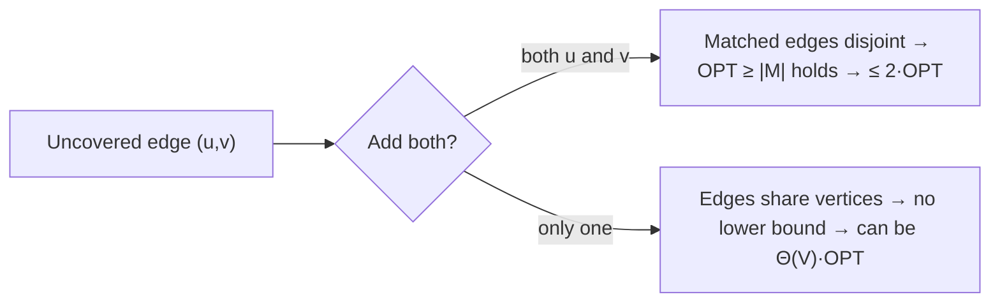

# Vertex Cover Approximation — Middle Level

> **One-line summary:** Beyond "take both endpoints," the middle level explains *why* taking both is mandatory, *why* the seemingly smarter highest-degree greedy is **not** a 2-approximation (it can be `Θ(log V)·OPT`), and how vertex cover ties to **independent set** (its exact complement) and to **König's theorem**, which gives the *exact* minimum cover on bipartite graphs via maximum matching.

---

## Table of Contents

1. [Recap and Framing](#recap-and-framing)
2. [Why "Both Endpoints" Is Not Negotiable](#why-both-endpoints-is-not-negotiable)
3. [The Wrong Greedy: Highest-Degree Is Not a 2-Approximation](#the-wrong-greedy-highest-degree-is-not-a-2-approximation)
4. [Vertex Cover and Independent Set Are Complements](#vertex-cover-and-independent-set-are-complements)
5. [König's Theorem: Exact Cover on Bipartite Graphs](#königs-theorem-exact-cover-on-bipartite-graphs)
6. [Comparison: 2-Approx vs Degree-Greedy vs König vs Exact](#comparison-2-approx-vs-degree-greedy-vs-könig-vs-exact)
7. [Code: Degree-Greedy vs Matching, Side by Side](#code-degree-greedy-vs-matching-side-by-side)
8. [Performance Analysis](#performance-analysis)
9. [Edge Cases & Pitfalls](#edge-cases--pitfalls)
10. [Best Practices](#best-practices)
11. [Cheat Sheet](#cheat-sheet)
12. [Summary](#summary)
13. [Further Reading](#further-reading)

---

## Recap and Framing

At the junior level we learned the recipe: scan the edges, and for each *uncovered* edge add **both** endpoints. The triggered edges form a maximal matching `M`, the cover is the `2|M|` matched vertices, and the guarantee is `|ALG| = 2|M| ≤ 2·OPT` because `OPT ≥ |M|`.

The middle level answers the questions a thoughtful engineer asks next:

1. *Why both endpoints?* What exactly breaks if I take only one?
2. The highest-degree-first greedy *looks* smarter — surely it is also a 2-approximation? (No — and the counterexample is instructive.)
3. How does vertex cover relate to the **independent set** problem?
4. Is there a graph class where I can get the *exact* minimum cheaply? (Yes — bipartite graphs, via **König's theorem**.)

We carry the linear-time matching algorithm from junior level and sharpen our understanding of *why* it works and *when* something better is available.

---

## Why "Both Endpoints" Is Not Negotiable

The 2-approximation proof has exactly two moving parts:

1. **Upper bound on us:** our cover has `2|M|` vertices, two per matched edge.
2. **Lower bound on the optimum:** `OPT ≥ |M|`, because the matched edges are pairwise vertex-disjoint, so *any* cover must spend at least one distinct vertex on each.

Both halves depend on the matched edges being **vertex-disjoint** — that is what "matching" means. We get that property *for free* because we only trigger on edges where **neither** endpoint is yet covered. The moment we add both endpoints, that edge's two vertices are "spent," and no future trigger can reuse them.

Now suppose we add only **one** endpoint of each uncovered edge — say `u`, not `v`. Two things break:

- The set of triggered edges is **no longer a matching**: a later edge could trigger on `v` (still uncovered) and the edges `(u, v)` and `(v, w)` now share vertex `v`. The disjointness that powered `OPT ≥ |M|` is gone, so we lose the lower bound entirely.
- Worse, the "one endpoint" choice can be adversarially bad. Consider a **star**: a center `c` joined to leaves `ℓ₁, …, ℓ_{k}`. The optimum is `{c}`, size 1. If the one-endpoint rule keeps choosing the *leaf* of each uncovered edge, it adds `ℓ₁, ℓ₂, …` — up to `k` vertices, a ratio of `k`. There is no constant bound.

So "both endpoints" is the price of the guarantee. The extra vertex per matched edge is exactly what buys you the clean factor-2 contract. Taking one endpoint trades a provable bound for an unbounded gamble.



---

## The Wrong Greedy: Highest-Degree Is Not a 2-Approximation

A natural instinct: repeatedly pick the vertex of **highest remaining degree**, add it to the cover, delete its edges, repeat until no edges remain. This is the *greedy set-cover heuristic* applied to vertex cover. It feels smarter than the matching rule — surely grabbing the busiest vertex is efficient?

**It is a valid cover, but it is NOT a 2-approximation.** Its worst-case ratio grows like the **harmonic number** `H_d ≈ ln d` for max degree `d` — that is `Θ(log V)`, unbounded as the graph grows. Here is the classic counterexample that forces the bad ratio.

### The construction

Build a bipartite graph with a "left" side `L` of `k` vertices and a "right" side partitioned into groups:

- Group `G_i` (for `i = 2, 3, …, k`) has `⌊k/i⌋` vertices, each connected to `i` *distinct* left vertices, and the groups are arranged so that:
  - every left vertex has degree about `H_k ≈ ln k`,
  - every right vertex in `G_i` has degree exactly `i`.

The **optimum** cover is simply `L` itself, size `k` — picking all `k` left vertices covers every edge (each edge has a left endpoint).

But the **degree-greedy** is lured to the right side. At the start, the highest-degree vertices are in `G_k` (degree `k`), so greedy grabs those first. After removing them, the new maximum degree is `k−1` (in `G_{k−1}`), so it grabs those next, and so on down to `G_2`. By the time greedy finishes, it has picked roughly

```
⌊k/k⌋ + ⌊k/(k−1)⌋ + … + ⌊k/2⌋  ≈  k·(H_k − 1)  ≈  k·ln k
```

right-side vertices — versus the optimum `k`. The ratio is `≈ ln k = Θ(log V)`, which **exceeds 2** for large `k` and grows without bound.

### Why the matching rule does not fall for this

On the very same graph, the maximal-matching algorithm picks pairwise-disjoint edges. Each matched edge forces the optimum to spend a vertex, so `|M| ≤ OPT = k`, and the cover is `2|M| ≤ 2k = 2·OPT`. The matching rule cannot be tricked into the harmonic blow-up because its bound is structural, not heuristic.

### The lesson

"Locally optimal" (grab the biggest) is *not* the same as "globally bounded." The matching 2-approximation wins precisely because its guarantee comes from a **lower bound on every cover** (`OPT ≥ |M|`), not from a hope that greedy choices accumulate well. When you need a *guarantee*, prefer the algorithm whose bound you can *prove*, even if it looks less clever.

> Caveat: highest-degree greedy is still the right tool for *general set cover*, where it achieves the optimal `H_n` ratio and no constant factor is possible. Vertex cover is the special case where a *better* (constant-factor) algorithm exists, so the generic heuristic is the wrong choice here.

---

## Vertex Cover and Independent Set Are Complements

A foundational duality:

> **Theorem.** `S` is a vertex cover of `G = (V, E)` **if and only if** `V \ S` is an independent set.

*Proof.* `S` covers every edge ⟺ no edge has both endpoints outside `S` ⟺ no edge connects two vertices of `V \ S` ⟺ `V \ S` is independent. ∎

Two immediate corollaries:

- **Minimizing the cover = maximizing the independent set.** `|min vertex cover| + |max independent set| = |V|`. Shrinking the cover by one grows the independent set by one.
- **Both are NP-hard.** Since they are complementary, an exact polynomial algorithm for one would solve the other. (Note the *approximation* behavior differs sharply: vertex cover has a 2-approximation, but maximum independent set has **no constant-factor approximation** unless P = NP — minimizing a small thing is far easier than maximizing the leftover.)

This complement view is why "find the largest set of mutually non-adjacent items" (independent set) and "find the smallest set of items hitting every conflict" (vertex cover) are the same coin. A scheduler picking the most non-conflicting jobs is, dually, choosing the fewest jobs to *drop* so the rest are conflict-free.

There is also a third member of this family: a **clique** in `G` is an independent set in the *complement graph* `Ḡ`. So maximum clique, maximum independent set, and minimum vertex cover are a tightly linked trio.

---

## König's Theorem: Exact Cover on Bipartite Graphs

The 2-approximation is the best simple guarantee for *general* graphs. But for **bipartite** graphs — where vertices split into two sides with edges only crossing between them — we can compute the **exact** minimum cover in polynomial time.

> **König's Theorem.** In a bipartite graph, the size of the **minimum vertex cover** equals the size of the **maximum matching**.
>
> ```
> |min vertex cover|  =  |max matching|     (bipartite graphs only)
> ```

Contrast this with the general-graph bound `OPT ≥ |maximal matching|`, which is only an inequality and only uses a *maximal* (not maximum) matching. König upgrades it to an *equality* using the *maximum* matching, and it holds *only* for bipartite graphs.

### Why this matters

- **Maximum matching in bipartite graphs is polynomial** (Hopcroft–Karp runs in `O(E√V)`). So `min vertex cover` is *exactly* computable on bipartite graphs — no approximation needed.
- It is a strict improvement: on bipartite graphs the 2-approximation may return up to `2·OPT`, while König gives `OPT` exactly.

### Constructing the actual minimum cover (not just its size)

König's theorem is constructive. Given a maximum matching `M` on bipartite sides `L` and `R`:

1. Let `U` = unmatched vertices in `L`.
2. Do an alternating BFS/DFS from `U`: follow *non-matching* edges `L → R` and *matching* edges `R → L`. Let `Z` be all reachable vertices.
3. The minimum vertex cover is `(L \ Z) ∪ (R ∩ Z)`.

This set has size exactly `|M|`, and one proves it is a cover by a short alternating-path argument (a fuller sketch lives in `professional.md`).

### Where König comes from (intuition)

Bipartite graphs have no odd cycles, and that is precisely what makes "one endpoint per matched edge suffices" achievable. In a general graph, an odd cycle (e.g., a triangle) needs *two* of its three vertices to cover its three edges, but a maximum matching of a triangle has only one edge — so `|max matching| = 1 < 2 = OPT`, and König *fails*. The triangle is the smallest witness that König is bipartite-only.

```mermaid
graph TD
    A[Graph] --> B{Bipartite?}
    B -->|yes| C[Max matching via Hopcroft–Karp]
    C --> D[König: min cover = |max matching|, EXACT]
    B -->|no| E[Maximal matching, take both endpoints]
    E --> F[2-approximation: ≤ 2·OPT]
```

---

## The Clique Connection (Optional Depth)

The duality extends one step further. Recall a **clique** in `G` is a set of mutually-adjacent vertices, and a clique in `G` is exactly an *independent set in the complement graph* `Ḡ` (where edges and non-edges are swapped). Chaining this with the cover/independent-set complement:

```
max clique in G   =   max independent set in Ḡ   =   |V| − (min vertex cover in Ḡ)
```

So the trio — minimum vertex cover, maximum independent set, maximum clique — are all reductions of one another. This matters practically: a "find the largest mutually-compatible group" (clique) request can be answered by a vertex-cover routine on the *complement* graph. But beware the approximation trap from the previous section: while vertex cover on `Ḡ` is 2-approximable, the *clique* you recover from its complement is **not** approximable to any constant factor — the same magnitude mismatch that afflicts independent set. The reduction is exact for the *optimum* but does not transfer the *guarantee*. Knowing the trio is linked is useful; assuming the approximation carries across is a classic mistake.

---

## Comparison: 2-Approx vs Degree-Greedy vs König vs Exact

| Method | Graph class | Time | Guarantee | Notes |
|--------|-------------|------|-----------|-------|
| Maximal-matching 2-approx | any | `O(V + E)` | `≤ 2·OPT` | The default. Simple, linear, provable. |
| Highest-degree greedy | any | `O((V+E) log V)` | `≤ H_d·OPT ≈ ln(V)·OPT` | **Not** constant-factor; can exceed 2×. Avoid for vertex cover. |
| LP rounding (round `x_v ≥ ½`) | any | LP solve | `≤ 2·OPT` | Same factor, different route; see `senior.md`. |
| König (max matching) | **bipartite only** | `O(E√V)` | **exact** (`= OPT`) | Strictly better than 2-approx when applicable. |
| FPT branching | any, small cover | `O(2^k·(V+E))` | **exact** | Fast only if `OPT = k` is small; see `senior.md`. |
| Brute force | any | `O(2^V·E)` | **exact** | Only tiny graphs / tests. |

**Strategic rule:** if the graph is bipartite, use König for the *exact* answer. Otherwise, use the matching 2-approximation. Never reach for highest-degree greedy expecting a constant factor — it does not have one.

---

## Code: Degree-Greedy vs Matching, Side by Side

We implement *both* the correct matching 2-approximation and the *wrong* highest-degree greedy, then run them on the lure-graph to watch the degree-greedy overshoot. All three print sizes where matching ≤ 2·OPT but degree-greedy can be larger.

#### Go

```go
package main

import (
	"fmt"
	"sort"
)

// Correct: maximal-matching 2-approximation.
func matchingCover(n int, edges [][2]int) []int {
	inc := make([]bool, n)
	for _, e := range edges {
		u, v := e[0], e[1]
		if !inc[u] && !inc[v] {
			inc[u], inc[v] = true, true
		}
	}
	return collect(n, inc)
}

// WRONG (not a 2-approx): repeatedly take the highest-degree vertex.
func degreeGreedyCover(n int, edges [][2]int) []int {
	adj := make([]map[int]bool, n)
	for i := range adj {
		adj[i] = map[int]bool{}
	}
	remaining := 0
	for _, e := range edges {
		if e[0] != e[1] && !adj[e[0]][e[1]] {
			adj[e[0]][e[1]] = true
			adj[e[1]][e[0]] = true
			remaining++
		}
	}
	inc := make([]bool, n)
	for remaining > 0 {
		best, bestDeg := -1, -1
		for v := 0; v < n; v++ {
			if !inc[v] && len(adj[v]) > bestDeg {
				best, bestDeg = v, len(adj[v])
			}
		}
		inc[best] = true
		for w := range adj[best] {
			delete(adj[w], best)
			remaining--
		}
		adj[best] = map[int]bool{}
	}
	return collect(n, inc)
}

func collect(n int, inc []bool) []int {
	c := []int{}
	for i := 0; i < n; i++ {
		if inc[i] {
			c = append(c, i)
		}
	}
	sort.Ints(c)
	return c
}

func main() {
	// star: center 0, leaves 1..5. OPT = {0}, size 1.
	star := [][2]int{{0, 1}, {0, 2}, {0, 3}, {0, 4}, {0, 5}}
	fmt.Println("matching:", len(matchingCover(6, star)))     // 2 (one matched edge)
	fmt.Println("degree:  ", len(degreeGreedyCover(6, star))) // 1 (picks center)
}
```

#### Java

```java
import java.util.*;

public class CoverCompare {
    static List<Integer> matchingCover(int n, int[][] edges) {
        boolean[] inc = new boolean[n];
        for (int[] e : edges)
            if (!inc[e[0]] && !inc[e[1]]) { inc[e[0]] = true; inc[e[1]] = true; }
        return collect(n, inc);
    }

    static List<Integer> degreeGreedyCover(int n, int[][] edges) {
        List<Set<Integer>> adj = new ArrayList<>();
        for (int i = 0; i < n; i++) adj.add(new HashSet<>());
        int remaining = 0;
        for (int[] e : edges)
            if (e[0] != e[1] && adj.get(e[0]).add(e[1])) { adj.get(e[1]).add(e[0]); remaining++; }
        boolean[] inc = new boolean[n];
        while (remaining > 0) {
            int best = -1, bestDeg = -1;
            for (int v = 0; v < n; v++)
                if (!inc[v] && adj.get(v).size() > bestDeg) { best = v; bestDeg = adj.get(v).size(); }
            inc[best] = true;
            for (int w : new ArrayList<>(adj.get(best))) { adj.get(w).remove(best); remaining--; }
            adj.get(best).clear();
        }
        return collect(n, inc);
    }

    static List<Integer> collect(int n, boolean[] inc) {
        List<Integer> c = new ArrayList<>();
        for (int i = 0; i < n; i++) if (inc[i]) c.add(i);
        return c;
    }

    public static void main(String[] args) {
        int[][] star = {{0,1},{0,2},{0,3},{0,4},{0,5}};
        System.out.println("matching: " + matchingCover(6, star).size());     // 2
        System.out.println("degree:   " + degreeGreedyCover(6, star).size()); // 1
    }
}
```

#### Python

```python
def matching_cover(n, edges):
    inc = [False] * n
    for u, v in edges:
        if not inc[u] and not inc[v]:
            inc[u] = inc[v] = True
    return [i for i in range(n) if inc[i]]


def degree_greedy_cover(n, edges):
    adj = [set() for _ in range(n)]
    for u, v in edges:
        if u != v:
            adj[u].add(v); adj[v].add(u)
    remaining = sum(len(a) for a in adj) // 2
    inc = [False] * n
    while remaining > 0:
        best = max((v for v in range(n) if not inc[v]), key=lambda v: len(adj[v]))
        inc[best] = True
        for w in list(adj[best]):
            adj[w].discard(best); remaining -= 1
        adj[best].clear()
    return [i for i in range(n) if inc[i]]


if __name__ == "__main__":
    star = [(0, 1), (0, 2), (0, 3), (0, 4), (0, 5)]   # OPT = {0}
    print("matching:", len(matching_cover(6, star)))       # 2
    print("degree:  ", len(degree_greedy_cover(6, star)))  # 1
```

**What it does:** runs the matching 2-approximation and the degree-greedy on the same graph. (On a *star*, degree-greedy happens to win by grabbing the center; on the harmonic lure-graph of the previous section, degree-greedy *overshoots* `2·OPT`, which is its defining failure.)
**Run:** `go run main.go` | `javac CoverCompare.java && java CoverCompare` | `python cover_compare.py`

> Note the star is the case where the *one-endpoint* mistake hurts and degree-greedy *helps* — but on the harmonic construction degree-greedy is `Θ(log V)·OPT`. No single tiny example shows both failures; that is exactly why the *proof* matters more than any one test.

---

## The Per-Instance Ratio Certificate

The worst-case "≤ 2×" guarantee is pessimistic. On most real graphs the algorithm does far better, and you can *prove* how much better **for the specific instance** you ran — without ever computing `OPT`.

The certificate is the matching itself. After the algorithm finishes you have:

- `|ALG| = 2|M|` — the cover you returned.
- `OPT ≥ |M|` — the matching lower bound (Lemma from junior level).

Therefore, *for this instance*, the true ratio `|ALG| / OPT` is at most `2|M| / |M| = 2`, but also at least... well, the lower bound gives you a *provable upper bound on the ratio* that you can report:

```
guaranteed ratio for THIS instance  =  |ALG| / (lower bound on OPT)  =  2|M| / |M| = 2   (worst case)
```

That alone is just the generic 2. The useful refinement comes from a *better* lower bound. If you also compute a *larger* matching `M'` (closer to the maximum matching `ν`), the bound `OPT ≥ |M'|` is tighter, so `|ALG| / |M'|` is a *smaller* certified ratio. On many graphs `|ALG| / ν` is close to 1, and you can hand the consumer a concrete "we proved this cover is within 1.2× of optimal on your data" rather than the abstract worst-case 2. This per-instance certificate is the bridge to the senior-level service design, where every response carries its proven ratio.

A second, often tighter certificate is the **LP optimum** `LP*` (introduced in `senior.md`): since `LP* ≤ OPT`, reporting `|ALG| / LP*` gives a fractional lower bound that frequently beats the matching bound. Either way, the lesson is the same: *the guarantee you ship should be the instance certificate, not the textbook constant.*

---

## Performance Analysis

| Algorithm | Time | Space | Why |
|-----------|------|-------|-----|
| Matching 2-approx | `O(V + E)` | `O(V)` | One edge pass, boolean array. |
| Degree-greedy | `O((V + E) log V)` or `O(V·(V+E))` naive | `O(V + E)` | Needs repeated max-degree selection (heap or rescans) and edge deletion. |
| König (bipartite) | `O(E√V)` | `O(V + E)` | Hopcroft–Karp maximum matching + alternating BFS. |
| Brute force exact | `O(2^V · E)` | `O(V)` | All subsets. |

The matching 2-approximation is not only the *only* one with a constant-factor guarantee on general graphs — it is also the **fastest**. Degree-greedy is both slower *and* worse-guaranteed: a rare case where the simpler algorithm dominates the cleverer-looking one on every axis.

### Why the order of edges does not affect the guarantee

A subtle but important point: the matching 2-approximation triggers on edges *in whatever order you scan them*, and different orders produce different covers. Yet the **guarantee is order-independent**. Whatever order you choose, the triggered edges form *some* maximal matching `M`, and *every* maximal matching satisfies `|ALG| = 2|M| ≤ 2·OPT`. So you never need to sort, shuffle, or carefully order the edges to get the bound — any single pass works. The *size* of the cover can vary (a lucky order may hit closer to `OPT`), but the *worst case* is always `2·OPT` regardless. This is why the algorithm is robust: correctness and the guarantee do not depend on a clever edge ordering, only on the structural fact that you took both endpoints.

---

## Deletion–Contraction Intuition (Optional Depth)

A useful way to *reason* about covers, even though we do not compute it this way: for any edge `e = (u, v)`, the minimum cover either includes `u`, includes `v`, or includes both. This branching ("every cover contains an endpoint of every edge") is the seed of the FPT exact algorithm in `senior.md`. At the middle level the takeaway is conceptual: the constraint "cover each edge" is *local* (per edge), which is exactly why a *matching* — a set of edges with disjoint local constraints — gives such a clean lower bound. Each matched edge imposes an *independent* "spend at least one vertex here" demand on the optimum, and independence is what lets you *sum* the demands into `OPT ≥ |M|`. When the edges share vertices (no matching), the demands overlap and you can no longer add them — which is the precise reason the one-endpoint variant loses its bound.

---

## Edge Cases & Pitfalls

- **Triangle (odd cycle)** — König fails: max matching = 1 but `OPT = 2`. Use the 2-approximation, not König, on non-bipartite graphs.
- **Detecting bipartiteness first** — run a 2-coloring BFS; if it succeeds, use König for the exact answer; if it finds an odd cycle, fall back to the 2-approximation.
- **Degree-greedy on the lure-graph** — verify on the harmonic construction that it exceeds `2·OPT`; a single small test will not reveal this, so test on a parameterized family.
- **Maximal vs maximum matching** — the 2-approx uses any *maximal* matching (`OPT ≥ |M|`); König needs the *maximum* matching (`OPT = |M|`). Mixing them up gives wrong bounds.
- **Independent-set duality off-by-one** — `|cover| + |independent set| = |V|` only for the *complementary* sets of the *same* solution; do not mix an approximate cover with an exact independent set.
- **Self-loops** — force their single vertex into any cover; König and matching both need explicit handling.
- **Parallel edges** — collapse to one for matching purposes; they do not change the cover.

---

## Worked Example: König on a Bipartite Graph

Let us see König give the *exact* minimum where the 2-approximation might overshoot. Take the complete bipartite graph `K_{2,3}` with left side `L = {0, 1}` and right side `R = {2, 3, 4}`, edges joining every left to every right:

```
0–2, 0–3, 0–4, 1–2, 1–3, 1–4
```

**Maximum matching.** We can match `0–2` and `1–3`. No third edge can join (all remaining edges touch `0`, `1`, `2`, or `3`). So `ν = 2`.

**König's verdict.** `min vertex cover = ν = 2`. The cover `{0, 1}` (the whole left side) covers all six edges, size 2 — exactly `OPT`.

**What the 2-approximation might do.** Scanning in the listed order: trigger on `0–2` → add `{0, 2}`. Then `0–3, 0–4` covered (0 in cover); `1–2` covered (2 in cover); trigger on `1–3` → add `{1, 3}`; `1–4` covered. Cover `= {0, 1, 2, 3}`, size 4 — exactly `2·OPT`. The 2-approx hit its worst case here, while König nailed the optimum 2. This is the concrete payoff of detecting bipartiteness: on `K_{2,3}` you get 2 instead of 4 for the same asymptotic cost.

**Why König wins here.** The bipartite structure means the cover LP is integral — there are no `½` values — so the maximum matching exactly equals the minimum cover. The triangle (Section above) is the smallest graph where this breaks, because an odd cycle forces a `½`-valued LP solution and `ν < τ`.

---

## A Common Interview Trap: "Just Pick One Endpoint Smartly"

Candidates often propose: "instead of adding both endpoints, add the endpoint of *higher degree* — surely that covers more for the same cost." It is a natural instinct and it is *wrong* as a 2-approximation. Adding one endpoint (no matter how you pick it) destroys the matching structure: the un-added endpoint remains uncovered and can be re-used by a later edge, so the triggered edges are no longer vertex-disjoint, and `OPT ≥ |M|` collapses. The higher-degree heuristic is just the degree-greedy in disguise, with the same `Θ(log V)` worst case. The correct mental model: *the second endpoint is not waste, it is the receipt that proves the bound.* You are not paying for coverage; you are paying for a *charge against the optimum*. Strip the receipt and you cannot prove anything.

---

## Best Practices

- **Check bipartiteness** before defaulting to the 2-approximation; if bipartite, König gives the exact minimum for the same asymptotic cost.
- **Never sell the degree-greedy as a 2-approximation.** If you must use a heuristic, document that its worst case is `Θ(log V)·OPT`.
- **Return the matching** with the cover so callers get the `OPT ≥ |M|` lower bound for free.
- **Use the independent-set complement** when the consumer actually wants the largest non-conflicting set — it is the same computation.
- **Test against a parameterized adversary**, not just hand examples, to expose the degree-greedy's harmonic blow-up.
- **Prefer the algorithm with the provable bound** over the one that merely looks smart.

---

## Why Independent Set Is Harder to Approximate Than Vertex Cover

A puzzle worth dwelling on: vertex cover and independent set are *exact complements* (`V \ S`), yet their *approximability* could not be more different. Vertex cover has a 2-approximation; maximum independent set has **no** constant-factor approximation unless P = NP (in fact none better than `n^{1−ε}`). How can complementary problems behave so differently?

The answer is in the *scale of the quantity being approximated*. Vertex cover *minimizes* a set that is often a large fraction of `V`; being off by a factor of 2 on a large number is a small *additive* error relative to the leftover. Independent set *maximizes* the complement; the same additive slack is a *huge* multiplicative error when the optimum is small. Concretely, on a graph where `OPT_cover = n − 2` (so `OPT_indep = 2`), a 2-approximate cover of size `≤ 2(n−2)` is trivially the whole vertex set, giving an independent set of size 0 — infinitely worse than the optimum 2. The complement transformation does *not* preserve approximation ratios because it does not preserve the *magnitude* the ratio is measured against.

This is a recurring theme in approximation theory: **minimization and maximization versions of complementary problems live in different approximability classes.** Vertex cover sits in APX (constant-factor approximable); independent set does not. The takeaway for an engineer: never assume that because you can approximate "the smallest set to remove," you can approximate "the largest set to keep" — the complement is exact, but the *guarantee* is not transferable.

---

## A Note on Maximal Independent Sets and Greedy Covers

There is a tempting shortcut: "compute a maximal *independent* set `I` greedily, then return `V \ I` as the cover." Is that a 2-approximation? **No guarantee.** A maximal independent set's complement is a *minimal* vertex cover (you cannot remove any vertex without uncovering an edge), but minimal ≠ minimum. The complement of a maximal independent set can be as large as `Θ(V)` times the optimum cover — the same failure mode as the one-endpoint mistake. The *matching* construction is special precisely because it pairs each added cover-vertex with a charge against the optimum; "complement of a maximal independent set" has no such charging argument. So: maximal-matching → 2-approx ✓; complement-of-maximal-independent-set → minimal but *unbounded* ratio ✗. The distinction between *minimal* (locally irreducible) and *minimum* (globally smallest) is the crux.

---

## Cheat Sheet

| Fact | Statement |
|------|-----------|
| Both endpoints | Mandatory — one endpoint loses the `OPT ≥ |M|` lower bound. |
| Degree-greedy | **Not** a 2-approx; ratio `≈ ln(V)`, unbounded. Good for set cover, wrong here. |
| Complement | `S` is a cover ⟺ `V \ S` is an independent set; sizes sum to `|V|`. |
| König (bipartite) | `min vertex cover = max matching`, *exactly*. |
| König fails on | odd cycles (triangle: matching 1, cover 2). |
| Construct min bipartite cover | alternating BFS from unmatched `L`; cover = `(L \ Z) ∪ (R ∩ Z)`. |
| Independent set approx | **no** constant-factor approximation (unlike vertex cover's 2). |

```
2-approx (general)   : maximal matching, take both → ≤ 2·OPT
degree-greedy        : ratio Θ(log V) — NOT 2-approx
König (bipartite)    : min cover = max matching (exact, O(E√V))
duality              : |min cover| + |max indep set| = |V|
triangle             : the odd-cycle witness that König needs bipartiteness
```

---

## Connecting to the Greedy Paradigm

It is worth situating this topic within the greedy chapter it belongs to. The matching 2-approximation *is* greedy — it makes an irrevocable local choice (take both endpoints of the first uncovered edge it sees) and never backtracks. But it differs from the *classic* greedy success stories (interval scheduling, Huffman coding, MST) in a crucial way: those greedies are *optimal*, while this one is only *2-optimal*.

What separates the two cases is whether the greedy choice satisfies an **exchange argument** that proves optimality. For MST, the cut property guarantees every greedy edge belongs to *some* optimal tree — a provable optimal local choice. For vertex cover, **no** polynomial greedy choice can be proven optimal (it is NP-hard), so the best a greedy can offer is a *bounded* sub-optimality. The matching rule achieves the best such bound (2, conjecturally tight) by pairing each greedy decision with a charge against the optimum.

The contrast with the *degree-greedy* sharpens the lesson further. Degree-greedy is *also* greedy, but its local choice (grab the busiest vertex) has *no* charging argument, so its sub-optimality is unbounded (`Θ(log V)`). Two greedy algorithms for the same problem; one has a provable constant bound, the other does not. **The discipline of greedy design is not "make the locally best choice" — it is "make the choice you can pair with a provable bound."** That is the single most transferable idea in this topic.

---

## Summary

The middle level turns the recipe into understanding. **Both endpoints** are non-negotiable because the matching's vertex-disjointness is what yields `OPT ≥ |M|`; taking one endpoint forfeits the bound and can be `Θ(V)·OPT`. The **highest-degree greedy**, despite looking smarter, is **not** a 2-approximation — a harmonic lure-graph drives its ratio to `Θ(log V)`, while the matching rule's structural lower bound keeps it at `≤ 2·OPT`. Vertex cover is the exact **complement of independent set** (`|cover| + |independent set| = |V|`), linking it to a whole family of hard problems. And on **bipartite graphs**, **König's theorem** replaces the inequality with an equality — `min vertex cover = max matching` — giving the *exact* minimum in polynomial time, something the triangle shows is impossible once odd cycles appear. The senior level builds on this with LP rounding and FPT exact algorithms.

---

## Quick Worked Comparison Table

To cement the distinctions, here is how each method behaves on four small graphs (`OPT` = exact minimum cover):

| Graph | `OPT` | Matching 2-approx | Degree-greedy | König (if bipartite) |
|-------|-------|-------------------|---------------|----------------------|
| Single edge `0–1` | 1 | 2 (worst case, tight) | 1 | 1 (bipartite) |
| Triangle `0–1–2` | 2 | 2 | 2 | n/a (odd cycle) |
| Star (center + 5 leaves) | 1 | 2 | 1 (lucky) | 1 (bipartite) |
| `K_{2,3}` | 2 | up to 4 | 2 | 2 (exact) |
| Harmonic lure (param `k`) | `k` | `≤ 2k` | `≈ k·ln k` (bad!) | `k` (bipartite, exact) |

Read the rows carefully: the matching 2-approx is *never worse than 2×* anywhere; degree-greedy is *sometimes lucky* (star) but *sometimes catastrophic* (harmonic lure); König is *exact* wherever it applies (all rows except the triangle, which is non-bipartite). The single most important row is the last: it is the *only* one where degree-greedy *exceeds* 2×, and it is the reason degree-greedy is disqualified as a 2-approximation. No constant-size example exhibits the blowup — you must parameterize, which is precisely why the *proof*, not a test suite, is the source of truth.

---

## Further Reading

- Cormen et al., *Introduction to Algorithms*, §35.1 — vertex cover 2-approximation; §34 for NP-completeness.
- Vazirani, *Approximation Algorithms*, Ch. 1–3 — vertex cover, set cover's `H_n` bound, and LP duality.
- Lovász & Plummer, *Matching Theory* — König's theorem and bipartite matching in depth.
- Diestel, *Graph Theory*, Ch. 2 — König's theorem, the Hall/König/Menger circle.
- Sibling topic `14-greedy-algorithms` — the greedy paradigm and where it does and does not yield guarantees.
- `senior.md` of this topic — LP-based 2-approximation and FPT exact algorithms for small covers.

---

## One-Paragraph Recap

If you carry one paragraph from the middle level: the matching 2-approximation works because **both endpoints** turn the triggered edges into a vertex-disjoint matching `M`, which forces `OPT ≥ |M|` and hence `|ALG| = 2|M| ≤ 2·OPT`; taking one endpoint or grabbing the highest-degree vertex breaks the disjointness and lets the ratio blow up to `Θ(log V)`. Vertex cover is the exact complement of independent set (`τ + α = n`), but the two have wildly different approximability. And on **bipartite** graphs, König's theorem replaces the `≤ 2×` inequality with the exact equality `min cover = max matching`, computable in polynomial time — an exactness that the triangle (the smallest odd cycle) shows is impossible in general. The throughline is a single discipline: prefer the choice you can pair with a provable bound over the one that merely looks clever.
