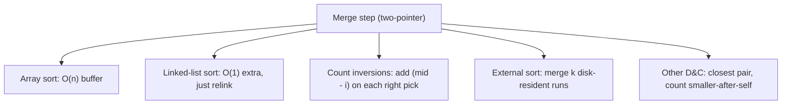

# Merge Sort (The Canonical Divide-and-Conquer Algorithm) — Middle Level

> **Focus:** Why merge sort's `O(n log n)` is a *guarantee* not an average, how top-down and bottom-up variants differ, the `O(1)`-extra-space linked-list merge sort, counting inversions for free in the merge, natural merge sort on existing runs, and a careful comparison with quicksort.

---

## Table of Contents

1. [Introduction](#introduction)
2. [Deeper Concepts](#deeper-concepts)
3. [Comparison with Alternatives](#comparison-with-alternatives)
4. [Advanced Patterns](#advanced-patterns)
5. [Linked-List and Inversion Applications](#linked-list-and-inversion-applications)
6. [Natural Merge Sort and Runs](#natural-merge-sort-and-runs)
7. [Code Examples](#code-examples)
8. [Error Handling](#error-handling)
9. [Performance Analysis](#performance-analysis)
10. [Best Practices](#best-practices)
11. [Visual Animation](#visual-animation)
12. [Summary](#summary)

---

## Introduction

At junior level the message was a single recipe: split, sort halves, merge, and it is `O(n log n)`. At middle level you start asking the engineering questions that decide whether your merge sort is the *right* sort and a *good* implementation:

- Why is merge sort's `O(n log n)` true in the worst case, while quicksort's is only true on average?
- When should you choose **top-down** (recursive) vs **bottom-up** (iterative) merge sort?
- How do you merge a **linked list** in `O(n log n)` time with only `O(1)` extra space — no buffer at all?
- How does the merge step count **inversions** (a measure of disorder) for free?
- What is **natural merge sort**, and why is it fast on nearly-sorted data?
- When does quicksort beat merge sort, and when is the reverse true?

These are the questions that separate "I memorized the recursion" from "I can pick and tune the right sort for the data in front of me."

---

## Deeper Concepts

### The merge invariant, restated

Let `merge(L, R)` combine two sorted lists. The loop maintains an invariant: at every step, everything already written to `out` is sorted and `≤` both `L[i]` and `R[j]` (the two unconsumed fronts). Because we always copy the smaller front, the output stays sorted, and because each element is copied exactly once, the cost is `Θ(|L| + |R|)`. This per-merge linearity is the load-bearing fact behind the whole recurrence.

### The recurrence and why halving gives `log n`

The work is captured by:

```
T(n) = 2·T(n/2) + Θ(n)        (two halves + linear merge)
T(1) = Θ(1)                    (base case)
```

Expanding (the **recursion tree**): level 0 does `n` work; level 1 has two nodes of `n/2`, total `n`; level 2 has four nodes of `n/4`, total `n`; … every level totals `Θ(n)`. There are `log₂ n + 1` levels. So `T(n) = Θ(n) · (log₂ n + 1) = Θ(n log n)`. The **Master Theorem** (case 2: `a = 2`, `b = 2`, `f(n) = Θ(n) = Θ(n^{log_b a})`) gives the same answer in one line, proved in [`professional.md`](./professional.md).

### Exact comparison count

Merge sort does at most `n·⌈log₂ n⌉ − 2^{⌈log₂ n⌉} + 1` comparisons in the worst case — within a small constant of the information-theoretic lower bound `log₂(n!) ≈ n log₂ n − 1.44n`. In practice it does **fewer comparisons** than quicksort but **more data moves** (because of the copy to/from the buffer). This is why merge sort wins when comparisons are expensive (e.g., comparing long strings or objects) and loses when moves dominate (small primitive arrays in cache).

### Stability is a design choice, not an accident

Taking from the **left** run on ties (`L[i] <= R[j]`) makes merge sort stable. This is not free for every algorithm — quicksort and heapsort are *not* naturally stable. Stability is why merge sort underlies many language-standard sorts (Python's Timsort, Java's `Arrays.sort` for objects) — those libraries promise stability, and a merge-based algorithm is the cheapest way to deliver it with an `O(n log n)` guarantee.

---

## Comparison with Alternatives

### Merge sort vs quicksort vs heapsort

| Property | Merge sort | Quicksort | Heapsort |
|----------|-----------|-----------|----------|
| Worst-case time | **`O(n log n)`** (guaranteed) | `O(n²)` (rare, but real) | `O(n log n)` |
| Average time | `O(n log n)` | `O(n log n)` (fast constants) | `O(n log n)` |
| Auxiliary space | `O(n)` (array); `O(1)` (list) | `O(log n)` stack (in-place) | `O(1)` |
| Stable? | **Yes** | No (not naturally) | No |
| Cache behavior | Moderate (buffer copies) | **Excellent** (in-place, local) | Poor (heap jumps) |
| Adaptive (fast on sorted)? | Only with natural/run tricks | No (often worst case) | No |
| Best for | linked lists, external, stability, guarantees | in-RAM arrays, average speed | space-tight + guarantee |

The short version: **quicksort is usually faster in RAM on arrays** because it is in-place and cache-friendly, but its worst case is `O(n²)`. **Merge sort is the safe choice** when you need a guarantee, stability, linked lists, or external sorting. **Heapsort** is the pick when you need a worst-case `O(n log n)` *and* `O(1)` space but do not need stability.

### When merge sort specifically wins

| Need | Why merge sort |
|------|----------------|
| Stable sort of objects with a secondary order | Merge is the natural stable `O(n log n)` sort. |
| Sorting a linked list | `O(1)` extra space; no random access needed (quicksort needs random access). |
| Data larger than RAM | External merge sort: sort chunks, merge streams from disk. |
| Hard real-time / SLA on worst case | No `O(n²)` cliff, unlike quicksort. |
| Counting inversions / certain D&C problems | The merge step yields the count for free. |
| Easy parallelism | Independent halves sort concurrently. |

### Top-down vs bottom-up

| Aspect | Top-down (recursive) | Bottom-up (iterative) |
|--------|----------------------|------------------------|
| Control flow | recursion | nested loops, doubling width |
| Stack usage | `O(log n)` | `O(1)` |
| Readability | clearer "divide and conquer" | a bit more index bookkeeping |
| Cutoff to insertion sort | easy | easy (per run) |
| Natural-run optimization | awkward | natural fit |
| Typical use | general code | very large arrays, embedded, GPU-style passes |

Both are `O(n log n)` and do the same merges in the same order of sizes — they differ only in *how the merges are scheduled*.

---

## Advanced Patterns

### Pattern: Ping-pong buffers (avoid copy-back)

The naive merge writes into a buffer then copies back into the source every level — that copy-back is `n` extra moves per level, `n log n` total. **Ping-pong** alternates roles: merge from `src` into `dst`, then swap the references so `dst` becomes the next `src`. After `log n` passes, ensure the final sorted data ends up in the original array (copy once if the parity is wrong).

#### Go

```go
package main

import "fmt"

// Bottom-up merge sort with ping-pong buffers.
func MergeSort(a []int) {
	n := len(a)
	if n <= 1 {
		return
	}
	src := a
	dst := make([]int, n)
	for width := 1; width < n; width *= 2 {
		for lo := 0; lo < n; lo += 2 * width {
			mid := min(lo+width, n)
			hi := min(lo+2*width, n)
			mergeInto(src, dst, lo, mid, hi)
		}
		src, dst = dst, src // ping-pong
	}
	if &src[0] != &a[0] { // ensure result lands in a
		copy(a, src)
	}
}

func mergeInto(src, dst []int, lo, mid, hi int) {
	i, j, k := lo, mid, lo
	for i < mid && j < hi {
		if src[i] <= src[j] {
			dst[k] = src[i]
			i++
		} else {
			dst[k] = src[j]
			j++
		}
		k++
	}
	for i < mid {
		dst[k] = src[i]
		i++
		k++
	}
	for j < hi {
		dst[k] = src[j]
		j++
		k++
	}
}

func min(a, b int) int { if a < b { return a }; return b }

func main() {
	a := []int{5, 2, 4, 7, 1, 3, 2, 6}
	MergeSort(a)
	fmt.Println(a) // [1 2 2 3 4 5 6 7]
}
```

#### Java

```java
import java.util.Arrays;

public class MergeSortPingPong {
    public static void sort(int[] a) {
        int n = a.length;
        if (n <= 1) return;
        int[] src = a, dst = new int[n];
        for (int width = 1; width < n; width *= 2) {
            for (int lo = 0; lo < n; lo += 2 * width) {
                int mid = Math.min(lo + width, n);
                int hi = Math.min(lo + 2 * width, n);
                mergeInto(src, dst, lo, mid, hi);
            }
            int[] t = src; src = dst; dst = t; // ping-pong
        }
        if (src != a) System.arraycopy(src, 0, a, 0, n);
    }

    static void mergeInto(int[] src, int[] dst, int lo, int mid, int hi) {
        int i = lo, j = mid, k = lo;
        while (i < mid && j < hi)
            dst[k++] = (src[i] <= src[j]) ? src[i++] : src[j++];
        while (i < mid) dst[k++] = src[i++];
        while (j < hi)  dst[k++] = src[j++];
    }

    public static void main(String[] args) {
        int[] a = {5, 2, 4, 7, 1, 3, 2, 6};
        sort(a);
        System.out.println(Arrays.toString(a));
    }
}
```

#### Python

```python
def merge_sort(a):
    n = len(a)
    if n <= 1:
        return a
    src, dst = a, [0] * n
    width = 1
    while width < n:
        for lo in range(0, n, 2 * width):
            mid = min(lo + width, n)
            hi = min(lo + 2 * width, n)
            _merge_into(src, dst, lo, mid, hi)
        src, dst = dst, src        # ping-pong
        width *= 2
    if src is not a:               # land the result back in a
        a[:] = src
    return a


def _merge_into(src, dst, lo, mid, hi):
    i, j, k = lo, mid, lo
    while i < mid and j < hi:
        if src[i] <= src[j]:
            dst[k] = src[i]; i += 1
        else:
            dst[k] = src[j]; j += 1
        k += 1
    while i < mid:
        dst[k] = src[i]; i += 1; k += 1
    while j < hi:
        dst[k] = src[j]; j += 1; k += 1


if __name__ == "__main__":
    print(merge_sort([5, 2, 4, 7, 1, 3, 2, 6]))
```

### Pattern: Insertion-sort cutoff

For small runs (length `≤ ~16`), recursion and merging overhead exceed a simple insertion sort. Sort tiny runs with insertion sort, then merge upward. This is a constant-factor win used by essentially every production merge sort (and by Timsort, whose minimum run length is 32–64).

### Pattern: Skip the merge when already ordered

If `a[mid-1] <= a[mid]`, the two sorted halves are already in global order — skip the merge entirely. This single `if` makes already-sorted input cost `O(n)` per level of *comparison* (still `O(n log n)` to walk, but no data movement), and is the seed of natural merge sort.

---

## Linked-List and Inversion Applications



### Linked-list merge sort — `O(1)` extra space

On a linked list there is no buffer to allocate: merging two sorted lists just **re-points** `next` links. Splitting uses the slow/fast pointer trick to find the middle. The result is a genuinely `O(1)`-extra-space `O(n log n)` stable sort — merge sort's killer application.

```python
class Node:
    def __init__(self, val, nxt=None):
        self.val = val
        self.next = nxt


def sort_list(head):
    if head is None or head.next is None:
        return head
    # split with slow/fast pointers
    slow, fast = head, head.next
    while fast and fast.next:
        slow = slow.next
        fast = fast.next.next
    mid = slow.next
    slow.next = None                  # cut the list in two
    left = sort_list(head)
    right = sort_list(mid)
    return _merge_lists(left, right)


def _merge_lists(a, b):
    dummy = Node(0)
    tail = dummy
    while a and b:
        if a.val <= b.val:            # "<=" keeps it stable
            tail.next = a; a = a.next
        else:
            tail.next = b; b = b.next
        tail = tail.next
    tail.next = a if a else b         # attach the remaining run
    return dummy.next
```

### Counting inversions in the merge

An **inversion** is a pair `(i, j)` with `i < j` but `a[i] > a[j]`. The number of inversions measures how far the array is from sorted (0 means sorted, `n(n-1)/2` means reverse-sorted). When merging, every time you take an element from the **right** half, it is smaller than *all remaining* elements in the left half — so it forms an inversion with each of them. Adding `(mid − i)` at that moment counts them all in `O(n log n)` total.

```python
def count_inversions(a):
    buf = [0] * len(a)
    return _ci(a, 0, len(a), buf)


def _ci(a, lo, hi, buf):
    if hi - lo <= 1:
        return 0
    mid = (lo + hi) // 2
    inv = _ci(a, lo, mid, buf) + _ci(a, mid, hi, buf)
    i, j, k = lo, mid, lo
    while i < mid and j < hi:
        if a[i] <= a[j]:
            buf[k] = a[i]; i += 1
        else:
            inv += mid - i            # a[j] is smaller than all of a[i:mid]
            buf[k] = a[j]; j += 1
        k += 1
    while i < mid:
        buf[k] = a[i]; i += 1; k += 1
    while j < hi:
        buf[k] = a[j]; j += 1; k += 1
    a[lo:hi] = buf[lo:hi]
    return inv
```

This is a classic interview problem ("count smaller numbers after self", "reverse pairs") and a textbook divide-and-conquer application.

---

## Natural Merge Sort and Runs

A **run** is a maximal already-sorted stretch of the array. Random data has many short runs; nearly-sorted data has a few long ones. **Natural merge sort** exploits existing runs instead of starting from size-1 pieces:

1. Scan the array, identifying maximal ascending runs.
2. Merge adjacent runs pairwise, repeatedly, until one run remains.

On already-sorted input there is a single run, so natural merge sort finishes in **`O(n)`** (one scan, no merges). On random input it degrades gracefully to `O(n log n)`. This adaptivity is the core idea behind **Timsort** (Python's and Java's default object sort), which additionally uses galloping merges and a run-length stack with careful merge-balancing invariants.

```python
def natural_merge_sort(a):
    n = len(a)
    if n <= 1:
        return a
    buf = [0] * n
    while True:
        # gather run boundaries
        runs, i = [0], 0
        while i < n - 1:
            j = i
            while j < n - 1 and a[j] <= a[j + 1]:
                j += 1
            runs.append(j + 1)
            i = j + 1
        if runs[-1] != n:
            runs.append(n)
        if len(runs) <= 2:            # whole array is one run → sorted
            return a
        # merge adjacent runs pairwise
        for r in range(0, len(runs) - 2, 2):
            lo, mid = runs[r], runs[r + 1]
            hi = runs[r + 2] if r + 2 < len(runs) else n
            _merge_into_same(a, buf, lo, mid, hi)


def _merge_into_same(a, buf, lo, mid, hi):
    i, j, k = lo, mid, lo
    while i < mid and j < hi:
        if a[i] <= a[j]:
            buf[k] = a[i]; i += 1
        else:
            buf[k] = a[j]; j += 1
        k += 1
    while i < mid:
        buf[k] = a[i]; i += 1; k += 1
    while j < hi:
        buf[k] = a[j]; j += 1; k += 1
    a[lo:hi] = buf[lo:hi]
```

---

## Code Examples

### Reusable top-down merge sort with cutoff (counting semiring of sorting: comparisons)

This is the same engine as `junior.md`, factored so you can swap in a comparator and a small-run cutoff.

#### Python

```python
CUTOFF = 16


def insertion_sort(a, lo, hi):
    for i in range(lo + 1, hi):
        x, j = a[i], i - 1
        while j >= lo and a[j] > x:
            a[j + 1] = a[j]
            j -= 1
        a[j + 1] = x


def merge_sort(a, key=lambda x: x):
    buf = [0] * len(a)

    def rec(lo, hi):
        if hi - lo <= CUTOFF:
            insertion_sort(a, lo, hi)   # small-run cutoff
            return
        mid = (lo + hi) // 2
        rec(lo, mid)
        rec(mid, hi)
        if key(a[mid - 1]) <= key(a[mid]):
            return                      # already ordered → skip merge
        i, j, k = lo, mid, lo
        while i < mid and j < hi:
            if key(a[i]) <= key(a[j]):
                buf[k] = a[i]; i += 1
            else:
                buf[k] = a[j]; j += 1
            k += 1
        while i < mid:
            buf[k] = a[i]; i += 1; k += 1
        while j < hi:
            buf[k] = a[j]; j += 1; k += 1
        a[lo:hi] = buf[lo:hi]

    if a:
        rec(0, len(a))
    return a
```

---

## Error Handling

| Scenario | What goes wrong | Correct approach |
|----------|-----------------|------------------|
| Stability silently lost | Used `<` instead of `<=` in merge. | Always take from the **left** run on ties. |
| Dropped or duplicated elements | Forgot to drain one half's leftover tail. | Copy both remaining tails after the main loop. |
| Ping-pong leaves data in wrong buffer | Odd number of passes ends in the scratch array. | Check parity; copy back once if needed. |
| Linked-list cycle / lost nodes | Forgot to `slow.next = None` when splitting. | Cut the list before recursing on the two halves. |
| Inversion count overflows | `n(n-1)/2` exceeds 32-bit for large `n`. | Use 64-bit (`int64`/`long`) for the counter. |
| Natural sort never terminates | Run-collection loop does not shrink run count. | Ensure each pass merges adjacent runs (halving count). |
| Stack overflow on huge input | Deep top-down recursion. | Use bottom-up, or increase stack, or cut off early. |

---

## Performance Analysis

| `n` | Comparisons ≈ `n log₂ n` | Levels `log₂ n` | Notes |
|-----|--------------------------|------------------|-------|
| 16 | ~64 | 4 | cutoff to insertion sort here helps |
| 1 024 | ~10 240 | 10 | buffer = `O(n)`; copies dominate constant |
| 1 000 000 | ~20 M | 20 | `O(n)` buffer = a few MB |
| 100 000 000 | ~2.66 B | ~27 | consider external sort if it spills RAM |

The dominant cost is the `n` work per level times `log n` levels. The **constant factor** is set by data movement: standard merge sort moves each element `O(log n)` times (into and out of the buffer). Ping-pong halves the copy-backs; cutoff shaves the bottom levels; natural runs shrink the level count on ordered data.

```python
import random, time

def benchmark(n):
    a = [random.randint(0, 10**9) for _ in range(n)]
    start = time.perf_counter()
    merge_sort(a)
    return time.perf_counter() - start

# Typical: pure-Python merge sort is ~5-15x slower than sorted() (C Timsort),
# but the asymptotics and ordering match exactly.
```

The biggest practical constant-factor wins are: allocate the buffer once, ping-pong to avoid copy-backs, cut off to insertion sort below ~16, and skip the merge when `a[mid-1] <= a[mid]`.

| Optimization | Effect | When it matters |
|--------------|--------|-----------------|
| Buffer allocated once | removes `O(n log n)` allocations | always (GC-managed languages especially) |
| Ping-pong buffers | ~halves data moves | move-bound (primitive arrays) |
| Insertion cutoff (~16) | removes leaf-level recursion overhead | always; ~10–20% on random data |
| Merge-skip if ordered | `O(n)` on sorted input | nearly-sorted / appended data |
| Natural runs | `O(n log r)` in run count `r` | partially-ordered real-world data |

---

## Best Practices

- **Pick the variant deliberately:** recursive top-down for clarity; bottom-up for huge arrays / no deep stack; natural for adaptive speed on ordered data; linked-list for `O(1)` extra space.
- **Keep the merge stable** (`<=` on the left) — it is the property that makes merge sort uniquely valuable.
- **Allocate one buffer** and reuse it; never allocate per merge.
- **Cut off to insertion sort** below ~16 elements.
- **Use 64-bit counters** when counting inversions.
- **Test against a library sort** on random arrays of many sizes, and verify stability with keyed records.

---

## Visual Animation

> See [`animation.html`](./animation.html) for an interactive view.
>
> The middle-level animation highlights:
> - The recursion tree splitting the array, then the merges rebuilding sorted runs bottom-up.
> - The two-pointer merge, showing the compared fronts and which is taken (left vs right).
> - How taking from the right run corresponds to counting inversions.

---

## Summary

Merge sort's `O(n log n)` is a **worst-case guarantee** — the recursion tree has `log n` levels each doing `O(n)` merge work, regardless of input order, which is why it has no `O(n²)` cliff like quicksort. It is **stable** when the merge prefers the left run on ties, which is why it underlies stable library sorts. Its variants matter: **top-down** is clean recursion, **bottom-up** avoids the stack, **natural merge sort** runs in `O(n)` on already-sorted data by exploiting existing runs (the heart of Timsort), and **linked-list merge sort** achieves `O(1)` extra space by relinking instead of copying. The merge step is reusable far beyond sorting — counting **inversions** falls out of it for free. Choose merge sort for guarantees, stability, linked lists, and external/huge data; choose quicksort when in-place cache-friendly array speed matters more than the worst-case guarantee.
