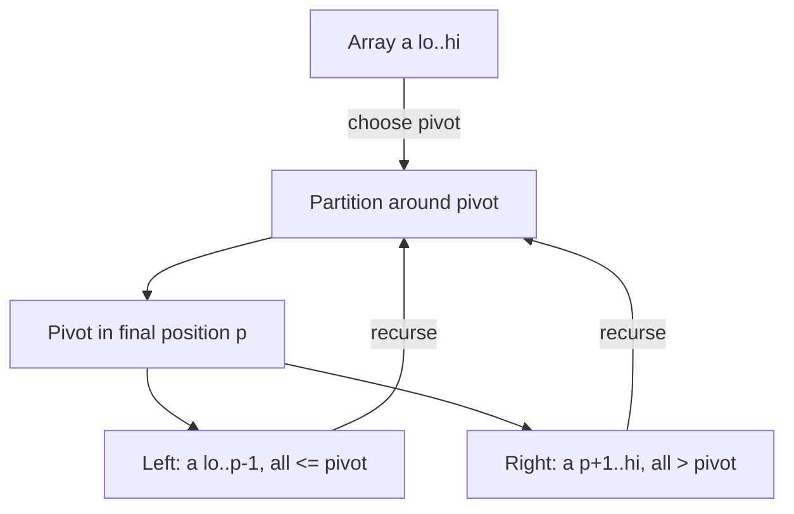

# Quicksort (Divide and Conquer by Partitioning) — Junior Level

> **One-line summary:** Quicksort sorts an array by **partitioning** it around a chosen **pivot** — moving smaller elements left and larger elements right — then recursively sorting the two sides. With a good pivot it runs in average `O(n log n)` time, in place, but a bad pivot can degrade it to `O(n²)`.

---

## Table of Contents

1. [Introduction](#introduction)
2. [Prerequisites](#prerequisites)
3. [Glossary](#glossary)
4. [Core Concepts](#core-concepts)
5. [Big-O Summary](#big-o-summary)
6. [Real-World Analogies](#real-world-analogies)
7. [Pros & Cons](#pros--cons)
8. [Step-by-Step Walkthrough](#step-by-step-walkthrough)
9. [Code Examples](#code-examples)
10. [Coding Patterns](#coding-patterns)
11. [Error Handling](#error-handling)
12. [Performance Tips](#performance-tips)
13. [Best Practices](#best-practices)
14. [Edge Cases & Pitfalls](#edge-cases--pitfalls)
15. [Common Mistakes](#common-mistakes)
16. [Cheat Sheet](#cheat-sheet)
17. [Visual Animation](#visual-animation)
18. [Summary](#summary)
19. [Further Reading](#further-reading)

---

## Introduction

Suppose you have a stack of exam papers in a random order and want them sorted by score. One natural strategy: grab one paper — call it the **pivot** — and split the rest into two piles, "scores below the pivot" and "scores above the pivot." Now place the pivot between the two piles. The pivot is already in its final sorted position. Then repeat the same trick on each pile. When every pile has shrunk to a single paper, the whole stack is sorted.

That is **quicksort**, one of the most important sorting algorithms ever invented (Tony Hoare, 1959–1961). It is a **divide-and-conquer** algorithm, and the "divide" step is where all the work happens:

> **Pick a pivot, then *partition* the array so everything `≤ pivot` comes before everything `> pivot`. The pivot lands in its final sorted slot. Recurse on the two sides.**

Unlike merge sort (sibling topic `01-merge-sort`), which does its hard work *combining* sorted halves, quicksort does its hard work *splitting*. After the partition there is **no merge step at all** — the two sorted halves are already in the right places because the pivot sits between them. This is why quicksort can sort **in place**, using only `O(log n)` extra memory for the recursion, while merge sort typically needs `O(n)` extra space.

The catch is the pivot. If you keep picking pivots that split the array nicely in half, each level of recursion halves the problem and you do `O(n)` partitioning work across `log n` levels — total `O(n log n)`. But if you keep picking pivots that are the smallest (or largest) element — for example, always picking the first element on an already-sorted array — each partition peels off just one element, you get `n` levels of recursion, and the cost balloons to `O(n²)`. Choosing the pivot well (randomly, or by median-of-three) is the single most important practical decision in quicksort, and we will return to it again and again.

Quicksort is everywhere: it is the basis of C's `qsort`, the workhorse inside many standard-library sorts (often as part of a hybrid called **introsort**), and its cousin **quickselect** finds the k-th smallest element in expected `O(n)` time. Master quicksort and you understand partitioning, recursion, randomization, and the gap between average and worst case — a bundle of ideas that recur throughout algorithms.

---

## Prerequisites

Before reading this file you should be comfortable with:

- **Arrays and in-place swaps** — `swap(a, i, j)` exchanges two elements; quicksort rearranges the array by swapping, not by copying into new arrays.
- **Recursion** — a function that calls itself on smaller sub-ranges, with a base case that stops it.
- **Comparisons** — quicksort is a *comparison sort*; it only ever asks "is `a < b`?".
- **Big-O notation** — `O(n)`, `O(n log n)`, `O(n²)`, and what "average case" vs "worst case" mean.
- **Index ranges** — working with a subarray `a[lo..hi]` (inclusive) by passing `lo` and `hi` indices.

Optional but helpful:

- A glance at **merge sort** (`01-merge-sort`) for contrast: stable, `O(n log n)` guaranteed, but `O(n)` extra space.
- Familiarity with **stack depth** and why deep recursion can overflow the call stack.

---

## Glossary

| Term | Meaning |
|------|---------|
| **Pivot** | The element chosen to partition around. Everything `≤ pivot` goes left, everything `> pivot` goes right. |
| **Partition** | The step that rearranges a subarray around the pivot and returns the pivot's final index. The heart of quicksort. |
| **Lomuto partition** | A simple partition scheme using one moving boundary index; pivot is usually the last element. |
| **Hoare partition** | The original partition scheme using two pointers moving toward each other; fewer swaps, but returns a split point (not the pivot's final index). |
| **Pivot index (partition point)** | The index where the pivot ends up after Lomuto partition; it is in its final sorted position. |
| **In-place** | Sorts within the original array using only `O(log n)` extra memory (for recursion), not a second array. |
| **Stable sort** | A sort that preserves the relative order of equal elements. Quicksort is **not** stable. |
| **Recursion depth** | How many nested recursive calls are active at once; equals the stack space used. |
| **Three-way partition** | Splits into `< pivot`, `== pivot`, `> pivot` (Dutch National Flag); great when many keys are equal. |
| **Quickselect** | A quicksort variant that recurses into only *one* side to find the k-th smallest element in expected `O(n)`. |

---

## Core Concepts

### 1. Divide and Conquer Without a Merge

Quicksort follows the classic divide-and-conquer template, but the work distribution is the opposite of merge sort:

```
quicksort(a, lo, hi):
    if lo >= hi: return            # 0 or 1 element is already sorted
    p = partition(a, lo, hi)       # DIVIDE: pivot lands at index p
    quicksort(a, lo, p - 1)        # CONQUER left side
    quicksort(a, p + 1, hi)        # CONQUER right side
    # no COMBINE step — the array is already sorted!
```

Because the partition places the pivot in its **final** position and guarantees left `≤ pivot ≤` right, once both sides are sorted the whole range is sorted. There is nothing to merge.

### 2. The Partition Step (Lomuto)

The simplest partition is **Lomuto's scheme**. Choose the last element as the pivot. Walk an index `j` across the subarray; keep a boundary `i` marking the end of the "small" region (elements `≤ pivot`). Whenever `a[j] ≤ pivot`, grow the small region by swapping `a[j]` into it. Finally, swap the pivot into place just after the small region.

```
partition(a, lo, hi):            # Lomuto, pivot = a[hi]
    pivot = a[hi]
    i = lo - 1                   # i = last index of the "<= pivot" region
    for j = lo to hi - 1:
        if a[j] <= pivot:
            i = i + 1
            swap(a[i], a[j])
    swap(a[i+1], a[hi])          # put pivot just after the small region
    return i + 1                 # pivot's final index
```

The **invariant** is: everything in `a[lo..i]` is `≤ pivot`, and everything in `a[i+1..j-1]` is `> pivot`. When the loop ends, swapping the pivot to `i+1` completes the split.

### 3. Pivot Selection Decides Everything

The pivot's quality controls the running time:

- **Good pivot (near the median):** splits the array roughly in half → `O(n log n)`.
- **Bad pivot (near the min or max):** one side is empty, the other has `n-1` elements → `O(n²)`.

Common strategies:

| Strategy | Idea | Risk |
|----------|------|------|
| First / last element | Cheap, no extra work. | `O(n²)` on already-sorted or reverse-sorted input. |
| Random element | Pick a random index, swap it to the end. | Worst case is now astronomically unlikely. |
| Median-of-three | Median of first, middle, last. | Cheap, avoids the sorted-input trap; still has rare bad cases. |

For a junior, the key takeaway: **never use a fixed first/last pivot on data that might already be sorted.** Randomize or use median-of-three.

### 4. Why It Is In-Place and Uses O(log n) Stack

Quicksort rearranges the array by swapping, so it needs no second array. The only extra memory is the recursion stack. With balanced splits the recursion is `O(log n)` deep, so the stack space is `O(log n)`. (With bad splits the depth can reach `O(n)` — another reason to keep pivots good, and a problem we fix with *tail-call elimination* at the middle level.)

### 5. Quicksort Is Not Stable

Equal elements can be reordered by the swaps in the partition. If you have records that compare equal on the sort key but whose original order matters, plain quicksort will not preserve it. (Merge sort *is* stable; that is one of its advantages.) You can make quicksort stable by tagging each element with its original index, at the cost of extra memory.

### 6. Average vs Worst Case

This is the defining tension of quicksort:

- **Average case: `O(n log n)`** — over random inputs (or with a random pivot), the splits are balanced *on average*, even though individual splits vary.
- **Worst case: `O(n²)`** — a sequence of maximally unbalanced splits.

The genius of **randomized quicksort** is that it makes the worst case depend on the random coin flips, not on the input. An adversary who knows your code can no longer hand you a slow input, because *they* do not control the random pivot choices.

---

## Big-O Summary

| Operation | Time | Space | Notes |
|-----------|------|-------|-------|
| Quicksort, **average** | **O(n log n)** | O(log n) | Balanced splits on average. |
| Quicksort, **best** | O(n log n) | O(log n) | Perfectly balanced splits. |
| Quicksort, **worst** | **O(n²)** | O(n) stack | Maximally unbalanced splits (bad pivots). |
| Partition (one pass) | O(n) | O(1) | Single linear scan of the subarray. |
| Randomized quicksort, expected | **O(n log n)** | O(log n) | Worst case independent of input. |
| Quickselect (k-th element), expected | **O(n)** | O(1)–O(log n) | Recurse into only one side. |
| Quickselect, worst | O(n²) | — | Fixed by median-of-medians → O(n) worst. |

The headline numbers: **average `O(n log n)`**, **worst `O(n²)`**, **in-place** with `O(log n)` recursion. The whole engineering game is keeping the average case and avoiding the worst.

---

## Real-World Analogies

| Concept | Analogy |
|---------|---------|
| Pivot | A "reference price" at an auction: bids below it go to one room, bids above it to another. |
| Partition | Sorting mail into two bins, "before letter M" and "after letter M," in a single pass down the pile. |
| Recursion on both sides | Each bin is handed to another sorter who applies the exact same rule with a new reference letter. |
| Bad pivot | Choosing "before letter A" as the split — everything lands in one bin and nothing is divided. |
| Random pivot | Closing your eyes and grabbing a random letter to split on, so no one can rig the pile against you. |
| Quickselect | You only need the 100th-ranked bid, so you only ever re-sort the bin that contains rank 100. |

Where the analogy breaks: real mail-sorting bins are separate physical containers, but quicksort does all of this *inside one array* by swapping, never allocating new bins.

---

## Pros & Cons

| Pros | Cons |
|------|------|
| Average `O(n log n)`, with small constant factors — often the fastest comparison sort in practice. | Worst case `O(n²)` if the pivot is chosen badly. |
| **In place**: `O(log n)` extra memory, no second array (unlike merge sort). | **Not stable**: equal elements may be reordered. |
| Cache-friendly: partitioning scans the array sequentially. | Naive (fixed-pivot) versions are slow on already-sorted input. |
| Easy to randomize, making the worst case astronomically rare. | Deep recursion on bad splits can overflow the stack (fixable). |
| Adapts to **quickselect** for k-th-order statistics in expected `O(n)`. | Performance varies with the data and the pivot rule — needs care. |

**When to use:** general-purpose in-memory sorting where average speed and low memory matter, and stability is not required; finding order statistics (quickselect); as the core of a hybrid like introsort.

**When NOT to use:** when you need stability (use merge sort), when you need a *guaranteed* `O(n log n)` worst case (use merge sort or heapsort), or when sorting linked lists (merge sort suits those better).

---

## Step-by-Step Walkthrough

Sort `[3, 7, 8, 5, 2, 1, 9, 5, 4]` with **Lomuto partition**, pivot = last element.

**First partition** over the whole array, pivot = `4` (the last element). Walk `j` left to right; `i` tracks the end of the `≤ 4` region (starts at `lo-1 = -1`).

```
pivot = 4
start: i = -1
[3, 7, 8, 5, 2, 1, 9, 5, 4]
 j=0: 3 <= 4 → i=0, swap a[0],a[0]   [3, 7, 8, 5, 2, 1, 9, 5, 4]
 j=1: 7 > 4  → skip
 j=2: 8 > 4  → skip
 j=3: 5 > 4  → skip
 j=4: 2 <= 4 → i=1, swap a[1],a[4]   [3, 2, 8, 5, 7, 1, 9, 5, 4]
 j=5: 1 <= 4 → i=2, swap a[2],a[5]   [3, 2, 1, 5, 7, 8, 9, 5, 4]
 j=6: 9 > 4  → skip
 j=7: 5 > 4  → skip
end: swap pivot a[i+1]=a[3] with a[hi]=a[8]
     [3, 2, 1, 4, 7, 8, 9, 5, 5]
return p = 3
```

The pivot `4` is now at index 3, in its **final** sorted position. Everything to its left (`3, 2, 1`) is `≤ 4`; everything to its right (`7, 8, 9, 5, 5`) is `> 4`.

**Recurse left** on `[3, 2, 1]` (indices 0–2), pivot = `1`:

```
pivot = 1, nothing is <= 1 except itself
[3, 2, 1] → swap pivot to front → [1, 2, 3]   pivot 1 at index 0
recurse left of 1: empty
recurse right [2, 3]: pivot 3 → already in place → recurse [2]: done
left side sorted: [1, 2, 3]
```

**Recurse right** on `[7, 8, 9, 5, 5]` (indices 4–8), pivot = `5` (last). After partition the two `5`s and everything `≤ 5` move left, `7, 8, 9` stay right, and recursion finishes each side. The right side sorts to `[5, 5, 7, 8, 9]`.

**Final array:** `[1, 2, 3, 4, 5, 5, 7, 8, 9]`. Sorted. Notice the pivot at each level never moved again — each partition permanently places at least one element.

---

## Code Examples

### Example: Quicksort with Lomuto Partition (Randomized Pivot)

This sorts an integer slice/array/list in place using Lomuto partition and a **random pivot** to avoid the sorted-input worst case.

#### Go

```go
package main

import (
	"fmt"
	"math/rand"
)

// partition uses Lomuto's scheme with a[hi] as pivot, returns pivot's final index.
func partition(a []int, lo, hi int) int {
	pivot := a[hi]
	i := lo - 1
	for j := lo; j < hi; j++ {
		if a[j] <= pivot {
			i++
			a[i], a[j] = a[j], a[i]
		}
	}
	a[i+1], a[hi] = a[hi], a[i+1]
	return i + 1
}

func quicksort(a []int, lo, hi int) {
	if lo >= hi {
		return // 0 or 1 element: already sorted
	}
	// randomize pivot: swap a random element to the end
	r := lo + rand.Intn(hi-lo+1)
	a[r], a[hi] = a[hi], a[r]
	p := partition(a, lo, hi)
	quicksort(a, lo, p-1)
	quicksort(a, p+1, hi)
}

func Sort(a []int) {
	quicksort(a, 0, len(a)-1)
}

func main() {
	a := []int{3, 7, 8, 5, 2, 1, 9, 5, 4}
	Sort(a)
	fmt.Println(a) // [1 2 3 4 5 5 7 8 9]
}
```

#### Java

```java
import java.util.Random;

public class Quicksort {
    static final Random rng = new Random();

    static int partition(int[] a, int lo, int hi) {
        int pivot = a[hi];
        int i = lo - 1;
        for (int j = lo; j < hi; j++) {
            if (a[j] <= pivot) {
                i++;
                int tmp = a[i]; a[i] = a[j]; a[j] = tmp;
            }
        }
        int tmp = a[i + 1]; a[i + 1] = a[hi]; a[hi] = tmp;
        return i + 1;
    }

    static void quicksort(int[] a, int lo, int hi) {
        if (lo >= hi) return;
        int r = lo + rng.nextInt(hi - lo + 1);
        int t = a[r]; a[r] = a[hi]; a[hi] = t;   // randomize pivot
        int p = partition(a, lo, hi);
        quicksort(a, lo, p - 1);
        quicksort(a, p + 1, hi);
    }

    public static void sort(int[] a) {
        quicksort(a, 0, a.length - 1);
    }

    public static void main(String[] args) {
        int[] a = {3, 7, 8, 5, 2, 1, 9, 5, 4};
        sort(a);
        System.out.println(java.util.Arrays.toString(a)); // [1, 2, 3, 4, 5, 5, 7, 8, 9]
    }
}
```

#### Python

```python
import random


def partition(a, lo, hi):
    """Lomuto partition with a[hi] as pivot; returns pivot's final index."""
    pivot = a[hi]
    i = lo - 1
    for j in range(lo, hi):
        if a[j] <= pivot:
            i += 1
            a[i], a[j] = a[j], a[i]
    a[i + 1], a[hi] = a[hi], a[i + 1]
    return i + 1


def quicksort(a, lo, hi):
    if lo >= hi:
        return                       # 0 or 1 element: already sorted
    r = random.randint(lo, hi)       # randomize pivot
    a[r], a[hi] = a[hi], a[r]
    p = partition(a, lo, hi)
    quicksort(a, lo, p - 1)
    quicksort(a, p + 1, hi)


def sort(a):
    quicksort(a, 0, len(a) - 1)


if __name__ == "__main__":
    a = [3, 7, 8, 5, 2, 1, 9, 5, 4]
    sort(a)
    print(a)  # [1, 2, 3, 4, 5, 5, 7, 8, 9]
```

**What it does:** sorts a 9-element array in place. The random pivot makes the `O(n²)` worst case astronomically unlikely.
**Run:** `go run main.go` | `javac Quicksort.java && java Quicksort` | `python quicksort.py`

---

## Coding Patterns

### Pattern 1: The Slow-But-Obvious Oracle (test against this)

**Intent:** Before trusting your quicksort, compare it to the language's built-in sort on random inputs.

```python
import random

def check(sort_fn, trials=1000):
    for _ in range(trials):
        a = [random.randint(-50, 50) for _ in range(random.randint(0, 30))]
        expected = sorted(a)         # the oracle: built-in sort
        b = a[:]
        sort_fn(b)
        assert b == expected, (a, b, expected)
    print("all trials passed")
```

The built-in `sorted` is the oracle. Any correct quicksort must agree with it on every input, including empty arrays, duplicates, and already-sorted data.

### Pattern 2: Pivot to the End, Then Partition

**Intent:** Lomuto always pivots on `a[hi]`. To use *any* pivot strategy, **swap your chosen pivot to `hi` first**, then run the standard Lomuto partition. This keeps the partition code unchanged regardless of pivot rule.

```python
def choose_and_partition(a, lo, hi, pick):
    p = pick(a, lo, hi)        # returns an index in [lo, hi]
    a[p], a[hi] = a[hi], a[p]  # move chosen pivot to the end
    return partition(a, lo, hi)
```

### Pattern 3: Recurse Small Side, Loop Large Side (preview)

**Intent:** Always recurse into the **smaller** partition and loop on the larger one. This caps recursion depth at `O(log n)` even on bad splits. (Full treatment in `middle.md` under tail-call elimination.)



---

## Error Handling

| Error | Cause | Fix |
|-------|-------|-----|
| Infinite recursion / stack overflow | Base case wrong (`lo > hi` vs `lo >= hi`) or pivot not placed in final position. | Base case is `if lo >= hi: return`; ensure partition returns the pivot's index. |
| `IndexError` / out-of-bounds | Passing `len(a)` instead of `len(a)-1` as `hi`. | `hi` is the last valid index, inclusive. |
| Never terminates on duplicates | Hoare-style pointers cross incorrectly, or `<` vs `<=` mismatch. | Use a consistent comparison; for many duplicates use three-way partition. |
| `O(n²)` blowup on sorted input | Fixed first/last pivot. | Randomize the pivot or use median-of-three. |
| Wrong result with equal keys | Comparison uses `<` where `<=` is needed (or vice versa). | Lomuto uses `a[j] <= pivot`; keep it consistent. |
| Stack overflow on large `n` | Recursion depth `O(n)` from bad splits. | Recurse into the smaller side, loop on the larger (tail-call elimination). |

---

## Performance Tips

- **Randomize or median-of-three the pivot.** This is the single biggest correctness-of-performance lever; it turns the `O(n²)` worst case from "happens on sorted input" into "essentially never."
- **Cut off to insertion sort for small subarrays.** For ranges of size `≤ 10–16`, insertion sort is faster than recursion overhead. Hybrid sorts do this everywhere.
- **Use three-way partitioning when many keys are equal.** Plain Lomuto wastes time re-partitioning runs of duplicates; Dutch-National-Flag handles them in one pass.
- **Recurse into the smaller partition first** (then loop on the larger) to bound stack depth at `O(log n)`.
- **Partition scans sequentially**, which is cache-friendly — one of the reasons quicksort beats many `O(n log n)` rivals in wall-clock time.

---

## Best Practices

- Always test your quicksort against the built-in sort (Pattern 1) on random inputs that include empty arrays, single elements, all-equal arrays, sorted, and reverse-sorted data.
- Default to a **randomized** pivot (or median-of-three) — never a fixed first/last pivot in production.
- Write `partition` as a separate, independently testable function; most bugs hide there.
- Document that your sort is **not stable**; if stability matters, use merge sort instead.
- Use `lo >= hi` as the base case (handles both 0- and 1-element ranges) and pass inclusive `[lo, hi]` indices consistently.
- For arrays with heavy duplication, reach for three-way partitioning.

---

## Edge Cases & Pitfalls

- **Empty array / single element** — `lo >= hi` returns immediately; both are already sorted.
- **All elements equal** — plain Lomuto degrades to `O(n²)` because every element equals the pivot and the split is maximally unbalanced; three-way partition fixes this to `O(n)`.
- **Already sorted / reverse sorted** — the trap case for fixed first/last pivots; randomize to avoid `O(n²)`.
- **Duplicates of the pivot** — with `a[j] <= pivot`, equal elements go to the left side; that is fine for correctness but can unbalance splits.
- **Two elements** — make sure the partition and recursion handle a 2-element range without infinite looping.
- **Negative numbers / mixed signs** — no special handling needed; comparisons work as usual.
- **Very large arrays** — bad-split recursion depth can overflow the stack; recurse small-side-first.

---

## Common Mistakes

1. **Fixed first/last pivot in production** — guarantees `O(n²)` on sorted or reverse-sorted input. Always randomize or use median-of-three.
2. **Off-by-one base case** — using `lo > hi` only, or recursing on `p` instead of `p-1`/`p+1`, can loop forever or skip elements.
3. **Forgetting the pivot is already placed** — recursing on `lo..p` (including the pivot) instead of `lo..p-1` re-processes the placed pivot and can loop.
4. **Assuming stability** — quicksort reorders equal elements; do not rely on original order.
5. **Mishandling all-equal arrays** — without three-way partitioning, a million identical keys take `O(n²)`.
6. **Using `len(a)` as `hi`** — `hi` must be the last *index*, `len(a)-1`, not the length.
7. **Deep recursion on adversarial input** — without small-side-first recursion (or randomization), the stack can blow up.

---

## Cheat Sheet

| Question | Answer |
|----------|--------|
| Average time | `O(n log n)` |
| Worst time | `O(n²)` (bad pivots) |
| Best time | `O(n log n)` |
| Extra space | `O(log n)` recursion stack |
| Stable? | No |
| In place? | Yes |
| Avoid worst case | Randomize pivot or median-of-three |
| Many duplicates | Three-way (Dutch National Flag) partition |
| k-th smallest | Quickselect, expected `O(n)` |

Core algorithm:

```
quicksort(a, lo, hi):
    if lo >= hi: return
    swap a random index in [lo,hi] to hi      # randomize pivot
    p = partition(a, lo, hi)                   # Lomuto, pivot = a[hi]
    quicksort(a, lo, p - 1)
    quicksort(a, p + 1, hi)
# average O(n log n), worst O(n^2), in place, not stable
```

---

## Visual Animation

> See [`animation.html`](./animation.html) for an interactive visualization.
>
> The animation demonstrates:
> - Choosing a pivot and the Lomuto partition scan with the `i` and `j` pointers highlighted
> - Swaps that grow the `≤ pivot` region and the final swap that places the pivot
> - The recursion tree: how each partition spawns a left and a right subproblem
> - Step / Run / Reset controls to watch one partition (and then the recursion) unfold

---

## Summary

Quicksort sorts by **partitioning**: pick a pivot, rearrange so everything `≤ pivot` is left and everything `> pivot` is right, place the pivot between them (now in its final position), and recurse on both sides. There is no merge step, so it sorts **in place** with only `O(log n)` recursion memory. With a well-chosen pivot the splits are balanced and the cost is `O(n log n)` on average; with a poorly chosen pivot the splits collapse and the cost rises to `O(n²)`. The fixes are simple and essential: **randomize the pivot** (or use median-of-three) to dodge the worst case, **three-way partition** when many keys are equal, and **recurse into the smaller side** to bound stack depth. Quicksort is not stable, but it is fast, memory-light, and the foundation of quickselect and introsort.

---

## Further Reading

- *Introduction to Algorithms* (CLRS) — Chapter 7, Quicksort, including randomized analysis.
- Hoare, C.A.R. (1961) — "Algorithm 64: Quicksort," the original publication.
- Sibling topic `01-merge-sort` — the stable `O(n log n)` divide-and-conquer alternative with a merge step.
- Sibling topic `15-divide-and-conquer/01` — the divide-and-conquer paradigm in general.
- Sedgewick, R. — "Implementing Quicksort Programs" (1978), the classic engineering treatment.
- The `middle.md` file here — partition schemes (Lomuto vs Hoare), three-way partitioning, and quickselect in depth.
