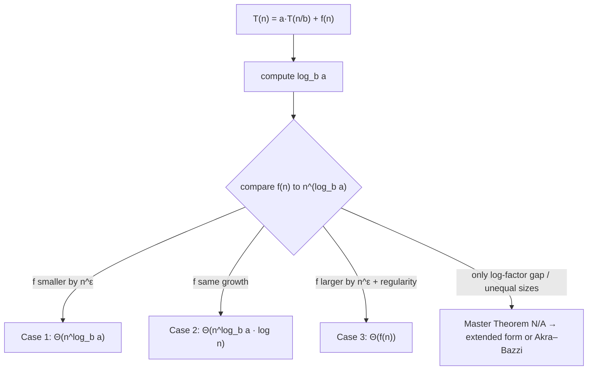

# The Master Theorem — Junior Level

> **One-line summary:** For a divide-and-conquer recurrence `T(n) = a·T(n/b) + f(n)`, compare the *work outside the recursion* `f(n)` against the **watershed function** `n^(log_b a)`. Whichever grows faster wins, and that gives `T(n)` directly — no algebra, no recursion tree, just a three-way comparison.

---

## Table of Contents

1. [Introduction](#introduction)
2. [Prerequisites](#prerequisites)
3. [Glossary](#glossary)
4. [Core Concepts](#core-concepts)
5. [Big-O Summary](#big-o-summary)
6. [Real-World Analogies](#real-world-analogies)
7. [Pros & Cons](#pros--cons)
8. [Step-by-Step Walkthrough](#step-by-step-walkthrough)
9. [Code Examples](#code-examples)
10. [Coding Patterns](#coding-patterns)
11. [Error Handling](#error-handling)
12. [Performance Tips](#performance-tips)
13. [Best Practices](#best-practices)
14. [Edge Cases & Pitfalls](#edge-cases--pitfalls)
15. [Common Mistakes](#common-mistakes)
16. [Cheat Sheet](#cheat-sheet)
17. [Visual Animation](#visual-animation)
18. [Summary](#summary)
19. [Further Reading](#further-reading)

---

## Introduction

When you write a divide-and-conquer algorithm, you usually do three things: **split** the problem into `a` subproblems, each of size `n/b`; **recurse** on each subproblem; then **combine** the results doing some extra work `f(n)`. Merge sort, for example, splits an array into `a = 2` halves (`b = 2`), sorts each, then merges them in `f(n) = Θ(n)` time.

The running time of such an algorithm obeys a **recurrence**:

```
T(n) = a · T(n/b) + f(n)
```

You *could* solve this by drawing a recursion tree and summing the work level by level — and we will, because that is where the intuition lives. But doing that by hand every time is tedious and error-prone. The **Master Theorem** is a lookup table that gives you the answer instantly, as long as your recurrence has this exact shape.

The whole theorem boils down to one comparison. Define the **watershed function** (also called the *critical function*):

```
watershed(n) = n^(log_b a)
```

The exponent `log_b a` is the **critical exponent**. It measures how fast the *number of leaves* in the recursion tree grows. Now compare your combine cost `f(n)` to this watershed:

> - If `f(n)` is **polynomially smaller** than `n^(log_b a)` → the **leaves dominate**: `T(n) = Θ(n^(log_b a))`. *(Case 1)*
> - If `f(n)` is **the same size** as `n^(log_b a)` → every level does equal work: `T(n) = Θ(n^(log_b a) · log n)`. *(Case 2)*
> - If `f(n)` is **polynomially larger** than `n^(log_b a)` (and well-behaved) → the **root dominates**: `T(n) = Θ(f(n))`. *(Case 3)*

That is the entire Master Theorem in three lines. The rest of this file explains *why* it works (a recursion tree summed as a geometric series), *how* to apply it to real algorithms (merge sort, binary search, Karatsuba), and *when it refuses to apply* (the gap cases, and recurrences with unequal subproblem sizes, which need the Akra–Bazzi generalization covered in [`professional.md`](./professional.md)).

The Master Theorem is the single most useful tool for analyzing divide-and-conquer algorithms. Memorize the three cases and you can read off the complexity of merge sort, binary search, and Strassen's matrix multiplication in seconds.

---

## Prerequisites

Before reading this file you should be comfortable with:

- **Big-O / Θ notation** — `O(n)`, `Θ(n log n)`, and the difference between an upper bound and a tight bound.
- **Logarithms** — especially the change-of-base rule `log_b a = (ln a)/(ln b)` and the fact that `n^(log_b a) = a^(log_b n)`.
- **Recurrences** — what a recurrence relation is and how a recursive algorithm produces one.
- **Geometric series** — `1 + r + r² + … + r^m`, and how its sum behaves when `r < 1`, `r = 1`, or `r > 1`. This is the heart of the proof.
- **Divide-and-conquer basics** — see sibling topics `01-divide-and-conquer-paradigm` and `02-recurrence-relations`.

Optional but helpful:

- Knowing **merge sort** and **binary search** already, so the worked examples connect to code you have written.
- A glance at the **recursion-tree method** from sibling `02-recurrence-relations`, since the Master Theorem is really that method pre-solved.

---

## Glossary

| Term | Meaning |
|------|---------|
| **Recurrence `T(n) = a·T(n/b) + f(n)`** | The cost of a problem of size `n` in terms of `a` subproblems of size `n/b` plus combine work `f(n)`. |
| **`a` (branching factor)** | Number of subproblems each call spawns. Must satisfy `a ≥ 1`. |
| **`b` (shrink factor)** | Each subproblem has size `n/b`. Must satisfy `b > 1`. |
| **`f(n)` (driving / combine function)** | Work done *outside* the recursive calls: splitting + combining. Must be asymptotically positive. |
| **Critical exponent** | The number `log_b a`. Controls how fast leaf count grows. |
| **Watershed function** | `n^(log_b a)`. The yardstick you compare `f(n)` against. |
| **Leaves** | The base-case calls at the bottom of the recursion tree; there are `Θ(n^(log_b a))` of them. |
| **Polynomially smaller / larger** | Differing by a factor of `n^ε` for some constant `ε > 0`, not just a `log` factor. |
| **Regularity condition** | The extra technical requirement `a·f(n/b) ≤ c·f(n)` for some `c < 1`, needed for Case 3. |
| **Gap case** | A recurrence where `f(n)` differs from the watershed by only a `log` factor (or worse) — the basic Master Theorem does **not** apply. |
| **Akra–Bazzi** | A generalization that handles unequal subproblem sizes and messier `f(n)`. See `professional.md`. |

---

## Core Concepts

### 1. The Shape of a Divide-and-Conquer Recurrence

Every recurrence the Master Theorem handles looks like this:

```
T(n) = a · T(n/b) + f(n)
```

with constants `a ≥ 1`, `b > 1`, and an asymptotically positive `f(n)`. Read it as: *"to solve a size-`n` problem, solve `a` problems of size `n/b`, then pay `f(n)` for the split-and-combine."*

| Algorithm | `a` | `b` | `f(n)` | Recurrence |
|-----------|-----|-----|--------|------------|
| Merge sort | 2 | 2 | Θ(n) | `T(n) = 2T(n/2) + Θ(n)` |
| Binary search | 1 | 2 | Θ(1) | `T(n) = T(n/2) + Θ(1)` |
| Karatsuba multiply | 3 | 2 | Θ(n) | `T(n) = 3T(n/2) + Θ(n)` |
| Strassen matmul | 7 | 2 | Θ(n²) | `T(n) = 7T(n/2) + Θ(n²)` |
| Naive matmul (D&C) | 8 | 2 | Θ(n²) | `T(n) = 8T(n/2) + Θ(n²)` |

### 2. The Critical Exponent and the Watershed

The single most important number is `log_b a`. It answers: *"by the time the recursion bottoms out, how many leaves are there?"* A size-`n` problem recurses `log_b n` levels deep, branching `a` ways each level, so the number of leaves is `a^(log_b n)`. Using the log identity `a^(log_b n) = n^(log_b a)`:

```
number of leaves = Θ(n^(log_b a))
```

So `n^(log_b a)` is the **total cost of all the base cases combined**. We call it the **watershed function** because it is the dividing line: the entire theorem asks whether the combine work `f(n)` is smaller, equal to, or larger than this leaf cost.

### 3. The Three Cases

Compare `f(n)` to `n^(log_b a)`:

**Case 1 — leaves win.** If `f(n) = O(n^(log_b a − ε))` for some constant `ε > 0` (i.e. `f` is *polynomially smaller*), then:

```
T(n) = Θ(n^(log_b a))
```

The work is dominated by the exponentially many leaves at the bottom.

**Case 2 — perfectly balanced.** If `f(n) = Θ(n^(log_b a))` (same growth as the watershed), then every level of the tree does roughly the same total work, and there are `Θ(log n)` levels:

```
T(n) = Θ(n^(log_b a) · log n)
```

**Case 3 — root wins.** If `f(n) = Ω(n^(log_b a + ε))` for some `ε > 0` (*polynomially larger*) **and** the regularity condition `a·f(n/b) ≤ c·f(n)` holds for some `c < 1`, then:

```
T(n) = Θ(f(n))
```

The top-level combine swamps everything below it.

### 4. Why the Comparison Works (Recursion-Tree Preview)

Picture the recursion tree. Level `i` has `a^i` nodes, each of size `n/b^i`, each paying `f(n/b^i)`. The total work at level `i` is `a^i · f(n/b^i)`. Summing over all `log_b n` levels gives `T(n)`. When `f(n) = n^c`, the per-level work forms a **geometric series** with ratio `a/b^c`:

- ratio `< 1` (i.e. `c > log_b a`) → series dominated by the **first** term → Case 3 (root).
- ratio `= 1` (i.e. `c = log_b a`) → all terms equal → Case 2 → multiply by number of levels `log n`.
- ratio `> 1` (i.e. `c < log_b a`) → series dominated by the **last** term → Case 1 (leaves).

So the three cases are nothing but the three behaviors of a geometric series. The full derivation lives in [`middle.md`](./middle.md) and the rigorous proof in [`professional.md`](./professional.md).

### 5. The Regularity Condition (Case 3 only)

Case 3 needs one extra check: `a·f(n/b) ≤ c·f(n)` for some constant `c < 1` and all large `n`. This says the combine work *shrinks* as you go down the tree fast enough for the geometric series to converge to the top term. For all the "nice" polynomial `f(n)` you meet in practice (like `n²`, `n³`, `n log n`), this condition holds automatically. It only bites for pathological `f(n)`.

### 6. When the Master Theorem Does NOT Apply

The basic theorem is silent in the **gap cases**:

- `f(n)` is smaller than the watershed but **not polynomially** (e.g. by only a `log n` factor).
- `f(n)` is larger but **not polynomially**, or the regularity condition fails.
- `a` is not a constant, `b ≤ 1`, or subproblem sizes are **unequal** (e.g. `T(n) = T(n/3) + T(2n/3) + n`).

For the `log`-factor gaps there is an **extended Master Theorem** (Case 2 with `k`); for unequal sizes there is **Akra–Bazzi**. Both are introduced briefly here and proved in `professional.md`.

---

## Big-O Summary

| Recurrence | `log_b a` | Case | Result `T(n)` |
|------------|-----------|------|---------------|
| `T(n) = 2T(n/2) + Θ(1)` | 1 | 1 | `Θ(n)` |
| `T(n) = T(n/2) + Θ(1)` (binary search) | 0 | 2 | `Θ(log n)` |
| `T(n) = 2T(n/2) + Θ(n)` (merge sort) | 1 | 2 | `Θ(n log n)` |
| `T(n) = 3T(n/2) + Θ(n)` (Karatsuba) | log₂3 ≈ 1.585 | 1 | `Θ(n^1.585)` |
| `T(n) = 7T(n/2) + Θ(n²)` (Strassen) | log₂7 ≈ 2.807 | 1 | `Θ(n^2.807)` |
| `T(n) = 8T(n/2) + Θ(n²)` | 3 | 1 | `Θ(n³)` |
| `T(n) = 2T(n/2) + Θ(n²)` | 1 | 3 | `Θ(n²)` |
| `T(n) = 4T(n/2) + Θ(n²)` | 2 | 2 | `Θ(n² log n)` |
| `T(n) = 2T(n/2) + Θ(n log n)` | 1 | gap (ext. Case 2) | `Θ(n log² n)` |

The headline: **find `log_b a`, compare to the exponent of `f(n)`, read off the case.**

---

## Real-World Analogies

| Concept | Analogy |
|---------|---------|
| `T(n) = a·T(n/b) + f(n)` | A manager who splits a project into `a` sub-projects (each `1/b` the size), delegates them, then spends `f(n)` personally integrating the results. |
| Watershed `n^(log_b a)` | The total effort of all the front-line workers at the very bottom of the org chart. |
| Case 1 (leaves win) | A huge army of low-level workers; the manager's integration time is negligible compared to all the grunt work. |
| Case 2 (balanced) | Every management layer does the same amount of work; total cost = work-per-layer × number of layers. |
| Case 3 (root wins) | One overworked top manager whose integration effort dwarfs everything the workers below do. |
| Critical exponent `log_b a` | How fast the org chart fans out: high branching `a` and slow shrink `b` mean a wide, leaf-heavy tree. |
| Regularity condition | A sanity check that the integration work really does shrink as projects get smaller — no manager redoing all the grunt work themselves. |

Where the analogy breaks: real managers have constant overhead and communication costs the clean model ignores. The Master Theorem assumes perfectly clean splits and asymptotically positive `f(n)`.

---

## Pros & Cons

| Pros | Cons |
|------|------|
| Instantly solves the most common D&C recurrences — no algebra needed. | Only handles the rigid form `a·T(n/b) + f(n)` with constant `a`, `b`. |
| Three memorable cases cover merge sort, binary search, Karatsuba, Strassen, and more. | Silent on the **gap cases** (log-factor differences) without the extended form. |
| Gives a *tight* `Θ` bound, not just an upper bound. | Requires checking the **regularity condition** in Case 3 (easy to forget). |
| The recursion-tree intuition transfers to recurrences the theorem can't touch. | Cannot handle **unequal subproblem sizes** — needs Akra–Bazzi. |
| Pairs naturally with code: read off `a`, `b`, `f(n)` straight from the algorithm. | Floor/ceiling in `n/b` is technically ignored (it doesn't change the answer, but students worry about it). |

**When to use:** any divide-and-conquer algorithm whose recurrence fits `a·T(n/b) + f(n)` with `f(n)` polynomial (or polynomial × polylog with the extended form).

**When NOT to use:** unequal subproblem sizes, subtract-and-conquer recurrences like `T(n) = T(n−1) + f(n)`, variable `a`/`b`, or `f(n)` that oscillates. Reach for the recursion-tree method, substitution, or Akra–Bazzi instead.

---

## Step-by-Step Walkthrough

Let us solve **merge sort**: `T(n) = 2T(n/2) + Θ(n)` step by step.

**Step 1 — Identify `a`, `b`, `f(n)`.**
```
a = 2,   b = 2,   f(n) = Θ(n)
```

**Step 2 — Compute the critical exponent.**
```
log_b a = log_2 2 = 1
```

**Step 3 — Write the watershed function.**
```
n^(log_b a) = n^1 = n
```

**Step 4 — Compare `f(n)` to the watershed.**
```
f(n) = Θ(n)   and   watershed = Θ(n)   →   they match → Case 2
```

**Step 5 — Apply the Case 2 formula.**
```
T(n) = Θ(n^(log_b a) · log n) = Θ(n · log n) = Θ(n log n)   ✓
```

Now compare against the **recursion tree** to see why:

```
level 0:        1 node  of size n      → work  n           (= n)
level 1:        2 nodes of size n/2    → work  2·(n/2)      (= n)
level 2:        4 nodes of size n/4    → work  4·(n/4)      (= n)
   ...
level log n:    n leaves of size 1     → work  n·1          (= n)
```

Every level does exactly `n` work, and there are `log_2 n + 1` levels, so the total is `n · (log n + 1) = Θ(n log n)`. The Master Theorem skipped straight to this answer.

**Second example — Karatsuba: `T(n) = 3T(n/2) + Θ(n)`.**
```
log_2 3 ≈ 1.585,   watershed = n^1.585,   f(n) = n
n = O(n^(1.585 − ε))  for, say, ε = 0.5  →  f is polynomially smaller → Case 1
T(n) = Θ(n^(log_2 3)) = Θ(n^1.585)
```
Here the recursion tree is leaf-heavy: each level does *more* work than the one above (ratio `a/b = 3/2 > 1`), so the bottom level — the leaves — dominates.

---

## Code Examples

### Example: A Tiny Master-Theorem Classifier

This program takes `a`, `b`, and the exponent `c` of a polynomial `f(n) = Θ(n^c)`, computes `log_b a`, and prints which case applies and the resulting `T(n)`.

#### Go

```go
package main

import (
	"fmt"
	"math"
)

// classify returns a human-readable T(n) for T(n) = a T(n/b) + n^c.
func classify(a, b, c float64) string {
	crit := math.Log(a) / math.Log(b) // log_b a
	const eps = 1e-9
	switch {
	case c < crit-eps:
		// f is polynomially smaller -> leaves dominate
		return fmt.Sprintf("Case 1: T(n) = Theta(n^%.4f)", crit)
	case math.Abs(c-crit) <= eps:
		// f matches the watershed -> extra log factor
		return fmt.Sprintf("Case 2: T(n) = Theta(n^%.4f log n)", crit)
	default:
		// f is polynomially larger -> root dominates (assume regularity holds)
		return fmt.Sprintf("Case 3: T(n) = Theta(n^%.4f)", c)
	}
}

func main() {
	fmt.Println("merge sort  ", classify(2, 2, 1)) // Case 2 -> n^1 log n
	fmt.Println("bin search  ", classify(1, 2, 0)) // Case 2 -> n^0 log n = log n
	fmt.Println("karatsuba   ", classify(3, 2, 1)) // Case 1 -> n^1.585
	fmt.Println("strassen    ", classify(7, 2, 2)) // Case 1 -> n^2.807
	fmt.Println("2T(n/2)+n^2 ", classify(2, 2, 2)) // Case 3 -> n^2
}
```

#### Java

```java
public class MasterTheorem {

    // classify returns T(n) for T(n) = a T(n/b) + n^c.
    static String classify(double a, double b, double c) {
        double crit = Math.log(a) / Math.log(b); // log_b a
        final double eps = 1e-9;
        if (c < crit - eps) {
            return String.format("Case 1: T(n) = Theta(n^%.4f)", crit);
        } else if (Math.abs(c - crit) <= eps) {
            return String.format("Case 2: T(n) = Theta(n^%.4f log n)", crit);
        } else {
            return String.format("Case 3: T(n) = Theta(n^%.4f)", c);
        }
    }

    public static void main(String[] args) {
        System.out.println("merge sort  " + classify(2, 2, 1)); // Case 2
        System.out.println("bin search  " + classify(1, 2, 0)); // Case 2
        System.out.println("karatsuba   " + classify(3, 2, 1)); // Case 1
        System.out.println("strassen    " + classify(7, 2, 2)); // Case 1
        System.out.println("2T(n/2)+n^2 " + classify(2, 2, 2)); // Case 3
    }
}
```

#### Python

```python
import math


def classify(a, b, c):
    """Return T(n) for T(n) = a T(n/b) + n^c."""
    crit = math.log(a) / math.log(b)   # log_b a
    eps = 1e-9
    if c < crit - eps:
        return f"Case 1: T(n) = Theta(n^{crit:.4f})"
    elif abs(c - crit) <= eps:
        return f"Case 2: T(n) = Theta(n^{crit:.4f} log n)"
    else:
        return f"Case 3: T(n) = Theta(n^{c:.4f})"


if __name__ == "__main__":
    print("merge sort  ", classify(2, 2, 1))  # Case 2
    print("bin search  ", classify(1, 2, 0))  # Case 2
    print("karatsuba   ", classify(3, 2, 1))  # Case 1
    print("strassen    ", classify(7, 2, 2))  # Case 1
    print("2T(n/2)+n^2 ", classify(2, 2, 2))  # Case 3
```

**What it does:** computes `log_b a` and compares it to the exponent `c` of `f(n) = n^c`, printing the case and the closed-form `T(n)`.
**Run:** `go run main.go` | `javac MasterTheorem.java && java MasterTheorem` | `python master.py`

---

## Coding Patterns

### Pattern 1: Recursion-Tree Summation (the oracle you trust)

**Intent:** Before trusting the three-case shortcut, sum the recursion tree directly on a concrete `n` and check the totals agree with the predicted `T(n)`.

```python
def recursion_tree_total(a, b, f, n):
    """Sum a^i * f(n / b^i) over all levels until size drops to 1."""
    total = 0.0
    size = float(n)
    nodes = 1.0
    while size >= 1:
        total += nodes * f(size)   # work at this level
        size /= b
        nodes *= a
    return total
```

For merge sort (`a=2, b=2, f=lambda s: s`) this returns `≈ n log n`, matching Case 2. The level work `nodes * f(size)` is exactly the geometric-series term `a^i · f(n/b^i)`.

### Pattern 2: Reading `a`, `b`, `f(n)` Off an Algorithm

**Intent:** Translate code straight into a recurrence.

- Count how many recursive calls each invocation makes → that is `a`.
- See how much smaller each subproblem is → that is `b`.
- Add up the non-recursive work (splitting, looping, combining) → that is `f(n)`.

### Pattern 3: The Comparison Decision Tree



---

## Error Handling

| Error | Cause | Fix |
|-------|-------|-----|
| Wrong case chosen | Compared `f(n)` to `n` instead of `n^(log_b a)`. | Always compute `log_b a` first and compare against `n^(log_b a)`. |
| Case 1/3 applied to a log-factor gap | `f(n)` differs from watershed by only `log n`, not `n^ε`. | That's a gap case — use the extended Master Theorem (Case 2 with `k`). |
| Case 3 wrong because regularity fails | Forgot to verify `a·f(n/b) ≤ c·f(n)`. | Check regularity before concluding `T(n) = Θ(f(n))`. |
| Applied to unequal subproblems | Recurrence like `T(n/3)+T(2n/3)+n`. | Master Theorem does not apply — use Akra–Bazzi. |
| `log_b a` miscomputed | Used `log_a b` or natural log without change-of-base. | `log_b a = ln(a)/ln(b)`. Double-check with `b^(log_b a) = a`. |
| Treated `b ≤ 1` or non-constant `a` | The form's preconditions are violated. | The theorem requires `a ≥ 1`, `b > 1`, both constant. |

---

## Performance Tips

- **Memorize the watershed, not the cases.** Once you can write `n^(log_b a)` instantly, the three cases are obvious from a single comparison.
- **Spot Case 2 first.** Merge sort, binary search, and `4T(n/2)+n²` are all Case 2; recognizing `f(n) = Θ(n^(log_b a))` saves time.
- **Use `n^(log_b a) = a^(log_b n)`** when reasoning about leaf counts — sometimes one side is easier to compute.
- **Round `log_b a` only at the end.** Keep it symbolic (`log_2 3`) while comparing; convert to `≈ 1.585` only for presentation.
- **Sanity-check with the recursion tree** on a small `n` whenever the case feels surprising.

---

## Best Practices

- Always state `a`, `b`, and `f(n)` explicitly before invoking the theorem — most mistakes happen when these are read off wrong.
- Compute `log_b a` and write the watershed `n^(log_b a)` on the page; never compare `f(n)` to `n` by reflex.
- In Case 3, *write down* the regularity check, even if it obviously holds — it is the step graders and interviewers look for.
- When `f(n)` has a `log` factor, suspect a gap case immediately and reach for the extended form rather than forcing Case 1 or 3.
- Cross-check the answer against a known algorithm: if your recurrence is merge sort's, you must get `Θ(n log n)`.

---

## Edge Cases & Pitfalls

- **`a = 1` (binary search).** Then `log_b a = 0`, watershed is `n^0 = 1`, and with `f(n) = Θ(1)` you are in Case 2: `T(n) = Θ(log n)`. A single recursive call still fits the theorem.
- **`f(n) = Θ(1)` constant work.** Compare the constant to `n^(log_b a)`; usually Case 1 unless `log_b a = 0`.
- **Floors and ceilings (`⌈n/b⌉`).** The theorem's conclusion is unchanged whether you use `n/b`, `⌊n/b⌋`, or `⌈n/b⌉`; ignore them for the asymptotics.
- **The log-factor gap.** `T(n) = 2T(n/2) + n log n` has `f(n) = n log n`, which is *bigger* than `n` but only by a `log` factor — **not** polynomially. Basic Case 3 fails; the extended form gives `Θ(n log² n)`.
- **Unequal splits.** `T(n) = T(n/3) + T(2n/3) + n` has two *different* subproblem sizes — outside the theorem's form entirely. Akra–Bazzi gives `Θ(n log n)`.
- **Subtract-and-conquer.** `T(n) = T(n−1) + n` shrinks *additively*, not multiplicatively — the Master Theorem says nothing; it solves to `Θ(n²)` by direct summation.

---

## Common Mistakes

1. **Comparing `f(n)` to `n` instead of `n^(log_b a)`.** The watershed is the whole point; skipping it gives the wrong case.
2. **Forgetting the "polynomially" in Cases 1 and 3.** A `log n` factor is *not* a polynomial factor, so a log-factor difference lands you in a gap, not Case 1 or 3.
3. **Skipping the regularity condition in Case 3.** Without it, the conclusion `T(n) = Θ(f(n))` is not justified.
4. **Mixing up `log_b a` and `log_a b`.** For Karatsuba it is `log_2 3 ≈ 1.585`, not `log_3 2 ≈ 0.63`.
5. **Using the theorem on unequal subproblem sizes.** `T(n/3)+T(2n/3)+n` needs Akra–Bazzi, not the Master Theorem.
6. **Assuming Case 2 always means `Θ(n log n)`.** It means `Θ(n^(log_b a) log n)`; for `4T(n/2)+n²` that is `Θ(n² log n)`.
7. **Treating `T(n) = T(n−1) + f(n)` as Master-Theorem-shaped.** It is subtract-and-conquer, not divide-and-conquer.

---

## Cheat Sheet

| Step | Action |
|------|--------|
| 1 | Identify `a`, `b`, `f(n)` from the recurrence. |
| 2 | Compute the critical exponent `log_b a`. |
| 3 | Write the watershed `n^(log_b a)`. |
| 4 | Compare `f(n)` to the watershed (polynomially smaller / equal / larger). |
| 5 | Read off the case and write `T(n)`. |

```
Case 1 (leaves):  f(n) = O(n^(log_b a − ε))      → T(n) = Θ(n^(log_b a))
Case 2 (tie):     f(n) = Θ(n^(log_b a))          → T(n) = Θ(n^(log_b a) · log n)
Case 3 (root):    f(n) = Ω(n^(log_b a + ε))      → T(n) = Θ(f(n))
                  AND a·f(n/b) ≤ c·f(n), c < 1   (regularity)
Extended Case 2:  f(n) = Θ(n^(log_b a) · log^k n) → T(n) = Θ(n^(log_b a) · log^(k+1) n)
```

Famous results to memorize:

```
2T(n/2) + n        = Θ(n log n)     merge sort
T(n/2) + 1         = Θ(log n)       binary search
3T(n/2) + n        = Θ(n^1.585)     Karatsuba
7T(n/2) + n^2      = Θ(n^2.807)     Strassen
4T(n/2) + n^2      = Θ(n^2 log n)   (Case 2)
2T(n/2) + n^2      = Θ(n^2)         (Case 3)
```

---

## Visual Animation

> See [`animation.html`](./animation.html) for an interactive visualization.
>
> The animation demonstrates:
> - Entering your own `a`, `b`, and `f(n) = n^c` and seeing the watershed `n^(log_b a)` computed live
> - The recursion tree drawn level by level, with the work `a^i · f(n/b^i)` shown at each level
> - Which level dominates (leaves, all-equal, or root) highlighted to reveal the winning case
> - Play / Pause / Step / Reset controls to watch the geometric series build up

---

## Summary

The Master Theorem solves `T(n) = a·T(n/b) + f(n)` by a single comparison: pit the combine cost `f(n)` against the **watershed** `n^(log_b a)`, where `log_b a` is the **critical exponent** that counts the leaves of the recursion tree. If `f(n)` is polynomially **smaller**, the leaves win and `T(n) = Θ(n^(log_b a))` (Case 1). If they **match**, every level does equal work and `T(n) = Θ(n^(log_b a) log n)` (Case 2). If `f(n)` is polynomially **larger** and well-behaved (regularity), the root wins and `T(n) = Θ(f(n))` (Case 3). The three cases are just the three behaviors of a geometric series summed over the tree. When `f(n)` differs only by a `log` factor (a gap case) reach for the extended form, and when subproblem sizes are unequal reach for Akra–Bazzi. Memorize the watershed and the famous results, and you can read off merge sort, binary search, Karatsuba, and Strassen in seconds.

---

## Further Reading

- *Introduction to Algorithms* (CLRS), Chapter 4 — the canonical statement and proof of the Master Theorem.
- Sibling topic `01-divide-and-conquer-paradigm` — where these recurrences come from.
- Sibling topic `02-recurrence-relations` — the recursion-tree and substitution methods.
- Sibling topic `04-karatsuba` and `05-strassen` — algorithms whose recurrences are Cases 1 of the theorem.
- Akra, Bazzi, "On the solution of linear recurrence equations" — the unequal-size generalization.
- *Algorithm Design* (Kleinberg & Tardos), Chapter 5 — divide-and-conquer and recurrence solving with worked examples.
