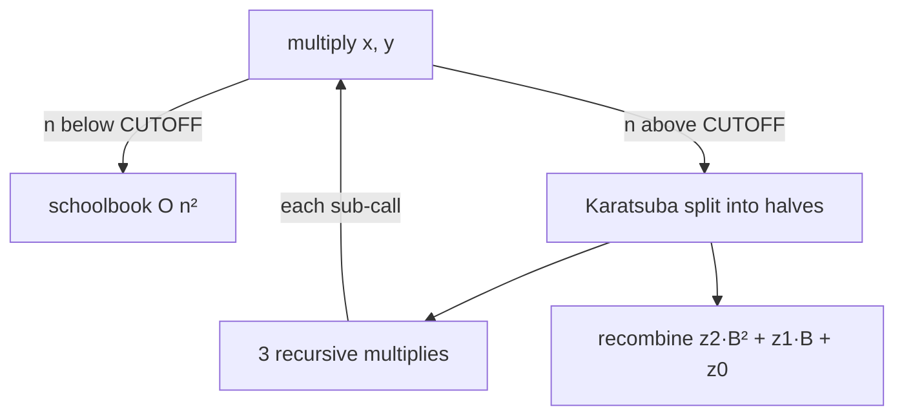

# Karatsuba Multiplication (Fast Big-Integer Multiply) — Junior Level

> **One-line summary:** To multiply two `n`-digit numbers, the schoolbook method costs `O(n²)`. Karatsuba splits each number into a high half and a low half and computes the product with only **three** half-size multiplications instead of four, giving the recurrence `T(n) = 3T(n/2) + O(n) = O(n^log₂3) ≈ O(n^1.585)`.

---

## Table of Contents

1. [Introduction](#introduction)
2. [Prerequisites](#prerequisites)
3. [Glossary](#glossary)
4. [Core Concepts](#core-concepts)
5. [Big-O Summary](#big-o-summary)
6. [Real-World Analogies](#real-world-analogies)
7. [Pros & Cons](#pros--cons)
8. [Step-by-Step Walkthrough](#step-by-step-walkthrough)
9. [Code Examples](#code-examples)
10. [Coding Patterns](#coding-patterns)
11. [Error Handling](#error-handling)
12. [Performance Tips](#performance-tips)
13. [Best Practices](#best-practices)
14. [Edge Cases & Pitfalls](#edge-cases--pitfalls)
15. [Common Mistakes](#common-mistakes)
16. [Cheat Sheet](#cheat-sheet)
17. [Visual Animation](#visual-animation)
18. [Summary](#summary)
19. [Further Reading](#further-reading)

---

## Introduction

How do you multiply two enormous numbers — say two 10,000-digit integers that do not fit in any built-in `int`? You learned one method in grade school: write the numbers one above the other and multiply every digit of the bottom number by every digit of the top number, shifting and adding. That **schoolbook** (long) multiplication is correct, but it does about `n × n` single-digit multiplications for two `n`-digit numbers. For `n = 10,000` that is 100 million digit-multiplies; for `n = 1,000,000` it is a trillion. Quadratic growth is brutal.

In 1960 a 23-year-old student named Anatoly Karatsuba found a faster way, disproving a conjecture by the mathematician Kolmogorov that `O(n²)` was the best possible. The trick is **divide and conquer**: cut each number into two halves and combine smaller products. The naive divide-and-conquer needs **four** half-size multiplications and is still `O(n²)`. Karatsuba's insight reduces those four to **three** with one clever algebraic identity, and that single saved multiplication changes the exponent in the running time.

> **The key trick:** to combine the halves you need three quantities `z0`, `z1`, `z2`. Computed naively that is four products, but `z1` can be obtained from the *sum* of halves via `(a+b)(c+d) − z2 − z0`, so only **three** multiplications are ever performed.

The payoff is the recurrence `T(n) = 3T(n/2) + O(n)`, which solves to `O(n^{log₂3}) ≈ O(n^{1.585})`. For 10,000-digit numbers that is roughly `10,000^{1.585} ≈ 4 million` operations instead of 100 million — a 25× speedup that grows with size.

This same idea is not just for integers. **Polynomials** multiply by exactly the same recurrence (a number written in base `B` *is* a polynomial evaluated at `B`), so Karatsuba multiplies polynomials in `O(n^{1.585})` too. And Karatsuba is the first rung of a ladder: **Toom-Cook** generalizes "split into 2 and use 3 products" to "split into `k` and use `2k−1` products", and at the top of the ladder sits **FFT-based multiplication** at `O(n log n)`. Real big-number libraries like **GMP** use *all* of these, switching between them at carefully tuned size thresholds.

This file builds the idea from the ground up. The deeper derivation, carry handling, and the Toom/FFT path live in [`middle.md`](./middle.md), [`senior.md`](./senior.md), and [`professional.md`](./professional.md).

---

## Prerequisites

Before reading this file you should be comfortable with:

- **Place-value / positional notation** — that `5274 = 52·100 + 74`, and more generally that splitting a number means peeling off high and low digit groups.
- **Schoolbook multiplication** — the grade-school `O(n²)` algorithm; we measure everything against it.
- **Divide and conquer** — solving a problem by splitting it into smaller copies of itself (sibling topics in `15-divide-and-conquer`).
- **Recurrences and Big-O** — reading `T(n) = aT(n/b) + f(n)` and knowing roughly what it solves to.
- **Basic algebra** — expanding `(a·B + b)(c·B + d)`.

Optional but helpful:

- A glance at **polynomials** as coefficient lists, since integer multiply and polynomial multiply are the same algorithm.
- Familiarity with **arrays/slices of digits or "limbs"** (groups of digits stored in machine words).

---

## Glossary

| Term | Meaning |
|------|---------|
| **Schoolbook (long) multiplication** | The `O(n²)` grade-school algorithm: multiply every digit pair, shift, and add. |
| **Limb** | One "digit" in the internal base of a big-integer library — usually a 32- or 64-bit word, not a decimal digit. |
| **Base `B`** | The radix used to split numbers. For decimal split-in-half of `2n` digits, `B = 10^n`. In a library, `B = 2^64`. |
| **High / low half** | Splitting `x = a·B + b`: `a` is the high half, `b` is the low half. |
| **z0, z1, z2** | The three combination terms: `z2 = a·c` (high), `z0 = b·d` (low), `z1 = a·d + b·c` (middle/cross). |
| **The Karatsuba trick** | Computing `z1 = (a+b)(c+d) − z2 − z0`, so only 3 multiplications are needed, not 4. |
| **Carry** | The overflow propagated to the next position when a digit/limb sum exceeds the base. |
| **Recurrence `T(n)=3T(n/2)+O(n)`** | The cost relation for Karatsuba; solves to `O(n^{log₂3})`. |
| **Toom-Cook (Toom-3)** | Generalization: split into 3 parts, use 5 multiplications, `O(n^{log₃5}) ≈ O(n^{1.465})`. |
| **FFT multiplication** | The asymptotically fastest practical method, `O(n log n)`, via the Fast Fourier Transform. |
| **Crossover threshold** | The input size at which one algorithm overtakes another; libraries switch methods at these points. |

---

## Core Concepts

### 1. Splitting a Number into Halves

Take a number `x` with `2n` digits in base `B = 10^n` (so each half has `n` digits). Write:

```
x = a · B + b      where a = high n digits, b = low n digits
y = c · B + d      where c = high n digits, d = low n digits
```

Example with `B = 100` (split 4-digit numbers into two 2-digit halves):

```
x = 1234  →  a = 12, b = 34   (1234 = 12·100 + 34)
y = 5678  →  c = 56, d = 78   (5678 = 56·100 + 78)
```

### 2. The Naive Expansion (Four Products)

Multiply the two split forms out algebraically:

```
x · y = (a·B + b)(c·B + d)
      = a·c · B²  +  (a·d + b·c) · B  +  b·d
```

So the product is built from three pieces:

```
z2 = a·c            (goes in the B² position — high)
z1 = a·d + b·c      (goes in the B  position — middle)
z0 = b·d            (goes in the B⁰ position — low)
```

Computed directly this needs **four** multiplications: `a·c`, `a·d`, `b·c`, `b·d`. Each is a product of `n`-digit numbers, so the recurrence is `T(n) = 4T(n/2) + O(n) = O(n²)` — no better than schoolbook. The `O(n)` term is the cost of the shifts and additions to combine the pieces.

### 3. The Karatsuba Trick — Three Products

Here is the clever part. We already compute `z2 = a·c` and `z0 = b·d`. Now form **one more** product from the *sums* of the halves:

```
p = (a + b)(c + d) = a·c + a·d + b·c + b·d = z2 + z1 + z0
```

Therefore:

```
z1 = p − z2 − z0 = (a+b)(c+d) − a·c − b·d
```

We needed `z1 = a·d + b·c`, and we got it using only **three** multiplications total — `z2 = a·c`, `z0 = b·d`, and `p = (a+b)(c+d)` — plus a couple of additions and subtractions (which are cheap, `O(n)`). The fourth multiplication is *gone*. That is the entire idea.

### 4. The Recurrence and Why the Exponent Drops

Each Karatsuba call makes **3** recursive multiplications on **half-size** inputs, plus `O(n)` work for the additions, subtractions, and shifts:

```
T(n) = 3 · T(n/2) + O(n)
```

By the master theorem this solves to `T(n) = O(n^{log₂3})`. Since `log₂3 ≈ 1.585`, the running time is `O(n^{1.585})` — strictly better than `O(n²)`. The naive four-product version gives `T(n) = 4T(n/2) + O(n) = O(n^{log₂4}) = O(n²)`; saving the one multiplication is what lowers `log₂4 = 2` to `log₂3 ≈ 1.585`.

### 5. Recombination with Shifts

Once you have `z0`, `z1`, `z2`, the answer is assembled by shifting (multiplying by powers of `B`) and adding:

```
x · y = z2 · B² + z1 · B + z0
```

Multiplying by `B` or `B²` is just appending zeros (a shift), which is cheap. The additions can produce **carries** that must propagate to higher positions — handling carries correctly is a major source of bugs and is covered in depth in [`middle.md`](./middle.md).

### 6. It's the Same for Polynomials

A number in base `B` is literally a polynomial evaluated at `x = B`. Splitting `1234 = 12·100 + 34` is the same as splitting the polynomial `P(x) = (12)x + 34` at `x = 100`. So Karatsuba multiplies two polynomials `P, Q` of degree `< n` in `O(n^{1.585})` coefficient operations, with the *only* difference being that polynomial coefficients do **not** carry (a coefficient can be any size). Integer Karatsuba = polynomial Karatsuba + carry propagation.

---

## Big-O Summary

| Method | Time | Space | Notes |
|--------|------|-------|-------|
| Schoolbook multiply | **O(n²)** | O(n) | `n²` single-digit/limb multiplies. |
| Naive divide & conquer (4 products) | O(n²) | O(n) | `T(n)=4T(n/2)+O(n)` — no improvement. |
| **Karatsuba (3 products)** | **O(n^{log₂3}) ≈ O(n^{1.585})** | O(n) | `T(n)=3T(n/2)+O(n)`. |
| Toom-3 (Toom-Cook, 5 products) | O(n^{log₃5}) ≈ O(n^{1.465}) | O(n) | Splits into 3 parts. |
| FFT / NTT multiply | **O(n log n)** | O(n) | Asymptotically fastest practical. |

The headline result is **`O(n^{1.585})`** for Karatsuba — the same recursion shape as merge sort but with a `3T(n/2)` branching factor instead of `2T(n/2)`, which is exactly why the exponent is `log₂3` rather than `1` plus a log.

---

## Real-World Analogies

| Concept | Analogy |
|---------|---------|
| Schoolbook `O(n²)` | Shaking hands with everyone in two rooms: every person in room A greets every person in room B — `|A|·|B|` handshakes. |
| Splitting into halves | Cutting a long invoice number into a "thousands" block and a "units" block before processing each block. |
| The three products | Instead of buying four separate items, you discover a bundle deal: buy the two endpoints and one combined bundle, then *subtract* to recover the middle item for free. |
| Saving one multiplication | A clever shopper who computes a fourth quantity by addition and subtraction (cheap) instead of by a fresh multiplication (expensive). |
| Crossover threshold | A delivery service that uses a bike for short trips and a truck for long hauls — switching vehicles at the distance where the truck becomes worth its overhead. |
| Toom / FFT ladder | Gears on a bicycle: small numbers use the low gear (schoolbook), bigger numbers shift up to Karatsuba, Toom, then FFT for the biggest climbs. |

Where the analogy breaks: the "free middle item" is not truly free — you pay with extra additions and a slightly larger product `(a+b)(c+d)` — but additions are `O(n)` and cheap compared to the `O(n^{1.585})` multiplication you avoided.

---

## Pros & Cons

| Pros | Cons |
|------|------|
| Strictly faster than schoolbook for large `n`: `O(n^{1.585})` vs `O(n²)`. | Higher constant factor; **slower** than schoolbook for small `n`. |
| Simple to implement — one algebraic identity, three recursive calls. | Recursion overhead and extra additions hurt on tiny inputs. |
| Works identically for big integers and polynomials. | Carry propagation for integers is fiddly and bug-prone. |
| Foundation for Toom-Cook and a stepping stone toward FFT. | Not the asymptotic best — FFT beats it at very large `n`. |
| No floating point needed — exact integer arithmetic throughout. | The intermediate `(a+b)(c+d)` is slightly larger than half-size (an extra carry bit). |

**When to use:** multiplying numbers/polynomials big enough that `O(n²)` is too slow but not so huge that FFT is warranted — typically a few hundred to a few tens of thousands of digits/limbs. This is the "middle" range every bignum library covers with Karatsuba.

**When NOT to use:** small numbers (schoolbook wins below the crossover, often ~20–40 limbs), or gigantic numbers where Toom-Cook / FFT take over. Always fall back to schoolbook at the base case.

---

## Step-by-Step Walkthrough

Multiply `x = 1234` and `y = 5678` using Karatsuba with base `B = 100` (so `n = 2` digit halves). The true answer is `1234 × 5678 = 7,006,652`.

**Step 1 — Split into halves.**

```
x = 1234 = a·B + b,  a = 12, b = 34   (B = 100)
y = 5678 = c·B + d,  c = 56, d = 78
```

**Step 2 — Three multiplications.**

```
z2 = a·c = 12 · 56 = 672
z0 = b·d = 34 · 78 = 2652
p  = (a+b)(c+d) = (12+34)(56+78) = 46 · 134 = 6164
```

**Step 3 — Recover the middle term.**

```
z1 = p − z2 − z0 = 6164 − 672 − 2652 = 2840
```

(Check: `z1` should equal `a·d + b·c = 12·78 + 34·56 = 936 + 1904 = 2840`. ✓)

**Step 4 — Recombine with shifts (`B = 100`, `B² = 10000`).**

```
x·y = z2·B² + z1·B + z0
    = 672·10000 + 2840·100 + 2652
    = 6,720,000 + 284,000 + 2,652
    = 7,006,652
```

That matches `1234 × 5678 = 7,006,652`. ✓

Notice we performed only **three** two-digit multiplications (`12·56`, `34·78`, `46·134`) plus some additions and shifts, instead of the **four** the naive expansion would require (`12·56`, `12·78`, `34·56`, `34·78`). Each of those three multiplications would, in a full recursive implementation, itself be done by Karatsuba until the halves are small enough to multiply directly.

---

## Code Examples

### Example: Karatsuba on Non-Negative Integers

A clean recursive Karatsuba using the language's built-in big integers for the small arithmetic (so we focus on the *structure*; production limb arithmetic is in [`senior.md`](./senior.md)).

#### Go

```go
package main

import (
	"fmt"
	"math/big"
)

// karatsuba multiplies two non-negative big.Ints using the 3-product trick.
// It splits at half the larger bit length. Base case uses built-in multiply.
func karatsuba(x, y *big.Int) *big.Int {
	// Base case: small numbers — just multiply directly.
	if x.BitLen() <= 64 || y.BitLen() <= 64 {
		return new(big.Int).Mul(x, y)
	}
	// Split point: half of the larger operand's bit length.
	n := x.BitLen()
	if y.BitLen() > n {
		n = y.BitLen()
	}
	half := n / 2

	// Split x = a*2^half + b, y = c*2^half + d.
	mask := new(big.Int).Lsh(big.NewInt(1), uint(half))
	mask.Sub(mask, big.NewInt(1)) // 2^half - 1

	b := new(big.Int).And(x, mask)        // low half of x
	a := new(big.Int).Rsh(x, uint(half))  // high half of x
	d := new(big.Int).And(y, mask)        // low half of y
	c := new(big.Int).Rsh(y, uint(half))  // high half of y

	z2 := karatsuba(a, c)                                  // a*c
	z0 := karatsuba(b, d)                                  // b*d
	aPlusB := new(big.Int).Add(a, b)
	cPlusD := new(big.Int).Add(c, d)
	z1 := karatsuba(aPlusB, cPlusD)                        // (a+b)(c+d)
	z1.Sub(z1, z2)                                         // - z2
	z1.Sub(z1, z0)                                         // - z0   => a*d + b*c

	// result = z2 << (2*half) + z1 << half + z0
	result := new(big.Int).Lsh(z2, uint(2*half))
	result.Add(result, new(big.Int).Lsh(z1, uint(half)))
	result.Add(result, z0)
	return result
}

func main() {
	x := big.NewInt(1234)
	y := big.NewInt(5678)
	fmt.Println(karatsuba(x, y)) // 7006652

	a, _ := new(big.Int).SetString("123456789123456789", 10)
	b, _ := new(big.Int).SetString("987654321987654321", 10)
	got := karatsuba(a, b)
	want := new(big.Int).Mul(a, b)
	fmt.Println(got.Cmp(want) == 0) // true
}
```

#### Java

```java
import java.math.BigInteger;

public class Karatsuba {
    static final BigInteger MASK_BITS = BigInteger.ONE;

    static BigInteger karatsuba(BigInteger x, BigInteger y) {
        // Base case: small numbers multiply directly.
        if (x.bitLength() <= 64 || y.bitLength() <= 64) {
            return x.multiply(y);
        }
        int n = Math.max(x.bitLength(), y.bitLength());
        int half = n / 2;

        BigInteger b = x.mod(BigInteger.ONE.shiftLeft(half)); // low half of x
        BigInteger a = x.shiftRight(half);                    // high half of x
        BigInteger d = y.mod(BigInteger.ONE.shiftLeft(half)); // low half of y
        BigInteger c = y.shiftRight(half);                    // high half of y

        BigInteger z2 = karatsuba(a, c);                      // a*c
        BigInteger z0 = karatsuba(b, d);                      // b*d
        BigInteger z1 = karatsuba(a.add(b), c.add(d))         // (a+b)(c+d)
                          .subtract(z2).subtract(z0);         // => a*d + b*c

        return z2.shiftLeft(2 * half)
                 .add(z1.shiftLeft(half))
                 .add(z0);
    }

    public static void main(String[] args) {
        System.out.println(karatsuba(BigInteger.valueOf(1234),
                                     BigInteger.valueOf(5678))); // 7006652

        BigInteger a = new BigInteger("123456789123456789");
        BigInteger b = new BigInteger("987654321987654321");
        System.out.println(karatsuba(a, b).equals(a.multiply(b))); // true
    }
}
```

#### Python

```python
def karatsuba(x: int, y: int) -> int:
    # Base case: small numbers multiply directly (Python ints already use
    # Karatsuba internally, so this is for illustration).
    if x < (1 << 64) or y < (1 << 64):
        return x * y

    n = max(x.bit_length(), y.bit_length())
    half = n // 2

    mask = (1 << half) - 1
    b = x & mask          # low half of x
    a = x >> half         # high half of x
    d = y & mask          # low half of y
    c = y >> half         # high half of y

    z2 = karatsuba(a, c)                  # a*c
    z0 = karatsuba(b, d)                  # b*d
    z1 = karatsuba(a + b, c + d) - z2 - z0  # (a+b)(c+d) - z2 - z0 = a*d + b*c

    return (z2 << (2 * half)) + (z1 << half) + z0


if __name__ == "__main__":
    print(karatsuba(1234, 5678))  # 7006652
    a = 123456789123456789
    b = 987654321987654321
    print(karatsuba(a, b) == a * b)  # True
```

**What it does:** splits each number at half its bit length, performs the three sub-multiplications recursively, recovers `z1` by subtraction, and recombines with bit shifts (the binary equivalent of multiplying by `B` and `B²`).
**Run:** `go run main.go` | `javac Karatsuba.java && java Karatsuba` | `python karatsuba.py`

---

## Coding Patterns

### Pattern 1: Schoolbook Multiply (the oracle you test against)

**Intent:** Before trusting Karatsuba, multiply the slow, obvious way and check the answers agree.

```python
def schoolbook(x, y):
    return x * y  # for big ints; or a digit-by-digit loop for limbs
```

For limb arrays the schoolbook version is the canonical `O(n²)` double loop. Karatsuba must produce identical results on random inputs.

### Pattern 2: Split-Three-Recombine

**Intent:** The skeleton of every Karatsuba implementation.

```text
karatsuba(x, y):
    if small(x) or small(y): return x * y          # base case
    half = (max length) / 2
    a, b = high(x), low(x)
    c, d = high(y), low(y)
    z2 = karatsuba(a, c)
    z0 = karatsuba(b, d)
    z1 = karatsuba(a+b, c+d) - z2 - z0
    return z2 * B^2 + z1 * B + z0
```

### Pattern 3: Crossover Cutoff

**Intent:** Karatsuba is slower than schoolbook for small inputs, so switch below a threshold.



Tuning `CUTOFF` (often 20–40 limbs) is how real libraries make Karatsuba actually pay off.

---

## Error Handling

| Error | Cause | Fix |
|-------|-------|-----|
| Wrong product, off by a power of `B` | Recombined with the wrong shift amount. | Use `z2·B²`, `z1·B`, `z0·B⁰`; the shift is `half`, then `2·half`. |
| Wrong sign in `z1` | Forgot to subtract `z2` *and* `z0` from `(a+b)(c+d)`. | `z1 = (a+b)(c+d) − z2 − z0`, both subtractions. |
| Stack overflow / infinite recursion | No base case, or split that does not shrink the input. | Always recurse on strictly smaller halves and fall back to schoolbook. |
| Overflow in `(a+b)` or `(c+d)` | The sum of halves is one bit/digit longer than a half. | Allow one extra digit/limb of headroom; carry it correctly. |
| Wrong answer for unequal lengths | Assumed both numbers have the same length. | Pad to a common length or split at a shared `half`. |
| Carry lost during recombination | Additions overflowed the base without propagating. | Propagate carries up through all higher positions. |

---

## Performance Tips

- **Always set a crossover cutoff.** Below ~20–40 limbs, schoolbook is faster; calling Karatsuba there just adds overhead. Benchmark to find your machine's cutoff.
- **Reuse buffers.** Recursive Karatsuba allocates many temporary halves; preallocating scratch space avoids garbage-collector churn.
- **Split at the larger length / 2** so both operands recurse on genuinely smaller halves.
- **Compute `z1` from the sum, not from `a·d` and `b·c`.** The whole point is three multiplies; never compute the cross terms separately.
- **Use the language's native bignum at the base case** — it is heavily optimized (and itself uses Karatsuba/Toom/FFT internally).

---

## Best Practices

- Always test Karatsuba against a schoolbook (or native `*`) oracle on many random inputs before trusting it.
- State the crossover cutoff once, as a named constant, and document the units (limbs vs digits vs bits).
- Handle the base case first; a missing base case is the #1 cause of infinite recursion.
- Keep `multiply` (the combine logic) and `karatsuba` (the recursion) as small, separately testable functions.
- Treat polynomial Karatsuba and integer Karatsuba as the same algorithm — the only addition for integers is carry propagation.

---

## Edge Cases & Pitfalls

- **Zero operands** — `x = 0` or `y = 0` must return `0`; make sure the base case handles it.
- **One operand much shorter than the other** — splitting at the larger length keeps the recursion balanced; an unbalanced "Karatsuba" can degrade.
- **`a+b` overflows a half** — the sum of two `n`-digit halves can be `n+1` digits; leave headroom or the middle product is wrong.
- **Powers of the base** — recombination shifts must be exactly `half` and `2·half`; an off-by-one shift corrupts the result by a factor of `B`.
- **Negative numbers** — handle the sign separately (multiply magnitudes, then set the sign) since the split assumes non-negative halves.
- **Carry chains** — for limb-based integers, a carry can cascade through many higher limbs; do not stop after one position.

---

## Common Mistakes

1. **Computing four products anyway** — defeating the purpose; `z1` must come from `(a+b)(c+d) − z2 − z0`.
2. **Forgetting the base case** — leads to infinite recursion or a stack overflow.
3. **Wrong shift amounts** — using `B` where `B²` is needed (or vice versa) shifts the whole answer by a factor of the base.
4. **Subtracting only one of `z2`, `z0`** — `z1` ends up too large; both must be removed.
5. **Ignoring carries** — for real limb arithmetic, dropping a carry silently corrupts high digits.
6. **Splitting both numbers at their own halves independently** — split both at the *same* `half` so the powers of `B` line up.
7. **Using Karatsuba on tiny inputs** — slower than schoolbook below the crossover; always fall back.

---

## Cheat Sheet

| Quantity | Formula | Position |
|----------|---------|----------|
| High product | `z2 = a·c` | `B²` |
| Low product | `z0 = b·d` | `B⁰` |
| Middle (cross) | `z1 = (a+b)(c+d) − z2 − z0` | `B` |
| Final product | `z2·B² + z1·B + z0` | — |
| Recurrence | `T(n) = 3T(n/2) + O(n)` | — |
| Complexity | `O(n^{log₂3}) ≈ O(n^{1.585})` | — |

Core algorithm:

```
karatsuba(x, y):
    if small: return x * y                 # base case (schoolbook)
    split x = a·B + b,  y = c·B + d        # B = 10^half (or 2^half)
    z2 = karatsuba(a, c)
    z0 = karatsuba(b, d)
    z1 = karatsuba(a+b, c+d) - z2 - z0     # the 3-product trick
    return z2·B² + z1·B + z0                # recombine with shifts
# cost: O(n^1.585); fall back to schoolbook below the crossover
```

---

## Visual Animation

> See [`animation.html`](./animation.html) for an interactive visualization.
>
> The animation demonstrates:
> - Splitting `x` and `y` into high/low halves `a, b` and `c, d`
> - The **three** recursive products `z2 = a·c`, `z0 = b·d`, and `p = (a+b)(c+d)`
> - Recovering `z1 = p − z2 − z0` (the saved fourth multiplication)
> - Recombination `z2·B² + z1·B + z0` with the shifts shown explicitly
> - Step / Run / Reset controls to watch each product and recombination form

---

## Summary

Karatsuba multiplies two `n`-digit numbers in `O(n^{1.585})` instead of the schoolbook `O(n²)`. The mechanism is divide and conquer: split each number into a high half and a low half, and combine via the three terms `z2 = a·c`, `z0 = b·d`, and the cross term `z1`. The naive combination needs four products, but Karatsuba's identity `z1 = (a+b)(c+d) − z2 − z0` recovers the cross term with just **one extra product**, leaving three multiplications total. That changes the recurrence from `T(n) = 4T(n/2) + O(n) = O(n²)` to `T(n) = 3T(n/2) + O(n) = O(n^{log₂3})`. The exact same algorithm multiplies polynomials (integers are polynomials evaluated at the base, plus carry handling). Karatsuba is the first step of a hierarchy — Toom-Cook generalizes it, and FFT-based multiply (`O(n log n)`) tops it — and real libraries like GMP switch among all of them at tuned size thresholds. Remember the one rule: below the crossover, fall back to schoolbook.

---

## Further Reading

- *The Art of Computer Programming, Vol. 2* (Knuth) — Section 4.3.3 on fast multiplication, including Karatsuba and Toom-Cook.
- Karatsuba & Ofman (1962), "Multiplication of multidigit numbers on automata" — the original result.
- Sibling topics in `15-divide-and-conquer` — the general divide-and-conquer framework and master theorem.
- The GMP manual — "Algorithms" chapter, on real-world crossover thresholds between schoolbook, Karatsuba, Toom-Cook, and FFT.
- cp-algorithms.com — "Karatsuba's algorithm" and "Fast Fourier transform".
- *Modern Computer Arithmetic* (Brent & Zimmermann) — a thorough treatment of bignum multiplication algorithms.
