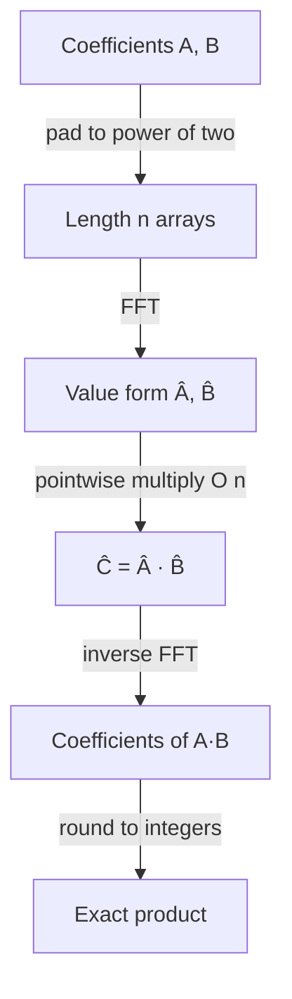

# Fast Fourier Transform (FFT) — Junior Level

> **One-line summary:** The FFT is a divide-and-conquer algorithm that evaluates a degree-`n` polynomial at the `n` complex **roots of unity** in `O(n log n)` instead of the naive `O(n²)`. Its killer application is multiplying two polynomials (or two big integers) fast, because *multiplication in the value/frequency domain is just pointwise multiplication*.

---

## Table of Contents

1. [Introduction](#introduction)
2. [Prerequisites](#prerequisites)
3. [Glossary](#glossary)
4. [Core Concepts](#core-concepts)
5. [Big-O Summary](#big-o-summary)
6. [Real-World Analogies](#real-world-analogies)
7. [Pros & Cons](#pros--cons)
8. [Step-by-Step Walkthrough](#step-by-step-walkthrough)
9. [Code Examples](#code-examples)
10. [Coding Patterns](#coding-patterns)
11. [Error Handling](#error-handling)
12. [Performance Tips](#performance-tips)
13. [Best Practices](#best-practices)
14. [Edge Cases & Pitfalls](#edge-cases--pitfalls)
15. [Common Mistakes](#common-mistakes)
16. [Cheat Sheet](#cheat-sheet)
17. [Visual Animation](#visual-animation)
18. [Summary](#summary)
19. [Further Reading](#further-reading)

---

## Introduction

Suppose you want to multiply two polynomials, say `A(x) = 1 + 2x + 3x²` and `B(x) = 4 + 5x`. The schoolbook way multiplies every term of `A` by every term of `B`: if each has `n` terms that is `n × n = O(n²)` little multiplications. For `n = 100000` (think: multiplying two 100000-digit integers), `O(n²)` is ten billion operations — far too slow.

The **Fast Fourier Transform (FFT)** is the divide-and-conquer breakthrough that drops this to `O(n log n)`. The idea hinges on a change of viewpoint:

> A polynomial of degree `< n` can be described in **two equivalent ways**: by its `n` **coefficients**, OR by its **values at `n` distinct points**. Multiplying two polynomials is `O(n²)` in coefficient form but only `O(n)` in value form — because at each shared point you just multiply the two numbers.

So the strategy is: **evaluate** both polynomials at the same `n` points (go to "value form"), **multiply the values pointwise** in `O(n)`, then **interpolate** back to coefficients. The catch is that naive evaluation at `n` points costs `O(n²)`, which would erase all our savings. FFT's magic is choosing the points cleverly — the **complex `n`-th roots of unity** — so that evaluation and interpolation each take only `O(n log n)`.

```
coefficients  --FFT (evaluate)-->  values
                                     | multiply pointwise  O(n)
coefficients  <--inverse FFT------ values
```

Why roots of unity? Because they have a self-similar structure: the squares of the `n`-th roots of unity are exactly the `n/2`-th roots of unity. That recursive symmetry is what lets us split a size-`n` problem into two size-`n/2` problems (the **even-indexed** and **odd-indexed** coefficients), giving the classic divide-and-conquer recurrence `T(n) = 2T(n/2) + O(n) = O(n log n)` — the same shape as merge sort (sibling `01-merge-sort`).

FFT sits in the divide-and-conquer family alongside Karatsuba (sibling `04-karatsuba`), which also speeds up multiplication but only to `O(n^1.585)`. FFT is asymptotically faster and is the engine behind big-integer libraries, signal processing, image compression, and fast string matching.

One honest caveat from minute one: classic FFT uses **floating-point complex numbers**, so answers carry tiny rounding errors. For integer results you round at the end — and when you need *exact* integer answers modulo a prime, you use the integer cousin called the **Number-Theoretic Transform (NTT)**, introduced later in this topic.

---

## Prerequisites

Before reading this file you should be comfortable with:

- **Polynomials** — coefficients, degree, and the fact that `A(x)·B(x)` has degree `deg A + deg B`.
- **Complex numbers** — `i² = −1`, the complex plane, and `e^{iθ} = cos θ + i sin θ` (Euler's formula). You do not need deep theory, just the unit-circle picture.
- **Divide and conquer** — splitting a problem in half and combining. See sibling `01-merge-sort`.
- **Big-O notation** — `O(n²)` vs `O(n log n)`, and why the difference is enormous.
- **Arrays and recursion** — every FFT is recursion (or loops) over an array of length a power of two.

Optional but helpful:

- A glance at **Karatsuba** (sibling `04-karatsuba`) — the slower `O(n^1.585)` multiplication FFT improves on.
- Familiarity with **modular arithmetic** — needed later for the NTT variant.

---

## Glossary

| Term | Meaning |
|------|---------|
| **Coefficient form** | A polynomial stored as its list of coefficients `[a₀, a₁, …, a_{n-1}]`. |
| **Value (point-value) form** | A polynomial stored as `n` pairs `(xᵢ, A(xᵢ))`. Uniquely determines a degree-`< n` polynomial. |
| **DFT** | Discrete Fourier Transform: evaluating a polynomial at the `n` roots of unity. Naive cost `O(n²)`. |
| **FFT** | Fast Fourier Transform: an `O(n log n)` algorithm that computes the DFT by divide and conquer. |
| **`n`-th root of unity** | A complex number `ω` with `ωⁿ = 1`. The **principal** one is `ω_n = e^{2πi/n}`. |
| **Roots of unity** | The `n` numbers `ω_n⁰, ω_n¹, …, ω_n^{n-1}`, equally spaced on the unit circle. |
| **Inverse FFT (IFFT)** | Converts value form back to coefficient form; same algorithm with `ω⁻¹` and a `1/n` scaling. |
| **Convolution** | The operation `c_k = Σ aᵢ b_{k−i}` that produces the coefficients of a product polynomial. |
| **Pointwise product** | Multiplying two value-form vectors element by element: `C(xᵢ) = A(xᵢ)·B(xᵢ)`. |
| **NTT** | Number-Theoretic Transform: FFT done with integers modulo a prime — exact, no floating point. |
| **Bit-reversal permutation** | The reordering of indices used by the fast *iterative* (in-place) FFT. |

---

## Core Concepts

### 1. Two Representations of a Polynomial

A polynomial of degree `< n` is pinned down by **`n` numbers**. You can list those numbers as coefficients:

```
A(x) = a₀ + a₁x + a₂x² + … + a_{n-1}x^{n-1}      → [a₀, a₁, …, a_{n-1}]
```

OR as the values at `n` distinct points `x₀, …, x_{n-1}`:

```
(x₀, A(x₀)), (x₁, A(x₁)), …, (x_{n-1}, A(x_{n-1}))
```

Both contain the same information (a classic theorem: `n` points determine a unique degree-`< n` polynomial). The point of FFT is to move between these two forms quickly.

### 2. Multiplication Is Cheap in Value Form

If you already know the values of `A` and `B` at the *same* points, the product `C = A·B` has values:

```
C(xᵢ) = A(xᵢ) · B(xᵢ)        for each i
```

That is **one multiplication per point** — total `O(n)`. Compare that to `O(n²)` in coefficient form. The catch: `C` has degree up to `2n−2`, so you must evaluate `A` and `B` at `≥ 2n−1` points (pad with zeros to a power of two ≥ `2n`).

### 3. The Roots of Unity

The clever evaluation points are the **complex `n`-th roots of unity**. The principal root is:

```
ω_n = e^{2πi/n} = cos(2π/n) + i·sin(2π/n)
```

The `n` roots are its powers `ω_n⁰, ω_n¹, …, ω_n^{n-1}` — `n` points spread evenly around the unit circle. They satisfy two magic properties:

- **Halving:** `(ω_n^k)² = ω_{n/2}^k`. Squaring the `n`-th roots gives the `n/2`-th roots — this is what makes the recursion work.
- **Cancellation / symmetry:** `ω_n^{k + n/2} = −ω_n^k`. The second half of the roots are just the negatives of the first half.

### 4. The Divide-and-Conquer Split (Cooley-Tukey)

Split `A(x)` by **even and odd** coefficient indices:

```
A(x) = A_even(x²) + x · A_odd(x²)
A_even = [a₀, a₂, a₄, …]      A_odd = [a₁, a₃, a₅, …]
```

To evaluate `A` at all `n` roots `ω_n^k`, recursively evaluate the two half-size polynomials `A_even` and `A_odd` at the `n/2` *squared* roots (which are the `n/2`-th roots, by the halving property), then combine in `O(n)`:

```
A(ω_n^k)         = A_even(ω_{n/2}^k) + ω_n^k · A_odd(ω_{n/2}^k)
A(ω_n^{k+n/2})   = A_even(ω_{n/2}^k) − ω_n^k · A_odd(ω_{n/2}^k)
```

These two lines (one `+`, one `−`) are the famous **butterfly**. Each butterfly reuses the *same* two recursive results, so combining all of them is `O(n)`. The recurrence is `T(n) = 2T(n/2) + O(n) = O(n log n)`.

### 5. The Inverse FFT

Going back from values to coefficients is almost the **same algorithm**. The inverse DFT uses the conjugate roots `ω_n^{−k}` and divides everything by `n`:

```
a_j = (1/n) · Σ_k  Â_k · ω_n^{−jk}
```

So you run FFT using `ω⁻¹` instead of `ω`, then divide the result by `n`. This symmetry is why one piece of code (with a sign flag) handles both directions.

### 6. The Full Multiply Pipeline

Putting it together to compute `C = A · B`:

```
1. Pad A and B with zeros up to length m = next power of two ≥ 2·max(deg)+1.
2. Â = FFT(A),  B̂ = FFT(B).            // coefficients → values   O(n log n)
3. Ĉ_k = Â_k · B̂_k  for all k.          // pointwise multiply       O(n)
4. C = inverseFFT(Ĉ).                   // values → coefficients    O(n log n)
5. Round each C_k to the nearest integer (if the inputs were integers).
```

Total: `O(n log n)`. That is the entire idea.

---

## Big-O Summary

| Operation | Time | Space | Notes |
|-----------|------|-------|-------|
| Naive polynomial multiply (schoolbook) | **O(n²)** | O(n) | Every coefficient pair. |
| Naive DFT (evaluate at `n` points) | O(n²) | O(n) | One Horner evaluation per point. |
| **FFT** (Cooley-Tukey radix-2) | **O(n log n)** | O(n) | Requires `n` a power of two. |
| Inverse FFT | O(n log n) | O(n) | Same algorithm, `ω⁻¹`, ÷`n`. |
| Pointwise multiply in value form | **O(n)** | O(n) | One product per point. |
| **FFT-based polynomial multiply** | **O(n log n)** | O(n) | Two FFTs + pointwise + one IFFT. |
| Big-integer multiply via convolution | O(n log n) | O(n) | `n` = number of digits/limbs. |
| Karatsuba multiply (sibling `04`) | O(n^1.585) | O(n) | Faster than `n²`, slower than FFT. |

The headline is **`O(n log n)`** — the same complexity as sorting, and a massive improvement over `O(n²)` for large `n`.

---

## Real-World Analogies

| Concept | Analogy |
|---------|---------|
| Coefficient vs value form | A musical chord written as **sheet music** (which notes — coefficients) vs as an **audio waveform** (the actual sound at each instant — values). Same chord, two encodings. |
| DFT / FFT | A **prism** splitting white light into its color spectrum: the FFT splits a signal into the frequencies it is made of. |
| Roots of unity | **Evenly spaced seats** around a circular table — `n` chairs at perfectly regular angles. |
| Even/odd split | Dealing a deck into **two piles** (even and odd cards), solving each pile, then interleaving — exactly like merge sort's split. |
| Multiply in value form | If two songs are recorded as waveforms sampled at the same instants, "combining" them sample-by-sample is trivial; aligning them note-by-note (coefficients) is the hard part. |
| Inverse FFT | Re-assembling the white light from its color spectrum back into the original beam. |

Where the analogy breaks: light frequencies are continuous, while the DFT uses exactly `n` discrete frequencies (the roots of unity). And unlike audio, FFT here is an *exact* mathematical identity (up to floating-point rounding), not a lossy approximation.

---

## Pros & Cons

| Pros | Cons |
|------|------|
| Multiplies polynomials / big integers in `O(n log n)`, crushing the `O(n²)` schoolbook method. | Uses floating-point complex numbers → small rounding errors; integer answers must be rounded carefully. |
| One algorithm powers many fields: signal processing, image compression, string matching. | Needs the size padded to a power of two; awkward sizes waste up to ~2× work. |
| The inverse is the *same* algorithm with a tiny tweak (conjugate roots, ÷`n`). | The constant factor is real; for small `n` (say `< 64`), schoolbook or Karatsuba is faster. |
| Has an exact integer twin (NTT) for modular convolution with zero rounding error. | Conceptually heavier than Karatsuba; complex-number bookkeeping trips up beginners. |
| Iterative in-place version is cache-friendly and allocation-free. | Precision degrades as `n` grows and as coefficients get large — must bound the error. |

**When to use:** multiplying large polynomials or big integers; computing convolutions/correlations; signal/image processing; pattern matching with wildcards; any problem reducible to convolution where `n` is large.

**When NOT to use:** tiny inputs (`n` small — schoolbook wins on constants); when you need exact integer results and floating point cannot guarantee correctness (use **NTT** instead); when the operation is not a convolution.

---

## Step-by-Step Walkthrough

Let's multiply `A(x) = 1 + 2x` and `B(x) = 3 + 4x` using FFT. The true product is:

```
A·B = (1 + 2x)(3 + 4x) = 3 + 4x + 6x + 8x² = 3 + 10x + 8x²
```

so we expect coefficients `[3, 10, 8]`. The product has degree 2, so we need at least 3 points; round up to the next power of two, **`n = 4`**. Pad both to length 4:

```
A = [1, 2, 0, 0]      B = [3, 4, 0, 0]
```

**Step 1 — Roots of unity for `n = 4`.** `ω_4 = e^{2πi/4} = i`. The four roots are:

```
ω⁰ = 1,   ω¹ = i,   ω² = −1,   ω³ = −i
```

**Step 2 — FFT(A): evaluate `A(x) = 1 + 2x` at the four roots.**

```
A(1)  = 1 + 2·1  =  3
A(i)  = 1 + 2·i  =  1 + 2i
A(−1) = 1 + 2·−1 = −1
A(−i) = 1 + 2·−i =  1 − 2i
 = [3, 1+2i, −1, 1−2i]
```

**Step 3 — FFT(B): evaluate `B(x) = 3 + 4x` at the same roots.**

```
B(1)  = 3 + 4   =  7
B(i)  = 3 + 4i
B(−1) = 3 − 4   = −1
B(−i) = 3 − 4i
B̂ = [7, 3+4i, −1, 3−4i]
```

**Step 4 — Pointwise multiply** `Ĉ_k = Â_k · B̂_k`:

```
Ĉ₀ = 3 · 7              = 21
Ĉ₁ = (1+2i)(3+4i)       = 3 + 4i + 6i + 8i² = 3 + 10i − 8 = −5 + 10i
Ĉ₂ = (−1)(−1)           = 1
Ĉ₃ = (1−2i)(3−4i)       = 3 − 4i − 6i + 8i² = 3 − 10i − 8 = −5 − 10i
Ĉ = [21, −5+10i, 1, −5−10i]
```

**Step 5 — Inverse FFT** of `Ĉ` (use conjugate roots, then divide by `n = 4`). Evaluating the inverse-DFT sum gives:

```
c₀ = (1/4)(21 + (−5+10i) + 1 + (−5−10i)) = (1/4)(12)  = 3
c₁ = (1/4)(21 + (−5+10i)(−i) + 1·(−1) + (−5−10i)(i)) = (1/4)(40) = 10
c₂ = (1/4)(21 + (−5+10i)(−1) + 1·1 + (−5−10i)(−1))   = (1/4)(32) = 8
c₃ = (1/4)(21 + (−5+10i)(i) + 1·(−1) + (−5−10i)(−i))  = (1/4)(0)  = 0
C = [3, 10, 8, 0]
```

Dropping the trailing zero: **`[3, 10, 8]`** — exactly `3 + 10x + 8x²`. The FFT pipeline reproduced the schoolbook answer, and for large `n` it does so in `O(n log n)` rather than `O(n²)`.

---

## Code Examples

### Example: Recursive FFT and Polynomial Multiplication

This is the textbook **recursive Cooley-Tukey** FFT (easy to read; the iterative version comes in `middle.md`). `invert=true` runs the inverse transform.

#### Go

```go
package main

import (
	"fmt"
	"math"
	"math/cmplx"
)

// fft computes the DFT (or inverse DFT if invert) in place.
// len(a) must be a power of two.
func fft(a []complex128, invert bool) {
	n := len(a)
	if n == 1 {
		return
	}
	even := make([]complex128, n/2)
	odd := make([]complex128, n/2)
	for i := 0; i < n/2; i++ {
		even[i] = a[2*i]
		odd[i] = a[2*i+1]
	}
	fft(even, invert)
	fft(odd, invert)

	ang := 2 * math.Pi / float64(n)
	if invert {
		ang = -ang
	}
	w := complex(1, 0)
	wn := cmplx.Exp(complex(0, ang)) // principal root ω_n (or its conjugate)
	for k := 0; k < n/2; k++ {
		t := w * odd[k]
		a[k] = even[k] + t            // butterfly: +
		a[k+n/2] = even[k] - t        // butterfly: −
		if invert {
			a[k] /= 2
			a[k+n/2] /= 2
		}
		w *= wn
	}
}

// multiply convolves integer coefficient lists via FFT.
func multiply(a, b []int) []int {
	need := len(a) + len(b) - 1
	n := 1
	for n < need {
		n <<= 1
	}
	fa := make([]complex128, n)
	fb := make([]complex128, n)
	for i, v := range a {
		fa[i] = complex(float64(v), 0)
	}
	for i, v := range b {
		fb[i] = complex(float64(v), 0)
	}
	fft(fa, false)
	fft(fb, false)
	for i := 0; i < n; i++ {
		fa[i] *= fb[i] // pointwise product
	}
	fft(fa, true)
	res := make([]int, need)
	for i := 0; i < need; i++ {
		res[i] = int(math.Round(real(fa[i])))
	}
	return res
}

func main() {
	a := []int{1, 2}      // 1 + 2x
	b := []int{3, 4}      // 3 + 4x
	fmt.Println(multiply(a, b)) // [3 10 8]
}
```

#### Java

```java
import java.util.*;

public class FFT {
    // In-place recursive FFT; a.length must be a power of two.
    static void fft(double[] re, double[] im, boolean invert) {
        int n = re.length;
        if (n == 1) return;
        double[] er = new double[n / 2], ei = new double[n / 2];
        double[] or = new double[n / 2], oi = new double[n / 2];
        for (int i = 0; i < n / 2; i++) {
            er[i] = re[2 * i];     ei[i] = im[2 * i];
            or[i] = re[2 * i + 1]; oi[i] = im[2 * i + 1];
        }
        fft(er, ei, invert);
        fft(or, oi, invert);

        double ang = 2 * Math.PI / n * (invert ? -1 : 1);
        double wr = 1, wi = 0;
        double wnr = Math.cos(ang), wni = Math.sin(ang);
        for (int k = 0; k < n / 2; k++) {
            // t = w * odd[k]
            double tr = wr * or[k] - wi * oi[k];
            double ti = wr * oi[k] + wi * or[k];
            re[k] = er[k] + tr;          im[k] = ei[k] + ti;
            re[k + n / 2] = er[k] - tr;  im[k + n / 2] = ei[k] - ti;
            if (invert) {
                re[k] /= 2; im[k] /= 2;
                re[k + n / 2] /= 2; im[k + n / 2] /= 2;
            }
            double nwr = wr * wnr - wi * wni; // w *= wn
            wi = wr * wni + wi * wnr;
            wr = nwr;
        }
    }

    static long[] multiply(int[] a, int[] b) {
        int need = a.length + b.length - 1;
        int n = 1;
        while (n < need) n <<= 1;
        double[] re = new double[n], im = new double[n];
        double[] re2 = new double[n], im2 = new double[n];
        for (int i = 0; i < a.length; i++) re[i] = a[i];
        for (int i = 0; i < b.length; i++) re2[i] = b[i];
        fft(re, im, false);
        fft(re2, im2, false);
        for (int i = 0; i < n; i++) {       // pointwise product
            double r = re[i] * re2[i] - im[i] * im2[i];
            double m = re[i] * im2[i] + im[i] * re2[i];
            re[i] = r; im[i] = m;
        }
        fft(re, im, true);
        long[] res = new long[need];
        for (int i = 0; i < need; i++) res[i] = Math.round(re[i]);
        return res;
    }

    public static void main(String[] args) {
        System.out.println(Arrays.toString(multiply(new int[]{1, 2}, new int[]{3, 4})));
        // [3, 10, 8]
    }
}
```

#### Python

```python
import cmath


def fft(a, invert=False):
    """In-place recursive FFT. len(a) must be a power of two."""
    n = len(a)
    if n == 1:
        return
    even = a[0::2]
    odd = a[1::2]
    fft(even, invert)
    fft(odd, invert)

    ang = 2 * cmath.pi / n * (-1 if invert else 1)
    w = 1 + 0j
    wn = cmath.exp(1j * ang)            # principal root ω_n (or conjugate)
    for k in range(n // 2):
        t = w * odd[k]
        a[k] = even[k] + t              # butterfly +
        a[k + n // 2] = even[k] - t     # butterfly −
        if invert:
            a[k] /= 2
            a[k + n // 2] /= 2
        w *= wn


def multiply(a, b):
    need = len(a) + len(b) - 1
    n = 1
    while n < need:
        n <<= 1
    fa = [complex(x, 0) for x in a] + [0j] * (n - len(a))
    fb = [complex(x, 0) for x in b] + [0j] * (n - len(b))
    fft(fa)
    fft(fb)
    fc = [fa[i] * fb[i] for i in range(n)]   # pointwise product
    fft(fc, invert=True)
    return [round(fc[i].real) for i in range(need)]


if __name__ == "__main__":
    print(multiply([1, 2], [3, 4]))   # [3, 10, 8]
```

**What it does:** evaluates both polynomials at the roots of unity (`FFT`), multiplies the values pointwise in `O(n)`, then interpolates back (`inverse FFT`) and rounds to integers.
**Run:** `go run main.go` | `javac FFT.java && java FFT` | `python fft.py`

---

## Coding Patterns

### Pattern 1: Schoolbook Multiply (the oracle you test against)

**Intent:** Before trusting FFT, multiply the slow obvious way and check the two agree on small inputs.

```python
def multiply_schoolbook(a, b):
    res = [0] * (len(a) + len(b) - 1)
    for i, av in enumerate(a):
        for j, bv in enumerate(b):
            res[i + j] += av * bv
    return res
```

This is `O(n²)` — too slow for large `n`, but a perfect correctness oracle. FFT must produce the same coefficients (after rounding).

### Pattern 2: Pad to a Power of Two

**Intent:** Cooley-Tukey radix-2 requires `n` to be a power of two and `≥ deg(A·B)+1`.

```python
def next_pow2(x):
    n = 1
    while n < x:
        n <<= 1
    return n
# use next_pow2(len(a) + len(b) - 1)
```

### Pattern 3: Convolution = Polynomial Multiply

**Intent:** Many problems ("for each shift, how much do two arrays overlap?") are *convolutions*, and convolution is exactly polynomial multiplication. Feed the arrays as coefficients to `multiply`.



---

## Error Handling

| Error | Cause | Fix |
|-------|-------|-----|
| Wrong / garbage coefficients | Forgot to pad to a power of two `≥ 2n`. | Always size to `next_pow2(len(a)+len(b)-1)`. |
| Result off by a constant factor | Forgot the `1/n` scaling in the inverse FFT. | Divide by `n` once (or `/2` at each level). |
| Coefficients slightly off integers | Floating-point rounding in complex FFT. | Round with `round()`; verify `|x − round(x)| < 0.5`. |
| `IndexError` / wrong length | Output length must be `len(a)+len(b)−1`. | Slice the padded result back to `need`. |
| Stack overflow on huge `n` | Deep recursion in recursive FFT. | Use the iterative in-place FFT (see `middle.md`). |
| Large integers wrong | Coefficients too big → precision loss exceeds 0.5. | Split coefficients, or switch to NTT (exact). |

---

## Performance Tips

- **Pad to the *smallest* power of two** that fits `len(a)+len(b)−1`; over-padding doubles the work for nothing.
- **Precompute the roots of unity** once into a table instead of calling `exp`/`cos`/`sin` inside the loop.
- **Prefer the iterative in-place FFT** (bit-reversal + butterfly loops) — it avoids recursion overhead and per-level array allocation, and is cache-friendly.
- **Squaring trick:** to compute `A²`, run `FFT` on `A` once and square the values, saving one forward transform.
- **For small `n` (≈ < 64), use schoolbook or Karatsuba** — FFT's constant factor loses on tiny inputs.

---

## Best Practices

- Always test FFT multiply against the schoolbook oracle (Pattern 1) on random small inputs before trusting it.
- Keep `fft` and `multiply` as small, separately testable functions; most bugs hide in the butterfly combine step.
- Check the precision margin: after the inverse FFT, the worst `|value − round(value)|` should be comfortably below `0.5`. Log it during testing.
- Decide up front whether you need **exact** integer answers. If floating point can't guarantee it (big coefficients, large `n`), use **NTT** with a prime modulus.
- Document the convention you use for the inverse (÷`n` once at the end vs ÷2 per level) — mixing them double-scales the result.

---

## Edge Cases & Pitfalls

- **Empty input** — multiplying by an empty list should return empty; guard `len(a)==0`.
- **Single coefficient (`n = 1`)** — FFT base case returns the value unchanged; a length-1 polynomial is a constant.
- **Already a power of two** — still must pad to `≥ 2n` for the *product*, not just `n` for the input.
- **Negative coefficients** — fully supported; FFT works over the complex numbers regardless of sign.
- **Large coefficients** — products of large numbers accumulate floating error; beyond a threshold, precision breaks (use NTT or split coefficients).
- **Forgetting it's a *circular* convolution** — without enough zero-padding the DFT wraps around (cyclic convolution); pad to avoid wrap-around if you want the linear product.
- **Odd lengths** — radix-2 FFT needs a power of two; pad the rest with zeros.

---

## Common Mistakes

1. **Not padding to a power of two ≥ `2n`** — the most common bug; gives wrap-around garbage.
2. **Forgetting the `1/n` scaling** in the inverse transform — answers come out `n×` too big.
3. **Using `+ang` instead of `−ang`** for the inverse — the sign of the angle distinguishes FFT from IFFT.
4. **Truncating instead of rounding** the final real parts — `int(0.9999999)` becomes `0`; use `round`.
5. **Assuming exactness** — complex FFT is approximate; never compare floats with `==`.
6. **Using FFT for tiny `n`** — the constant factor makes it slower than schoolbook below ~64.
7. **Mixing up even/odd split** — `A_even` takes indices `0,2,4,…`; swapping it with odd corrupts everything.

---

## Cheat Sheet

| Question | Tool | Formula / Cost |
|----------|------|----------------|
| Evaluate poly at `n` roots of unity | FFT | `O(n log n)` |
| Coefficients → values | forward FFT (`ω`) | `Â_k = Σ a_j ω_n^{jk}` |
| Values → coefficients | inverse FFT (`ω⁻¹`, ÷`n`) | `a_j = (1/n) Σ Â_k ω_n^{−jk}` |
| Multiply two polynomials | FFT · pointwise · IFFT | `O(n log n)` |
| Multiply two big integers | convolution of digits + carry | `O(n log n)` |
| Exact modular convolution | **NTT** (integers mod prime) | `O(n log n)`, no float error |
| Principal `n`-th root of unity | — | `ω_n = e^{2πi/n}` |
| Halving property | — | `(ω_n^k)² = ω_{n/2}^k` |

Core algorithm (recursive radix-2):

```
FFT(a):                      # len(a) is a power of two
    if len(a) == 1: return a
    even, odd = FFT(a[0::2]), FFT(a[1::2])
    for k in 0 .. n/2-1:
        t = ω_n^k · odd[k]
        a[k]       = even[k] + t      # butterfly +
        a[k+n/2]   = even[k] - t      # butterfly −
    return a
# inverse: use ω_n^{-1} and divide the whole result by n
```

---

## Visual Animation

> See [`animation.html`](./animation.html) for an interactive visualization.
>
> The animation demonstrates:
> - The recursive **even/odd split** of the coefficient array, stage by stage
> - The **butterfly** combine step (`even + ω·odd` and `even − ω·odd`) lighting up at each level
> - How the `n`-th roots of unity sit on the unit circle and how squaring them halves the problem
> - Step / Run / Reset controls to watch the `O(n log n)` divide-and-conquer build the DFT

---

## Summary

The FFT turns "multiply two polynomials" from an `O(n²)` chore into an `O(n log n)` one by switching to **value form**, where multiplication is a trivial `O(n)` pointwise product. It evaluates at the **complex roots of unity** because their halving property `(ω_n^k)² = ω_{n/2}^k` lets a size-`n` problem split into two size-`n/2` problems on the even- and odd-indexed coefficients — divide and conquer with recurrence `T(n) = 2T(n/2) + O(n) = O(n log n)`. The inverse FFT is the same algorithm with conjugate roots and a `1/n` scaling. Round the real parts at the end to recover integer coefficients. The one rule never to forget: classic FFT is floating-point and *approximate* — when you need exact integer answers, reach for the **NTT**. Master the recursive butterfly first, then the iterative in-place version, and you can multiply, convolve, and pattern-match at scale.

---

## Further Reading

- *Introduction to Algorithms* (CLRS), Chapter 30 — the canonical FFT / polynomial-multiplication treatment.
- Sibling topic `04-karatsuba` — the `O(n^1.585)` multiplication FFT improves upon.
- Sibling topic `01-merge-sort` — the same `T(n)=2T(n/2)+O(n)` divide-and-conquer recurrence.
- cp-algorithms.com — "Fast Fourier transform" and "Number Theoretic Transform (NTT)".
- *Numerical Recipes* — practical FFT, windowing, and precision considerations.
- 3Blue1Brown, "But what is the Fourier Transform?" — intuition for the frequency-domain view.
