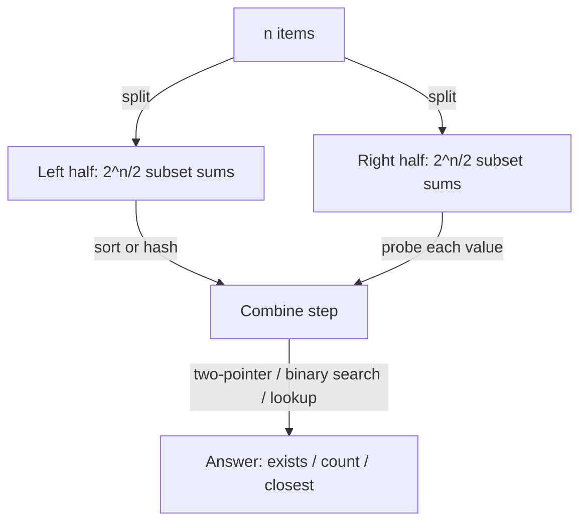

# Meet in the Middle (MITM) — Junior Level

> **One-line summary:** When a brute-force search is `O(2^n)` but `n` is too big to enumerate everything, **split the input into two halves**, enumerate the `2^(n/2)` possibilities of each half independently, and then **combine** the two precomputed lists with sorting, two-pointer, binary search, or hashing. The cost drops from `O(2^n)` to roughly `O(2^(n/2) · n)` — the square root of the original.

---

## Table of Contents

1. [Introduction](#introduction)
2. [Prerequisites](#prerequisites)
3. [Glossary](#glossary)
4. [Core Concepts](#core-concepts)
5. [Big-O Summary](#big-o-summary)
6. [Real-World Analogies](#real-world-analogies)
7. [Pros & Cons](#pros--cons)
8. [Step-by-Step Walkthrough](#step-by-step-walkthrough)
9. [Code Examples](#code-examples)
10. [Coding Patterns](#coding-patterns)
11. [Error Handling](#error-handling)
12. [Performance Tips](#performance-tips)
13. [Best Practices](#best-practices)
14. [Edge Cases & Pitfalls](#edge-cases--pitfalls)
15. [Common Mistakes](#common-mistakes)
16. [Cheat Sheet](#cheat-sheet)
17. [Visual Animation](#visual-animation)
18. [Summary](#summary)
19. [Further Reading](#further-reading)

---

## Introduction

Suppose someone hands you 40 numbers and asks: *"Pick any subset of them whose sum is exactly `S`. Does such a subset exist?"* The obvious approach is to try every subset. With 40 numbers there are `2^40 ≈ 1.1 × 10^12` subsets — over a trillion. Even at a billion operations per second that is roughly 18 minutes of pure enumeration, and most real problems need this to run in well under a second.

There is a beautiful shortcut. Cut the 40 numbers into **two halves of 20 each**. Enumerate every subset of the first half (`2^20 ≈ 1,000,000` sums) and every subset of the second half (another `~1,000,000` sums). Now the question becomes: *is there a sum `a` from the left list and a sum `b` from the right list with `a + b = S`?* That is a classic two-list combine problem — sort one list and binary-search, or hash one list and look up — which is fast. The total work is about `2^20 · 20 ≈ 20` million operations instead of `2^40 ≈ 10^12`. That is the **meet in the middle** (MITM) technique, and the headline fact is:

> **Split an `O(2^n)` search into two independent halves of size `n/2`, enumerate each (`2^(n/2)` outcomes), then combine the two lists. Total cost `≈ O(2^(n/2) · n)` — the square root of the brute force.**

The name says exactly what happens: two searches start from opposite ends and **meet in the middle**. One half produces a list of "things I can build from the left"; the other produces "things I still need from the right"; the combine step matches them up. This is a *divide-and-conquer-flavored* idea — divide the exponential space into two halves and combine — but unlike classic divide-and-conquer (which recurses), MITM splits exactly once and spends its cleverness on the **combine**.

This single idea unlocks a whole family of problems you may have met separately:

- **Subset sum / partition** when `n ≈ 40` (too big for `O(2^n)`, but `weights` are huge so weight-based DP is impossible) — the running example of this file.
- **4-sum** ("do four arrays have one element each summing to a target?") — split the four arrays into two pairs.
- **Discrete logarithm** via baby-step giant-step — a number-theoretic MITM that turns `O(p)` into `O(√p)`.
- **Bidirectional BFS** — search forward from the start and backward from the goal until the two frontiers meet, cutting `O(b^d)` to `O(b^(d/2))`.
- **Knapsack** when `n` is small (≤ 40) but the weights are astronomically large, so the usual `O(n·W)` DP table cannot even be allocated.

The catch — and we say it on the first page so you never forget — is **memory**. The left list holds `2^(n/2)` sums, and you must store it to combine. For `n = 40` that is a million 64-bit numbers (~8 MB), perfectly fine. For `n = 60` it would be `2^30 ≈ 10^9` numbers (~8 GB), which is the practical ceiling of the technique. MITM trades **time for space**: you go from impossible-time to feasible-time, but you pay with a list of size `2^(n/2)`.

---

## Prerequisites

Before reading this file you should be comfortable with:

- **Subsets and bitmasks** — representing a subset of `m` items as the bits of an integer `0 .. 2^m − 1`; reading bit `i` with `(mask >> i) & 1`.
- **Sorting** — `O(m log m)` comparison sort; you will sort one of the two combined lists.
- **Binary search** — finding an element (or a boundary) in a sorted array in `O(log m)`. See sibling `02-binary-search` patterns.
- **Two-pointer technique** — sweeping two indices inward/outward over sorted arrays in `O(m)`.
- **Hash sets / hash maps** — `O(1)` average insert and lookup; used as the alternative to sorting in the combine step.
- **Big-O notation** — `O(2^n)`, `O(2^(n/2))`, `O(2^(n/2) · n)`, and why `2^(n/2) = √(2^n)`.

Optional but helpful:

- A glance at **breadth-first search (BFS)** for the bidirectional-search application.
- Familiarity with **modular exponentiation** (`a^x mod m`) for the discrete-logarithm application (covered fully in `middle.md`).

---

## Glossary

| Term | Meaning |
|------|---------|
| **Brute force** | Enumerating *all* `2^n` candidates directly. Correct but exponential. |
| **Meet in the middle (MITM)** | Split into two halves, enumerate `2^(n/2)` outcomes each, then combine the two lists. |
| **Half / split** | The two disjoint groups the input is divided into (left and right), usually of equal size. |
| **Subset sum** | The collection of sums you get by adding up the elements of some subset of a half. |
| **Combine step** | Matching the left list against the right list (two-pointer / binary search / hashing) to answer the question. |
| **Two-pointer** | Sweeping one index from the start of a sorted array and one from the end, moving them based on the current sum. |
| **Target `S`** | The value the two halves must jointly reach (e.g., `a + b = S`). |
| **Complement** | For a left value `a` and target `S`, the value `S − a` that the right half must supply. |
| **Time–space trade-off** | MITM spends `O(2^(n/2))` *memory* to save exponential *time*. |
| **`2^(n/2)`** | The square root of `2^n`; the size of each half's enumeration and the heart of the speedup. |

---

## Core Concepts

### 1. Why Brute Force Is `O(2^n)`

A subset of `n` items corresponds to a length-`n` bitmask: each item is either in or out. There are `2^n` such masks, and computing the sum of each (naively) is `O(n)`, so checking every subset is `O(2^n · n)`. For `n = 40` this is `≈ 4 × 10^13` operations — far too slow. The exponential `2^n` is the enemy.

### 2. The Split

Divide the `n` items into a **left half** `L` of size `⌈n/2⌉` and a **right half** `R` of size `⌊n/2⌋`. Crucially, every subset of the whole set is *uniquely* a subset of `L` combined with a subset of `R`. So instead of `2^n` whole-set subsets, we have `2^|L|` left-subsets and `2^|R|` right-subsets, and the whole-set count factors as `2^|L| · 2^|R| = 2^n`. We never enumerate the product; we enumerate the two factors **separately**.

### 3. Enumerate Each Half

Compute the sum of **every** subset of `L`, producing a list `sumsL` of `2^|L|` numbers. Do the same for `R`, producing `sumsR`. Each list is built in `O(2^(n/2) · (n/2))` time (or `O(2^(n/2))` with an incremental Gray-code-style trick). For `n = 40`, each list has about a million entries.

```
n items  →  split  →  L (20 items)        R (20 items)
                       enumerate            enumerate
                       2^20 subset sums     2^20 subset sums
                       = sumsL              = sumsR
```

### 4. Combine the Two Lists

Now the original question — "is there a subset of all `n` items summing to `S`?" — becomes "is there `a ∈ sumsL` and `b ∈ sumsR` with `a + b = S`?" Three standard ways to answer it:

- **Hashing:** put all of `sumsL` into a hash set. For each `b` in `sumsR`, check whether `S − b` is in the set. `O(2^(n/2))` average.
- **Sort + binary search:** sort `sumsL`. For each `b` in `sumsR`, binary-search for `S − b`. `O(2^(n/2) · log(2^(n/2))) = O(2^(n/2) · n)`.
- **Sort both + two-pointer:** sort both lists; sweep one pointer up from the start of `sumsL` and one down from the end of `sumsR`, moving based on whether `a + b` is too small or too large. `O(2^(n/2))` after the sort.

All three are dominated by the `O(2^(n/2))` size of the lists (times a `log` or `n` factor), which is the square root of the brute force.

### 5. Why `2^(n/2)` Is the Square Root

This is the whole point: `2^(n/2) = (2^n)^(1/2) = √(2^n)`. If brute force is a trillion (`2^40`), MITM is about a million (`2^20`). Taking the square root of an exponential is an enormous win — the difference between minutes and microseconds.

### 6. It Counts and Optimizes, Not Just Decides

MITM is not limited to yes/no. By sorting one list you can also:

- **Find the subset sum closest to `S`** (or the largest sum `≤ S`) — for each right value, binary-search the best matching left value.
- **Count** how many subset pairs reach exactly `S`, or how many are `≤ S` — count matches instead of just detecting one.
- **Reconstruct** which items were chosen — store the bitmask alongside each sum so you can report the actual subset.

These richer queries are exactly why MITM beats a plain hash-set membership check in many problems.

---

## Big-O Summary

| Operation | Time | Space | Notes |
|-----------|------|-------|-------|
| Brute force (all subsets) | **O(2^n · n)** | O(1) | The baseline we are beating. |
| Enumerate one half | O(2^(n/2) · n) | O(2^(n/2)) | Build a list of `2^(n/2)` subset sums. |
| Sort one half's list | O(2^(n/2) · n) | O(2^(n/2)) | `log(2^(n/2)) = n/2`. |
| Combine via hashing | O(2^(n/2)) avg | O(2^(n/2)) | Hash one list, probe with the other. |
| Combine via binary search | O(2^(n/2) · n) | O(2^(n/2)) | Sort one, binary-search the other. |
| Combine via two-pointer | O(2^(n/2)) | O(2^(n/2)) | After both lists are sorted. |
| **MITM total** | **O(2^(n/2) · n)** | **O(2^(n/2))** | Square root of brute force in time. |

The headline numbers are **time `O(2^(n/2) · n)`** and **space `O(2^(n/2))`**. The exponent is *halved* — `2^(n/2)` instead of `2^n` — which is the entire reason the technique exists. The space cost is the price you pay.

---

## Real-World Analogies

| Concept | Analogy |
|---------|---------|
| Brute force `2^n` | Searching a 40-room mansion by checking every possible combination of rooms — astronomically many. |
| The split | Two detectives split the mansion: one takes the west wing (20 rooms), the other the east wing (20 rooms). |
| Enumerate each half | Each detective lists every possible "loot total" they could carry out of their own wing. |
| Combine step | They meet in the lobby and ask: "Does your total plus mine equal the stolen amount `S`?" — comparing two short lists instead of one giant one. |
| Two pointers meeting | Digging a tunnel from both ends of a mountain so the crews meet halfway: each crew only digs half the length. |
| Time–space trade-off | Each detective must *write down* their list of totals — that notebook is the extra memory MITM consumes. |

Where the analogy breaks: real detectives can communicate while searching, but in MITM the two halves are enumerated **fully and independently** first, and only *then* combined. The independence is exactly what makes the factoring `2^|L| · 2^|R|` valid.

---

## Pros & Cons

| Pros | Cons |
|------|------|
| Turns `O(2^n)` into `O(2^(n/2))` — the **square root** of brute force. | Needs `O(2^(n/2))` **memory** to store one half's list; the hard ceiling around `n ≈ 50–60`. |
| Works when weights/values are **huge**, where `O(n·W)` DP cannot allocate a table. | Only helps when the problem **decomposes** into two independent halves whose results combine cheaply. |
| Flexible combine: detect, count, closest-to-`S`, `≤ S`, reconstruct subset. | The combine logic (two-pointer / binary search) is fiddly and a frequent bug source. |
| One technique covers subset-sum, 4-sum, knapsack, discrete log, bidirectional BFS. | For *small* `n` (≤ 20) plain brute force is simpler and just as fast. |
| No floating point — exact integer sums (watch overflow). | Duplicate sums must be handled carefully when **counting** (not just detecting). |

**When to use:** `n` roughly in `30 .. 50`; an exponential `2^n` search that is too slow but whose state splits cleanly into two halves; huge weights that rule out value/weight DP; closest-sum or count-subsets-≤-S queries; discrete logarithm over a group; shortest path where both the start and goal are known (bidirectional BFS).

**When NOT to use:** `n ≤ 20` (just brute-force it); `n ≥ 60` (the `2^(n/2)` list will not fit in memory); problems where weights are small so a polynomial `O(n·W)` DP is better; problems that do not split into two independent halves.

---

## Step-by-Step Walkthrough

**Problem.** Items `[3, 34, 4, 12, 5, 2]` (`n = 6`). Does some subset sum to exactly `S = 9`?

We use `n = 6` so the lists are tiny and you can verify everything by hand; the real win shows up at `n ≈ 40`.

**Step 1 — Split.** Left `L = [3, 34, 4]`, right `R = [12, 5, 2]`.

**Step 2 — Enumerate `L` (all `2^3 = 8` subset sums).**

```
mask 000 → {}          sum 0
mask 001 → {3}         sum 3
mask 010 → {34}        sum 34
mask 011 → {3,34}      sum 37
mask 100 → {4}         sum 4
mask 101 → {3,4}       sum 7
mask 110 → {34,4}      sum 38
mask 111 → {3,34,4}    sum 41
sumsL = [0, 3, 34, 37, 4, 7, 38, 41]
```

**Step 3 — Enumerate `R` (all `2^3 = 8` subset sums).**

```
mask 000 → {}          sum 0
mask 001 → {12}        sum 12
mask 010 → {5}         sum 5
mask 011 → {12,5}      sum 17
mask 100 → {2}         sum 2
mask 101 → {12,2}      sum 14
mask 110 → {5,2}       sum 7
mask 111 → {12,5,2}    sum 19
sumsR = [0, 12, 5, 17, 2, 14, 7, 19]
```

**Step 4 — Sort one side, say `sumsL`.**

```
sumsL sorted = [0, 3, 4, 7, 34, 37, 38, 41]
```

**Step 5 — Combine: for each `b` in `sumsR`, look for `S − b = 9 − b` in `sumsL`.**

```
b = 0  → need 9  in sumsL? no
b = 12 → need −3 (skip, negative — no non-negative subset can be negative)
b = 5  → need 4  in sumsL? YES  → found!  (4 from L = {4},  5 from R = {5})
```

So the subset `{4, 5}` sums to `9`. The two halves **met in the middle**: the left half supplied `4`, the right half supplied `5`, and `4 + 5 = 9 = S`.

**Verification by hand.** Indeed `4` and `5` are both in the original list `[3, 34, 4, 12, 5, 2]`, and `4 + 5 = 9`. The MITM answer is correct. Note we never enumerated all `2^6 = 64` whole-set subsets — only `8 + 8 = 16` half-subsets plus a cheap combine.

---

## Code Examples

### Example: Subset Sum — Does a subset reach exactly `S`? (MITM)

This splits the array, enumerates each half's subset sums, sorts the left list, and binary-searches each right value's complement.

#### Go

```go
package main

import (
	"fmt"
	"sort"
)

// subsetSums returns all 2^len(items) subset sums of items.
func subsetSums(items []int64) []int64 {
	m := len(items)
	out := make([]int64, 1<<m)
	for mask := 0; mask < (1 << m); mask++ {
		var s int64
		for i := 0; i < m; i++ {
			if mask&(1<<i) != 0 {
				s += items[i]
			}
		}
		out[mask] = s
	}
	return out
}

// canReach reports whether some subset of arr sums to exactly target.
func canReach(arr []int64, target int64) bool {
	mid := len(arr) / 2
	left := subsetSums(arr[:mid])
	right := subsetSums(arr[mid:])
	sort.Slice(left, func(i, j int) bool { return left[i] < left[j] })
	for _, b := range right {
		need := target - b
		// binary search for `need` in the sorted left list
		idx := sort.Search(len(left), func(i int) bool { return left[i] >= need })
		if idx < len(left) && left[idx] == need {
			return true
		}
	}
	return false
}

func main() {
	arr := []int64{3, 34, 4, 12, 5, 2}
	fmt.Println(canReach(arr, 9))  // true  ({4,5})
	fmt.Println(canReach(arr, 11)) // true  ({3,4,2}... actually {5,4,2}=11)
	fmt.Println(canReach(arr, 100)) // false
}
```

#### Java

```java
import java.util.*;

public class SubsetSumMITM {

    static long[] subsetSums(long[] items) {
        int m = items.length;
        long[] out = new long[1 << m];
        for (int mask = 0; mask < (1 << m); mask++) {
            long s = 0;
            for (int i = 0; i < m; i++) {
                if ((mask & (1 << i)) != 0) s += items[i];
            }
            out[mask] = s;
        }
        return out;
    }

    static boolean canReach(long[] arr, long target) {
        int mid = arr.length / 2;
        long[] left = subsetSums(Arrays.copyOfRange(arr, 0, mid));
        long[] right = subsetSums(Arrays.copyOfRange(arr, mid, arr.length));
        Arrays.sort(left);
        for (long b : right) {
            long need = target - b;
            // binary search for `need`
            int idx = Arrays.binarySearch(left, need);
            if (idx >= 0) return true;
        }
        return false;
    }

    public static void main(String[] args) {
        long[] arr = {3, 34, 4, 12, 5, 2};
        System.out.println(canReach(arr, 9));   // true
        System.out.println(canReach(arr, 11));  // true
        System.out.println(canReach(arr, 100)); // false
    }
}
```

#### Python

```python
from bisect import bisect_left


def subset_sums(items):
    m = len(items)
    out = [0] * (1 << m)
    for mask in range(1 << m):
        s = 0
        for i in range(m):
            if mask & (1 << i):
                s += items[i]
        out[mask] = s
    return out


def can_reach(arr, target):
    mid = len(arr) // 2
    left = sorted(subset_sums(arr[:mid]))
    right = subset_sums(arr[mid:])
    for b in right:
        need = target - b
        idx = bisect_left(left, need)
        if idx < len(left) and left[idx] == need:
            return True
    return False


if __name__ == "__main__":
    arr = [3, 34, 4, 12, 5, 2]
    print(can_reach(arr, 9))    # True  ({4,5})
    print(can_reach(arr, 11))   # True
    print(can_reach(arr, 100))  # False
```

**What it does:** splits `[3,34,4,12,5,2]` into two halves, enumerates 8 subset sums each, sorts the left list, and for every right sum `b` binary-searches for `S − b`. Finds `{4, 5} → 9`.
**Run:** `go run main.go` | `javac SubsetSumMITM.java && java SubsetSumMITM` | `python subset.py`

---

## Coding Patterns

### Pattern 1: Brute-Force Oracle (the truth you test against)

**Intent:** Before trusting MITM, answer the question the slow obvious way and check the two agree on small inputs.

```python
def can_reach_bruteforce(arr, target):
    n = len(arr)
    for mask in range(1 << n):          # all 2^n subsets
        s = sum(arr[i] for i in range(n) if mask & (1 << i))
        if s == target:
            return True
    return False
```

This is `O(2^n · n)` — too slow for `n = 40`, but the perfect correctness oracle for `n ≤ 20`. MITM must give the same answer.

### Pattern 2: Enumerate-Half via Bitmask Loop

**Intent:** Build the list of `2^m` subset sums of one half. The reusable building block of every MITM solution.

```python
def subset_sums(items):
    out = [0]
    for x in items:                     # incremental doubling
        out += [s + x for s in out]     # new sums extend each old sum by x
    return out
```

This incremental version is `O(2^m)` total (each element doubles the list once) and avoids recomputing sums from scratch — a clean speedup over the per-mask inner loop.

### Pattern 3: Combine via Hash Set (detect existence)

**Intent:** Fastest combine when you only need *existence*, not order or counting.

```python
def can_reach_hash(arr, target):
    mid = len(arr) // 2
    leftset = set(subset_sums(arr[:mid]))
    return any((target - b) in leftset for b in subset_sums(arr[mid:]))
```



---

## Error Handling

| Error | Cause | Fix |
|-------|-------|-----|
| Wrong / missing answers | Enumerated only one half, forgot the empty subset (`sum 0`). | The empty subset (`mask 0`, sum `0`) is a valid subset; always include it. |
| Off-by-one on the split | `arr[:mid]` and `arr[mid:]` overlap or drop an element. | Use exactly `mid = n/2`; left is `[0:mid]`, right is `[mid:n]`. |
| Integer overflow | Sums of large `int` values exceed 32-bit range. | Use 64-bit (`int64` / `long`); in Java cast before adding. |
| Binary search returns garbage | Searched an *unsorted* list. | Sort the list *before* any binary search. |
| Negative complement matched wrong | `S − b` negative but list has non-negatives. | Skip / it simply won't be found; ensure search handles it (no false positive). |
| Counting double-counts | Same sum value appears multiple times and you stop at first match. | For counting, count *all* matches (use `bisect_left`/`bisect_right` range), not just one. |
| Out-of-memory | `n` too large; `2^(n/2)` list does not fit. | MITM only works up to `n ≈ 50`; beyond that, rethink the approach. |

---

## Performance Tips

- **Build lists incrementally** (Pattern 2): doubling the list per element is `O(2^m)`, beating the `O(2^m · m)` per-mask inner loop.
- **Hash for existence, sort for richer queries.** A hash set gives `O(1)` membership; sort only when you need closest-to-`S`, counting, or two-pointer.
- **Sort the smaller list** when the two halves differ in size (odd `n`): binary-searching into the smaller sorted list is cheaper per probe.
- **Prefer two-pointer over per-element binary search** for *counting* `≤ S` pairs: one `O(m)` sweep beats `m` separate `O(log m)` searches and avoids log factors.
- **Reuse buffers.** Allocating fresh lists for every query pressures the garbage collector; preallocate when running many MITM queries.
- **Skip impossible halves early** — if even the maximum right sum plus the maximum left sum is `< S`, bail out before combining.

---

## Best Practices

- Always test MITM against the brute-force oracle (Pattern 1) on random small inputs (`n ≤ 18`) before trusting it on large `n`.
- Split as **evenly** as possible: `⌈n/2⌉` and `⌊n/2⌋`. An unbalanced split wastes the speedup (the larger half dominates).
- Decide up front whether you are **detecting**, **counting**, or finding the **closest** sum — the combine step differs for each.
- Keep `subset_sums` (enumerate a half) and the combine logic as separate, individually testable functions; most bugs hide in the combine.
- Document which combine strategy you chose (hash vs sort+search vs two-pointer) and why; it affects complexity and whether duplicates are handled.
- Use a named constant for the target and 64-bit integers throughout; never mix 32-bit and 64-bit sums.

---

## Edge Cases & Pitfalls

- **Empty input (`n = 0`)** — the only subset is the empty one (sum `0`); the answer is `S == 0`.
- **`S = 0`** — always satisfiable by the empty subset; make sure your code reports `true`.
- **Odd `n`** — split into `⌈n/2⌉` and `⌊n/2⌋`; the halves are unequal but that is fine.
- **All elements larger than `S`** — only the empty subset can reach `S = 0`; otherwise no subset works.
- **Negative numbers** — MITM still works (sums can be negative), but you cannot prune negative complements; the algebra is unchanged.
- **Duplicate values** — fine for *detection*; for *counting* you must count every matching pair, including duplicates.
- **Memory ceiling** — `n = 50` means `2^25 ≈ 33M` entries per list (~256 MB as int64); `n = 60` is `2^30` and will not fit. Know your limit.

---

## Common Mistakes

1. **Forgetting the empty subset** — `sum 0` is a legitimate subset sum; dropping it breaks targets reachable only with one half empty.
2. **Binary-searching an unsorted list** — always sort first; an unsorted binary search silently returns wrong indices.
3. **Using 32-bit integers** — subset sums of 40 numbers up to `10^9` reach `4 × 10^10`, overflowing `int`. Use 64-bit.
4. **Unbalanced split** — splitting `35 + 5` instead of `20 + 20` leaves a `2^35` half that defeats the purpose.
5. **Counting via first-match** — stopping at the first match counts only *one* pair; for counting, tally all matches.
6. **Re-enumerating per query** — if you answer many targets on the same array, enumerate the halves *once* and reuse the sorted list.
7. **Confusing MITM with DP** — MITM does *not* use the weights' magnitude; it is the right tool precisely when weights are huge and `n` is small.

---

## Cheat Sheet

| Question | Combine strategy | Complexity |
|----------|------------------|------------|
| Does a subset sum to exactly `S`? | hash set, or sort + binary search | `O(2^(n/2) · n)` |
| Largest subset sum `≤ S` | sort + binary search (best ≤) | `O(2^(n/2) · n)` |
| Subset sum closest to `S` | sort + binary search neighbors | `O(2^(n/2) · n)` |
| Count subset pairs summing to `S` | sort both + two-pointer (with multiplicities) | `O(2^(n/2))` |
| Count subset pairs with sum `≤ S` | sort both + two-pointer | `O(2^(n/2))` |
| Reconstruct the chosen subset | store bitmask alongside each sum | `O(2^(n/2) · n)` |

Core algorithm:

```
mitm(arr, S):
    mid   = len(arr) / 2
    left  = all subset sums of arr[:mid]      # 2^(n/2) values
    right = all subset sums of arr[mid:]      # 2^(n/2) values
    sort(left)
    for b in right:
        if (S - b) found in left: return YES
    return NO
# time  O(2^(n/2) · n),  space O(2^(n/2))
```

---

## Visual Animation

> See [`animation.html`](./animation.html) for an interactive visualization.
>
> The animation demonstrates:
> - Splitting the array into a left half and a right half
> - Enumerating all `2^(n/2)` subset sums of each half (each subset highlighted)
> - Sorting the left list
> - A two-pointer / binary-search sweep that finds the pair `a + b = S` where the two halves "meet"
> - Step / Run / Reset controls to watch the meeting pair light up

---

## Summary

Meet in the middle takes an exponential `O(2^n)` search and **splits it once** into two independent halves of size `n/2`. Each half is enumerated separately (`2^(n/2)` subset sums), and then the two lists are **combined** with sorting plus two-pointer, binary search, or hashing. Because `2^(n/2) = √(2^n)`, the time cost is the *square root* of brute force — a trillion becomes a million. The price is memory: you must store one half's list of size `2^(n/2)`, which caps the technique around `n ≈ 50`. The running example is subset sum (does some subset reach exactly `S`?), but the same split-and-combine idea powers 4-sum, knapsack with huge weights, baby-step giant-step discrete logarithm, and bidirectional BFS. Master the two pieces — enumerate a half, then combine two lists — and you can crack search spaces that brute force cannot touch.

---

## Further Reading

- *Introduction to Algorithms* (CLRS) — subset-sum and the exponential vs pseudo-polynomial distinction.
- Horowitz & Sahni (1974), "Computing partitions with applications to the knapsack problem" — the original MITM subset-sum paper.
- Sibling topic `02-binary-search` (in `01-foundations`) — the search used in the combine step.
- Sibling topic `12-dynamic-programming` `knapsack` — the alternative when weights are *small*.
- cp-algorithms.com — "Meet-in-the-middle" and "Discrete logarithm (baby-step giant-step)".
- See [`middle.md`](./middle.md) for combine strategies (two-pointer, counting), 4-sum, bidirectional BFS, and baby-step giant-step.

