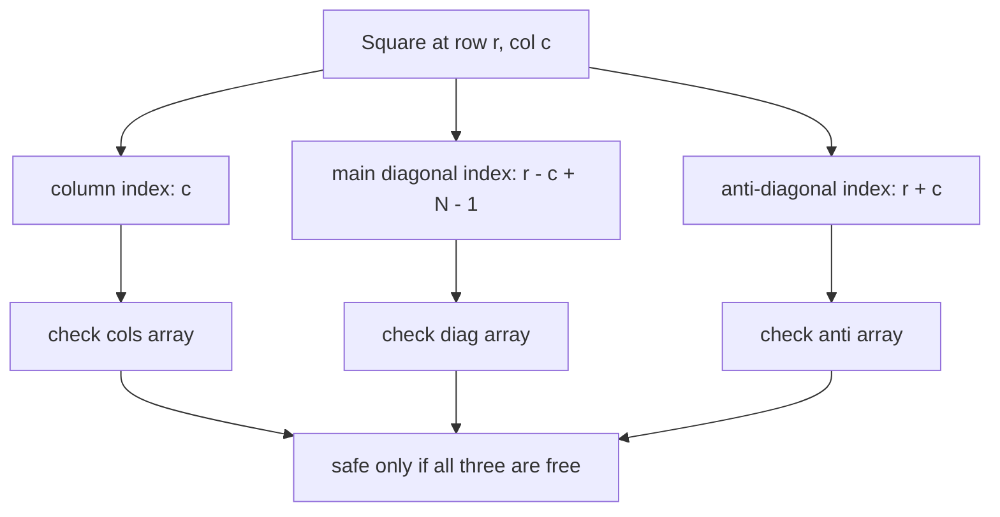

# N-Queens (The Canonical Backtracking Problem) — Junior Level

> **One-line summary:** Place `N` chess queens on an `N×N` board so that no two attack each other. Solve it by **backtracking**: put one queen per row, and before placing each queen check in `O(1)` whether its column, diagonal, or anti-diagonal is already occupied; if no square works, undo the last queen and try the next option.

---

## Table of Contents

1. [Introduction](#introduction)
2. [Prerequisites](#prerequisites)
3. [Glossary](#glossary)
4. [Core Concepts](#core-concepts)
5. [Big-O Summary](#big-o-summary)
6. [Real-World Analogies](#real-world-analogies)
7. [Pros & Cons](#pros--cons)
8. [Step-by-Step Walkthrough](#step-by-step-walkthrough)
9. [Code Examples](#code-examples)
10. [Coding Patterns](#coding-patterns)
11. [Error Handling](#error-handling)
12. [Performance Tips](#performance-tips)
13. [Best Practices](#best-practices)
14. [Edge Cases & Pitfalls](#edge-cases--pitfalls)
15. [Common Mistakes](#common-mistakes)
16. [Cheat Sheet](#cheat-sheet)
17. [Visual Animation](#visual-animation)
18. [Summary](#summary)
19. [Further Reading](#further-reading)

---

## Introduction

A chess queen attacks along its **row**, its **column**, and both **diagonals**. The N-Queens puzzle asks: *can you place `N` queens on an `N×N` board so that no two of them attack each other?* For the classic case of `N = 8` the answer is yes — there are 92 distinct ways to do it. For `N = 2` and `N = 3` it is impossible, and for every other `N` it is possible.

This puzzle is the **textbook example of backtracking** — the algorithm-design technique where you build a solution one piece at a time, and the moment a partial solution becomes impossible to finish, you **undo** your last choice and try a different one. Backtracking is just a smart, pruned version of brute force: instead of generating every arrangement and then checking it, you check *as you build* and abandon dead ends early.

The key insight that makes N-Queens clean is this: **a valid solution has exactly one queen in every row.** Two queens in the same row would always attack each other, so we never even consider that. This lets us decide the queens **row by row** — place a queen somewhere in row 0, then somewhere in row 1, and so on. At each row we only have to choose a *column*. That turns a messy 2D placement problem into a tidy sequence of `N` choices.

The second insight is that the "is this square safe?" test can be made **`O(1)`** instead of scanning the whole board. We keep three sets (or boolean arrays) recording which columns, which diagonals, and which anti-diagonals are already under attack. A square at row `r`, column `c` sits on column `c`, on the diagonal identified by `r - c` (constant along a `↘` diagonal), and on the anti-diagonal identified by `r + c` (constant along a `↙` diagonal). Checking and updating those three lookups is constant time.

Put together — **one queen per row + `O(1)` conflict checks + undo on failure** — and you have a compact, fast recursive search that finds one solution, counts all solutions, or prints every board. Later, a **bitmask** version replaces the three sets with three integers and uses bit tricks to iterate only over safe columns, making the search several times faster. We build up to that gradually.

---

## Prerequisites

Before reading this file you should be comfortable with:

- **Recursion** — a function that calls itself, with a base case that stops the recursion. Backtracking *is* recursion plus undoing.
- **2D grids / coordinates** — addressing a board by `(row, column)`, both starting at 0.
- **Boolean arrays or hash sets** — to mark "this column is taken" in `O(1)`.
- **Loops and conditionals** — the inner loop tries each column in a row.
- **Big-O notation** — we will talk about why the search is exponential but heavily pruned.

Optional but helpful:

- A glance at **DFS (depth-first search)** — backtracking explores a tree depth-first, where each tree level is a board row.
- Basic **bit operations** (`&`, `|`, `^`, shifting) — needed only for the bitmask speedup near the end.

You do **not** need to know chess strategy. You only need the one rule: a queen attacks along its row, column, and both diagonals.

---

## Glossary

| Term | Meaning |
|------|---------|
| **Queen** | A chess piece that attacks any square in the same row, column, or either diagonal. |
| **N-Queens** | The problem of placing `N` non-attacking queens on an `N×N` board. |
| **Backtracking** | Build a solution incrementally; on hitting a dead end, undo the last choice and try another. |
| **Partial placement** | A board with queens placed in rows `0..r-1` and rows `r..N-1` still empty. |
| **Conflict / attack** | Two queens share a row, column, diagonal, or anti-diagonal. |
| **Diagonal (`↘`)** | The set of squares where `row - col` is constant. Indexed `r - c` (or `r - c + N - 1` to keep it non-negative). |
| **Anti-diagonal (`↙`)** | The set of squares where `row + col` is constant. Indexed `r + c`. |
| **Pruning** | Cutting off a branch of the search the instant it cannot lead to a valid solution. |
| **Search tree** | The tree of all partial placements the algorithm explores; depth = `N`, one level per row. |
| **Bitmask** | An integer whose bits represent a set (e.g. occupied columns), enabling `O(1)` set operations. |
| **Lowbit** | `x & -x`, isolating the lowest set bit — used to iterate over safe columns one at a time. |

---

## Core Concepts

### 1. One Queen Per Row

Because two queens in the same row always attack, **every solution places exactly one queen in each of the `N` rows.** So we process rows top to bottom. At row `r` the only decision is *which column* to use. This reduces the problem to choosing a column for each row — a sequence of `N` decisions — and naturally bounds the search depth to `N`.

We store the placement as an array `pos`, where `pos[r] = c` means "the queen in row `r` is in column `c`." A finished board is just an array of `N` column indices.

### 2. The `O(1)` Conflict Check

When we try to place a queen at `(r, c)`, three things could be wrong:

- **Same column** — some earlier queen already uses column `c`. Track with a set/array `cols`.
- **Same `↘` diagonal** — squares on a `↘` diagonal all share the value `r - c`. Two queens collide diagonally iff they have equal `r - c`. Because `r - c` ranges from `-(N-1)` to `N-1`, we shift it by `+ (N - 1)` to index an array of size `2N - 1`. Track with `diag` indexed by `r - c + N - 1`.
- **Same `↙` anti-diagonal** — squares on a `↙` anti-diagonal all share `r + c`, ranging `0` to `2N - 2`. Track with `anti` indexed by `r + c`.

So the safety test is just three array reads:

```
safe(r, c) = not cols[c] and not diag[r - c + N - 1] and not anti[r + c]
```

That is `O(1)`, no board scan needed. When we place the queen we set all three to `true`; when we backtrack we set them back to `false`.

### 3. The Backtracking Recursion

The recursion takes the current row `r`:

```
solve(r):
    if r == N:                      # all rows filled → a complete valid board
        record solution
        return
    for c in 0..N-1:
        if safe(r, c):
            place queen at (r, c)    # set pos[r]=c, mark cols/diag/anti
            solve(r + 1)             # recurse to the next row
            remove queen from (r, c) # UNDO: unmark cols/diag/anti
```

The `place ... solve ... remove` triple is the heart of backtracking. We try a choice, explore everything that follows from it, then **undo it** so the next column starts from a clean state.

### 4. Pruning Cuts the Search Down

A naive brute force would place queens anywhere and check at the end — that explores `N^N` (or worse) arrangements. Backtracking *prunes*: as soon as a row has **no safe column**, the `for` loop finishes without recursing, and we return to the previous row to try a different column there. Whole subtrees of doomed arrangements are never visited. This is why N-Queens is tractable for moderately large `N` even though the worst case is exponential.

### 5. Find One vs Count All vs Print All

The same recursion answers three different questions with a tiny change:

- **Find one solution:** return `true` as soon as `r == N`, and stop recursing.
- **Count all solutions:** increment a counter at `r == N` and keep going (never stop early).
- **Print all boards:** at `r == N`, render `pos` into a board and output it.

### 6. The Bitmask Speedup (Preview)

Instead of three boolean arrays we can use three **integers** as bitmasks: `cols`, `diag`, `anti`. A square is safe iff its bit is `0` in all three. The clever part: `available = ~(cols | diag | anti)` (masked to `N` bits) has a `1` in every safe column, and we iterate those bits with the **lowbit** trick `bit = available & -available`. Diagonals shift naturally between rows (`diag << 1`, `anti >> 1`). This is the fastest common implementation and is covered fully in [`middle.md`](./middle.md).

---

## Big-O Summary

| Operation | Time | Space | Notes |
|-----------|------|-------|-------|
| Safety check `safe(r, c)` | **O(1)** | O(N) for the three sets | Three array/bit lookups. |
| Place / remove a queen | O(1) | — | Set/unset three markers. |
| Find **one** solution | exponential worst case, fast in practice | O(N) | Pruning keeps it small. |
| Count **all** solutions | **O(N!)**-ish upper bound, far less in practice | O(N) recursion depth | No closed form for the count. |
| Print all solutions | O(#solutions · N) to emit | O(N) | Dominated by output. |
| Bitmask version (count all) | Same big-O, ~3–8× faster constant | O(N) recursion | Bit tricks, cache-friendly. |

The search-tree depth is exactly `N` (one level per row), and each node branches over at most `N` columns, so a loose upper bound is `O(N^N)`. The column constraint alone tightens it to `O(N!)`, and diagonal pruning makes the *actual* explored tree vastly smaller. There is **no known closed-form formula** for the number of solutions; it must be computed by search.

---

## Real-World Analogies

| Concept | Analogy |
|---------|---------|
| One queen per row | Seating exactly one guest per table row — you decide each row's seat in turn. |
| Conflict check | A clash detector: a new guest can't sit in a column, diagonal, or anti-diagonal already "claimed." |
| Backtracking / undo | Filling a Sudoku in pencil: write a digit, and if it leads to a contradiction, erase it and try the next. |
| Pruning dead ends | A maze solver that turns back the instant a corridor is walled off, instead of walking to the end. |
| Diagonal index `r - c` | A street grid where every `↘` avenue shares one address number — easy to test for "same avenue." |
| Bitmask of columns | A row of light switches; one integer's bits tell you at a glance which columns are still free. |

Where the analogy breaks: chess queens also attack at a *distance* with no blocking, so two queens on the same diagonal conflict no matter how far apart — unlike, say, neighbours-only constraints.

---

## Pros & Cons

| Pros | Cons |
|------|------|
| Simple, compact recursion — easy to write and reason about. | Worst case is exponential; not for arbitrarily huge `N`. |
| `O(1)` conflict checks via column/diagonal/anti-diagonal sets. | Counting *all* solutions grows steeply (e.g. `N=15` already has 2,279,184). |
| Pruning skips enormous numbers of doomed boards. | No formula for the solution count — you must search. |
| The same template counts, finds, or prints with a one-line change. | Naive (board-scan) safety checks are slow if you forget the index trick. |
| Bitmask version is genuinely fast for `N` up to ~16–18 to count all. | Bit tricks are easy to get subtly wrong (diagonal shift direction). |

**When to use:** any constraint-satisfaction puzzle where you place items one "slot" at a time with `O(1)` legality checks — N-Queens itself, Sudoku, graph coloring, the knight's tour, crosswords.

**When NOT to use:** when `N` is so large that even counting one solution by search is too slow — for *constructing* (not counting) a single solution at huge `N`, there are direct formulas (see [`senior.md`](./senior.md)).

---

## Step-by-Step Walkthrough

Let's solve `N = 4` by hand. We process rows 0,1,2,3 and pick a column for each. We write `pos = [c0, c1, ...]`.

**Row 0.** Try column 0. Safe (board empty). `pos = [0]`. Mark col 0, diag `0-0=0`, anti `0+0=0`.

**Row 1.** Try column 0 → same column, blocked. Column 1 → anti-diagonal `1+1=2`? No conflict there, but diagonal `1-1=0` collides with the queen at `(0,0)` whose diagonal is `0`. Blocked. Column 2 → col free, diag `1-2=-1`, anti `1+2=3`, all clear. Place. `pos = [0, 2]`.

**Row 2.** Try col 0 → blocked (col 0 used). Col 1 → diag `2-1=1` free, anti `2+1=3` collides with queen `(1,2)` (anti `3`). Blocked. Col 2 → col used. Col 3 → diag `2-3=-1` collides with queen `(1,2)` (diag `-1`). Blocked. **No safe column in row 2!** Dead end → **backtrack** to row 1.

**Back at Row 1.** Undo queen at col 2. Try col 3 → col free, diag `1-3=-2`, anti `1+3=4`, all clear. Place. `pos = [0, 3]`.

**Row 2.** Col 0 used. Col 1 → diag `2-1=1`, anti `2+1=3`, both free. Place. `pos = [0, 3, 1]`.

**Row 3.** Col 0 used. Col 1 used. Col 2 → diag `3-2=1` collides with queen `(2,1)` (diag `1`). Blocked. Col 3 used. **No safe column!** Dead end → backtrack to row 2, then (no more cols) to row 1, then (no more cols) to row 0.

**Back at Row 0.** Undo col 0. Try col 1. Place. `pos = [1]`.

Continuing this way, the search finds the first full solution:

```
pos = [1, 3, 0, 2]

. Q . .
. . . Q
Q . . .
. . Q .
```

Verify: columns 1,3,0,2 are all distinct (no column clash); diagonals `0-1, 1-3, 2-0, 3-2 = -1,-2,2,1` are all distinct; anti-diagonals `1,4,2,5` are all distinct. No two queens attack. The second (and last) `N=4` solution is the mirror image, `pos = [2, 0, 3, 1]`.

That is the entire algorithm: try, recurse, undo on failure, prune dead rows.

---

## Code Examples

### Example: Count All N-Queens Solutions (boolean-array version)

This is the clearest implementation: one queen per row, three boolean arrays for `O(1)` checks, and a counter.

#### Go

```go
package main

import "fmt"

func countNQueens(n int) int {
	cols := make([]bool, n)
	diag := make([]bool, 2*n-1) // index r - c + (n - 1)
	anti := make([]bool, 2*n-1) // index r + c
	count := 0

	var solve func(r int)
	solve = func(r int) {
		if r == n { // all rows placed
			count++
			return
		}
		for c := 0; c < n; c++ {
			d := r - c + n - 1
			a := r + c
			if cols[c] || diag[d] || anti[a] {
				continue // not safe — prune
			}
			cols[c], diag[d], anti[a] = true, true, true // place
			solve(r + 1)
			cols[c], diag[d], anti[a] = false, false, false // undo
		}
	}

	solve(0)
	return count
}

func main() {
	for n := 1; n <= 9; n++ {
		fmt.Printf("N=%d -> %d solutions\n", n, countNQueens(n))
	}
}
```

#### Java

```java
public class NQueensCount {
    static int n;
    static boolean[] cols, diag, anti;
    static int count;

    static void solve(int r) {
        if (r == n) { // all rows placed
            count++;
            return;
        }
        for (int c = 0; c < n; c++) {
            int d = r - c + n - 1;
            int a = r + c;
            if (cols[c] || diag[d] || anti[a]) continue; // prune
            cols[c] = diag[d] = anti[a] = true;          // place
            solve(r + 1);
            cols[c] = diag[d] = anti[a] = false;         // undo
        }
    }

    static int countNQueens(int N) {
        n = N;
        cols = new boolean[n];
        diag = new boolean[2 * n - 1];
        anti = new boolean[2 * n - 1];
        count = 0;
        solve(0);
        return count;
    }

    public static void main(String[] args) {
        for (int N = 1; N <= 9; N++) {
            System.out.println("N=" + N + " -> " + countNQueens(N) + " solutions");
        }
    }
}
```

#### Python

```python
def count_n_queens(n: int) -> int:
    cols = [False] * n
    diag = [False] * (2 * n - 1)   # index r - c + (n - 1)
    anti = [False] * (2 * n - 1)   # index r + c
    count = 0

    def solve(r: int) -> None:
        nonlocal count
        if r == n:                 # all rows placed
            count += 1
            return
        for c in range(n):
            d = r - c + n - 1
            a = r + c
            if cols[c] or diag[d] or anti[a]:
                continue           # prune
            cols[c] = diag[d] = anti[a] = True    # place
            solve(r + 1)
            cols[c] = diag[d] = anti[a] = False   # undo

    solve(0)
    return count


if __name__ == "__main__":
    for n in range(1, 10):
        print(f"N={n} -> {count_n_queens(n)} solutions")
```

**What it does:** counts every valid arrangement for `N = 1..9`. Expected output: 1, 0, 0, 2, 10, 4, 40, 92, 352.
**Run:** `go run main.go` | `javac NQueensCount.java && java NQueensCount` | `python nqueens.py`

---

## Coding Patterns

### Pattern 1: Place / Recurse / Undo

**Intent:** The universal backtracking shape. Make a move, recurse, then revert exactly what you changed.

```python
def solve(r):
    if r == n:
        record()
        return
    for c in range(n):
        if safe(r, c):
            mark(r, c)        # apply choice
            solve(r + 1)      # explore consequences
            unmark(r, c)      # revert — leave state as you found it
```

The golden rule: **whatever you mark before recursing, unmark after.** Forgetting the undo is the #1 backtracking bug.

### Pattern 2: Early Exit for "Find One"

**Intent:** Stop the whole search the instant the first complete board appears.

```python
def solve(r):
    if r == n:
        return True           # found one — bubble up success
    for c in range(n):
        if safe(r, c):
            mark(r, c)
            if solve(r + 1):
                return True   # propagate success, skip remaining columns
            unmark(r, c)
    return False              # no column worked in this row
```

### Pattern 3: Diagonal Indexing

**Intent:** Turn the two diagonal families into array indices for `O(1)` lookup.



---

## Error Handling

| Error | Cause | Fix |
|-------|-------|-----|
| Wrong count (too high) | Forgot to undo markers after recursing. | Always unmark what you marked, symmetrically. |
| `IndexError` on diagonal array | Used raw `r - c` (can be negative). | Index with `r - c + N - 1`; size the array `2N - 1`. |
| Off-by-one in diag array size | Allocated `2N` or `N`. | The correct size is `2N - 1`. |
| Returns 0 for valid `N` | Base case `r == N` never reached / never counts. | Increment/record exactly when `r == N`. |
| Stack overflow for big `N` | Deep recursion with large `N`. | Depth is only `N`; usually fine, but cap `N` for the count-all case. |
| Counts duplicates | Tried multiple queens per row. | Enforce one queen per row by recursing on `r`, not scanning all cells. |

---

## Performance Tips

- **Use the diagonal index trick** so each safety check is `O(1)` — never rescan the board.
- **Three integers instead of arrays** (the bitmask version) cut memory traffic and let you iterate only safe columns; see [`middle.md`](./middle.md).
- **Symmetry reduction:** by the board's left–right mirror symmetry, you can fix the first-row queen to the left half of the columns, count those solutions, double the result, and handle the middle column separately for odd `N`. Roughly halves the work.
- **Iterate columns, not all cells** — the one-queen-per-row structure already eliminates the row dimension.
- **Avoid building the board until needed** — to *count*, keep only the three sets; only render a full board when you must print one.

---

## Best Practices

- Always pair every `mark` with an `unmark` in the same scope so the state is identical before and after a failed branch.
- Keep `safe(r, c)` a tiny, pure helper; most bugs hide in the conflict check.
- Decide up front whether you need **one**, **count**, or **all** — it changes the base case and whether you early-exit.
- Test small `N` against the known sequence (1, 0, 0, 2, 10, 4, 40, 92, …) before trusting larger runs.
- Name the diagonal indices clearly (`mainDiag = r - c + N - 1`, `antiDiag = r + c`) so the `+ N - 1` shift is self-documenting.

---

## Edge Cases & Pitfalls

- **`N = 1`** — trivially one solution (a single queen on a 1×1 board).
- **`N = 2` and `N = 3`** — **no solutions exist.** Your code must return 0, not crash or loop.
- **`N = 0`** — conventionally one solution (the empty board); decide and document your convention.
- **Negative diagonal index** — always shift `r - c` by `+ N - 1` before indexing.
- **Forgetting the undo** — leaves stale markers and corrupts every later branch.
- **Counting vs all-boards memory** — printing all boards for large `N` can produce millions of outputs; counting needs `O(N)` memory only.
- **Diagonals attack at any distance** — two queens on the same diagonal conflict even if far apart; don't restrict to adjacent squares.

---

## Common Mistakes

1. **No undo after recursion** — markers stay set; the count balloons or the search misses valid boards.
2. **Using `r - c` directly as an array index** — it can be negative; you need `r - c + N - 1`.
3. **Wrong diagonal array size** — it must be `2N - 1`, not `N` or `2N`.
4. **Placing more than one queen per row** — re-introduces row conflicts and duplicates; recurse on the row index instead.
5. **Stopping early when counting** — `return true` belongs to "find one", not "count all".
6. **Confusing diagonal and anti-diagonal** — `r - c` is the `↘` family; `r + c` is the `↙` family. Mixing them silently misses conflicts.
7. **Expecting a formula for the count** — there is none; the number of solutions must be searched out.

---

## Why Backtracking Beats Brute Force (One More Look)

It is worth pausing on *why* this is so much faster than generating every board. Brute force would, for `N = 8`, consider placing 8 queens on 64 squares in every combination — astronomically many arrangements — and only then check each. Backtracking instead checks **as it builds**: the instant the queen in row 2 has no safe column, it abandons *every* board that would have shared that doomed first three rows. One pruned decision near the top of the tree eliminates a whole subtree of millions of leaves below it. That is the entire reason an exponential problem becomes solvable for practical `N`: most of the search space is cut away before it is ever examined.

A useful mental model: backtracking is a **depth-first walk of a decision tree**. Each level of the tree is a board row, each branch is a column choice, and a leaf at depth `N` is a finished board. "Place" moves you one level deeper; "undo" moves you back up to try a sibling branch; "no safe column" means this node has no children worth exploring, so you immediately climb back up. The three occupancy sets are simply the bookkeeping that lets you test, in `O(1)`, whether a branch is worth taking before you descend into it.

One more reassurance for beginners: you never have to *design* the pruning. It happens automatically from the `safe` check inside the loop. If a square is unsafe, the loop just skips it; if no square is safe, the loop finishes and the function returns, which *is* the backtrack. The elegance of N-Queens is that correct conflict-checking and aggressive pruning are the same three lines of code.

## Cheat Sheet

| Need | Do |
|------|-----|
| Test square `(r, c)` safe | `!cols[c] && !diag[r-c+N-1] && !anti[r+c]` |
| Place queen | set `cols[c]`, `diag[r-c+N-1]`, `anti[r+c]` to true; `pos[r]=c` |
| Undo queen | set the same three back to false |
| Base case | `r == N` → record / count / print |
| Find one | return `true` at base case, propagate up |
| Count all | `count++` at base case, keep searching |
| Diagonal index | `↘`: `r - c + N - 1` (size `2N-1`); `↙`: `r + c` (size `2N-1`) |
| Symmetry | fix row-0 queen to left half, double the count |

Core recursion:

```
solve(r):
    if r == N: record(); return
    for c in 0..N-1:
        if cols[c] or diag[r-c+N-1] or anti[r+c]: continue
        mark(c, r-c+N-1, r+c); pos[r]=c
        solve(r+1)
        unmark(c, r-c+N-1, r+c)
```

---

## Visual Animation

> See [`animation.html`](./animation.html) for an interactive visualization.
>
> The animation demonstrates:
> - Placing queens row by row, one at a time
> - The `O(1)` conflict check highlighting the column, diagonal, and anti-diagonal under attack
> - **Backtracking** when a row has no safe square — the last queen lifts off and the search retreats
> - Adjustable `N` and Play / Pause / Step / Reset controls to watch the search tree unfold

---

## Summary

N-Queens is the canonical backtracking problem. The two structural insights make it clean: **exactly one queen per row** (so we choose only a column per row), and **`O(1)` conflict checks** using three occupancy sets keyed by column `c`, main diagonal `r - c + N - 1`, and anti-diagonal `r + c`. The recursion follows the universal backtracking shape — *place, recurse, undo* — and prunes the moment a row has no safe square, which is what keeps an exponential problem fast in practice. The same template counts all solutions, finds one, or prints every board with a one-line change at the base case. There is no closed-form formula for the number of solutions; you compute it by search. Once this is solid, the **bitmask** version (three integers, lowbit iteration) makes it several times faster — covered next in [`middle.md`](./middle.md).

---

## Further Reading

- *Introduction to Algorithms* (CLRS) — backtracking and recursive search.
- Sibling topic `recursion-backtracking` — the general technique and its many applications.
- Sibling `02-sudoku-solver` (in this section) — the same place/recurse/undo template on a richer constraint set.
- cp-algorithms.com — "Backtracking: The N-Queens problem" and bitmask optimizations.
- Donald Knuth, *The Art of Computer Programming*, Vol. 4 — exhaustive treatment of backtracking and dancing links.
- OEIS A000170 — the number of solutions to the N-Queens problem (no closed form).
