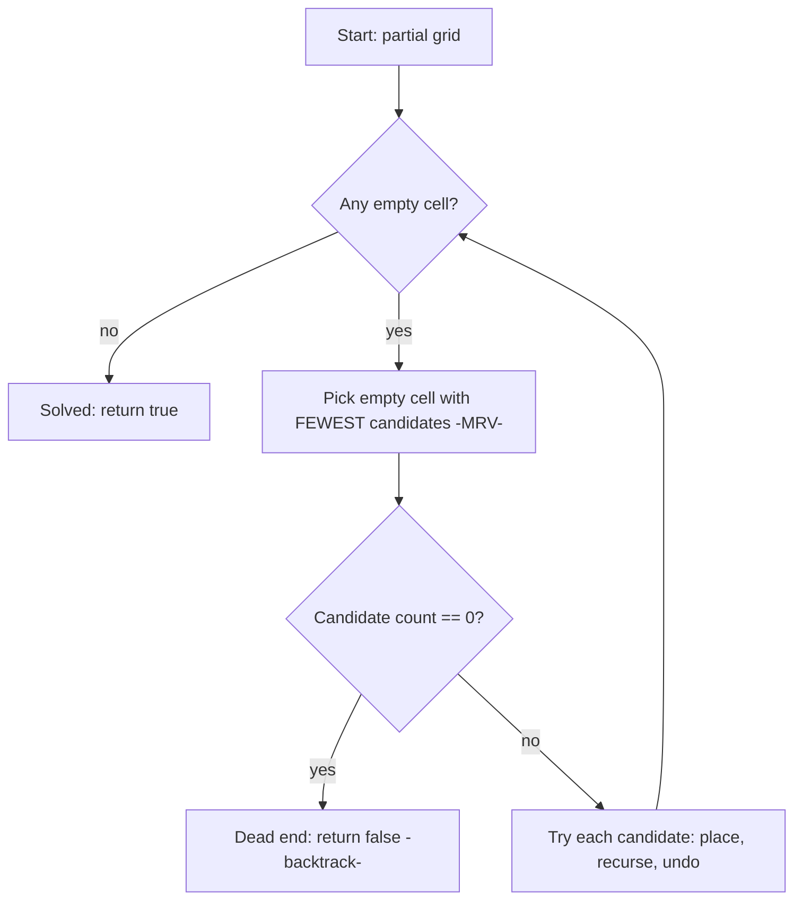

# Sudoku Solver (Backtracking + Constraint Propagation) — Junior Level

> **One-line summary:** A Sudoku solver places digits 1-9 into a 9×9 grid so that every row, every column, and every 3×3 box contains each digit exactly once. The classic technique is **backtracking**: find an empty cell, try each legal digit, recurse, and if you ever get stuck, undo the last placement and try the next digit. Choosing the **most-constrained empty cell first** (MRV) makes it dramatically faster.

---

## Table of Contents

1. [Introduction](#introduction)
2. [Prerequisites](#prerequisites)
3. [Glossary](#glossary)
4. [Core Concepts](#core-concepts)
5. [Big-O Summary](#big-o-summary)
6. [Real-World Analogies](#real-world-analogies)
7. [Pros & Cons](#pros--cons)
8. [Step-by-Step Walkthrough](#step-by-step-walkthrough)
9. [Code Examples](#code-examples)
10. [Coding Patterns](#coding-patterns)
11. [Error Handling](#error-handling)
12. [Performance Tips](#performance-tips)
13. [Best Practices](#best-practices)
14. [Edge Cases & Pitfalls](#edge-cases--pitfalls)
15. [Common Mistakes](#common-mistakes)
16. [Cheat Sheet](#cheat-sheet)
17. [Visual Animation](#visual-animation)
18. [Summary](#summary)
19. [Further Reading](#further-reading)

---

## Introduction

Sudoku is a logic puzzle on a 9×9 grid. Some cells start filled with digits 1-9; the rest are blank. Your job is to fill every blank so that three rules hold simultaneously:

1. **Row rule** — each of the 9 rows contains the digits 1-9 with no repeats.
2. **Column rule** — each of the 9 columns contains the digits 1-9 with no repeats.
3. **Box rule** — each of the nine 3×3 boxes contains the digits 1-9 with no repeats.

That is the entire game. Writing a program to *solve* an arbitrary valid puzzle is one of the most famous beginner exercises in **backtracking** — the technique of building a solution one decision at a time and undoing decisions that lead to a dead end.

The brute-force idea is almost embarrassingly simple. Walk the grid until you find an empty cell. Try putting a `1` there. Is that legal (no clash in its row, column, or box)? If yes, move on and recursively fill the rest. If filling the rest eventually fails, come back, erase the `1`, and try `2`, then `3`, and so on. If *no* digit works in this cell, you return failure to the caller, who will erase *its* digit and try its next option. This "try, recurse, undo on failure" loop is **backtracking**, and it always finds a solution if one exists.

> **The key idea:** A Sudoku solver is a depth-first search over partially filled grids. Each empty cell is a decision point with up to 9 choices; an illegal choice is pruned immediately; a dead end triggers a backtrack.

Plain backtracking works, but it can be slow if you process cells in a fixed left-to-right order. The single biggest speedup a beginner can add is the **Minimum Remaining Values (MRV)** heuristic: instead of always filling the next empty cell, fill the empty cell that has the *fewest* legal digits remaining. A cell with only one legal digit is a forced move with zero branching; filling those first collapses the search tree enormously.

Two further ideas turn this from "works on easy puzzles" into "solves anything fast":

- **Bitmasks** — represent the set of digits used in each row, column, and box as a 9-bit integer, so checking legality and listing candidates is a couple of bit operations instead of looping.
- **Constraint propagation** — before (and during) the search, repeatedly fill "forced" cells (naked singles and hidden singles) by pure logic, shrinking the puzzle so the backtracking search has almost nothing left to do.

The professional method — **Dancing Links (DLX)** implementing Knuth's **Algorithm X** — reframes Sudoku as an *exact cover* problem and is the fastest known general solver. We mention it here and cover it fully in `senior.md` and `professional.md`. For learning, master **backtracking + MRV + bitmasks** first; that combination already solves any newspaper puzzle in well under a millisecond.

---

## Prerequisites

Before this file you should be comfortable with:

- **2D arrays / grids** — reading and writing `grid[row][col]`.
- **Recursion** — a function that calls itself, with a base case that stops the recursion.
- **Backtracking basics** — the "place, recurse, undo" pattern. See sibling `01-n-queens` for the canonical introduction.
- **Boolean logic** — `&&`, `||`, `!`, and short-circuit evaluation.
- **Big-O notation** — at least informally (constant, linear, exponential).

Optional but helpful:

- **Bitwise operators** — `&` (AND), `|` (OR), `^` (XOR), `<<` (shift), and the idea of a bitmask (a set stored as the bits of an integer). We introduce them gently below.
- A glance at **depth-first search (DFS)**, since backtracking *is* DFS over a tree of partial solutions.

---

## Glossary

| Term | Meaning |
|------|---------|
| **Cell** | One of the 81 squares of the grid, addressed by `(row, col)` with `row, col ∈ 0..8`. |
| **Given / Clue** | A cell that starts pre-filled in the puzzle and must not be changed. |
| **Empty cell** | A cell to be filled, usually stored as `0` (or `.`). |
| **Box / Region** | One of the nine 3×3 sub-grids. The box of cell `(r, c)` is `(r/3)*3 + c/3` (integer division). |
| **Candidate** | A digit that can legally go in a given empty cell *right now* (no clash in its row/col/box). |
| **Backtracking** | Build the solution incrementally; on a dead end, undo the last choice and try the next. |
| **Pruning** | Discarding a choice (or whole branch) the instant it is proven illegal, before recursing. |
| **MRV** | Minimum Remaining Values: pick the empty cell with the fewest candidates next. |
| **Bitmask** | A 9-bit integer where bit `d-1` set means digit `d` is present/used. |
| **Naked single** | An empty cell with exactly one candidate — a forced move. |
| **Hidden single** | A digit that fits in only one cell of some row/column/box — also forced. |
| **Constraint propagation** | Repeatedly applying forced-move logic to fill cells without guessing. |
| **DLX / Algorithm X** | Knuth's Dancing Links exact-cover solver, the advanced professional method. |

---

## Core Concepts

### 1. The Grid and the Three Constraints

Store the puzzle as a 9×9 array of integers, `0` for empty. A digit `d` may be placed at `(r, c)` only if `d` does not already appear in:

- **row `r`** — any `grid[r][0..8]`,
- **column `c`** — any `grid[0..8][c]`,
- **box** containing `(r, c)` — the 3×3 block `(r/3, c/3)`.

A completed grid is *valid* exactly when all 27 groups (9 rows + 9 columns + 9 boxes) each contain 1-9 once.

### 2. Backtracking Search

The recursion has one job: fill the next empty cell.

```
solve(grid):
    find an empty cell (r, c)
    if none exists: return true        # grid is full → solved
    for d in 1..9:
        if legal(grid, r, c, d):
            grid[r][c] = d              # place
            if solve(grid): return true # recurse
            grid[r][c] = 0              # undo (backtrack)
    return false                       # no digit worked here
```

The `return false` is the backtrack signal: it tells the caller "your choice led nowhere; try a different one." Because each legal placement is checked *before* recursing, illegal branches are pruned instantly — we never explore a grid that already violates a rule.

### 3. Checking Legality

The naive check loops the row, the column, and the 9 box cells:

```
legal(grid, r, c, d):
    for i in 0..8:
        if grid[r][i] == d: return false   # row clash
        if grid[i][c] == d: return false   # column clash
    br, bc = (r/3)*3, (c/3)*3
    for i in 0..2:
        for j in 0..2:
            if grid[br+i][bc+j] == d: return false  # box clash
    return true
```

That is `O(1)` per call (a fixed 9+9+9 = 27 checks), but we call it a lot. Bitmasks (next) make it truly a couple of operations.

### 4. Bitmask Candidates (the `O(1)` upgrade)

Keep three arrays of 9-bit masks: `rowMask[9]`, `colMask[9]`, `boxMask[9]`. Bit `d-1` of `rowMask[r]` is set when digit `d` is already in row `r`. Then:

- **Used digits at `(r, c)`** = `rowMask[r] | colMask[c] | boxMask[b]`.
- **Candidate digits** = the bits *not* set in that union (within bits 0-8).
- **Place `d`:** set bit `d-1` in all three masks. **Undo:** clear it.
- **Count candidates:** `popcount` of the available bits — exactly what MRV needs.

This replaces 27 array reads with three OR operations and turns "how many candidates?" into one population-count instruction.

### 5. The MRV Heuristic

Instead of "find *any* empty cell," scan all empty cells and choose the one with the **fewest** candidates. Intuition: a cell with 1 candidate is forced (branch factor 1 — no real choice); a cell with 2 candidates branches only two ways. By always attacking the most-constrained cell, you minimize the branching factor at every level, and you discover contradictions (a cell with *zero* candidates) as early as possible, pruning huge subtrees. On hard puzzles MRV is often a 10×-1000× speedup over fixed-order scanning.

### 6. Constraint Propagation (Singles)

Before guessing, repeatedly apply two logical deductions:

- **Naked single:** an empty cell whose candidate set has size 1 — place that digit (no guess needed).
- **Hidden single:** a digit that can legally go in only one cell of some row/column/box — place it there.

Looping these until no more apply often solves easy puzzles with *zero* backtracking and shrinks hard ones so the search is trivial. Propagation is covered in depth in `middle.md`.

---

## Big-O Summary

| Operation | Time | Space | Notes |
|-----------|------|-------|-------|
| Legality check (naive) | O(1) (27 reads) | O(1) | Constant but repeated. |
| Legality check (bitmask) | O(1) (few ops) | O(1) | Three ORs + a bit test. |
| Find any empty cell | O(81) | O(1) | Linear scan. |
| MRV cell selection | O(81) per choice | O(1) | Scan all empties for min candidates. |
| Full solve (worst case) | **exponential** | O(81) recursion | Bounded; in practice tiny with MRV. |
| Constraint propagation pass | O(81 × 9) | O(1) | One sweep of singles. |

The worst-case running time of backtracking Sudoku is **exponential** in theory (the general N²×N² problem is NP-complete, see `professional.md`), but for the fixed 9×9 size with MRV and bitmasks, real puzzles solve in microseconds to a few milliseconds. The grid is bounded, so the recursion depth is at most 81.

---

## Real-World Analogies

| Concept | Analogy |
|---------|---------|
| Backtracking | Filling in a crossword in pencil: write a guess, keep going, and erase back to the last fork when a word won't fit. |
| Pruning illegal moves | Refusing to even write a letter that already makes an obvious clash — you don't waste ink. |
| MRV (most-constrained first) | A waiter seating guests fills the table that has only one free seat left before tackling a half-empty one — fewer ways to go wrong. |
| Naked single | A parking lot with one car-shaped gap left and one car waiting: there is only one place it can go. |
| Hidden single | "Only the kitchen has a power outlet, so the toaster *must* go in the kitchen," even though the toaster itself could physically sit anywhere. |
| Bitmask | A row of 9 light switches; flipping switch `d` records that digit `d` is taken, and you read the whole state at a glance. |

Where the analogies break: a crossword has overlapping word constraints rather than the 27 disjoint-ish groups of Sudoku, and a real waiter doesn't recurse. But the "fill the forced spot first, undo on contradiction" intuition transfers exactly.

---

## Pros & Cons

| Pros | Cons |
|------|------|
| Backtracking is simple to implement and *always* finds a solution if one exists. | Naive fixed-order backtracking can be slow on the hardest puzzles. |
| MRV + bitmasks make 9×9 solving effectively instant. | Exponential worst case for the generalized N²×N² problem (NP-complete). |
| Constraint propagation often solves easy puzzles with no guessing at all. | Propagation logic (hidden singles, etc.) adds code complexity. |
| Works unchanged for any valid puzzle, including multi-solution and no-solution inputs. | A grid with a typo (duplicate given) must be detected, or the solver reports "no solution." |
| The exact-cover / DLX view scales to other constraint puzzles. | DLX is more advanced and harder to implement correctly. |

**When to use plain backtracking + MRV + bitmasks:** essentially always for 9×9 puzzles — it is fast, short, and easy to verify.

**When to reach for DLX:** when you need the fastest general solver, must enumerate *all* solutions (e.g., uniqueness checking during puzzle generation), or are solving other exact-cover puzzles (pentominoes, N-queens as cover, etc.). See `senior.md`.

---

## Step-by-Step Walkthrough

Consider this fragment of a row that is nearly full. Suppose row 0 currently reads:

```
[ 5 3 . | . 7 . | . . . ]    (cell (0,2) is empty)
```

and its column and box constraints leave cell `(0,2)` with candidate set `{1, 2, 4}` (digits 1, 2, and 4 are the only ones not clashing). The solver does the following.

**1. Find a cell.** With MRV, suppose `(0,2)` is the most-constrained empty cell (3 candidates) — we attack it.

**2. Try the smallest candidate, `1`.** Check legality: is `1` in row 0, column 2, or box 0? Suppose no. Place it: `grid[0][2] = 1`, set bit 0 in `rowMask[0]`, `colMask[2]`, `boxMask[0]`.

**3. Recurse.** The solver moves to the next most-constrained cell and keeps going. Suppose deep in the recursion every branch dies (some later cell ends up with zero candidates — a contradiction).

**4. Backtrack to `(0,2)`.** All sub-branches under `1` failed, so we *undo*: `grid[0][2] = 0`, clear bit 0 in the three masks. Now try `2`.

**5. Try `2`.** Legal, place it, recurse. Suppose this time the recursion succeeds all the way to a full grid.

**6. Propagate success.** Each successful recursion returns `true`, unwinding the stack without undoing, leaving the completed solution in place.

The crucial moments are **step 2** (prune by legality before recursing — we never even place an illegal digit) and **step 4** (undo on dead end). Notice how a cell with zero candidates anywhere below would have caused an *immediate* `false`, pruning everything beneath it — that early failure detection is exactly what MRV maximizes by choosing constrained cells first.

A naked single makes this even cleaner: if `(0,2)` had had only `{2}` as candidates, there would be no choice — propagation places `2` directly with no branching at all.

---

## Code Examples

### Example: Backtracking Sudoku Solver with Bitmasks and MRV

This reads a 9×9 grid (`0` = empty), solves it, and prints the solution. It uses bitmask candidate sets and MRV cell selection.

#### Go

```go
package main

import (
	"fmt"
	"math/bits"
)

type Sudoku struct {
	grid     [9][9]int
	rowMask  [9]int
	colMask  [9]int
	boxMask  [9]int
}

func boxOf(r, c int) int { return (r/3)*3 + c/3 }

func (s *Sudoku) init(g [9][9]int) {
	s.grid = g
	for r := 0; r < 9; r++ {
		for c := 0; c < 9; c++ {
			if d := g[r][c]; d != 0 {
				bit := 1 << (d - 1)
				s.rowMask[r] |= bit
				s.colMask[c] |= bit
				s.boxMask[boxOf(r, c)] |= bit
			}
		}
	}
}

// candidates returns the 9-bit mask of digits legal at (r, c).
func (s *Sudoku) candidates(r, c int) int {
	used := s.rowMask[r] | s.colMask[c] | s.boxMask[boxOf(r, c)]
	return ^used & 0x1FF // bits 0..8 that are free
}

// findMRV returns the empty cell with fewest candidates, or ok=false if none.
func (s *Sudoku) findMRV() (br, bc, mask int, ok bool) {
	best := 10
	for r := 0; r < 9; r++ {
		for c := 0; c < 9; c++ {
			if s.grid[r][c] == 0 {
				m := s.candidates(r, c)
				cnt := bits.OnesCount(uint(m))
				if cnt < best {
					best, br, bc, mask, ok = cnt, r, c, m, true
					if cnt <= 1 {
						return // can't do better than 0 or 1
					}
				}
			}
		}
	}
	return
}

func (s *Sudoku) solve() bool {
	r, c, mask, ok := s.findMRV()
	if !ok {
		return true // no empty cells: solved
	}
	if mask == 0 {
		return false // dead end: an empty cell has no candidate
	}
	for m := mask; m != 0; m &= m - 1 { // iterate set bits
		bit := m & (-m)
		d := bits.TrailingZeros(uint(bit)) + 1
		s.grid[r][c] = d
		s.rowMask[r] |= bit
		s.colMask[c] |= bit
		s.boxMask[boxOf(r, c)] |= bit
		if s.solve() {
			return true
		}
		s.grid[r][c] = 0 // undo
		s.rowMask[r] &^= bit
		s.colMask[c] &^= bit
		s.boxMask[boxOf(r, c)] &^= bit
	}
	return false
}

func main() {
	puzzle := [9][9]int{
		{5, 3, 0, 0, 7, 0, 0, 0, 0},
		{6, 0, 0, 1, 9, 5, 0, 0, 0},
		{0, 9, 8, 0, 0, 0, 0, 6, 0},
		{8, 0, 0, 0, 6, 0, 0, 0, 3},
		{4, 0, 0, 8, 0, 3, 0, 0, 1},
		{7, 0, 0, 0, 2, 0, 0, 0, 6},
		{0, 6, 0, 0, 0, 0, 2, 8, 0},
		{0, 0, 0, 4, 1, 9, 0, 0, 5},
		{0, 0, 0, 0, 8, 0, 0, 7, 9},
	}
	var s Sudoku
	s.init(puzzle)
	if s.solve() {
		for r := 0; r < 9; r++ {
			fmt.Println(s.grid[r])
		}
	} else {
		fmt.Println("no solution")
	}
}
```

#### Java

```java
public class Sudoku {
    int[][] grid;
    int[] rowMask = new int[9], colMask = new int[9], boxMask = new int[9];

    static int boxOf(int r, int c) { return (r / 3) * 3 + c / 3; }

    Sudoku(int[][] g) {
        grid = g;
        for (int r = 0; r < 9; r++)
            for (int c = 0; c < 9; c++) {
                int d = g[r][c];
                if (d != 0) {
                    int bit = 1 << (d - 1);
                    rowMask[r] |= bit;
                    colMask[c] |= bit;
                    boxMask[boxOf(r, c)] |= bit;
                }
            }
    }

    int candidates(int r, int c) {
        int used = rowMask[r] | colMask[c] | boxMask[boxOf(r, c)];
        return ~used & 0x1FF;
    }

    int[] findMRV() { // returns {r, c, mask} or null
        int best = 10, br = -1, bc = -1, bmask = 0;
        for (int r = 0; r < 9; r++)
            for (int c = 0; c < 9; c++)
                if (grid[r][c] == 0) {
                    int m = candidates(r, c);
                    int cnt = Integer.bitCount(m);
                    if (cnt < best) {
                        best = cnt; br = r; bc = c; bmask = m;
                        if (cnt <= 1) return new int[]{br, bc, bmask};
                    }
                }
        return br == -1 ? null : new int[]{br, bc, bmask};
    }

    boolean solve() {
        int[] cell = findMRV();
        if (cell == null) return true; // solved
        int r = cell[0], c = cell[1], mask = cell[2];
        if (mask == 0) return false;   // dead end
        for (int m = mask; m != 0; m &= m - 1) {
            int bit = m & (-m);
            int d = Integer.numberOfTrailingZeros(bit) + 1;
            grid[r][c] = d;
            rowMask[r] |= bit; colMask[c] |= bit; boxMask[boxOf(r, c)] |= bit;
            if (solve()) return true;
            grid[r][c] = 0;
            rowMask[r] &= ~bit; colMask[c] &= ~bit; boxMask[boxOf(r, c)] &= ~bit;
        }
        return false;
    }

    public static void main(String[] args) {
        int[][] puzzle = {
            {5, 3, 0, 0, 7, 0, 0, 0, 0},
            {6, 0, 0, 1, 9, 5, 0, 0, 0},
            {0, 9, 8, 0, 0, 0, 0, 6, 0},
            {8, 0, 0, 0, 6, 0, 0, 0, 3},
            {4, 0, 0, 8, 0, 3, 0, 0, 1},
            {7, 0, 0, 0, 2, 0, 0, 0, 6},
            {0, 6, 0, 0, 0, 0, 2, 8, 0},
            {0, 0, 0, 4, 1, 9, 0, 0, 5},
            {0, 0, 0, 0, 8, 0, 0, 7, 9},
        };
        Sudoku s = new Sudoku(puzzle);
        if (s.solve()) {
            for (int[] row : s.grid) System.out.println(java.util.Arrays.toString(row));
        } else {
            System.out.println("no solution");
        }
    }
}
```

#### Python

```python
def box_of(r, c):
    return (r // 3) * 3 + c // 3


def solve_sudoku(grid):
    row_mask = [0] * 9
    col_mask = [0] * 9
    box_mask = [0] * 9
    for r in range(9):
        for c in range(9):
            d = grid[r][c]
            if d:
                bit = 1 << (d - 1)
                row_mask[r] |= bit
                col_mask[c] |= bit
                box_mask[box_of(r, c)] |= bit

    def candidates(r, c):
        used = row_mask[r] | col_mask[c] | box_mask[box_of(r, c)]
        return ~used & 0x1FF

    def find_mrv():
        best, choice = 10, None
        for r in range(9):
            for c in range(9):
                if grid[r][c] == 0:
                    m = candidates(r, c)
                    cnt = bin(m).count("1")
                    if cnt < best:
                        best, choice = cnt, (r, c, m)
                        if cnt <= 1:
                            return choice
        return choice

    def backtrack():
        cell = find_mrv()
        if cell is None:
            return True               # solved
        r, c, mask = cell
        if mask == 0:
            return False              # dead end
        m = mask
        while m:
            bit = m & (-m)
            d = bit.bit_length()      # digit = position of the set bit
            grid[r][c] = d
            row_mask[r] |= bit
            col_mask[c] |= bit
            box_mask[box_of(r, c)] |= bit
            if backtrack():
                return True
            grid[r][c] = 0            # undo
            row_mask[r] &= ~bit
            col_mask[c] &= ~bit
            box_mask[box_of(r, c)] &= ~bit
            m &= m - 1
        return False

    return backtrack()


if __name__ == "__main__":
    puzzle = [
        [5, 3, 0, 0, 7, 0, 0, 0, 0],
        [6, 0, 0, 1, 9, 5, 0, 0, 0],
        [0, 9, 8, 0, 0, 0, 0, 6, 0],
        [8, 0, 0, 0, 6, 0, 0, 0, 3],
        [4, 0, 0, 8, 0, 3, 0, 0, 1],
        [7, 0, 0, 0, 2, 0, 0, 0, 6],
        [0, 6, 0, 0, 0, 0, 2, 8, 0],
        [0, 0, 0, 4, 1, 9, 0, 0, 5],
        [0, 0, 0, 0, 8, 0, 0, 7, 9],
    ]
    if solve_sudoku(puzzle):
        for row in puzzle:
            print(row)
    else:
        print("no solution")
```

**What it does:** loads the canonical "first Sudoku" puzzle, solves it with MRV + bitmasks, and prints the filled grid.
**Run:** `go run main.go` | `javac Sudoku.java && java Sudoku` | `python sudoku.py`

---

## Coding Patterns

### Pattern 1: Place / Recurse / Undo (the backtracking skeleton)

**Intent:** the heart of every backtracking solver. Mutate state, recurse, and *always* restore on failure.

```python
def try_cell(r, c):
    for d in candidates(r, c):
        place(r, c, d)         # mutate grid + masks
        if recurse():
            return True
        unplace(r, c, d)       # restore grid + masks
    return False
```

The undo must restore *exactly* what `place` changed (grid cell and all three masks). A forgotten undo corrupts later branches — the single most common backtracking bug.

### Pattern 2: Iterate set bits of a candidate mask

**Intent:** loop over only the legal digits, skipping the rest, using `m & (-m)` to isolate the lowest set bit.

```python
m = mask
while m:
    bit = m & (-m)        # lowest set bit
    d = bit.bit_length()  # 1..9
    # ... use d ...
    m &= m - 1            # clear it and continue
```

This visits exactly the candidate digits, never the impossible ones.

### Pattern 3: Find empty cells, then choose by MRV



---

## Error Handling

| Error | Cause | Fix |
|-------|-------|-----|
| Solver corrupts the grid | `place` not fully undone after a failed branch. | Undo grid cell *and* all three masks in lockstep. |
| Always returns "no solution" | Masks not initialized from the givens before solving. | Build `rowMask/colMask/boxMask` from clues first. |
| Wrong box index | Used `r/3 + c/3` instead of `(r/3)*3 + c/3`. | Box id = `(r/3)*3 + c/3`. |
| Off-by-one in digit/bit | Confused digit `d` with bit position `d-1`. | Bit for digit `d` is `1 << (d-1)`; digit from bit is `bit_length()`. |
| Infinite loop in propagation | Looping singles without a "made progress" flag. | Stop when a full pass places nothing. |
| Accepts an invalid puzzle | Didn't validate that the givens are clash-free. | Validate clues before solving; report "invalid input." |

---

## Performance Tips

- **Use bitmasks, not array scans,** for legality and candidate counting — it removes the inner 27-read loop entirely.
- **Apply MRV** — choose the empty cell with the fewest candidates. The biggest single win for hard puzzles.
- **Return early on a zero-candidate cell** — if any empty cell has no candidates, fail immediately (don't keep scanning or guessing).
- **Run constraint propagation (singles) first** — it often solves easy grids with no search and shrinks hard ones.
- **Iterate only set bits** with `m & (-m)`; never loop digits 1-9 and test legality one by one once you have the mask.
- **Avoid reallocating** — keep the grid and masks in place and mutate/restore rather than copying the whole grid per recursion.

---

## Best Practices

- Initialize the three masks from the givens *before* the first recursion; a missing init is the classic "no solution on valid input" bug.
- Keep `place` and `unplace` symmetric — write them as a matched pair so the undo can never drift from the placement.
- Validate input first: reject grids with a duplicate given in any row, column, or box, and decide what "0 solutions" vs "invalid" means for your API.
- Separate concerns: a `candidates(r, c)` function, an `findMRV()` function, and a `solve()` function are each small and testable.
- Test on a spectrum: an already-solved grid, an easy puzzle, a hard "AI Escargot"-style puzzle, an empty grid, and a deliberately unsolvable grid.
- Prefer the bitmask representation from day one; the naive checker is fine for understanding but not for speed.

---

## Edge Cases & Pitfalls

- **Empty grid (all zeros)** — has many solutions; a plain solver returns the first it finds. Fine unless you need uniqueness (see `middle.md`).
- **Already-solved grid** — `findMRV` returns "no empty cell," so `solve` returns `true` immediately. Correct.
- **Unsolvable grid** — every branch dead-ends; the top-level call returns `false`. Make sure your code reports this rather than hanging.
- **Invalid givens** — two identical clues in a row/col/box. Either validate up front or let the solver return "no solution" (but distinguish the two for users).
- **Multiple solutions** — plain backtracking stops at the first. A *proper* puzzle has exactly one; counting solutions is how you verify that (see `middle.md`).
- **Forgetting the box rule** — checking only rows and columns silently produces wrong "solutions." All three constraints are mandatory.
- **Bit vs digit confusion** — digit `5` corresponds to bit `4` (`1 << 4`). Mixing these up scrambles everything.

---

## Common Mistakes

1. **Not undoing the masks on backtrack** — restoring `grid[r][c] = 0` but leaving the row/col/box bit set, so later branches see phantom clashes.
2. **Wrong box formula** — `r/3 + c/3` gives values 0-4, not the nine distinct boxes; it must be `(r/3)*3 + c/3`.
3. **Skipping mask initialization** — solving with empty masks treats all clues as absent, producing clashes or "no solution."
4. **Looping 1-9 and re-checking legality** instead of iterating the candidate bitmask — slower and more error-prone.
5. **Fixed left-to-right cell order** on hard puzzles — works but can be thousands of times slower than MRV.
6. **Forgetting the zero-candidate early exit** — recursing into a cell that already has no legal digit wastes work.
7. **Assuming a unique solution** — for generation/verification you must *count* solutions, not just find one.

---

## Cheat Sheet

| Task | How |
|------|-----|
| Box index of `(r, c)` | `(r/3)*3 + c/3` |
| Bit for digit `d` | `1 << (d - 1)` |
| Digit from a single bit | `bitLength(bit)` (Python `bit.bit_length()`) |
| Used digits at `(r, c)` | `rowMask[r] | colMask[c] | boxMask[b]` |
| Candidate mask | `~(used) & 0x1FF` |
| Candidate count (MRV) | `popcount(candidateMask)` |
| Iterate candidates | `bit = m & -m; ...; m &= m-1` |
| Place digit | set bit in grid + row/col/box masks |
| Undo digit | clear the same bit everywhere |

Core algorithm:

```
solve():
    cell = findMRV()           # empty cell with fewest candidates
    if no cell: return true    # solved
    if cell has 0 candidates: return false
    for each candidate d:
        place d (grid + masks)
        if solve(): return true
        undo d
    return false
# practical cost: microseconds for 9x9 with MRV + bitmasks
```

---

## Visual Animation

> See [`animation.html`](./animation.html) for an interactive visualization.
>
> The animation demonstrates:
> - The 9×9 grid filling cell by cell via backtracking
> - The candidate set shown for each empty cell as a small badge
> - MRV picking the most-constrained cell (fewest candidates) next
> - A digit being placed, the recursion advancing, and the grid turning red and **backtracking** when a cell hits zero candidates
> - Step / Run / Reset controls over a preset puzzle

---

## Summary

A Sudoku solver is depth-first backtracking over partially filled grids: find an empty cell, try each legal digit, recurse, and undo on a dead end. Legality is the three rules — no repeated digit in any row, column, or 3×3 box. The two upgrades that make it fast are **bitmasks** (a 9-bit set per row/column/box, turning legality and candidate counting into a couple of bit operations) and the **MRV heuristic** (always fill the empty cell with the fewest candidates, minimizing branching and surfacing contradictions early). Adding **constraint propagation** — naked and hidden singles — often removes the search entirely on easy puzzles. The professional-grade method, Dancing Links / Algorithm X, treats Sudoku as exact cover and is covered later. For a junior, the trio **backtracking + MRV + bitmasks** solves any 9×9 puzzle essentially instantly and is the foundation everything else builds on.

---

## Further Reading

- Donald Knuth, *Dancing Links* (2000) — the exact-cover / DLX method, the professional solver.
- Peter Norvig, "Solving Every Sudoku Puzzle" — constraint propagation plus search, a classic essay.
- Sibling topic `01-n-queens` — the canonical first backtracking problem.
- Sibling topic `03-word-search` / other `16-backtracking` topics — more "place, recurse, undo" practice.
- *Artificial Intelligence: A Modern Approach* (Russell & Norvig) — constraint satisfaction, MRV, and forward checking.
- cp-algorithms.com — bitmask techniques and backtracking patterns.
```