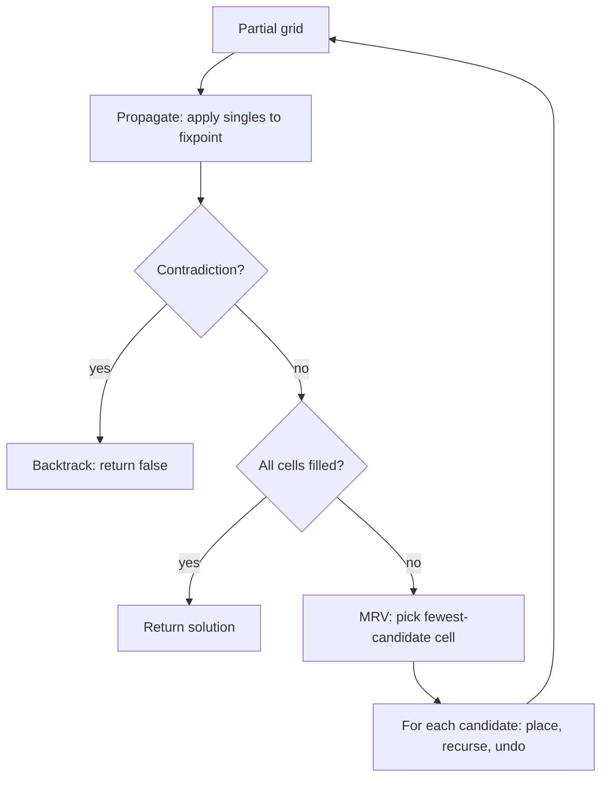

# Sudoku Solver (Backtracking + Constraint Propagation) — Middle Level

> **Focus:** the bitmask representation that makes candidates and legality O(1), the MRV search-ordering heuristic and *why* it gives an enormous speedup, constraint propagation (naked singles, hidden singles, and a hint of locked candidates), counting solutions to verify uniqueness, and how plain backtracking compares to propagation-driven search and to exact cover / DLX.

---

## Table of Contents

1. [Introduction](#introduction)
2. [Deeper Concepts](#deeper-concepts)
3. [Comparison with Alternatives](#comparison-with-alternatives)
4. [Advanced Patterns](#advanced-patterns)
5. [Constraint Propagation in Depth](#constraint-propagation-in-depth)
6. [Uniqueness and Solution Counting](#uniqueness-and-solution-counting)
7. [Code Examples](#code-examples)
8. [Error Handling](#error-handling)
9. [Performance Analysis](#performance-analysis)
10. [Best Practices](#best-practices)
11. [Visual Animation](#visual-animation)
12. [Summary](#summary)

---

## Introduction

At junior level the message was: backtracking fills empty cells, MRV picks the most-constrained one, bitmasks make checks cheap. At middle level you start asking the questions that decide whether your solver is *fast*, *correct on tricky inputs*, and *usable inside a puzzle generator*:

- Why exactly do bitmasks give O(1) candidate enumeration, and how do you iterate them without branching on each digit?
- MRV is "obviously" good — but *how* good, and why? What is it minimizing, formally?
- How much of a hard puzzle can pure logic (constraint propagation) solve before any guessing is needed?
- How do you check that a puzzle has *exactly one* solution — the property that makes it a "proper" puzzle?
- When is plain backtracking enough, when does propagation pay for its complexity, and when should you switch to Dancing Links?

These are the questions that separate "I can solve the newspaper Sudoku" from "I can build a solver that powers a generator and rates difficulty."

---

## Deeper Concepts

### The bitmask representation, precisely

Maintain three integer arrays, each entry a 9-bit set:

```
rowMask[r]  bit (d-1) set  ⇔  digit d already present in row r
colMask[c]  bit (d-1) set  ⇔  digit d already present in column c
boxMask[b]  bit (d-1) set  ⇔  digit d already present in box b
```

For an empty cell `(r, c)` in box `b = (r/3)*3 + c/3`, the **used** digits are exactly `used = rowMask[r] | colMask[c] | boxMask[b]`, and the **candidates** are the complement within 9 bits: `cand = ~used & 0x1FF`. This is the crux of the O(1) claim:

- **Legality of digit `d`:** `(used >> (d-1)) & 1 == 0` — one shift and mask.
- **Candidate count (for MRV):** `popcount(cand)` — a single hardware instruction (`POPCNT`, `Integer.bitCount`, `bits.OnesCount`).
- **Enumerate candidates:** repeatedly extract the lowest set bit `bit = cand & (-cand)`, convert to a digit, then clear it with `cand &= cand - 1`. No loop over impossible digits.

The "complement within 9 bits" matters: `~used` in a machine word has all the high bits set, so you must AND with `0x1FF` (binary `111111111`) to keep only digit bits 0-8.

### Why MRV is a search-ordering optimization

Backtracking explores a tree: each node is a partial grid, each edge a digit placement. The total work is roughly the number of nodes visited. The branching factor at a node is the number of candidates of the cell you chose to fill. **You get to choose which cell to expand, and that choice does not change correctness — only the shape of the tree.**

MRV expands the cell with the *minimum* branching factor. Two consequences:

1. **Forced moves cost nothing.** A cell with 1 candidate has branching factor 1 — it extends the path without splitting it. MRV does all of these first, effectively performing constraint propagation "for free" inside the search.
2. **Contradictions surface early.** A cell with 0 candidates is an immediate dead end. MRV finds the 0-candidate cell as soon as it exists (it has the minimum count), pruning the entire subtree at the shallowest possible depth instead of after many wasted placements.

Formally, MRV is the **most-constrained-variable** heuristic from constraint satisfaction (CSP). It does not change the *set* of solutions, only the order in which the search visits nodes, but on Sudoku it routinely turns a tree of millions of nodes into one of a few hundred. There is no proof it is optimal for every instance, but empirically it is the dominant heuristic for this problem, and the professional view (`professional.md`) connects it to the column-selection rule in Algorithm X.

A common refinement is to break MRV ties with the **degree heuristic** (among cells with equally few candidates, pick the one involved in the most unfilled constraints) — a small extra win that `senior.md` revisits.

### Candidate enumeration vs candidate testing

A subtle but important distinction. Two ways to try digits in a cell:

- **Test:** loop `d` from 1 to 9, call `legal(r, c, d)`, place if legal. Nine iterations, nine tests, every time.
- **Enumerate:** compute the candidate mask once, then iterate only its set bits. You touch *exactly* the legal digits.

For a cell with two candidates, testing does 9 legality checks while enumeration does 2 placements. Across millions of nodes, enumeration is materially faster and reads more cleanly. Always enumerate from a mask.

---

## Comparison with Alternatives

### Plain backtracking vs MRV vs propagation+MRV vs DLX

| Approach | Idea | Typical 9×9 cost | Good when |
|----------|------|------------------|-----------|
| Fixed-order backtracking | Fill next empty cell, try 1-9 | thousands-millions of nodes on hard puzzles | learning; easy puzzles only |
| Backtracking + bitmasks | Same, but O(1) checks/enumeration | same node count, faster per node | always over naive checks |
| **Backtracking + MRV + bitmasks** | Fill fewest-candidate cell first | hundreds of nodes on hard puzzles | the practical default |
| Propagation + MRV search | Apply singles to fixpoint, then MRV-guess | tens of nodes; many puzzles need 0 guesses | hardest puzzles, generators |
| **Dancing Links (Algorithm X)** | Exact cover, choose smallest column | very few nodes, cache-friendly links | fastest general; enumerating all solutions |

The progression is "same algorithm, better ordering and pruning." MRV is the cheap, huge win. Propagation adds logic-solver power. DLX is a different *data structure* (covered in `senior.md`/`professional.md`) that makes the same exact-cover search extremely efficient and is the method of choice when you must enumerate solutions for uniqueness checking.

### MRV vs fixed order — a concrete contrast

| Cell-selection rule | Branching at each step | Effect |
|---------------------|------------------------|--------|
| Fixed (row-major) | whatever the next cell has (often 3-6) | wide tree, late contradiction detection |
| MRV | the minimum available (often 1-2) | narrow tree, contradictions caught early |

On a "17-clue" minimal puzzle (the hardest class for solvers, see `professional.md`), fixed-order can explore orders of magnitude more nodes than MRV. The code change is tiny — scan empties for the minimum candidate count instead of returning the first empty — but the payoff is the single largest in the whole topic.

---

## Advanced Patterns

### Pattern: incremental bitmask maintenance

Do not recompute masks from the grid each call. Maintain them incrementally: `place` sets the digit bit in all three masks; `unplace` clears it. This keeps each placement O(1) and each candidate query O(1).

```python
def place(grid, masks, r, c, d):
    bit = 1 << (d - 1)
    grid[r][c] = d
    masks.row[r] |= bit
    masks.col[c] |= bit
    masks.box[box_of(r, c)] |= bit

def unplace(grid, masks, r, c, d):
    bit = 1 << (d - 1)
    grid[r][c] = 0
    masks.row[r] &= ~bit
    masks.col[c] &= ~bit
    masks.box[box_of(r, c)] &= ~bit
```

### Pattern: MRV with early exit on singletons

While scanning for the minimum-candidate cell, if you find a cell with one candidate you cannot do better (other than zero), so return immediately — and a zero-candidate cell is an instant failure signal.

### Pattern: propagate-then-search

Wrap the search in a propagation step: before each guess, repeatedly apply naked/hidden singles until no more fire; only then pick an MRV cell to branch on. This minimizes the number of guesses.



---

## Constraint Propagation in Depth

Constraint propagation fills cells by pure deduction, with no guessing. The two foundational rules:

### Naked single

If an empty cell's candidate set has size exactly 1, that digit is forced — place it.

```
for each empty cell (r, c):
    cand = candidates(r, c)
    if popcount(cand) == 1:
        place the single candidate
        (this may create new naked singles → repeat)
```

A naked single is the local view: "this cell can only be one thing."

### Hidden single

If, within a row (or column, or box), some digit `d` is a candidate in only **one** of the unit's empty cells, then `d` must go in that cell — even if that cell has several other candidates.

```
for each unit (row / column / box):
    for each digit d in 1..9 not yet placed in the unit:
        cells = empty cells of the unit where d is a candidate
        if len(cells) == 1:
            place d in that single cell
```

A hidden single is the global view: "this digit can only fit here." Hidden singles catch placements that naked-single scanning misses, and together the two solve the majority of "easy"–"medium" puzzles with zero search.

### Locked candidates (a taste)

A stronger rule used by full logic-solvers: if within a box all candidates for digit `d` lie in a single row, then `d` can be eliminated from that row's cells *outside* the box (pointing pairs/triples), and symmetrically box-line reduction. These do not *place* a digit; they *prune candidates*, which can then trigger singles. Production logic-solvers stack many such rules to rate difficulty (see `senior.md`). For a fast *solver* (as opposed to a human-style rater), naked + hidden singles plus MRV backtracking is already excellent — the extra rules mainly matter for difficulty grading.

### The fixpoint loop

Propagation runs to a *fixpoint*: keep sweeping the rules until a full pass places nothing new. Crucially, each placement can unlock further singles, so you must loop. Detect a **contradiction** (an empty cell with zero candidates, or a digit with no legal cell in some unit) and signal failure so the surrounding search backtracks.

---

## Uniqueness and Solution Counting

A *proper* Sudoku has **exactly one** solution. Generators must guarantee this; solvers used for verification must detect it. The technique is to **count solutions, stopping at 2**.

```
countSolutions(grid, limit=2):
    cell = findMRV()
    if no cell: return 1            # one complete solution found
    if cell has 0 candidates: return 0
    total = 0
    for each candidate d:
        place d
        total += countSolutions(grid, limit)
        undo d
        if total >= limit: break    # no need to count past 2
    return total
```

- `count == 0` → unsolvable (or invalid givens).
- `count == 1` → proper, unique solution.
- `count >= 2` → multiple solutions; not a proper puzzle.

You never enumerate *all* solutions of a near-empty grid (there are ~6.67 × 10²¹ full grids, see `professional.md`); you only need to know whether the count exceeds one, so the `limit=2` early stop keeps it fast. This solution-counter is the engine behind both puzzle generation and the "is this puzzle valid?" check.

---

## Code Examples

### Solver with propagation (singles) + MRV backtracking + uniqueness count

Below, the same engine both solves and counts solutions. The counter is what a generator calls.

#### Go

```go
package main

import (
	"fmt"
	"math/bits"
)

type Board struct {
	grid               [9][9]int
	row, col, box      [9]int
}

func boxOf(r, c int) int { return (r/3)*3 + c/3 }

func (b *Board) load(g [9][9]int) {
	*b = Board{grid: g}
	for r := 0; r < 9; r++ {
		for c := 0; c < 9; c++ {
			if d := g[r][c]; d != 0 {
				bit := 1 << (d - 1)
				b.row[r] |= bit
				b.col[c] |= bit
				b.box[boxOf(r, c)] |= bit
			}
		}
	}
}

func (b *Board) cand(r, c int) int {
	return ^(b.row[r] | b.col[c] | b.box[boxOf(r, c)]) & 0x1FF
}

func (b *Board) set(r, c, d int) {
	bit := 1 << (d - 1)
	b.grid[r][c] = d
	b.row[r] |= bit
	b.col[c] |= bit
	b.box[boxOf(r, c)] |= bit
}

func (b *Board) clear(r, c, d int) {
	bit := 1 << (d - 1)
	b.grid[r][c] = 0
	b.row[r] &^= bit
	b.col[c] &^= bit
	b.box[boxOf(r, c)] &^= bit
}

// findMRV returns the empty cell with fewest candidates.
func (b *Board) findMRV() (r, c, mask int, ok bool) {
	best := 10
	for i := 0; i < 9; i++ {
		for j := 0; j < 9; j++ {
			if b.grid[i][j] == 0 {
				m := b.cand(i, j)
				cnt := bits.OnesCount(uint(m))
				if cnt < best {
					best, r, c, mask, ok = cnt, i, j, m, true
					if cnt <= 1 {
						return
					}
				}
			}
		}
	}
	return
}

// countSolutions counts up to `limit` solutions.
func (b *Board) countSolutions(limit int) int {
	r, c, mask, ok := b.findMRV()
	if !ok {
		return 1
	}
	if mask == 0 {
		return 0
	}
	total := 0
	for m := mask; m != 0; m &= m - 1 {
		bit := m & (-m)
		d := bits.TrailingZeros(uint(bit)) + 1
		b.set(r, c, d)
		total += b.countSolutions(limit)
		b.clear(r, c, d)
		if total >= limit {
			break
		}
	}
	return total
}

func main() {
	puzzle := [9][9]int{
		{5, 3, 0, 0, 7, 0, 0, 0, 0},
		{6, 0, 0, 1, 9, 5, 0, 0, 0},
		{0, 9, 8, 0, 0, 0, 0, 6, 0},
		{8, 0, 0, 0, 6, 0, 0, 0, 3},
		{4, 0, 0, 8, 0, 3, 0, 0, 1},
		{7, 0, 0, 0, 2, 0, 0, 0, 6},
		{0, 6, 0, 0, 0, 0, 2, 8, 0},
		{0, 0, 0, 4, 1, 9, 0, 0, 5},
		{0, 0, 0, 0, 8, 0, 0, 7, 9},
	}
	var b Board
	b.load(puzzle)
	fmt.Println("solution count (capped at 2):", b.countSolutions(2))
}
```

#### Java

```java
public class BoardSolver {
    int[][] grid;
    int[] row = new int[9], col = new int[9], box = new int[9];

    static int boxOf(int r, int c) { return (r / 3) * 3 + c / 3; }

    BoardSolver(int[][] g) {
        grid = g;
        for (int r = 0; r < 9; r++)
            for (int c = 0; c < 9; c++)
                if (g[r][c] != 0) {
                    int bit = 1 << (g[r][c] - 1);
                    row[r] |= bit; col[c] |= bit; box[boxOf(r, c)] |= bit;
                }
    }

    int cand(int r, int c) { return ~(row[r] | col[c] | box[boxOf(r, c)]) & 0x1FF; }

    void set(int r, int c, int d) {
        int bit = 1 << (d - 1);
        grid[r][c] = d; row[r] |= bit; col[c] |= bit; box[boxOf(r, c)] |= bit;
    }

    void clear(int r, int c, int d) {
        int bit = 1 << (d - 1);
        grid[r][c] = 0; row[r] &= ~bit; col[c] &= ~bit; box[boxOf(r, c)] &= ~bit;
    }

    int[] findMRV() {
        int best = 10, br = -1, bc = -1, bm = 0;
        for (int r = 0; r < 9; r++)
            for (int c = 0; c < 9; c++)
                if (grid[r][c] == 0) {
                    int m = cand(r, c), cnt = Integer.bitCount(m);
                    if (cnt < best) {
                        best = cnt; br = r; bc = c; bm = m;
                        if (cnt <= 1) return new int[]{br, bc, bm};
                    }
                }
        return br == -1 ? null : new int[]{br, bc, bm};
    }

    int countSolutions(int limit) {
        int[] cell = findMRV();
        if (cell == null) return 1;
        int r = cell[0], c = cell[1], mask = cell[2];
        if (mask == 0) return 0;
        int total = 0;
        for (int m = mask; m != 0; m &= m - 1) {
            int bit = m & (-m), d = Integer.numberOfTrailingZeros(bit) + 1;
            set(r, c, d);
            total += countSolutions(limit);
            clear(r, c, d);
            if (total >= limit) break;
        }
        return total;
    }

    public static void main(String[] args) {
        int[][] puzzle = {
            {5, 3, 0, 0, 7, 0, 0, 0, 0},
            {6, 0, 0, 1, 9, 5, 0, 0, 0},
            {0, 9, 8, 0, 0, 0, 0, 6, 0},
            {8, 0, 0, 0, 6, 0, 0, 0, 3},
            {4, 0, 0, 8, 0, 3, 0, 0, 1},
            {7, 0, 0, 0, 2, 0, 0, 0, 6},
            {0, 6, 0, 0, 0, 0, 2, 8, 0},
            {0, 0, 0, 4, 1, 9, 0, 0, 5},
            {0, 0, 0, 0, 8, 0, 0, 7, 9},
        };
        System.out.println("solution count (capped at 2): "
            + new BoardSolver(puzzle).countSolutions(2));
    }
}
```

#### Python

```python
def box_of(r, c):
    return (r // 3) * 3 + c // 3


class Board:
    def __init__(self, grid):
        self.grid = grid
        self.row = [0] * 9
        self.col = [0] * 9
        self.box = [0] * 9
        for r in range(9):
            for c in range(9):
                d = grid[r][c]
                if d:
                    bit = 1 << (d - 1)
                    self.row[r] |= bit
                    self.col[c] |= bit
                    self.box[box_of(r, c)] |= bit

    def cand(self, r, c):
        return ~(self.row[r] | self.col[c] | self.box[box_of(r, c)]) & 0x1FF

    def set(self, r, c, d):
        bit = 1 << (d - 1)
        self.grid[r][c] = d
        self.row[r] |= bit
        self.col[c] |= bit
        self.box[box_of(r, c)] |= bit

    def clear(self, r, c, d):
        bit = 1 << (d - 1)
        self.grid[r][c] = 0
        self.row[r] &= ~bit
        self.col[c] &= ~bit
        self.box[box_of(r, c)] &= ~bit

    def find_mrv(self):
        best, choice = 10, None
        for r in range(9):
            for c in range(9):
                if self.grid[r][c] == 0:
                    m = self.cand(r, c)
                    cnt = bin(m).count("1")
                    if cnt < best:
                        best, choice = cnt, (r, c, m)
                        if cnt <= 1:
                            return choice
        return choice

    def count_solutions(self, limit=2):
        cell = self.find_mrv()
        if cell is None:
            return 1
        r, c, mask = cell
        if mask == 0:
            return 0
        total = 0
        m = mask
        while m:
            bit = m & (-m)
            d = bit.bit_length()
            self.set(r, c, d)
            total += self.count_solutions(limit)
            self.clear(r, c, d)
            if total >= limit:
                break
            m &= m - 1
        return total


if __name__ == "__main__":
    puzzle = [
        [5, 3, 0, 0, 7, 0, 0, 0, 0],
        [6, 0, 0, 1, 9, 5, 0, 0, 0],
        [0, 9, 8, 0, 0, 0, 0, 6, 0],
        [8, 0, 0, 0, 6, 0, 0, 0, 3],
        [4, 0, 0, 8, 0, 3, 0, 0, 1],
        [7, 0, 0, 0, 2, 0, 0, 0, 6],
        [0, 6, 0, 0, 0, 0, 2, 8, 0],
        [0, 0, 0, 4, 1, 9, 0, 0, 5],
        [0, 0, 0, 0, 8, 0, 0, 7, 9],
    ]
    print("solution count (capped at 2):", Board(puzzle).count_solutions(2))
```

### Naked + hidden single propagation (Python)

```python
def propagate(board):
    """Apply naked and hidden singles to a fixpoint.
    Returns False on contradiction, True otherwise (board mutated)."""
    changed = True
    while changed:
        changed = False
        # naked singles
        for r in range(9):
            for c in range(9):
                if board.grid[r][c] == 0:
                    m = board.cand(r, c)
                    if m == 0:
                        return False                 # contradiction
                    if m & (m - 1) == 0:             # exactly one bit
                        board.set(r, c, m.bit_length())
                        changed = True
        # hidden singles per unit
        units = [[(r, c) for c in range(9)] for r in range(9)]
        units += [[(r, c) for r in range(9)] for c in range(9)]
        for br in range(0, 9, 3):
            for bc in range(0, 9, 3):
                units.append([(br + i, bc + j) for i in range(3) for j in range(3)])
        for unit in units:
            for d in range(1, 10):
                bit = 1 << (d - 1)
                spots = [(r, c) for (r, c) in unit
                         if board.grid[r][c] == 0 and (board.cand(r, c) & bit)]
                placed = any(board.grid[r][c] == d for (r, c) in unit)
                if not placed and len(spots) == 1:
                    r, c = spots[0]
                    board.set(r, c, d)
                    changed = True
    return True
```

---

## Error Handling

| Scenario | What goes wrong | Correct approach |
|----------|-----------------|------------------|
| Complement leaks high bits | `~used` sets bits 9-63; candidates look impossible. | Always `& 0x1FF` after complement. |
| Counting never stops on near-empty grid | Counting *all* solutions of a sparse grid. | Cap with `limit=2` and break early. |
| Propagation loops forever | No "made progress" flag. | Loop only while a pass changed something; stop at fixpoint. |
| Contradiction not detected | Zero-candidate cell ignored during propagation. | Return failure when any empty cell has `cand == 0`. |
| Hidden single misfires | Counted a digit already placed in the unit as "needing a spot." | Skip digits already present in the unit. |
| Mask drift across branches | `set`/`clear` not symmetric. | Write them as a matched pair; clear exactly what set added. |

---

## Performance Analysis

| Puzzle class | Fixed-order nodes | MRV nodes | Propagation+MRV |
|--------------|-------------------|-----------|------------------|
| Easy (many givens) | hundreds | tens | ~0 guesses (solved by singles) |
| Medium | thousands | tens-hundreds | a handful of guesses |
| Hard (17-clue minimal) | up to millions | hundreds-thousands | tens of guesses |
| Adversarial (designed worst case) | huge | thousands | hundreds |

Two levers dominate:

1. **MRV** turns a wide tree into a narrow one — typically 1-3 orders of magnitude fewer nodes on hard puzzles. It is cheap (an O(81) scan per node) and almost always worth it.
2. **Bitmasks** cut the *per-node* cost: candidate query, legality, and MRV counting all become a few instructions, and enumeration touches only legal digits.

Constraint propagation adds per-node overhead (the singles sweeps) but slashes the *number* of nodes; it pays off most on hard puzzles and is essential for difficulty rating. For a pure speed solver on arbitrary 9×9 inputs, **MRV + bitmasks** is the sweet spot; add propagation when you need fewer guesses or are inside a generator.

```python
import time

def benchmark(board_factory, n=1000):
    start = time.perf_counter()
    for _ in range(n):
        b = board_factory()
        b.count_solutions(2)
    return (time.perf_counter() - start) / n * 1e6  # microseconds per solve
# A well-tuned MRV+bitmask solver runs a typical puzzle in tens of microseconds.
```

---

## Best Practices

- **Maintain masks incrementally** (`set`/`clear`), never recompute from the grid per call.
- **Always `& 0x1FF`** after complementing `used`, or stray high bits corrupt MRV counts and enumeration.
- **Use MRV with a singleton early-exit**, and treat a zero-candidate cell as instant failure.
- **Enumerate candidates from the mask** (`m & -m`); do not loop 1-9 and re-test.
- **Cap solution counting at 2** when you only need uniqueness — full enumeration is wasteful and slow.
- **Run propagation before guessing** when minimizing guesses matters (generators, difficulty rating), but keep a plain MRV solver for raw speed.
- **Test the counter** against known unique and known multi-solution grids; uniqueness bugs are silent.

---

## Visual Animation

> See [`animation.html`](./animation.html) for an interactive view.
>
> The middle-level animation highlights:
> - Each empty cell's candidate set rendered as a small badge, updating as masks change.
> - MRV selecting the cell with the fewest candidates (highlighted) before each guess.
> - A naked single being filled with no branching versus a multi-candidate cell that forks.
> - The grid flashing red and **backtracking** when a cell's candidate set becomes empty.

---

## Summary

The middle-level Sudoku solver rests on three pillars. **Bitmasks** make candidate enumeration and legality O(1): `used = rowMask | colMask | boxMask`, `cand = ~used & 0x1FF`, count with `popcount`, iterate with `m & -m`. **MRV** is a search-ordering optimization — it does not change correctness, only the tree shape, by always expanding the minimum-branching cell, which performs forced moves for free and surfaces contradictions at the shallowest depth; this is the largest single speedup. **Constraint propagation** (naked singles + hidden singles run to a fixpoint, with locked candidates as a stronger optional rule) fills cells by pure logic, often eliminating search entirely on easy puzzles and slashing guesses on hard ones. Layered on top, a **solution counter capped at 2** verifies that a puzzle is *proper* (exactly one solution) — the engine behind generation and validation. Plain backtracking + MRV + bitmasks is the practical default; propagation pays for its complexity on the hardest puzzles and inside generators; Dancing Links / Algorithm X (next levels) is the fastest general method and the right tool when enumerating solutions.
```