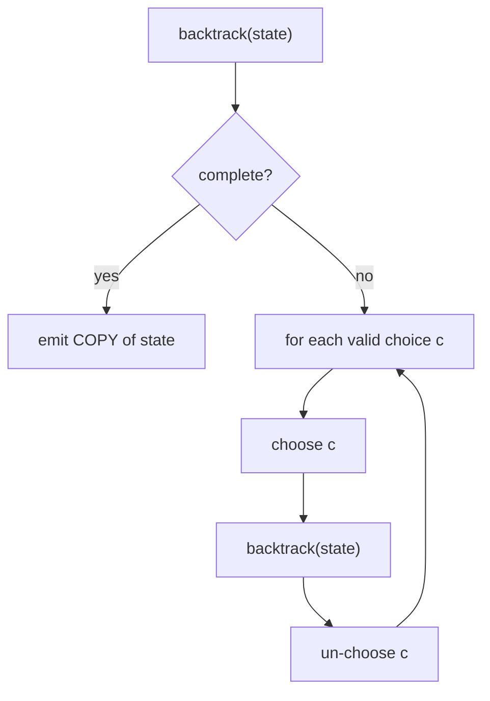

# Generating Permutations, Subsets, and Combinations — Junior Level

> **One-line summary:** Backtracking builds answers one choice at a time. To enumerate every **subset**, **permutation**, or **combination** you walk a *decision tree*: at each node you make a choice, recurse, then **undo** the choice and try the next one. The shape of the tree (and the pruning rules) is what turns the same template into "all subsets" (`2^n`), "all permutations" (`n!`), or "choose k of n" (`C(n,k)`).

---

## Table of Contents

1. [Introduction](#introduction)
2. [Prerequisites](#prerequisites)
3. [Glossary](#glossary)
4. [Core Concepts](#core-concepts)
5. [Big-O Summary](#big-o-summary)
6. [Real-World Analogies](#real-world-analogies)
7. [Pros & Cons](#pros--cons)
8. [Step-by-Step Walkthrough](#step-by-step-walkthrough)
9. [Code Examples](#code-examples)
10. [Coding Patterns](#coding-patterns)
11. [Error Handling](#error-handling)
12. [Performance Tips](#performance-tips)
13. [Best Practices](#best-practices)
14. [Edge Cases & Pitfalls](#edge-cases--pitfalls)
15. [Common Mistakes](#common-mistakes)
16. [Cheat Sheet](#cheat-sheet)
17. [Visual Animation](#visual-animation)
18. [Summary](#summary)
19. [Further Reading](#further-reading)

---

## Introduction

Suppose someone hands you the three numbers `[1, 2, 3]` and asks three different questions:

- *"List every **subset**."* — `[]`, `[1]`, `[2]`, `[3]`, `[1,2]`, `[1,3]`, `[2,3]`, `[1,2,3]`. There are `2^3 = 8`.
- *"List every **permutation** (ordering)."* — `[1,2,3]`, `[1,3,2]`, `[2,1,3]`, `[2,3,1]`, `[3,1,2]`, `[3,2,1]`. There are `3! = 6`.
- *"List every **combination** of size 2."* — `[1,2]`, `[1,3]`, `[2,3]`. There are `C(3,2) = 3`.

These look like three separate puzzles, but they are the **same algorithm** with three slightly different decision rules. That algorithm is **backtracking**: a disciplined, recursive way to explore *every* possibility by building a partial answer step by step, and **rewinding** each step before trying the next alternative.

The mental model is a **decision tree**. The root is the empty partial answer. Each branch is a single decision — "include this element or not", "place this element next", "pick this as the k-th chosen item". When you reach a leaf that represents a complete, valid answer, you **emit** (record) it. Then you back up to the most recent decision, undo it, and explore the next branch. The name *backtracking* comes from exactly that "back up and try again" move.

> **The one rule that makes backtracking work:** every choice you make, you must **un-make** before returning, so the data structure looks exactly as it did before you tried that branch. Make → recurse → un-make. This "leave no trace" discipline is why a single shared list can generate millions of answers without corrupting itself.

Why does this matter? Because an enormous number of real problems are "generate every configuration and check it": every assignment of a Sudoku grid, every ordering of cities for a tour, every selection of items for a knapsack, every way to place N queens. Subsets, permutations, and combinations are the three foundational shapes you must master first; every harder backtracking problem (covered in sibling topics like `04-n-queens`, `05-sudoku-solver`, `06-word-search`) is built from these same moves.

This file teaches the canonical templates, the pruning that makes combinations efficient, and — crucially — how to handle **duplicate elements** so you do not emit the same answer twice. Master these patterns and the rest of backtracking becomes pattern-matching.

---

## Prerequisites

Before reading this file you should be comfortable with:

- **Recursion** — a function that calls itself, with a base case and a recursive case. See sibling section `01-recursion-basics`.
- **The call stack** — how each recursive call gets its own frame, and how returning pops it. Backtracking *is* a managed walk over the call stack.
- **Arrays / slices / lists** — appending, removing the last element, and reading by index.
- **Pass-by-reference vs copy** — when you append an answer to your results, you usually must store a *copy*, not the live mutable buffer.
- **Big-O notation** — `O(2^n)`, `O(n!)`, `O(n · 2^n)`; why "output-sized" complexities are unavoidable here.
- **Basic combinatorics** — what `2^n`, `n!`, and `C(n,k)` count (we re-derive these below).

Optional but helpful:

- A glance at **depth-first search (DFS)**, since backtracking is DFS over an implicit decision tree.
- Familiarity with **bit manipulation** (`1 << n`, testing the `i`-th bit), used in the subset bit-enumeration alternative.

---

## Glossary

| Term | Meaning |
|------|---------|
| **Backtracking** | DFS over a tree of choices: make a choice, recurse, then **undo** it and try the next. |
| **Decision tree** | The implicit tree whose nodes are partial solutions and whose edges are single choices. |
| **Partial solution** | The answer-so-far while you are mid-recursion (e.g. the elements chosen up to this depth). |
| **Choose / un-choose** | The paired actions: add an element to the partial solution, then remove it after recursing. |
| **Emit** | Record a *complete* valid solution (usually a **copy** of the partial buffer) into the results. |
| **Subset** | Any selection of elements, order ignored; `[1,2]` and `[2,1]` are the same subset. There are `2^n`. |
| **Permutation** | An **ordering** of all elements; `[1,2]` and `[2,1]` are different permutations. There are `n!`. |
| **Combination** | A subset of a **fixed size k**, order ignored. There are `C(n,k) = n! / (k!(n−k)!)`. |
| **Pruning** | Cutting off a branch early because it cannot lead to a valid/complete answer. |
| **`used[]` array** | A boolean array marking which elements are already in the current permutation. |
| **Start index** | The index from which a recursive call is allowed to pick, used to avoid re-picking earlier elements (subsets/combinations). |
| **Gray code** | An ordering of all `2^n` subsets where consecutive subsets differ by exactly one element. |

---

## Core Concepts

### 1. The "Choose → Recurse → Un-choose" template

Every backtracking generator has the same skeleton:

```
backtrack(state):
    if state is a complete solution:
        emit a COPY of state
        return            # (or keep going for subsets — see below)
    for each candidate choice c that is still valid:
        apply c to state          # CHOOSE
        backtrack(state)          # RECURSE
        undo c from state         # UN-CHOOSE  (this is the "backtrack")
```

The genius is that one shared mutable `state` (usually a list) is reused for the whole tree. Because every `apply` is matched by an `undo`, the buffer is always restored, so sibling branches never see each other's leftovers.

### 2. Subsets — include/exclude

For subsets, the decision at element `i` is binary: **include `i`** or **exclude `i`**. That gives a tree of depth `n` with two children per node, so `2^n` leaves — exactly the number of subsets.

```
subsets(i, current):
    if i == n:
        emit copy(current)        # a leaf: every element decided
        return
    # branch 1: exclude element i
    subsets(i+1, current)
    # branch 2: include element i
    current.append(nums[i])
    subsets(i+1, current)
    current.pop()                 # undo
```

There is a second, cleaner subset shape — the **"choose start index"** pattern — which emits a subset at *every* node (not just leaves):

```
subsets(start, current):
    emit copy(current)            # every node IS a valid subset
    for i in start..n-1:
        current.append(nums[i])
        subsets(i+1, current)     # only pick LATER indices → no duplicates
        current.pop()
```

Passing `i+1` (not `start+1`) is the key: each chosen element only allows *later* elements next, so you never produce `[2,1]` after `[1,2]`. Order is fixed, so each subset appears once.

### 3. Subsets — the bit-enumeration alternative

Since each of `n` elements is independently in-or-out, a subset corresponds to an `n`-bit number. Mask `0` is `{}`, mask `7 = 111₂` is `{0,1,2}`. So you can skip recursion entirely:

```
for mask in 0 .. (1<<n)-1:
    subset = [nums[i] for i in 0..n-1 if (mask >> i) & 1]
    emit subset
```

This is `O(n · 2^n)`, iterative, and has no call-stack overhead. It is the go-to when `n` is small (≤ ~20) and you want simplicity. Recursion wins when you need pruning or ordered output.

### 4. Permutations — used-array vs swap

A permutation uses **all** `n` elements, each exactly once, in some order. Two standard implementations:

**Used-array:** keep a boolean `used[]`. At each depth, try every element not yet used.

```
permute(current):
    if len(current) == n:
        emit copy(current); return
    for i in 0..n-1:
        if used[i]: continue
        used[i] = true; current.append(nums[i])    # choose
        permute(current)
        current.pop(); used[i] = false             # un-choose
```

**Swap-based:** fix one position at a time by swapping the chosen element into place.

```
permute(start):
    if start == n:
        emit copy(nums); return
    for i in start..n-1:
        swap(nums, start, i)        # put nums[i] at position 'start'
        permute(start+1)
        swap(nums, start, i)        # swap back (undo)
```

Both are `O(n · n!)`. Swap-based uses `O(1)` extra space and mutates the input; used-array is easier to extend to duplicate handling.

### 5. Combinations — choose k of n with start-index pruning

A combination is a size-`k` subset. Use the start-index pattern, but only emit when you have exactly `k` elements:

```
combine(start, current):
    if len(current) == k:
        emit copy(current); return
    for i in start..n-1:
        current.append(nums[i])
        combine(i+1, current)
        current.pop()
```

**Key pruning:** if there are not enough remaining elements to ever reach size `k`, stop early. Specifically, stop the loop when `i > n - (k - len(current))`. This skips branches that can never complete and is the difference between fast and painfully slow for large `n`.

### 6. Handling duplicates — sort, then skip equal siblings

If the input has repeats, e.g. `[1, 2, 2]`, the naive subset/permutation generators emit the *same* answer multiple times. The fix is always the same two-step recipe:

1. **Sort** the input so equal elements are adjacent.
2. **Skip equal siblings** at the same tree level: when iterating choices, if `nums[i] == nums[i-1]` and the previous equal element was *not* chosen on this branch, skip `i`.

```
# Subsets-II (input sorted)
for i in start..n-1:
    if i > start and nums[i] == nums[i-1]:
        continue                  # skip duplicate at this level
    current.append(nums[i]); subsets(i+1, current); current.pop()
```

The condition `i > start` means "only skip if there was an earlier *sibling* with the same value at this level." This guarantees each distinct subset is generated exactly once. The same idea (with a `used[]` check) handles permutations-II — see `middle.md` for the full treatment.

---

## Big-O Summary

| Task | Count of outputs | Time | Space (extra) |
|------|------------------|------|---------------|
| All subsets (recursion or bits) | `2^n` | **O(n · 2^n)** | O(n) recursion / O(1) bits |
| All permutations | `n!` | **O(n · n!)** | O(n) for `current`+`used` |
| Combinations C(n,k) | `C(n,k)` | **O(k · C(n,k))** | O(k) |
| Subsets-II (with duplicates) | ≤ `2^n` distinct | O(n · 2^n) | O(n) |
| Permutations-II (with duplicates) | ≤ `n!` distinct | O(n · n!) | O(n) |
| Combination sum (with repetition) | output-dependent | output-sensitive | O(target/min) depth |
| `next_permutation` (one step) | — | **O(n)** | O(1) |
| Gray code (all `2^n`) | `2^n` | O(2^n) | O(1) per step |

The `n` (or `k`) factor in front of the output count is the cost of **copying** each completed answer into the results list. You cannot beat the output size itself: if there are `n!` permutations, *printing* them already costs `Ω(n · n!)`. These are **output-sensitive** problems — the work is dominated by how much you must produce.

---

## Real-World Analogies

| Concept | Analogy |
|---------|---------|
| Subsets (include/exclude) | Packing for a trip: for each item you decide "pack it or leave it" — every full set of decisions is one possible suitcase. |
| Permutations | Seating `n` guests in a row: every distinct seating order is one permutation. |
| Combinations | Picking a 5-card hand from a deck: the *order* you draw them in does not matter, only which 5. |
| Choose → un-choose | Trying on outfits: put a shirt on, look in the mirror, take it off, try the next — the closet ends as it started. |
| Pruning | A chess player who stops analyzing a line the moment it is clearly losing, instead of reading it to the end. |
| Skip equal siblings | A buffet with two identical trays of the same dish: you treat picking from either as the same choice, so you do not "discover" the same plate twice. |
| Gray code | A combination lock where you only ever turn one dial by one notch to reach the next code. |

Where the analogy breaks: real packing has weight limits and real seating has preferences; pure enumeration ignores all constraints and lists *everything*. Constraints come back as **pruning** rules that cut branches.

---

## Pros & Cons

| Pros | Cons |
|------|------|
| One template generates subsets, permutations, and combinations — change only the rule. | Output sizes are exponential (`2^n`) or factorial (`n!`); only feasible for small `n`. |
| Uses a single shared buffer — tiny memory beyond the recursion stack. | Forgetting to **copy** on emit stores aliases that all mutate together (a classic bug). |
| Pruning (start index, feasibility checks) can cut huge swaths of the tree. | Forgetting to **un-choose** leaks state into sibling branches and corrupts output. |
| Naturally extends to constrained problems (N-Queens, Sudoku) by adding validity checks. | Duplicate handling (sort + skip) is subtle and easy to get slightly wrong. |
| The bit-enumeration subset trick is loop-only, no recursion needed. | Deep recursion can blow the stack for large `n` without conversion to iteration. |

**When to use:** you genuinely need *all* configurations (or all *valid* ones), `n` is small, and there is no closed-form shortcut. Also when the problem is "find one solution satisfying constraints" — backtracking explores and stops at the first success.

**When NOT to use:** when you only need the **count** (use combinatorics formulas — see `professional.md`), when a greedy or DP solution exists, or when `n` is large enough that `2^n`/`n!` is astronomical.

---

## Step-by-Step Walkthrough

Let us trace **subsets of `[1, 2, 3]`** using the start-index template, emitting at every node.

We call `subsets(start=0, current=[])`. Indentation shows recursion depth; `>>` marks an emit.

```
subsets(0, [])
  >> emit []                       # the empty subset
  i=0: choose 1 -> current=[1]
    subsets(1, [1])
      >> emit [1]
      i=1: choose 2 -> [1,2]
        subsets(2, [1,2])
          >> emit [1,2]
          i=2: choose 3 -> [1,2,3]
            subsets(3, [1,2,3])
              >> emit [1,2,3]
          undo 3 -> [1,2]
      undo 2 -> [1]
      i=2: choose 3 -> [1,3]
        subsets(3, [1,3])
          >> emit [1,3]
      undo 3 -> [1]
  undo 1 -> []
  i=1: choose 2 -> [2]
    subsets(2, [2])
      >> emit [2]
      i=2: choose 3 -> [2,3]
        subsets(3, [2,3])
          >> emit [2,3]
      undo 3 -> [2]
  undo 2 -> []
  i=2: choose 3 -> [3]
    subsets(3, [3])
      >> emit [3]
  undo 3 -> []
```

The emits, in order: `[]`, `[1]`, `[1,2]`, `[1,2,3]`, `[1,3]`, `[2]`, `[2,3]`, `[3]` — exactly `2^3 = 8` subsets, each appearing once. Notice how every `choose` is matched by an `undo`, and how `i+1` (not `start`) prevents ever revisiting an earlier element, which is what kills duplicates like `[2,1]`.

**Now compare permutations of `[1,2,3]`** (used-array). The tree has depth 3 and at each depth tries every unused element:

```
[] -> [1] -> [1,2] -> [1,2,3] EMIT
                   -> (no more)  undo
            -> [1,3] -> [1,3,2] EMIT
   -> [2] -> [2,1] -> [2,1,3] EMIT
            -> [2,3] -> [2,3,1] EMIT
   -> [3] -> [3,1] -> [3,1,2] EMIT
            -> [3,2] -> [3,2,1] EMIT
```

Six leaves, six permutations. The difference from subsets: permutations only emit at depth `n` (full length), and they may pick *any* unused element (not just later ones), because order matters here.

---

## Code Examples

### Example: Generate all subsets (start-index recursion)

#### Go

```go
package main

import "fmt"

func subsets(nums []int) [][]int {
	var res [][]int
	var cur []int
	var backtrack func(start int)
	backtrack = func(start int) {
		// every node is a valid subset: emit a COPY
		cp := make([]int, len(cur))
		copy(cp, cur)
		res = append(res, cp)
		for i := start; i < len(nums); i++ {
			cur = append(cur, nums[i]) // choose
			backtrack(i + 1)           // only later indices
			cur = cur[:len(cur)-1]     // un-choose
		}
	}
	backtrack(0)
	return res
}

func main() {
	fmt.Println(subsets([]int{1, 2, 3}))
	// [[] [1] [1 2] [1 2 3] [1 3] [2] [2 3] [3]]
}
```

#### Java

```java
import java.util.*;

public class Subsets {
    static List<List<Integer>> subsets(int[] nums) {
        List<List<Integer>> res = new ArrayList<>();
        backtrack(nums, 0, new ArrayList<>(), res);
        return res;
    }

    static void backtrack(int[] nums, int start, List<Integer> cur,
                          List<List<Integer>> res) {
        res.add(new ArrayList<>(cur)); // emit a COPY
        for (int i = start; i < nums.length; i++) {
            cur.add(nums[i]);            // choose
            backtrack(nums, i + 1, cur, res);
            cur.remove(cur.size() - 1); // un-choose
        }
    }

    public static void main(String[] args) {
        System.out.println(subsets(new int[]{1, 2, 3}));
        // [[], [1], [1, 2], [1, 2, 3], [1, 3], [2], [2, 3], [3]]
    }
}
```

#### Python

```python
def subsets(nums):
    res = []
    cur = []

    def backtrack(start):
        res.append(cur[:])          # emit a COPY (slice)
        for i in range(start, len(nums)):
            cur.append(nums[i])     # choose
            backtrack(i + 1)        # only later indices
            cur.pop()               # un-choose

    backtrack(0)
    return res


if __name__ == "__main__":
    print(subsets([1, 2, 3]))
    # [[], [1], [1, 2], [1, 2, 3], [1, 3], [2], [2, 3], [3]]
```

**What it does:** walks the decision tree, emitting a copy of `cur` at every node. The `i+1` argument enforces increasing indices, so each subset is unique.
**Run:** `go run main.go` | `javac Subsets.java && java Subsets` | `python subsets.py`

### Example: Generate all permutations (used-array)

#### Go

```go
package main

import "fmt"

func permute(nums []int) [][]int {
	var res [][]int
	used := make([]bool, len(nums))
	var cur []int
	var backtrack func()
	backtrack = func() {
		if len(cur) == len(nums) {
			cp := make([]int, len(cur))
			copy(cp, cur)
			res = append(res, cp)
			return
		}
		for i := 0; i < len(nums); i++ {
			if used[i] {
				continue
			}
			used[i] = true
			cur = append(cur, nums[i])
			backtrack()
			cur = cur[:len(cur)-1]
			used[i] = false
		}
	}
	backtrack()
	return res
}

func main() {
	fmt.Println(permute([]int{1, 2, 3}))
}
```

#### Java

```java
import java.util.*;

public class Permutations {
    static List<List<Integer>> permute(int[] nums) {
        List<List<Integer>> res = new ArrayList<>();
        boolean[] used = new boolean[nums.length];
        backtrack(nums, used, new ArrayList<>(), res);
        return res;
    }

    static void backtrack(int[] nums, boolean[] used, List<Integer> cur,
                          List<List<Integer>> res) {
        if (cur.size() == nums.length) {
            res.add(new ArrayList<>(cur));
            return;
        }
        for (int i = 0; i < nums.length; i++) {
            if (used[i]) continue;
            used[i] = true;
            cur.add(nums[i]);
            backtrack(nums, used, cur, res);
            cur.remove(cur.size() - 1);
            used[i] = false;
        }
    }

    public static void main(String[] args) {
        System.out.println(permute(new int[]{1, 2, 3}));
    }
}
```

#### Python

```python
def permute(nums):
    res = []
    used = [False] * len(nums)
    cur = []

    def backtrack():
        if len(cur) == len(nums):
            res.append(cur[:])
            return
        for i in range(len(nums)):
            if used[i]:
                continue
            used[i] = True
            cur.append(nums[i])
            backtrack()
            cur.pop()
            used[i] = False

    backtrack()
    return res


if __name__ == "__main__":
    print(permute([1, 2, 3]))
```

**What it does:** at each depth it tries every element not yet used, building all `n!` orderings.
**Run:** `go run main.go` | `javac Permutations.java && java Permutations` | `python permute.py`

---

## Coding Patterns

### Pattern 1: Subset by bit enumeration (no recursion)

**Intent:** when `n ≤ 20`, list all subsets with a single loop over masks.

```python
def subsets_bits(nums):
    n = len(nums)
    res = []
    for mask in range(1 << n):                 # 0 .. 2^n - 1
        res.append([nums[i] for i in range(n) if (mask >> i) & 1])
    return res
```

Each mask is a unique subset; bit `i` set means "element `i` is in." No copy/undo bookkeeping needed.

### Pattern 2: Combinations with feasibility pruning

**Intent:** stop a branch as soon as it cannot reach size `k`.

```python
def combine(n, k):
    res, cur = [], []

    def backtrack(start):
        if len(cur) == k:
            res.append(cur[:]); return
        # need (k - len(cur)) more; only loop while enough remain
        for i in range(start, n - (k - len(cur)) + 1):
            cur.append(i)
            backtrack(i + 1)
            cur.pop()

    backtrack(0)
    return res
```

The tightened upper bound `n - (k - len(cur)) + 1` is the start-index pruning that makes combinations fast.

### Pattern 3: The decision-tree skeleton (reuse everywhere)



Subsets, permutations, and combinations differ only in *what counts as a valid choice* and *when a state is complete*. Internalize this skeleton and you can derive all three on the spot.

---

## Error Handling

| Error | Cause | Fix |
|-------|-------|-----|
| All results look identical (and equal the last one) | Stored the live buffer, not a copy. | Emit `cur[:]` / `new ArrayList<>(cur)` / a fresh slice. |
| Sibling branches see extra elements | Forgot to un-choose after recursing. | Match every `append`/`add` with a `pop`/`remove`. |
| Duplicate answers appear | Input had repeats and you skipped the sort+skip step. | Sort, then skip equal siblings (`i > start && nums[i]==nums[i-1]`). |
| Permutation re-uses an element | Did not mark/check `used[i]`. | Set `used[i]=true` before recursing, reset after. |
| Stack overflow for large `n` | Recursion depth `n` too deep. | Use iterative bit enumeration, or raise the recursion limit. |
| Combinations far too slow | No feasibility pruning. | Tighten the loop bound to `n-(k-len(cur))+1`. |
| Off-by-one: subsets re-pick earlier elements | Passed `start+1` or `start` instead of `i+1`. | Recurse with `i+1`. |

---

## Performance Tips

- **Reuse one buffer** across the whole recursion; copy only at the moment you emit. Allocating a new buffer per node is wasteful.
- **Prune early** — for combinations, the feasibility bound; for combination-sum, stop when the running sum exceeds the target.
- **Sort once, up front** for duplicate handling and for prefix-sum pruning; never sort inside the recursion.
- **Prefer bit enumeration** for plain subsets when `n` is small — no stack frames, cache-friendly.
- **Preallocate the result slice** if you know the count (`2^n`, `n!`, `C(n,k)`) to avoid repeated growth.
- **Avoid string concatenation** to build partial answers; use a list/buffer and copy once.

---

## Best Practices

- Write the template as **choose → recurse → un-choose**, in that exact order, every time. Consistency prevents bugs.
- Always **emit a copy**, never the shared buffer. This is the single most common backtracking mistake.
- For duplicates, **sort first**, then use the `i > start` (subsets) or `used[i-1]` (permutations) skip rule — and add a comment explaining it.
- Keep the "is complete?" check and the "valid choice?" check as small, separate, named conditions.
- Test against a brute-force oracle (e.g. compare your subset count to `2^n`, dedup via a set) on small inputs.
- Decide up front whether you want subsets emitted at every node (start-index style) or only at leaves (include/exclude style); both are correct, but the output order differs.

---

## Edge Cases & Pitfalls

- **Empty input `[]`** — subsets should return `[[]]` (one subset, the empty set), permutations `[[]]`, combinations `C(0,0)=1`.
- **`k = 0` combinations** — exactly one combination: the empty one.
- **`k = n` combinations** — exactly one: the whole set.
- **`k > n`** — zero combinations; the recursion should emit nothing.
- **All elements identical**, e.g. `[2,2,2]` — subsets-II yields `{}, {2}, {2,2}, {2,2,2}` (4, not `2^3`); permutations-II yields just one.
- **Single element `[5]`** — subsets `[[],[5]]`, one permutation `[[5]]`.
- **Large `n`** — `2^n`/`n!` may not fit in memory; consider streaming/generators (see `senior.md`).
- **Negative numbers / zeros** — fine for subsets and permutations; for *combination sum* with repetition, a zero would cause infinite recursion (handle or forbid it).

---

## Common Mistakes

1. **Storing the live buffer** instead of a copy — every result ends up pointing at the same (final) list.
2. **Forgetting to un-choose** — the buffer keeps growing and pollutes sibling branches.
3. **Using `start+1` instead of `i+1`** in subsets/combinations — re-picks earlier elements or skips valid ones.
4. **Skipping the sort** before duplicate handling — equal elements are not adjacent, so the skip rule fails.
5. **Wrong duplicate-skip condition** — using `i > 0` instead of `i > start` over-prunes and drops valid subsets.
6. **Permutations without `used[]`** — re-uses elements and produces invalid orderings.
7. **Counting vertices vs choices** — confusing "depth `n`" (decisions made) with "size of answer."
8. **Allowing zero in combination-sum-with-repetition** — infinite loop, since adding 0 never advances toward the target.

---

## Cheat Sheet

| Want | Template | Key detail |
|------|----------|------------|
| All subsets | start-index, emit every node | recurse `i+1` |
| All subsets (small n) | bit masks `0..2^n-1` | bit `i` = element `i` in |
| All permutations | `used[]` or swap, emit at depth `n` | every unused element is a choice |
| Combinations C(n,k) | start-index, emit when size==k | prune to `n-(k-len)+1` |
| Subsets with dups | sort + skip `i>start && a[i]==a[i-1]` | adjacency from sort |
| Permutations with dups | sort + skip `a[i]==a[i-1] && !used[i-1]` | see `middle.md` |
| One ordering at a time | `next_permutation` | O(n) per step, lexicographic |

Universal skeleton:

```
backtrack(state):
    if complete(state): emit copy(state); return
    for each valid choice c:
        choose c; backtrack(state); un-choose c
```

---

## Visual Animation

> See [`animation.html`](./animation.html) for an interactive visualization.
>
> The animation demonstrates:
> - The backtracking **decision tree** being explored depth-first for `[1,2,3]`
> - Each choice being **made** (added to the partial solution) and **un-made** (removed)
> - The growing **partial solution** at the current node
> - **Emitted** complete results accumulating on the side
> - A **mode toggle** between *subsets* and *permutations*, plus Step / Run / Reset controls

---

## Summary

Subsets, permutations, and combinations are three faces of one algorithm: **backtracking** over a decision tree, where you *choose*, *recurse*, then *un-choose*. Subsets use a binary include/exclude (or the bit-mask shortcut) for `2^n` answers; permutations use `used[]` or swaps for `n!` orderings; combinations use start-index pruning for `C(n,k)` selections. The two rules you must never forget: **emit a copy** of the buffer, and **un-choose** every choice. To handle duplicate inputs, **sort** and **skip equal siblings**. Once these patterns are muscle memory, every harder backtracking problem — N-Queens, Sudoku, word search — is just this skeleton with extra validity checks.

---

## Further Reading

- *Introduction to Algorithms* (CLRS) — recursion, and the combinatorics of `2^n`, `n!`, `C(n,k)`.
- Sibling topic `01-recursion-basics` — the call stack and recursive thinking that backtracking builds on.
- Sibling topic `04-n-queens` — backtracking with constraints, built on this template.
- Sibling topic `05-sudoku-solver` — backtracking as constraint satisfaction.
- *The Art of Computer Programming, Vol. 4A* (Knuth) — combinatorial generation, Gray codes, and `next_permutation`.
- LeetCode problems: Subsets (78), Subsets II (90), Permutations (46), Permutations II (47), Combinations (77), Combination Sum (39/40), Gray Code (89).
- cp-algorithms.com — "Generating all combinations / subsets / permutations."
