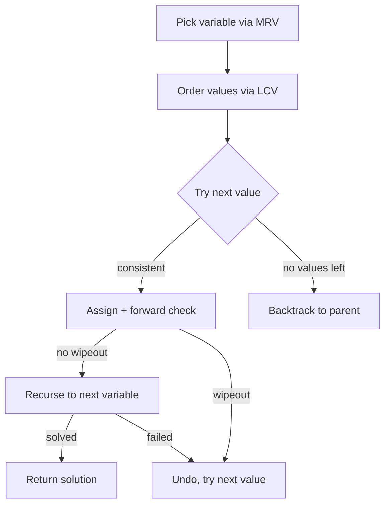

# Constraint Satisfaction Problems (CSP) — Junior Level

> **One-line summary:** A **CSP** is a puzzle described by *variables*, the *domains* of values each variable can take, and *constraints* that say which combinations are legal. You solve it with **backtracking search** — assign one variable at a time, check the constraints, and undo (backtrack) the moment an assignment makes the puzzle unsolvable. Smart **heuristics** and **constraint propagation** turn an exponential search into something that finishes in the blink of an eye.

---

## Table of Contents

1. [Introduction](#introduction)
2. [Prerequisites](#prerequisites)
3. [Glossary](#glossary)
4. [Core Concepts](#core-concepts)
5. [Big-O Summary](#big-o-summary)
6. [Real-World Analogies](#real-world-analogies)
7. [Pros & Cons](#pros--cons)
8. [Step-by-Step Walkthrough](#step-by-step-walkthrough)
9. [Code Examples](#code-examples)
10. [Coding Patterns](#coding-patterns)
11. [Error Handling](#error-handling)
12. [Performance Tips](#performance-tips)
13. [Best Practices](#best-practices)
14. [Edge Cases & Pitfalls](#edge-cases--pitfalls)
15. [Common Mistakes](#common-mistakes)
16. [Cheat Sheet](#cheat-sheet)
17. [Visual Animation](#visual-animation)
18. [Summary](#summary)
19. [Further Reading](#further-reading)

---

## Introduction

Imagine you are coloring a map of countries so that no two countries that share a border get the same color, and you only have three crayons: red, green, and blue. Can it be done? Which country should you color first? What do you do when you paint yourself into a corner and the last country has *no* legal color left? This little puzzle is the perfect doorway into one of the most important ideas in computer science: the **Constraint Satisfaction Problem**, or **CSP**.

A CSP is a way of describing an entire *family* of puzzles with the same three ingredients:

- **Variables** — the things you must decide. In map coloring, each country is a variable.
- **Domains** — the set of values each variable is allowed to take. Here, every country's domain is `{red, green, blue}`.
- **Constraints** — rules that say which combinations of values are allowed. Here: "adjacent countries must have different colors."

The magic of the CSP idea is that *one* solving engine can handle map coloring, Sudoku, N-Queens, scheduling exams so no student has two at once, and the famous `SEND + MORE = MONEY` puzzle — all by describing them in this variables/domains/constraints language and then running the same **backtracking search**.

Backtracking search is beautifully simple: pick an unassigned variable, try a value from its domain, check that no constraint is broken so far, and recurse to the next variable. If at some point a variable has no legal value, you **backtrack** — undo your last choice and try a different value. The whole search is a depth-first walk through a tree of partial assignments.

Done naively this can be catastrophically slow — exponential in the number of variables. The real lesson of this topic, and the reason CSP is studied as its own field, is that a handful of cheap, general tricks — **good ordering heuristics** and **constraint propagation** — routinely cut that exponential tree down to something tiny. The same map-coloring or Sudoku puzzle that would take billions of steps with blind search often solves in microseconds with these tricks. This junior file teaches the framework using map coloring as the running example; the sibling topics `01-n-queens` and `02-sudoku` are just two specific CSPs that this general machine solves.

---

## Prerequisites

Before reading this file you should be comfortable with:

- **Recursion** — backtracking is recursion that "tries, recurses, and undoes." See sibling `00-` recursion fundamentals.
- **Depth-first search (DFS)** — backtracking search is DFS over a tree of partial assignments.
- **Arrays / maps / sets** — domains are sets of values; assignments are maps from variable to value.
- **Graphs (basic)** — map coloring is graph coloring; "adjacent" means "connected by an edge."
- **Big-O notation** — we talk about exponential `O(d^n)` worst cases and why heuristics help.

Optional but helpful:

- A glance at **N-Queens** (`01-n-queens`) and **Sudoku** (`02-sudoku`), which are concrete CSPs.
- Familiarity with **adjacency lists** for representing which variables constrain which.

You do **not** need any advanced math. Everything here is "try a value, check a rule, undo if it fails."

---

## Glossary

| Term | Meaning |
|------|---------|
| **Variable** | Something the puzzle must assign a value to (a country, a Sudoku cell, a queen's column). |
| **Domain** | The set of values a variable may take (`{red, green, blue}`, or `{1..9}`). |
| **Constraint** | A rule restricting which value-combinations are legal (e.g. `X ≠ Y` for adjacent countries). |
| **Assignment** | A choice of value for one or more variables. |
| **Complete assignment** | Every variable has a value. |
| **Partial assignment** | Some variables still unassigned. |
| **Consistent assignment** | No constraint is violated by the values assigned so far. |
| **Solution** | A complete *and* consistent assignment. |
| **Backtracking** | Undoing the most recent assignment after hitting a dead end, then trying another value. |
| **Binary constraint** | A constraint involving exactly two variables (e.g. `X ≠ Y`). Most map-coloring constraints are binary. |
| **Unary constraint** | A constraint on a single variable (e.g. "country A may not be red"). |
| **Neighbors** | Variables that share a constraint with a given variable. |
| **Domain wipeout** | A variable's domain becomes empty — a signal that the current path is doomed. |

---

## Core Concepts

### 1. The Three Ingredients (Variables, Domains, Constraints)

Every CSP is fully described by three things, written `CSP = (X, D, C)`:

```
X = {X1, X2, ..., Xn}        the variables
D = {D1, D2, ..., Dn}        Di is the domain (allowed values) of Xi
C = {C1, C2, ..., Cm}        the constraints
```

For map coloring of Australia's states with 3 colors, the variables are the states `{WA, NT, SA, Q, NSW, V, T}`, each domain is `{red, green, blue}`, and the constraints are "different color" rules for each pair of bordering states, e.g. `WA ≠ NT`, `WA ≠ SA`, `NT ≠ SA`, and so on.

### 2. Backtracking Search

The core algorithm is a recursive depth-first search:

```
backtrack(assignment):
    if assignment is complete: return assignment   # solved!
    var = pick an unassigned variable
    for each value in domain(var):
        if value is consistent with assignment:    # no constraint broken
            assignment[var] = value
            result = backtrack(assignment)
            if result is not failure: return result
            remove assignment[var]                 # UNDO — backtrack
    return failure                                  # no value worked
```

The "remove assignment" line is the *backtrack*. It is what makes the search explore every branch without leaving stale state behind.

### 3. Checking Consistency

Before committing a value, you check that it does not break any constraint with the *already assigned* variables. For map coloring, "is `red` consistent for state `Q`?" means "none of `Q`'s already-colored neighbors are red." This local check is cheap and prunes huge chunks of the tree.

### 4. The Search Tree Can Explode

If there are `n` variables and each has domain size `d`, the tree of complete assignments has `d^n` leaves. For 7 states and 3 colors that is `3^7 = 2187` — tiny. For a Sudoku with 50 blanks and domain 9 it is `9^50 ≈ 10^47` — utterly impossible by brute force. The next two ideas are how we tame that.

### 5. Ordering Heuristics (Choose Smart)

Which variable to assign next, and which value to try first, hugely affects how much of the tree you explore:

- **MRV (Minimum Remaining Values)** — pick the variable with the *fewest* legal values left. Intuition: tackle the most constrained variable first so you fail fast rather than discovering the dead end deep in the tree. ("Fail-first.")
- **Degree heuristic** — break MRV ties by picking the variable involved in the most constraints with still-unassigned variables.
- **LCV (Least Constraining Value)** — when ordering the *values* of the chosen variable, try the value that rules out the fewest options for the neighbors first. ("Fail-last on values" — leave yourself the most room.)

These are detailed in [`middle.md`](./middle.md), but even the junior takeaway is huge: *order matters enormously, and MRV is the single most valuable heuristic.*

### 6. Forward Checking (Look Ahead a Little)

After you assign a value, immediately remove that value from the domains of all neighbors. If any neighbor's domain becomes empty (a **domain wipeout**), you know *right now* this path is doomed and can backtrack without descending further. This cheap look-ahead is called **forward checking** and is the gateway to full **constraint propagation** (AC-3, covered in `middle.md`).

---

## Big-O Summary

| Operation | Time | Space | Notes |
|-----------|------|-------|-------|
| Brute-force generate-and-test | **O(d^n · m)** | O(n) | Try every combination, check all `m` constraints. Hopeless. |
| Plain backtracking search | **O(d^n)** worst case | O(n) | Prunes early but still exponential worst case. |
| Backtracking + MRV/LCV + forward checking | Exponential worst case, **often near-linear in practice** | O(n·d) | The combination that makes real CSPs tractable. |
| Consistency check for one value | O(degree) | O(1) | Compare against assigned neighbors. |
| Forward checking after one assignment | O(degree · d) | O(n·d) | Prune each neighbor's domain. |
| AC-3 arc consistency (see middle) | **O(e · d³)** | O(e + n·d) | `e` = number of constraint arcs. |

Where `n` = number of variables, `d` = max domain size, `m` = number of constraints, `e` = number of directed constraint arcs.

The headline: backtracking is **exponential in the worst case** (CSP is NP-complete in general — see `professional.md`), but heuristics + propagation make the *typical* case fast enough to be the workhorse of real solvers.

---

## Real-World Analogies

| Concept | Analogy |
|---------|---------|
| Variables / domains / constraints | Seating guests at a wedding: each seat is a variable, the guests are the domain, "these two must not sit together" are the constraints. |
| Backtracking | Filling in a crossword in pencil — write a word, and if a crossing word becomes impossible, erase and try another. |
| MRV heuristic | In Sudoku you naturally fill the cell that has only one possible digit left first, not a wide-open cell. |
| Degree heuristic | At a party, introduce the person who knows the most people first — they constrain the most arrangements. |
| LCV heuristic | When packing a suitcase, place the item that blocks the fewest other items first, keeping your options open. |
| Forward checking | After choosing a restaurant, immediately crossing off dates your friends already said no to, so you don't even propose them. |

Where the analogy breaks: real puzzles often have "soft" preferences (it would be *nice* if X), whereas a pure CSP has only hard yes/no constraints. Optimizing soft preferences is the *Constraint Optimization* extension, beyond this junior file.

---

## Pros & Cons

| Pros | Cons |
|------|------|
| One framework solves a huge variety of puzzles (coloring, Sudoku, scheduling, N-Queens). | Worst case is exponential — CSP is NP-complete in general. |
| Backtracking uses tiny memory: just the current path, `O(n)`. | Naive backtracking without heuristics can be hopelessly slow. |
| Heuristics (MRV/LCV) and propagation (forward checking, AC-3) are general and reusable. | Choosing the right heuristic/propagation level for a problem takes experience. |
| Easy to add new constraint types — just add a consistency check. | Modeling a real problem as a clean CSP can be the hard part. |
| Finds *a* solution, *all* solutions, or proves *no* solution, with the same engine. | For optimization (best solution, not just any) you need extensions. |

**When to use:** discrete decision problems with clear "legal/illegal" rules — coloring, timetabling, puzzle solving, configuration, layout.

**When NOT to use:** continuous optimization, problems with only soft preferences, or problems where a specialized polynomial algorithm already exists (e.g. bipartite matching — don't reach for backtracking).

---

## Step-by-Step Walkthrough

Let's color a tiny map of four regions in a line-plus-triangle shape with 3 colors `{R, G, B}`.

Regions and their borders (edges):

```
   A --- B
   |   / |
   |  /  |
   C --- D

edges: A-B, A-C, B-C, B-D, C-D
```

Constraints: adjacent regions differ. Domains start as `{R, G, B}` for all four.

**Step 1 — pick a variable (MRV ties → degree).** All domains are size 3, so MRV ties. Degree: B touches A, C, D (degree 3); C touches A, B, D (degree 3); A and D have degree 2. Pick **B** (highest degree, tie broken arbitrarily over C).

**Step 2 — try a value for B.** Domain `{R, G, B}`. Try `B = R`.
Forward check: remove `R` from neighbors A, C, D. Now `A={G,B}`, `C={G,B}`, `D={G,B}`. No wipeout.

**Step 3 — pick next variable by MRV.** A, C, D all have 2 values. Degree among *unassigned*: C touches A and D (and B, assigned) → 2 unassigned neighbors; A touches C → 1; D touches C → 1. Pick **C**.

**Step 4 — try a value for C.** Domain `{G, B}`. Try `C = G`.
Forward check: remove `G` from C's unassigned neighbors A and D. Now `A={B}`, `D={B}`. No wipeout (both still have one value).

**Step 5 — MRV picks the singleton.** A has domain `{B}` (size 1) → MRV picks **A**. Try `A = B`.
Forward check on A's unassigned neighbors: A touches D? No (A-D is not an edge). So nothing to prune. `D={B}` still.

**Step 6 — assign D.** D has domain `{B}` → `D = B`. Check D's neighbors B(=R), C(=G): both differ from B. Consistent.

**Complete and consistent!** Final coloring: `A=B, B=R, C=G, D=B`. Notice we never had to backtrack — MRV + forward checking steered us straight to a solution. With a bad ordering (e.g. picking A first and trying colors blindly) we might have explored several dead ends first.

**A dead-end example.** Suppose at Step 4 we had foolishly tried `C = B`. Forward checking would remove `B` from A and D, giving `A={G}`, `D={G}` — fine so far. Then `A=G`, `D=G` would violate... actually A-D is not an edge, so this also works. The point of the walkthrough is the *mechanism*: try, forward-check, and if any domain wipes out, backtrack immediately.

---

## Code Examples

### Example: Map Coloring CSP with Backtracking + Forward Checking

This solves the Australia map-coloring CSP. The graph is the adjacency between states; we color with `{R, G, B}` and use MRV + forward checking.

#### Go

```go
package main

import "fmt"

// adjacency: state -> neighbors
var adj = map[string][]string{
	"WA":  {"NT", "SA"},
	"NT":  {"WA", "SA", "Q"},
	"SA":  {"WA", "NT", "Q", "NSW", "V"},
	"Q":   {"NT", "SA", "NSW"},
	"NSW": {"SA", "Q", "V"},
	"V":   {"SA", "NSW"},
	"T":   {}, // Tasmania has no land borders
}

var colors = []string{"R", "G", "B"}

// consistent reports whether assigning color to v breaks any constraint.
func consistent(v, color string, assign map[string]string) bool {
	for _, nb := range adj[v] {
		if assign[nb] == color {
			return false
		}
	}
	return true
}

// selectMRV returns the unassigned variable with the fewest legal colors.
func selectMRV(assign map[string]string, domains map[string][]string) string {
	best, bestCount := "", 1<<30
	for v := range adj {
		if _, done := assign[v]; done {
			continue
		}
		if len(domains[v]) < bestCount {
			best, bestCount = v, len(domains[v])
		}
	}
	return best
}

func backtrack(assign map[string]string, domains map[string][]string) bool {
	if len(assign) == len(adj) {
		return true
	}
	v := selectMRV(assign, domains)
	for _, color := range domains[v] {
		if !consistent(v, color, assign) {
			continue
		}
		assign[v] = color
		// forward checking: prune color from unassigned neighbors
		pruned := map[string][]string{}
		wipeout := false
		for _, nb := range adj[v] {
			if _, done := assign[nb]; done {
				continue
			}
			nd := []string{}
			for _, c := range domains[nb] {
				if c == color {
					pruned[nb] = append(pruned[nb], c)
				} else {
					nd = append(nd, c)
				}
			}
			domains[nb] = nd
			if len(nd) == 0 {
				wipeout = true
			}
		}
		if !wipeout && backtrack(assign, domains) {
			return true
		}
		// undo forward checking and the assignment
		for nb, cs := range pruned {
			domains[nb] = append(domains[nb], cs...)
		}
		delete(assign, v)
	}
	return false
}

func main() {
	domains := map[string][]string{}
	for v := range adj {
		domains[v] = append([]string{}, colors...)
	}
	assign := map[string]string{}
	if backtrack(assign, domains) {
		fmt.Println("Solution:", assign)
	} else {
		fmt.Println("No solution")
	}
}
```

#### Java

```java
import java.util.*;

public class MapColoring {
    static Map<String, List<String>> adj = new HashMap<>();
    static List<String> colors = Arrays.asList("R", "G", "B");

    static {
        adj.put("WA", Arrays.asList("NT", "SA"));
        adj.put("NT", Arrays.asList("WA", "SA", "Q"));
        adj.put("SA", Arrays.asList("WA", "NT", "Q", "NSW", "V"));
        adj.put("Q", Arrays.asList("NT", "SA", "NSW"));
        adj.put("NSW", Arrays.asList("SA", "Q", "V"));
        adj.put("V", Arrays.asList("SA", "NSW"));
        adj.put("T", Collections.emptyList());
    }

    static boolean consistent(String v, String color, Map<String, String> assign) {
        for (String nb : adj.get(v)) {
            if (color.equals(assign.get(nb))) return false;
        }
        return true;
    }

    static String selectMRV(Map<String, String> assign, Map<String, List<String>> domains) {
        String best = null;
        int bestCount = Integer.MAX_VALUE;
        for (String v : adj.keySet()) {
            if (assign.containsKey(v)) continue;
            if (domains.get(v).size() < bestCount) {
                best = v; bestCount = domains.get(v).size();
            }
        }
        return best;
    }

    static boolean backtrack(Map<String, String> assign, Map<String, List<String>> domains) {
        if (assign.size() == adj.size()) return true;
        String v = selectMRV(assign, domains);
        for (String color : new ArrayList<>(domains.get(v))) {
            if (!consistent(v, color, assign)) continue;
            assign.put(v, color);
            Map<String, List<String>> pruned = new HashMap<>();
            boolean wipeout = false;
            for (String nb : adj.get(v)) {
                if (assign.containsKey(nb)) continue;
                List<String> nd = new ArrayList<>();
                List<String> removed = new ArrayList<>();
                for (String c : domains.get(nb)) {
                    if (c.equals(color)) removed.add(c);
                    else nd.add(c);
                }
                pruned.put(nb, removed);
                domains.put(nb, nd);
                if (nd.isEmpty()) wipeout = true;
            }
            if (!wipeout && backtrack(assign, domains)) return true;
            for (Map.Entry<String, List<String>> e : pruned.entrySet()) {
                domains.get(e.getKey()).addAll(e.getValue());
            }
            assign.remove(v);
        }
        return false;
    }

    public static void main(String[] args) {
        Map<String, List<String>> domains = new HashMap<>();
        for (String v : adj.keySet()) domains.put(v, new ArrayList<>(colors));
        Map<String, String> assign = new HashMap<>();
        if (backtrack(assign, domains)) System.out.println("Solution: " + assign);
        else System.out.println("No solution");
    }
}
```

#### Python

```python
adj = {
    "WA":  ["NT", "SA"],
    "NT":  ["WA", "SA", "Q"],
    "SA":  ["WA", "NT", "Q", "NSW", "V"],
    "Q":   ["NT", "SA", "NSW"],
    "NSW": ["SA", "Q", "V"],
    "V":   ["SA", "NSW"],
    "T":   [],
}
COLORS = ["R", "G", "B"]


def consistent(v, color, assign):
    return all(assign.get(nb) != color for nb in adj[v])


def select_mrv(assign, domains):
    best, best_count = None, float("inf")
    for v in adj:
        if v in assign:
            continue
        if len(domains[v]) < best_count:
            best, best_count = v, len(domains[v])
    return best


def backtrack(assign, domains):
    if len(assign) == len(adj):
        return True
    v = select_mrv(assign, domains)
    for color in list(domains[v]):
        if not consistent(v, color, assign):
            continue
        assign[v] = color
        pruned = {}
        wipeout = False
        for nb in adj[v]:
            if nb in assign:
                continue
            if color in domains[nb]:
                domains[nb] = [c for c in domains[nb] if c != color]
                pruned[nb] = color
                if not domains[nb]:
                    wipeout = True
        if not wipeout and backtrack(assign, domains):
            return True
        for nb, c in pruned.items():
            domains[nb].append(c)
        del assign[v]
    return False


if __name__ == "__main__":
    domains = {v: list(COLORS) for v in adj}
    assign = {}
    if backtrack(assign, domains):
        print("Solution:", assign)
    else:
        print("No solution")
```

**What it does:** builds the Australia adjacency graph, then colors it with 3 colors using MRV variable selection and forward-checking domain pruning, restoring domains on backtrack.
**Run:** `go run main.go` | `javac MapColoring.java && java MapColoring` | `python mapcolor.py`

---

## Coding Patterns

### Pattern 1: Try / Recurse / Undo

**Intent:** The skeleton of every backtracking solver — assign, recurse, and *always* undo on the way back up so sibling branches see clean state.

```python
def backtrack(assign):
    if complete(assign):
        return True
    var = select_unassigned(assign)
    for val in domain(var):
        if consistent(var, val, assign):
            assign[var] = val          # try
            if backtrack(assign):      # recurse
                return True
            del assign[var]            # undo
    return False
```

Forgetting the undo is the single most common backtracking bug.

### Pattern 2: Forward Checking as You Assign

**Intent:** After assigning, prune that value from neighbors' domains and detect wipeouts early. Record what you pruned so you can restore it on backtrack.

### Pattern 3: MRV Variable Selection

**Intent:** Always expand the most constrained variable next, so failures happen high in the tree (cheap) instead of deep (expensive).



---

## Error Handling

| Error | Cause | Fix |
|-------|-------|-----|
| Wrong/partial solution returned | Forgot to check completeness before declaring success. | Confirm *all* variables assigned, not just consistency. |
| Infinite recursion / stack overflow | Never removing assignments or re-selecting an assigned variable. | Always undo; only select *unassigned* variables. |
| Stale domains corrupt later branches | Forward-checked prunes not restored on backtrack. | Record pruned values and re-add them when undoing. |
| Reports "no solution" when one exists | Mutating the shared domain list while iterating it. | Iterate over a *copy* of the domain in the value loop. |
| Crash on isolated variable | Variable with no constraints handled specially. | Isolated variables are fine — any value works; don't special-case incorrectly. |
| Constraint check misses a neighbor | Asymmetric adjacency (added `A→B` but not `B→A`). | Keep adjacency symmetric for undirected constraints. |

---

## Performance Tips

- **Use MRV.** It is the cheapest, highest-impact change you can make — often the difference between milliseconds and timeouts.
- **Forward-check immediately** after each assignment so dead ends are caught before you descend into them.
- **Iterate over a copy** of a variable's domain in the value loop, since forward checking mutates domains.
- **Represent domains as bitsets** when values are small integers (e.g. Sudoku digits 1–9) — pruning becomes a single bit-clear and wipeout detection is "is the bitset zero?".
- **Precompute neighbor lists** once; don't rescan the constraint list inside the hot loop.
- **Stop at the first solution** if the problem only needs *a* solution, not all of them.

---

## Best Practices

- Separate the **model** (variables, domains, constraints) from the **solver** (backtracking engine). One solver, many models.
- Write a tiny brute-force "generate-and-test" oracle and compare answers on small instances before trusting your solver.
- Always restore domains and assignments on backtrack — treat the undo as sacred.
- Name your heuristics explicitly (`selectMRV`, `orderLCV`) so the strategy is readable and swappable.
- Test the three outcomes separately: a solvable instance, an *unsolvable* one (should return failure cleanly), and one with multiple solutions.

---

## Edge Cases & Pitfalls

- **No solution exists** — the solver must return failure after exhausting the tree, not loop forever. (E.g. a triangle of mutually-adjacent regions with only 2 colors.)
- **Multiple solutions** — plain backtracking returns the first it finds; the order depends on your heuristics.
- **Empty domain at the start** — a variable with no allowed values means the CSP is unsolvable immediately.
- **Isolated variables** — variables with no constraints can take any value; they should not slow the search.
- **Self-constraints** — a variable constrained against itself (`X ≠ X`) is unsatisfiable and usually indicates a modeling bug.
- **Symmetric solutions** — map coloring has many equivalent colorings (permute the colors); if you need *distinct* solutions, fix the first variable's color to break symmetry.

---

## Common Mistakes

1. **Forgetting to undo** the assignment (and forward-checked prunes) on backtrack — pollutes sibling branches.
2. **Declaring success on consistency alone** — a consistent *partial* assignment is not a solution; check completeness too.
3. **Mutating the domain while looping over it** — iterate a copy.
4. **Ignoring MRV** and using fixed variable order — turns a fast solve into a timeout.
5. **Checking constraints against unassigned neighbors** — only assigned neighbors constrain a consistency check (forward checking handles the rest).
6. **Asymmetric adjacency** for undirected constraints — leads to missed violations.
7. **Confusing forward checking with full arc consistency** — forward checking only prunes neighbors of the just-assigned variable; AC-3 propagates further (see `middle.md`).

---

## Cheat Sheet

| Question | Tool | Idea |
|----------|------|------|
| What is a CSP? | `(X, D, C)` | variables, domains, constraints |
| How to solve it? | backtracking | assign, check, recurse, undo |
| Which variable next? | **MRV** | fewest remaining values (fail-first) |
| MRV tie-break? | **degree** | most constraints with unassigned vars |
| Which value first? | **LCV** | rules out fewest neighbor options |
| Catch dead ends early? | **forward checking** | prune neighbor domains, watch for wipeout |
| Prune harder? | **AC-3** (see middle) | propagate consistency across all arcs |

Core algorithm:

```
backtrack(assignment):
    if complete: return assignment
    var = MRV(unassigned)
    for val in LCV-ordered domain(var):
        if consistent(var, val):
            assign var=val; forward-check
            if no wipeout and backtrack(...): return success
            undo prunes; unassign var
    return failure
```

---

## Visual Animation

> See [`animation.html`](./animation.html) for an interactive visualization.
>
> The animation demonstrates:
> - Picking the next region to color via **MRV** (the most-constrained one)
> - Trying a color and **forward-checking**: shrinking neighbors' domains
> - Detecting a **domain wipeout** and **backtracking** to try another color
> - Watching domains shrink and restore, with Step / Play / Pause / Reset controls

---

## Summary

A Constraint Satisfaction Problem is any puzzle phrased as variables, domains, and constraints. **Backtracking search** solves it by assigning one variable at a time, checking constraints, and undoing on dead ends — a depth-first walk through partial assignments. By itself this is exponential, but two cheap, general ideas tame it: **ordering heuristics** (MRV picks the most-constrained variable so you fail fast; the degree heuristic breaks ties; LCV picks the value that keeps the most options open) and **constraint propagation** (forward checking prunes neighbors' domains and spots dead ends early). Map coloring is the canonical example, and the same engine solves N-Queens, Sudoku, scheduling, and cryptarithmetic. Master the try/recurse/undo skeleton plus MRV and forward checking, and you can solve a whole universe of discrete puzzles with one piece of code.

---

## Further Reading

- *Artificial Intelligence: A Modern Approach* (Russell & Norvig) — Chapter on Constraint Satisfaction Problems is the canonical treatment.
- Sibling topic `01-n-queens` — N-Queens as a CSP instance.
- Sibling topic `02-sudoku` — Sudoku as a CSP instance with `AllDifferent` constraints.
- [`middle.md`](./middle.md) — MRV/degree/LCV in depth, AC-3 arc consistency, MAC, cryptarithmetic.
- [`professional.md`](./professional.md) — formal definitions, AC-3 correctness/complexity, the consistency hierarchy, NP-completeness.
- *Handbook of Constraint Programming* (Rossi, van Beek, Walsh) — the comprehensive reference.
