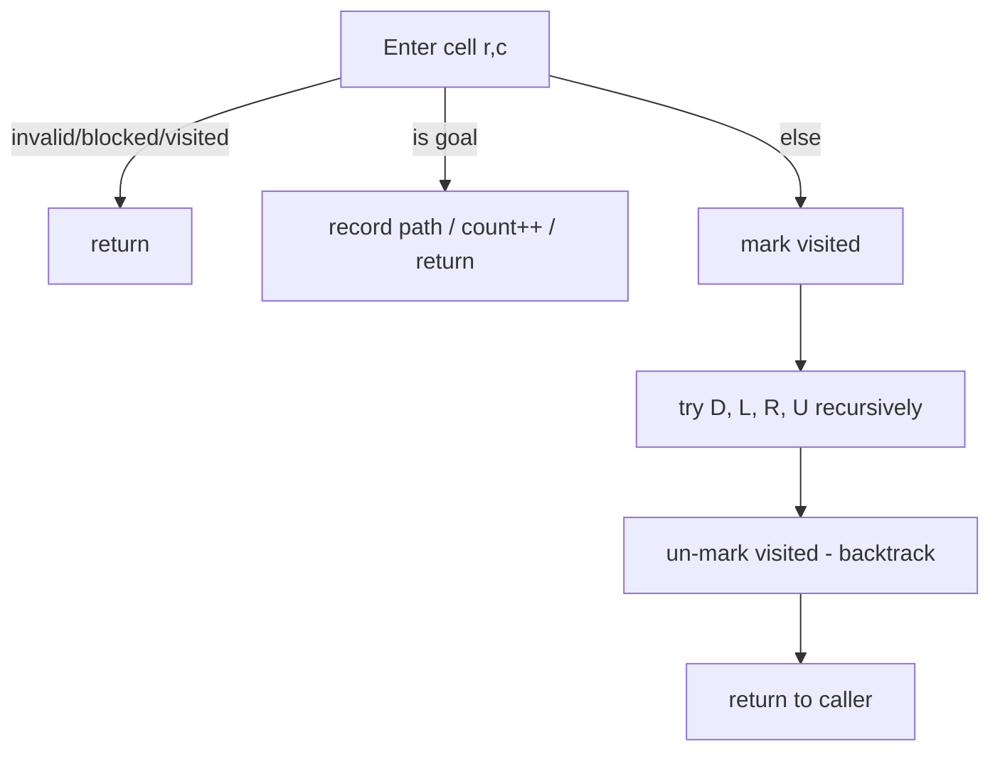

# Rat in a Maze (Grid Path Backtracking) — Junior Level

> **One-line summary:** A rat starts at the top-left cell of a grid and wants to reach the bottom-right cell, moving only through *open* cells. We explore the grid with **DFS backtracking**: try a direction, mark the cell visited, recurse; if it leads to a dead end, **un-mark** the cell and try another direction. This template finds one path, all paths, or the lexicographically smallest path.

---

## Table of Contents

1. [Introduction](#introduction)
2. [Prerequisites](#prerequisites)
3. [Glossary](#glossary)
4. [Core Concepts](#core-concepts)
5. [Big-O Summary](#big-o-summary)
6. [Real-World Analogies](#real-world-analogies)
7. [Pros & Cons](#pros--cons)
8. [Step-by-Step Walkthrough](#step-by-step-walkthrough)
9. [Code Examples](#code-examples)
10. [Coding Patterns](#coding-patterns)
11. [Error Handling](#error-handling)
12. [Performance Tips](#performance-tips)
13. [Best Practices](#best-practices)
14. [Edge Cases & Pitfalls](#edge-cases--pitfalls)
15. [Common Mistakes](#common-mistakes)
16. [Cheat Sheet](#cheat-sheet)
17. [Visual Animation](#visual-animation)
18. [Summary](#summary)
19. [Further Reading](#further-reading)

---

## Introduction

Imagine a small square grid of cells. Some cells are **open** (the rat can stand on them) and some are **blocked** (walls). A rat sits in the top-left corner and there is a piece of cheese in the bottom-right corner. The rat can only step to *adjacent* open cells — and the classic version allows four directions: **D**own, **L**eft, **R**ight, **U**p. The question is simple to state: *can the rat reach the cheese, and if so, what path does it take?*

This is the **Rat in a Maze** problem, one of the most famous teaching problems for **backtracking**. Backtracking is "smart brute force": you try a choice, commit to it, explore further, and if that choice cannot lead to a solution you **undo it** and try the next choice. The undo step — putting things back the way they were before you tried — is the heart of backtracking, and in this problem it is literally *un-marking a cell as visited*.

> **The core idea:** Depth-first search (DFS) from the start cell. At each cell, mark it as part of the current path, then try each direction in turn. If a direction reaches the goal, you are done; if it dead-ends, **roll back** (un-mark) and try the next direction.

There are three closely related questions you will be asked, and they all use the *same* template:

- **One path** — return as soon as you reach the goal. Stop early.
- **All paths** — never stop early; record every successful route. Keep searching after each success.
- **Lexicographically smallest path** — try the directions in alphabetical order (**D, L, R, U**) and the *first* path you find is automatically the smallest.

A crucial thing to learn from minute one: backtracking is for **enumerating** paths or finding a path under constraints — it is **not** the tool for the *shortest* path. For the fewest-steps path you use **BFS** (breadth-first search). We will contrast the two so you never reach for the wrong one. Backtracking explores deep first and can wander into a very long route before finding the goal; BFS explores level by level and finds the shortest route first. They solve different questions.

The "visited matrix" you will build here — a second grid that records which cells are currently on the path — is a pattern that reappears across every grid backtracking problem (word search, Sudoku-style fills, flood paths). Master the mark / recurse / **un-mark** rhythm here and you have the template for all of them.

---

## Prerequisites

Before reading this file you should be comfortable with:

- **2D arrays / grids** — accessing `grid[row][col]`, iterating rows and columns. The maze and the visited matrix are both 2D arrays.
- **Recursion** — a function that calls itself, with a base case that stops the recursion. DFS is naturally recursive.
- **Boolean logic** — open vs blocked, visited vs not visited.
- **Bounds checking** — making sure `row` and `col` stay inside `[0, n)` before touching a cell.
- **Big-O notation** — we will describe the exponential cost of enumerating paths.

Optional but helpful:

- A glance at **DFS and BFS on graphs** — a grid is just a graph where each open cell is a vertex connected to its open neighbors.
- Familiarity with the **call stack** — recursion uses it, and deep mazes can use a lot of it.

---

## Glossary

| Term | Meaning |
|------|---------|
| **Maze / grid** | An `n × m` array of cells; each cell is **open** (passable) or **blocked** (a wall). |
| **Cell** | A single grid square, addressed by `(row, col)`. |
| **Open cell** | A cell the rat may stand on (often value `1`). |
| **Blocked cell** | A wall the rat may not enter (often value `0`). |
| **Path** | A sequence of adjacent open cells from start to goal, no cell repeated. |
| **DFS (Depth-First Search)** | Explore as far as possible along one direction before backing up. |
| **Backtracking** | DFS plus the *undo* step: revert a choice when it cannot lead to a solution. |
| **Visited matrix** | A second grid marking which cells are on the *current* path, to avoid revisiting. |
| **Direction moves** | The offsets for D, L, R, U: `(+1,0), (0,-1), (0,+1), (-1,0)`. |
| **Dead end** | A cell from which no valid, unvisited, open neighbor leads forward. |
| **Lexicographic order** | Dictionary order of the direction string; "DLRU" sorted is D < L < R < U. |
| **Pruning** | Skipping branches that cannot possibly succeed, to save time. |

---

## Core Concepts

### 1. The Maze as a Grid of Cells

We store the maze as a 2D array. A common convention: `1` means open, `0` means blocked. The rat starts at `(0, 0)` and the goal is `(n-1, m-1)`. The very first check: if the start or goal is blocked, there is **no** path at all.

```
maze (1 = open, 0 = wall):
1 0 0 0
1 1 0 1
0 1 0 0
1 1 1 1
start = (0,0)   goal = (3,3)
```

### 2. Direction Moves

From any cell `(r, c)` the rat can try to move to four neighbors. We encode the moves and their letters so we can also print the route as a string:

```
direction  letter  (dr, dc)
Down        D       (+1,  0)
Left        L       ( 0, -1)
Right       R       ( 0, +1)
Up          U       (-1,  0)
```

Listing them in the order **D, L, R, U** is not arbitrary — it is *alphabetical*, which is what makes "first path found = lexicographically smallest path" work (see Core Concept 6).

### 3. The Visited Matrix (Marking)

While exploring, we must not step on a cell that is already part of the current path — otherwise the rat could go in circles forever. So we keep a `visited` grid the same size as the maze. When the rat enters `(r, c)` we set `visited[r][c] = true`. Before moving into a neighbor we check it is **in bounds**, **open**, and **not visited**.

### 4. The Backtrack Step (Un-marking)

Here is the part beginners forget. After the recursive calls for all four directions return *without* finding a goal through this cell, we set `visited[r][c] = false` again — we *un-mark* it. Why? Because this cell was only blocked *for the current attempt*. A different path that does not go through here should still be allowed to use it. Un-marking restores the grid to exactly the state it was in before we entered the cell.

```
enter (r,c)  -> visited[r][c] = true     // mark
try D, L, R, U recursively
leave (r,c)  -> visited[r][c] = false    // UN-mark  (the backtrack step)
```

### 5. Finding ONE Path vs ALL Paths

- **One path:** the recursive function returns a boolean. The moment a direction returns `true`, we stop trying others and propagate `true` up. We do *not* un-mark, because the cell stays in the answer path.
- **All paths:** the function returns nothing (or counts). When we reach the goal we *record* the current path string, then keep going — and we *always* un-mark on the way out so every route is explored.

### 6. The Lexicographically Smallest Path

If you try directions in alphabetical order **D < L < R < U** and you are looking for *one* path, the very first complete path the DFS discovers is the lexicographically smallest possible path string. This is because at every branch you always prefer the smallest letter first. This is a favorite interview twist (LeetCode/GfG "Rat in a Maze" prints paths in sorted order for exactly this reason).

### 7. Counting Paths

To count all distinct paths, use the *all paths* skeleton but instead of recording the route, increment a counter when you reach the goal. The number of simple paths in a grid can be enormous, which is why counting is exponential in the worst case.

### 8. Why Not BFS Here?

BFS finds the **shortest** path (fewest cells) and is the right tool when that is the question. Backtracking is the right tool when you want **all** paths, a path that satisfies extra **constraints**, or the **lexicographically smallest** path. BFS cannot easily enumerate every path; backtracking can. Use the tool that matches the question.

---

## Big-O Summary

Let the grid be `n × m` with `N = n·m` cells.

| Operation | Time | Space | Notes |
|-----------|------|-------|-------|
| Find one path (DFS backtracking) | **O(4^N)** worst case | O(N) | Exponential; usually far less in practice with pruning. |
| Find all paths | **O(4^N)** | O(N) path + O(total output) | Output itself can be exponential. |
| Count all paths | **O(4^N)** | O(N) | Same explore cost; just a counter. |
| Lexicographically smallest path | **O(4^N)** worst case | O(N) | Try D,L,R,U order; first found is smallest. |
| Shortest path (use **BFS** instead) | O(N) | O(N) | Backtracking is *not* for shortest. |
| Visited-matrix check / mark | O(1) | — | Per cell. |

The headline: pure path **enumeration** is **exponential** because the number of simple paths in a grid can grow exponentially. The recursion depth (call-stack / path length) is at most `N`, so the *extra* space is `O(N)`. Pruning and the visited matrix keep the practical cost much lower than the worst-case `4^N`, but the worst case really is exponential — that is the nature of "list every path".

---

## Real-World Analogies

| Concept | Analogy |
|---------|---------|
| The maze | A building floor plan: rooms (open cells) connected by doorways, walls block movement. |
| DFS exploration | Walking a corridor as far as it goes before turning back at a dead end. |
| Visited matrix | Dropping a breadcrumb in each room you enter so you don't loop back into it. |
| The backtrack (un-mark) | Picking the breadcrumb back up as you leave a dead-end room, so a future route may use it. |
| One path vs all paths | "Just get me out" vs "map me *every* way out of this building". |
| Lexicographic order | Always choosing the leftmost unexplored door first, by a fixed rule. |
| BFS for shortest | Sending searchers down all corridors simultaneously, one step at a time, to find the *nearest* exit. |

Where the analogy breaks: a real explorer remembers the whole building; our DFS only remembers the *current* trail (the visited cells on the path right now), un-marking as it backs out. That is exactly what lets it explore other branches cleanly.

---

## Pros & Cons

| Pros | Cons |
|------|------|
| Simple, uniform template: mark → recurse over directions → un-mark. | Exponential worst case — listing all paths can blow up. |
| Finds **all** paths, not just one — BFS cannot do this easily. | **Not** for shortest path; BFS is the right tool there. |
| Naturally yields the **lexicographically smallest** path with D,L,R,U order. | Deep grids can overflow the recursion call stack. |
| Easy to add **constraints** (e.g., must pass a cell, avoid a value). | Forgetting the un-mark silently breaks correctness. |
| Low extra memory: `O(N)` for the visited matrix and the recursion. | Output size for "all paths" can be exponential regardless of effort. |

**When to use:** enumerating all paths, counting paths, the lexicographically smallest path, constraint paths (visit/avoid cells), small to medium grids, or when you must *list* routes rather than just measure one.

**When NOT to use:** when you only need the **shortest** path (use BFS), when the grid is huge and you only need reachability (use BFS/Union-Find), or when paths must be weighted-optimal (use Dijkstra/A*).

---

## Step-by-Step Walkthrough

Take this small `3 × 3` maze (`1` = open, `0` = wall), start `(0,0)`, goal `(2,2)`:

```
maze:
1 0 1
1 1 0
0 1 1
```

We try directions in order **D, L, R, U**. Track the visited matrix and the path string.

```
Enter (0,0). mark. path="" 
  Try D -> (1,0): open, unvisited. Enter (1,0). path="D"
    Try D -> (2,0): maze=0 (wall). skip.
    Try L -> (1,-1): out of bounds. skip.
    Try R -> (1,1): open, unvisited. Enter (1,1). path="DR"
      Try D -> (2,1): open, unvisited. Enter (2,1). path="DRD"
        Try D -> (3,1): out of bounds. skip.
        Try L -> (2,0): maze=0 (wall). skip.
        Try R -> (2,2): GOAL! path="DRDR"  ✅ found
```

So the first path found is **DRDR**. Let us see the backtrack in action by imagining `(2,2)` had been blocked:

```
      ... at (2,1), R -> (2,2) blocked. U -> (1,1) visited. dead end.
      UN-mark (2,1). return to (1,1).
    at (1,1): U -> (0,1) maze=0 (wall). dead end.
    UN-mark (1,1). return to (1,0).
  at (1,0): U -> (0,0) visited. dead end.
  UN-mark (1,0). return to (0,0).
at (0,0): L,R,U all invalid. dead end.
UN-mark (0,0). NO PATH.
```

Notice every cell we entered got **un-marked** as we backed out. That restoration is what makes the search correct: the visited matrix always reflects *only the cells currently on the trail*.

**Verify the found path.** `DRDR` from `(0,0)`: D→`(1,0)`, R→`(1,1)`, D→`(2,1)`, R→`(2,2)`. Every cell is open and we land on the goal. Correct.

---

## Code Examples

### Example: Find One Path and Print the Direction String

This builds the maze, runs DFS backtracking trying **D, L, R, U** in order, and prints the first path's direction string (which is also the lexicographically smallest).

#### Go

```go
package main

import "fmt"

var (
	dr   = []int{1, 0, 0, -1} // D, L, R, U
	dc   = []int{0, -1, 1, 0}
	dirs = []byte{'D', 'L', 'R', 'U'}
)

func solve(maze [][]int, r, c int, visited [][]bool, path []byte, out *[]byte) bool {
	n, m := len(maze), len(maze[0])
	if r < 0 || r >= n || c < 0 || c >= m {
		return false
	}
	if maze[r][c] == 0 || visited[r][c] {
		return false
	}
	if r == n-1 && c == m-1 {
		*out = append([]byte{}, path...) // copy the winning path
		return true
	}
	visited[r][c] = true // mark
	for d := 0; d < 4; d++ {
		if solve(maze, r+dr[d], c+dc[d], visited, append(path, dirs[d]), out) {
			return true // stop early: one path is enough
		}
	}
	visited[r][c] = false // UN-mark (backtrack)
	return false
}

func main() {
	maze := [][]int{
		{1, 0, 1},
		{1, 1, 0},
		{0, 1, 1},
	}
	n := len(maze)
	visited := make([][]bool, n)
	for i := range visited {
		visited[i] = make([]bool, len(maze[0]))
	}
	var out []byte
	if solve(maze, 0, 0, visited, []byte{}, &out) {
		fmt.Println("path:", string(out)) // DRDR
	} else {
		fmt.Println("no path")
	}
}
```

#### Java

```java
public class RatOnePath {
    static final int[] dr = {1, 0, 0, -1};   // D, L, R, U
    static final int[] dc = {0, -1, 1, 0};
    static final char[] dirs = {'D', 'L', 'R', 'U'};

    static boolean solve(int[][] maze, int r, int c, boolean[][] visited,
                         StringBuilder path, StringBuilder out) {
        int n = maze.length, m = maze[0].length;
        if (r < 0 || r >= n || c < 0 || c >= m) return false;
        if (maze[r][c] == 0 || visited[r][c]) return false;
        if (r == n - 1 && c == m - 1) {
            out.append(path);          // record the winning path
            return true;
        }
        visited[r][c] = true;          // mark
        for (int d = 0; d < 4; d++) {
            path.append(dirs[d]);
            if (solve(maze, r + dr[d], c + dc[d], visited, path, out)) return true;
            path.deleteCharAt(path.length() - 1); // undo the letter
        }
        visited[r][c] = false;         // UN-mark (backtrack)
        return false;
    }

    public static void main(String[] args) {
        int[][] maze = {
            {1, 0, 1},
            {1, 1, 0},
            {0, 1, 1},
        };
        boolean[][] visited = new boolean[maze.length][maze[0].length];
        StringBuilder out = new StringBuilder();
        if (solve(maze, 0, 0, visited, new StringBuilder(), out))
            System.out.println("path: " + out); // DRDR
        else
            System.out.println("no path");
    }
}
```

#### Python

```python
DR = [1, 0, 0, -1]   # D, L, R, U
DC = [0, -1, 1, 0]
DIRS = "DLRU"


def solve(maze, r, c, visited, path, out):
    n, m = len(maze), len(maze[0])
    if r < 0 or r >= n or c < 0 or c >= m:
        return False
    if maze[r][c] == 0 or visited[r][c]:
        return False
    if r == n - 1 and c == m - 1:
        out.append("".join(path))      # record the winning path
        return True
    visited[r][c] = True               # mark
    for d in range(4):
        path.append(DIRS[d])
        if solve(maze, r + DR[d], c + DC[d], visited, path, out):
            return True                # stop early: one path is enough
        path.pop()                     # undo the letter
    visited[r][c] = False              # UN-mark (backtrack)
    return False


if __name__ == "__main__":
    maze = [
        [1, 0, 1],
        [1, 1, 0],
        [0, 1, 1],
    ]
    visited = [[False] * len(maze[0]) for _ in range(len(maze))]
    out = []
    if solve(maze, 0, 0, visited, [], out):
        print("path:", out[0])         # DRDR
    else:
        print("no path")
```

**What it does:** runs DFS from `(0,0)`, tries D,L,R,U in order, marks/un-marks via the visited matrix, and prints the first (lexicographically smallest) path `DRDR`.
**Run:** `go run main.go` | `javac RatOnePath.java && java RatOnePath` | `python rat.py`

---

## Coding Patterns

### Pattern 1: The Visited-Matrix Backtracking Template

**Intent:** the universal skeleton for grid path backtracking. Memorize this shape.

```text
dfs(r, c):
    if out of bounds or blocked or visited[r][c]: return
    if (r, c) is the goal: record/handle success; return
    visited[r][c] = true          # mark
    for each direction (dr, dc) in chosen order:
        dfs(r + dr, c + dc)
    visited[r][c] = false         # UN-mark  (the backtrack)
```

Every variant (one path, all paths, counting, lexicographic) is this skeleton with a different "handle success" and a different "stop early or keep going".

### Pattern 2: All Paths (record every route)

**Intent:** never return early; collect each successful direction string.

```python
def all_paths(maze, r, c, visited, path, results):
    n, m = len(maze), len(maze[0])
    if r < 0 or r >= n or c < 0 or c >= m or maze[r][c] == 0 or visited[r][c]:
        return
    if r == n - 1 and c == m - 1:
        results.append("".join(path))   # record, but DO NOT stop
        return
    visited[r][c] = True
    for d in range(4):
        path.append("DLRU"[d])
        all_paths(maze, r + DR[d], c + DC[d], visited, path, results)
        path.pop()
    visited[r][c] = False               # always un-mark for all-paths
```

### Pattern 3: Count Paths (just a counter)

**Intent:** same as all-paths but increment instead of recording the string — saves memory.



---

## Error Handling

| Error | Cause | Fix |
|-------|-------|-----|
| Infinite loop / stack overflow | Forgot the visited check; the rat revisits cells in a cycle. | Always check `visited[r][c]` before recursing. |
| Finds wrong / too few paths | Forgot to **un-mark** on the way out. | Set `visited[r][c] = false` after the direction loop. |
| `IndexError` / out-of-bounds | Touched `maze[r][c]` before bounds checking. | Check `0 <= r < n && 0 <= c < m` *first*. |
| "No path" when one exists | Start or goal blocked, or bad start coordinates. | Validate start/goal are open before searching. |
| Path string wrong | Appended the direction letter but never popped it on backtrack. | Pop the letter symmetrically with the recursive call. |
| Returns a shared/mutated path | Stored a reference to the live path list instead of a copy. | Copy the path (`path[:]` / `new StringBuilder(path)`) when recording. |

---

## Performance Tips

- **Bounds-check before everything else.** Reject out-of-range `(r, c)` first so you never index a non-existent cell.
- **Combine the validity checks** (bounds + open + not visited) into one early `return` to keep the hot path short.
- **Prune dead ends early.** If the goal is unreachable from a cell (e.g., it sits in a fully walled pocket), do not keep exploring it — see `middle.md` for reachability pruning.
- **Use a single visited matrix, reused.** Do not allocate a new grid per call; mark and un-mark one shared matrix.
- **Prefer iterative directions over four copy-pasted blocks.** A `(dr, dc)` array is cleaner and avoids subtle copy bugs.
- **For one path, return immediately** on the first success and skip the un-mark — there is no need to explore further.

---

## Best Practices

- Always pair every **mark** with an **un-mark**. Treat them like opening and closing a bracket.
- Define the direction order once as `(dr, dc, letter)` triples; use **D, L, R, U** if you want lexicographically smallest output.
- Validate the start and goal cells are open *before* you begin the search.
- Keep the path representation explicit (a string of letters or a list of cells) and copy it when you record a solution.
- Decide up front whether you need **one** path, **all** paths, the **count**, or the **smallest** — they share the template but differ in the success handling.
- For shortest path, do not force backtracking — reach for **BFS** instead.

---

## Edge Cases & Pitfalls

- **Start blocked** — if `maze[0][0] == 0`, there is no path; handle it before recursing.
- **Goal blocked** — if `maze[n-1][m-1] == 0`, no path can ever end there.
- **1×1 maze** — if the single cell is open, the start *is* the goal; the empty path is the answer.
- **No path exists** — fully walled-off goal; the search must return "no path" cleanly, not crash.
- **Entire grid open** — the number of paths can be huge; "all paths" may be exponential.
- **Forgetting the un-mark** — the single most common bug: it makes the search miss paths because cells stay falsely blocked.
- **Diagonal / jump variants** — if the problem allows diagonals or 2-cell jumps, you must extend the direction list (see `middle.md`).
- **Self-as-goal with movement required** — clarify whether a path of length 0 (start == goal) counts.

---

## Common Mistakes

1. **Skipping the un-mark step** — leaves cells marked visited forever, so the rat cannot reuse them on other branches and you miss paths.
2. **Bounds-checking too late** — reading `maze[r][c]` before confirming `(r, c)` is inside the grid → crash.
3. **Returning early when you wanted all paths** — `return true` on first success is correct for *one* path but wrong for *all*.
4. **Storing the live path reference** — recording the mutable path object means later mutations corrupt earlier answers; copy it.
5. **Using backtracking for shortest path** — DFS may find a long route first; for fewest steps use BFS.
6. **Wrong direction order** — if you want the lexicographically smallest path, you must try D, L, R, U in that exact order.
7. **Treating walls and open inconsistently** — mixing up `0`/`1` meaning leads to walking through walls or blocking open cells.

---

## Cheat Sheet

| Question | Tool | Key detail |
|----------|------|-----------|
| Is there a path? | DFS backtracking, return bool | stop on first success |
| One path (any) | DFS backtracking | record path, return true |
| Lexicographically smallest path | DFS, try **D,L,R,U** order | first found is smallest |
| All paths | DFS, never stop early | always un-mark; record each |
| Count paths | DFS, counter | increment at goal |
| Shortest path | **BFS** (not backtracking) | level-by-level |
| Path with diagonals/jumps | extend direction list | more `(dr,dc)` offsets |

Core template:

```text
dfs(r, c):
    if invalid(r,c) or blocked or visited[r][c]: return
    if goal(r,c): handle success; return
    visited[r][c] = true          # mark
    for (dr,dc) in directions:    # D,L,R,U for lexicographic
        dfs(r+dr, c+dc)
    visited[r][c] = false         # UN-mark (backtrack)
# time: exponential in worst case; extra space O(N)
```

---

## Visual Animation

> See [`animation.html`](./animation.html) for an interactive visualization.
>
> The animation demonstrates:
> - The rat exploring the maze cell by cell with DFS
> - The **path stack** growing as the rat advances and shrinking on backtrack
> - **Visited** marks appearing and being removed (the un-mark step) on dead ends
> - The found path highlighted from start to goal
> - Play / Pause / Step / Reset controls and a preset maze

---

## Summary

Rat in a Maze is the canonical grid-path backtracking problem. You run DFS from the top-left cell, and at each open, in-bounds, unvisited cell you **mark** it, try the directions **D, L, R, U**, recurse, and then **un-mark** it on the way out. That un-mark is the backtrack step and is the most-forgotten line in beginners' code — it restores the visited matrix so other branches can reuse the cell. The same template answers four questions: stop early for **one** path, never stop for **all** paths, count at the goal for the **number** of paths, and try directions in alphabetical order for the **lexicographically smallest** path. Remember the boundary with BFS: backtracking *enumerates* paths and handles *constraints*; for the **shortest** path you use BFS instead. Get the mark/un-mark rhythm right and you have the foundation for every grid backtracking problem.

---

## Further Reading

- *Introduction to Algorithms* (CLRS) — depth-first search and backtracking foundations.
- GeeksforGeeks — "Rat in a Maze" (one path and all-paths variants with D,L,R,U printing).
- LeetCode — "Unique Paths III", "Word Search" (the same visited-matrix backtracking template).
- Sibling topic `01-...` in `16-backtracking` — the general backtracking template.
- Sibling topic in `11-graphs` — BFS for shortest path, the contrast tool.
- Skiena, *The Algorithm Design Manual* — backtracking and combinatorial search.
