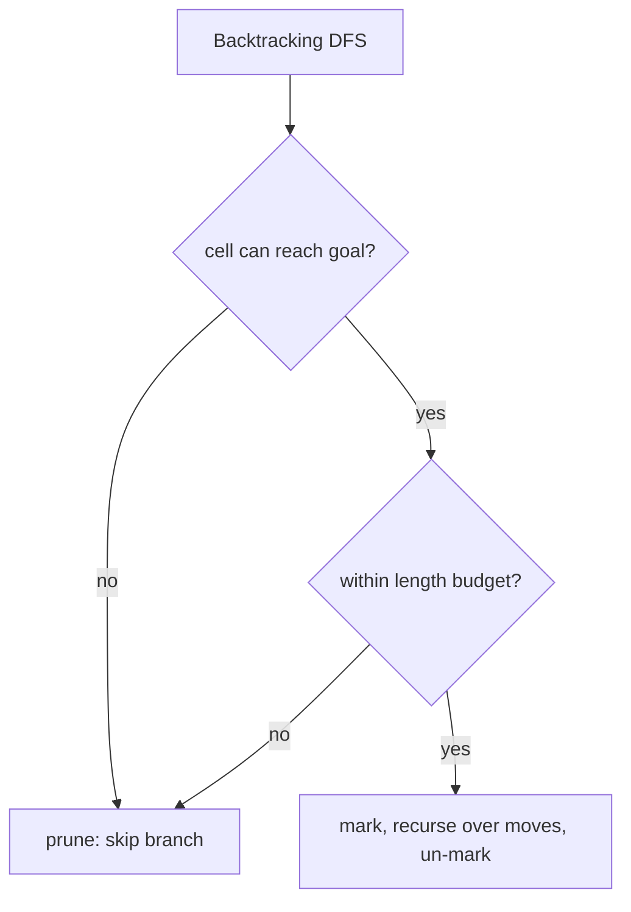

# Rat in a Maze (Grid Path Backtracking) — Middle Level

> **Focus:** the engineering choices that separate "I memorized the template" from "I can pick the right variant": one path vs all paths vs counting, lexicographic ordering, diagonal and jump move-sets, the BFS-vs-backtracking decision, and pruning that turns the worst-case exponential search into something practical.

---

## Table of Contents

1. [Introduction](#introduction)
2. [Deeper Concepts](#deeper-concepts)
3. [One Path vs All Paths vs Counting](#one-path-vs-all-paths-vs-counting)
4. [Lexicographic Ordering](#lexicographic-ordering)
5. [Move-Set Variants: Diagonals and Jumps](#move-set-variants-diagonals-and-jumps)
6. [BFS vs Backtracking: Choosing the Right Tool](#bfs-vs-backtracking-choosing-the-right-tool)
7. [Pruning and Dead-End Detection](#pruning-and-dead-end-detection)
8. [Code Examples](#code-examples)
9. [Error Handling](#error-handling)
10. [Performance Analysis](#performance-analysis)
11. [Best Practices](#best-practices)
12. [Visual Animation](#visual-animation)
13. [Summary](#summary)

---

## Introduction

At junior level the message was a single rhythm: **mark → recurse over directions → un-mark**. At middle level you start asking the questions that decide whether your solution is *correct for the asked variant* and *fast enough to finish*:

- When the problem says "find a path", do they want **one**, **all**, the **count**, or the **smallest**? Each is the same skeleton with a different success handler — but get it wrong and you either stop too early or never stop.
- Why does trying directions in **D, L, R, U** order make the first discovered path the lexicographically smallest, and when does that guarantee break?
- The classic problem allows 4 moves. What changes when **diagonals** (8 moves) or **jumps** (move `k` cells, like a knight or a "leap over a wall") are allowed?
- The interviewer asks for the **shortest** path. Why is backtracking the *wrong* tool, and what is BFS doing differently?
- The grid is `15 × 15` and "all paths" times out. What **pruning** rescues you?

These are the questions that turn a fragile template into a tool you can aim at the right problem.

---

## Deeper Concepts

### The state of a backtracking search

The "state" at any moment is exactly: the **current cell** `(r, c)` plus the **set of visited cells** on the current trail. The visited matrix *is* that set, stored compactly. Because the visited set changes as you descend and ascend, the same cell can appear on many different paths — just never twice on the *same* path. This is the defining property of **simple paths** (no repeated vertex), and it is why the un-mark step is mandatory: it removes a cell from the current trail's visited set so other trails may use it.

### Why the search tree is exponential

From each cell you branch into up to 4 children. A path can be as long as `N = n·m` cells. The recursion tree therefore has up to `4^N` leaves in the absolute worst case. In practice, walls, bounds, and the visited check cut this dramatically — but "enumerate all simple paths in a grid" is genuinely exponential, because the *number of simple paths itself* grows exponentially (see `professional.md` for the unobstructed `C(m+n, n)` monotone-path count and the much larger free-movement count).

### Path reconstruction

There are two common ways to carry the answer:

1. **Direction string** — append a letter (`D/L/R/U`) before each recursive call, pop it after. Compact, and naturally sorts for lexicographic output.
2. **Cell list** — push `(r, c)` onto a list on enter, pop on exit. More flexible if you need coordinates, e.g., to mark the solution on the grid.

Both are *parallel* to the visited matrix: the string/list records the *order*, the matrix records *membership*. Keep them in sync — push/append and pop/un-mark must bracket each other exactly.

### Why "no repeats" makes this hard (and interesting)

It is worth internalizing *why* the search is exponential and not just memorizing that it is. If revisits were allowed (counting *walks*), the future from a cell would depend only on the cell — a memoryless transition you could collapse with a matrix power in polynomial time. The "no repeated cell" rule makes the future depend on the *entire set* of cells already used, so the state is `(current cell, visited set)` — exponentially many states. The visited matrix that makes your search *correct* is precisely the thing that makes it *slow*. This is the same walks-vs-simple-paths boundary you will meet again in graph theory, and it explains why counting simple paths is intractable in general while shortest paths and walk counts are easy.

---

## One Path vs All Paths vs Counting

These three are the same DFS with three differences: **what you do at the goal**, **whether you stop early**, and **whether you always un-mark**.

| Variant | Return type | At goal | Stop early? | Un-mark on exit? |
|---------|-------------|---------|-------------|------------------|
| One path | `bool` | record path, return `true` | **yes** (propagate `true`) | only if no success through this cell |
| All paths | `void` | record path, return | **no** | **always** |
| Count paths | `int` accumulator | `count++`, return | **no** | **always** |
| Smallest path | `bool`, D,L,R,U order | record, return `true` | **yes** | only on failure |

The subtle one is **un-mark on success**. For *one path*, once a cell is confirmed on the winning route you do **not** un-mark it — it stays in the answer. For *all paths*, you **always** un-mark, even after recording a success, because you must explore other routes that reuse this cell.

```text
ONE PATH:
    if goal: record; return true
    mark
    for dir: if dfs(next): return true
    unmark; return false          # only reached on failure

ALL PATHS:
    if goal: record; return        # do NOT stop
    mark
    for dir: dfs(next)
    unmark                          # ALWAYS
```

### Counting without storing paths

When you only need *how many*, do not build the strings — increment a counter at the goal. This keeps memory at `O(N)` (the recursion + visited matrix) instead of `O(number_of_paths × path_length)`, which can be astronomically larger.

### A worked side-by-side

Take the open `2 × 2` maze. The three variants behave like this:

```
ONE PATH (D,L,R,U):   explores (0,0)->D->(1,0)->R->(1,1) -> returns "DR", STOPS.
ALL PATHS:            emits "DR", un-marks back to (0,0), then (0,0)->R->(0,1)->D->(1,1)
                      emits "RD". Result: ["DR","RD"].
COUNT:                same exploration as ALL PATHS but returns 2 (no strings stored).
```

The exploration *order* is identical across all three; only the stopping rule and the success handler differ. This is why a single, well-tested `dfs` skeleton can serve all of them — you parameterize the goal action and the early-return, nothing else.

### The "keep marked on success" subtlety, visually

For one-path, when `(1,0)` is on the winning route, it stays marked because we `return true` before reaching the `unmark` line. For all-paths there is no early return, so control always reaches `unmark`, freeing `(1,0)` for the `RD` exploration. If you accidentally use the all-paths skeleton (always un-mark) for the one-path variant, it still works (you just do redundant un-marking after returning), but using the one-path skeleton (early return, conditional un-mark) for all-paths is **wrong** — it stops after the first path.

---

## Lexicographic Ordering

A frequent interview requirement: print all paths **in sorted (dictionary) order**, or print only the **lexicographically smallest** path.

### Why D, L, R, U order works

If you always attempt directions in the order **D < L < R < U** (alphabetical), then the DFS explores branches in increasing order of their first differing letter. Therefore:

- For **one** path: the first complete path discovered is the smallest possible path string. You can stop immediately.
- For **all** paths: the paths are *generated* in sorted order, so you can print them as you find them with no extra sort.

The proof intuition: at the first branch where two paths differ, the one that took the alphabetically smaller direction is generated first and is smaller. DFS in fixed alphabetical order is a pre-order traversal of the path-string trie, which visits strings in sorted order.

### When the guarantee breaks

- If your direction order is **not** alphabetical, the first path is *not* the smallest — you must collect all and sort, or fix the order.
- If "smallest" is defined by **length** (fewest moves) rather than dictionary order, this does **not** apply — that is a shortest-path question (BFS). Clarify the definition.
- With **diagonal/jump** moves, define the letter ordering for the new moves explicitly, or the lexicographic claim is undefined.

---

## Move-Set Variants: Diagonals and Jumps

The 4-direction set is just one choice. The template is unchanged; only the `(dr, dc, letter)` list grows.

### 8-direction (diagonals allowed)

Add the four diagonal moves. A common letter convention: keep D/L/R/U and add the diagonals as two-letter combos or single letters per your spec.

```text
4-dir:  D(+1,0) L(0,-1) R(0,+1) U(-1,0)
8-dir adds the diagonals:
        (+1,-1) (+1,+1) (-1,-1) (-1,+1)
```

### Jump moves

Some variants let the rat **jump** `maze[r][c]` cells in a direction (the cell value is the jump length), or jump exactly `k` cells over walls. The recursion is identical; only `next = (r + dr*step, c + dc*step)` changes. You must still bounds-check the *landing* cell and check it is open and unvisited.

### Knight-style moves

If the rat moves like a chess knight, the move-set is the 8 knight offsets `(±1,±2), (±2,±1)`. This is exactly the structure used in knight-path problems; the visited-matrix backtracking template handles it without change.

The lesson: **the engine is move-set-agnostic.** Choose the right `(dr, dc)` list (and step multiplier) and the same mark/recurse/un-mark logic enumerates paths under any movement rule.

### Counting collapses for acyclic move-sets

There is a crucial efficiency cliff hidden in the move-set. If the moves can never form a cycle — for example **Down and Right only** — then no cell can ever be revisited, so the visited matrix becomes unnecessary and you can *count* with a linear DP instead of exponential backtracking:

```
dp[r][c] = dp[r-1][c] + dp[r][c-1]      # 0 for blocked cells
```

This is `O(N)` and handles `1000 × 1000` grids instantly. Adding diagonals (Down/Right/diagonal-DR) keeps it acyclic, giving the Delannoy-number DP `dp[r][c] = dp[r-1][c] + dp[r][c-1] + dp[r-1][c-1]`. The moment you allow Up/Left (the full 4-direction set), cycles become possible, the visited matrix is mandatory, and you are back to exponential backtracking. **Acyclic move-set → polynomial DP; cyclic move-set → exponential search.** Recognizing which side you are on is the single biggest performance decision in maze counting.

---

## BFS vs Backtracking: Choosing the Right Tool

This is the single most important judgment call in grid pathfinding, and a classic interview trap.

| Need | Tool | Why |
|------|------|-----|
| **Shortest** path (fewest cells) | **BFS** | Explores by distance layer; first time it reaches the goal is the shortest. |
| Shortest path, weighted cells | Dijkstra / A* | BFS only works for unit weights. |
| **One** path (any) | DFS backtracking | Simple; first found is fine. |
| **All** paths | DFS backtracking | BFS cannot easily enumerate every simple path. |
| **Count** paths | DFS backtracking (or DP if monotone) | Enumerate or count. |
| **Lexicographically smallest** path | DFS backtracking, D,L,R,U | First found in alphabetical order. |
| Path with **constraints** (must visit X, avoid Y) | DFS backtracking | Easy to add a predicate at each step. |
| Just **reachability** (yes/no) | BFS or DFS | Either works; BFS uses iteration, no deep recursion. |

### Why backtracking is *not* for shortest path

DFS commits to one direction and goes deep. It may discover a *long, winding* path to the goal long before it would ever find the short one — and for "one path" it returns that long one. There is no notion of "closest first" in DFS. **BFS**, by contrast, expands all cells at distance 1, then all at distance 2, and so on; the moment it dequeues the goal, that distance is provably minimal. The two algorithms answer different questions: BFS measures *one optimal* path; backtracking *lists* paths and enforces *constraints*.

```text
BFS (shortest):   queue, visited-permanent, distance layers  -> O(N)
Backtracking:     recursion, visited-on-trail (un-marked!)   -> exponential to enumerate
```

A key structural difference: BFS marks a cell visited **permanently** (you never need to revisit it for the *shortest* path). Backtracking marks visited **only for the current trail** and un-marks on exit, because a cell can lie on many different enumerated paths.

---

## Pruning and Dead-End Detection

Pure backtracking explores branches that cannot possibly reach the goal. Pruning cuts those branches early. Common, cheap prunes:

### 1. Reachability pre-check

Before (or during) the search, run a quick BFS/DFS flood from the goal to mark which cells *can* reach the goal. Then in the backtracking DFS, immediately abandon any cell not in that reachable set. This kills entire walled-off pockets.

### 2. Dead-end detection

A cell with no open, in-bounds, unvisited neighbor (other than where you came from) is a dead end — entering it is wasted work. You can detect degree-1 corridors and avoid stepping into stubs that do not contain the goal.

### 3. Manhattan-distance bound (for bounded-length searches)

If the problem caps path length at `L`, prune when `current_steps + manhattan(current, goal) > L` — you cannot possibly reach the goal in time. (Manhattan distance is the minimum remaining steps with 4-direction moves.)

### 4. "Must-visit-all" parity/count prune

In variants that require visiting *every* open cell (Hamiltonian-style, e.g., "Unique Paths III"), prune when the count of remaining open cells cannot match the remaining steps, or when the search splits the free space into disconnected regions.



Pruning does **not** change the exponential worst case, but on real mazes it routinely turns an intractable search into an instant one.

### Worked reachability prune

Consider a maze where the bottom-left has an open pocket sealed off from the goal:

```
maze:           canReach (reverse flood from goal):
1 1 1           T T T
1 0 1           T . T
1 1 1           T T T (goal)
1 0 0           F . .   <- this open cell cannot reach the goal
```

The reverse BFS from the goal marks every cell that *can* reach it. The lone open cell in the bottom-left row is not marked, so the instant the rat would step there, the prune abandons the branch — saving every fruitless step into the pocket. The flood costs one `O(N)` pass up front and pays for itself many times over on walled mazes. The key correctness rule: **flood with the same move-set the search uses**, or the prune may wrongly discard reachable cells.

---

## Code Examples

### All paths and count, with the same engine (Python)

```python
DR = [1, 0, 0, -1]   # D, L, R, U  (alphabetical -> sorted output)
DC = [0, -1, 1, 0]
DIRS = "DLRU"


def all_paths(maze):
    n, m = len(maze), len(maze[0])
    visited = [[False] * m for _ in range(n)]
    results = []

    def dfs(r, c, path):
        if r < 0 or r >= n or c < 0 or c >= m:
            return
        if maze[r][c] == 0 or visited[r][c]:
            return
        if r == n - 1 and c == m - 1:
            results.append("".join(path))   # record, DO NOT stop
            return
        visited[r][c] = True
        for d in range(4):
            path.append(DIRS[d])
            dfs(r + DR[d], c + DC[d], path)
            path.pop()
        visited[r][c] = False               # always un-mark

    if maze[0][0] == 1:
        dfs(0, 0, [])
    return results                          # already in sorted order


def count_paths(maze):
    n, m = len(maze), len(maze[0])
    visited = [[False] * m for _ in range(n)]

    def dfs(r, c):
        if r < 0 or r >= n or c < 0 or c >= m or maze[r][c] == 0 or visited[r][c]:
            return 0
        if r == n - 1 and c == m - 1:
            return 1
        visited[r][c] = True
        total = sum(dfs(r + DR[d], c + DC[d]) for d in range(4))
        visited[r][c] = False
        return total

    return dfs(0, 0) if maze[0][0] == 1 else 0


if __name__ == "__main__":
    maze = [
        [1, 0, 0, 0],
        [1, 1, 0, 1],
        [1, 1, 0, 0],
        [0, 1, 1, 1],
    ]
    print(all_paths(maze))   # sorted direction strings
    print(count_paths(maze)) # how many
```

### All paths with reachability pruning (Go)

```go
package main

import "fmt"

var (
	dr   = []int{1, 0, 0, -1} // D, L, R, U
	dc   = []int{0, -1, 1, 0}
	dirs = []byte{'D', 'L', 'R', 'U'}
)

// markReachable: cells from which the goal is reachable (reverse flood from goal).
func markReachable(maze [][]int) [][]bool {
	n, m := len(maze), len(maze[0])
	can := make([][]bool, n)
	for i := range can {
		can[i] = make([]bool, m)
	}
	if maze[n-1][m-1] == 0 {
		return can
	}
	type pt struct{ r, c int }
	queue := []pt{{n - 1, m - 1}}
	can[n-1][m-1] = true
	for len(queue) > 0 {
		p := queue[0]
		queue = queue[1:]
		for d := 0; d < 4; d++ {
			nr, nc := p.r+dr[d], p.c+dc[d]
			if nr >= 0 && nr < n && nc >= 0 && nc < m && maze[nr][nc] == 1 && !can[nr][nc] {
				can[nr][nc] = true
				queue = append(queue, pt{nr, nc})
			}
		}
	}
	return can
}

func allPaths(maze [][]int) []string {
	n, m := len(maze), len(maze[0])
	can := markReachable(maze)
	visited := make([][]bool, n)
	for i := range visited {
		visited[i] = make([]bool, m)
	}
	var results []string
	var dfs func(r, c int, path []byte)
	dfs = func(r, c int, path []byte) {
		if r < 0 || r >= n || c < 0 || c >= m {
			return
		}
		if maze[r][c] == 0 || visited[r][c] || !can[r][c] { // prune unreachable
			return
		}
		if r == n-1 && c == m-1 {
			results = append(results, string(path))
			return
		}
		visited[r][c] = true
		for d := 0; d < 4; d++ {
			dfs(r+dr[d], c+dc[d], append(path, dirs[d]))
		}
		visited[r][c] = false
	}
	if maze[0][0] == 1 {
		dfs(0, 0, []byte{})
	}
	return results
}

func main() {
	maze := [][]int{
		{1, 0, 0, 0},
		{1, 1, 0, 1},
		{1, 1, 0, 0},
		{0, 1, 1, 1},
	}
	fmt.Println(allPaths(maze))
}
```

### Count paths with the same template (Java)

```java
public class RatCountPaths {
    static final int[] dr = {1, 0, 0, -1};
    static final int[] dc = {0, -1, 1, 0};

    static int dfs(int[][] maze, int r, int c, boolean[][] visited) {
        int n = maze.length, m = maze[0].length;
        if (r < 0 || r >= n || c < 0 || c >= m) return 0;
        if (maze[r][c] == 0 || visited[r][c]) return 0;
        if (r == n - 1 && c == m - 1) return 1;
        visited[r][c] = true;
        int total = 0;
        for (int d = 0; d < 4; d++)
            total += dfs(maze, r + dr[d], c + dc[d], visited);
        visited[r][c] = false;       // always un-mark
        return total;
    }

    public static void main(String[] args) {
        int[][] maze = {
            {1, 0, 0, 0},
            {1, 1, 0, 1},
            {1, 1, 0, 0},
            {0, 1, 1, 1},
        };
        boolean[][] visited = new boolean[maze.length][maze[0].length];
        int count = (maze[0][0] == 1) ? dfs(maze, 0, 0, visited) : 0;
        System.out.println(count);
    }
}
```

---

## Error Handling

| Scenario | What goes wrong | Correct approach |
|----------|-----------------|------------------|
| All-paths stops after the first | Used the one-path `return true` skeleton. | Never return early; always un-mark. |
| One-path explores forever | Forgot to propagate `true` up; keeps searching. | Return `true` immediately on success. |
| Lexicographic output unsorted | Direction order not alphabetical (D,L,R,U). | Fix the order, or collect-and-sort. |
| Diagonal variant misses moves | Move list still only 4 entries. | Extend `(dr,dc)` to 8 (or jump offsets). |
| Pruning hides valid paths | Reachability computed with wrong direction set. | Compute reachability with the *same* move-set. |
| Counting overflows | Huge grid, count exceeds 32-bit. | Use 64-bit or modular counting. |
| Pruned everything | Reverse flood failed because goal is blocked. | Handle blocked goal as "no path" before pruning. |

---

## Performance Analysis

Let `N = n·m`.

| Variant | Time (worst) | Extra space | Notes |
|---------|--------------|-------------|-------|
| One path | `O(4^N)` | `O(N)` | Usually far less; returns on first success. |
| All paths | `O(4^N + total_output)` | `O(N)` + output | Output can dominate. |
| Count paths | `O(4^N)` | `O(N)` | No output storage. |
| With reachability prune | same worst case, much smaller typical | `O(N)` for the `can` matrix | Kills walled pockets in `O(N)` preprocessing. |
| Shortest (BFS, for contrast) | `O(N)` | `O(N)` | Use this when you need fewest steps. |

The exponential is unavoidable for *enumeration* because the count of simple paths is itself exponential. The practical levers are **pruning** (reachability, dead-ends, length bounds) and **early termination** (one path / smallest path). For a `15 × 15` open grid, "all paths" is hopeless no matter what — there are astronomically many. Know whether the question really needs *all* of them.

A useful mental model: the search-tree size (all branches, including failures) can be far larger than the output size (successful paths). Pruning shrinks the gap between them — it removes failed branches — but it can never beat the output size, which is a hard floor. On heavily walled mazes that gap is enormous, so pruning helps a lot; on open mazes the gap is small, so pruning barely helps and "all paths" is simply infeasible.

```python
# Sanity: open 4x4 grid free movement has many simple paths;
# even count_paths can be slow on large open grids -- this IS the exponential.
# Reachability pruning helps mazes with walls, not fully-open grids.
```

The biggest single speedup on real (walled) mazes is the **reachability pre-flood**: an `O(N)` BFS from the goal that prunes every cell that cannot reach it.

---

## Common Interview Framings

The same engine appears under many problem names. Recognizing the framing tells you which variant to reach for:

| Problem name | What it really asks | Variant |
|--------------|---------------------|---------|
| "Rat in a Maze" (GfG) | print all paths in sorted order | all paths, D,L,R,U |
| "Unique Paths" / "Unique Paths II" | count monotone paths | DP `O(N)`, not backtracking |
| "Unique Paths III" | paths visiting every open cell | backtracking + connectivity prune |
| "Word Search" | does a labeled path exist? | one-path backtracking, letters as constraint |
| "Number of Islands" | connected components | BFS/DFS flood, not pathing |
| "Shortest Path in Binary Matrix" | fewest cells to goal | BFS, not backtracking |
| "All Paths From Source to Target" (DAG) | all paths in a DAG | DFS, no un-mark needed (acyclic) |

The trap pairs are: *Unique Paths* (DP, monotone) vs *Rat in a Maze* (backtracking, free movement); and *Shortest Path in Binary Matrix* (BFS) vs *all paths* (backtracking). Always confirm: free or monotone movement? one/all/count/shortest? Those two questions pin the algorithm.

## Best Practices

- **Match the variant to the question:** one / all / count / smallest each tweak the success handler — decide first.
- **Keep the move-set in one place:** a `(dr, dc, letter)` list; change it once to switch to diagonals/jumps/knight.
- **Use D,L,R,U order** when lexicographically smallest output is required; otherwise any order is fine.
- **Pre-flood from the goal** to prune unreachable cells; it is `O(N)` and often the difference between fast and frozen.
- **Reserve BFS for shortest path** — never bend backtracking into a shortest-path role.
- **Copy paths when recording**; keep the path string/list bracketed exactly with mark/un-mark.
- **Count, don't store,** when you only need the number of paths.
- **Verify the prune is sound** — the pruned search must return the same path *set* as the unpruned one on small mazes.
- **Assert the visited matrix is all-false after the search** — a leftover mark is proof of a missing un-mark.

---

## Decision Recap

A compact decision procedure for any maze question:

```text
1. Do you need ONE optimal path (fewest moves / least cost)?
     -> BFS (unit cost) / Dijkstra (weights) / A* (heuristic). STOP.
2. Do you need to COUNT, and is movement monotone (Down/Right, acyclic)?
     -> DP: dp[r][c] = dp[r-1][c] + dp[r][c-1]. O(N). STOP.
3. Otherwise (all paths / smallest / count under free movement / constraints):
     -> DFS backtracking with a visited matrix.
        - one path:        return true on first success
        - smallest path:   D,L,R,U order, return first found
        - all paths:       never stop, always un-mark
        - count:           increment at goal, always un-mark
     -> add a reachability pre-flood prune for walled mazes.
```

Steps 1 and 2 are the cheap, polynomial escapes; step 3 is the exponential fallback you reach only when the question genuinely requires enumeration or free-movement counting.

## Visual Animation

> See [`animation.html`](./animation.html) for an interactive view.
>
> The middle-level animation highlights:
> - The DFS frontier advancing and the path stack growing/shrinking.
> - Visited marks appearing on enter and **clearing on backtrack** (the un-mark).
> - Dead-end cells flashing before the rat retreats.
> - The discovered path highlighted from start to goal.

---

## Summary

The Rat-in-a-Maze template is one engine with several aims. **One path** stops on first success and keeps the winning cells marked; **all paths** never stop and always un-mark; **counting** swaps the recorded string for a counter; the **lexicographically smallest** path falls out for free if you try directions in **D, L, R, U** order, because DFS in alphabetical order generates path strings in sorted order. The move-set is interchangeable: extend the `(dr, dc)` list for **diagonals**, **jumps**, or **knight** moves and the mark/recurse/un-mark logic is unchanged. The most important judgment is the **BFS boundary**: backtracking *enumerates* paths and enforces *constraints*, but for the **shortest** path you use BFS, which marks cells permanently and expands by distance layers. Finally, **pruning** — especially an `O(N)` reachability pre-flood from the goal — does not beat the exponential worst case but routinely makes real mazes solvable instantly.
