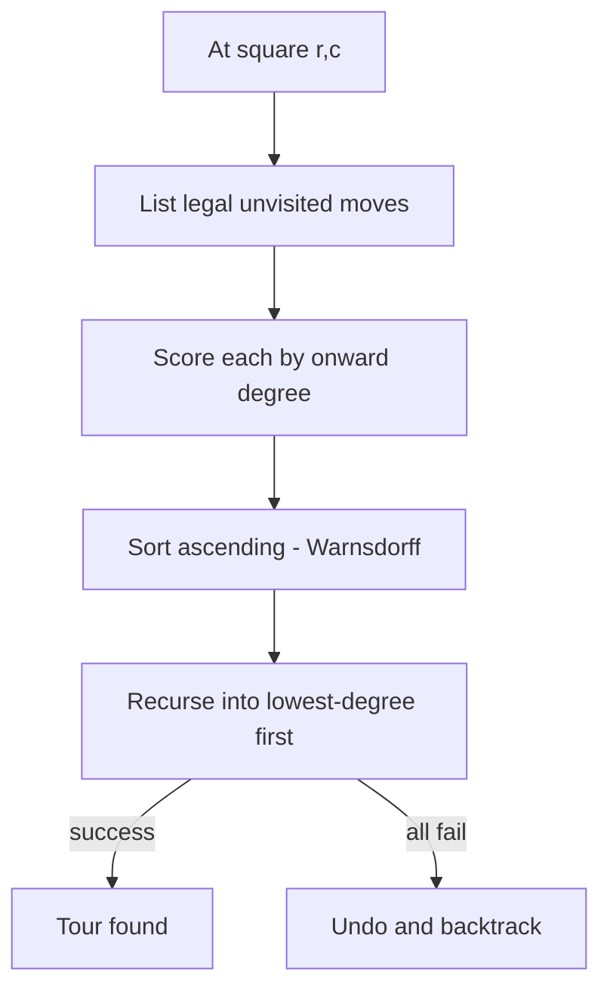

# Knight's Tour (Backtracking + Warnsdorff's Heuristic) — Junior Level

> **One-line summary:** A **Knight's Tour** is a sequence of legal chess-knight moves that visits **every square of an `N×N` board exactly once**. You find one with **backtracking** (try a move, mark the square visited, recurse, undo on failure), and you make it fast with **Warnsdorff's rule** — always jump to the square that has the *fewest* unvisited onward moves.

---

## Table of Contents

1. [Introduction](#introduction)
2. [Prerequisites](#prerequisites)
3. [Glossary](#glossary)
4. [Core Concepts](#core-concepts)
5. [Big-O Summary](#big-o-summary)
6. [Real-World Analogies](#real-world-analogies)
7. [Pros & Cons](#pros--cons)
8. [Step-by-Step Walkthrough](#step-by-step-walkthrough)
9. [Code Examples](#code-examples)
10. [Coding Patterns](#coding-patterns)
11. [Error Handling](#error-handling)
12. [Performance Tips](#performance-tips)
13. [Best Practices](#best-practices)
14. [Edge Cases & Pitfalls](#edge-cases--pitfalls)
15. [Common Mistakes](#common-mistakes)
16. [Cheat Sheet](#cheat-sheet)
17. [Visual Animation](#visual-animation)
18. [Summary](#summary)
19. [Further Reading](#further-reading)

---

## Introduction

Imagine a single chess **knight** standing on the corner of an empty `8×8` board. A knight moves in an "L" shape: two squares in one direction and then one square at a right angle. The puzzle is deceptively simple to state: *can the knight hop around so that it lands on every one of the 64 squares exactly once, never stepping on a square it has already used?*

That puzzle is the **Knight's Tour**, one of the oldest problems in recreational mathematics — studied since at least the 9th century. It is also a perfect first real problem for learning **backtracking**, because the rules are tiny but the search space is enormous. From most squares the knight has up to **8** possible next moves, and the board has dozens of squares to fill, so blindly trying everything would take longer than the age of the universe on a large board.

The good news is that two ideas make it tractable:

1. **Backtracking** — a disciplined "try, recurse, undo" search. We place the knight, mark the square as visited with its step number, and recursively try to finish the tour. If we hit a dead end (no legal unvisited move and the board is not full), we **undo** the last move and try a different one. This guarantees we find a tour if one exists, but on its own it is hopelessly slow for big boards.

2. **Warnsdorff's rule** — a greedy *heuristic* layered on top of backtracking. Instead of trying the 8 candidate moves in arbitrary order, we sort them so we visit the square with the **fewest onward unvisited moves first**. The intuition: squares with few exits (like corners) are "traps" — visit them early while you still can, before they get stranded. This single ordering trick turns the search from exponential to *near-linear* in practice on standard boards.

There are two flavours of tour. An **open tour** ends on any square. A **closed (re-entrant) tour** ends on a square that is one knight-move away from the start, so the knight could loop forever. Not every board has a tour at all — for example, no knight's tour exists on a `3×3`, `4×4`, or `2×N` board — and closed tours have stricter requirements still. We will see exactly which boards work later.

Under the hood, the Knight's Tour is a famous instance of a much bigger problem: finding a **Hamiltonian path** (a path that visits every vertex exactly once) in the **knight graph**, where squares are vertices and legal knight moves are edges. Hamiltonian path is **NP-hard in general**, but the knight graph has special structure that lets heuristics like Warnsdorff's succeed where general graphs would defeat us.

---

## Prerequisites

Before reading this file you should be comfortable with:

- **2D grids / matrices** — representing the board as an `N×N` array of integers, indexed `board[row][col]`.
- **Recursion** — a function that calls itself, with a base case that stops the recursion.
- **Backtracking basics** — the "choose / explore / un-choose" pattern. See sibling topics `01-subsets`, `02-permutations` in this `16-backtracking` section.
- **Boundary checks** — testing that `0 ≤ row < N` and `0 ≤ col < N` before touching a cell.
- **Big-O notation** — why an exponential search is dangerous and why a heuristic matters.
- **Arrays of move offsets** — storing the 8 knight deltas as `(dr, dc)` pairs and looping over them.

Optional but helpful:

- A glance at **graph vertices and edges** — the tour is a Hamiltonian path on the "knight graph".
- Familiarity with **greedy algorithms** — Warnsdorff's rule is a greedy choice. See `14-greedy-algorithms`.

---

## Glossary

| Term | Meaning |
|------|---------|
| **Knight** | A chess piece that moves in an "L": `(±1, ±2)` or `(±2, ±1)` — eight possible jumps. |
| **Knight's Tour** | A sequence of knight moves visiting every square of the board exactly once. |
| **Open tour** | A tour whose end square is *not* a knight-move from the start. |
| **Closed / re-entrant tour** | A tour whose last square *is* a knight-move from the start, forming a cycle. |
| **Backtracking** | Try a choice, recurse; if it fails, undo it and try the next choice. |
| **Degree of a square** | The number of *unvisited* squares reachable from it in one knight move. |
| **Warnsdorff's rule** | Greedy heuristic: always move to the unvisited square with the **smallest degree**. |
| **Knight graph** | Graph whose vertices are squares and whose edges connect squares a knight move apart. |
| **Hamiltonian path** | A path visiting every vertex of a graph exactly once. A tour *is* one of these. |
| **Dead end** | A position with no legal unvisited move while the board is still not full. |

---

## Core Concepts

### 1. The Eight Knight Moves

From a square `(r, c)`, a knight can reach up to eight squares. We store the offsets once and reuse them:

```
moves = [(-2,-1), (-2,+1), (-1,-2), (-1,+2),
         (+1,-2), (+1,+2), (+2,-1), (+2,+1)]
```

A move `(dr, dc)` is **legal** only when the destination `(r+dr, c+dc)` is on the board **and** not yet visited. Near edges and corners, fewer than 8 moves are legal — a corner square has only **2** legal moves, which is exactly why corners are dangerous.

### 2. The Board as a Visited-Order Grid

We use an `N×N` integer board. `-1` means "unvisited"; any other value is the **step number** on which the knight landed there. The starting square gets `0`, the next `1`, and so on. A complete tour fills the board with `0 … N²-1`.

```
board[r][c] = -1            // not yet visited
board[r][c] = step          // visited on this step (0-based)
```

### 3. Naive Backtracking

The skeleton is the classic backtracking loop:

```
solve(r, c, step):
    board[r][c] = step              // CHOOSE: mark visited
    if step == N*N - 1: return true // base case: board full
    for each (dr, dc) in moves:     // EXPLORE
        nr, nc = r+dr, c+dc
        if on_board(nr,nc) and board[nr][nc] == -1:
            if solve(nr, nc, step+1): return true
    board[r][c] = -1                // UN-CHOOSE: undo on failure
    return false
```

This **always finds a tour if one exists**, because it explores every possibility. But it is *hopelessly slow* without help: the knight wanders into corners that become unreachable, fails deep in the recursion, and backtracks billions of times. On an `8×8` board, naive backtracking with a bad move order can run for minutes or hours.

### 4. Warnsdorff's Rule — the Game Changer

Warnsdorff (1823) gave a one-line fix: **before recursing, sort the candidate moves by their *degree* — the number of unvisited squares each candidate can itself reach — and try the lowest-degree candidate first.**

```
for each legal move m:
    degree[m] = count of legal unvisited moves from m
sort moves by degree ascending
try them in that order
```

Why it works: a square with few exits is about to become a trap. If you do not visit it now, you may never be able to, because each move you make elsewhere can only *reduce* its exit count. Grabbing the most-constrained square first keeps the rest of the board flexible. With this ordering, the *first* path the search tries is very often a complete tour — so backtracking rarely fires at all, giving **near-linear** practical performance.

### 5. Heuristic, Not a Guarantee

Crucially, Warnsdorff's rule is a **heuristic**: it usually finds a tour on the first try, but it is **not guaranteed** to. On some boards a pure greedy walk can paint itself into a corner. The robust solution is **Warnsdorff for move ordering, plus backtracking as a fallback** — the best of both worlds: fast in the common case, correct in every case.

### 6. Open vs Closed Tours

- An **open tour** just needs to fill the board.
- A **closed tour** additionally requires the last square to be a knight-move from the start. You check this with one extra test at the base case.

---

## Big-O Summary

| Operation | Time | Space | Notes |
|-----------|------|-------|-------|
| One legality check (`on_board` + visited) | **O(1)** | — | Constant work per candidate. |
| Counting a square's degree | O(1) | — | At most 8 candidates checked. |
| Naive backtracking (worst case) | **O(8^(N²))** | O(N²) | Exponential; explores a huge tree. |
| Warnsdorff-ordered search (typical) | **~O(N²)** | O(N²) | Near-linear in practice; visits each square ~once. |
| Warnsdorff + backtracking (worst case) | O(8^(N²)) | O(N²) | Same worst case, but almost never hit. |
| Board / recursion storage | — | O(N²) | Board grid plus recursion depth `N²`. |

The headline: naive backtracking is **exponential** and Warnsdorff makes the *typical* case **roughly linear** in the number of squares `N²`. The worst case stays exponential because Warnsdorff is only a heuristic — but you essentially never pay it on real boards.

---

## Real-World Analogies

| Concept | Analogy |
|---------|---------|
| The knight visiting every square | A delivery drone that must land on every rooftop in a grid neighborhood exactly once. |
| Backtracking | Exploring a maze: walk down a corridor, and if it dead-ends, retrace your steps and try the next door. |
| Warnsdorff's rule | A tourist visiting a city's hardest-to-reach attractions first (the ones with few connecting routes), saving the well-connected central spots for last. |
| Degree of a square | How many open exits a room has; a room with one exit is a trap you should clear early. |
| Open vs closed tour | A road trip that ends anywhere (open) vs one that ends right next to your house so you could loop again (closed). |
| Dead end + undo | Threading a needle: if the thread snags, you pull it back out and try a slightly different angle. |

Where the analogy breaks: a real drone can revisit rooftops; the knight strictly cannot revisit a square, which is what makes the problem a *Hamiltonian path* and therefore genuinely hard in general.

---

## Pros & Cons

| Pros | Cons |
|------|------|
| Backtracking is simple and **always correct** — finds a tour if one exists. | Naive backtracking is **exponential** and unusable beyond tiny boards. |
| Warnsdorff's rule makes the typical case **near-linear** — solves huge boards fast. | Warnsdorff is a heuristic with **no guarantee**; rare boards need the backtracking fallback. |
| Tiny memory footprint: one `N×N` grid plus recursion stack. | Recursion depth is `N²`; very large boards may need an explicit stack or iteration. |
| Naturally extends to closed tours and other piece tours with one tweak. | Tie-breaking among equal-degree moves matters and is easy to get subtly wrong. |
| Great teaching vehicle for backtracking, heuristics, and Hamiltonian paths. | For *enormous* boards you want divide-and-conquer construction, not search (see `senior.md`). |

**When to use:** finding a single tour on a board up to a few hundred squares per side, demonstrating backtracking/heuristics, puzzle solving, or as a subroutine where a tour is needed.

**When NOT to use:** if you need *all* tours counted on a large board (combinatorial explosion), or boards so large that even near-linear search is wasteful — there, constructive divide-and-conquer is the right tool.

---

## Step-by-Step Walkthrough

Let us trace Warnsdorff's rule on a small `5×5` board starting from the top-left corner `(0,0)`. (A `5×5` board *does* have an open tour, and Warnsdorff finds one without backtracking.)

**Step 0 — place at `(0,0)`.** Mark `board[0][0] = 0`. From a corner the knight has only two legal moves: `(1,2)` and `(2,1)`.

```
Candidates from (0,0):
  (1,2): legal unvisited onward moves -> count them
  (2,1): legal unvisited onward moves -> count them
```

**Step 1 — compute degrees.** Suppose `(2,1)` can reach 3 unvisited squares and `(1,2)` can reach 4. Warnsdorff picks the **smaller** degree, so we move to `(2,1)` and set `board[2][1] = 1`.

**Step 2 — repeat.** From `(2,1)` list the legal unvisited moves, count each one's onward degree, and jump to the minimum-degree square. Mark it `2`.

**Continuing.** At every step we (a) gather legal unvisited moves, (b) score each by its onward degree, (c) move to the lowest score, (d) increment the step counter. Because the rule keeps grabbing the most-constrained squares, the board fills in without ever stranding a square. After 25 steps (`0 … 24`) the board is full:

```
Final 5x5 open tour (one possible result, numbers = visit order):

   0  13   8  21   2
   9  20   1  14   7
  18   3  12  23  10
  19  16  17   6  25... (illustrative; exact layout depends on tie-breaks)
```

**What if a dead end appears?** With Warnsdorff this is rare, but on harder boards the search may reach a square whose every onward move is blocked while the board is not full. That is a **dead end**: the backtracking layer kicks in, **undoes** the last move (`board[r][c] = -1`), and tries the next-best candidate. Pure Warnsdorff would give up here; Warnsdorff + backtracking recovers and still finds a tour.

The key takeaway: **each step is one greedy choice scored by degree, and backtracking is the safety net for the rare dead end.**

---

## Code Examples

### Example: Knight's Tour with Warnsdorff Ordering + Backtracking Fallback

Each program finds an open tour on an `N×N` board from `(0,0)`, ordering candidate moves by Warnsdorff degree, and backtracking if a dead end appears.

#### Go

```go
package main

import (
	"fmt"
	"sort"
)

var dr = []int{-2, -2, -1, -1, 1, 1, 2, 2}
var dc = []int{-1, 1, -2, 2, -2, 2, -1, 1}

type Solver struct {
	n     int
	board [][]int
}

func (s *Solver) onBoard(r, c int) bool {
	return r >= 0 && r < s.n && c >= 0 && c < s.n
}

// degree = number of legal UNVISITED onward moves from (r,c)
func (s *Solver) degree(r, c int) int {
	cnt := 0
	for i := 0; i < 8; i++ {
		nr, nc := r+dr[i], c+dc[i]
		if s.onBoard(nr, nc) && s.board[nr][nc] == -1 {
			cnt++
		}
	}
	return cnt
}

type cand struct{ r, c, deg int }

func (s *Solver) solve(r, c, step int) bool {
	s.board[r][c] = step
	if step == s.n*s.n-1 {
		return true
	}
	// gather legal unvisited moves
	var cands []cand
	for i := 0; i < 8; i++ {
		nr, nc := r+dr[i], c+dc[i]
		if s.onBoard(nr, nc) && s.board[nr][nc] == -1 {
			cands = append(cands, cand{nr, nc, s.degree(nr, nc)})
		}
	}
	// Warnsdorff: smallest degree first
	sort.Slice(cands, func(a, b int) bool { return cands[a].deg < cands[b].deg })
	for _, m := range cands {
		if s.solve(m.r, m.c, step+1) {
			return true
		}
	}
	s.board[r][c] = -1 // undo
	return false
}

func main() {
	n := 6
	board := make([][]int, n)
	for i := range board {
		board[i] = make([]int, n)
		for j := range board[i] {
			board[i][j] = -1
		}
	}
	s := &Solver{n: n, board: board}
	if s.solve(0, 0, 0) {
		for _, row := range s.board {
			fmt.Println(row)
		}
	} else {
		fmt.Println("no tour")
	}
}
```

#### Java

```java
import java.util.*;

public class KnightTour {
    static final int[] DR = {-2, -2, -1, -1, 1, 1, 2, 2};
    static final int[] DC = {-1, 1, -2, 2, -2, 2, -1, 1};
    int n;
    int[][] board;

    boolean onBoard(int r, int c) {
        return r >= 0 && r < n && c >= 0 && c < n;
    }

    int degree(int r, int c) {
        int cnt = 0;
        for (int i = 0; i < 8; i++) {
            int nr = r + DR[i], nc = c + DC[i];
            if (onBoard(nr, nc) && board[nr][nc] == -1) cnt++;
        }
        return cnt;
    }

    boolean solve(int r, int c, int step) {
        board[r][c] = step;
        if (step == n * n - 1) return true;
        List<int[]> cands = new ArrayList<>();
        for (int i = 0; i < 8; i++) {
            int nr = r + DR[i], nc = c + DC[i];
            if (onBoard(nr, nc) && board[nr][nc] == -1) {
                cands.add(new int[]{nr, nc, degree(nr, nc)});
            }
        }
        cands.sort(Comparator.comparingInt(a -> a[2])); // Warnsdorff
        for (int[] m : cands) {
            if (solve(m[0], m[1], step + 1)) return true;
        }
        board[r][c] = -1; // undo
        return false;
    }

    public static void main(String[] args) {
        KnightTour kt = new KnightTour();
        kt.n = 6;
        kt.board = new int[kt.n][kt.n];
        for (int[] row : kt.board) Arrays.fill(row, -1);
        if (kt.solve(0, 0, 0)) {
            for (int[] row : kt.board) System.out.println(Arrays.toString(row));
        } else {
            System.out.println("no tour");
        }
    }
}
```

#### Python

```python
import sys
sys.setrecursionlimit(100000)

DR = [-2, -2, -1, -1, 1, 1, 2, 2]
DC = [-1, 1, -2, 2, -2, 2, -1, 1]


def knight_tour(n, start=(0, 0)):
    board = [[-1] * n for _ in range(n)]

    def on_board(r, c):
        return 0 <= r < n and 0 <= c < n

    def degree(r, c):
        cnt = 0
        for i in range(8):
            nr, nc = r + DR[i], c + DC[i]
            if on_board(nr, nc) and board[nr][nc] == -1:
                cnt += 1
        return cnt

    def solve(r, c, step):
        board[r][c] = step
        if step == n * n - 1:
            return True
        cands = []
        for i in range(8):
            nr, nc = r + DR[i], c + DC[i]
            if on_board(nr, nc) and board[nr][nc] == -1:
                cands.append((degree(nr, nc), nr, nc))
        cands.sort()  # Warnsdorff: smallest degree first
        for _, nr, nc in cands:
            if solve(nr, nc, step + 1):
                return True
        board[r][c] = -1  # undo
        return False

    if solve(start[0], start[1], 0):
        return board
    return None


if __name__ == "__main__":
    result = knight_tour(6)
    if result:
        for row in result:
            print(row)
    else:
        print("no tour")
```

**What it does:** fills a `6×6` board from the corner, ordering each step's candidates by Warnsdorff degree and backtracking only if a dead end appears.
**Run:** `go run main.go` | `javac KnightTour.java && java KnightTour` | `python knight.py`

---

## Coding Patterns

### Pattern 1: Choose / Explore / Un-choose

The universal backtracking skeleton. **Choose** by writing the step number, **explore** by recursing on each candidate, **un-choose** by resetting to `-1` if all candidates fail.

```python
board[r][c] = step          # choose
for nr, nc in candidates:
    if solve(nr, nc, step+1):
        return True          # explore
board[r][c] = -1            # un-choose (undo)
return False
```

### Pattern 2: Precomputed Move Offsets

Never hand-write the eight moves inline. Store two parallel arrays `DR`, `DC` (or a list of pairs) once and loop. This avoids copy-paste bugs and makes the piece swappable.

### Pattern 3: Degree Scoring for Greedy Ordering

**Intent:** turn "try moves in any order" into "try the most-constrained move first".

```python
cands = [(degree(nr, nc), nr, nc) for (nr, nc) in legal_moves(r, c)]
cands.sort()                # ascending degree = Warnsdorff
```



---

## Error Handling

| Error | Cause | Fix |
|-------|-------|-----|
| Tour never completes / runs forever | Naive order on a large board; exponential blowup. | Add Warnsdorff move ordering. |
| `IndexError` / array out of bounds | Forgot the `on_board` check before reading `board[nr][nc]`. | Always bounds-check *before* indexing. |
| Stack overflow (deep recursion) | Recursion depth `N²` exceeds the language limit. | Raise the recursion limit, or convert to an explicit stack. |
| Returns "no tour" on a board that has one | Bug in degree counting or visited check; or board genuinely has none. | Verify with a brute-force search on a small board; confirm tour existence. |
| Square visited twice | Did not mark visited before recursing, or undid too early. | Mark `board[r][c]=step` *first*, undo *only* after all candidates fail. |
| Wrong start square assumed | Hard-coded `(0,0)` when caller wanted another start. | Parameterize the start cell. |

---

## Performance Tips

- **Always order moves with Warnsdorff.** This is the single biggest win — it turns minutes into milliseconds.
- **Compute degree cheaply.** Each degree count looks at only 8 candidates; do not rebuild expensive structures.
- **Avoid reallocating the candidate list.** Reuse a fixed-size buffer of at most 8 entries per call to reduce garbage.
- **Mark visited with the step number, not a separate boolean grid** — you get the visited flag *and* the tour order in one array.
- **Short-circuit at the base case** (`step == N*N-1`) before gathering candidates — no need to score moves on the final square.
- **Iterative stack for very deep boards** — converting recursion to an explicit stack removes the call-stack depth limit.

---

## Best Practices

- Keep `on_board`, `degree`, and `solve` as small, separately testable functions; most bugs hide in the bounds or degree logic.
- Store the eight moves in one named array and reuse it everywhere — never duplicate the offsets.
- Decide up front whether you want an **open** or **closed** tour and encode the base-case test accordingly.
- Validate any tour you produce: every number `0 … N²-1` must appear exactly once and consecutive numbers must be a knight-move apart.
- Test on the smallest boards with known answers first (`5×5` has a tour; `4×4` and `3×3` do not) before trusting big boards.
- Use Warnsdorff **for ordering** and keep backtracking **as a fallback** — never rely on greedy alone for correctness.

---

## Edge Cases & Pitfalls

- **`N = 1`** — a single square is a trivial tour of length 1 (the knight is already done).
- **`N = 2` and `N = 3`** — no tour exists; the knight cannot reach all squares. Your code should return "no tour" cleanly.
- **`4×4`** — also has **no** knight's tour; a classic surprise. Do not assume small even boards always work.
- **Start square matters** — a tour from one start may exist while a closed tour requires specific parity; corners are the hardest starts.
- **Dead ends with pure Warnsdorff** — greedy alone can fail; always keep the backtracking fallback.
- **Marking order** — mark the square visited *before* recursing, undo *only* after every candidate fails, or you will double-visit or strand squares.
- **Off-board reads** — reading `board[nr][nc]` before the bounds check crashes; check bounds first.

---

## Common Mistakes

1. **No move ordering** — running naive backtracking on `8×8` and assuming it will finish quickly. Add Warnsdorff.
2. **Bounds check after indexing** — write `on_board(nr,nc) && board[nr][nc]==-1`, never the reverse.
3. **Undoing too early** — resetting `board[r][c] = -1` inside the loop instead of after it; this corrupts the search.
4. **Confusing open and closed tours** — forgetting the extra knight-move-back test for a closed tour.
5. **Trusting greedy as a guarantee** — Warnsdorff usually works but is not proven to; keep the fallback.
6. **Counting visited squares in degree** — degree must count only *unvisited* onward moves, or the ordering is wrong.
7. **Assuming every board has a tour** — `2×2`, `3×3`, `4×4`, and `2×N` boards do not.

---

## Cheat Sheet

| Question | Tool | Note |
|----------|------|------|
| Does a tour exist on `N×N`? | knowledge / search | None for `N ∈ {1?,2,3,4}` except trivial `N=1`; tours exist for `N ≥ 5`. |
| Find one open tour fast | Warnsdorff ordering + backtracking | Near-linear typical time. |
| Find a closed tour | same + base-case "knight-move back to start" test | Stricter existence conditions. |
| The 8 moves | `(±1,±2),(±2,±1)` | Store as parallel `DR`/`DC` arrays. |
| Degree of a square | count legal **unvisited** onward moves | At most 8; corners have 2. |
| Mark / unmark | `board[r][c]=step` then `=-1` | One array doubles as visited + order. |

Core algorithm:

```
solve(r, c, step):
    board[r][c] = step
    if step == N*N - 1: return true
    cands = [(degree(nr,nc), nr, nc) for legal unvisited (nr,nc)]
    sort cands ascending by degree            # Warnsdorff
    for (_, nr, nc) in cands:
        if solve(nr, nc, step+1): return true
    board[r][c] = -1                          # undo
    return false
# typical: ~O(N^2); worst case exponential
```

---

## Visual Animation

> See [`animation.html`](./animation.html) for an interactive visualization.
>
> The animation demonstrates:
> - The knight hopping across the board with **visit-order numbers** filling each square
> - The **Warnsdorff degree** shown on every candidate square at each step
> - The **chosen move** (lowest degree) highlighted before the jump
> - **Backtracking** lighting up when a dead end forces the knight to retreat
> - Play / Pause / Step controls and an adjustable board size `N`

---

## Summary

The Knight's Tour asks the knight to visit every square of an `N×N` board exactly once. You solve it with **backtracking** — choose a square (mark its step number), explore each legal unvisited move recursively, and undo on failure — which is always correct but exponential and hopeless on large boards by itself. **Warnsdorff's rule** rescues it: order the candidate moves by their *onward degree* and always try the most-constrained square first, because squares with few exits become traps if left for later. This greedy ordering makes the typical search **near-linear**, while keeping backtracking as a fallback guarantees correctness when the heuristic stumbles. Remember that not every board has a tour (none for `2×2`, `3×3`, `4×4`), that **open** and **closed** tours differ by one base-case test, and that the whole problem is really a **Hamiltonian path** in the knight graph — NP-hard in general but tame here thanks to structure and heuristics.

---

## Further Reading

- H. C. von Warnsdorff (1823) — the original statement of the fewest-onward-moves heuristic.
- *Across the Board: The Mathematics of Chessboard Problems* (John J. Watkins) — a full book on knight's tours and related puzzles.
- Sibling topics in `16-backtracking` — `01-subsets`, `02-permutations`, `04-n-queens` for the backtracking template.
- Sibling topic `14-greedy-algorithms` — the greedy-choice mindset behind Warnsdorff's rule.
- Sibling topic `11-graphs` — knight graph, Hamiltonian path, and graph search foundations.
- cp-algorithms.com and GeeksforGeeks — "Knight's Tour" implementations and Warnsdorff write-ups.
