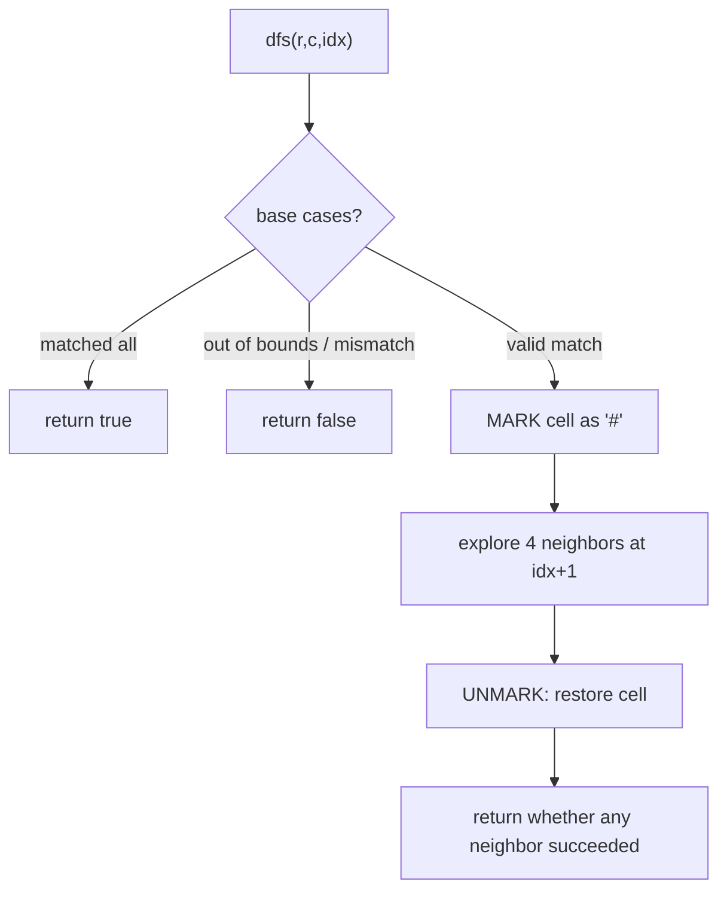

# Word Search on a Grid (DFS Backtracking) — Junior Level

> **One-line summary:** To decide whether a word exists in a 2D grid of letters by stepping between **adjacent** cells without reusing any cell, you start a **depth-first search (DFS)** from every cell whose letter matches the first character, and at each step you **mark** the current cell as visited, recurse into its four neighbors, then **unmark** (backtrack) when the branch fails — exploring every possible path while never standing on the same cell twice within one attempt.

---

## Table of Contents

1. [Introduction](#introduction)
2. [Prerequisites](#prerequisites)
3. [Glossary](#glossary)
4. [Core Concepts](#core-concepts)
5. [Big-O Summary](#big-o-summary)
6. [Real-World Analogies](#real-world-analogies)
7. [Pros & Cons](#pros--cons)
8. [Step-by-Step Walkthrough](#step-by-step-walkthrough)
9. [Code Examples](#code-examples)
10. [Coding Patterns](#coding-patterns)
11. [Error Handling](#error-handling)
12. [Performance Tips](#performance-tips)
13. [Best Practices](#best-practices)
14. [Edge Cases & Pitfalls](#edge-cases--pitfalls)
15. [Common Mistakes](#common-mistakes)
16. [Cheat Sheet](#cheat-sheet)
17. [Visual Animation](#visual-animation)
18. [Summary](#summary)
19. [Further Reading](#further-reading)

---

## Introduction

Imagine a `board` of letters like a word-search puzzle from a newspaper, and a target `word` such as `"CAT"`. The question is simple to state: *can you trace the word by moving from letter to letter, stepping only to a cell directly above, below, left, or right of where you are, and never standing on the same cell twice?* This is the classic **Word Search I** problem (LeetCode 79), and it is one of the cleanest possible introductions to **DFS with backtracking** on a grid.

The strategy has two halves that you will see over and over in grid problems:

1. **Try every starting point.** Any cell whose letter equals `word[0]` could be the start of a successful trace, so you launch a search from each such cell.
2. **Explore-then-undo (backtracking).** From the current cell you recurse into the four orthogonal neighbors, looking for `word[1]`, then `word[2]`, and so on. Before recursing you **mark** the current cell so the search cannot reuse it; if none of the neighbors lead to a full match you **unmark** it (restore it) so a *different* path is free to use that cell later.

That mark/unmark dance is the whole idea of backtracking: you tentatively commit to a cell, you explore deeper, and if the exploration dead-ends you take the commitment back as if it never happened. The grid is left exactly as you found it, ready for the next attempt.

This file uses **Word Search I** — "does the word exist, yes or no?" — as the core. Once you are comfortable here, [`middle.md`](./middle.md) extends the same template to **Word Search II** (LeetCode 212), where you search for *many* words at once using a **Trie** to prune the grid in a single sweep. But everything starts with the one-word DFS you will master below: choose a start, walk the four directions, mark on the way in, unmark on the way out.

A crucial caveat to lock in from minute one: the path must use **distinct cells**. The same letter value may appear in many cells, and you are allowed to use any of them — but never the *same physical cell* twice in one trace. That "no reuse" rule is exactly what the marking trick enforces, and it is the difference between a correct solution and one that happily walks back and forth between two `'A'` cells forever.

---

## Prerequisites

Before reading this file you should be comfortable with:

- **2D arrays / grids** — indexing a cell as `board[row][col]`, and the dimensions `M` rows by `N` columns. See sibling representation topics.
- **Recursion** — a function that calls itself, with a base case that stops the recursion and a recursive case that makes progress. (Foundational for all of `16-backtracking`.)
- **DFS (depth-first search)** — going as deep as possible down one branch before trying alternatives. (Covered in `11-graphs`.)
- **The four orthogonal directions** — up `(-1, 0)`, down `(+1, 0)`, left `(0, -1)`, right `(0, +1)`.
- **Boolean logic / short-circuit `||`** — "succeed if *any* neighbor succeeds".
- **Big-O notation** — `O(M·N·4^L)` where `L` is the word length.

Optional but helpful:

- A glance at **backtracking siblings** in `16-backtracking` (permutations, N-Queens) to see the same mark/unmark rhythm in a different setting.
- Familiarity with **strings and character comparison** (`word[index] == board[r][c]`).

---

## Glossary

| Term | Meaning |
|------|---------|
| **Grid / board** | A 2D array of single characters, `M` rows by `N` columns. `board[r][c]` is the letter at row `r`, column `c`. |
| **Cell** | A single position `(r, c)` in the grid. |
| **Adjacent / neighbor** | One of the four cells sharing an edge: up, down, left, right. **Diagonals do not count** in the classic problem. |
| **Path** | A sequence of cells `(r₀,c₀), (r₁,c₁), …` where each consecutive pair is adjacent and **no cell repeats**. |
| **DFS** | Depth-first search: explore one direction fully before trying the next. |
| **Backtracking** | DFS that *undoes* its choices on the way back up, so other branches can reuse the freed state. |
| **Mark / visited** | Temporarily flagging the current cell so the search cannot step on it again within the same path. |
| **In-place marking** | Overwriting the cell's own letter (e.g. with `'#'`) to mark it, instead of using a separate `visited` array. Restored on backtrack. |
| **`L` (word length)** | The number of characters in the target `word`; the maximum depth of the recursion. |
| **`M, N`** | Number of rows and columns of the grid. |
| **Branching factor** | The number of directions tried per cell — at most 4. |

---

## Core Concepts

### 1. The Grid and Adjacency

The board is an `M × N` array of characters. From a cell `(r, c)` the four orthogonal neighbors are:

```
(r-1, c)   up
(r+1, c)   down
(r, c-1)   left
(r, c+1)   right
```

A move is legal only if the neighbor is **in bounds** (`0 ≤ r < M` and `0 ≤ c < N`). Diagonal moves are **not** allowed in the standard problem. A "path" for the word is a chain of these legal moves whose letters spell the word in order — using each physical cell at most once.

### 2. DFS From Each Starting Cell

You do not know where the word begins, so you try every cell. For each cell `(r, c)` you call `dfs(r, c, 0)`, where the third argument `0` means "we are trying to match `word[0]` here". The DFS returns `true` if a full match can be completed starting from this cell at this character index.

```
for each cell (r, c):
    if dfs(r, c, 0):
        return true        # found the word somewhere
return false               # no starting cell worked
```

### 3. The DFS + Backtracking Template

This is the heart of the topic. Read it slowly:

```
dfs(r, c, index):
    if index == len(word):          # matched all characters
        return true
    if (r, c) out of bounds:        # stepped off the grid
        return false
    if board[r][c] != word[index]:  # letter does not match here
        return false

    # --- MARK: commit to this cell so we cannot reuse it ---
    saved = board[r][c]
    board[r][c] = '#'               # sentinel meaning "visited"

    # --- EXPLORE all four neighbors for the NEXT character ---
    found = dfs(r-1, c, index+1)
         or dfs(r+1, c, index+1)
         or dfs(r, c-1, index+1)
         or dfs(r, c+1, index+1)

    # --- UNMARK: backtrack, restore the cell for other paths ---
    board[r][c] = saved

    return found
```

Three base cases, then mark, explore, unmark. That structure never changes. Notice the order: we check the **failure** conditions first (out of bounds, mismatch), then the **success** condition is handled at the top (`index == len(word)`), and only a matching, in-bounds, unvisited cell proceeds to mark/explore/unmark.

### 4. Why We Match the Current Character Before Recursing

When `dfs(r, c, index)` runs, it is responsible for checking whether `board[r][c]` equals `word[index]`. If it does, we have matched one more character, so we recurse on the neighbors asking for `word[index+1]`. The base case `index == len(word)` fires when we have already matched *every* character — meaning the previous call matched the last one — so a fully matched word returns `true` before any bounds or letter check.

### 5. The In-Place Marking Trick

Instead of allocating a separate `M × N` boolean `visited` array, you can mark a cell by **overwriting its own letter** with a sentinel that can never appear in the word (commonly `'#'`). Because the cell now holds `'#'`, the line `board[r][c] != word[index]` will be `true` for any real letter, so the search refuses to step back onto it. On backtrack you write the **saved original letter** back. This saves memory and is a very common interview-favorite trick. It is safe precisely because each cell is restored before the call returns — the board is unchanged after the top-level call finishes. ([`professional.md`](./professional.md) proves this restoration invariant formally.)

### 6. Short-Circuit Success

The four recursive calls are joined by logical OR (`||`). As soon as one of them returns `true`, the rest are skipped and the chain reports success up the call stack. This early exit is what makes a *found* word return quickly instead of exploring the entire grid.

---

## Big-O Summary

Let `M` = rows, `N` = columns, `L` = length of the word.

| Operation | Time | Space | Notes |
|-----------|------|-------|-------|
| One DFS attempt from a start cell | **O(4^L)** | O(L) recursion | Up to 4 directions, depth `L`. |
| Trying all start cells (Word Search I) | **O(M·N·4^L)** | O(L) | One DFS per cell. |
| First-letter pre-scan | O(M·N) | O(1) | Skip cells that cannot start the word. |
| In-place marking | — | **O(1)** extra | No `visited` array needed. |
| Separate `visited` array | — | O(M·N) | Alternative to in-place marking. |

The headline number is **`O(M·N·4^L)`**: a DFS from each of `M·N` cells, each exploring a tree of branching factor 4 and depth `L`. The `4^L` is a loose upper bound — the first recursion has 4 choices but every deeper one has at most **3** (you never go back to the cell you came from), and many branches are cut instantly by the letter check, so real runs are far cheaper. The recursion depth, and therefore the call-stack space, is `O(L)`.

---

## Real-World Analogies

| Concept | Analogy |
|---------|---------|
| The grid | A printed word-search puzzle; each square holds one letter. |
| DFS path | Tracing the word with a pencil, square by square, only moving up/down/left/right. |
| Marking a cell | Putting your finger on the current square so you remember not to land on it again this trace. |
| Backtracking (unmark) | Lifting your finger when a trace dead-ends, freeing the square for a different attempt. |
| Trying every start | Scanning the whole puzzle for the word's first letter before committing to a trace. |
| Short-circuit OR | The instant you complete the word, you stop searching and circle it. |
| The `'#'` sentinel | Lightly crossing out a square while you walk through it, then erasing the cross when you back out. |

Where the analogy breaks: a human eyeballs likely directions, but the algorithm mechanically tries **all four** every time. It never gets bored or skips a direction — that exhaustiveness is what guarantees correctness.

---

## Pros & Cons

| Pros | Cons |
|------|------|
| Conceptually simple: choose a start, walk four directions, mark/unmark. | Worst case is exponential in word length, `O(M·N·4^L)`. |
| In-place marking needs **O(1)** extra space beyond the recursion stack. | Mutating the board is not thread-safe and surprises concurrent readers. |
| The same template extends directly to many-word search (Word Search II). | Deep recursion can risk stack overflow for very long words. |
| Short-circuits the moment the word is found. | Re-scans from scratch for each new word unless you switch to a Trie (see `middle.md`). |
| No graph/data-structure setup — works straight on the input array. | Easy to forget the unmark, which silently corrupts later attempts. |

**When to use:** a single (or a handful of) target word(s), a modest grid, and you want a quick existence check. The classic "does this word exist in the board?" interview question.

**When NOT to use:** matching a *large dictionary* of words against the grid — there you build a **Trie** and DFS the grid once (see [`middle.md`](./middle.md)); doing a separate Word Search I per dictionary word is far slower.

---

## Step-by-Step Walkthrough

Take this `3 × 4` board and the word `"ABCCED"`:

```
A B C E
S F C S
A D E E
```

Goal: trace `A → B → C → C → E → D` using adjacent, distinct cells.

**Start scan.** We look for `word[0] = 'A'`. There are two: `(0,0)` and `(2,0)`. Try `(0,0)` first.

**Match `A` at (0,0), index 0.** Letter matches. Mark `(0,0)` as `'#'`. Recurse for `word[1] = 'B'`.

```
# B C E
S F C S
A D E E
```

**Match `B` at (0,1), index 1.** Of the neighbors of `(0,0)`, the cell `(0,1)` holds `'B'`. Match. Mark it. Recurse for `'C'`.

```
# # C E
S F C S
A D E E
```

**Match `C` at (0,2), index 2.** Neighbor `(0,2)` holds `'C'`. Match. Mark. Recurse for the next `'C'`.

```
# # # E
S F C S
A D E E
```

**Match second `C` at (1,2), index 3.** From `(0,2)`, the down-neighbor `(1,2)` holds `'C'`. Match. Mark. Recurse for `'E'`.

```
# # # E
S F # S
A D E E
```

**Match `E` at (2,2), index 4.** From `(1,2)`, the down-neighbor `(2,2)` holds `'E'`. Match. Mark. Recurse for `'D'`.

```
# # # E
S F # S
A D # E
```

**Match `D` at (2,1), index 5.** From `(2,2)`, the left-neighbor `(2,1)` holds `'D'`. Match. Mark. Recurse for index 6.

**Base case `index == 6 == len(word)`.** All six characters matched. Return `true`. The trace was:

```
(0,0)A → (0,1)B → (0,2)C → (1,2)C → (2,2)E → (2,1)D
```

The `true` short-circuits all the way up the OR chain, and as each call returns it restores its cell, leaving the board exactly as it started. The word **exists**.

**A small dead-end for contrast.** Had we tried to match the second `C` by going *back* to `(0,2)`, it would already be `'#'`, so the letter check fails immediately — the no-reuse rule in action.

---

## Code Examples

### Example: Word Search I — Does the Word Exist?

These build the board above and return whether `"ABCCED"` exists. Each uses the in-place marking trick.

#### Go

```go
package main

import "fmt"

func exist(board [][]byte, word string) bool {
	rows := len(board)
	if rows == 0 {
		return false
	}
	cols := len(board[0])

	var dfs func(r, c, idx int) bool
	dfs = func(r, c, idx int) bool {
		if idx == len(word) {
			return true // matched every character
		}
		if r < 0 || r >= rows || c < 0 || c >= cols {
			return false // off the grid
		}
		if board[r][c] != word[idx] {
			return false // letter mismatch (or already visited '#')
		}

		saved := board[r][c]
		board[r][c] = '#' // MARK

		found := dfs(r-1, c, idx+1) ||
			dfs(r+1, c, idx+1) ||
			dfs(r, c-1, idx+1) ||
			dfs(r, c+1, idx+1)

		board[r][c] = saved // UNMARK (backtrack)
		return found
	}

	for r := 0; r < rows; r++ {
		for c := 0; c < cols; c++ {
			if dfs(r, c, 0) {
				return true
			}
		}
	}
	return false
}

func main() {
	board := [][]byte{
		[]byte("ABCE"),
		[]byte("SFCS"),
		[]byte("ADEE"),
	}
	fmt.Println(exist(board, "ABCCED")) // true
	fmt.Println(exist(board, "SEE"))    // true
	fmt.Println(exist(board, "ABCB"))   // false (would reuse the B cell)
}
```

#### Java

```java
public class WordSearch {
    static int rows, cols;

    static boolean exist(char[][] board, String word) {
        rows = board.length;
        if (rows == 0) return false;
        cols = board[0].length;
        for (int r = 0; r < rows; r++)
            for (int c = 0; c < cols; c++)
                if (dfs(board, word, r, c, 0)) return true;
        return false;
    }

    static boolean dfs(char[][] board, String word, int r, int c, int idx) {
        if (idx == word.length()) return true;          // matched all
        if (r < 0 || r >= rows || c < 0 || c >= cols) return false;
        if (board[r][c] != word.charAt(idx)) return false;

        char saved = board[r][c];
        board[r][c] = '#';                              // MARK

        boolean found = dfs(board, word, r - 1, c, idx + 1)
                     || dfs(board, word, r + 1, c, idx + 1)
                     || dfs(board, word, r, c - 1, idx + 1)
                     || dfs(board, word, r, c + 1, idx + 1);

        board[r][c] = saved;                            // UNMARK
        return found;
    }

    public static void main(String[] args) {
        char[][] board = {
            {'A', 'B', 'C', 'E'},
            {'S', 'F', 'C', 'S'},
            {'A', 'D', 'E', 'E'},
        };
        System.out.println(exist(board, "ABCCED")); // true
        System.out.println(exist(board, "SEE"));    // true
        System.out.println(exist(board, "ABCB"));   // false
    }
}
```

#### Python

```python
def exist(board, word):
    rows = len(board)
    if rows == 0:
        return False
    cols = len(board[0])

    def dfs(r, c, idx):
        if idx == len(word):
            return True                       # matched every character
        if r < 0 or r >= rows or c < 0 or c >= cols:
            return False                      # off the grid
        if board[r][c] != word[idx]:
            return False                      # mismatch or visited '#'

        saved = board[r][c]
        board[r][c] = "#"                     # MARK

        found = (dfs(r - 1, c, idx + 1) or
                 dfs(r + 1, c, idx + 1) or
                 dfs(r, c - 1, idx + 1) or
                 dfs(r, c + 1, idx + 1))

        board[r][c] = saved                   # UNMARK (backtrack)
        return found

    for r in range(rows):
        for c in range(cols):
            if dfs(r, c, 0):
                return True
    return False


if __name__ == "__main__":
    board = [
        list("ABCE"),
        list("SFCS"),
        list("ADEE"),
    ]
    print(exist(board, "ABCCED"))  # True
    print(exist(board, "SEE"))     # True
    print(exist(board, "ABCB"))    # False
```

**What it does:** scans for the first letter, runs the mark/explore/unmark DFS, and reports existence.
**Run:** `go run main.go` | `javac WordSearch.java && java WordSearch` | `python word_search.py`

---

## Coding Patterns

### Pattern 1: The Direction Array

Instead of writing four near-identical recursive calls, loop over a list of `(dr, dc)` offsets. This scales cleanly and reduces copy-paste bugs.

```python
DIRS = [(-1, 0), (1, 0), (0, -1), (0, 1)]

def dfs(r, c, idx):
    if idx == len(word):
        return True
    if not (0 <= r < rows and 0 <= c < cols) or board[r][c] != word[idx]:
        return False
    saved, board[r][c] = board[r][c], "#"
    for dr, dc in DIRS:
        if dfs(r + dr, c + dc, idx + 1):
            board[r][c] = saved
            return True
    board[r][c] = saved
    return False
```

### Pattern 2: First-Letter Pre-Filter

Only launch a DFS from cells that match `word[0]`. This skips obviously hopeless starts before any recursion.

```python
for r in range(rows):
    for c in range(cols):
        if board[r][c] == word[0] and dfs(r, c, 0):
            return True
```

### Pattern 3: Mark / Explore / Unmark (the universal backtracking shape)



This "mark → explore → unmark" rhythm is identical across all of `16-backtracking`; only the choices and the base case change.

---

## Error Handling

| Error | Cause | Fix |
|-------|-------|-----|
| Word "found" but path reuses a cell | Forgot to mark before recursing. | Mark the cell (set `'#'`) *before* the four recursive calls. |
| Later searches give wrong answers | Forgot to unmark on backtrack. | Always restore `board[r][c] = saved` after exploring. |
| `IndexError` / out-of-bounds panic | Recursed without a bounds check. | Check `0 ≤ r < M` and `0 ≤ c < N` at the top of `dfs`. |
| Empty word handled wrong | No guard for `len(word) == 0`. | `index == len(word)` returns `true` immediately for the empty word (define behavior explicitly). |
| Empty board crashes | `board[0]` on a zero-row board. | Guard `if len(board) == 0` before reading `cols`. |
| Sentinel collides with a real letter | Used a mark char that appears in the word. | Use a char that can never be in the word (`'#'`); or use a separate `visited` array. |

---

## Performance Tips

- **Pre-filter on the first letter.** Skip cells where `board[r][c] != word[0]` so you never start a doomed DFS.
- **Optional: reverse the word.** If `word[0]` is far more common in the grid than `word[L-1]`, searching for the reversed word starts from fewer cells. A quick frequency count of first vs last letter tells you which end to start from.
- **Bail on impossible words early.** If the multiset of letters in `word` is not a subset of the grid's letter counts, the word cannot exist — return `false` without any DFS.
- **Prefer in-place marking** over a `visited` array to cut memory and improve cache locality (one array instead of two).
- **Use a direction array**, but keep it a small constant slice — do not allocate it inside the hot recursion.

---

## Best Practices

- Write `dfs` as one small function with the three base cases at the top, then mark/explore/unmark — keep the shape recognizable.
- Always pair the mark with the unmark on the **same** call so the board is restored on every return path (including early `return true`).
- Treat the sentinel `'#'` as a named constant or documented choice; never silently reuse a letter that could be in the word.
- Decide explicitly what `exist(board, "")` should return and test it.
- Keep the start loop and the recursion separate and readable — most bugs hide in a missing unmark, not in the loop.
- Document that this counts/finds **paths over distinct cells**, never reusing a physical cell.

---

## Edge Cases & Pitfalls

- **Empty word** — by the base case `index == len(word)`, the empty word matches trivially at any cell; decide whether that is the behavior you want.
- **Single-cell word** — `word` of length 1 matches iff some cell equals that letter; the DFS handles this via the base case after one match.
- **Word longer than the number of cells** — impossible to place (needs more distinct cells than exist); a length check can short-circuit it.
- **Repeated letters in the word** — perfectly fine; you just need distinct *cells*, not distinct letters (e.g., the two `C`s in `"ABCCED"`).
- **Reusing a cell** — the classic trap; `"ABCB"` fails on the board above because completing it would step back onto the already-used `B` cell.
- **Diagonal expectation** — the standard problem forbids diagonals; do not add diagonal directions unless the problem says so.
- **Sentinel in the word** — if `'#'` (or whatever you choose) could appear in `word`, the marking trick breaks; pick a truly impossible sentinel or use a `visited` array.

---

## Common Mistakes

1. **Forgetting to unmark** — the single most common bug. Without restoring the cell, later starting points see a corrupted board and miss valid matches.
2. **Marking after recursing instead of before** — lets a path immediately step back onto the current cell.
3. **No bounds check** — recursing into `(r-1, c)` at the top row causes an out-of-range access.
4. **Checking success at the wrong place** — the `index == len(word)` test must come before the bounds/letter checks so a completed word returns `true`.
5. **Restarting per dictionary word** — for many words, run a Trie-based single sweep (see `middle.md`) instead of one Word Search I per word.
6. **Allowing diagonals by accident** — adding `(±1, ±1)` to the direction array changes the problem.
7. **Picking a sentinel that appears in the word** — corrupts the letter check; use a char that cannot occur.

---

## Cheat Sheet

| Question | Answer |
|----------|--------|
| What problem? | Does `word` exist in the grid via adjacent (4-dir), non-reusing cells? |
| Core technique | DFS from each matching start, with mark/explore/unmark backtracking. |
| Adjacency | Up, down, left, right only — no diagonals. |
| No-reuse rule | Mark current cell (`'#'`) before recursing; unmark after. |
| Marking memory | In-place sentinel = O(1) extra; or a `visited` array = O(M·N). |
| Success base case | `index == len(word)` → return `true`. |
| Failure base cases | Out of bounds, or `board[r][c] != word[index]`. |
| Time | `O(M·N·4^L)` (loose; really `≤ 3` per deeper step). |
| Space | `O(L)` recursion stack (plus the grid). |
| Many words? | Build a Trie and DFS once — see `middle.md`. |

Core template:

```
dfs(r, c, idx):
    if idx == len(word): return true
    if out of bounds or board[r][c] != word[idx]: return false
    saved = board[r][c]; board[r][c] = '#'        # MARK
    found = any( dfs(r+dr, c+dc, idx+1) for (dr,dc) in DIRS )
    board[r][c] = saved                            # UNMARK
    return found
# launch dfs(r, c, 0) from every cell; O(M·N·4^L)
```

---

## Visual Animation

> See [`animation.html`](./animation.html) for an interactive visualization.
>
> The animation demonstrates:
> - The current DFS **path** of cells lighting up as the word is traced.
> - The **matched prefix** of the word so far, character by character.
> - **Marking** a cell (turning it into `'#'`) and **unmarking** it on backtrack.
> - **Backtracking** when a neighbor mismatches, with the path retreating.
> - A **found word** highlighted in green once all characters match.
> - Play / Pause / Step controls over a preset grid and word.

---

## Summary

Word Search I asks whether a word can be traced through a grid via adjacent cells without reusing any cell. The answer is a textbook **DFS with backtracking**: start a search from every cell matching the first letter, and at each cell **mark** it (commonly by overwriting its letter with `'#'`), **explore** the four orthogonal neighbors for the next character, then **unmark** it so other paths may reuse the cell. Three base cases — matched all (success), out of bounds, letter mismatch — bracket the mark/explore/unmark core. The in-place marking trick gives O(1) extra space and is safe because every cell is restored before its call returns. The cost is `O(M·N·4^L)` in the worst case, though pruning by the first/current letter makes real runs far cheaper. Master this one-word template and you are ready for the multi-word, Trie-powered version in [`middle.md`](./middle.md).

---

## Further Reading

- LeetCode 79 — *Word Search* (the canonical Word Search I problem).
- LeetCode 212 — *Word Search II* (multi-word, Trie-based; see `middle.md`).
- Sibling topic `11-graphs` — DFS fundamentals on graphs and grids.
- Sibling `16-backtracking` topics — permutations, N-Queens, and other mark/explore/unmark patterns.
- *Introduction to Algorithms* (CLRS) — depth-first search and recursion.
- *Cracking the Coding Interview* — grid DFS and backtracking interview patterns.
