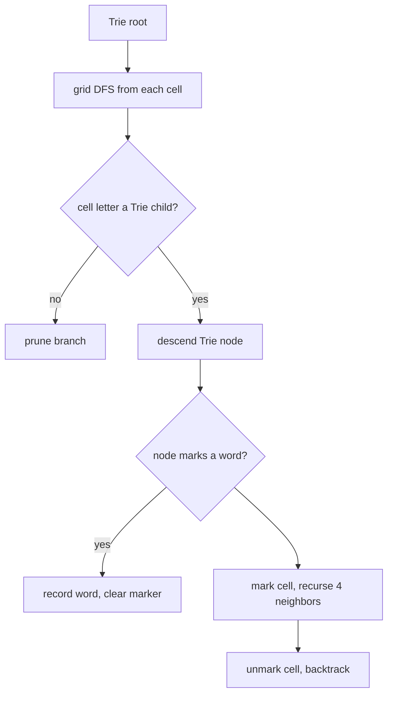

# Word Search on a Grid (DFS Backtracking + Trie) — Middle Level

> **Focus:** Why the in-place marking trick is safe and saves memory, how **Word Search II** flips the problem to "find *all* words from a dictionary" using a **Trie** to DFS the grid exactly once, how Trie-prefix pruning and on-the-fly node removal slash the search, Boggle-style scoring, and the precise complexity difference between matching one word and matching a whole dictionary.

---

## Table of Contents

1. [Introduction](#introduction)
2. [Deeper Concepts](#deeper-concepts)
3. [Comparison with Alternatives](#comparison-with-alternatives)
4. [Word Search II with a Trie](#word-search-ii-with-a-trie)
5. [Trie Pruning and Node Removal](#trie-pruning-and-node-removal)
6. [Boggle-Style Scoring](#boggle-style-scoring)
7. [Code Examples](#code-examples)
8. [Error Handling](#error-handling)
9. [Performance Analysis](#performance-analysis)
10. [Best Practices](#best-practices)
11. [Visual Animation](#visual-animation)
12. [Summary](#summary)

---

## Introduction

At junior level the message was a single template: DFS from each cell, **mark / explore / unmark**, and a word either exists or it does not. At middle level you ask the engineering questions that decide whether your solution is correct *and* scalable:

- Why is overwriting the cell's own letter (the **in-place marking** trick) safe, and when is a separate `visited` array preferable?
- The single-word DFS re-scans the grid for every target. If you have a **dictionary of thousands of words**, how do you avoid running Word Search I once per word?
- What data structure lets you walk the grid **once** while simultaneously tracking *every* dictionary word that shares the current prefix? (Answer: a **Trie**.)
- How does **prefix pruning** abort a DFS branch the instant no dictionary word continues that way — and how does **removing found words from the Trie** keep the search shrinking?
- What is the precise complexity gap between "match one word" (`O(M·N·4^L)`) and "match a whole dictionary in one sweep"?

These are exactly the questions that separate "I memorized the Word Search I template" from "I can search a 50,000-word dictionary against a board efficiently."

---

## Deeper Concepts

### The in-place marking trick, restated

Recall the single-word DFS marks the current cell so the path cannot reuse it. Two ways to mark:

1. **Separate `visited` array** — an `M × N` boolean grid; `visited[r][c] = true` on the way in, `false` on the way out. Costs `O(M·N)` extra space.
2. **In-place sentinel** — overwrite `board[r][c]` with a character that can never match (`'#'`), and restore the original on backtrack. Costs `O(1)` extra space.

Both encode the same "no reuse" invariant. The in-place version is the interview favorite because it removes the auxiliary array entirely.

### Why in-place marking is safe

The safety argument has two parts, both of which [`professional.md`](./professional.md) proves formally:

- **During a path**, the cell holds `'#'`, so the check `board[r][c] != word[index]` (or, for Word Search II, "no Trie child `'#'`") is `true` for any real letter — the search cannot step back onto a cell already on the current path. The "distinct cells" invariant is enforced.
- **After a path**, the cell is restored: every code path through `dfs` writes `board[r][c] = saved` before returning (including the early `return true`). So when a call returns, the board is **identical** to how it was on entry. The next starting cell — or a sibling recursive branch — sees a pristine board. This is the **restoration invariant**, and it is why a single mutable board can be reused across all `M·N` starts.

The one precondition: the sentinel must never equal a character that a real match needs. Since dictionary letters are typically `a–z`, a non-letter sentinel like `'#'` (or `'*'`, `0`) is safe.

### The crux: one word vs a whole dictionary

For a single word, Word Search I is fine: `O(M·N·4^L)`. But suppose you have `W` words. The naive approach runs Word Search I `W` times:

```
for each word in dictionary:
    if exist(board, word):
        results.append(word)
# cost: O(W · M·N · 4^Lmax)
```

This re-walks the grid `W` times and re-explores the same shared prefixes again and again. If 500 words all start with `"st…"`, every one of them re-traces the same `s → t` cells. **Word Search II** eliminates this redundancy: build a **Trie** of the whole dictionary, then DFS the grid **once**, and at every grid cell consult the Trie to see which words could still be spelled from here. Shared prefixes are explored a single time.

### What a Trie buys you

A **Trie** (prefix tree) stores all dictionary words so that any shared prefix is represented by a shared path of nodes. Each node has up to 26 children (one per letter) and a flag/word marking the end of a word. The grid DFS now carries a **Trie node** alongside the cell:

- At cell `(r, c)`, you only descend to a neighbor `(nr, nc)` if the current Trie node has a child for `board[nr][nc]`. If it does not, **no dictionary word** continues that way — prune the branch instantly.
- When the current Trie node is marked as a word-end, you have found a dictionary word — record it.

The Trie collapses the per-word redundancy into a single shared traversal, and its branching matches the dictionary's actual structure rather than the alphabet.

---

## Comparison with Alternatives

### Single-word DFS vs naive dictionary loop vs Trie sweep

| Approach | Single word | `W`-word dictionary | Good when |
|----------|-------------|---------------------|-----------|
| Word Search I per word | `O(M·N·4^L)` | `O(W · M·N · 4^Lmax)` | one or very few words |
| Trie + single grid DFS (Word Search II) | `O(M·N·4^L)` | `O(M·N·4^Lmax)` *(shared prefixes traversed once)* | many words / a dictionary |
| Hashing every grid path | astronomically large | infeasible | never |
| Build all grid paths, set-lookup | exponential | exponential | tiny grids only |

The key line: the Trie sweep removes the `W` factor that the naive loop pays. The grid is walked once; the dictionary's shared structure is exploited by the Trie. (The `4^Lmax` upper bound is still loose because both the no-revisit rule and the prefix pruning cut it dramatically in practice.)

### In-place marking vs `visited` array

| Aspect | In-place sentinel | Separate `visited` array |
|--------|-------------------|--------------------------|
| Extra space | `O(1)` | `O(M·N)` |
| Mutates the board | Yes (restored on backtrack) | No |
| Thread safety | Not safe to share board across threads | Safe if `visited` is per-thread |
| Clarity | Slightly subtle (restore discipline) | Very explicit |
| Restore each board if shared? | Must copy the board per worker | Share read-only board, per-worker `visited` |

For single-threaded interview code, in-place marking wins on memory. For parallel or shared-board production use, a per-worker `visited` array (or per-worker board copy) is cleaner — see [`senior.md`](./senior.md).

---

## Word Search II with a Trie

The Word Search II algorithm:

1. **Build a Trie** from all dictionary words. Each node holds child pointers and (at a word-end) the full word string.
2. **DFS the grid once.** Start a DFS from every cell whose letter is a child of the Trie root. Carry the current Trie node.
3. **At each cell**: descend the Trie to the child for this cell's letter. If absent, prune. If the node marks a word, add that word to the results (and clear the marker to avoid duplicates).
4. **Recurse** into the four neighbors with the child Trie node, using mark/unmark on the grid exactly as before.
5. **Collect** all marked words.



### Building the Trie node

A minimal Trie node for this problem stores its children and the word that ends at it (storing the whole word at the end-node means you do not have to reconstruct it from the path):

```text
TrieNode:
    children: map / array[26] of TrieNode
    word:     string ("" if no word ends here)
```

Storing the full `word` at the terminal node is the standard Word Search II optimization: when the DFS reaches a node with a non-empty `word`, it appends that string directly, with no path bookkeeping.

### Walking through the example

Take the board and dictionary from the code example below:

```
o a a n
e t a e
i h k r
i f l v
```

with `words = ["oath", "pea", "eat", "rain"]`. The Trie root has children `{o, p, e, r}`. The grid sweep:

- **`p`** is not on the board, so the DFS never even starts down the `pea` branch (no cell matches the root child `p`). `pea` is impossible.
- **`o`** at `(0,0)`: descend `o → a → t → h` following cells `(0,0) → (0,1) → (1,1) → (2,1)`. At depth 4 the node is terminal for `"oath"` — record it.
- **`e`** at `(1,3)`: descend `e → a → t` following `(1,3) → (1,2) → (1,1)`. Terminal for `"eat"` — record it.
- **`r`** at `(2,3)`: the only `r`, and none of its neighbors is `a`, so `rain` dies at depth 1.

Result: `["eat", "oath"]`. Notice the sweep touched only the live-prefix cells; the dead `p` and `r` branches were pruned at depth 0–1, never paying the `4^L` worst case.

---

## Trie Pruning and Node Removal

Two pruning techniques make Word Search II fast:

### 1. Prefix-existence pruning

Before stepping to a neighbor, check the current Trie node for a child matching the neighbor's letter. If there is none, **stop** — no dictionary word can possibly continue down that grid path. This is the single biggest speedup: the DFS only ever walks grid cells that spell a **live dictionary prefix**, so the search tree is shaped by the dictionary, not by `4^L`.

### 2. Removing found words (and dead leaves) from the Trie

After you record a word, clear its end-marker so the same word is not reported twice. Better still, **prune dead Trie leaves**: once a node has no children and no word, it can never lead to a result, so detaching it from its parent shrinks the Trie. As more words are found and more leaves pruned, later DFS branches hit dead ends sooner. This keeps the search **monotonically shrinking** and is what makes Word Search II practical on large dictionaries.

```text
after recording node.word:
    node.word = ""                 # avoid duplicate reports
if node has no children and no word:
    detach node from its parent    # prune dead leaf
```

Leaf pruning turns the Trie into a structure that actively forgets words it has already matched, so the more matches you find, the less work remains.

---

## Boggle-Style Scoring

**Boggle** is Word Search II with a twist: you score each found word by its length (longer words earn more points), and a single board admits many valid words. The same Trie sweep finds all dictionary words; scoring is a post-pass over the found set.

A common Boggle scoring table (word length → points):

| Word length | Points |
|-------------|--------|
| 3–4 | 1 |
| 5 | 2 |
| 6 | 3 |
| 7 | 5 |
| 8+ | 11 |

Two Boggle-specific notes:

- **Diagonal adjacency.** Classic Boggle allows all **8** neighbors (diagonals included), unlike the 4-direction LeetCode problem. The only change is the direction array — the Trie sweep is otherwise identical.
- **Minimum length.** Boggle ignores words shorter than 3; filter those out when scoring (or never insert them into the Trie).

The takeaway: Boggle reuses the exact Trie + grid-DFS machinery; only the direction set, a length filter, and a scoring map differ.

---

## Code Examples

### Word Search II — Trie + single grid DFS

This builds a Trie from the dictionary, DFS-sweeps the grid once with prefix pruning and end-marker clearing, and returns all found words.

#### Go

```go
package main

import (
	"fmt"
	"sort"
)

type TrieNode struct {
	children [26]*TrieNode
	word     string
}

func insert(root *TrieNode, w string) {
	node := root
	for i := 0; i < len(w); i++ {
		idx := w[i] - 'a'
		if node.children[idx] == nil {
			node.children[idx] = &TrieNode{}
		}
		node = node.children[idx]
	}
	node.word = w
}

func findWords(board [][]byte, words []string) []string {
	root := &TrieNode{}
	for _, w := range words {
		insert(root, w)
	}
	rows, cols := len(board), len(board[0])
	var found []string

	var dfs func(r, c int, node *TrieNode)
	dfs = func(r, c int, node *TrieNode) {
		if r < 0 || r >= rows || c < 0 || c >= cols {
			return
		}
		ch := board[r][c]
		if ch == '#' {
			return // already on the current path
		}
		next := node.children[ch-'a']
		if next == nil {
			return // PRUNE: no dictionary word continues this way
		}
		if next.word != "" {
			found = append(found, next.word)
			next.word = "" // avoid duplicate reports
		}
		board[r][c] = '#' // MARK
		dfs(r-1, c, next)
		dfs(r+1, c, next)
		dfs(r, c-1, next)
		dfs(r, c+1, next)
		board[r][c] = ch // UNMARK
	}

	for r := 0; r < rows; r++ {
		for c := 0; c < cols; c++ {
			dfs(r, c, root)
		}
	}
	sort.Strings(found)
	return found
}

func main() {
	board := [][]byte{
		[]byte("oaan"),
		[]byte("etae"),
		[]byte("ihkr"),
		[]byte("iflv"),
	}
	words := []string{"oath", "pea", "eat", "rain"}
	fmt.Println(findWords(board, words)) // [eat oath]
}
```

#### Java

```java
import java.util.*;

public class WordSearchII {
    static class TrieNode {
        TrieNode[] children = new TrieNode[26];
        String word = null;
    }

    static void insert(TrieNode root, String w) {
        TrieNode node = root;
        for (char ch : w.toCharArray()) {
            int idx = ch - 'a';
            if (node.children[idx] == null) node.children[idx] = new TrieNode();
            node = node.children[idx];
        }
        node.word = w;
    }

    static int rows, cols;

    public static List<String> findWords(char[][] board, String[] words) {
        TrieNode root = new TrieNode();
        for (String w : words) insert(root, w);
        rows = board.length;
        cols = board[0].length;
        List<String> found = new ArrayList<>();
        for (int r = 0; r < rows; r++)
            for (int c = 0; c < cols; c++)
                dfs(board, r, c, root, found);
        Collections.sort(found);
        return found;
    }

    static void dfs(char[][] board, int r, int c, TrieNode node, List<String> found) {
        if (r < 0 || r >= rows || c < 0 || c >= cols) return;
        char ch = board[r][c];
        if (ch == '#') return;
        TrieNode next = node.children[ch - 'a'];
        if (next == null) return;                   // PRUNE
        if (next.word != null) {
            found.add(next.word);
            next.word = null;                       // de-duplicate
        }
        board[r][c] = '#';                          // MARK
        dfs(board, r - 1, c, next, found);
        dfs(board, r + 1, c, next, found);
        dfs(board, r, c - 1, next, found);
        dfs(board, r, c + 1, next, found);
        board[r][c] = ch;                           // UNMARK
    }

    public static void main(String[] args) {
        char[][] board = {
            {'o', 'a', 'a', 'n'},
            {'e', 't', 'a', 'e'},
            {'i', 'h', 'k', 'r'},
            {'i', 'f', 'l', 'v'},
        };
        String[] words = {"oath", "pea", "eat", "rain"};
        System.out.println(findWords(board, words)); // [eat, oath]
    }
}
```

#### Python

```python
class TrieNode:
    __slots__ = ("children", "word")

    def __init__(self):
        self.children = {}
        self.word = None


def build_trie(words):
    root = TrieNode()
    for w in words:
        node = root
        for ch in w:
            node = node.children.setdefault(ch, TrieNode())
        node.word = w
    return root


def find_words(board, words):
    root = build_trie(words)
    rows, cols = len(board), len(board[0])
    found = []

    def dfs(r, c, node):
        if not (0 <= r < rows and 0 <= c < cols):
            return
        ch = board[r][c]
        if ch == "#":
            return
        nxt = node.children.get(ch)
        if nxt is None:
            return                              # PRUNE: dead prefix
        if nxt.word is not None:
            found.append(nxt.word)
            nxt.word = None                     # de-duplicate
        board[r][c] = "#"                       # MARK
        dfs(r - 1, c, nxt)
        dfs(r + 1, c, nxt)
        dfs(r, c - 1, nxt)
        dfs(r, c + 1, nxt)
        board[r][c] = ch                        # UNMARK

    for r in range(rows):
        for c in range(cols):
            dfs(r, c, root)
    return sorted(found)


if __name__ == "__main__":
    board = [
        list("oaan"),
        list("etae"),
        list("ihkr"),
        list("iflv"),
    ]
    words = ["oath", "pea", "eat", "rain"]
    print(find_words(board, words))  # ['eat', 'oath']
```

**What it does:** inserts all four words into a Trie, sweeps the `4×4` board once, prunes dead prefixes, and reports `["eat", "oath"]` — the two words that can be traced.
**Run:** `go run main.go` | `javac WordSearchII.java && java WordSearchII` | `python word_search_ii.py`

---

## Error Handling

| Scenario | What goes wrong | Correct approach |
|----------|-----------------|------------------|
| Same word reported twice | End-marker not cleared after recording. | Set `node.word = null/""` when you record it. |
| Sentinel matches a Trie child | Used a sentinel in `a–z`. | Use `'#'` (non-letter); the `ch == '#'` guard then prunes revisits. |
| Forgot to unmark | Cell left as `'#'` after the branch. | Restore `board[r][c] = ch` on *every* return path. |
| Crash on empty board / empty dict | `board[0]` or empty Trie. | Guard empty board and empty word list up front. |
| Counting words found ≠ unique words | Duplicate dictionary entries or double reports. | De-duplicate the dictionary and clear end-markers. |
| Out-of-bounds in 8-dir Boggle | Diagonal offsets unchecked. | Bounds-check every neighbor regardless of direction count. |
| Slow on huge dictionary | No leaf pruning; Trie never shrinks. | Detach dead leaves after recording words. |

---

## Performance Analysis

Let `M·N` be the grid size, `L` the max word length, `W` the dictionary size, and `K` the total characters across all words (Trie size).

| Step | Cost | Notes |
|------|------|-------|
| Build Trie | `O(K)` | One node per distinct prefix character. |
| Naive: Word Search I per word | `O(W · M·N · 4^Lmax)` | Re-walks grid `W` times; redundant. |
| Trie sweep (Word Search II) | `O(M·N · 4^Lmax)` worst case | Grid walked once; shared prefixes once. |
| Space (Trie) | `O(K)` | Plus `O(L)` recursion stack. |

| Dictionary size `W` | Naive loop (relative) | Trie sweep (relative) |
|---------------------|------------------------|------------------------|
| 1 | 1× | ~1× |
| 100 | 100× | ~1× (shared prefixes) |
| 10,000 | 10,000× | ~1× |

The decisive point: the naive loop's cost scales **linearly in `W`**, while the Trie sweep is essentially **independent of `W`** (it depends on the *grid* and the *combined prefix structure*, not the word count). For a single word, both are `O(M·N·4^L)` and the naive approach is simpler — so use Word Search I for one word and Word Search II for a dictionary. In practice the `4^Lmax` bound is wildly pessimistic: prefix pruning means the DFS only follows grid paths that spell live dictionary prefixes, and leaf pruning shrinks the Trie as words are found, so realistic runtimes are orders of magnitude below the bound.

The biggest constant-factor wins are: (1) an array-of-26 children instead of a hash map (faster child lookup, no hashing); (2) storing the full word at the end-node (no path reconstruction); (3) leaf pruning; and (4) starting DFS only from cells that are children of the root.

### Why the Trie sweep is independent of `W`

The intuition worth internalizing: the naive loop re-walks the grid once **per word**, so its cost has a `W` factor. The Trie sweep walks the grid once **total**, and the dictionary's contribution is folded into the *shape* of the Trie — words that share a prefix share a Trie path, so they share the grid traversal of that prefix. Concretely, 500 words starting with `"st"` cause the naive loop to re-trace the grid's `s → t` cells 500 times; the Trie sweep traces them once and only then branches. The word count `W` enters the Trie sweep only through the one-time build (`O(K)`) and never as a multiplier on the grid traversal. This is the single most important performance fact of the topic, and it is why a 50,000-word dictionary is no slower to sweep than a 5-word one (given the same combined prefix structure).

### A worked cost contrast

Suppose `M = N = 12`, `L_max = 8`, and `W = 1000`. Treating `4^8 ≈ 65{,}000` as the (loose) per-start search bound:

- **Naive loop:** `1000 × 144 × 65{,}000 ≈ 9.4 × 10⁹` operations — re-scanning all 144 start cells 1000 times.
- **Trie sweep:** `K + 144 × 65{,}000 ≈ 9.4 × 10⁶` operations (with `K ≈ 5000`) — one scan, plus a tiny build.

The ~1000× gap is exactly the `W` factor. And both figures are upper bounds: prefix pruning typically brings the real sweep cost down by another one to three orders of magnitude, because most grid paths spell no dictionary prefix and die at depth 1–2.

---

## Best Practices

- **One word → Word Search I; many words → Word Search II.** Do not loop Word Search I over a dictionary.
- **Carry the Trie node, not the prefix string.** Descending a child pointer is `O(1)`; rebuilding/looking up the prefix each step is wasteful.
- **Store the whole word at the end-node** so reporting is a single append.
- **Clear the end-marker on report** to avoid duplicates, and **prune dead leaves** to keep the Trie shrinking.
- **Use the in-place sentinel** for single-threaded code; switch to per-worker `visited`/board copies when parallelizing (see `senior.md`).
- **Prefer an array[26] of children** over a map when the alphabet is fixed lowercase — it is faster and cache-friendlier.
- **Bounds-check every neighbor**, especially when you switch to 8-direction Boggle.
- **Validate against a brute-force per-word Word Search I** on small inputs before trusting the Trie sweep.

### Decision quick-reference

| Situation | Use | Marking | Trie? |
|-----------|-----|---------|-------|
| One word, existence | Word Search I DFS | in-place `'#'` | no |
| A dictionary, single solve | Word Search II | in-place `'#'` | mutable Trie + leaf pruning |
| A dictionary, concurrent solves | Word Search II | per-worker `visited` | immutable Trie + per-solve set |
| Boggle | Word Search II, 8-dir | in-place `'#'` | Trie + length filter + scoring |
| Board must stay read-only | either | `visited` array | as above |

The two axes are **how many words** (one → no Trie; many → Trie) and **is the board/Trie shared** (no → in-place + mutable; yes → visited array + immutable). Pin down both before writing code; they determine the marking strategy and whether the Trie may be mutated.

---

## Visual Animation

> See [`animation.html`](./animation.html) for an interactive view.
>
> The middle-level relevant highlights:
> - The DFS **path** through the grid, with the **matched prefix** shown as the word builds up.
> - **Marking** (cell → `'#'`) and **unmarking** on backtrack.
> - **Backtracking** when the next cell's letter is not a live continuation.
> - A **found word** highlighted green when a full match completes.
> - The same template that, with a Trie node carried alongside, becomes Word Search II.

---

## Summary

The single-word DFS template carries straight into the multi-word problem, but for a **dictionary** you must not re-run Word Search I per word — that pays a `W` factor for re-walking the grid and re-tracing shared prefixes. **Word Search II** builds a **Trie** of the dictionary and DFS-sweeps the grid **once**, carrying a Trie node alongside the cell: it descends a child pointer per step, **prunes** the instant no dictionary word continues a grid path, records a word when it reaches an end-node, and **clears markers / prunes dead leaves** to avoid duplicates and shrink the search. The **in-place marking** trick (overwrite with `'#'`, restore on backtrack) is safe by the restoration invariant and costs O(1) extra space. Boggle is the same machinery with 8-direction adjacency and a length-based scoring pass. The complexity gap is the whole point: naive looping is `O(W·M·N·4^Lmax)`, the Trie sweep is `O(M·N·4^Lmax)` — independent of `W`. Master the Trie + grid-DFS pairing and you can match a 50,000-word dictionary against a board in one pass.
