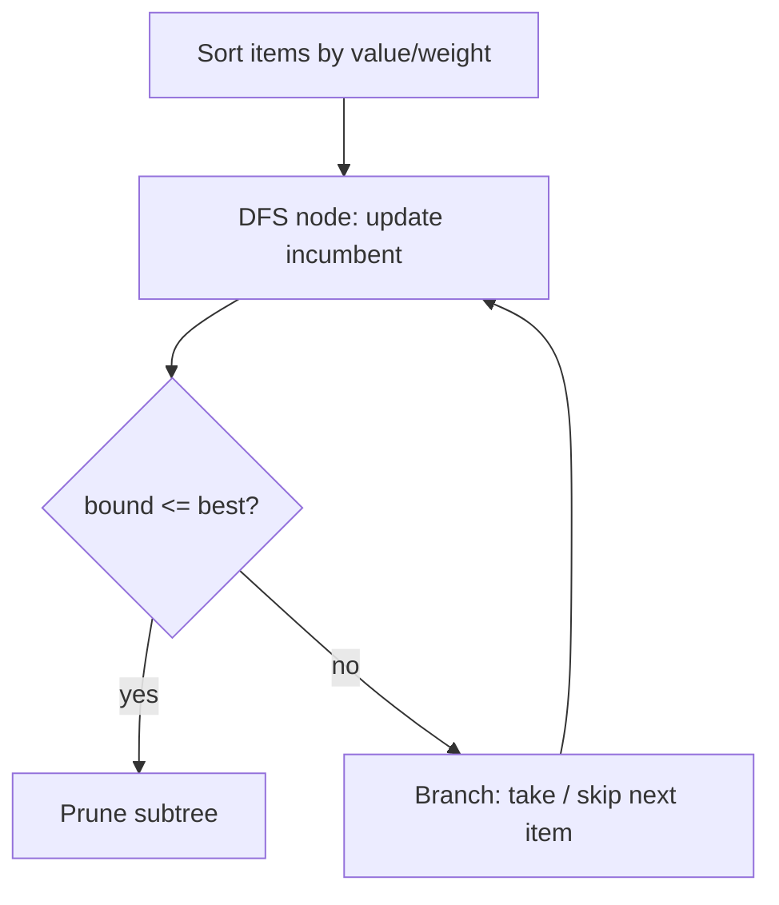

# Branch and Bound (B&B) for Optimization — Junior Level

> **One-line summary:** Branch and Bound explores the same tree of choices as backtracking, but for **optimization** problems: at every node it computes an **optimistic bound** (the best the subtree could *possibly* achieve) and **prunes** (throws away) any subtree whose bound cannot beat the **best solution found so far** (the *incumbent*). Good bounds cut away huge parts of the tree, so B&B finds a provably optimal answer far faster than brute force.

---

## Table of Contents

1. [Introduction](#introduction)
2. [Prerequisites](#prerequisites)
3. [Glossary](#glossary)
4. [Core Concepts](#core-concepts)
5. [Big-O Summary](#big-o-summary)
6. [Real-World Analogies](#real-world-analogies)
7. [Pros & Cons](#pros--cons)
8. [Step-by-Step Walkthrough](#step-by-step-walkthrough)
9. [Code Examples](#code-examples)
10. [Coding Patterns](#coding-patterns)
11. [Error Handling](#error-handling)
12. [Performance Tips](#performance-tips)
13. [Best Practices](#best-practices)
14. [Edge Cases & Pitfalls](#edge-cases--pitfalls)
15. [Common Mistakes](#common-mistakes)
16. [Cheat Sheet](#cheat-sheet)
17. [Visual Animation](#visual-animation)
18. [Summary](#summary)
19. [Further Reading](#further-reading)

---

## Introduction

Imagine a thief standing in front of a vault. There are `n` items, each with a **weight** and a **value**, and the thief's bag can hold at most `W` kilograms. Each item is either taken whole or left behind — you cannot take half a gold bar. The thief wants the **most valuable** combination that still fits. This is the famous **0/1 knapsack problem**, and it is the running example for this whole file.

The brute-force answer is to try every subset of items: take or skip item 0, then take or skip item 1, and so on. With `n` items that is `2^n` subsets — for `n = 50` that is over a *quadrillion* combinations. Most of those subsets are obviously terrible (they overflow the bag, or they leave out the best items). We would love to **stop exploring** the moment we can prove a whole branch is hopeless.

That is exactly what **Branch and Bound** does. It is a refinement of [backtracking](../01-introduction) (sibling topics in this `16-backtracking` section) specialized for **optimization** — problems where you want the maximum or minimum of something, not just *any* valid answer.

> **Backtracking asks:** "Is there a valid arrangement?" (feasibility / enumeration).
> **Branch and Bound asks:** "What is the *best* valid arrangement?" (optimization with pruning by a bound).

The three words in the name describe the whole algorithm:

- **Branch** — split the problem into smaller subproblems (e.g., "solutions that *include* item `i`" vs "solutions that *exclude* item `i`"). This builds a search tree.
- **Bound** — at each node, quickly compute an **optimistic estimate** of the best value reachable below it. For a maximization problem the bound must be an **upper bound** (never an *underestimate* of what is possible).
- **Prune** — if a node's optimistic bound is **no better** than the best complete solution we have already found (the **incumbent**), the entire subtree below that node is discarded. It cannot possibly contain a better answer.

The magic is in the bound. A *good* (tight) bound prunes aggressively and shrinks an exponential tree to something you can actually finish; a *weak* bound prunes nothing and degenerates into brute force. Designing the bound is the art of B&B, and the rest of this file teaches you how.

---

## Prerequisites

Before reading this file you should be comfortable with:

- **Recursion and backtracking** — building a solution one decision at a time and undoing it. See the earlier topics in this `16-backtracking` section, especially `01-introduction` and `02-subsets-combinations`.
- **The 0/1 knapsack problem** — items with weight and value, a capacity `W`, take-or-leave each item. (The dynamic-programming solution lives in `12-dynamic-programming`; here we attack it with B&B instead.)
- **Big-O notation** — `O(2^n)`, `O(n log n)`, and what "exponential but pruned" means in practice.
- **Sorting** — we will sort items by value-to-weight ratio to build a good bound.
- **Priority queues / heaps** — for the *best-first* search strategy (covered fully in `10-heaps`).

Optional but helpful:

- A glance at **greedy algorithms** (`14-greedy-algorithms`) — the fractional-knapsack greedy *is* our bounding function.
- Familiarity with **trees** — B&B explores a binary decision tree.

---

## Glossary

| Term | Meaning |
|------|---------|
| **Optimization problem** | Find the solution with the maximum (or minimum) objective value, subject to constraints. |
| **Feasible solution** | An assignment of all decisions that satisfies every constraint (e.g., total weight `≤ W`). |
| **Objective / cost** | The number being maximized (value) or minimized (cost/distance). |
| **Search tree** | The tree of partial decisions; the root is "no decisions made", leaves are complete solutions. |
| **Node / subproblem** | A partial decision (e.g., "item 0 taken, item 1 skipped, items 2..n still undecided"). |
| **Branch** | Splitting a node into child subproblems (take vs skip the next item). |
| **Bound** | An optimistic estimate of the best objective achievable in a node's subtree. For max problems, an **upper** bound. |
| **Incumbent** | The best **complete, feasible** solution found so far. Its value is the *current best*. |
| **Prune** | Discard a node (and its whole subtree) because its bound proves it cannot beat the incumbent. |
| **Relaxation** | An easier version of the problem (e.g., allow fractional items) whose optimum is the bound. |
| **Admissible / optimistic bound** | A bound guaranteed never to be *worse* than the true subtree optimum, so pruning is safe. |

---

## Core Concepts

### 1. Backtracking vs Branch and Bound

Pure **backtracking** explores the decision tree and abandons a branch only when it becomes **infeasible** (a constraint is violated — e.g., the bag overflows). It is perfect for "find any/all valid configurations" (N-Queens, Sudoku, subsets).

**Branch and Bound** adds a second, more powerful reason to abandon a branch: the branch is **feasible but cannot possibly be optimal**. Even if every item still fits, if the *best case* for this branch is worse than a solution we already have, we drop it. This is what makes B&B an *optimization* tool.

```
Backtracking prunes when:   constraint violated        (infeasible)
B&B also prunes when:       bound ≤ incumbent           (cannot beat best-so-far)
```

### 2. The Search Tree (Branching)

For 0/1 knapsack, the natural tree is **binary**. At depth `i` we decide item `i`:

```
                 (root: nothing decided)
                /                        \
        take item 0                  skip item 0
        /         \                  /         \
   take 1      skip 1           take 1      skip 1
   ...           ...             ...          ...
```

Each leaf is a complete decision for all `n` items. There are `2^n` leaves — the same tree brute force would walk. B&B's job is to never *reach* most of them.

### 3. The Bound (Optimistic Estimate)

At a node, some items are decided and the rest are free. We need a fast, **optimistic** answer to: *"If I play the remaining items as well as conceivably possible, what is the most value I could end with?"*

For knapsack the classic bound is the **fractional (greedy) relaxation**: pretend you are allowed to take **fractions** of the remaining items. Sort remaining items by **value/weight ratio** (most valuable per kilo first), greedily fill the bag, and take a fraction of the last item that overflows. The fractional optimum is **always ≥** the true 0/1 optimum (you can only do *worse* when forced to take whole items), so it is a valid **upper bound**.

```
bound(node) = value_so_far
            + (greedily packed whole remaining items)
            + (fraction of the next item that fits)   ← the "optimistic" part
```

### 4. The Incumbent and Pruning

The **incumbent** is the best *complete, feasible* solution found so far; call its value `best`. The rule is one line:

```
if bound(node) <= best:   prune this node (skip its entire subtree)
```

Why is this safe? Because `bound(node)` is the **most** the subtree could ever yield. If even that optimistic best is `≤ best`, nothing below can improve on what we already hold. We discard millions of leaves without ever visiting them.

Whenever we reach a complete feasible solution better than `best`, we **update the incumbent**. A better incumbent makes the pruning test stricter, which prunes even more — the search accelerates as it goes.

### 5. Search Strategy: Which Node First?

The tree can be explored in different orders, and the order matters because a good incumbent found *early* prunes more:

- **Depth-First B&B (DFS)** — recurse down one branch fully before backtracking. Uses `O(n)` memory (just the recursion stack). The standard, memory-cheap default.
- **Best-First B&B** — keep a **priority queue** of live nodes ordered by **bound** (most promising first). Expand the node with the best bound. Tends to reach the optimum with fewer node expansions, but the queue can grow huge (memory blow-up — see `senior.md`).
- **Least-Cost** — the minimization-flavored name for best-first (expand the node with the smallest lower bound).

For learning, we use **DFS B&B** below: it is short, uses little memory, and shows the bound/prune logic clearly.

---

## Big-O Summary

| Aspect | Cost | Notes |
|--------|------|-------|
| Worst-case time | **O(2^n)** | If the bound never prunes, B&B = brute force. |
| Typical time (good bound) | Far below `2^n` | Pruning removes most subtrees; no general polynomial guarantee. |
| Computing the fractional bound at a node | O(n) or O(log n) | O(n) scan of remaining items; faster with prefix sums. |
| Sorting items by ratio (once) | O(n log n) | Done a single time before the search. |
| DFS B&B memory | **O(n)** | Just the recursion stack / current path. |
| Best-first B&B memory | **O(number of live nodes)** | Can be exponential — the priority queue may explode. |

The headline: B&B has the **same exponential worst case** as brute force, but with a good bound it is *dramatically* faster in practice. There is no polynomial guarantee because knapsack and TSP are NP-hard (see `15-np-hard` siblings).

---

## Real-World Analogies

| Concept | Analogy |
|---------|---------|
| Incumbent | The best job offer you currently hold in hand. You will not accept anything worse. |
| Bound | A recruiter says "this company *at most* pays $X." If `X` ≤ your current offer, you do not even interview. |
| Pruning | Skipping the entire interview process for a company that cannot beat your best offer. |
| Branching | Each interview round splits into "advance" or "decline" — a tree of paths. |
| Optimistic bound | Always assume the *best possible* outcome of an unexplored path; if even that loses, drop it. |
| Best-first search | Interview at the most promising companies first, because a great offer early lets you reject more. |

Where the analogy breaks: a recruiter's "at most" might be a lie, but a B&B bound must be a **provable** over-estimate (for maximization). If the bound ever *underestimates* the true best, B&B can prune the actual optimum and return a wrong answer.

---

## Pros & Cons

| Pros | Cons |
|------|------|
| Returns a **provably optimal** answer (unlike a greedy heuristic). | Worst-case still **exponential** — no polynomial guarantee for NP-hard problems. |
| Often orders of magnitude faster than brute force, thanks to pruning. | Performance depends entirely on **bound quality**; a weak bound = brute force. |
| Works for many problems: knapsack, TSP, assignment, scheduling. | Best-first variant can blow up memory (huge priority queue). |
| Can stop early and return the **best-so-far** (anytime behavior — see senior). | Designing a tight, *admissible* bound is non-trivial and problem-specific. |
| Conceptually simple: branch, bound, prune, repeat. | Computing the bound at every node has overhead; a too-expensive bound can slow things down. |

**When to use:** small-to-medium NP-hard optimization (a few dozen items/cities), when you need the *exact* optimum and a good optimistic bound exists.

**When NOT to use:** when a fast approximate answer is acceptable (use a greedy/heuristic), when the problem has efficient DP (small `W` knapsack → use DP), or when `n` is so large that even pruned search is hopeless (use heuristics / LP solvers).

---

## Step-by-Step Walkthrough

Take this tiny 0/1 knapsack instance with capacity **`W = 10`**:

```
item:    0     1     2     3
value:  10    10    12    18
weight:  2     4     6     9
ratio:  5.0   2.5   2.0   2.0     (value / weight)
```

**Step 0 — Sort by ratio (descending).** Already sorted: item 0 (5.0), 1 (2.5), 2 (2.0), 3 (2.0). The greedy bound assumes we add remaining items in *this* order.

**Step 1 — Root bound.** Nothing taken yet, capacity 10. Greedily fill: take item 0 (w 2, v 10, cap left 8), item 1 (w 4, v 10, cap left 4), then item 2 needs 6 but only 4 fits → take fraction `4/6` of its value `12` = 8. Bound = `10 + 10 + 8 = 28`. Incumbent `best = 0` (or `−∞`).

**Step 2 — Branch on item 0.**

*Take item 0:* value 10, weight 2, cap left 8. Bound stays 28 (the fractional plan already took item 0). `28 > best` → keep exploring.

**Step 3 — Branch on item 1 (item 0 taken).**

*Take item 1:* value 20, weight 6, cap left 4. Now branch on item 2.

*Take item 2:* weight 6 > cap 4 → **infeasible**, prune (backtracking-style).
*Skip item 2:* branch on item 3. Item 3 weight 9 > cap 4 → infeasible to take; skip it. Reached a leaf: items {0,1}, value **20**, weight 6. Update **incumbent best = 20**.

**Step 4 — Back up and try "skip item 1" (item 0 taken).**

Value 10, weight 2, cap left 8. Compute bound: take item 2 (w6,v12 → cap 2), fraction of item 3 (`2/9 · 18 = 4`). Bound = `10 + 12 + 4 = 26`. `26 > best(20)` → keep going.

*Take item 2:* value 22, weight 8, cap left 2. Item 3 weight 9 > 2 → can't take; leaf value **22 > 20** → **incumbent best = 22**.

**Step 5 — The "skip item 0" branch.**

Bound: greedily fill from items {1,2,3} into cap 10 → item 1 (w4,v10,cap6), item 2 (w6,v12,cap0) = 22, no room for more. Bound = `22`. Now the rule: `bound(22) <= best(22)` → **prune the entire skip-item-0 subtree!** We never explore any of it.

**Result:** optimum is **value 22** (items {0, 2}), and B&B proved it while skipping a whole half of the tree. That last prune — `bound ≤ best` — is the heart of branch and bound.

---

## Code Examples

### Example: 0/1 Knapsack via DFS Branch and Bound

The program sorts items by value/weight ratio, runs a depth-first search, computes the fractional bound at each node, and prunes whenever `bound ≤ best`.

#### Go

```go
package main

import (
	"fmt"
	"sort"
)

type Item struct {
	value, weight int
}

// fractional (greedy) upper bound for the subtree at item index `idx`,
// given current accumulated value/weight and remaining capacity.
func bound(items []Item, idx, curValue, curWeight, W int) float64 {
	if curWeight >= W {
		return float64(curValue)
	}
	b := float64(curValue)
	totW := curWeight
	for i := idx; i < len(items); i++ {
		if totW+items[i].weight <= W {
			totW += items[i].weight
			b += float64(items[i].value)
		} else {
			remain := W - totW
			b += float64(items[i].value) * float64(remain) / float64(items[i].weight)
			break // bag full after a fractional take
		}
	}
	return b
}

var best int

func dfs(items []Item, idx, curValue, curWeight, W int) {
	if curValue > best {
		best = curValue // update incumbent
	}
	if idx == len(items) {
		return
	}
	// PRUNE: optimistic bound cannot beat the incumbent
	if bound(items, idx, curValue, curWeight, W) <= float64(best) {
		return
	}
	// branch 1: take item idx (if it fits)
	if curWeight+items[idx].weight <= W {
		dfs(items, idx+1, curValue+items[idx].value, curWeight+items[idx].weight, W)
	}
	// branch 2: skip item idx
	dfs(items, idx+1, curValue, curWeight, W)
}

func main() {
	items := []Item{{10, 2}, {10, 4}, {12, 6}, {18, 9}}
	W := 10
	// sort by value/weight ratio, descending (key to a tight bound)
	sort.Slice(items, func(a, b int) bool {
		return items[a].value*items[b].weight > items[b].value*items[a].weight
	})
	best = 0
	dfs(items, 0, 0, 0, W)
	fmt.Println("optimal value =", best) // 22
}
```

#### Java

```java
import java.util.Arrays;

public class KnapsackBnB {
    static int best;

    record Item(int value, int weight) {}

    static double bound(Item[] items, int idx, int curValue, int curWeight, int W) {
        if (curWeight >= W) return curValue;
        double b = curValue;
        int totW = curWeight;
        for (int i = idx; i < items.length; i++) {
            if (totW + items[i].weight() <= W) {
                totW += items[i].weight();
                b += items[i].value();
            } else {
                int remain = W - totW;
                b += (double) items[i].value() * remain / items[i].weight();
                break;
            }
        }
        return b;
    }

    static void dfs(Item[] items, int idx, int curValue, int curWeight, int W) {
        if (curValue > best) best = curValue;          // update incumbent
        if (idx == items.length) return;
        if (bound(items, idx, curValue, curWeight, W) <= best) return; // PRUNE
        if (curWeight + items[idx].weight() <= W) {    // take
            dfs(items, idx + 1, curValue + items[idx].value(),
                curWeight + items[idx].weight(), W);
        }
        dfs(items, idx + 1, curValue, curWeight, W);   // skip
    }

    public static void main(String[] args) {
        Item[] items = { new Item(10, 2), new Item(10, 4),
                         new Item(12, 6), new Item(18, 9) };
        int W = 10;
        Arrays.sort(items, (a, b) ->
            Double.compare((double) b.value() / b.weight(),
                           (double) a.value() / a.weight()));
        best = 0;
        dfs(items, 0, 0, 0, W);
        System.out.println("optimal value = " + best); // 22
    }
}
```

#### Python

```python
best = 0


def bound(items, idx, cur_value, cur_weight, W):
    if cur_weight >= W:
        return float(cur_value)
    b = float(cur_value)
    tot_w = cur_weight
    for i in range(idx, len(items)):
        v, w = items[i]
        if tot_w + w <= W:
            tot_w += w
            b += v
        else:
            remain = W - tot_w
            b += v * remain / w          # fractional take
            break
    return b


def dfs(items, idx, cur_value, cur_weight, W):
    global best
    if cur_value > best:
        best = cur_value                 # update incumbent
    if idx == len(items):
        return
    if bound(items, idx, cur_value, cur_weight, W) <= best:
        return                           # PRUNE
    v, w = items[idx]
    if cur_weight + w <= W:              # take
        dfs(items, idx + 1, cur_value + v, cur_weight + w, W)
    dfs(items, idx + 1, cur_value, cur_weight, W)  # skip


if __name__ == "__main__":
    items = [(10, 2), (10, 4), (12, 6), (18, 9)]  # (value, weight)
    W = 10
    items.sort(key=lambda it: it[0] / it[1], reverse=True)  # ratio desc
    best = 0
    dfs(items, 0, 0, 0, W)
    print("optimal value =", best)  # 22
```

**What it does:** sorts items by ratio, then DFS-branches take/skip on each item, pruning whenever the fractional bound cannot beat the incumbent `best`.
**Run:** `go run main.go` | `javac KnapsackBnB.java && java KnapsackBnB` | `python knapsack.py`

---

## Coding Patterns

### Pattern 1: Brute-Force Oracle (test against this)

**Intent:** Before trusting B&B, compute the optimum the slow, obvious way and check they agree on small inputs.

```python
def knapsack_bruteforce(items, W):
    n = len(items)
    best = 0
    for mask in range(1 << n):
        tot_v = tot_w = 0
        for i in range(n):
            if mask & (1 << i):
                tot_v += items[i][0]
                tot_w += items[i][1]
        if tot_w <= W:
            best = max(best, tot_v)
    return best
```

This is `O(2^n · n)` — far too slow for large `n` but a perfect correctness oracle. B&B must return the same optimum.

### Pattern 2: Sort by Ratio Before Searching

**Intent:** The fractional bound is only tight if remaining items are considered in **value/weight order**. Always sort items by ratio descending *once* before the search; never re-sort inside nodes.

### Pattern 3: Update Incumbent at Every Node

**Intent:** Do not wait for a leaf — every node represents a complete-so-far feasible packing, so `if curValue > best: best = curValue` keeps the incumbent as tight as possible, which prunes more.



---

## Error Handling

| Error | Cause | Fix |
|-------|-------|-----|
| Wrong (too small) optimum | Bound **underestimates** the true best (not admissible) → real optimum pruned. | Make the bound a genuine *over*-estimate for max problems. |
| No pruning, runs forever | Forgot to sort by ratio, so the fractional bound is loose. | Sort items by value/weight descending before searching. |
| Off-by-one / missing branch | Forgot the "skip" branch or recursed past `n`. | Always branch *both* take and skip; stop at `idx == n`. |
| Infeasible take counted | Took an item that overflows capacity. | Guard the take branch with `curWeight + w <= W`. |
| Float comparison flakiness | Comparing `bound` (float) to `best` (int) with `==`. | Use `<=` and integers for the incumbent; only the bound is float. |
| Integer overflow (Java/Go) | Summed values exceed `int`. | Use 64-bit (`long` / `int64`) for value/weight totals. |

---

## Performance Tips

- **Sort by value/weight ratio once.** This single step turns a useless bound into a tight one. It is the most important optimization in knapsack B&B.
- **Prune before branching, not after.** Test `bound ≤ best` at node entry so you never expand a hopeless node.
- **Compute the bound cheaply.** A linear scan is fine for teaching; with prefix sums of value and weight you can binary-search the fractional cutoff in `O(log n)`.
- **Find a good incumbent early.** Run a quick greedy first to seed `best` with a real solution; pruning then bites from step one.
- **Explore the promising branch first.** For knapsack, try "take" before "skip" so high-value packings (and thus a strong incumbent) appear early.

---

## Best Practices

- Always validate B&B against the brute-force oracle (Pattern 1) on random small instances before trusting it.
- Keep the bound **admissible**: for maximization it must never be *below* the true subtree optimum, or you may prune the real answer.
- Separate the three concerns — *branching*, *bounding*, *pruning* — into small functions you can test independently.
- State clearly whether you are maximizing (upper bound, prune when `bound ≤ best`) or minimizing (lower bound, prune when `bound ≥ best`).
- Seed the incumbent with a greedy solution so pruning starts immediately.

---

## Edge Cases & Pitfalls

- **Empty item set or `W = 0`** — optimum is 0; the search returns immediately.
- **A single item heavier than `W`** — it never fits; the "take" branch is always skipped.
- **All items fit** — the optimum is simply "take everything"; the bound at the root already equals the answer.
- **Ties in ratio** — fine; the bound is still valid, only the branch order changes.
- **Bound equals incumbent exactly** — prune it (`bound ≤ best`): an equal bound cannot *improve* the answer, so exploring is wasted work.
- **Non-admissible bound** — the single most dangerous bug: an optimistic estimate that is sometimes *too low* will silently prune the optimum and return a wrong (smaller) value.

---

## Common Mistakes

1. **Using a bound that can underestimate.** For maximization the bound must be an *upper* bound; if it ever dips below the true best, B&B prunes the optimum.
2. **Forgetting to sort by ratio.** The fractional bound becomes loose and prunes nothing — B&B collapses to brute force.
3. **Pruning with `<` instead of `<=`.** Using `bound < best` wastes work re-exploring branches that can only tie; `bound <= best` prunes those too. (Both are *correct*, but `<=` is faster.)
4. **Updating the incumbent only at leaves.** Update at every node; an earlier, tighter incumbent prunes more.
5. **Confusing B&B with backtracking.** Backtracking prunes only on *infeasibility*; B&B also prunes on *the bound*. Dropping the bound test loses all the speed.
6. **Mixing up max and min logic.** Minimization uses a *lower* bound and prunes when `bound ≥ best`. Copy-pasting maximization logic into a min problem inverts the pruning and breaks it.
7. **An expensive bound.** A bound that costs `O(n²)` per node can be slower overall than a weaker `O(n)` bound that prunes almost as well. Balance tightness vs cost.

---

## Cheat Sheet

| Question | Tool / Rule |
|----------|-------------|
| What is B&B for? | Optimization (max/min) with provably optimal results. |
| Branch | Split into subproblems (take / skip the next item). |
| Bound (max problem) | Optimistic **upper** bound = fractional/greedy relaxation. |
| Bound (min problem) | Optimistic **lower** bound = relaxed minimum. |
| Prune rule (max) | `if bound(node) <= best: skip subtree`. |
| Prune rule (min) | `if bound(node) >= best: skip subtree`. |
| Incumbent | Best complete feasible solution found so far (`best`). |
| Knapsack bound | Sort by value/weight, greedily fill, add fraction of last item. |
| Memory: DFS B&B | `O(n)` (recursion stack). |
| Memory: best-first B&B | `O(live nodes)` — can explode. |
| Worst case | `O(2^n)` — same as brute force if bound never prunes. |

Core algorithm (maximization, DFS):

```
dfs(idx, value, weight):
    best = max(best, value)              # update incumbent
    if idx == n: return
    if bound(idx, value, weight) <= best: return   # PRUNE
    if weight + w[idx] <= W:             # branch: take
        dfs(idx+1, value+v[idx], weight+w[idx])
    dfs(idx+1, value, weight)            # branch: skip
```

---

## Visual Animation

> See [`animation.html`](./animation.html) for an interactive visualization.
>
> The animation demonstrates:
> - The 0/1 knapsack **search tree** growing node by node (take vs skip each item)
> - Each node's **fractional bound** displayed next to the running **incumbent (`best`)**
> - Branches that are **taken** vs **skipped**, and infeasible takes marked
> - **Pruned subtrees crossed out** the instant `bound ≤ best`
> - Step / Run / Reset controls to watch the incumbent tighten and pruning kick in

---

## Summary

Branch and Bound is backtracking upgraded for **optimization**. It branches the problem into a tree of decisions, computes an **optimistic bound** at each node (an *upper* bound for maximization, via a relaxation such as the fractional-knapsack greedy), and **prunes** any subtree whose bound cannot beat the **incumbent** — the best complete solution found so far. Because the bound is a provable over-estimate, pruning never discards the true optimum, so B&B returns a *provably optimal* answer. Its speed lives or dies by the bound: a tight bound prunes most of the exponential tree, while a weak bound degenerates into brute force. Master the four moving parts — branch, bound, incumbent, prune — on the 0/1 knapsack example, and you have the template that also conquers TSP, assignment, and scheduling.

---

## Further Reading

- *Introduction to Algorithms* (CLRS) — NP-completeness and the knapsack problem.
- Sibling section `14-greedy-algorithms` — the fractional-knapsack greedy that powers the bound.
- Sibling topic `12-dynamic-programming` — the DP solution to 0/1 knapsack (use when `W` is small).
- Sibling topics in `15-np-hard` — TSP and why B&B is exponential in the worst case.
- *Combinatorial Optimization* (Papadimitriou & Steiglitz) — formal branch-and-bound and relaxations.
- cp-algorithms.com and competitive-programming references — "meet in the middle" and knapsack variants.
