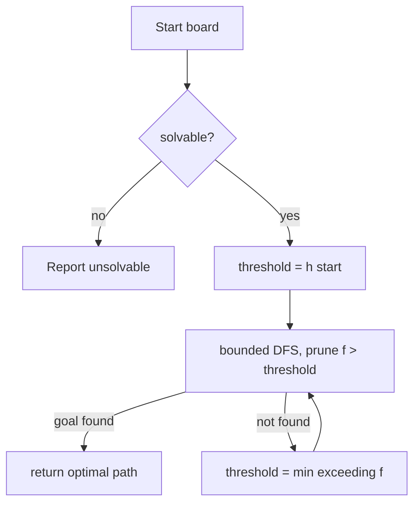

# The 15-Puzzle and 8-Puzzle (IDA* / Heuristic Search) — Junior Level

> **One-line summary:** The sliding-tile puzzle is solved by an *informed* depth-first search called **IDA*** (Iterative Deepening A*). It runs a bounded DFS where each path is cut off when `f = g + h` exceeds a threshold, then it raises the threshold and tries again. The heuristic `h` is the **Manhattan distance** (sum of how far each tile is from its goal), which never overestimates the real cost, so the first solution IDA* finds is guaranteed shortest.

---

## Table of Contents

1. [Introduction](#introduction)
2. [Prerequisites](#prerequisites)
3. [Glossary](#glossary)
4. [Core Concepts](#core-concepts)
5. [Big-O Summary](#big-o-summary)
6. [Real-World Analogies](#real-world-analogies)
7. [Pros & Cons](#pros--cons)
8. [Step-by-Step Walkthrough](#step-by-step-walkthrough)
9. [Code Examples](#code-examples)
10. [Coding Patterns](#coding-patterns)
11. [Error Handling](#error-handling)
12. [Performance Tips](#performance-tips)
13. [Best Practices](#best-practices)
14. [Edge Cases & Pitfalls](#edge-cases--pitfalls)
15. [Common Mistakes](#common-mistakes)
16. [Cheat Sheet](#cheat-sheet)
17. [Visual Animation](#visual-animation)
18. [Summary](#summary)
19. [Further Reading](#further-reading)

---

## Introduction

You have almost certainly held a sliding-tile puzzle. The **8-puzzle** is a `3 × 3` frame holding 8 numbered tiles and one empty square (the *blank*). The **15-puzzle** is the `4 × 4` version with 15 tiles. A move slides a tile next to the blank into the blank's place — equivalently, the blank swaps with an adjacent tile. The goal is to reach the ordered configuration:

```
8-puzzle goal:        15-puzzle goal:
 1  2  3               1  2  3  4
 4  5  6               5  6  7  8
 7  8  _               9 10 11 12
                      13 14 15  _
```

The question this topic answers is: **given a scrambled board, what is the shortest sequence of moves that solves it?** "Shortest" means the fewest tile slides.

The naive idea is to try every move, then every move from there, and so on — a brute-force search of the *state space*. That explodes fast: the 8-puzzle has 181,440 reachable states (small), but the 15-puzzle has over **10 trillion** reachable states. Plain breadth-first search (BFS) on the 15-puzzle would need to store billions of boards in memory and run for hours. We need to be smarter.

The trick is **informed search**: we use a *heuristic* `h(state)` that estimates how many more moves are left. If the estimate is good and never lies in the optimistic direction (it never claims fewer moves than truly remain), we can prune huge swaths of the search and still guarantee an optimal answer. The classic informed algorithm is **A***, but A* stores every state it has seen, which on the 15-puzzle blows out memory. The fix is **IDA*** (Iterative Deepening A*): it behaves like A* but uses only the memory of a single depth-first path — `O(depth)` instead of `O(states)`. That memory win is exactly why IDA* is the textbook 15-puzzle solver.

This file teaches the puzzle gently on the 8-puzzle first, introduces the **solvability test** (not every scramble is solvable!), the **Manhattan distance** heuristic, and then the IDA* search itself. By the end you will be able to write a solver that finds the optimal solution to any solvable 8-puzzle and small 15-puzzle.

---

## Prerequisites

Before reading this file you should be comfortable with:

- **Depth-first search (DFS) and recursion** — IDA* is a bounded recursive DFS. See sibling `16-backtracking` topics generally.
- **Breadth-first search (BFS)** — the baseline we compare against; finds shortest paths in unweighted graphs.
- **Grids and 2D coordinates** — the board is a grid; tiles have `(row, col)` positions.
- **Big-O notation** — branching factor `b`, depth `d`, and `O(b^d)`.
- **Absolute value and simple arithmetic** — Manhattan distance is `|Δrow| + |Δcol|`.

Optional but helpful:

- A glance at **A*** (best-first search with `f = g + h`); IDA* is its memory-light cousin.
- Familiarity with **parity / even-odd counting**, which underlies the solvability test.

---

## Glossary

| Term | Meaning |
|------|---------|
| **Tile** | A numbered piece that slides. The 8-puzzle has tiles `1..8`; the 15-puzzle has `1..15`. |
| **Blank** | The single empty square. A move slides a neighboring tile into it. Often written `0` or `_`. |
| **State / configuration** | One arrangement of the tiles and blank. The search explores states. |
| **Move** | Sliding one tile into the blank (= moving the blank up/down/left/right). |
| **Goal state** | The solved, ordered configuration. |
| **State space** | The set of all reachable configurations and the moves between them — a graph. |
| **g (cost so far)** | Number of moves made from the start to the current state. |
| **h (heuristic)** | An *estimate* of the moves remaining to the goal. |
| **f = g + h** | Estimated total cost of a solution through the current state. |
| **Admissible heuristic** | A heuristic that never overestimates the true remaining cost (`h ≤ true`). Guarantees optimal solutions. |
| **Hamming distance** | Heuristic counting misplaced tiles (the blank not counted). |
| **Manhattan distance** | Heuristic summing each tile's grid distance from its goal cell. Stronger than Hamming. |
| **Threshold / bound** | The current cutoff on `f` in IDA*. Paths with `f > threshold` are pruned. |
| **IDA*** | Iterative Deepening A*: repeated bounded DFS, raising the `f`-threshold each round. |
| **Inversion** | A pair of tiles out of order when the board is read left-to-right, top-to-bottom. |
| **Solvable** | A scramble that can actually reach the goal; the parity test decides this. |

---

## Core Concepts

### 1. The Puzzle as a Graph

Every board configuration is a **vertex**. Two configurations are joined by an **edge** if a single tile slide turns one into the other. Solving the puzzle is finding a shortest path from the start vertex to the goal vertex in this graph. The graph is huge but each vertex has at most 4 neighbors (slide a tile from up, down, left, or right into the blank), so the *branching factor* is small — usually 2 or 3 after we forbid undoing the last move.

### 2. Not Every Scramble Is Solvable

Here is a surprising fact: exactly **half** of all tile arrangements can reach the goal; the other half cannot, no matter how you slide. Whether a board is solvable is determined by a **parity rule** based on *inversions*.

An **inversion** is a pair of tiles `(a, b)` where `a` appears before `b` in reading order (left-to-right, top-to-bottom, ignoring the blank) but `a > b`. Count all inversions.

- **8-puzzle (odd width 3):** solvable **iff** the inversion count is **even**.
- **15-puzzle (even width 4):** solvable **iff** `(inversions + row-of-blank-counted-from-bottom)` is **even**. (Equivalently, inversions even when blank is on an odd row from the bottom, etc.)

Always run this test *before* searching. Searching an unsolvable board wastes time exploring the entire half of the space it can reach without ever finding the goal.

### 3. The Heuristic h: Estimating Remaining Moves

A **heuristic** `h(state)` guesses how many moves remain. Two simple ones:

- **Hamming (misplaced tiles):** count tiles not in their goal cell (do *not* count the blank). It is admissible because each misplaced tile needs at least one move.
- **Manhattan distance:** for each tile, add `|row − goalRow| + |col − goalCol|`. It is admissible because each tile must travel at least that many cells, and a move shifts one tile by one cell. Manhattan is always `≥` Hamming and prunes far better, so it is the default.

> **Admissible** means `h` never overestimates. This is the property that makes the *first* solution we find guaranteed to be the shortest.

### 4. f = g + h

For a state, `g` is moves made so far and `h` is the estimate of moves left, so `f = g + h` estimates the *total* solution length through this state. If `h` is admissible, `f` is a lower bound on the best solution that passes through this state. If `f` already exceeds the best solution length, this branch cannot beat it and is pruned.

### 5. IDA*: Bounded DFS with a Rising Threshold

A* would expand states in increasing `f` order using a priority queue, storing them all. IDA* gets the same optimality with tiny memory:

1. Set `threshold = h(start)` (the most optimistic possible solution length).
2. Run a **depth-first search** that explores moves but **abandons any path the moment `f > threshold`**.
3. If the DFS reaches the goal, that path is the optimal solution — return it.
4. If not, set `threshold` to the **smallest `f` value that exceeded the old threshold** during this DFS, and repeat from step 2.

Because the threshold rises to exactly the next achievable `f`, IDA* never skips a possible solution length, so the first goal it reaches is optimal. And because it is just DFS, it stores only the current path — `O(d)` memory, where `d` is the solution depth.

### 6. Avoiding Immediate Reversal

When generating moves, never make the move that simply undoes the previous one (e.g., if you just slid the blank left, do not slide it right next). That move returns to the parent state and only wastes work. Tracking the last move and skipping its inverse roughly halves the branching factor — a big constant-factor win.

---

## Big-O Summary

Let `b` be the effective branching factor (about 2.13 for the 15-puzzle after forbidding reversals) and `d` the optimal solution depth (number of moves).

| Operation | Time | Space | Notes |
|-----------|------|-------|-------|
| Solvability (inversion) test | **O(N²)** | O(1) | `N` = number of tiles; count inversions. |
| Manhattan distance of a board | O(N) | O(1) | One pass over tiles. |
| BFS shortest solution | O(states) | **O(states)** | Memory-bound; infeasible for 15-puzzle. |
| A* search | O(b^d) worst | **O(b^d)** | Stores the open/closed sets; memory blows up. |
| **IDA*** search | O(b^d) worst | **O(d)** | The standard 15-puzzle method; tiny memory. |
| Single bounded DFS pass | O(b^depth) | O(depth) | One iteration of IDA*. |

The headline contrast is **memory**: A* uses `O(b^d)` space, while IDA* uses only `O(d)`. IDA* may re-explore nodes across iterations, but the re-work is bounded by a constant factor because the number of nodes grows geometrically with the threshold, so the last iteration dominates.

---

## Real-World Analogies

| Concept | Analogy |
|---------|---------|
| State space | A giant maze where each room is a board arrangement and each door is a tile slide. |
| Heuristic `h` | A signpost in the maze estimating "about this many steps to the exit" — never optimistic enough to lie that it is closer than it is. |
| Manhattan distance | Counting city blocks each tile must walk to reach its home address, ignoring traffic and one-way streets. |
| Admissibility | A weather forecaster who is allowed to under-predict rain but never over-predict it — so if they say "no rain expected at all by total," you can trust the trip is at least that long. |
| IDA* rising threshold | Setting a budget for a road trip, exploring all routes within budget, and if none reach the destination, raising the budget to the cheapest route that just barely overshot. |
| Forbidding reversal | Not immediately U-turning back through the door you just came in. |
| Solvability parity | A locked half of the maze that the goal simply does not live in — checking the lock before you start walking. |

Where the analogy breaks: a real maze has fixed walls, but the puzzle graph is generated on the fly from the move rules; we never build the whole graph.

---

## Pros & Cons

| Pros | Cons |
|------|------|
| IDA* uses `O(d)` memory — solves the 15-puzzle where A* runs out of RAM. | Re-explores nodes each iteration (redundant work, though bounded). |
| Manhattan heuristic is cheap to compute and prunes aggressively. | Manhattan alone is too weak for the *hardest* 15-puzzles (need better heuristics). |
| First solution found is guaranteed optimal (admissible `h`). | Worst-case time is still exponential in solution depth. |
| Simple recursive code — a bounded DFS plus a heuristic. | No built-in cycle detection; relies on the reversal check and `f`-pruning. |
| Solvability test rejects half of inputs instantly. | The 15-puzzle's hardest instances (80 moves) are slow with Manhattan only. |

**When to use:** finding the *optimal* solution to a sliding-tile puzzle (8-, 15-, or 24-puzzle), or any problem with a huge state space, a good admissible heuristic, and tight memory.

**When NOT to use:** if any solution (not necessarily optimal) is fine — a greedy or weighted heuristic search is faster; or if the state space is small enough that plain BFS fits in memory (the 8-puzzle qualifies).

---

## Step-by-Step Walkthrough

Take this 8-puzzle start state (blank shown as `_`):

```
 1  2  3
 4  5  6
 7  _  8
```

The goal is:

```
 1  2  3
 4  5  6
 7  8  _
```

**Step 1 — Solvability.** Read tiles in order ignoring blank: `1 2 3 4 5 6 7 8`. Inversions = 0 (already sorted), which is even, so the board is **solvable**. Good.

**Step 2 — Heuristic at start.** Only tile `8` is out of place. Its goal cell is row 2, col 2 (0-indexed); it currently sits at row 2, col 1. Manhattan = `|2−2| + |1−2| = 1`. Hamming would also be 1 here. So `h(start) = 1`.

**Step 3 — Set the first threshold.** `threshold = h(start) = 1`. `f(start) = g + h = 0 + 1 = 1`, which is `≤ threshold`, so we expand.

**Step 4 — Generate moves.** The blank is at row 2, col 1. Adjacent tiles: tile `7` (left), tile `8` (right), tile `5` (up). (No tile below — bottom row.) For each, compute `f`:

- Slide `8` left into blank → board becomes the goal. `g = 1`, `h = 0`, `f = 1`. `f ≤ threshold`, and `h = 0` means **goal reached**. Solution: slide tile `8` left. Length 1, optimal.

This tiny example solved on the first threshold. For a deeper scramble, the first DFS would hit `f > threshold` on every branch, report the minimum exceeding `f` (say 3), raise `threshold` to 3, and try again — repeating until the goal is reached within budget.

**A slightly deeper trace (conceptual).** Suppose `h(start) = 4` but the true optimum is 6. Iteration 1 (threshold 4) explores until every path has `f ≥ 5`, finds no goal, and records the smallest overshoot, say 5. Iteration 2 (threshold 5) explores deeper, overshoots to 6. Iteration 3 (threshold 6) finally reaches the goal at depth 6. Three quick, shallow passes instead of one giant memory-hungry frontier.

---

## Code Examples

### Example: Solvability test + Manhattan heuristic + IDA* for the 8-puzzle

The board is a flat array of length 9 (3×3); `0` is the blank. Goal is `[1,2,3,4,5,6,7,8,0]`.

#### Go

```go
package main

import "fmt"

const SIDE = 3 // 3 for 8-puzzle, 4 for 15-puzzle

var goal = []int{1, 2, 3, 4, 5, 6, 7, 8, 0}

// inversions ignoring the blank (0)
func inversions(b []int) int {
	inv := 0
	for i := 0; i < len(b); i++ {
		if b[i] == 0 {
			continue
		}
		for j := i + 1; j < len(b); j++ {
			if b[j] != 0 && b[i] > b[j] {
				inv++
			}
		}
	}
	return inv
}

// solvable for odd-width boards (3): inversions must be even
func solvable3(b []int) bool { return inversions(b)%2 == 0 }

func manhattan(b []int) int {
	d := 0
	for i, v := range b {
		if v == 0 {
			continue
		}
		gr, gc := (v-1)/SIDE, (v-1)%SIDE // goal cell of tile v
		r, c := i/SIDE, i%SIDE
		d += abs(r-gr) + abs(c-gc)
	}
	return d
}

func abs(x int) int {
	if x < 0 {
		return -x
	}
	return x
}

var dr = []int{-1, 1, 0, 0}
var dc = []int{0, 0, -1, 1}

// bounded DFS; returns the smallest f that exceeded the bound (or -1 if solved)
func dfs(b []int, blank, g, bound, prev int, path *[]int) int {
	h := manhattan(b)
	f := g + h
	if f > bound {
		return f
	}
	if h == 0 {
		return -1 // solved
	}
	min := 1 << 30
	r, c := blank/SIDE, blank%SIDE
	for d := 0; d < 4; d++ {
		nr, nc := r+dr[d], c+dc[d]
		if nr < 0 || nr >= SIDE || nc < 0 || nc >= SIDE {
			continue
		}
		ni := nr*SIDE + nc
		if ni == prev { // do not undo the previous move
			continue
		}
		b[blank], b[ni] = b[ni], b[blank] // slide
		*path = append(*path, b[blank])   // tile that moved into old blank
		t := dfs(b, ni, g+1, bound, blank, path)
		if t == -1 {
			return -1
		}
		if t < min {
			min = t
		}
		*path = (*path)[:len(*path)-1]
		b[blank], b[ni] = b[ni], b[blank] // undo slide
	}
	return min
}

func solve(start []int) []int {
	blank := indexOf(start, 0)
	bound := manhattan(start)
	path := []int{}
	for {
		t := dfs(start, blank, 0, bound, -1, &path)
		if t == -1 {
			return path
		}
		if t == 1<<30 {
			return nil // no solution
		}
		bound = t
	}
}

func indexOf(b []int, v int) int {
	for i, x := range b {
		if x == v {
			return i
		}
	}
	return -1
}

func main() {
	start := []int{1, 2, 3, 4, 5, 6, 7, 0, 8}
	if !solvable3(start) {
		fmt.Println("unsolvable")
		return
	}
	sol := solve(start)
	fmt.Println("moves:", len(sol), "->", sol)
}
```

#### Java

```java
import java.util.*;

public class EightPuzzle {
    static final int SIDE = 3;
    static final int[] DR = {-1, 1, 0, 0};
    static final int[] DC = {0, 0, -1, 1};

    static int inversions(int[] b) {
        int inv = 0;
        for (int i = 0; i < b.length; i++) {
            if (b[i] == 0) continue;
            for (int j = i + 1; j < b.length; j++)
                if (b[j] != 0 && b[i] > b[j]) inv++;
        }
        return inv;
    }

    static boolean solvable3(int[] b) { return inversions(b) % 2 == 0; }

    static int manhattan(int[] b) {
        int d = 0;
        for (int i = 0; i < b.length; i++) {
            int v = b[i];
            if (v == 0) continue;
            int gr = (v - 1) / SIDE, gc = (v - 1) % SIDE;
            int r = i / SIDE, c = i % SIDE;
            d += Math.abs(r - gr) + Math.abs(c - gc);
        }
        return d;
    }

    static int dfs(int[] b, int blank, int g, int bound, int prev, List<Integer> path) {
        int h = manhattan(b), f = g + h;
        if (f > bound) return f;
        if (h == 0) return -1;
        int min = Integer.MAX_VALUE;
        int r = blank / SIDE, c = blank % SIDE;
        for (int d = 0; d < 4; d++) {
            int nr = r + DR[d], nc = c + DC[d];
            if (nr < 0 || nr >= SIDE || nc < 0 || nc >= SIDE) continue;
            int ni = nr * SIDE + nc;
            if (ni == prev) continue;
            swap(b, blank, ni);
            path.add(b[blank]);
            int t = dfs(b, ni, g + 1, bound, blank, path);
            if (t == -1) return -1;
            if (t < min) min = t;
            path.remove(path.size() - 1);
            swap(b, blank, ni);
        }
        return min;
    }

    static void swap(int[] b, int i, int j) { int t = b[i]; b[i] = b[j]; b[j] = t; }

    static List<Integer> solve(int[] start) {
        int blank = 0;
        for (int i = 0; i < start.length; i++) if (start[i] == 0) blank = i;
        int bound = manhattan(start);
        List<Integer> path = new ArrayList<>();
        while (true) {
            int t = dfs(start, blank, 0, bound, -1, path);
            if (t == -1) return path;
            if (t == Integer.MAX_VALUE) return null;
            bound = t;
        }
    }

    public static void main(String[] args) {
        int[] start = {1, 2, 3, 4, 5, 6, 7, 0, 8};
        if (!solvable3(start)) { System.out.println("unsolvable"); return; }
        List<Integer> sol = solve(start);
        System.out.println("moves: " + sol.size() + " -> " + sol);
    }
}
```

#### Python

```python
SIDE = 3
GOAL = (1, 2, 3, 4, 5, 6, 7, 8, 0)
DR = (-1, 1, 0, 0)
DC = (0, 0, -1, 1)


def inversions(b):
    inv = 0
    for i in range(len(b)):
        if b[i] == 0:
            continue
        for j in range(i + 1, len(b)):
            if b[j] != 0 and b[i] > b[j]:
                inv += 1
    return inv


def solvable3(b):
    return inversions(b) % 2 == 0


def manhattan(b):
    d = 0
    for i, v in enumerate(b):
        if v == 0:
            continue
        gr, gc = (v - 1) // SIDE, (v - 1) % SIDE
        r, c = i // SIDE, i % SIDE
        d += abs(r - gr) + abs(c - gc)
    return d


def dfs(b, blank, g, bound, prev, path):
    h = manhattan(b)
    f = g + h
    if f > bound:
        return f
    if h == 0:
        return -1
    best = 1 << 30
    r, c = blank // SIDE, blank % SIDE
    for d in range(4):
        nr, nc = r + DR[d], c + DC[d]
        if not (0 <= nr < SIDE and 0 <= nc < SIDE):
            continue
        ni = nr * SIDE + nc
        if ni == prev:
            continue
        b[blank], b[ni] = b[ni], b[blank]
        path.append(b[blank])
        t = dfs(b, ni, g + 1, bound, blank, path)
        if t == -1:
            return -1
        best = min(best, t)
        path.pop()
        b[blank], b[ni] = b[ni], b[blank]
    return best


def solve(start):
    b = list(start)
    blank = b.index(0)
    bound = manhattan(b)
    path = []
    while True:
        t = dfs(b, blank, 0, bound, -1, path)
        if t == -1:
            return path
        if t == 1 << 30:
            return None
        bound = t


if __name__ == "__main__":
    start = (1, 2, 3, 4, 5, 6, 7, 0, 8)
    if not solvable3(start):
        print("unsolvable")
    else:
        sol = solve(start)
        print("moves:", len(sol), "->", sol)
```

**What it does:** checks solvability, then runs IDA* with Manhattan distance, returning the list of tiles slid (the optimal solution).
**Run:** `go run main.go` | `javac EightPuzzle.java && java EightPuzzle` | `python puzzle.py`

---

## Coding Patterns

### Pattern 1: BFS Oracle (the slow truth you test against)

**Intent:** On the 8-puzzle (only 181,440 states), plain BFS finds the optimal solution length. Use it to verify IDA* returns the same length.

```python
from collections import deque


def bfs_len(start):
    start = tuple(start)
    if start == GOAL:
        return 0
    seen = {start}
    q = deque([(start, 0)])
    while q:
        s, d = q.popleft()
        bl = s.index(0)
        r, c = bl // SIDE, bl % SIDE
        for dr, dc in zip(DR, DC):
            nr, nc = r + dr, c + dc
            if 0 <= nr < SIDE and 0 <= nc < SIDE:
                ni = nr * SIDE + nc
                lst = list(s)
                lst[bl], lst[ni] = lst[ni], lst[bl]
                ns = tuple(lst)
                if ns == GOAL:
                    return d + 1
                if ns not in seen:
                    seen.add(ns)
                    q.append((ns, d + 1))
    return -1
```

BFS is `O(states)` time and memory — fine for the 8-puzzle, impossible for the 15-puzzle. IDA* must agree with it on the 8-puzzle.

### Pattern 2: Incremental Manhattan Update

**Intent:** Recomputing Manhattan from scratch each node is `O(N)`. Since a move shifts exactly one tile by one cell, you can update `h` in `O(1)`: subtract the moved tile's old distance, add its new distance. (Shown in `middle.md`.)

### Pattern 3: Forbid the Reverse Move

**Intent:** Pass the previous blank position into the DFS and skip any move that returns the blank there. This prunes the obvious 2-cycles.



---

## Error Handling

| Error | Cause | Fix |
|-------|-------|-----|
| Solver runs forever | Board is unsolvable; searched without the parity check. | Always run the solvability test first; return early. |
| Returns a non-optimal solution | Used a non-admissible (overestimating) heuristic. | Use Manhattan or Hamming; never inflate `h`. |
| Stack overflow on deep boards | Recursion depth exceeds the language limit. | Raise the recursion limit, or convert DFS to an explicit stack. |
| Wrong goal-cell math | Off-by-one mapping tile value to its target `(row, col)`. | Goal cell of tile `v` is `((v-1)/SIDE, (v-1)%SIDE)` with blank `0` excluded. |
| Infinite loop between two boards | Forgot to forbid the reverse move. | Track the previous blank index and skip moving back into it. |
| Threshold never rises | DFS returned the bound itself instead of the *exceeding* `f`. | Return `f` when `f > bound`; collect the minimum of those across children. |

---

## Performance Tips

- **Forbid the reverse move.** It nearly halves the branching factor for free.
- **Use Manhattan, not Hamming.** Manhattan dominates Hamming and prunes far more.
- **Update `h` incrementally.** `O(1)` per move instead of `O(N)` recompute (see `middle.md`).
- **Represent the board compactly.** A flat array (or packed integer) is cache-friendly and fast to copy/swap.
- **Mutate-and-undo in place.** Swap to make a move, recurse, then swap back — avoids allocating a new board per node.
- **Detect unsolvable boards early.** The parity test is `O(N²)` and saves an entire failed search.

---

## Best Practices

- Always test solvability *before* searching; half of random scrambles are unsolvable.
- Verify IDA* against BFS on the 8-puzzle: same optimal length on many random solvable boards.
- Keep the goal-cell lookup precomputed in a table for the 15-puzzle to avoid repeated division.
- Track the move sequence by recording which tile slid, so you can replay the solution.
- Name your constants (`SIDE`, `GOAL`) once; never sprinkle `3` or `9` literals.
- Confirm the heuristic returns `0` exactly at the goal and is positive otherwise.

---

## Edge Cases & Pitfalls

- **Already solved.** `h(start) = 0`; the solver should return an empty move list immediately.
- **Unsolvable board.** The parity test must catch it; otherwise IDA* searches forever.
- **Blank in a corner.** Only 2 moves available; the move generator must respect the grid bounds.
- **The blank itself in Manhattan.** Never count the blank's distance — it is not a tile to place.
- **15-puzzle parity rule differs.** Even-width boards add the blank's row (from the bottom) to the inversion count.
- **Goal layout variants.** Some sources place the blank at the top-left (`0` first). Decide your goal and keep the inversion test consistent with it.
- **Deep optimal solutions.** The hardest 15-puzzles take 80 moves; Manhattan alone may be too slow — that is the senior-level motivation for pattern databases.

---

## Common Mistakes

1. **Skipping the solvability test** and watching the solver loop forever on an unsolvable board.
2. **Counting the blank** in Hamming or Manhattan, which makes the heuristic inadmissible/wrong.
3. **Forgetting to forbid the reverse move**, causing endless ping-ponging between two states.
4. **Returning the bound instead of the exceeding `f`**, so the threshold never advances.
5. **Using an inflated heuristic** (e.g., Manhattan × 2) to go faster — it breaks optimality.
6. **Mapping tile `v` to goal cell `v/SIDE`** instead of `(v-1)/SIDE`, an off-by-one that corrupts `h`.
7. **Not undoing the move** after recursion, corrupting the shared board array.

---

## Cheat Sheet

| Question | Tool | Formula / Rule |
|----------|------|----------------|
| Is the board solvable? (3×3) | inversion parity | inversions even |
| Is the board solvable? (4×4) | inversion + blank row | `inversions + rowFromBottom(blank)` even |
| Estimate moves left (weak) | Hamming | count misplaced tiles (not blank) |
| Estimate moves left (strong) | Manhattan | `Σ |r−gr| + |c−gc|` over tiles |
| Find optimal solution | IDA* | DFS pruned by `f = g + h > threshold`, raise threshold |
| Goal cell of tile `v` | index math | `((v−1)/SIDE, (v−1)%SIDE)` |
| Reduce branching | reversal check | skip moving blank back where it came from |

Core algorithm:

```
IDA*(start):
    threshold = h(start)
    loop:
        t = boundedDFS(start, g=0, threshold)
        if t == FOUND: return path
        if t == INF:   return no-solution
        threshold = t        # smallest f that exceeded the bound

boundedDFS(state, g, threshold):
    f = g + h(state)
    if f > threshold: return f
    if isGoal(state): return FOUND
    min = INF
    for move in moves(state) excluding reverse:
        apply(move)
        t = boundedDFS(state, g+1, threshold)
        if t == FOUND: return FOUND
        min = min(min, t)
        undo(move)
    return min
```

---

## Visual Animation

> See [`animation.html`](./animation.html) for an interactive visualization.
>
> The animation demonstrates:
> - The 8-puzzle board and the blank sliding as moves are explored
> - The live `g`, `h`, and `f = g + h` values at each node
> - The IDA* threshold rising across iterations
> - Branches being explored and **backtracked** when `f > threshold`
> - The final optimal solution path highlighted, with Step / Run / Reset controls

---

## Summary

A sliding-tile puzzle is a shortest-path problem on a gigantic state graph. The 8-puzzle is small enough for BFS; the 15-puzzle is not, so we use **informed search**. First, the **inversion-parity solvability test** rejects the unsolvable half of inputs in `O(N²)`. Then **IDA*** finds the optimal solution: it is a depth-first search that prunes any path whose `f = g + h` exceeds a threshold, raising the threshold to the smallest exceeding `f` each round. With the **admissible Manhattan heuristic**, the first solution IDA* reaches is guaranteed shortest, and because it is just DFS, it uses only `O(d)` memory — the exact reason it beats A* on the 15-puzzle. Forbid the immediate reverse move to cut the branching factor, always check solvability first, and verify against BFS on the 8-puzzle. With these pieces you can optimally solve any 8-puzzle and modest 15-puzzles.

---

## Further Reading

- *Artificial Intelligence: A Modern Approach* (Russell & Norvig) — A*, IDA*, admissible heuristics.
- Richard Korf, "Depth-First Iterative-Deepening" (1985) — the original IDA* paper, first to optimally solve the 15-puzzle.
- Wikipedia — "15 puzzle" (solvability parity) and "Iterative deepening A*".
- Sibling `16-backtracking` topics — bounded DFS and pruning patterns.
- `middle.md` here — heuristic comparison, linear conflict, and IDA* mechanics in depth.
- `professional.md` here — the solvability parity proof and admissibility proofs.
