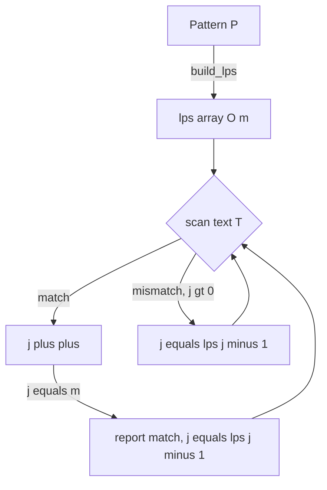

# Knuth-Morris-Pratt (KMP) String Matching — Junior Level

> **One-line summary:** KMP finds every occurrence of a pattern `P` inside a text `T` in `O(n + m)` time by precomputing a **prefix function** (the `lps` array) that tells the matcher how far it can shift the pattern on a mismatch *without ever re-reading text characters it already matched*.

---

## Table of Contents

1. [Introduction](#introduction)
2. [Prerequisites](#prerequisites)
3. [Glossary](#glossary)
4. [Core Concepts](#core-concepts)
5. [Big-O Summary](#big-o-summary)
6. [Real-World Analogies](#real-world-analogies)
7. [Pros & Cons](#pros--cons)
8. [Step-by-Step Walkthrough](#step-by-step-walkthrough)
9. [Code Examples](#code-examples)
10. [Coding Patterns](#coding-patterns)
11. [Error Handling](#error-handling)
12. [Performance Tips](#performance-tips)
13. [Best Practices](#best-practices)
14. [Edge Cases & Pitfalls](#edge-cases--pitfalls)
15. [Common Mistakes](#common-mistakes)
16. [Cheat Sheet](#cheat-sheet)
17. [Visual Animation](#visual-animation)
18. [Summary](#summary)
19. [Further Reading](#further-reading)

---

## Introduction

Suppose you are searching for the word `"ABABC"` inside a long text. The obvious approach — the **naive matcher** — lines the pattern up at position 0 of the text and compares characters left to right. If everything matches, great, you found it. If a character disagrees, you slide the pattern one step to the right and start comparing again *from the very beginning of the pattern*.

That restart is the problem. Imagine the text is `"ABABABABABC"` and the pattern is `"ABABC"`. You match `A B A B` (four characters) and then mismatch at the fifth. The naive matcher throws away all four matched characters, shifts by one, and re-compares them. On adversarial inputs like `T = "AAAA…AAB"` and `P = "AAAA…AB"`, the naive matcher does roughly `n × m` character comparisons — quadratic, and painfully slow for big inputs.

KMP, published by **Donald Knuth, James H. Morris, and Vaughan Pratt** in 1977, removes the waste. Its key realization: when a mismatch happens after you have already matched some prefix of the pattern, *you already know what those text characters were* — they equal that prefix of the pattern. So instead of blindly restarting, KMP asks a precomputed question:

> *"What is the longest proper prefix of the pattern that is also a suffix of the part I just matched?"*

That number tells the matcher exactly how far it can slide the pattern so that the already-matched suffix lines up with a pattern prefix — meaning **no text character is ever compared twice as a fresh start**. The answer to that question, for every prefix length, is stored in the **prefix function**, also called the **failure function** or the **`lps` array** ("longest proper prefix which is also a suffix").

Computing the `lps` array takes `O(m)` time, the search itself takes `O(n)` time, so the whole algorithm runs in **`O(n + m)`** — linear. This guarantee holds on *every* input, including the adversarial ones that destroy the naive matcher. KMP is the foundation for a whole family of string tools: counting occurrences, finding the period of a string, detecting borders, and (extended to many patterns) the Aho-Corasick automaton in sibling topic `05-aho-corasick`.

This file builds intuition from the naive matcher up to the full linear search. Its siblings cover related ideas: `02-z-function` (the Z-array, a close cousin of the prefix function), `03-rabin-karp` (hashing-based search), and `08-boyer-moore` (skipping via the *end* of the pattern). We compare all four near the end.

---

## Prerequisites

Before reading this file you should be comfortable with:

- **Strings and 0-based indexing** — `s[0]` is the first character, `s[len-1]` the last.
- **Prefix and suffix** — a prefix is a beginning chunk; a suffix is an ending chunk. A *proper* prefix/suffix excludes the whole string itself.
- **Arrays** — we store one integer per pattern position in the `lps` array.
- **Loops and `while` loops** — the prefix-function construction uses a small `while` loop inside a `for` loop.
- **Big-O notation** — `O(nm)`, `O(n + m)`, `O(m)`.

Optional but helpful:

- A glance at the **naive (brute-force) substring search** so the improvement is obvious.
- Familiarity with **ASCII / character comparison** (`==` on characters).
- Curiosity about **automata** — KMP has a beautiful finite-automaton interpretation we sketch later.

---

## Glossary

| Term | Meaning |
|------|---------|
| **Text `T`** | The (usually long) string we search *inside*. Length `n`. |
| **Pattern `P`** | The (usually short) string we search *for*. Length `m`. |
| **Occurrence** | A position `i` in `T` where `P` appears: `T[i .. i+m-1] == P`. |
| **Prefix** | A starting substring `s[0 .. k-1]`. |
| **Suffix** | An ending substring `s[len-k .. len-1]`. |
| **Proper prefix/suffix** | One that is *not* the whole string. `"AB"` is a proper prefix of `"ABC"`; `"ABC"` is not. |
| **Border** | A string that is both a proper prefix and a proper suffix of `s`. |
| **Prefix function / `lps`** | `lps[i]` = length of the longest proper prefix of `P[0..i]` that is also a suffix of `P[0..i]`. Same as "longest border". |
| **Failure function / failure link** | Another name for `lps`; on a mismatch we "fail" back to `lps[j-1]`. |
| **Naive matcher** | Brute-force search that restarts the pattern on every mismatch; `O(nm)`. |
| **Period** | The smallest shift `p` such that `s` repeats with that period; `p = n - lps[n-1]`. |
| **KMP automaton** | A finite-state machine with `m+1` states built from the prefix function; reading text drives state transitions. |

---

## Core Concepts

### 1. The Naive Matcher and Its Waste

The naive matcher tries every starting offset `s = 0, 1, …, n-m` and compares `P` against `T[s..]`:

```
for s in 0 .. n-m:
    j = 0
    while j < m and T[s+j] == P[j]:
        j += 1
    if j == m: report match at s
```

In the worst case (`T = "AAAA…A"`, `P = "AAA…AB"`) each offset matches almost the whole pattern before failing, giving `O(nm)` comparisons. The fatal flaw: after a partial match at offset `s`, the matcher forgets everything and restarts at `s+1`, **re-reading text it already examined**.

### 2. The Key Insight — We Already Know the Matched Text

Say we matched `P[0..j-1]` against `T[i-j..i-1]` and then `T[i] != P[j]`. Because those `j` characters matched, the text we just read *is exactly* `P[0..j-1]`. So we do not need to look at the text again to decide how to shift — we only need to study the **pattern itself**. The question is purely about `P`:

> Of the matched prefix `P[0..j-1]`, what is the longest proper prefix that is also a suffix?

If that longest border has length `b`, then those `b` characters at the end of the matched region are already aligned with the first `b` characters of the pattern. So we set `j = b` and continue comparing `T[i]` against `P[b]` — **without moving `i` backward**.

### 3. The Prefix Function (`lps` array)

For each index `i` of the pattern, define:

```
lps[i] = length of the longest proper prefix of P[0..i]
         that is also a suffix of P[0..i]
```

Example — `P = "ABABC"`:

```
i:      0    1    2    3    4
P[i]:   A    B    A    B    C
lps:    0    0    1    2    0
```

- `lps[0] = 0` — a single character has no *proper* prefix.
- `lps[2] = 1` — `"ABA"`: prefix `"A"` equals suffix `"A"`.
- `lps[3] = 2` — `"ABAB"`: prefix `"AB"` equals suffix `"AB"`.
- `lps[4] = 0` — `"ABABC"`: no proper prefix equals a suffix (ends in `C`).

### 4. Computing `lps` in O(m)

We build `lps` with two pointers: `i` scanning forward, and `len` tracking the current longest border. When `P[i] == P[len]` we extend the border (`len++`); when they mismatch we *fall back* to `lps[len-1]` (a shorter border that might still extend) until we either match or reach `len = 0`.

```
lps[0] = 0
len = 0
for i in 1 .. m-1:
    while len > 0 and P[i] != P[len]:
        len = lps[len-1]        # fall back to a shorter border
    if P[i] == P[len]:
        len += 1
    lps[i] = len
```

Although it contains a `while` inside a `for`, this runs in **O(m)** total: `len` increases at most `m` times overall, so it can decrease at most `m` times — the inner loop's *total* work is bounded. (The amortized proof lives in [`professional.md`](./professional.md).)

### 5. The KMP Search in O(n + m)

With `lps` ready, we scan the text once. `j` is how many pattern characters currently match. On a mismatch we slide using the failure link instead of restarting:

```
j = 0
for i in 0 .. n-1:
    while j > 0 and T[i] != P[j]:
        j = lps[j-1]            # shift pattern via failure link
    if T[i] == P[j]:
        j += 1
    if j == m:
        report match at i-m+1
        j = lps[j-1]            # keep going to find overlapping matches
```

The text index `i` only ever moves *forward* — it is never decremented. That is the whole point: each text character is "consumed" once, giving `O(n)` for the scan and `O(n + m)` overall.

### 6. The Automaton View

You can think of KMP as a finite-state machine with states `0, 1, …, m`. State `j` means "the last `j` characters read are exactly `P[0..j-1]`." Reading a character either advances to state `j+1` (match) or follows failure links back to a shorter state. Reaching state `m` signals a full match. We can even precompute a full transition table `δ[state][char]`, turning the search into pure table lookups (covered in [`middle.md`](./middle.md)).

---

## Big-O Summary

| Operation | Time | Space | Notes |
|-----------|------|-------|-------|
| Naive substring search | **O(nm)** | O(1) | Re-reads text after every partial match. |
| Build prefix function `lps` | **O(m)** | O(m) | Amortized; `len` never exceeds total increments. |
| KMP search (after `lps`) | **O(n)** | O(1) extra | Text index never moves backward. |
| **Full KMP (build + search)** | **O(n + m)** | O(m) | The headline guarantee. |
| Count all occurrences | O(n + m) | O(m) | Same scan; just keep counting. |
| Period of a string | O(m) | O(m) | `period = m - lps[m-1]` (if it divides `m`). |
| Build full KMP automaton table | O(m · \|Σ\|) | O(m · \|Σ\|) | Transition table over alphabet Σ. |

The headline number is **`O(n + m)`** — linear in the combined size of text and pattern, with *no* dependence on the alphabet for the basic version and no quadratic blowup on any input.

---

## Real-World Analogies

| Concept | Analogy |
|---------|---------|
| Naive restart | Reading a sentence, losing your place, and starting the *whole sentence* over every time you stumble. |
| Prefix function | A bookmark that remembers: "you already read these words; resume from here, not the top." |
| Failure link | A road detour sign: instead of driving all the way back to the start, take the shortcut to the nearest point that still matches. |
| Border (prefix = suffix) | A word like `"abracadabra"` whose ending `"abra"` echoes its beginning `"abra"` — you can reuse the overlap. |
| Period of a string | Wallpaper with a repeating motif: the period is the width of one tile (`"abcabcabc"` has period 3). |
| KMP automaton | A turnstile with numbered states: each correct character clicks you forward one notch; a wrong one drops you back to the right partial state. |

Where the analogy breaks: a bookmark only remembers *one* place, but the failure function encodes a whole chain of fallback positions (`lps[j-1]`, then `lps[lps[j-1]-1]`, …), letting KMP recover the *best* partial match instantly.

---

## Pros & Cons

| Pros | Cons |
|------|------|
| Guaranteed **`O(n + m)`** on every input — no worst-case blowup. | Constant factor is higher than a tuned naive/`memchr` scan on short patterns. |
| Never moves the text pointer backward — ideal for **streaming** input read once. | Needs `O(m)` extra memory for the `lps` array. |
| Simple to extend: counting, period, border detection all reuse `lps`. | The fall-back `while` loop is subtle and easy to get wrong (off-by-one). |
| Pure integer/character comparisons — no hashing, no floating point, no false positives. | For *many* patterns at once, Aho-Corasick (`05`) is better than running KMP repeatedly. |
| Foundation for automaton-based and multi-pattern matching. | On real text, Boyer-Moore (`08`) often skips more characters and is faster in practice. |

**When to use:** single-pattern search where worst-case guarantees matter, streaming/online text, computing periods/borders, or when you cannot afford the hash collisions of Rabin-Karp.

**When NOT to use:** searching many patterns at once (use Aho-Corasick `05`), when average-case speed on natural text matters more than worst case (Boyer-Moore `08`), or when a library `strstr`/`memmem`/`str.find` already meets your needs.

---

## Step-by-Step Walkthrough

Let `P = "ABABC"` and `T = "ABABABABC"`. First build `lps` for `P` (done above): `lps = [0, 0, 1, 2, 0]`.

Now scan the text. `i` is the text index, `j` is how many pattern chars match.

```
T: A B A B A B A B C
   0 1 2 3 4 5 6 7 8
P: A B A B C
```

```
i=0: T[0]=A, P[0]=A  match → j=1
i=1: T[1]=B, P[1]=B  match → j=2
i=2: T[2]=A, P[2]=A  match → j=3
i=3: T[3]=B, P[3]=B  match → j=4
i=4: T[4]=A, P[4]=C  MISMATCH
        j>0, so j = lps[j-1] = lps[3] = 2   (slide pattern, keep i=4)
        now compare T[4]=A vs P[2]=A  match → j=3
i=5: T[5]=B, P[3]=B  match → j=4
i=6: T[6]=A, P[4]=C  MISMATCH
        j = lps[3] = 2
        T[6]=A vs P[2]=A  match → j=3
i=7: T[7]=B, P[3]=B  match → j=4
i=8: T[8]=C, P[4]=C  match → j=5 == m  →  MATCH at i-m+1 = 8-5+1 = 4
        j = lps[4] = 0
```

Notice what happened at `i=4`: the naive matcher would have reset to text position 1 and re-read `T[1..]`. KMP instead used `lps[3] = 2`, meaning "the `"AB"` we just matched at the end is also the pattern's start," and resumed *without rewinding `i`*. The text pointer `i` marched `0 → 8` exactly once. Total comparisons stayed linear.

The single match is at index 4: `T[4..8] = "ABABC" = P`. Correct.

---

## Code Examples

### Example: Build `lps` and Search

This builds the prefix function, then scans the text reporting every match start index.

#### Go

```go
package main

import "fmt"

// buildLPS returns the prefix function of pattern p.
func buildLPS(p string) []int {
	m := len(p)
	lps := make([]int, m)
	length := 0
	for i := 1; i < m; i++ {
		for length > 0 && p[i] != p[length] {
			length = lps[length-1] // fall back to a shorter border
		}
		if p[i] == p[length] {
			length++
		}
		lps[i] = length
	}
	return lps
}

// kmpSearch returns all start indices where p occurs in t.
func kmpSearch(t, p string) []int {
	if len(p) == 0 {
		return nil
	}
	lps := buildLPS(p)
	var matches []int
	j := 0
	for i := 0; i < len(t); i++ {
		for j > 0 && t[i] != p[j] {
			j = lps[j-1]
		}
		if t[i] == p[j] {
			j++
		}
		if j == len(p) {
			matches = append(matches, i-len(p)+1)
			j = lps[j-1] // allow overlapping matches
		}
	}
	return matches
}

func main() {
	t, p := "ABABABABC", "ABABC"
	fmt.Println("lps:", buildLPS(p))     // [0 0 1 2 0]
	fmt.Println("matches:", kmpSearch(t, p)) // [4]
}
```

#### Java

```java
import java.util.*;

public class KMP {
    static int[] buildLPS(String p) {
        int m = p.length();
        int[] lps = new int[m];
        int len = 0;
        for (int i = 1; i < m; i++) {
            while (len > 0 && p.charAt(i) != p.charAt(len)) {
                len = lps[len - 1]; // fall back
            }
            if (p.charAt(i) == p.charAt(len)) {
                len++;
            }
            lps[i] = len;
        }
        return lps;
    }

    static List<Integer> kmpSearch(String t, String p) {
        List<Integer> matches = new ArrayList<>();
        if (p.isEmpty()) return matches;
        int[] lps = buildLPS(p);
        int j = 0;
        for (int i = 0; i < t.length(); i++) {
            while (j > 0 && t.charAt(i) != p.charAt(j)) {
                j = lps[j - 1];
            }
            if (t.charAt(i) == p.charAt(j)) {
                j++;
            }
            if (j == p.length()) {
                matches.add(i - p.length() + 1);
                j = lps[j - 1]; // overlapping matches
            }
        }
        return matches;
    }

    public static void main(String[] args) {
        String t = "ABABABABC", p = "ABABC";
        System.out.println("lps: " + Arrays.toString(buildLPS(p))); // [0, 0, 1, 2, 0]
        System.out.println("matches: " + kmpSearch(t, p));          // [4]
    }
}
```

#### Python

```python
def build_lps(p: str) -> list[int]:
    m = len(p)
    lps = [0] * m
    length = 0
    for i in range(1, m):
        while length > 0 and p[i] != p[length]:
            length = lps[length - 1]   # fall back to a shorter border
        if p[i] == p[length]:
            length += 1
        lps[i] = length
    return lps


def kmp_search(t: str, p: str) -> list[int]:
    if not p:
        return []
    lps = build_lps(p)
    matches = []
    j = 0
    for i in range(len(t)):
        while j > 0 and t[i] != p[j]:
            j = lps[j - 1]
        if t[i] == p[j]:
            j += 1
        if j == len(p):
            matches.append(i - len(p) + 1)
            j = lps[j - 1]             # allow overlapping matches
    return matches


if __name__ == "__main__":
    t, p = "ABABABABC", "ABABC"
    print("lps:", build_lps(p))        # [0, 0, 1, 2, 0]
    print("matches:", kmp_search(t, p))  # [4]
```

**What it does:** builds the prefix function for `"ABABC"`, then finds it inside `"ABABABABC"` at index 4.
**Run:** `go run kmp.go` | `javac KMP.java && java KMP` | `python kmp.py`

---

## Coding Patterns

### Pattern 1: Naive Matcher (the oracle you test against)

**Intent:** Before trusting KMP, find matches the slow, obvious way and check they agree on small inputs.

```python
def naive_search(t, p):
    matches = []
    n, m = len(t), len(p)
    for s in range(n - m + 1):
        if t[s:s + m] == p:
            matches.append(s)
    return matches
```

This is `O(nm)` but unmistakably correct. KMP must return the identical list on every test.

### Pattern 2: Count Occurrences (with overlaps)

**Intent:** Count how many times `P` appears, allowing overlaps (e.g. `"aaa"` contains `"aa"` twice). Just increment a counter at each match and set `j = lps[j-1]`.

### Pattern 3: The `P # T` Concatenation Trick

**Intent:** Reuse the *prefix-function builder alone* to do a search — no separate matcher needed. Build the prefix function of `P + '#' + T`, where `#` is a sentinel that never appears in either string. Wherever the prefix-function value equals `m` (the pattern length), the pattern ends there in the text.

```python
def kmp_via_concat(t, p, sep="#"):
    s = p + sep + t
    lps = build_lps(s)
    out = []
    m = len(p)
    for i in range(m + 1, len(s)):
        if lps[i] == m:
            # match ends at position (i - (m+1)) in t
            out.append(i - 2 * m)
    return out
```



---

## Error Handling

| Error | Cause | Fix |
|-------|-------|-----|
| Empty pattern crashes / loops | `m = 0`, indexing `p[0]` fails. | Special-case empty pattern (often "matches everywhere" or "invalid"). |
| Off-by-one in match index | Reporting `i` instead of `i - m + 1`. | Match *start* is `i - m + 1` when `j` first hits `m`. |
| Misses overlapping matches | After a match, reset `j = 0`. | Set `j = lps[j-1]` so overlaps are found. |
| Infinite loop in `lps` build | Decrementing `len` without the `len > 0` guard. | The `while` must guard `len > 0` before reading `lps[len-1]`. |
| Wrong results on bytes vs chars | Treating multibyte UTF-8 as single chars. | Decide byte- or rune-level matching explicitly (see `senior.md`). |
| Pattern longer than text | `m > n`, no possible match. | Loop naturally reports nothing; no special case needed, but check bounds. |

---

## Performance Tips

- **Build `lps` once, search many texts** — if the pattern is fixed, precompute `lps` and reuse it across queries.
- **Work on bytes, not strings, in hot loops** — in Go use `[]byte`, in Java use `char[]`/`byte[]`, in Python use `bytes` to avoid per-char object overhead.
- **Avoid repeated `charAt`/slicing** — cache the pattern into a local array; slicing in Python (`t[s:s+m]`) allocates and is slow.
- **Prefer library search when worst case is irrelevant** — `strings.Index`, `String.indexOf`, and `str.find` are heavily optimized (often SIMD/`memchr`) and beat hand-rolled KMP on typical text.
- **Use the automaton table only when alphabet is small** — the `O(m·|Σ|)` table speeds the inner loop but wastes memory for large alphabets.

---

## Best Practices

- Always test KMP against the naive oracle (Pattern 1) on random small strings before trusting it.
- Keep `buildLPS` and `kmpSearch` as separate, independently testable functions; most bugs hide in the `lps` fall-back loop.
- Use a sentinel character for the `P # T` trick that is provably absent from both strings; an in-band separator silently corrupts results.
- Document whether your matcher returns *all* matches (with overlaps) or just the first; callers depend on this.
- For period/border problems, remember the one formula: `period = m - lps[m-1]`, valid as the smallest period when `m % period == 0`.

---

## Edge Cases & Pitfalls

- **Empty pattern (`m = 0`)** — conventionally matches at every position (including `n`); decide and document.
- **Empty text (`n = 0`)** — no matches unless the pattern is also empty.
- **Pattern longer than text** — zero matches; the scan simply never reaches `j = m`.
- **Single-character pattern** — `lps = [0]`; KMP degenerates to a linear scan, which is fine.
- **All-same-character inputs** (`T = "aaaa"`, `P = "aa"`) — the worst case for *naive*, but exactly where KMP shines; expect overlapping matches.
- **Overlapping matches** — `"aaa"` in `"aaaaa"` occurs 3 times; only `j = lps[j-1]` after a hit finds them all.
- **Unicode** — `len` and indexing on multibyte strings can split characters; operate on runes or normalize first (see `senior.md`).

---

## Common Mistakes

1. **Resetting `j = 0` after a match** instead of `j = lps[j-1]` — misses overlapping occurrences.
2. **Forgetting the `len > 0` / `j > 0` guard** before reading `lps[len-1]` — crashes or loops forever.
3. **Reporting `i` as the match start** instead of `i - m + 1`.
4. **Rebuilding `lps` inside the search loop** — it should be built once, before scanning.
5. **Confusing "length" with "index"** — `lps[i]` is a *length*; the next character to compare is `P[lps[i]]`.
6. **Using `lps[len]` instead of `lps[len-1]`** in the fall-back — off-by-one that produces subtly wrong borders.
7. **Assuming KMP skips like Boyer-Moore** — KMP never skips text characters; it only avoids *re-reading* them. The skipping cousin is `08-boyer-moore`.

---

## Cheat Sheet

| Question | Tool | Formula / Code |
|----------|------|----------------|
| Find first / all occurrences | KMP search | scan with failure links, `O(n+m)` |
| Build failure function | prefix function | `lps[i]` = longest border of `P[0..i]` |
| Count occurrences (overlap) | KMP search | `count++; j = lps[j-1]` on each hit |
| Smallest period of `s` | prefix function | `p = m - lps[m-1]` (if `m % p == 0`) |
| Longest border of `s` | prefix function | `lps[m-1]` |
| Search via builder only | `P # T` trick | wherever `lps[i] == m`, match ends |
| Mismatch handling | failure link | `j = lps[j-1]` (repeat while `j>0`) |

Core algorithm:

```
buildLPS(P):                       kmpSearch(T, P):
    lps[0] = 0                         lps = buildLPS(P); j = 0
    len = 0                            for i in 0..n-1:
    for i in 1..m-1:                       while j>0 and T[i]!=P[j]: j = lps[j-1]
        while len>0 and P[i]!=P[len]:      if T[i]==P[j]: j++
            len = lps[len-1]               if j==m: report i-m+1; j = lps[j-1]
        if P[i]==P[len]: len++
        lps[i] = len
# total cost: O(n + m)
```

---

## Visual Animation

> See [`animation.html`](./animation.html) for an interactive visualization.
>
> The animation demonstrates:
> - The text and pattern aligned, with the comparison pointer advancing character by character.
> - On a mismatch, the pattern **shifting via the failure link** (`lps`) instead of restarting from the beginning.
> - The `lps` value being used, highlighted so you see *why* the shift is safe.
> - Step / Run / Reset controls plus editable text and pattern fields.

---

## Summary

The naive matcher wastes time by re-reading text after every partial match, giving `O(nm)` worst case. KMP fixes this with one precomputed table — the **prefix function** (`lps` array), where `lps[i]` is the longest proper prefix of `P[0..i]` that is also a suffix. Building it costs `O(m)`; the search scans the text once, using `lps` to slide the pattern on a mismatch *without ever moving the text pointer backward*, costing `O(n)`. Together that is the famous **`O(n + m)`** guarantee, robust on every input. The same `lps` array unlocks counting occurrences, the smallest period (`m - lps[m-1]`), border detection, and the `P # T` search trick. Master `buildLPS` and the failure-link fall-back, and you own the most important worst-case-linear single-pattern matcher in computer science.

---

## Further Reading

- Knuth, Morris, Pratt — *"Fast Pattern Matching in Strings"*, SIAM J. Computing, 1977 (the original paper).
- *Introduction to Algorithms* (CLRS), Chapter 32 — string matching, the prefix function, and the KMP automaton.
- cp-algorithms.com — "Prefix function. Knuth-Morris-Pratt" (excellent worked examples).
- Sibling topic `02-z-function` — the Z-array, a close relative of the prefix function.
- Sibling topic `03-rabin-karp` — rolling-hash substring search.
- Sibling topic `08-boyer-moore` — skipping via the end of the pattern.
- Sibling topic `05-aho-corasick` — KMP generalized to many patterns at once.
