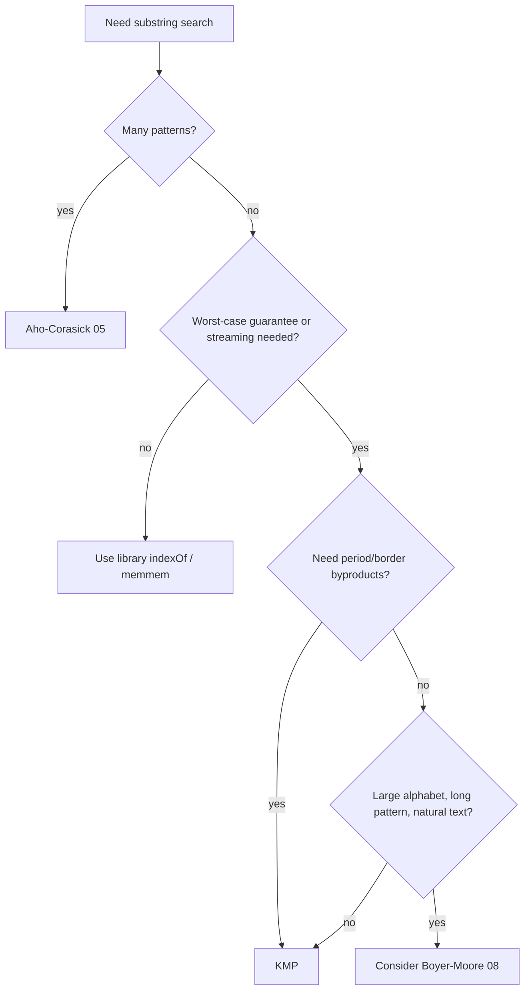

# Knuth-Morris-Pratt (KMP) — Senior / Production Level

> **One-line summary:** In production, KMP's value is its *unconditional* `O(n+m)` bound and its single-forward-pass nature — making it ideal for **streaming/online** matching — but shipping it correctly means getting bytes-vs-runes right, knowing when `memchr`/SIMD library search beats it, choosing it (or not) over Aho-Corasick for multi-pattern, and testing it adversarially.

---

## Table of Contents

1. [Where KMP Earns Its Keep in Production](#where-kmp-earns-its-keep-in-production)
2. [Streaming and Online Matching](#streaming-and-online-matching)
3. [Multi-Pattern: When to Reach for Aho-Corasick](#multi-pattern-when-to-reach-for-aho-corasick)
4. [Unicode: Bytes vs Runes vs Code Points](#unicode-bytes-vs-runes-vs-code-points)
5. [Performance vs memchr and SIMD](#performance-vs-memchr-and-simd)
6. [The Automaton Trade-Off in Practice](#the-automaton-trade-off-in-practice)
7. [Memory, Allocation, and Reuse](#memory-allocation-and-reuse)
8. [Production-Grade Implementations](#production-grade-implementations)
9. [Testing Strategy](#testing-strategy)
10. [Failure Modes and How They Manifest](#failure-modes-and-how-they-manifest)
11. [Observability and Limits](#observability-and-limits)
12. [Case Study: A Log-Scanning Pipeline](#case-study-a-log-scanning-pipeline)
13. [Concurrency Considerations](#concurrency-considerations)
14. [Configuration and Tuning Checklist](#configuration-and-tuning-checklist)
15. [Security Considerations](#security-considerations)
16. [Migration and Interop Notes](#migration-and-interop-notes)
17. [Production FAQ](#production-faq)
18. [Operational Runbook](#operational-runbook)
19. [Decision Guide](#decision-guide)
20. [Summary](#summary)
21. [Further Reading](#further-reading)

---

## Where KMP Earns Its Keep in Production

> **Scope of this file:** the algorithm is settled (junior/middle); here the question is *engineering judgment* — when to actually deploy KMP versus a library call, how to make it correct on real Unicode and real streams, how it performs against SIMD, how to test it, and how it fails. If you are implementing a service that searches text, this is the file that keeps you out of trouble.

Most everyday substring searches should call the standard library (`strings.Index`, `String.indexOf`, `str.find`, `memmem`) — those are tuned, often SIMD-accelerated, and correct. KMP is the right tool when one or more of the following hold:

- **You need a hard worst-case guarantee.** Adversarial inputs (user-supplied patterns and texts, security filters) can drive naive or some library scanners toward `O(nm)`. KMP is `O(n+m)` no matter what.
- **The text is a stream you can read only once.** Logs, network sockets, file pipes, decompression output. KMP never rewinds, so it consumes each byte exactly once and needs no buffering of past input beyond the `lps` array.
- **You need the byproducts.** Period detection, border structure, "is this a repetition," longest-prefix-also-suffix — all fall out of the same `lps` array you already built.
- **You are building something bigger.** Aho-Corasick, suffix-automaton preprocessing, and regex engines reuse the failure-link idea. Understanding KMP is the gateway.
- **You need deterministic, collision-free behavior.** Unlike Rabin-Karp, KMP has no random choices and never produces a false positive, which matters for correctness-critical filters.

If none of those apply, prefer the library. "We hand-rolled KMP because it felt fast" is a common premature-optimization mistake — see [Performance vs memchr](#performance-vs-memchr-and-simd).

A blunt heuristic that serves well: **reach for the library by default; reach for KMP when you can name the specific guarantee or byproduct you need.** If you cannot finish the sentence "I need KMP here because…", you probably do not need it. The most common legitimate completions are "…because the text is a stream I read once," "…because the input is adversarial and I need the worst-case bound," and "…because I also need the period/border of the pattern." Everything else is usually the standard library's job.

---

## Streaming and Online Matching

KMP's defining production property: the matcher state is just one integer, `j` (the current match length), plus the immutable `lps` array. You can feed the text in arbitrary chunks and the match state survives across chunk boundaries with no lookback buffer. This is what "online" means — process each character as it arrives, decide immediately, never store the past text.

```
type Matcher:
    lps[]          # precomputed once from the pattern
    j = 0          # carries across chunks

function feed(matcher, chunk):
    for each char c in chunk:
        while matcher.j > 0 and c != P[matcher.j]:
            matcher.j = matcher.lps[matcher.j - 1]
        if c == P[matcher.j]:
            matcher.j += 1
        if matcher.j == m:
            emit match (ending at this global offset)
            matcher.j = matcher.lps[matcher.j - 1]
```

Contrast with Boyer-Moore, which inspects the *end* of a window and therefore needs random access to a buffered window — awkward for pure streams. Contrast with Rabin-Karp, which streams fine but can false-positive on hash collisions and needs verification (random access again). KMP is the cleanest streaming matcher of the family.

Practical streaming notes:

- Track a **global offset counter** so emitted match positions are absolute, not chunk-relative.
- A match can *span chunk boundaries*; never reset `j` between chunks. This is the most common streaming bug.
- For very long streams, beware integer overflow of the offset counter — use 64-bit.
- **Backpressure:** if the match-handler is slower than the scan, the matcher must not outrun it; emit via a bounded channel/queue or invoke the callback synchronously so the producer naturally slows.
- **Flush semantics:** at end-of-stream there is nothing special to flush for KMP (unlike chunked decoders) because a match is reported the instant `j` hits `m`; a partial match at EOF (`0 < j < m`) is simply *not* a match and is discarded.
- **Resumability:** to checkpoint a long-running scan, persist just `(j, off)` plus the pattern; on resume, restore them and continue feeding. This is far cheaper than re-scanning, and is only possible *because* the carry state is two integers.

A worked boundary example: pattern `"abcab"`, stream delivered as `"xxab"` then `"cabyy"`. After the first chunk `j = 2` (matched `"ab"`). The naive bug resets `j = 0` at the second chunk and never finds the match. The correct matcher keeps `j = 2`, reads `c` (advance to 3), `a` (4), `b` (5 == m → match at global offset 2), exactly as if the stream were one piece. The streaming implementations below carry `j` as a field precisely to make this automatic.

---

## Multi-Pattern: When to Reach for Aho-Corasick

Running KMP once per pattern over the same text costs `O(k·n + Σmᵢ)` for `k` patterns — the text is rescanned `k` times, which is the dominant cost when `k` is large and the text is long. **Aho-Corasick** (sibling `05-aho-corasick`) builds a single automaton (a trie + KMP-style failure links over all patterns) and scans the text **once** in `O(n + Σmᵢ + matches)`.

| Situation | Use |
|-----------|-----|
| One pattern, one text | KMP (or library `indexOf`). |
| A handful of patterns, scanned rarely | KMP per pattern (simpler code). |
| Many patterns, or repeated scans of streams | **Aho-Corasick** — build once, scan once. |
| Patterns share long prefixes (URL filters, dictionaries) | Aho-Corasick — the trie shares the prefixes. |

Aho-Corasick is literally "KMP generalized to a trie": the failure link of a trie node points to the longest proper suffix of the node's path that is also some pattern's prefix — the exact analog of `lps[j-1]`. Master KMP and Aho-Corasick is a short step.

---

## Unicode: Bytes vs Runes vs Code Points

This is where real systems break. KMP compares "characters," but what is a character?

- **Byte level.** If you index a UTF-8 string by byte (Go's `string`/`[]byte`, C `char*`), KMP works correctly *as long as both pattern and text are valid UTF-8 and you only care about exact byte sequences*. Because UTF-8 is self-synchronizing (no code point's byte sequence is a substring of another's at a non-boundary), a byte-level match cannot accidentally start mid-character. Byte-level KMP is fast and usually what you want for searching raw text.
- **Rune / code-point level.** If you must match logical characters (e.g. case-folding, or counting characters), decode to runes (`[]rune` in Go, `int[]` of code points, Python `str` which is already code points) and run KMP over those arrays. This costs an upfront decode and more memory.
- **Grapheme level.** A user-perceived "character" (emoji with skin-tone modifier, `é` as `e` + combining accent) may be *multiple* code points. Naive KMP on code points can match across a grapheme boundary. For human-facing search you may need Unicode normalization (NFC/NFD) and grapheme segmentation *before* matching.

| Layer | Go | Java | Python |
|-------|----|----- |--------|
| Bytes | `[]byte` | `byte[]` (after `getBytes(UTF_8)`) | `bytes` |
| Code points | `[]rune` | `int[]` via `codePoints()` | `str` (already code points) |
| UTF-16 units | n/a | `char[]` (surrogate-pair hazard!) | n/a |

**Java trap:** `String.charAt` returns a UTF-16 *code unit*, not a code point. Patterns containing characters outside the Basic Multilingual Plane (emoji, some CJK) are surrogate pairs; charAt-based KMP can match half a surrogate pair. Use `codePointAt`/`codePoints()` or operate on bytes.

**Rule of thumb:** decide the matching granularity explicitly, normalize both inputs to the same form, and document it. Silent byte-vs-rune mismatches produce "the search works in tests but misses real-world data" bugs.

---

## Performance vs memchr and SIMD

KMP is `O(n+m)` with a small constant, but it touches **every** text byte and does a branch per byte. Modern library search functions are often *faster* despite worse worst-case bounds, because:

- **`memchr`/SIMD prefilter.** Functions like glibc `memmem`, Rust's `memchr` crate, and Go's `bytealg.Index` use vectorized instructions to scan for a rare byte of the pattern (e.g. the first byte) tens of bytes at a time, then verify candidates. On natural text they skip the vast majority of positions.
- **Boyer-Moore-Horspool skipping.** Library scanners for longer patterns skip whole windows; KMP never skips.
- **Branch prediction.** KMP's per-byte `while` is a data-dependent branch; SIMD scans are branch-light.

So on typical, non-adversarial inputs, `strings.Index` can be **several times faster** than hand-written KMP. KMP wins when:

- inputs are adversarial (the library may have an `O(nm)` worst case or fall back to a slower path),
- you are streaming and cannot random-access (SIMD prefilters still work on streams, but library APIs often want a full slice),
- you also need the period/border byproducts.

**Benchmark before replacing a library call with KMP.** Use the profiling techniques in the repo's `profiling-techniques` skill; measure on representative data, not micro-benchmarks of `"aaaa"`.

**Rough mental model of relative costs** (order-of-magnitude, natural English text, modern x86):

| Approach | Typical throughput | Notes |
|----------|-------------------|-------|
| SIMD `memmem`/`bytealg.Index` | several GB/s | skips most positions via vectorized prefilter |
| Boyer-Moore-Horspool | ~1 GB/s | sublinear skips, large alphabet |
| KMP (`lps`, byte-level) | ~0.3–0.8 GB/s | touches every byte, one branch/byte |
| KMP automaton (small Σ) | ~0.5–1 GB/s | branch-free lookup, cache permitting |
| Naive | ~1 GB/s typical, collapses to ~MB/s adversarial | quadratic blow-up risk |

The numbers are illustrative, not promises — always measure your data. The pattern to internalize: on friendly text the SIMD library wins comfortably; KMP's value is the *flat* line across all inputs, including the adversarial ones where naive and some library fast-paths fall off a cliff. You buy predictability, not peak throughput.

---

**Practical Java guidance.** For BMP-only text (no emoji/astral), `char[]`-based KMP is correct and fast. The moment astral-plane code points are possible, either (a) decode to an `int[]` of code points via `s.codePoints().toArray()` and match over that, or (b) match over `s.getBytes(StandardCharsets.UTF_8)` at the byte level. Both are correct; bytes are usually faster and avoid the surrogate hazard entirely. Document the choice in the matcher's Javadoc so nobody "optimizes" it back to `charAt`.

**Practical Go guidance.** `string` indexing yields bytes, which is exactly what you want for byte-level matching — no conversion needed. Convert to `[]rune` only when logical-character matching is required, accepting the `O(n)` decode and larger memory. Most Go substring search should stay at the byte level.

**Practical Python guidance.** `str` is already a sequence of code points, so KMP over `str` is code-point-level (correct for most logical matching). For raw byte matching (binary files, network frames) use `bytes`. Mixing `str` and `bytes` raises `TypeError` early, which is a feature — it prevents silent encoding bugs.

---

## The Automaton Trade-Off in Practice

The `O(m·|Σ|)` transition table (middle.md) removes the per-character `while` loop, giving a branch-free `state = δ[state][c]` inner loop. In production:

- **Small alphabet (DNA `{A,C,G,T}`, bytes 0–255):** the table is small and the constant-factor win is real for very hot loops. A 256-wide byte table for a length-`m` pattern is `256·(m+1)` ints — fine for modest `m`.
- **Large alphabet (Unicode code points):** materializing `δ` is hopeless (millions of columns). Keep the failure-link search, or hash the alphabet down.
- **Cache effects:** a large `δ` table can blow the L1/L2 cache, making it *slower* than the compact `lps` version. Always measure.

For most services, the plain `lps` matcher is the right default; reach for the automaton only after profiling shows the inner loop is the bottleneck and the alphabet is small.

---

## Memory, Allocation, and Reuse

- **Precompute `lps` once per pattern.** If the pattern is fixed (a known marker, a protocol delimiter), build `lps` at startup and store it. Rebuilding per request is a classic waste.
- **Avoid per-call slicing.** In Python, `t[s:s+m]` (the naive oracle) allocates; in Go, converting `string`↔`[]byte` copies. Operate on a stable byte slice/array.
- **Reuse the matcher struct** for streaming: one allocation, reset `j = 0` between independent searches.
- **The `lps` array is `O(m)`** — negligible for typical patterns, but for pathological multi-megabyte patterns it is real memory; bound pattern length at trust boundaries.

---

## Production-Grade Implementations

A reusable, streaming-capable matcher with precomputed `lps`, operating on bytes.

#### Go

```go
package kmp

// Matcher holds a precomputed failure function and carries match state
// across Feed calls, enabling streaming/online matching.
type Matcher struct {
	pat []byte
	lps []int
	j   int   // current match length, persists across Feed calls
	off int64 // global byte offset processed so far
}

func New(pattern []byte) *Matcher {
	m := len(pattern)
	lps := make([]int, m)
	for i, l := 1, 0; i < m; i++ {
		for l > 0 && pattern[i] != pattern[l] {
			l = lps[l-1]
		}
		if pattern[i] == pattern[l] {
			l++
		}
		lps[i] = l
	}
	return &Matcher{pat: pattern, lps: lps}
}

// Feed processes a chunk and calls emit(startOffset) for each match.
// Matches may span chunk boundaries because j and off persist.
func (m *Matcher) Feed(chunk []byte, emit func(start int64)) {
	for _, c := range chunk {
		for m.j > 0 && c != m.pat[m.j] {
			m.j = m.lps[m.j-1]
		}
		if c == m.pat[m.j] {
			m.j++
		}
		m.off++
		if m.j == len(m.pat) {
			emit(m.off - int64(len(m.pat)))
			m.j = m.lps[m.j-1]
		}
	}
}

func (m *Matcher) Reset() { m.j = 0; m.off = 0 }
```

#### Java

```java
public final class KmpMatcher {
    private final byte[] pat;
    private final int[] lps;
    private int j = 0;        // persists across feed() calls
    private long off = 0;     // global byte offset

    public KmpMatcher(byte[] pattern) {
        this.pat = pattern;
        int m = pattern.length;
        this.lps = new int[m];
        for (int i = 1, l = 0; i < m; i++) {
            while (l > 0 && pattern[i] != pattern[l]) l = lps[l - 1];
            if (pattern[i] == pattern[l]) l++;
            lps[i] = l;
        }
    }

    public interface Emit { void match(long start); }

    /** Process a chunk; matches may span chunk boundaries. */
    public void feed(byte[] chunk, int len, Emit emit) {
        for (int k = 0; k < len; k++) {
            byte c = chunk[k];
            while (j > 0 && c != pat[j]) j = lps[j - 1];
            if (c == pat[j]) j++;
            off++;
            if (j == pat.length) {
                emit.match(off - pat.length);
                j = lps[j - 1];
            }
        }
    }

    public void reset() { j = 0; off = 0; }
}
```

#### Python

```python
class KmpMatcher:
    """Streaming KMP matcher operating on bytes; state persists across feed()."""

    def __init__(self, pattern: bytes):
        self.pat = pattern
        m = len(pattern)
        lps = [0] * m
        l = 0
        for i in range(1, m):
            while l > 0 and pattern[i] != pattern[l]:
                l = lps[l - 1]
            if pattern[i] == pattern[l]:
                l += 1
            lps[i] = l
        self.lps = lps
        self.j = 0          # persists across chunks
        self.off = 0        # global byte offset

    def feed(self, chunk: bytes):
        """Yield absolute start offsets of matches; matches may span chunks."""
        pat, lps = self.pat, self.lps
        m = len(pat)
        j = self.j
        off = self.off
        for c in chunk:
            while j > 0 and c != pat[j]:
                j = lps[j - 1]
            if c == pat[j]:
                j += 1
            off += 1
            if j == m:
                yield off - m
                j = lps[j - 1]
        self.j = j
        self.off = off

    def reset(self):
        self.j = 0
        self.off = 0
```

Usage (Python): feed two chunks that split a match across the boundary and confirm it is still found.

```python
mm = KmpMatcher(b"abcab")
found = list(mm.feed(b"xxab")) + list(mm.feed(b"cabyy"))
print(found)  # [2]  -- the match spans the chunk boundary
```

---

## Testing Strategy

KMP is a magnet for off-by-one bugs; test it like infrastructure.

- **Differential / oracle testing.** Compare against the naive `O(nm)` matcher and against the language's built-in `indexOf`/`find` on thousands of random strings over a tiny alphabet (`{a, b}` maximizes overlaps and exercises the fall-back chain hardest).
- **Property-based testing.** Invariants that must always hold: every reported index `s` satisfies `T[s:s+m] == P`; the count from KMP equals the count from the oracle; for the prefix function, `0 <= π[i] <= i` and `P[0:π[i]] == P[i-π[i]+1:i+1]`.
- **Streaming equivalence.** Feeding the text in one chunk must produce the same matches as feeding it byte-by-byte or in random chunk sizes (catches the cross-chunk `j` reset bug).
- **Edge inputs.** Empty pattern, empty text, pattern longer than text, pattern == text, single char, all-identical chars, pattern that is a repetition (`"abab"`).
- **Unicode fixtures.** Patterns with multibyte UTF-8 and (in Java) astral-plane code points; assert byte- vs rune-level behavior matches the documented contract.
- **Adversarial timing.** Run `T = "a"*10^6` with `P = "a"*1000 + "b"` and assert it completes in linear time (a regression to `O(nm)` will time out).

---

## Failure Modes and How They Manifest

| Failure | Symptom in production | Root cause |
|---------|----------------------|------------|
| Cross-chunk reset | Streaming search misses matches that real data splits across reads. | `j` reset to 0 between chunks. |
| Overlap miss | Counts are too low for repetitive patterns. | `j = 0` after a match instead of `j = lps[j-1]`. |
| Byte/rune mismatch | Works in tests, misses non-ASCII in the wild; or matches mid-character. | Granularity not pinned; surrogate pairs in Java. |
| Quadratic regression | Latency spikes / timeouts on adversarial input. | A "fixed" version that rebuilds `lps` or rewinds the text index. |
| Sentinel collision | `P#T` trick returns phantom matches. | Separator byte present in the text. |
| Off-by-one index | Match offsets shifted by `m-1`. | Reporting `i` not `i - m + 1`. |
| Offset overflow | Wrong positions after ~2 GB streamed. | 32-bit offset counter. |

---

## Observability and Limits

- **Bound pattern and text sizes at the boundary.** A user-supplied multi-megabyte pattern allocates an equally large `lps`. Reject or cap.
- **Emit metrics:** matches found, bytes scanned, and (in streaming) chunks processed — useful for detecting a stuck or runaway scan.
- **Log the granularity** (byte vs rune) once at startup so on-call engineers can reason about Unicode misses.
- **Prefer the library, fall back to KMP** behind a flag if you suspect adversarial input; you can A/B the two and confirm identical results.

---

## Case Study: A Log-Scanning Pipeline

A concrete production scenario ties the pieces together. Suppose a service tails gigabytes of application logs, looking for a fixed marker (say a stack-trace signature) to trigger an alert. Requirements: process the stream once, never buffer the whole file, emit byte offsets, and survive adversarial log lines that an attacker might craft to slow the scanner.

**Design decisions:**

1. **KMP over library `indexOf`.** The library call wants a full slice; we have a stream. KMP carries a single integer across `Read` calls, so we never materialize the file. The worst-case guarantee also matters because log content is partly attacker-influenced.
2. **Byte-level matching.** The marker is ASCII; logs are UTF-8. Byte-level KMP is correct (UTF-8 self-synchronization) and avoids per-character decoding. We document this so future maintainers do not "helpfully" switch to rune decoding and slow it down.
3. **Bounded chunk buffer.** We read fixed 64 KiB chunks into a reusable buffer (no per-chunk allocation) and feed each to the matcher. The matcher's `j` persists, so a marker split across two chunks is still found.
4. **64-bit global offset.** Logs exceed 4 GiB; a 32-bit offset would wrap and report wrong positions after ~2 GiB. We use `int64`/`long`.
5. **Metrics.** We emit `bytes_scanned`, `chunks_read`, and `markers_found` so on-call can spot a stuck tail or a flood of matches.

**What we explicitly did NOT do:** build the automaton table (the alphabet is 256 bytes but the marker is short; the `lps` matcher's per-byte branch is not the bottleneck — I/O is), and we did not use Aho-Corasick (single marker). Had the requirement been "match any of 5,000 known signatures," Aho-Corasick would be the immediate switch.

**Failure we caught in review:** the first draft reset `j = 0` at the start of each `Read` callback (treating each chunk independently). A property test that fed the same data in one chunk vs. random chunk sizes flagged the discrepancy instantly — markers on chunk boundaries were missed. The fix: make `j` a field of the matcher, never a local.

---

## Concurrency Considerations

KMP itself is trivially parallelizable *across independent searches* but not *within a single search* without care.

- **Embarrassingly parallel across texts.** Searching the same pattern in `k` independent documents: build `lps` once (it is immutable and shareable), then run `k` matchers concurrently, each with its own `j`. The shared `lps` is read-only, so no synchronization is needed. This is the common, safe parallelization.
- **Splitting one text across threads is subtle.** If you partition a single text into `p` chunks and search each in parallel, a match can straddle a partition boundary. The fix is to overlap partitions by `m-1` bytes (each thread also scans `m-1` bytes into the next partition) and deduplicate matches near boundaries. This recovers correctness at the cost of `O(p·m)` redundant work — fine when `m ≪ chunk size`.
- **Immutability is the key invariant.** The `lps` array must never be mutated after construction; share it freely. The mutable state (`j`, offset) must be thread-local. Mixing them is a classic data race that manifests as sporadic missed or phantom matches under load — exactly the kind of bug the repo's `concurrency-patterns` skill warns about.

A `Matcher` struct that holds only `pat` and `lps` as shared immutable data, with `j`/`off` as per-instance mutable state, is the right shape: construct one shared `lps`, spawn one lightweight matcher per stream.

---

## Configuration and Tuning Checklist

| Knob | Default | When to change |
|------|---------|----------------|
| Matching granularity | bytes | Switch to runes only for case-folding / logical-char search; normalize first. |
| Chunk size (streaming) | 32–64 KiB | Larger for throughput, smaller for latency-sensitive early matches. |
| Automaton table | off (`lps` only) | On for tiny alphabets + proven hot inner loop after profiling. |
| Offset width | 64-bit | Never use 32-bit for streams that can exceed 2 GiB. |
| Pattern size cap | application-specific | Always cap at untrusted boundaries; `lps` scales with `m`. |
| Library vs KMP | library first | KMP for streams, worst-case guarantees, or period byproducts. |

The single most important tuning advice: **profile on representative data before choosing**. A micro-benchmark on `"aaaa"` will mislead you toward the automaton; a benchmark on real logs will usually show I/O, not the inner loop, dominates — at which point the simple `lps` matcher is correct and fast enough, and added complexity is pure risk.

---

## Security Considerations

String matching sits on the trust boundary in many systems (WAF rules, content filters, intrusion detection), so KMP's properties have security relevance.

- **Algorithmic-complexity DoS.** Some matchers (naive, certain regex engines, even some library fast paths) have an `O(nm)` or worse blow-up that an attacker can trigger with crafted input. KMP's *unconditional* `O(n+m)` makes it a safe choice when either the pattern or text is attacker-controlled. This is the same class of concern as ReDoS (regex denial of service); KMP is immune by construction.
- **Pattern-size amplification.** A small request can carry a large pattern; the `lps` array is `O(m)` memory. Without a cap, an attacker submits a multi-megabyte pattern per request to exhaust memory. Always bound `m` at the boundary.
- **Match-flood.** Highly repetitive input (`"a"*n` searched for `"a"`) yields `Θ(n)` matches; if each match triggers expensive work (logging, alerting), the cost is in the *handler*, not the matcher. Rate-limit or batch match handling.
- **Information leakage via timing.** KMP's running time depends on the input's overlap structure, not on secret data, so it does not leak secrets through timing the way a naive secret-comparison might. Do **not**, however, use KMP (or any early-exit matcher) to compare secrets like MACs — use a constant-time equality check there. Matching and secret-comparison are different problems.

The takeaway: KMP is a *defensive* choice for matching untrusted data because of its worst-case guarantee, but it does not absolve you of bounding inputs and handling match volume.

A short comparison of the DoS-resistance of common matchers, since this is the security-relevant axis:

| Matcher | Worst case | Attacker-triggerable blow-up? |
|---------|-----------|-------------------------------|
| KMP | `O(n+m)` | No — flat across all inputs. |
| Naive | `O(nm)` | Yes — `a^n` / `a^{m}b` style inputs. |
| Backtracking regex | exponential | Yes — classic ReDoS. |
| Rabin-Karp (no verify) | `O(n+m)` but *wrong* | Yes — collision attacks corrupt results. |
| Boyer-Moore (full rules) | `O(n+m)` | No (with good-suffix rule). |

For a public-facing filter on attacker-controlled text or patterns, prefer KMP or full Boyer-Moore; never a backtracking regex on untrusted input without a timeout.

---

## Migration and Interop Notes

Replacing or introducing KMP in an existing codebase has predictable friction points.

- **Replacing a regex with KMP.** Many "search for a literal substring" use cases are implemented with a regex out of habit. A literal pattern in a regex is often already optimized to a Boyer-Moore-style scan by the engine, so switching to hand-rolled KMP may not help — and you lose regex features. Switch only when you need streaming, a hard worst-case bound the engine does not give, or the period/border byproducts.
- **Replacing naive code.** Legacy `for s in offsets: if t[s:s+m]==p` is the prime KMP target. Keep the naive version as a test oracle (it is trivially correct) and diff against it during rollout.
- **Cross-language result contracts.** When the Go, Java, and Python implementations are used in one system (e.g. a service and its test harness in different languages), pin the contract: 0-based start indices, overlaps included, byte-level. Subtle differences — Python `str` is code points, Go `string` is bytes, Java `String` is UTF-16 — will otherwise produce divergent indices for non-ASCII input. Operating on `bytes`/`[]byte`/`byte[]` uniformly sidesteps this.
- **Feature-flag the swap.** Roll out KMP behind a flag that can fall back to the previous implementation, and assert in canary that both produce identical match sets before flipping fully. This catches the off-by-one and overlap bugs that unit tests sometimes miss on real data.

---

## Decision Guide



---

## Production FAQ

**Q: Our search is slow. Should we switch from `String.indexOf` to KMP?**
Almost certainly not as a first move. `indexOf`/`memmem` are SIMD-optimized; KMP is usually slower on friendly input. Profile first. The slowness is often elsewhere (allocation, encoding conversion, re-searching the same text repeatedly). If you *are* re-searching, cache results or precompute; if the input is adversarial or streamed, *then* KMP.

**Q: Can we use KMP for case-insensitive search?**
Yes, by normalizing both inputs to the same case before matching, or by comparing under a case-folding equivalence. Beware locale-specific folding (Turkish dotless-i) and that Unicode case-folding can change length (`ß` → `ss`); normalize, do not fold per character in the inner loop.

**Q: How do we search for a pattern with a wildcard like `?`?**
Plain KMP cannot — the wildcard breaks the border definition (see professional.md). Use a different algorithm (FFT-based matching for single-character wildcards, or a small NFA). Do not try to bolt wildcards onto the `lps` matcher; it silently gives wrong answers.

**Q: We need to find any of 200 keywords in a log stream. KMP per keyword?**
No — that rescans the stream 200 times. Use Aho-Corasick: one automaton, one pass. It is the multi-pattern generalization of exactly KMP's failure-link idea.

**Q: Does KMP work on `[]byte` containing arbitrary binary (not text)?**
Yes. KMP needs only equality of elements. Binary search (finding a byte signature in a file) is a perfectly valid, common use — operate on bytes and ignore Unicode entirely.

**Q: Is the `lps` array safe to cache and share across goroutines/threads?**
Yes, once built it is immutable. Share it freely; keep only `j`/`offset` per-thread (see Concurrency Considerations).

---

## Operational Runbook

When a KMP-based matcher misbehaves in production, triage in this order:

1. **Wrong/missing matches?** First suspect the *overlap* and *cross-chunk* bugs. Re-run the input through the naive oracle offline; if results differ, it is a logic bug, not data. Check `j` is a field (streaming) and the post-match step is `j = lps[j-1]`.
2. **Wrong offsets only for non-ASCII?** It is a granularity/encoding bug. Confirm both inputs are the same encoding and the documented byte-vs-rune contract is honored. In Java, look for `charAt` on astral-plane data.
3. **Latency spike / timeout?** If on a specific input, suspect a quadratic regression introduced by a "refactor" (rebuilt `lps` in the loop, or text-index rewind). Add the adversarial timing test to CI to prevent recurrence.
4. **Memory growth?** Unbounded pattern size, or retaining the whole stream instead of streaming chunks. Cap `m`; verify you are not accumulating text.
5. **Match flood / downstream overload?** Highly repetitive input. Batch or rate-limit the match handler; the matcher is fine.

Keep the naive oracle in the test suite forever — it is the cheapest insurance against the entire class of correctness bugs KMP is prone to.

A compact triage table for on-call:

| Symptom | First check | Likely fix |
|---------|-------------|------------|
| Missing matches, ASCII only | overlap & cross-chunk state | `j` as a field; `j=lps[j-1]` post-match |
| Wrong offsets, non-ASCII only | encoding/granularity | unify on bytes; avoid `charAt` on astral data |
| Latency spike on one input | quadratic regression | restore single-pass; rebuild `lps` once |
| Memory growth over time | pattern/text retention | cap `m`; stream chunks, do not accumulate |
| Downstream overload | match volume | batch/rate-limit the handler |

If none of these explain it, capture the exact input, replay it through the naive oracle and the library matcher offline, and compare all three result sets — a three-way disagreement pinpoints whether the bug is in your KMP, the contract, or the data.

---

## Summary

In production KMP is the matcher you choose for guarantees and streams, not raw speed on friendly text. Its single integer of carry state makes online, cross-chunk matching trivial — but you must never reset that state between chunks. Get the Unicode granularity right (bytes are usually correct and fast; Java's UTF-16 `charAt` is a surrogate-pair trap; grapheme-accurate search needs normalization). Do not blindly replace `strings.Index`/`memmem` — they use SIMD prefilters that beat KMP on typical data; reach for KMP when worst-case linearity, streaming, or the period/border byproducts matter, and reach for Aho-Corasick when there are many patterns. Test it like infrastructure: oracle comparison, property checks, streaming equivalence, Unicode fixtures, and an adversarial timing test that would expose any quadratic regression.

---

## Further Reading

- Galil & Seiferas, Crochemore & Perrin (two-way) — constant-space linear-time matching, the non-streaming alternative to KMP's `O(m)` `lps`.
- glibc `memmem` and the `memchr` Rust crate — SIMD substring search internals.
- Go `internal/bytealg` — how the standard library implements `Index` (Rabin-Karp + hardware scan).
- Aho & Corasick — *"Efficient String Matching: An Aid to Bibliographic Search"*, 1975 (multi-pattern generalization).
- Unicode TR#29 — grapheme cluster boundaries (why "character" is ambiguous).
- Sibling `05-aho-corasick`, `08-boyer-moore`, `03-rabin-karp`.
- Repo skills: `profiling-techniques`, `property-based-testing`, `string-algorithms`, `concurrency-patterns`.
- Sibling files `professional.md` (proofs, including the constant-space alternatives) and `interview.md` (the canonical problems).
