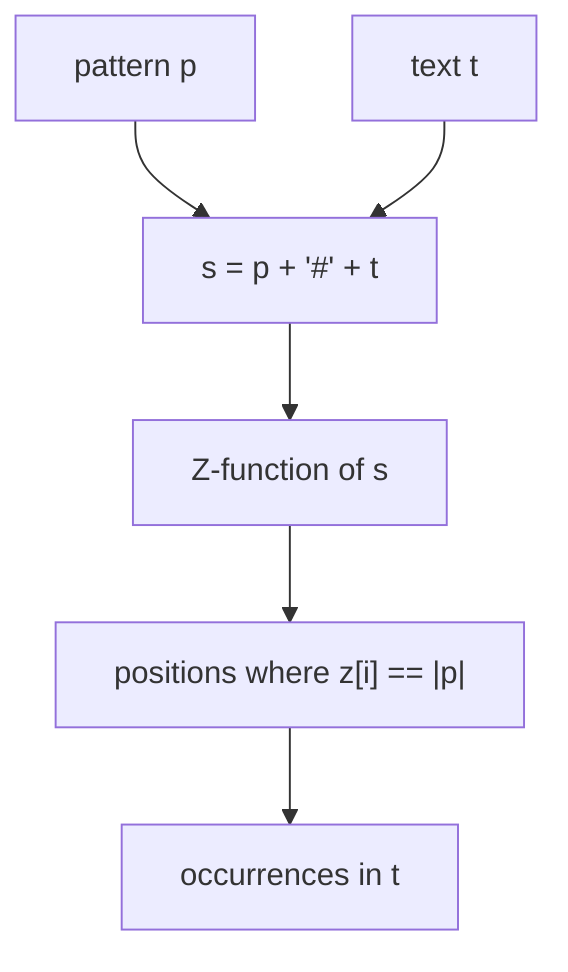

# The Z-Function (Z-Array) — Junior Level

> **One-line summary:** The Z-function of a string `s` produces an array `z` where `z[i]` is the length of the longest substring starting at position `i` that *also* matches a prefix of `s`. You can compute the whole array in **O(n)** using a sliding `[l, r]` window (the "Z-box"), and it powers fast pattern matching, distinct-substring counting, and period detection.

---

## Table of Contents

1. [Introduction](#introduction)
2. [Prerequisites](#prerequisites)
3. [Glossary](#glossary)
4. [Core Concepts](#core-concepts)
5. [Big-O Summary](#big-o-summary)
6. [Real-World Analogies](#real-world-analogies)
7. [Pros & Cons](#pros--cons)
8. [Step-by-Step Walkthrough](#step-by-step-walkthrough)
9. [Code Examples](#code-examples)
10. [Coding Patterns](#coding-patterns)
11. [Error Handling](#error-handling)
12. [Performance Tips](#performance-tips)
13. [Best Practices](#best-practices)
14. [Edge Cases & Pitfalls](#edge-cases--pitfalls)
15. [Common Mistakes](#common-mistakes)
16. [Cheat Sheet](#cheat-sheet)
17. [Visual Animation](#visual-animation)
18. [Summary](#summary)
19. [Further Reading](#further-reading)

---

## Introduction

Suppose you have a long string `s` and you keep asking the same question at different starting positions: *"How far does the text starting here keep agreeing with the very beginning of the string?"* If `s = "aabaab"`, then starting at position 3 the text reads `"aab"`, and that matches the prefix `"aab"` of `s` for 3 characters before the string runs out. So the answer at position 3 is `3`.

The **Z-function** answers this question for *every* position at once. It is an array `z` of the same length as `s`, defined by:

> **`z[i]` = the length of the longest common prefix between `s` and the suffix of `s` starting at index `i`.**

In plain words: stand at index `i`, and the prefix of `s` (index `0`); walk forward in lock-step comparing characters; `z[i]` is how many characters match before the first mismatch (or before you fall off the end).

The naive way to fill this array compares characters position by position, which costs `O(n²)` in the worst case (think `s = "aaaa…a"`). The beautiful result of this topic is that you can fill the entire array in **linear `O(n)` time** using a clever trick: you remember the rightmost match window you have already discovered — called the **Z-box** `[l, r]` — and *reuse* the work already done inside that window instead of re-comparing from scratch.

Why should you care? Because the Z-function is one of the simplest linear-time string tools, and it solves a surprising number of problems with a single short function:

- **Pattern matching** — find all occurrences of a pattern `p` inside a text `t` by running the Z-function on `p + separator + t`.
- **Counting distinct substrings**, **detecting periods and borders**, **string compression**, and **comparing prefixes**.

It is the sibling of the **KMP prefix function** (topic `01-kmp`): both are linear-time prefix tools, and you can convert one into the other. Many people find the Z-function easier to reason about because its definition is so direct: *"how long does this suffix agree with the prefix?"*

A quick orientation before the details: the Z-function is *not* a search structure you build once and query many times (that is what suffix arrays and automata are for). It is a single linear pass that produces one array, which you then read or scan to answer a question. For finding one pattern in one text, that single pass is all you need — and it is exactly as fast asymptotically as the more famous KMP algorithm, while (for many learners) being easier to derive from scratch in an interview.

---

## Prerequisites

Before reading this file you should be comfortable with:

- **Strings and 0-based indexing** — `s[0]` is the first character, `s[n-1]` the last.
- **Substrings, prefixes, and suffixes** — a *prefix* starts at index 0; a *suffix* starts at some index `i` and runs to the end.
- **Arrays / lists** — the Z-function output is an integer array the same length as `s`.
- **Simple loops and the two-pointer idea** — we keep two indices `l` and `r` that define a window.
- **Big-O notation** — `O(n)`, `O(n²)`, and why linear beats quadratic.

Optional but helpful:

- A glance at the **KMP prefix function** (sibling `01-kmp`), since the Z-function is its close cousin.
- The concept of **amortized analysis** — why a pointer that "only moves forward" gives linear total work.

---

## Glossary

| Term | Meaning |
|------|---------|
| **Prefix** | A substring that starts at index `0`. The prefix of length `m` is `s[0..m-1]`. |
| **Suffix** | A substring that starts at some index `i` and runs to the end: `s[i..n-1]`. |
| **Z-function / Z-array** | The array `z` where `z[i]` = length of the longest common prefix of `s` and the suffix `s[i..]`. |
| **`z[i]`** | The Z-value at `i`: how many characters from `i` match the start of `s`. |
| **Z-box `[l, r]`** | The interval of the rightmost match found so far: `s[l..r]` equals a prefix `s[0..r-l]`. |
| **`l` (left of box)** | The start index of the current rightmost matching segment. |
| **`r` (right of box)** | The (inclusive) end index of the current rightmost matching segment. |
| **Border** | A string that is both a proper prefix and a proper suffix of `s`. |
| **Period** | A length `p` such that `s[i] == s[i+p]` for all valid `i`; the string "repeats" every `p`. |
| **Separator** | A character that appears in neither pattern nor text, used to glue them together for matching. |
| **Amortized** | "Averaged over the whole run" — a single step may be slow, but the total across all steps is linear. |

---

## Core Concepts

### 1. The definition, made concrete

For a string `s` of length `n`, the array `z` has length `n`. By the most common convention `z[0]` is set to `0` (or sometimes `n`); the *interesting* values are `z[1], z[2], …, z[n-1]`. For each `i ≥ 1`:

```
z[i] = max length L such that  s[0..L-1] == s[i..i+L-1]
```

Example: `s = "aabxaab"` (indices 0..6):

```
index : 0 1 2 3 4 5 6
char  : a a b x a a b
z     : 0 1 0 0 3 1 0
```

- `z[1] = 1`: suffix `"abxaab"` shares only `"a"` with prefix `"aab…"`.
- `z[4] = 3`: suffix `"aab"` matches the prefix `"aab"` for 3 characters (then the string ends).
- `z[5] = 1`: suffix `"ab"` shares only `"a"`.

Read each `z[i]` as a little measurement: "line up the start of the string with position `i`, and count how many characters agree before they differ (or before the string ends)". `z[0]` is left at `0` because comparing the string with itself from the start is not useful information. Every other entry is a genuine measurement against the prefix.

### 2. The naive O(n²) version

The brute-force version just compares characters directly:

```
for i in 1..n-1:
    L = 0
    while i + L < n and s[L] == s[i+L]:
        L += 1
    z[i] = L
```

This is correct but slow: on `s = "aaaa…a"` every position matches almost to the end, so the inner loop runs `O(n)` times for each of the `n` positions — `O(n²)` total. We need the box trick to make it linear.

It is worth keeping the naive version around even after you learn the fast one: it is the perfect *oracle* for testing. The linear box version must produce the exact same array as the naive version on every input, so a quick "do they agree on a thousand random short strings?" check catches almost any bug in the tricky box logic. We return to this testing idea throughout the topic.

### 3. The Z-box `[l, r]` — remembering the rightmost match

The key idea: as we compute `z[i]` for increasing `i`, we keep track of the **rightmost** interval `[l, r]` we have ever confirmed to match a prefix. That is, `s[l..r] == s[0..r-l]`. This `[l, r]` is the **Z-box**: it is a "free preview" of the prefix that we can reuse.

When we reach a new index `i`, there are two situations, and the whole cleverness lives in telling them apart:

- **Case A — `i` is *inside* the box (`i ≤ r`).** Because `s[l..r]` mirrors the prefix, the character at `i` corresponds to the character at `i - l` in the prefix. So we already *know* a Z-value there: `z[i - l]`. We can copy it — but only as far as the box reaches. Concretely we set `z[i] = min(z[i - l], r - i + 1)`. The `r - i + 1` clamps us to the box boundary, because beyond `r` we have not actually compared anything yet.

- **Case B — `i` is *outside* the box (`i > r`), or the copy reached the box edge.** Here we have no free information, so we compare characters explicitly starting from `z[i]` (which may be `0` or the copied value), extending as long as `s[z[i]] == s[i + z[i]]`.

After computing `z[i]`, if `i + z[i] - 1 > r`, the match extends past the old box, so we **update** the box: `l = i`, `r = i + z[i] - 1`.

In summary, the loop body for each `i` is just three short steps: (1) if inside the box, copy the clamped mirror value as a starting point; (2) try to extend by direct comparison; (3) if the match now reaches further right than the box, move the box to cover it. Three lines of logic, and the entire array fills in linear time.

### 4. Why it is linear (the amortization)

Here is the part that surprises people. The magic is that `r` **only ever moves forward** (it never decreases). Every explicit character comparison that *succeeds* pushes `r` one step to the right. Since `r` goes from `0` up to at most `n - 1` over the whole run, there are at most `n` successful comparisons in total across *all* positions. Each position also does at most one *failing* comparison. So the total comparison count is `O(n)` — even though any single `z[i]` might take many comparisons, the *sum* is linear. This is the heart of the "box reuse" amortization, proved formally in [`professional.md`](./professional.md).

### 5. Pattern matching — the concatenation trick

To find all occurrences of a pattern `p` (length `m`) in a text `t` (length `nt`), build:

```
s = p + '#' + t          # '#' is a separator not in p or t
```

Compute `z` on `s`. Wherever `z[i] == m` for an index `i` in the text part, the pattern occurs at that spot. (Why exactly `m` and not more? Because the prefix's `m`-th character is the separator, which never appears in the text, so the match is forced to stop at length `m`.) The separator guarantees no match can "spill over" from the pattern into the text. The occurrence in `t` is at position `i - (m + 1)`.

This little trick is the Z-function's headline application. You turn "find `p` in `t`" into "build one combined string and run Z once", then read off the answers. No automaton, no failure links — just a concatenation and a scan for the value `m`. We walk through a full matching example with the actual Z values in `middle.md`.

### 6. Periods and borders from Z

A border of length `b` exists when the suffix starting at `i = n - b` matches the prefix for the rest of the string — i.e. `z[i] == n - i`. The smallest period is `n - (longest border length)`. This connects directly to the KMP prefix function, which is the standard period/border tool (sibling `01-kmp`).

---

## Big-O Summary

| Operation | Time | Space | Notes |
|-----------|------|-------|-------|
| Naive Z-function | **O(n²)** | O(n) | Re-compares from scratch each position. |
| Z-function with Z-box | **O(n)** | O(n) | The `r` pointer moves only forward. |
| Pattern matching via `p#t` | **O(n + m)** | O(n + m) | One Z-pass over the concatenation. |
| Count distinct substrings | O(n²) | O(n) | Add one suffix at a time, Z each prefix. |
| Smallest period / border | O(n) | O(n) | One Z-pass plus a scan. |
| Z ↔ prefix-function convert | O(n) | O(n) | Linear conversion either direction. |

The headline number is **O(n)** to build the entire Z-array — the same asymptotic cost as KMP, with arguably simpler intuition.

---

## Real-World Analogies

| Concept | Analogy |
|---------|---------|
| `z[i]` | Standing at a side street and asking "how many blocks does this street match the *main avenue* before they diverge?" |
| The Z-box `[l, r]` | A photocopy of part of the main avenue you already walked; if your new side street overlaps the copy, you read the answer off the copy instead of re-walking. |
| Copying `z[i - l]` | "I already measured this exact stretch earlier; reuse that measurement." |
| Clamping to `r - i + 1` | The photocopy only covers up to block `r`; beyond that you must walk and look for yourself. |
| `r` only moving forward | You never re-walk a block you have already mapped; each block is mapped once, so total walking is linear. |
| The separator `#` in matching | A locked gate between the pattern and the text so a match can never straddle the boundary. |

Where the analogy breaks: streets are physical and you cannot "copy" them, but in a string the prefix really does reappear, so the copy is exact and free.

---

## Pros & Cons

| Pros | Cons |
|------|------|
| Linear **O(n)** time to build the whole array. | Only relates suffixes to the *prefix* — not arbitrary substring comparisons (use suffix arrays for that). |
| Very direct definition; easy to reason about and to debug by hand. | Pattern matching needs a separator and a concatenated string (extra memory). |
| Tiny code — a single short loop with two pointers. | The `min(z[i-l], r-i+1)` clamp is a classic off-by-one trap. |
| Solves matching, periods, borders, distinct substrings with one tool. | For repeated queries on one fixed text, a suffix automaton/array can be better. |
| Conceptually interchangeable with the KMP prefix function. | Operates on a fixed alphabet of comparable units; Unicode needs care (see `senior.md`). |

A balanced view: the Z-function is a sharp, simple tool for a specific job — relating a string's suffixes to its prefix in one linear pass. It is not a Swiss-army knife. The moment your problem needs many patterns, repeated queries on a fixed text, or fuzzy matching, the right answer is a different, heavier structure. Knowing the Z-function's lane is as valuable as knowing the algorithm itself.

**When to use:** single pattern search, period/border detection, prefix-comparison tasks, or any time you want a clean linear-time prefix tool and find the Z definition more intuitive than KMP.

**When NOT to use:** many patterns at once (use Aho-Corasick, sibling `05-aho-corasick`), repeated substring queries on a static text (suffix structures), or approximate matching.

---

## Step-by-Step Walkthrough

Let us compute the Z-array of `s = "aabxaayaab"` (length 10) by hand, watching the box.

```
index : 0 1 2 3 4 5 6 7 8 9
char  : a a b x a a y a a b
```

Start with `l = 0, r = 0`, and `z[0] = 0` by convention. The walkthrough uses *inclusive* `r` (so `r` is the last matching index, and the clamp is `min(z[i-l], r-i+1)`); the code examples below use *exclusive* `r`. Both are standard — just be consistent within one implementation.

**i = 1** (`i > r`, Case B): compare from scratch. `s[0]='a'` vs `s[1]='a'` match; `s[1]='a'` vs `s[2]='b'` mismatch. So `z[1] = 1`. Since `i + z[i] - 1 = 1 > r = 0`, update box: `l = 1, r = 1`.

**i = 2** (`i > r`, Case B): `s[0]='a'` vs `s[2]='b'` mismatch. `z[2] = 0`. Box unchanged.

**i = 3** (`i > r`, Case B): `s[0]='a'` vs `s[3]='x'` mismatch. `z[3] = 0`.

**i = 4** (`i > r`, Case B): compare `s[0]='a'`=`s[4]='a'`, `s[1]='a'`=`s[5]='a'`, `s[2]='b'`≠`s[6]='y'`. So `z[4] = 2`. Update box: `l = 4, r = 5`.

**i = 5** (`i ≤ r = 5`, Case A): `z[i - l] = z[1] = 1`, clamp `r - i + 1 = 1`. So start `z[5] = min(1, 1) = 1`. Since it hit the box edge, try extending: `s[1]='a'` vs `s[6]='y'` mismatch. `z[5] = 1`. Box unchanged (`i + z - 1 = 5` not `> r`).

**i = 6** (`i > r`, Case B): `s[0]='a'` vs `s[6]='y'` mismatch. `z[6] = 0`.

**i = 7** (`i > r`, Case B): `s[0]='a'`=`s[7]='a'`, `s[1]='a'`=`s[8]='a'`, `s[2]='b'`=`s[9]='b'`, then end of string. `z[7] = 3`. Update box: `l = 7, r = 9`.

**i = 8** (`i ≤ r = 9`, Case A): `z[i - l] = z[1] = 1`, clamp `r - i + 1 = 2`. `z[8] = min(1, 2) = 1`. Did not hit the box edge (1 < 2), so no extension needed. `z[8] = 1`.

**i = 9** (`i ≤ r = 9`, Case A): `z[i - l] = z[2] = 0`, clamp `r - i + 1 = 1`. `z[9] = min(0, 1) = 0`.

Final Z-array:

```
index : 0 1 2 3 4 5 6 7 8 9
char  : a a b x a a y a a b
z     : 0 1 0 0 2 1 0 3 1 0
```

Notice positions 5, 8, 9 were resolved **without re-comparing from scratch** — that is the box reuse paying off.

If you trace this with the animation open, watch the box `[l, r]` jump forward at i=1, i=4, and i=7 (the three times we discovered a longer match), and stay put otherwise. The right edge `r` goes `1 → 5 → 9` and never moves left. That monotone forward march of `r` is the visual signature of the linear-time guarantee: the algorithm never "re-walks" ground it has already mapped.

---

## Code Examples

### Example: Build the Z-array in O(n)

#### Go

```go
package main

import "fmt"

func zFunction(s string) []int {
	n := len(s)
	z := make([]int, n)
	// z[0] is conventionally 0 (the whole-string match is not useful here)
	l, r := 0, 0
	for i := 1; i < n; i++ {
		if i < r {
			// Case A: i is inside the box; copy, clamped to the box edge
			z[i] = min(r-i, z[i-l])
		}
		// Case B / extend: compare explicitly past what we know
		for i+z[i] < n && s[z[i]] == s[i+z[i]] {
			z[i]++
		}
		if i+z[i] > r {
			l, r = i, i+z[i] // r is exclusive here (one past the match)
		}
	}
	return z
}

func min(a, b int) int {
	if a < b {
		return a
	}
	return b
}

func main() {
	fmt.Println(zFunction("aabxaayaab")) // [0 1 0 0 2 1 0 3 1 0]
}
```

> Note: this version stores `r` as *exclusive* (one past the last matching index), which removes a `+1`/`-1` and is a very common style. The walkthrough used inclusive `r`; both are correct as long as you are consistent.

#### Java

```java
import java.util.Arrays;

public class ZFunction {
    static int[] zFunction(String s) {
        int n = s.length();
        int[] z = new int[n];
        int l = 0, r = 0; // r exclusive
        for (int i = 1; i < n; i++) {
            if (i < r) {
                z[i] = Math.min(r - i, z[i - l]);
            }
            while (i + z[i] < n && s.charAt(z[i]) == s.charAt(i + z[i])) {
                z[i]++;
            }
            if (i + z[i] > r) {
                l = i;
                r = i + z[i];
            }
        }
        return z;
    }

    public static void main(String[] args) {
        System.out.println(Arrays.toString(zFunction("aabxaayaab")));
        // [0, 1, 0, 0, 2, 1, 0, 3, 1, 0]
    }
}
```

#### Python

```python
def z_function(s):
    n = len(s)
    z = [0] * n
    l, r = 0, 0  # r exclusive
    for i in range(1, n):
        if i < r:
            z[i] = min(r - i, z[i - l])
        while i + z[i] < n and s[z[i]] == s[i + z[i]]:
            z[i] += 1
        if i + z[i] > r:
            l, r = i, i + z[i]
    return z


if __name__ == "__main__":
    print(z_function("aabxaayaab"))  # [0, 1, 0, 0, 2, 1, 0, 3, 1, 0]
```

**What it does:** builds the Z-array for the walkthrough string in linear time.
**Run:** `go run main.go` | `javac ZFunction.java && java ZFunction` | `python z.py`

---

## Coding Patterns

### Pattern 1: Naive Z (the oracle you test against)

**Intent:** Before trusting the box version, compute Z the slow obvious way and check they agree on small inputs.

```python
def z_naive(s):
    n = len(s)
    z = [0] * n
    for i in range(1, n):
        L = 0
        while i + L < n and s[L] == s[i + L]:
            L += 1
        z[i] = L
    return z
```

This is `O(n²)` but a perfect correctness oracle: the linear version must match it on every string. Generate random strings over a small alphabet like `{a, b}` and assert the two functions agree — small alphabets create lots of matches and thus exercise the box-copy branch most thoroughly.

### Pattern 2: Pattern matching via concatenation

**Intent:** Find all occurrences of `p` in `t`.

```python
def find_all(p, t, sep="#"):
    s = p + sep + t
    z = z_function(s)
    m = len(p)
    return [i - (m + 1) for i in range(m + 1, len(s)) if z[i] == m]
```

Each index `i` with `z[i] == m` marks a full pattern match; subtract the offset `m + 1` to get the position in `t`.



### Pattern 3: Smallest period via Z

**Intent:** Find the shortest repeating unit of `s`.

For example, `"abcabcabc"` has smallest period `3` (the unit `"abc"`), and `"aaaa"` has smallest period `1` (the unit `"a"`). A string with no shorter repeating unit, like `"abcd"`, has period equal to its own length.

The smallest period is `n - b`, where `b` is the longest border length — and a border of length `b` exists iff `z[n - b] == b`. Scan `i` from small to large; the first `i` with `i + z[i] == n` gives period `i`.

This is one of the most common uses of the Z-array beyond plain matching: questions like "is this string just a short pattern repeated?" or "what is the shortest building block?" reduce to a single Z-pass plus a quick scan. We cover the full period/border story in `middle.md`; for now the takeaway is that the same array that powers matching also reveals a string's internal repetition structure.

---

## Error Handling

| Error | Cause | Fix |
|-------|-------|-----|
| Wrong `z[0]` | Set to `n` when downstream code expects `0`. | Pick one convention (usually `0`) and document it. |
| Off-by-one in the clamp | Confused inclusive vs exclusive `r`. | Pick one style; if `r` exclusive, use `min(r - i, z[i-l])`. |
| Match spilling across boundary | Forgot the separator in `p + t`. | Always insert a separator absent from both strings. |
| Index out of range | Inner loop reads `s[i + z[i]]` past the end. | Guard with `i + z[i] < n` before comparing. |
| Empty string crash | `n = 0` and code reads `z[0]`. | Return an empty array for empty input. |
| Separator collides | `#` appears in the data. | Choose a separator guaranteed outside the alphabet. |

---

## Performance Tips

- **Compare bytes, not decoded characters** in hot loops; indexing a byte slice is faster than repeatedly decoding (see `senior.md` for Unicode).
- **Keep `r` exclusive** to drop one arithmetic operation per iteration; small but real in tight loops.
- **Avoid building the full `p + sep + t` string** if memory is tight; you can run a streaming variant that only needs the Z-values of the pattern plus a running comparison (advanced — see `senior.md`).
- **Reuse the array** across calls if you process many strings of similar length, to dodge repeated allocation.
- **Short-circuit** when you only need the first match — stop as soon as `z[i] == m`.

---

## Best Practices

- Always test the linear Z against the naive oracle (Pattern 1) on random small strings before trusting it.
- State your `z[0]` and `r`-inclusivity conventions in a comment; they are the two most common sources of confusion.
- Use a clearly out-of-alphabet separator for matching, and assert it does not appear in the inputs.
- Keep the Z-function as a small, separately tested helper; build matching, period detection, etc. on top of it.
- When in doubt about a tricky case, hand-trace 5–6 positions like the walkthrough above.
- Prefer the exclusive-`r` style in fresh code; it makes the clamp `min(r - i, z[i - l])` and avoids the `+1`/`-1` that causes most off-by-one bugs.
- Treat the Z-function as a tiny library function with a fixed signature (`string → []int`); resist the urge to inline its loop into a bigger function where the box logic is harder to verify.

---

## Edge Cases & Pitfalls

- **Empty string** — return `[]`; do not touch `z[0]`.
- **Single character** — `z = [0]` (or `[1]` if you use the `z[0] = n` convention).
- **All identical characters** (`"aaaa"`) — Z values are `[0, 3, 2, 1]`; this is the worst case for the *naive* method but the box keeps the linear version fast. This input is also the best single test case to confirm your box logic works, since it exercises copying heavily.
- **No matches at all** (`"abcdef"`) — every `z[i]` for `i ≥ 1` is `0`.
- **Pattern longer than text** — no occurrences; the loop simply never finds `z[i] == m`.
- **Separator inside data** — silently produces wrong matches; the most dangerous pitfall.
- **Inclusive vs exclusive `r`** — mixing the two conventions yields off-by-one bugs that pass small tests and fail on edge cases.

---

## Common Mistakes

1. **Using inclusive `r` with the exclusive-`r` clamp** (`min(r - i + 1, …)` vs `min(r - i, …)`) — off by one.
2. **Forgetting the boundary guard** `i + z[i] < n` before comparing — index out of range.
3. **Omitting the separator** in pattern matching — matches leak across the join.
4. **Re-comparing from index 0** instead of starting the extension at the copied `z[i]` — kills the linear-time guarantee.
5. **Not updating the box** after a longer match — later positions lose their free preview and the run degrades toward `O(n²)`.
6. **Confusing Z with the prefix function** — they are siblings but not identical; `z[i]` looks *forward*, the prefix function `π[i]` looks at the *longest border ending at i* (see `middle.md`).
7. **Assuming `z[0]` is meaningful** — by convention it is `0`; downstream code should never rely on it being the full length unless you chose that convention.

---

## Cheat Sheet

| Question | Tool | Formula |
|----------|------|---------|
| Longest prefix matched at `i` | the Z-array | `z[i]` |
| Does `p` occur in `t`? | concat + Z | some `z[i] == |p|` in the text part |
| Occurrence position in `t` | concat + Z | `i - (|p| + 1)` |
| Is there a border of length `b`? | Z | `z[n - b] == b` |
| Smallest period | Z scan | first `i` with `i + z[i] == n` → period `i` |
| Worst case for naive | — | `"aaaa…a"` → `O(n²)` |

Core algorithm:

```
zFunction(s):
    z[0] = 0; l = r = 0          # r exclusive
    for i in 1..n-1:
        if i < r: z[i] = min(r - i, z[i - l])     # Case A: copy inside box
        while i+z[i] < n and s[z[i]] == s[i+z[i]]: z[i]++   # Case B: extend
        if i + z[i] > r: l, r = i, i + z[i]        # grow the box
    return z
# cost: O(n) — r only moves forward
```

---

## Visual Animation

> See [`animation.html`](./animation.html) for an interactive visualization.
>
> The animation demonstrates:
> - The string with the current index `i` highlighted
> - The `[l, r]` Z-box drawn as a shaded window
> - Whether we **copy** `z[i - l]` (Case A) or **extend** by explicit comparison (Case B)
> - The resulting `z[i]` value filled in per position
> - Step / Run / Reset controls and an editable input string

---

## Summary

The Z-function turns the question *"how far does each suffix agree with the prefix?"* into a single linear-time array. The naive comparison is `O(n²)`, but by maintaining the rightmost match window `[l, r]` — the Z-box — and reusing the already-computed `z[i - l]` inside it, the work amortizes to `O(n)` because the right pointer `r` only ever moves forward. With this one array you can match patterns (run Z on `p + # + t` and look for `z[i] == |p|`), detect borders and periods, and compare prefixes. It is the close sibling of the KMP prefix function (sibling `01-kmp`), often easier to grasp thanks to its direct definition. Master the `min(z[i-l], r-i)` copy and the extend-and-grow-box loop, and you have a tool that powers a whole family of string problems.

If you remember only one thing, make it this: `z[i]` measures how far the suffix at `i` agrees with the prefix, and the `[l, r]` box lets you copy that measurement for free whenever `i` falls inside a previously discovered match — re-comparing only past the box edge. Everything else in this topic is built on that one idea.

---

## Further Reading

- cp-algorithms.com — "Z-function" (the canonical linear-time derivation).
- Sibling topic `01-kmp` — the prefix function and its border theory; the Z ↔ prefix conversion.
- Sibling topic `03-rabin-karp` — hashing-based matching, a useful contrast to Z-based matching.
- Gusfield, *Algorithms on Strings, Trees, and Sequences* — the Z-algorithm is presented first there as the foundation of linear-time matching.
- Sibling topic `05-aho-corasick` — when you need many patterns at once instead of one.
- Sibling topic `04-suffix-arrays` — for arbitrary substring comparisons beyond the prefix.
