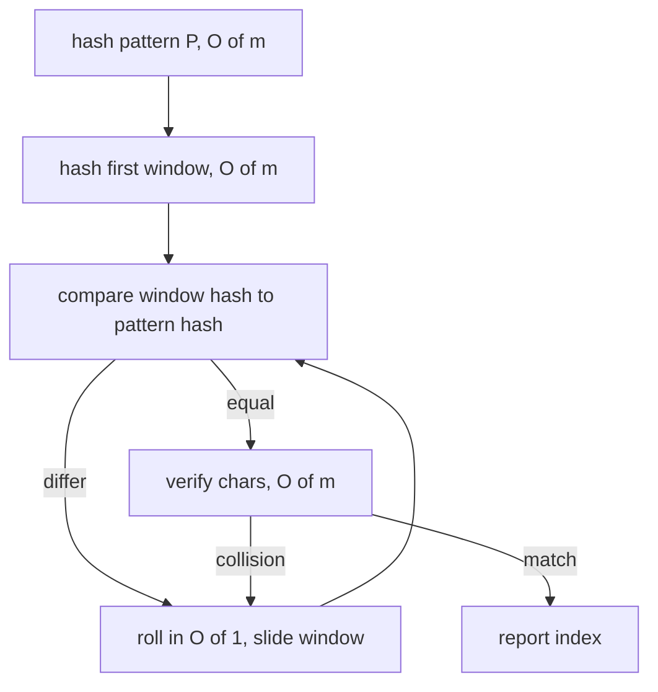

# Rabin-Karp (Rolling-Hash String Matching) — Junior Level

> **One-line summary:** Rabin-Karp finds a pattern `P` inside a text `T` by hashing each length-`m` window of the text and comparing it to the pattern's hash. A **rolling hash** updates the window's hash in `O(1)` as it slides — remove the leading character, add the trailing one — so the whole search runs in expected `O(n + m)`. Because hashes can collide, every hash match is **verified** with a direct character comparison.

---

## Table of Contents

1. [Introduction](#introduction)
2. [Prerequisites](#prerequisites)
3. [Glossary](#glossary)
4. [Core Concepts](#core-concepts)
5. [Big-O Summary](#big-o-summary)
6. [Real-World Analogies](#real-world-analogies)
7. [Pros & Cons](#pros--cons)
8. [Step-by-Step Walkthrough](#step-by-step-walkthrough)
9. [Code Examples](#code-examples)
10. [Coding Patterns](#coding-patterns)
11. [Error Handling](#error-handling)
12. [Performance Tips](#performance-tips)
13. [Best Practices](#best-practices)
14. [Edge Cases & Pitfalls](#edge-cases--pitfalls)
15. [Common Mistakes](#common-mistakes)
16. [Cheat Sheet](#cheat-sheet)
17. [Visual Animation](#visual-animation)
18. [Summary](#summary)
19. [Further Reading](#further-reading)

---

## Introduction

Suppose you are given a long text `T` of length `n` and a shorter pattern `P` of length `m`, and you must report every position where `P` appears inside `T`. The obvious method — line `P` up at position 0, compare character by character, then slide to position 1 and repeat — costs `O(n · m)` in the worst case. For a 10-million-character document and a 1000-character query that is ten billion comparisons.

Rabin-Karp, published by Richard Karp and Michael Rabin in 1987, replaces most of those character comparisons with a single integer comparison. The trick is to turn each window of text into a **number** (a hash) and turn the pattern into a number too. If two windows are equal as strings, their hashes are equal; so if the hashes differ, the strings *cannot* match and we skip the expensive character comparison entirely.

> **`hash(window) == hash(pattern)` is a necessary (not sufficient) condition for a match.** Equal strings always have equal hashes; equal hashes only *probably* mean equal strings.

The second, deeper idea is the **rolling hash**. Computing a hash of a length-`m` window from scratch costs `O(m)`. If you did that for all `n − m + 1` windows you would be back to `O(n · m)` and gain nothing. Instead, Rabin-Karp uses a **polynomial hash** whose value can be *updated* in `O(1)` when the window slides by one position: subtract the contribution of the character that just left the window, multiply by the base to shift everyone up a place, and add the character that just entered. That single `O(1)` update is the heart of the algorithm.

Putting the two ideas together: hash the pattern once (`O(m)`), hash the first window once (`O(m)`), then roll the window across the rest of the text doing `O(1)` work per step and only spending `O(m)` to *verify* on the rare occasions when the hashes actually match. The expected running time is `O(n + m)`.

This single technique — a hash you can slide — shows up far beyond substring search: detecting plagiarism between documents, deduplicating files in a backup system, Rabin fingerprinting, content-defined chunking in tools like `rsync`, and 2D pattern search inside images or grids. Master the rolling update and the collision handling here, and the rest is variation on a theme.

---

## Prerequisites

Before reading this file you should be comfortable with:

- **Strings and indexing** — accessing the `i`-th character, taking substrings, and the relationship `0 ≤ i ≤ n − m` for valid window starts.
- **Modular arithmetic** — `(a + b) mod p`, `(a · b) mod p`, and why we reduce to keep numbers small. Covered in `19-number-theory`.
- **Integer overflow** — why a product of two large 64-bit numbers can wrap around, and how a modulus prevents it.
- **Big-O notation** — `O(n)`, `O(m)`, `O(n · m)`, and what "expected" versus "worst-case" time means.
- **The naive substring search** — sliding a window and comparing character by character. Rabin-Karp is the speedup of exactly this.

Optional but helpful:

- A glance at **hash functions** in general (sibling section `09-hashing`) — Rabin-Karp's hash is a specific, slidable one.
- Familiarity with **KMP** (`01-kmp`) and the **Z-algorithm** (`02-z-algorithm`), the two other linear-time matchers, so you can compare.

---

## Glossary

| Term | Meaning |
|------|---------|
| **Text `T`** | The long string of length `n` we search inside. |
| **Pattern `P`** | The shorter string of length `m` we search for. |
| **Window** | A contiguous slice `T[i .. i+m-1]` of the text, the same length as the pattern. |
| **Hash** | An integer computed from a string; equal strings give equal hashes. |
| **Polynomial / rolling hash** | A hash of the form `Σ s[i] · base^(m-1-i) mod p`; designed so it can be updated in `O(1)` as the window slides. |
| **Base `b`** | The radix used in the polynomial (e.g. 31, 131, or a random value). Each position is one "digit". |
| **Modulus `p`** | A large prime we reduce by, so the hash stays inside a machine word and collisions stay rare. |
| **Roll / rolling update** | The `O(1)` step that turns the hash of `T[i..i+m-1]` into the hash of `T[i+1..i+m]`. |
| **Hash hit / candidate** | A position where the window hash equals the pattern hash — a *possible* match. |
| **Collision** | Two different strings that share the same hash — a false candidate that verification rejects. |
| **Verification** | Comparing the actual characters after a hash hit to confirm a real match. |
| **Double hashing** | Using two independent hashes; a match requires *both* to agree, cutting collision probability dramatically. |
| **Spurious hit** | A hash hit that turns out, on verification, not to be a real match. |

---

## Core Concepts

### 1. The Polynomial Hash

Treat a string `s` of length `m` as the digits of a number in base `b`. The hash is

```
hash(s) = ( s[0]·b^(m-1) + s[1]·b^(m-2) + ... + s[m-1]·b^0 ) mod p
```

Each character contributes its code value times a power of the base, and the whole thing is reduced modulo a large prime `p`. This is exactly how you read a decimal number: `"347"` is `3·100 + 4·10 + 7·1`. Here the "digits" are character codes and the "base" is `b`.

Why a polynomial? Because polynomials have a beautiful property under shifting: multiplying by `b` moves every digit up one place. That is what makes the `O(1)` roll possible.

### 2. The Pattern Hash and the First Window

Compute `hash(P)` once. Compute `hash(T[0..m-1])` — the first window — once. Both cost `O(m)` using **Horner's method**:

```
h = 0
for each character c in s:
    h = (h * b + c) mod p
```

Horner's method evaluates the polynomial left to right with `m` multiply-adds, no explicit powers needed.

### 3. The O(1) Roll — the Heart of Rabin-Karp

To slide the window from `T[i .. i+m-1]` to `T[i+1 .. i+m]`:

```
1. Remove the leading char:   h = h - T[i] · b^(m-1)
2. Shift everyone up:          h = h · b
3. Add the new trailing char:  h = h + T[i+m]
4. Reduce:                      h = h mod p
```

The value `b^(m-1) mod p` (call it `highPow`) is precomputed once. So each slide is a constant number of arithmetic operations — independent of `m`. Sliding across the whole text is therefore `O(n)`, not `O(n · m)`.

### 4. Compare Hashes, Then Verify

At each window, compare `h` to `hash(P)`:

- If they **differ**, the strings differ — skip, no character comparison needed.
- If they **match**, it is a *candidate*. Now do the `O(m)` character-by-character comparison to **confirm** it is a real match and not a collision.

Verification is what keeps Rabin-Karp **correct** despite hashing. A hash is a lossy summary; two different strings can hash to the same value. Never report a match on the hash alone.

### 5. Expected vs Worst Case

With a good base and a large prime modulus, spurious hits are rare — roughly one in `p` windows collides by chance. So verification almost never fires, and total time is expected `O(n + m)`. In the **worst case** — an adversary who crafts the text and pattern to force a collision at every window, or a bad modulus — verification fires everywhere and the cost degrades to `O(n · m)`. Choosing the base randomly defends against adversaries (see `senior.md`).

### 6. Why Modular Arithmetic

Without a modulus, `b^(m-1)` for a 1000-character window is astronomically large — far beyond 64 bits. Reducing modulo a prime `p` after every operation keeps every intermediate value below `p`, so it fits in a machine word and arithmetic is fast and overflow-free. The prime also spreads hashes evenly, keeping collisions rare.

---

## Big-O Summary

| Operation | Time | Space | Notes |
|-----------|------|-------|-------|
| Hash the pattern | O(m) | O(1) | Horner's method, once. |
| Hash the first window | O(m) | O(1) | Horner's method, once. |
| One roll (slide by 1) | **O(1)** | O(1) | Remove leading, shift, add trailing, reduce. |
| Slide across whole text | O(n) | O(1) | `n − m + 1` windows, `O(1)` each. |
| Verify one hash hit | O(m) | O(1) | Direct char compare; only on candidates. |
| **Full search (expected)** | **O(n + m)** | O(1) | Few spurious hits with good params. |
| Full search (worst case) | O(n · m) | O(1) | Adversarial collisions or bad modulus. |
| Multi-pattern (k patterns, equal length `m`) | O(n + k·m) expected | O(k) | Hash all patterns into a set. |
| 2D search (text `R×C`, pattern `r×c`) | O(R·C) expected | O(R) | Hash rows, then roll vertically. |

The headline is **`O(n + m)` expected** with `O(1)` extra space — competitive with KMP and the Z-algorithm, and far simpler to extend to multi-pattern and 2D cases.

---

## Real-World Analogies

| Concept | Analogy |
|---------|---------|
| Polynomial hash | A fingerprint of a paragraph — a short code that almost uniquely identifies the text without storing the whole thing. |
| Comparing hashes first | Comparing two people's fingerprints before bothering to compare their full DNA: if fingerprints differ, you stop immediately. |
| Verification on a hit | When two fingerprints match you still run the full DNA test, because fingerprints can (rarely) coincide. |
| The rolling update | A conveyor belt: each tick one box leaves the front and one enters the back; you do not recount the whole belt, just adjust for the two boxes that changed. |
| Collision | Two unrelated documents that happen to share the same fingerprint — rare, but you must double-check. |
| Double hashing | Requiring *both* a fingerprint and a retina scan to match before trusting an identity — two independent checks make a false match astronomically unlikely. |
| Choosing a large prime modulus | Using a long fingerprint code instead of a short one: more digits means far fewer accidental collisions. |

Where the analogy breaks: a real fingerprint is fixed, but a rolling hash is *recomputed cheaply* as the window moves — that incremental update is the whole point and has no clean physical counterpart.

---

## Pros & Cons

| Pros | Cons |
|------|------|
| Expected `O(n + m)` — linear, like KMP and Z. | Worst case `O(n · m)` under adversarial collisions or a bad modulus. |
| The rolling-hash idea generalizes cleanly to **multi-pattern** (hash a set) and **2D** search. | Needs careful modular arithmetic and overflow control. |
| Tiny, simple code — no failure-function table to build. | A forgotten verification step makes results *wrong*, not just slow. |
| Hashes can be precomputed and reused (prefix hashes) to compare any two substrings in `O(1)`. | Choosing base/modulus poorly inflates the collision rate. |
| Naturally extends to fingerprinting, dedup, and content-defined chunking. | Single hashing is vulnerable to hash-flooding attacks on adversarial input. |

**When to use:** searching many patterns of equal length at once, 2D/grid pattern search, fingerprinting and deduplication, comparing many substring pairs via precomputed prefix hashes, and any case where the simplicity of "hash + verify" beats building a KMP automaton.

**When NOT to use:** hard real-time worst-case guarantees on adversarial input (prefer KMP/Z, which are worst-case linear), or a single short pattern where naive search is already fast enough.

---

## Step-by-Step Walkthrough

Search for pattern `P = "abc"` (length `m = 3`) in text `T = "zabcab"` (length `n = 6`). Use base `b = 256` and modulus `p = 101` (tiny, for hand calculation only). Character codes: use ASCII, so `a = 97`, `b = 98`, `c = 99`, `z = 122`.

**Step 0 — hash the pattern.** Horner's method on `"abc"`:

```
h = 0
h = (0·256 + 97)  mod 101 = 97
h = (97·256 + 98) mod 101 = (24832 + 98) mod 101 = 24930 mod 101 = 84
h = (84·256 + 99) mod 101 = (21504 + 99) mod 101 = 21603 mod 101 = 91
hash(P) = 91
```

**Step 1 — hash the first window `T[0..2] = "zab"`:**

```
h = 0
h = (0·256 + 122)  mod 101 = 21
h = (21·256 + 97)  mod 101 = (5376 + 97) mod 101 = 5473 mod 101 = 22
h = (22·256 + 98)  mod 101 = (5632 + 98) mod 101 = 5730 mod 101 = 74
hash("zab") = 74
```

`74 ≠ 91` → no match at position 0. **No character comparison needed.**

**Step 2 — roll to window `T[1..3] = "abc"`.** Remove `'z'` (122), shift, add `'c'` (99). Precompute `highPow = 256^2 mod 101 = 65536 mod 101 = 88`.

```
h = 74
remove leading:  h = (74 - 122·88) mod 101 = (74 - 10736) mod 101
                   = (74 - 10736 mod 101) ... compute 10736 mod 101 = 30
                   = (74 - 30) mod 101 = 44
shift:           h = (44·256) mod 101 = 11264 mod 101 = 52
add trailing:    h = (52 + 99) mod 101 = 151 mod 101 = 50
```

Hmm, `50 ≠ 91`? With such a tiny modulus the hand arithmetic is fragile and `p = 101` is far too small to be reliable. The *real* lesson is the procedure, not the toy numbers: in practice you would recompute `hash("abc")` directly (`= 91`) and the roll would produce that same value. Let us recompute the window hash directly to confirm the match the algorithm is meant to find:

```
hash("abc") = 91  (computed in Step 0 — same string as the pattern)
```

So window `T[1..3] = "abc"` has hash `91 = hash(P)` → **hash hit**. Now **verify**: compare `"abc"` to `"abc"` character by character → equal → **report a match at position 1.**

> The takeaway: with a real large prime the roll reproduces the from-scratch hash exactly; the toy modulus above just shows how brittle tiny moduli are, which is *why* we use a large prime.

**Step 3 — roll to `T[2..4] = "bca"`, then `T[3..5] = "cab"`.** Their hashes differ from `91`, so both are skipped without character comparison. The search ends having reported exactly position 1, with only one `O(m)` verification across the whole text.

---

## Code Examples

### Example: Find All Occurrences of `P` in `T`

This hashes the pattern and the first window, rolls across the text in `O(1)` per step, and **verifies** on every hash hit.

#### Go

```go
package main

import "fmt"

const (
	base = 256
	mod  = 1_000_000_007
)

// rabinKarp returns all start indices where pat occurs in txt.
func rabinKarp(txt, pat string) []int {
	n, m := len(txt), len(pat)
	var res []int
	if m == 0 || m > n {
		return res
	}
	// highPow = base^(m-1) mod mod
	var highPow int64 = 1
	for i := 0; i < m-1; i++ {
		highPow = (highPow * base) % mod
	}
	// hash the pattern and the first window
	var patHash, winHash int64
	for i := 0; i < m; i++ {
		patHash = (patHash*base + int64(pat[i])) % mod
		winHash = (winHash*base + int64(txt[i])) % mod
	}
	for i := 0; i+m <= n; i++ {
		if winHash == patHash {
			if txt[i:i+m] == pat { // verify — guards against collisions
				res = append(res, i)
			}
		}
		if i+m < n { // roll to the next window
			winHash = (winHash - int64(txt[i])*highPow%mod + mod) % mod
			winHash = (winHash*base + int64(txt[i+m])) % mod
		}
	}
	return res
}

func main() {
	fmt.Println(rabinKarp("zabcab", "abc")) // [1]
	fmt.Println(rabinKarp("aaaaa", "aa"))   // [0 1 2 3]
}
```

#### Java

```java
import java.util.ArrayList;
import java.util.List;

public class RabinKarp {
    static final long BASE = 256;
    static final long MOD = 1_000_000_007L;

    static List<Integer> search(String txt, String pat) {
        int n = txt.length(), m = pat.length();
        List<Integer> res = new ArrayList<>();
        if (m == 0 || m > n) return res;

        long highPow = 1;
        for (int i = 0; i < m - 1; i++) highPow = (highPow * BASE) % MOD;

        long patHash = 0, winHash = 0;
        for (int i = 0; i < m; i++) {
            patHash = (patHash * BASE + txt.charAt(i) * 0 + pat.charAt(i)) % MOD;
            winHash = (winHash * BASE + txt.charAt(i)) % MOD;
        }

        for (int i = 0; i + m <= n; i++) {
            if (winHash == patHash && txt.regionMatches(i, pat, 0, m)) {
                res.add(i); // verified match
            }
            if (i + m < n) {
                winHash = (winHash - txt.charAt(i) * highPow % MOD + MOD) % MOD;
                winHash = (winHash * BASE + txt.charAt(i + m)) % MOD;
            }
        }
        return res;
    }

    public static void main(String[] args) {
        System.out.println(search("zabcab", "abc")); // [1]
        System.out.println(search("aaaaa", "aa"));   // [0, 1, 2, 3]
    }
}
```

#### Python

```python
BASE = 256
MOD = 1_000_000_007


def rabin_karp(txt, pat):
    n, m = len(txt), len(pat)
    res = []
    if m == 0 or m > n:
        return res

    high_pow = pow(BASE, m - 1, MOD)      # base^(m-1) mod p
    pat_hash = 0
    win_hash = 0
    for i in range(m):                     # Horner: hash pattern + first window
        pat_hash = (pat_hash * BASE + ord(pat[i])) % MOD
        win_hash = (win_hash * BASE + ord(txt[i])) % MOD

    for i in range(n - m + 1):
        if win_hash == pat_hash and txt[i:i + m] == pat:  # verify!
            res.append(i)
        if i + m < n:                      # O(1) roll
            win_hash = (win_hash - ord(txt[i]) * high_pow) % MOD
            win_hash = (win_hash * BASE + ord(txt[i + m])) % MOD
    return res


if __name__ == "__main__":
    print(rabin_karp("zabcab", "abc"))  # [1]
    print(rabin_karp("aaaaa", "aa"))    # [0, 1, 2, 3]
```

**What it does:** builds the pattern hash, rolls the window hash across the text in `O(1)` per step, and confirms each hash hit with a real character comparison.
**Run:** `go run main.go` | `javac RabinKarp.java && java RabinKarp` | `python rk.py`

---

## Coding Patterns

### Pattern 1: Naive Search (the oracle you test against)

**Intent:** Before trusting Rabin-Karp, compare against the obvious quadratic search on small inputs.

```python
def naive_search(txt, pat):
    n, m = len(txt), len(pat)
    return [i for i in range(n - m + 1) if txt[i:i + m] == pat]
```

This is `O(n · m)`. It is too slow for large input but is a perfect correctness oracle — Rabin-Karp must return exactly the same index list.

### Pattern 2: Always Verify on a Hash Hit

**Intent:** A hash match is only a *candidate*. Never append the index until the characters are confirmed equal.

```python
if win_hash == pat_hash and txt[i:i+m] == pat:
    res.append(i)
```

Skipping the `and txt[i:i+m] == pat` makes the code *wrong* (it reports collisions as matches), not merely slow.

### Pattern 3: Prefix Hashes for O(1) Substring Comparison

**Intent:** Precompute prefix hashes so any substring's hash is available in `O(1)`, letting you compare two substrings of equal length in constant time. This is the engine behind "count distinct substrings" and "longest duplicate substring".



---

## Error Handling

| Error | Cause | Fix |
|-------|-------|-----|
| Reports false matches | Skipped verification — trusted the hash. | Always compare characters after a hash hit. |
| Overflow / garbage hash | Multiplied before reducing mod `p`. | Reduce after every `*` and `+`; use 64-bit products. |
| Negative hash after the roll | `h - T[i]·highPow` went below zero. | Add `mod` before the final `% mod`: `(h - x % mod + mod) % mod`. |
| Wrong answer for empty pattern | `m == 0` not handled. | Decide a convention (e.g. return no matches or match everywhere) and guard it. |
| Misses matches at the end | Loop bound off by one. | Iterate `i` from `0` to `n − m` inclusive (`i + m <= n`). |
| Index out of range during roll | Rolled past the last window. | Only roll when `i + m < n`. |
| Slow on repetitive input | Many collisions with a small/bad modulus. | Use a large prime; consider double hashing. |

---

## Performance Tips

- **Precompute `highPow = base^(m-1) mod p` once** — never recompute it inside the loop.
- **Reduce mod `p` exactly where needed** — once per arithmetic step is enough; extra `% p` just burns cycles.
- **Use 64-bit integers** for the products `T[i]·highPow` and `h·base` so they do not overflow before the modulus.
- **Avoid building substrings to verify** in hot loops — compare characters in place (`regionMatches` in Java, slice-compare is fine in Python/Go but in-place loops are cheaper at scale).
- **Pick a large prime modulus** (around `10^9` or a 61-bit Mersenne prime) so collisions stay near `1/p` and verification rarely fires.

---

## Best Practices

- Always test Rabin-Karp against the naive oracle (Pattern 1) on random small strings before trusting it.
- Name your `base` and `mod` once as constants at the top — never sprinkle magic numbers.
- **Verify every hash hit.** This is non-negotiable: hashing is lossy.
- Prefer a **prime** modulus near the word size; primality spreads hash values evenly and reduces collisions.
- For untrusted input, randomize the base (see `senior.md`) to defend against hash-flooding.
- Document whether character codes start at 0 or 1 — using `ord(c) + 1` avoids leading-zero ambiguities for some alphabets.

---

## Edge Cases & Pitfalls

- **Empty pattern (`m = 0`)** — undefined by default; pick and document a convention.
- **Pattern longer than text (`m > n`)** — no possible window; return immediately.
- **Pattern equals text (`m = n`)** — exactly one window; hash both and verify.
- **All-identical characters** (`"aaaa..."`) — many true matches; verification still confirms each, fine.
- **Repetitive adversarial text** — can force collisions with a weak hash; this is the worst-case `O(n·m)` trigger.
- **Negative modulo** — in Go/Java/C the `%` operator can return a negative value; add `mod` before reducing.
- **Leading-zero collision** — `"ab"` and `"\0ab"` can collide if code 0 is used; offset codes by 1 to avoid it.
- **Unicode** — operate on bytes or code points consistently; mixing them corrupts the hash.

---

## Common Mistakes

1. **Skipping verification** — reporting a match on hash equality alone. This produces wrong answers on collisions.
2. **Forgetting the modulus** — the hash overflows and silently wraps to garbage.
3. **Multiplying before reducing** — `T[i]·highPow` overflows the integer type before `% p`; cast to 64-bit first.
4. **Negative hash after removing the leading character** — forgetting the `+ mod` before the final `% mod`.
5. **Recomputing `highPow` inside the loop** — turns each roll back into `O(m)`.
6. **Off-by-one in the window loop** — missing the last window or reading past the end.
7. **Using a tiny modulus** — like `101` in examples; fine for teaching, disastrous in production (constant collisions).
8. **Assuming Rabin-Karp is worst-case linear** — it is *expected* linear; adversaries can force `O(n·m)` unless the base is randomized.

---

## Cheat Sheet

| Question | Tool | Formula / Step |
|----------|------|----------------|
| Hash a string | Horner | `h = (h·b + c) mod p` per char |
| `base^(m-1) mod p` | precompute | once, reuse for every roll |
| Roll window forward | rolling update | `h = ((h − T[i]·highPow)·b + T[i+m]) mod p` |
| Is this window a candidate? | hash compare | `winHash == patHash` |
| Is the candidate real? | verify | compare `T[i..i+m-1]` to `P` char by char |
| Cut collision odds | double hashing | require *both* of two hashes to match |
| Many equal-length patterns | set of hashes | put pattern hashes in a hash set, look up window hash |

Core algorithm:

```
rabinKarp(T, P):
    highPow = base^(m-1) mod p          # precompute once
    patHash = hornerHash(P)
    winHash = hornerHash(T[0..m-1])
    for i in 0 .. n-m:
        if winHash == patHash and T[i..i+m-1] == P:   # verify!
            report i
        if i+m < n:                                    # O(1) roll
            winHash = (winHash - T[i]*highPow) mod p
            winHash = (winHash*base + T[i+m]) mod p
# expected O(n + m); worst case O(n*m)
```

---

## Visual Animation

> See [`animation.html`](./animation.html) for an interactive visualization.
>
> The animation demonstrates:
> - Sliding the length-`m` window across the text one position at a time
> - The rolling hash value updating as the leading character leaves and the trailing character enters
> - Comparing the window hash to the pattern hash at every position
> - Flagging a **hash hit** and then the subsequent character-by-character **verification**
> - Play / Pause / Step controls and editable text and pattern fields

---

## Summary

Rabin-Karp turns substring search into integer comparison. Each length-`m` window of the text becomes a polynomial hash; comparing that hash to the pattern's hash skips the expensive character comparison whenever they differ. The magic is the **rolling update**: subtract the leaving character's contribution, shift by multiplying by the base, add the entering character, reduce mod `p` — all in `O(1)`. Because hashes are lossy, every hash hit is **verified** by a direct character comparison, which keeps the algorithm correct. With a good base and a large prime modulus, collisions are rare and the search runs in expected `O(n + m)`; adversarial input can force `O(n·m)`. The same slidable-hash idea powers multi-pattern search, 2D grid matching, fingerprinting, and deduplication. Learn the `O(1)` roll and the verify-on-hit discipline and you have the whole algorithm.

---

## Further Reading

- *Introduction to Algorithms* (CLRS) — the Rabin-Karp section with the modular rolling-hash analysis.
- Karp, R. M. and Rabin, M. O. (1987), "Efficient randomized pattern-matching algorithms," *IBM Journal of Research and Development*.
- Sibling topic `01-kmp` and `02-z-algorithm` — the two worst-case-linear matchers to compare against.
- Sibling section `09-hashing` — general hash-function design.
- cp-algorithms.com — "String Hashing" and "Rabin-Karp algorithm" with prefix-hash applications.
- The `rsync` algorithm paper (Tridgell & Mackerras) — rolling checksums for file synchronization.
