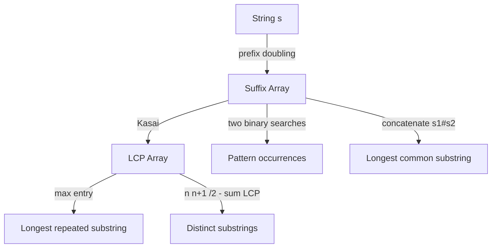

# Suffix Arrays (and the LCP Array) — Junior Level

> **One-line summary:** A **suffix array** `SA` is the list of starting positions of all suffixes of a string `s`, sorted in lexicographic (dictionary) order. Paired with the **LCP array** (longest common prefix between adjacent sorted suffixes), it powers fast substring search, distinct-substring counting, and longest-repeated/common-substring queries — all without the pointer overhead of a suffix tree.

---

## Table of Contents

1. [Introduction](#introduction)
2. [Prerequisites](#prerequisites)
3. [Glossary](#glossary)
4. [Core Concepts](#core-concepts)
5. [Big-O Summary](#big-o-summary)
6. [Real-World Analogies](#real-world-analogies)
7. [Pros & Cons](#pros--cons)
8. [Step-by-Step Walkthrough](#step-by-step-walkthrough)
9. [Code Examples](#code-examples)
10. [Coding Patterns](#coding-patterns)
11. [Error Handling](#error-handling)
12. [Performance Tips](#performance-tips)
13. [Best Practices](#best-practices)
14. [Edge Cases & Pitfalls](#edge-cases--pitfalls)
15. [Common Mistakes](#common-mistakes)
16. [Cheat Sheet](#cheat-sheet)
17. [Visual Animation](#visual-animation)
18. [Summary](#summary)
19. [Further Reading](#further-reading)

---

## Introduction

Take the word `banana`. It has six suffixes, one starting at each position:

```
index 0: banana
index 1: anana
index 2: nana
index 3: ana
index 4: na
index 5: a
```

A **suffix array** is simply the answer to one question: *"if I sorted those six suffixes into dictionary order, what starting index would each one have?"* For `banana` the sorted order is `a, ana, anana, banana, nana, na`, which corresponds to starting indices `5, 3, 1, 0, 4, 2`. That list of indices — `[5, 3, 1, 0, 4, 2]` — **is** the suffix array. We never store the suffix strings themselves; just their starting positions, sorted.

Why is this useful? Because once the suffixes are sorted, every substring of `s` is a *prefix* of some suffix, and all occurrences of a pattern `p` form a **contiguous block** in the sorted order. That single fact turns "does `p` occur in `s`, and where?" into a **binary search** over the suffix array, costing `O(m log n)` for a pattern of length `m` in a text of length `n`. No giant lookup table, no preprocessing per query — just a sorted list of integers.

The suffix array's constant companion is the **LCP array**. `LCP[i]` is the length of the longest common prefix shared by the suffix at sorted rank `i` and the one at rank `i-1` (the two adjacent suffixes in sorted order). For `banana` the adjacent pairs `a / ana`, `ana / anana`, `anana / banana`, … share prefixes of length `1, 3, 0, 0, 2`. The LCP array unlocks a second family of answers: the number of **distinct substrings**, the **longest repeated substring**, and (via a clever concatenation trick) the **longest common substring of two strings**.

The headline cost is construction. The naive way — generate all `n` suffixes and sort them with ordinary string comparison — is `O(n² log n)` because each comparison can scan up to `n` characters. The elegant way is **prefix doubling**: sort by the first 1 character, then the first 2, then the first 4, doubling each round, reusing the previous round's ranks so each round is one sort. That gives `O(n log² n)`, or `O(n log n)` if you replace the comparison sort with a radix/counting sort on rank pairs. There is even a truly linear `O(n)` method (SA-IS / DC3) used in production. The LCP array is then built in `O(n)` by **Kasai's algorithm**. This file focuses on the two ideas you must internalize first: *what the arrays mean*, and *the prefix-doubling construction*.

Suffix arrays are the practical sibling of the **suffix tree** (`13-suffix-tree-ukkonen`) and the **suffix automaton** (`12-suffix-automaton`): the same queries, far less memory, and a much friendlier cache profile. They also relate to the **Burrows-Wheeler Transform / FM-index** (`10-burrows-wheeler-transform`), which is built directly from a suffix array.

---

## Prerequisites

Before reading this file you should be comfortable with:

- **Strings and indexing** — characters, zero-based positions, and what a *suffix* and a *prefix* are.
- **Lexicographic order** — dictionary comparison: compare character by character; the first difference decides; a shorter string that is a prefix of a longer one sorts first (`a` before `ab`).
- **Sorting and comparators** — how a comparison-based sort works, and what "stable" means.
- **Binary search** — finding a boundary in a sorted array in `O(log n)`.
- **Arrays and basic loops** — everything here is index arithmetic over a few integer arrays.
- **Big-O notation** — `O(n log n)`, `O(n log² n)`, `O(m log n)`.

Optional but helpful:

- A glance at **counting sort / radix sort**, since the `O(n log n)` construction replaces the comparison sort with one of these.
- Familiarity with the idea of a **sentinel** character (a unique smallest symbol like `$`) appended to the string.

---

## Glossary

| Term | Meaning |
|------|---------|
| **Suffix** | The substring `s[i..n-1]` starting at index `i` and running to the end. There are `n` of them. |
| **Suffix array `SA`** | An array of length `n` where `SA[r]` is the starting index of the suffix ranked `r` in sorted order. |
| **Rank array `rank`** | The inverse of `SA`: `rank[i]` is the sorted position of the suffix starting at index `i`. `rank[SA[r]] = r`. |
| **LCP** | Longest Common Prefix: the length of the longest prefix two strings share. |
| **LCP array** | `LCP[r]` = length of the longest common prefix of suffix `SA[r]` and suffix `SA[r-1]` (adjacent in sorted order). `LCP[0]` is undefined / `0`. |
| **Prefix doubling** | Construction that sorts suffixes by their first `1, 2, 4, …, 2^t` characters, reusing previous ranks. |
| **Kasai's algorithm** | An `O(n)` algorithm that fills the LCP array using the rank array, exploiting that the LCP drops by at most 1 as you walk positions. |
| **Sentinel `$`** | A unique character smaller than every real character, appended to `s` so no suffix is a prefix of another. |
| **Lexicographic order** | Dictionary order on strings, compared character by character. |
| **Distinct substrings** | The number of different substrings of `s`; computable from `SA` + `LCP`. |

---

## Core Concepts

### 1. The Suffix Array Is Sorted Starting Positions

For a string `s` of length `n`, list its `n` suffixes (one per starting index), sort them lexicographically, and write down the starting indices in that sorted order. The resulting array of indices is the suffix array `SA`. It is a *permutation* of `0, 1, …, n-1`. You never materialize the suffix strings; the index tells you where each begins, and the string `s` itself is the source of truth.

```
s = "banana"  (n = 6)
sorted suffixes:   a(5)  ana(3)  anana(1)  banana(0)  na(4)  nana(2)
SA              = [ 5,    3,      1,        0,         4,     2 ]
```

### 2. The Rank Array Is the Inverse

The **rank** array answers the reverse question: "what is the sorted position of the suffix that starts at index `i`?" It is the inverse permutation of `SA`:

```
rank[SA[r]] = r      and      SA[rank[i]] = i
```

For `banana`, `rank = [3, 2, 5, 1, 4, 0]` (the suffix at index 0 is 4th in sorted order → rank 3, etc.). The rank array is essential to prefix doubling and to Kasai's LCP algorithm.

### 3. Why Sorted Suffixes Make Search Fast

Every substring of `s` is the prefix of at least one suffix. If a pattern `p` occurs in `s`, then every occurrence corresponds to a suffix that *starts with* `p`. Because the suffixes are sorted, all suffixes starting with `p` sit in a single **contiguous range** of the suffix array. Two binary searches — one for the leftmost such suffix, one for the rightmost — bracket that range. The width of the range is the number of occurrences, and `SA` entries inside it give their positions. Each binary-search comparison compares `p` (length `m`) against a suffix, so the cost is `O(m log n)`.

### 4. The LCP Array

`LCP[r]` is the length of the longest common prefix between the suffix at sorted rank `r` and the one at rank `r-1`. It measures how much two *adjacent* sorted suffixes overlap at their start:

```
rank r   suffix        LCP[r]
0        a             -        (no previous; treat as 0)
1        ana           1        (shared "a")
2        anana         3        (shared "ana")
3        banana        0        (shared "")
4        na            0        (shared "")
5        nana          2        (shared "na")
```

The LCP array is where the *combinatorial* power lives: the **longest repeated substring** is the longest entry in `LCP` (length `max(LCP)`, located at that adjacent pair), and the count of **distinct substrings** is `n(n+1)/2 − Σ LCP[r]` (total substrings minus the repeats that adjacent suffixes share).

### 5. Prefix Doubling Construction (the heart of this topic)

Naive sorting compares whole suffixes — up to `n` characters per comparison — giving `O(n² log n)`. Prefix doubling avoids that. The idea: after you know the sorted order of suffixes by their **first `k` characters**, you can compute the order by their **first `2k` characters** cheaply. Why? Because a suffix's first `2k` characters split into two halves of `k` characters each, and you already have a *rank* for each `k`-length block. So you sort suffixes by the **pair** `(rank of first k chars, rank of next k chars)`. After each round `k` doubles: `1 → 2 → 4 → 8 → …`. After `⌈log₂ n⌉` rounds every suffix has a unique rank and you are done.

```
Round k=1: sort by first 1 char           → ranks by single characters
Round k=2: sort by (rank_k1[i], rank_k1[i+1]) → ranks by first 2 chars
Round k=4: sort by (rank_k2[i], rank_k2[i+2]) → ranks by first 4 chars
... double k until all ranks are distinct
```

Each round is one sort of `n` pairs. With a comparison sort that is `O(n log n)` per round × `O(log n)` rounds = `O(n log² n)`. Replace the comparison sort with a two-pass **radix/counting sort** on the integer pairs and each round drops to `O(n)`, giving `O(n log n)` overall.

### 6. Kasai's `O(n)` LCP Algorithm

Once `SA` and `rank` are known, Kasai's algorithm computes the LCP array in linear time. The trick: process suffixes in **string order** (by starting index `i = 0, 1, 2, …`), not sorted order. When you move from the suffix at `i` to the suffix at `i+1`, you drop the leading character, and a classic lemma says the LCP value can **decrease by at most 1**. So you carry a running length `h`, never resetting it to 0, and the total work across all positions is `O(n)`. (The proof lives in [`professional.md`](./professional.md).)

### 7. The Sentinel `$`

It is common to append a unique character `$` (smaller than every real character) to `s` before building the suffix array. This guarantees no suffix is a prefix of another (they all differ at the `$`), which simplifies comparisons and makes some applications cleaner. Many implementations skip it and handle prefixes directly; either is fine as long as you are consistent.

---

## Big-O Summary

| Operation | Time | Space | Notes |
|-----------|------|-------|-------|
| Naive SA (sort full suffixes) | `O(n² log n)` | `O(n)` extra | Each comparison scans up to `n` chars. |
| **Prefix doubling (comparison sort)** | **`O(n log² n)`** | `O(n)` | One sort per doubling round, `log n` rounds. |
| **Prefix doubling (radix/counting sort)** | **`O(n log n)`** | `O(n)` | Replaces comparison sort with `O(n)` radix per round. |
| SA-IS / DC3 (linear construction) | `O(n)` | `O(n)` | Production-grade; complex; see `senior.md`. |
| Kasai's LCP array | **`O(n)`** | `O(n)` | After `SA` and `rank` are known. |
| Pattern search (occurrence range) | `O(m log n)` | `O(1)` | Two binary searches, `m` = pattern length. |
| Count distinct substrings | `O(n)` after `SA`+`LCP` | `O(n)` | `n(n+1)/2 − Σ LCP`. |
| Longest repeated substring | `O(n)` after `SA`+`LCP` | `O(n)` | `max(LCP)` and its location. |

The number to remember: build in **`O(n log n)`**, build LCP in **`O(n)`**, search in **`O(m log n)`**.

---

## Real-World Analogies

| Concept | Analogy |
|---------|---------|
| Suffix array | The index at the back of a textbook: every topic (substring) can be found by jumping to a sorted list of page references (positions). |
| Sorted suffixes | A dictionary where, instead of words, you list every "tail" of a long text in alphabetical order. |
| Binary search on `SA` | Flipping a dictionary open in the middle and deciding "earlier" or "later" — `log n` flips reach any word. |
| LCP array | The "shared spelling" between two neighbouring dictionary entries: `apple` and `apply` share `appl` (LCP 4). |
| Prefix doubling | Sorting a deck of cards first by suit, then refining within each suit by rank — each pass uses the previous pass's grouping. |
| Distinct substrings via LCP | Counting unique phrases by removing the overlapping repeats that consecutive sorted entries already covered. |

Where the analogy breaks: a real dictionary stores the words; the suffix array stores only *positions* and reconstructs substrings on demand from the original text, which is exactly why it is so memory-efficient.

---

## Pros & Cons

| Pros | Cons |
|------|------|
| Tiny memory: a few `int` arrays of length `n` (vs. pointer-heavy suffix trees). | Construction is conceptually trickier than a trie/suffix tree. |
| Excellent cache locality — contiguous integer arrays, no pointer chasing. | A plain SA needs the `LCP` array (and sometimes more) to match a suffix tree's query power. |
| `O(m log n)` substring search with no per-query preprocessing. | Search is `O(m log n)`, slightly slower than a suffix tree's `O(m)` (but constants favour SA in practice). |
| `SA` + `LCP` answers distinct-substring, longest-repeated, longest-common-substring queries. | Linear-time construction (SA-IS/DC3) is hard to implement correctly. |
| Builds in `O(n log n)` with simple prefix doubling; `O(n)` with SA-IS. | Some queries (e.g. arbitrary LCP between two suffixes) need an extra RMQ structure on `LCP`. |
| Foundation for the FM-index / BWT (`10-burrows-wheeler-transform`). | Updating after edits to `s` means rebuilding — not a dynamic structure. |

**When to use:** offline full-text indexing, substring search over a fixed large text, counting/finding repeated or common substrings, bioinformatics (genome indexing), as the backbone of an FM-index.

**When NOT to use:** the text changes frequently (no cheap updates), you need `O(m)` worst-case search and have memory to spare (suffix tree), or `n` is tiny and a direct scan is simpler.

---

## Step-by-Step Walkthrough

Build the suffix array and LCP array for `s = "banana"` by hand.

**Step 1 — list the suffixes with their indices.**

```
0: banana
1: anana
2: nana
3: ana
4: na
5: a
```

**Step 2 — sort them lexicographically.** Compare character by character; a string that is a prefix of another sorts first.

```
a        (index 5)
ana      (index 3)
anana    (index 1)
banana   (index 0)
na       (index 4)
nana     (index 2)
```

**Step 3 — read off the suffix array** (the indices in sorted order):

```
SA = [5, 3, 1, 0, 4, 2]
```

**Step 4 — build the rank array** (inverse of `SA`): `rank[SA[r]] = r`.

```
SA[0]=5 → rank[5]=0
SA[1]=3 → rank[3]=1
SA[2]=1 → rank[1]=2
SA[3]=0 → rank[0]=3
SA[4]=4 → rank[4]=4
SA[5]=2 → rank[2]=5
rank = [3, 2, 5, 1, 4, 0]
```

**Step 5 — compute the LCP array** by comparing each sorted suffix with the previous one:

```
r=0  a                    LCP[0] = 0   (no predecessor)
r=1  ana    vs  a         common "a"          → LCP[1] = 1
r=2  anana  vs  ana       common "ana"        → LCP[2] = 3
r=3  banana vs  anana     common ""           → LCP[3] = 0
r=4  na     vs  banana    common ""           → LCP[4] = 0
r=5  nana   vs  na        common "na"         → LCP[5] = 2
LCP = [0, 1, 3, 0, 0, 2]
```

**Step 6 — read answers off the arrays.**

- *Longest repeated substring:* the biggest LCP is `3` at `r=2`, between `ana` and `anana`. So `ana` is the longest substring that appears at least twice (positions 1 and 3). ✓
- *Distinct substrings:* total substrings `= n(n+1)/2 = 6·7/2 = 21`. Subtract `Σ LCP = 0+1+3+0+0+2 = 6`. Distinct `= 21 − 6 = 15`.
- *Search for `"ana"`:* binary search finds it occupying sorted ranks `1..2` (`ana` and `anana` both start with `ana`), so `"ana"` occurs twice, at positions `SA[1]=3` and `SA[2]=1`. ✓

Every later application is built from exactly these arrays.

---

## Code Examples

### Example: Build the Suffix Array (prefix doubling) and the LCP array (Kasai)

This `O(n log² n)` prefix-doubling construction sorts suffixes by `(rank, next-rank)` pairs, doubling the compared length each round, then fills the LCP array with Kasai's `O(n)` algorithm.

#### Go

```go
package main

import (
	"fmt"
	"sort"
)

// buildSA returns the suffix array of s using prefix doubling (O(n log^2 n)).
func buildSA(s string) []int {
	n := len(s)
	sa := make([]int, n)
	rank := make([]int, n)
	tmp := make([]int, n)
	for i := 0; i < n; i++ {
		sa[i] = i
		rank[i] = int(s[i]) // initial rank = the character itself
	}
	for k := 1; k < n; k <<= 1 {
		cmp := func(a, b int) bool {
			if rank[a] != rank[b] {
				return rank[a] < rank[b]
			}
			ra, rb := -1, -1 // rank of the second half (-1 if past the end)
			if a+k < n {
				ra = rank[a+k]
			}
			if b+k < n {
				rb = rank[b+k]
			}
			return ra < rb
		}
		sort.Slice(sa, func(i, j int) bool { return cmp(sa[i], sa[j]) })
		// recompute ranks from the new order
		tmp[sa[0]] = 0
		for i := 1; i < n; i++ {
			tmp[sa[i]] = tmp[sa[i-1]]
			if cmp(sa[i-1], sa[i]) {
				tmp[sa[i]]++
			}
		}
		copy(rank, tmp)
		if rank[sa[n-1]] == n-1 {
			break // all ranks distinct; sorted
		}
	}
	return sa
}

// buildLCP returns the Kasai LCP array (O(n)); lcp[r] = LCP(sa[r-1], sa[r]).
func buildLCP(s string, sa []int) []int {
	n := len(s)
	rank := make([]int, n)
	for r := 0; r < n; r++ {
		rank[sa[r]] = r
	}
	lcp := make([]int, n)
	h := 0
	for i := 0; i < n; i++ {
		if rank[i] > 0 {
			j := sa[rank[i]-1]
			for i+h < n && j+h < n && s[i+h] == s[j+h] {
				h++
			}
			lcp[rank[i]] = h
			if h > 0 {
				h-- // LCP drops by at most 1 for the next position
			}
		} else {
			h = 0
		}
	}
	return lcp
}

func main() {
	s := "banana"
	sa := buildSA(s)
	lcp := buildLCP(s, sa)
	fmt.Println("SA :", sa)  // [5 3 1 0 4 2]
	fmt.Println("LCP:", lcp) // [0 1 3 0 0 2]
}
```

#### Java

```java
import java.util.*;

public class SuffixArray {
    static int[] rank, tmp;
    static int n, K;

    static int[] buildSA(String s) {
        n = s.length();
        Integer[] sa = new Integer[n];
        rank = new int[n];
        tmp = new int[n];
        for (int i = 0; i < n; i++) {
            sa[i] = i;
            rank[i] = s.charAt(i);
        }
        for (K = 1; K < n; K <<= 1) {
            Comparator<Integer> cmp = (a, b) -> {
                if (rank[a] != rank[b]) return Integer.compare(rank[a], rank[b]);
                int ra = a + K < n ? rank[a + K] : -1;
                int rb = b + K < n ? rank[b + K] : -1;
                return Integer.compare(ra, rb);
            };
            Arrays.sort(sa, cmp);
            tmp[sa[0]] = 0;
            for (int i = 1; i < n; i++) {
                tmp[sa[i]] = tmp[sa[i - 1]] + (cmp.compare(sa[i - 1], sa[i]) < 0 ? 1 : 0);
            }
            for (int i = 0; i < n; i++) rank[i] = tmp[i];
            if (rank[sa[n - 1]] == n - 1) break;
        }
        int[] out = new int[n];
        for (int i = 0; i < n; i++) out[i] = sa[i];
        return out;
    }

    static int[] buildLCP(String s, int[] sa) {
        int n = s.length();
        int[] rnk = new int[n];
        for (int r = 0; r < n; r++) rnk[sa[r]] = r;
        int[] lcp = new int[n];
        int h = 0;
        for (int i = 0; i < n; i++) {
            if (rnk[i] > 0) {
                int j = sa[rnk[i] - 1];
                while (i + h < n && j + h < n && s.charAt(i + h) == s.charAt(j + h)) h++;
                lcp[rnk[i]] = h;
                if (h > 0) h--;
            } else {
                h = 0;
            }
        }
        return lcp;
    }

    public static void main(String[] args) {
        String s = "banana";
        int[] sa = buildSA(s);
        int[] lcp = buildLCP(s, sa);
        System.out.println("SA : " + Arrays.toString(sa));  // [5, 3, 1, 0, 4, 2]
        System.out.println("LCP: " + Arrays.toString(lcp)); // [0, 1, 3, 0, 0, 2]
    }
}
```

#### Python

```python
def build_sa(s):
    """Suffix array via prefix doubling, O(n log^2 n)."""
    n = len(s)
    sa = list(range(n))
    rank = [ord(c) for c in s]
    tmp = [0] * n
    k = 1
    while k < n:
        def key(i):
            second = rank[i + k] if i + k < n else -1
            return (rank[i], second)
        sa.sort(key=key)
        tmp[sa[0]] = 0
        for i in range(1, n):
            tmp[sa[i]] = tmp[sa[i - 1]] + (1 if key(sa[i - 1]) < key(sa[i]) else 0)
        rank = tmp[:]
        if rank[sa[-1]] == n - 1:
            break
        k <<= 1
    return sa


def build_lcp(s, sa):
    """Kasai's LCP array, O(n). lcp[r] = LCP(sa[r-1], sa[r])."""
    n = len(s)
    rank = [0] * n
    for r in range(n):
        rank[sa[r]] = r
    lcp = [0] * n
    h = 0
    for i in range(n):
        if rank[i] > 0:
            j = sa[rank[i] - 1]
            while i + h < n and j + h < n and s[i + h] == s[j + h]:
                h += 1
            lcp[rank[i]] = h
            if h > 0:
                h -= 1
        else:
            h = 0
    return lcp


if __name__ == "__main__":
    s = "banana"
    sa = build_sa(s)
    lcp = build_lcp(s, sa)
    print("SA :", sa)   # [5, 3, 1, 0, 4, 2]
    print("LCP:", lcp)  # [0, 1, 3, 0, 0, 2]
```

**What it does:** builds `SA = [5,3,1,0,4,2]` and `LCP = [0,1,3,0,0,2]` for `banana`, matching the hand computation.
**Run:** `go run main.go` | `javac SuffixArray.java && java SuffixArray` | `python sa.py`

---

## Coding Patterns

### Pattern 1: Naive Suffix Array (the oracle you test against)

**Intent:** Before trusting prefix doubling, build the SA the slow, obvious way and check it agrees on small inputs.

```python
def naive_sa(s):
    n = len(s)
    return sorted(range(n), key=lambda i: s[i:])  # sort by the actual suffix
```

This is `O(n² log n)` (slicing builds whole suffixes), unusable for large `n`, but a perfect correctness oracle: prefix doubling must produce the same array.

### Pattern 2: Pattern Search by Binary Search

**Intent:** Find the contiguous `SA` range of suffixes that start with pattern `p`, giving all occurrences.

```python
import bisect

def occurrences(s, sa, p):
    # lower bound: first suffix >= p ; upper bound: first suffix > p + chr(255)
    lo = bisect.bisect_left(range(len(sa)), True,
                            key=lambda r: s[sa[r]:sa[r] + len(p)] >= p)
    hi = bisect.bisect_left(range(len(sa)), True,
                            key=lambda r: s[sa[r]:sa[r] + len(p)] > p)
    return sorted(sa[lo:hi])  # starting positions of all matches
```

### Pattern 3: Distinct Substrings from LCP

**Intent:** Count all different substrings of `s` in `O(n)` once `SA` and `LCP` exist.

```python
def distinct_substrings(s, sa, lcp):
    n = len(s)
    total = n * (n + 1) // 2          # all substrings counted with repeats
    return total - sum(lcp)           # remove repeats adjacent suffixes share
```



---

## Error Handling

| Error | Cause | Fix |
|-------|-------|-----|
| `SA` is not a permutation of `0..n-1` | Comparator or rank update bug in doubling. | Assert `sorted(SA) == range(n)`; compare against `naive_sa`. |
| LCP entries too large / index out of range | Forgot the `i+h < n` / `j+h < n` bound in Kasai. | Bound both indices before reading characters. |
| Wrong distinct count | Used `n²` instead of `n(n+1)/2`, or summed the wrong array. | Total is `n(n+1)/2`; subtract `Σ LCP`. |
| Search returns false negatives | Compared the whole suffix instead of just the pattern-length prefix. | Compare `s[SA[r] : SA[r]+m]` against `p`. |
| Infinite loop in doubling | `k` never grows or break condition wrong. | Double `k` each round; stop when `rank[SA[n-1]] == n-1`. |
| Off-by-one with sentinel | Mixed sentinel and non-sentinel lengths. | Decide once whether `$` is appended and keep `n` consistent. |

---

## Performance Tips

- **Prefer radix/counting sort** over a comparison sort in the doubling rounds to reach `O(n log n)`; the pairs are small integers, ideal for counting sort.
- **Reuse arrays** — `sa`, `rank`, and `tmp` can be preallocated once and reused across rounds; do not allocate per round.
- **Stop early** — break out of the doubling loop as soon as all ranks are distinct (`rank[SA[n-1]] == n-1`), which often happens before `log n` rounds.
- **Avoid string slicing in hot paths** — in the naive oracle slicing is fine, but in real search compare by index against `s`, never build substrings.
- **Build LCP with Kasai, not pairwise** — pairwise LCP of adjacent suffixes is `O(n²)` worst case; Kasai is `O(n)` and barely more code.

---

## Best Practices

- Always validate prefix doubling against the `naive_sa` oracle (Pattern 1) on random small strings before trusting it on large input.
- Build `rank` as the explicit inverse of `SA` right after construction; many algorithms (Kasai, doubling) need it.
- Keep `SA` and `LCP` together — most applications need both, and computing one without the other is a common omission.
- Decide your sentinel policy once (append `$` or not) and document it; mixing conventions causes subtle off-by-one bugs.
- Write `buildSA`, `buildLCP`, and `search` as small, independently testable functions; most bugs hide in the comparator.

---

## Edge Cases & Pitfalls

- **Empty string** — `n = 0`; `SA` and `LCP` are empty. Guard against it before indexing.
- **Single character** — `SA = [0]`, `LCP = [0]`; trivial but worth a test.
- **All identical characters** (`"aaaa"`) — suffixes nest perfectly; `SA = [3,2,1,0]`, `LCP = [0,1,2,3]`. A great stress test for Kasai.
- **Repeated patterns** (`"abab"`) — verify the longest-repeated-substring logic finds `ab`.
- **Large alphabet** — initial ranks are character codes; fine for ASCII, but for huge alphabets compress to `0..k-1` first.
- **LCP[0] is meaningless** — there is no suffix before rank 0; set it to `0` and never use it as a real LCP.
- **Walks vs. substrings confusion** — a *suffix* runs to the end of the string; a *substring* is any prefix of some suffix. Search compares only the first `m` characters of a suffix.

---

## Common Mistakes

1. **Comparing whole suffixes during search** instead of just the first `m` characters — turns `O(m log n)` search into `O(n log n)`.
2. **Forgetting the inverse `rank` array** — Kasai and doubling both need it; recomputing suffixes instead is `O(n²)`.
3. **Resetting `h` to 0 each iteration in Kasai** — destroys the linear-time guarantee; `h` must only decrease by 1.
4. **Using `n²` for total substrings** — the correct total is `n(n+1)/2`.
5. **Summing the wrong array for distinct count** — subtract `Σ LCP`, not `Σ SA`.
6. **Not stopping doubling early** — wastes rounds after ranks are already distinct (still correct, just slower).
7. **Assuming SA gives substring positions directly** — `SA[r]` is a *starting position*; you still bound the occurrence range with binary search for a given pattern.

---

## Cheat Sheet

| Question | Tool | Formula / Method |
|----------|------|------------------|
| Sorted order of all suffixes | suffix array `SA` | prefix doubling / SA-IS |
| Sorted position of suffix `i` | rank array | `rank[SA[r]] = r` |
| Overlap of adjacent sorted suffixes | LCP array | Kasai's `O(n)` algorithm |
| Does pattern `p` occur, and where? | binary search on `SA` | two bounds, `O(m log n)` |
| Longest repeated substring | LCP array | `max(LCP)` and its location |
| Number of distinct substrings | `SA` + `LCP` | `n(n+1)/2 − Σ LCP[r]` |
| Longest common substring of two strings | concatenate + LCP | see `middle.md` |

Core construction skeleton:

```
buildSA(s):
    sa[i] = i ;  rank[i] = s[i]
    for k = 1; k < n; k *= 2:
        sort sa by (rank[i], rank[i+k])      # radix sort -> O(n)
        recompute rank from the new order
        if all ranks distinct: break
    return sa                                # O(n log n) overall

buildLCP(s, sa):     # Kasai
    h = 0
    for i in 0..n-1 (string order):
        if rank[i] > 0:
            j = sa[rank[i]-1]
            while s[i+h] == s[j+h]: h++
            lcp[rank[i]] = h
            if h > 0: h--
    return lcp                               # O(n)
```

---

## Visual Animation

> See [`animation.html`](./animation.html) for an interactive visualization.
>
> The animation demonstrates:
> - The list of suffixes and their starting indices for an editable string
> - The rank pairs `(rank[i], rank[i+k])` at each prefix-doubling round
> - The sort that refines the order as `k` doubles `1 → 2 → 4 → …`
> - The final suffix array and the Kasai LCP array, with play / pause / step controls

---

## Summary

A suffix array is the sorted list of starting positions of every suffix of `s` — a single integer permutation that, with the original string, encodes the lexicographic order of all suffixes. Its inverse is the rank array, and its companion is the LCP array (overlap of adjacent sorted suffixes). The construction to master is **prefix doubling**: sort suffixes by their first `1, 2, 4, …` characters, reusing the previous round's ranks as the key for the next, giving `O(n log² n)` with a comparison sort or `O(n log n)` with a radix sort; a linear SA-IS/DC3 exists for production. **Kasai's algorithm** fills the LCP array in `O(n)` by exploiting that the LCP drops by at most 1 as you advance the starting position. From `SA` and `LCP` you get `O(m log n)` substring search, `n(n+1)/2 − Σ LCP` distinct substrings, `max(LCP)` longest repeated substring, and (by concatenation) the longest common substring of two strings — the same queries a suffix tree answers, at a fraction of the memory.

---

## Further Reading

- cp-algorithms.com — "Suffix Array" (construction by prefix doubling) and "Kasai's algorithm for LCP".
- Manber & Myers (1990) — the original suffix-array paper with `O(n log n)` construction.
- Kasai et al. (2001) — linear-time LCP array construction.
- Sibling topic `12-suffix-automaton` — a linear-size automaton answering the same substring queries.
- Sibling topic `13-suffix-tree-ukkonen` — the pointer-based cousin with `O(m)` search.
- Sibling topic `10-burrows-wheeler-transform` — the FM-index, built directly from a suffix array.
- *Algorithms on Strings, Trees, and Sequences* (Gusfield) — suffix structures and their applications.
