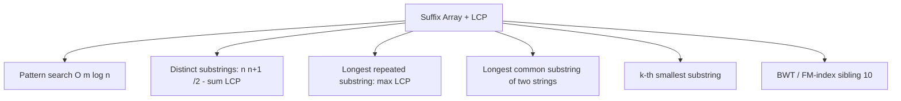

# Suffix Arrays (and the LCP Array) — Middle Level

> **Focus:** the `O(n log n)` prefix-doubling construction with radix sort on rank pairs, Kasai's `O(n)` LCP, pattern search by binary search, and the LCP-driven applications — distinct substrings, longest repeated substring, and longest common substring of two strings via concatenation. Plus where the suffix array sits relative to the suffix automaton and suffix tree.

---

## Table of Contents

1. [Introduction](#introduction)
2. [Deeper Concepts](#deeper-concepts)
3. [Comparison with Alternatives](#comparison-with-alternatives)
4. [Advanced Patterns](#advanced-patterns)
5. [String Applications](#string-applications)
6. [LCP-Driven Queries](#lcp-driven-queries)
7. [Code Examples](#code-examples)
8. [Error Handling](#error-handling)
9. [Performance Analysis](#performance-analysis)
10. [Best Practices](#best-practices)
11. [Visual Animation](#visual-animation)
12. [Summary](#summary)

---

## Introduction

At junior level the message was a definition: `SA` is the sorted starting positions of all suffixes, and `LCP[r]` is how much adjacent sorted suffixes overlap. At middle level you start asking the engineering questions that decide whether your solution is correct *and* fast:

- How do you make prefix doubling `O(n log n)` instead of `O(n log² n)` — what exactly does the radix sort on rank pairs look like?
- Why does Kasai's algorithm run in `O(n)`, and what is the invariant that "the LCP decreases by at most 1" buys you?
- How do you find *all* occurrences of a pattern with two binary searches, and how do you avoid `O(m)` per comparison turning into `O(nm)`?
- How do you count distinct substrings, find the longest repeated substring, and find the longest common substring of two strings — all from `SA` + `LCP`?
- When should you reach for a suffix array versus a suffix automaton (`12-suffix-automaton`) or suffix tree (`13-suffix-tree-ukkonen`)?

These are the questions that separate "I know what a suffix array is" from "I can build one in linear-ish time and answer real queries with it."

---

## Deeper Concepts

### Prefix doubling, restated precisely

Let `rank_k[i]` be the rank of suffix `i` when suffixes are compared by their **first `k` characters** only (ties broken arbitrarily but consistently). The key invariant:

```
The first 2k characters of suffix i  =  (first k chars of suffix i) ++ (first k chars of suffix i+k)
```

So comparing two suffixes by their first `2k` characters is the same as comparing the **pairs** `(rank_k[i], rank_k[i+k])` lexicographically (with `rank_k[i+k] = -1` if `i+k ≥ n`, meaning "the second half is empty and sorts first"). Therefore:

```
rank_0   : sort by single characters
rank_1   : sort by pairs (rank_0[i],  rank_0[i+1])
rank_2   : sort by pairs (rank_1[i],  rank_1[i+2])
rank_3   : sort by pairs (rank_2[i],  rank_2[i+4])
...
```

After round `t`, ranks reflect the first `2^t` characters. Once every rank is distinct (at most `⌈log₂ n⌉` rounds), the order is the final suffix array. The correctness proof (rank after `t` rounds equals the order by the first `2^t` characters) is in [`professional.md`](./professional.md).

### Why radix sort makes it `O(n log n)`

Each round sorts `n` pairs of integers in `[−1, n)`. A comparison sort costs `O(n log n)` per round → `O(n log² n)` total. But sorting **pairs of bounded integers** is exactly what a two-pass **counting/radix sort** does in `O(n)`: first stable-sort by the second key, then stable-sort by the first key. With `O(n)` per round and `O(log n)` rounds, construction drops to `O(n log n)`. This is the standard competitive-programming suffix array.

### Kasai's algorithm and the "drop by at most 1" lemma

Kasai's algorithm computes `LCP[r] = LCP(suffix SA[r-1], suffix SA[r])` in `O(n)`. It processes suffixes in **string order** (`i = 0, 1, …, n-1`), maintaining a running overlap length `h`.

**Lemma.** Let `i` be a position with `rank[i] = r > 0`, and let `j = SA[r-1]` be its predecessor in sorted order. If `LCP` between suffix `i` and suffix `j` is `h`, then for position `i+1`, the LCP with *its* predecessor is at least `h − 1`.

The intuition: suffix `i+1` is suffix `i` with its first character removed. Its sorted predecessor shares at least `h − 1` characters because dropping one leading character can cost at most one unit of common prefix. So `h` never needs to reset to 0; it only ever decreases by 1 between consecutive positions, and the total number of increments across the whole run is bounded by `n`. Hence `O(n)` total. The formal proof is in `professional.md`.

### Pattern search: two binary searches

All suffixes that start with pattern `p` form a contiguous range `[lo, hi)` in `SA`. Find:

- `lo` = first rank `r` such that `suffix SA[r] ≥ p` (lower bound),
- `hi` = first rank `r` such that `suffix SA[r] > p` *as a prefix* (upper bound, i.e. first suffix whose first `|p|` characters exceed `p`).

The number of occurrences is `hi − lo`, and `SA[lo..hi-1]` are their positions. Each comparison compares at most `m = |p|` characters, and there are `O(log n)` of them, so search is `O(m log n)`. (With an LCP-augmented binary search you can shave repeated comparisons to `O(m + log n)`.)

---

## Comparison with Alternatives

### Construction methods

| Method | Time | Difficulty | When |
|--------|------|-----------|------|
| Naive sort of full suffixes | `O(n² log n)` | trivial | tiny `n`, correctness oracle only |
| Prefix doubling + comparison sort | `O(n log² n)` | easy | general-purpose, simplest "fast" version |
| **Prefix doubling + radix sort** | **`O(n log n)`** | moderate | the workhorse competitive build |
| SA-IS / DC3 (induced sorting) | `O(n)` | hard | huge inputs, production libraries (see `senior.md`) |

For most problems with `n ≤ 10⁶`, `O(n log n)` prefix doubling with radix sort is the sweet spot: fast enough, far simpler than SA-IS.

### Suffix array vs suffix tree vs suffix automaton

| Aspect | Suffix Array (+LCP) | Suffix Tree (`13`) | Suffix Automaton (`12`) |
|--------|---------------------|--------------------|--------------------------|
| Space | `O(n)` ints, tiny constant | `O(n)` nodes, large pointer constant | `O(n)` states/transitions |
| Construction | `O(n log n)` (easy) / `O(n)` (SA-IS) | `O(n)` (Ukkonen, intricate) | `O(n)` (online, elegant) |
| Substring search | `O(m log n)` (or `O(m + log n)` with LCP) | `O(m)` | `O(m)` |
| Distinct substrings | `n(n+1)/2 − Σ LCP`, `O(n)` | sum of edge lengths, `O(n)` | sum over states of `len − link.len`, `O(n)` |
| Longest common substring | concat + LCP, `O(n)` | generalized tree | feed string 2 through automaton of string 1 |
| Cache behaviour | excellent (flat arrays) | poor (pointer chasing) | moderate |
| Dynamic (append char) | rebuild | hard | trivial (online by design) |

The suffix array wins on **memory and cache**; the suffix automaton wins on **online construction and elegance**; the suffix tree wins on **`O(m)` worst-case search**. They answer overlapping question sets; the choice is usually memory and familiarity.

---

## Advanced Patterns

### Pattern: `O(n log n)` suffix array with radix sort on rank pairs

This is the production prefix-doubling build: each round stable-sorts by the second rank key, then by the first, both in `O(n)` via counting sort.

#### Go

```go
package main

import "fmt"

func buildSA(s string) []int {
	n := len(s)
	sa := make([]int, n)
	rank := make([]int, n)
	tmp := make([]int, n)
	for i := 0; i < n; i++ {
		sa[i] = i
		rank[i] = int(s[i])
	}
	// countingSortBy sorts sa stably by key(sa[i]) in [0, maxKey].
	countingSortBy := func(key func(int) int, maxKey int) {
		cnt := make([]int, maxKey+2)
		for i := 0; i < n; i++ {
			cnt[key(sa[i])+1]++
		}
		for i := 1; i < len(cnt); i++ {
			cnt[i] += cnt[i-1]
		}
		out := make([]int, n)
		for i := 0; i < n; i++ {
			k := key(sa[i]) + 1
			out[cnt[k-1]] = sa[i]
			cnt[k-1]++
		}
		copy(sa, out)
	}
	for k := 1; k < n; k <<= 1 {
		maxR := 0
		for i := 0; i < n; i++ {
			if rank[i] > maxR {
				maxR = rank[i]
			}
		}
		secondKey := func(i int) int {
			if i+k < n {
				return rank[i+k] + 1 // +1 so -1 (empty) maps to 0
			}
			return 0
		}
		countingSortBy(secondKey, maxR+1) // stable by second half
		countingSortBy(func(i int) int { return rank[i] }, maxR) // then first half
		tmp[sa[0]] = 0
		for i := 1; i < n; i++ {
			prev, cur := sa[i-1], sa[i]
			tmp[cur] = tmp[prev]
			if rank[prev] != rank[cur] || secondKey(prev) != secondKey(cur) {
				tmp[cur]++
			}
		}
		copy(rank, tmp)
		if rank[sa[n-1]] == n-1 {
			break
		}
	}
	return sa
}

func main() {
	fmt.Println(buildSA("banana")) // [5 3 1 0 4 2]
}
```

#### Java

```java
import java.util.*;

public class SuffixArrayRadix {
    static int[] buildSA(String s) {
        int n = s.length();
        int[] sa = new int[n], rank = new int[n], tmp = new int[n];
        for (int i = 0; i < n; i++) { sa[i] = i; rank[i] = s.charAt(i); }
        for (int k = 1; k < n; k <<= 1) {
            final int kk = k;
            int maxR = 0;
            for (int v : rank) maxR = Math.max(maxR, v);
            int[] second = new int[n];
            for (int i = 0; i < n; i++) second[i] = (i + kk < n) ? rank[i + kk] + 1 : 0;
            sa = countingSort(sa, x -> second[x], maxR + 1, n);
            int[] r = rank;
            sa = countingSort(sa, x -> r[x], maxR, n);
            tmp[sa[0]] = 0;
            for (int i = 1; i < n; i++) {
                int prev = sa[i - 1], cur = sa[i];
                tmp[cur] = tmp[prev];
                if (rank[prev] != rank[cur] || second[prev] != second[cur]) tmp[cur]++;
            }
            System.arraycopy(tmp, 0, rank, 0, n);
            if (rank[sa[n - 1]] == n - 1) break;
        }
        return sa;
    }

    interface Key { int of(int x); }

    static int[] countingSort(int[] sa, Key key, int maxKey, int n) {
        int[] cnt = new int[maxKey + 2];
        for (int i = 0; i < n; i++) cnt[key.of(sa[i]) + 1]++;
        for (int i = 1; i < cnt.length; i++) cnt[i] += cnt[i - 1];
        int[] out = new int[n];
        for (int i = 0; i < n; i++) {
            int k = key.of(sa[i]) + 1;
            out[cnt[k - 1]++] = sa[i];
        }
        return out;
    }

    public static void main(String[] args) {
        System.out.println(Arrays.toString(buildSA("banana"))); // [5, 3, 1, 0, 4, 2]
    }
}
```

#### Python

```python
def build_sa_radix(s):
    """O(n log n) suffix array: radix sort on (rank, next-rank) pairs."""
    n = len(s)
    sa = list(range(n))
    rank = [ord(c) for c in s]
    tmp = [0] * n
    k = 1
    while k < n:
        max_r = max(rank)

        def second(i):
            return rank[i + k] + 1 if i + k < n else 0

        # stable counting sort by the second key, then by the first key
        def counting_sort(key, max_key):
            cnt = [0] * (max_key + 2)
            for i in sa:
                cnt[key(i) + 1] += 1
            for i in range(1, len(cnt)):
                cnt[i] += cnt[i - 1]
            out = [0] * n
            for i in sa:
                kk = key(i) + 1
                out[cnt[kk - 1]] = i
                cnt[kk - 1] += 1
            return out

        sa[:] = counting_sort(second, max_r + 1)
        sa[:] = counting_sort(lambda i: rank[i], max_r)
        tmp[sa[0]] = 0
        for i in range(1, n):
            prev, cur = sa[i - 1], sa[i]
            tmp[cur] = tmp[prev] + (1 if (rank[prev], second(prev)) != (rank[cur], second(cur)) else 0)
        rank = tmp[:]
        if rank[sa[-1]] == n - 1:
            break
        k <<= 1
    return sa


if __name__ == "__main__":
    print(build_sa_radix("banana"))  # [5, 3, 1, 0, 4, 2]
```

### Pattern: Pattern occurrence range by binary search

```python
def search_range(s, sa, p):
    n, m = len(s), len(p)

    def lower():  # first r with suffix >= p
        lo, hi = 0, n
        while lo < hi:
            mid = (lo + hi) // 2
            if s[sa[mid]: sa[mid] + m] < p:
                lo = mid + 1
            else:
                hi = mid
        return lo

    def upper():  # first r whose length-m prefix exceeds p
        lo, hi = 0, n
        while lo < hi:
            mid = (lo + hi) // 2
            if s[sa[mid]: sa[mid] + m] <= p:
                lo = mid + 1
            else:
                hi = mid
        return lo

    l, r = lower(), upper()
    return sorted(sa[l:r])  # occurrence positions; count = r - l
```

---

## String Applications



### Longest common substring of two strings (concatenation trick)

To find the longest substring common to `A` and `B`:

1. Concatenate `C = A + '#' + B` with a separator `#` that occurs in neither string.
2. Build `SA` and `LCP` of `C`.
3. Scan adjacent sorted suffixes. An LCP value `LCP[r]` counts only if the two adjacent suffixes `SA[r-1]` and `SA[r]` come from **different** original strings (one starts in `A`'s region, the other in `B`'s). The answer is the maximum such `LCP[r]`.

The "different strings" condition is what makes the shared prefix a *common* substring rather than a repeat within one string. Knowing which region a suffix belongs to is a single comparison against `len(A)`.

### k-th smallest distinct substring

Walk the suffix array in order; at rank `r`, suffix `SA[r]` contributes `(n − SA[r]) − LCP[r]` new substrings (its prefixes longer than the shared LCP). Accumulate until you reach the `k`-th; the answer is a prefix of suffix `SA[r]`. This uses the same `LCP` decomposition as the distinct-substring count.

---

## LCP-Driven Queries

### Distinct substrings

Every substring is a prefix of exactly one *sorted* suffix where it first appears. Suffix `SA[r]` has length `n − SA[r]`, contributing that many prefixes; but `LCP[r]` of them are shared with the previous sorted suffix (already counted). So the number of **new** substrings at rank `r` is `(n − SA[r]) − LCP[r]`. Summing:

```
distinct = Σ_r [ (n − SA[r]) − LCP[r] ]
         = Σ_r (n − SA[r])  −  Σ_r LCP[r]
         = n(n+1)/2  −  Σ LCP
```

(because `Σ (n − SA[r]) = Σ (suffix lengths) = n + (n-1) + … + 1 = n(n+1)/2`). The full derivation is in `professional.md`.

### Longest repeated substring

A substring that repeats appears as a common prefix of two suffixes — and the *longest* such shared prefix among **all** pairs is achieved by an **adjacent** pair in sorted order. So the longest repeated substring has length `max_r LCP[r]`, and its text is the first `LCP[r*]` characters of suffix `SA[r*]` where `r*` is the argmax. This is why `max(LCP)` is the answer in one pass.

---

## Code Examples

### Distinct substrings, longest repeated, longest common substring

#### Python

```python
def distinct_substrings(s, sa, lcp):
    n = len(s)
    return n * (n + 1) // 2 - sum(lcp)


def longest_repeated(s, sa, lcp):
    n = len(s)
    best_len, best_r = 0, 0
    for r in range(1, n):
        if lcp[r] > best_len:
            best_len, best_r = lcp[r], r
    start = sa[best_r]
    return s[start: start + best_len]  # "" if best_len == 0


def longest_common_substring(a, b, build_sa, build_lcp):
    sep = "\x01"  # smaller than normal chars, in neither string
    c = a + sep + b
    sa = build_sa(c)
    lcp = build_lcp(c, sa)
    na = len(a)
    best_len, best_start = 0, 0
    for r in range(1, len(c)):
        i, j = sa[r - 1], sa[r]
        in_a_i, in_a_j = i < na, j < na
        if in_a_i != in_a_j and lcp[r] > best_len:  # different sides
            best_len, best_start = lcp[r], sa[r]
    return c[best_start: best_start + best_len]
```

#### Go

```go
package main

import "fmt"

func distinctSubstrings(n int, lcp []int) int {
	total := n * (n + 1) / 2
	for _, v := range lcp {
		total -= v
	}
	return total
}

func longestRepeated(s string, sa, lcp []int) string {
	bestLen, bestR := 0, 0
	for r := 1; r < len(s); r++ {
		if lcp[r] > bestLen {
			bestLen, bestR = lcp[r], r
		}
	}
	start := sa[bestR]
	return s[start : start+bestLen]
}

func main() {
	s := "banana"
	sa := []int{5, 3, 1, 0, 4, 2}
	lcp := []int{0, 1, 3, 0, 0, 2}
	fmt.Println(distinctSubstrings(len(s), lcp)) // 15
	fmt.Println(longestRepeated(s, sa, lcp))     // ana
}
```

#### Java

```java
import java.util.*;

public class LcpApps {
    static long distinctSubstrings(int n, int[] lcp) {
        long total = (long) n * (n + 1) / 2;
        for (int v : lcp) total -= v;
        return total;
    }

    static String longestRepeated(String s, int[] sa, int[] lcp) {
        int bestLen = 0, bestR = 0;
        for (int r = 1; r < s.length(); r++) {
            if (lcp[r] > bestLen) { bestLen = lcp[r]; bestR = r; }
        }
        int start = sa[bestR];
        return s.substring(start, start + bestLen);
    }

    public static void main(String[] args) {
        String s = "banana";
        int[] sa = {5, 3, 1, 0, 4, 2};
        int[] lcp = {0, 1, 3, 0, 0, 2};
        System.out.println(distinctSubstrings(s.length(), lcp)); // 15
        System.out.println(longestRepeated(s, sa, lcp));         // ana
    }
}
```

---

## Error Handling

| Scenario | What goes wrong | Correct approach |
|----------|-----------------|------------------|
| Radix sort unstable | Pairs sort incorrectly; SA wrong. | Counting sort must be stable; sort second key first, then first key. |
| `second(i)` not offset | `-1` (empty) collides with rank 0. | Map empty half to `0` and shift real ranks by `+1`. |
| Kasai reads past end | `i+h` or `j+h` ≥ n. | Bound both before comparing characters. |
| LCS counts same-side pairs | Both adjacent suffixes from `A`. | Only count when the two suffixes are on opposite sides of the separator. |
| Separator appears in input | `#` collides with real characters. | Use a separator (e.g. `\x01`) guaranteed absent, smaller than all real chars. |
| Distinct count overflows 32-bit | `n(n+1)/2` exceeds `int`. | Use 64-bit for the total and the sum. |

---

## Performance Analysis

| `n` | Naive `O(n² log n)` | Doubling `O(n log² n)` | Radix doubling `O(n log n)` | SA-IS `O(n)` |
|-----|---------------------|------------------------|------------------------------|--------------|
| 10³ | ~10⁷ (ok) | ~10⁵ | ~10⁴ | ~10³ |
| 10⁵ | ~10¹¹ (too slow) | ~3·10⁷ | ~1.7·10⁶ | ~10⁵ |
| 10⁶ | infeasible | ~4·10⁸ (slow) | ~2·10⁷ | ~10⁶ |
| 10⁷ | infeasible | infeasible-ish | ~2.4·10⁸ (seconds) | ~10⁷ (fast) |

The radix-sort prefix doubling at `O(n log n)` handles `n` up to a few million comfortably. Beyond that, or in latency-critical production indexing, switch to SA-IS (`senior.md`). Kasai's LCP is always `O(n)` and never the bottleneck.

```python
import time, random

def benchmark(n, build):
    s = "".join(random.choice("ab") for _ in range(n))  # small alphabet = stress
    t = time.perf_counter()
    build(s)
    return time.perf_counter() - t

# Small alphabets (DNA-like) are the hard case: many long equal prefixes,
# so doubling needs the full log n rounds before ranks become distinct.
```

A small alphabet (2–4 symbols) is the worst case for prefix doubling because suffixes share long prefixes, forcing the maximum number of doubling rounds.

---

## Best Practices

- **Use radix sort** in the doubling rounds to get `O(n log n)`; the keys are bounded integers, perfect for counting sort.
- **Always build the inverse `rank` array** right after `SA`; Kasai and most queries need it.
- **Append or avoid a sentinel consistently** — decide once and document.
- **Validate against the naive oracle** on random small strings (both `SA` and `LCP`) before trusting large runs.
- **For LCS, pick a separator absent from both inputs** and remember to skip same-side adjacent pairs.
- **Stop doubling early** when `rank[SA[n-1]] == n-1`; it often saves rounds on inputs with many distinct characters.

---

## Visual Animation

> See [`animation.html`](./animation.html) for an interactive view.
>
> The middle-level animation highlights:
> - The rank pairs `(rank[i], rank[i+k])` driving each doubling round.
> - The radix/sort step that refines the order as `k` doubles `1 → 2 → 4 → …`.
> - The final suffix array and the Kasai LCP array, plus the distinct-substring count `n(n+1)/2 − Σ LCP`.

---

## Summary

The `O(n log n)` suffix array is prefix doubling with the comparison sort replaced by a two-pass **radix/counting sort on rank pairs** `(rank[i], rank[i+k])`: each round refines the order from "first `k` characters" to "first `2k`", reusing the previous ranks, and `O(log n)` rounds of `O(n)` sorting give `O(n log n)`. **Kasai's algorithm** then builds the LCP array in `O(n)` because the running overlap `h` drops by at most 1 as the starting position advances. From `SA` + `LCP` you get: **pattern search** in `O(m log n)` via two binary searches that bracket the contiguous occurrence range; **distinct substrings** as `n(n+1)/2 − Σ LCP`; the **longest repeated substring** as `max(LCP)`; and the **longest common substring** of two strings by concatenating `A # B`, building `SA`+`LCP`, and taking the max LCP over adjacent suffixes from *different* sides. The suffix array trades the suffix tree's `O(m)` search and the automaton's online construction for far smaller memory and far better cache behaviour — usually the right call for static full-text indexing.
