# Aho-Corasick Multi-Pattern String Matching — Junior Level

> **One-line summary:** Aho-Corasick builds one **trie** out of *all* the patterns, adds **failure links** (the multi-pattern cousin of KMP's prefix function) by a breadth-first search, and then scans the text **once** to find every occurrence of every pattern in `O(n + total matches)` time.

---

## Table of Contents

1. [Introduction](#introduction)
2. [Prerequisites](#prerequisites)
3. [Glossary](#glossary)
4. [Core Concepts](#core-concepts)
5. [Big-O Summary](#big-o-summary)
6. [Real-World Analogies](#real-world-analogies)
7. [Pros & Cons](#pros--cons)
8. [Step-by-Step Walkthrough](#step-by-step-walkthrough)
9. [Code Examples](#code-examples)
10. [Coding Patterns](#coding-patterns)
11. [Error Handling](#error-handling)
12. [Performance Tips](#performance-tips)
13. [Best Practices](#best-practices)
14. [Edge Cases & Pitfalls](#edge-cases--pitfalls)
15. [Common Mistakes](#common-mistakes)
16. [Cheat Sheet](#cheat-sheet)
17. [Visual Animation](#visual-animation)
18. [Summary](#summary)
19. [Further Reading](#further-reading)

---

## Introduction

Suppose you run a chat server and you must flag any message that contains one of 5,000 banned words. Or you are scanning a file for any of 100,000 virus signatures. The naive idea — run a separate search for each pattern — costs `O(number_of_patterns × text_length)`, which is hopeless when both numbers are large.

Aho-Corasick (invented by Alfred Aho and Margaret Corasick in 1975) solves the whole batch at once. The trick is to merge every pattern into a single automaton and then sweep the text a single time, character by character, never re-reading any character. The total cost is:

> **`O(sum of pattern lengths)` to build the automaton, plus `O(text length + number of matches reported)` to scan.**

It rests on three ideas that build on each other:

- **A trie of all patterns.** Every pattern is inserted into one shared prefix tree. Common prefixes are shared, so the structure is compact.
- **Failure links.** When the next text character does not continue the current trie path, we follow a *failure link* to the longest proper suffix of what we have matched so far that is also a prefix somewhere in the trie. This is exactly what KMP's prefix-function does for a *single* pattern (sibling `01-kmp`) — Aho-Corasick generalizes it to many patterns. Failure links are computed by a **BFS** over the trie.
- **Output links (dictionary suffix links).** A single position in the text can end several patterns at once (for example `he`, `she`, and `hers` overlap). Output links let us report all of them in time proportional to the number we actually report.

If you already know KMP, the cleanest mental model is: *Aho-Corasick is KMP run over a trie instead of a single string.* If you already know tries (sibling `07-tries`), the cleanest model is: *Aho-Corasick is a trie with extra "fallback" edges that turn it into a finite-state machine.*

This file develops the idea from zero, with hand-traced examples and runnable code in Go, Java, and Python. The deeper proofs (why the failure link is exactly the longest proper suffix, why the scan is linear) live in [`professional.md`](./professional.md); production concerns (memory, large dictionaries, virus scanning) live in [`senior.md`](./senior.md).

---

## Prerequisites

Before reading this file you should be comfortable with:

- **Strings and substrings** — what a prefix, a suffix, and a substring are.
- **The trie / prefix tree** — inserting strings character by character into a tree where each edge is labeled by one character. See sibling `07-tries`.
- **Breadth-first search (BFS)** — visiting nodes level by level using a queue. Failure links are built in BFS order.
- **KMP (optional but very helpful)** — the prefix function (failure function) for a single pattern. See sibling `01-kmp`. Aho-Corasick is its multi-pattern generalization.
- **Big-O notation** — `O(n)`, `O(m)`, `O(n + z)` where `z` is the number of matches.
- **Arrays / maps / hash tables** — the children of a trie node are stored either in a fixed-size array (indexed by character) or in a map.

Optional but helpful:

- Familiarity with **finite automata** (states and transitions). The finished Aho-Corasick structure *is* a deterministic finite automaton.
- The idea of **amortized analysis**, which explains why the scan is linear even though failure links sometimes jump backward.

---

## Glossary

| Term | Meaning |
|------|---------|
| **Pattern / keyword** | One of the strings we are searching for. The set of all patterns is the **dictionary**. |
| **Text** | The (usually long) string we scan for occurrences of the patterns. |
| **Trie** | A tree where each root-to-node path spells a prefix of some pattern. Each node has up to `σ` children (`σ` = alphabet size). |
| **Node / state** | A vertex of the trie. After building, nodes double as **states** of the automaton. The root is the empty string. |
| **goto / transition** | The edge taken on a character `c`: from state `u`, where does the automaton move on `c`? |
| **Failure link (fail)** | From a node `u` (spelling string `s`), `fail(u)` points to the node spelling the **longest proper suffix of `s` that is also a prefix in the trie**. The KMP prefix-function, generalized. |
| **Output link (dict suffix link)** | From a node `u`, the nearest node reachable by failure links that is the **end of some pattern**. Used to report all patterns ending here. |
| **Occurrence / match** | A `(pattern, end position)` pair: a place in the text where a pattern ends. |
| **`σ` (sigma)** | The alphabet size (e.g. 26 for lowercase letters, 256 for bytes). |
| **`z`** | The total number of matches reported. The scan cost includes `O(z)`. |

---

## Core Concepts

### 1. The Trie of All Patterns

We insert every pattern into one trie. The root represents the empty string; following the edge labeled `c` from a node spelling `s` reaches the node spelling `s + c`. Patterns that share a prefix share the path for that prefix. Each node that is the *end* of a pattern is marked (we store which pattern(s) end there).

Example dictionary `{he, she, his, hers}`:

```
        (root)
        /    \
       h      s
       |      |
       e*     h
      / \     |
     r   .    e*
     |
     s*
       (i under h leads to his)
```

Marked nodes (`*`) are pattern ends: `he`, `she`, `hers`, `his`. The shared `h` prefix of `he`, `his`, `hers` is stored once.

### 2. The goto Function (Transitions)

`goto(u, c)` answers: from state `u`, reading character `c`, which trie child do we go to? If the edge exists, `goto` is that child. The *automaton view* (sibling concept, covered in `middle.md`) precomputes `goto` for **every** state and **every** character so that each text character costs `O(1)` — even when the edge does not literally exist in the trie, the precomputed transition redirects through the failure link.

### 3. Failure Links (the heart of the algorithm)

While scanning, the automaton is at some state `u` spelling the string `s` we have matched so far. Suppose the next text character `c` has no child from `u`. We cannot just give up — a *shorter* suffix of `s` might still extend with `c`. The **failure link** `fail(u)` points to the node spelling the **longest proper suffix of `s` that is also a prefix present in the trie**. We follow failure links until either a child for `c` exists or we reach the root.

This is precisely KMP's prefix function, lifted from one string to the whole trie. For a single pattern, the trie is just a straight line, and the failure links *are* the KMP failure array.

### 4. Building Failure Links by BFS

Failure links are computed level by level (BFS from the root), because `fail(u)` always points to a node strictly **closer to the root** (a shorter string), which BFS has already finished. The rule for a node `u` reached from parent `p` by character `c`:

```
fail(u) = goto( fail(p), c )
```

i.e. follow the parent's failure link, then take the same character `c`. The root's children all fail to the root. This one line, applied in BFS order, fills in every failure link in `O(sum of pattern lengths)` total.

### 5. Output Links (Dictionary Suffix Links)

When we arrive at state `u`, every pattern that is a **suffix** of the string `u` spells also ends right here. Those patterns sit on the chain `u → fail(u) → fail(fail(u)) → …`. The **output link** jumps directly to the next pattern-ending node on that chain, so reporting all matches at a position costs time proportional to the number of matches (not the chain length). Example: at the node for `hers`, the output chain finds `hers` and then (via suffixes) any shorter pattern that is a suffix, like `s` if `s` were a pattern.

### 6. The Linear Scan

Start at the root. For each text character `c`: move via the (precomputed) transition, then walk the output links from the new state to emit every pattern that ends at this position. Because each text character advances the automaton exactly once and the failure jumps are amortized, the scan is `O(text length + number of matches)`.

---

## Big-O Summary

Let `m = Σ|pattern_i|` (sum of all pattern lengths), `n = |text|`, `σ` = alphabet size, `z` = number of matches reported.

| Operation | Time | Space | Notes |
|-----------|------|-------|-------|
| Insert all patterns into the trie | **O(m)** | O(m·σ) array / O(m) map | One node per distinct prefix. |
| Build failure + output links (BFS) | **O(m·σ)** (array goto) or **O(m)** (lazy) | O(m) | One BFS pass over the trie. |
| Precompute full goto automaton | O(m·σ) | O(m·σ) | Array children; `O(1)` per text char afterward. |
| Scan the text, report all matches | **O(n + z)** | O(1) extra | The headline result. |
| Naive: run KMP per pattern | O(Σ(n + |pᵢ|)) = O(n·P + m) | O(max\|pᵢ\|) | `P` = number of patterns; slow for many patterns. |
| Just **count** occurrences | O(n + m) | O(m) | Aggregate counts over the fail tree (see `middle.md`). |

The headline numbers are **`O(m)` build** and **`O(n + z)` search** — independent of how many patterns there are beyond their total length.

---

## Real-World Analogies

| Concept | Analogy |
|---------|---------|
| Trie of all patterns | A shared filing cabinet where words sharing a prefix share the same drawer path, so `cat`, `car`, `card` reuse the `ca` drawer. |
| goto transitions | A receptionist who, given your current floor and the next letter you read, instantly tells you which room to walk to. |
| Failure link | When you hit a dead end spelling `…shea`, you "fall back" to the longest tail you have already matched that could still lead somewhere — like backtracking to the last useful landmark instead of starting over. |
| Output link | A bell that rings for *every* completed word at once: arriving at `hers` also rings `s` if `s` is a keyword, because it is a suffix. |
| Single linear scan | A security guard who watches a live video feed once, flagging every banned object as it appears — no rewinding the tape per object. |

Where the analogy breaks: a real receptionist might pause to think; the automaton's transition is genuinely `O(1)` after preprocessing, and failure fallbacks are amortized so the *total* fallback work across the whole scan is bounded.

---

## Pros & Cons

| Pros | Cons |
|------|------|
| Searches **all** patterns in one `O(n + z)` pass — independent of pattern count. | Build cost and memory grow with the **total** pattern length `m`. |
| Build is linear in the total pattern size `O(m)`. | Array-based children cost `O(m·σ)` memory — heavy for large alphabets. |
| Naturally reports **overlapping** matches (e.g. `he` inside `she`). | Failure-link construction is subtle; off-by-one and root-handling bugs are common. |
| Online-friendly: process the text as a stream, one char at a time. | Adding a new pattern means rebuilding (the static version is not incremental). |
| Generalizes KMP cleanly; one engine for "find any of these strings". | For a *single* short pattern, plain KMP or built-in search is simpler. |

**When to use:** many patterns searched against one or many texts; intrusion detection / antivirus signature scanning; keyword/profanity filtering; bioinformatics motif search; spam/URL blocklists.

**When NOT to use:** a single pattern (use KMP, sibling `01-kmp`); patterns that change every query (rebuild cost dominates); approximate / fuzzy matching (Aho-Corasick is exact-match only).

---

## Step-by-Step Walkthrough

Dictionary `{he, she, his, hers}`, text `ushers`. We number trie nodes as we insert.

**Build the trie.** Nodes (root = 0):

```
0 -h-> 1 -e-> 2 (he*)      2 -r-> 5 -s-> 6 (hers*)
1 -i-> 3 -s-> 4 (his*)
0 -s-> 7 -h-> 8 -e-> 9 (she*)
```

**Build failure links by BFS (root's children fail to root):**

```
fail(1)=0  fail(7)=0
fail(2)=0  (suffix "e" not a prefix → root)
fail(3)=0
fail(8)=1  (suffix "h" is a prefix → node 1)
fail(4)=0
fail(9)=2  (suffix "he" is a prefix → node 2, which is "he*")
fail(5)=0
fail(6)=7  (suffix "s" is a prefix → node 7)
```

Notice `fail(9) = 2`: after matching `she`, the longest proper suffix that is a trie prefix is `he`, and node 2 is a pattern end — so when we reach `she`, the output chain also reports `he`.

**Scan `ushers`** (position is the index of the just-read character, 0-based):

```
pos 0 'u': from root, no child 'u' → stay at root (state 0). No output.
pos 1 's': root -s-> 7. Node 7 not a pattern end. No output.
pos 2 'h': 7 -h-> 8. Not a pattern end. No output.
pos 3 'e': 8 -e-> 9 (she*). Output: "she" ending at pos 3.
            Output link of 9 → 2 ("he*"). Output: "he" ending at pos 3.
pos 4 'r': node 9 has no child 'r'. Follow fail(9)=2; node 2 has child 'r' → 5. Not a pattern end.
pos 5 's': 5 -s-> 6 (hers*). Output: "hers" ending at pos 5.
            Output link of 6 → 7? node 7 ("s") is not a pattern end here → none more.
```

Matches found: `she` (ends at 3), `he` (ends at 3), `hers` (ends at 5). All overlapping occurrences caught in one left-to-right pass. That is the whole algorithm.

---

## Code Examples

### Example: Build the Automaton and Report All Matches

The implementations below use a small lowercase alphabet (`a`–`z`, `σ = 26`) with array children, and a lazy/precomputed `goto`. Each prints every `(pattern index, end position)`.

#### Go

```go
package main

import "fmt"

const SIGMA = 26

type Aho struct {
	next   [][SIGMA]int // goto/children, -1 = none initially
	fail   []int
	output [][]int // pattern indices ending exactly at this node
}

func NewAho() *Aho {
	a := &Aho{}
	a.newNode() // root = 0
	return a
}

func (a *Aho) newNode() int {
	var row [SIGMA]int
	for i := range row {
		row[i] = -1
	}
	a.next = append(a.next, row)
	a.fail = append(a.fail, 0)
	a.output = append(a.output, nil)
	return len(a.next) - 1
}

func (a *Aho) Add(pat string, id int) {
	cur := 0
	for i := 0; i < len(pat); i++ {
		c := int(pat[i] - 'a')
		if a.next[cur][c] == -1 {
			a.next[cur][c] = a.newNode()
		}
		cur = a.next[cur][c]
	}
	a.output[cur] = append(a.output[cur], id)
}

// Build failure links and turn next[][] into a complete goto automaton via BFS.
func (a *Aho) Build() {
	queue := []int{}
	for c := 0; c < SIGMA; c++ {
		if a.next[0][c] == -1 {
			a.next[0][c] = 0 // root's missing edges loop to root
		} else {
			a.fail[a.next[0][c]] = 0
			queue = append(queue, a.next[0][c])
		}
	}
	for len(queue) > 0 {
		u := queue[0]
		queue = queue[1:]
		// inherit outputs from the failure link (dictionary suffix link merge)
		a.output[u] = append(a.output[u], a.output[a.fail[u]]...)
		for c := 0; c < SIGMA; c++ {
			v := a.next[u][c]
			if v == -1 {
				a.next[u][c] = a.next[a.fail[u]][c] // precompute transition
			} else {
				a.fail[v] = a.next[a.fail[u]][c]
				queue = append(queue, v)
			}
		}
	}
}

func (a *Aho) Search(text string) {
	cur := 0
	for i := 0; i < len(text); i++ {
		cur = a.next[cur][int(text[i]-'a')]
		for _, id := range a.output[cur] {
			fmt.Printf("pattern #%d ends at position %d\n", id, i)
		}
	}
}

func main() {
	a := NewAho()
	pats := []string{"he", "she", "his", "hers"}
	for id, p := range pats {
		a.Add(p, id)
	}
	a.Build()
	a.Search("ushers")
}
```

#### Java

```java
import java.util.*;

public class AhoCorasick {
    static final int SIGMA = 26;
    int[][] next = new int[1][SIGMA];
    int[] fail = new int[1];
    List<List<Integer>> output = new ArrayList<>();
    int size = 1;

    AhoCorasick() {
        Arrays.fill(next[0], -1);
        output.add(new ArrayList<>());
    }

    void ensureCapacity() {
        if (size == next.length) {
            next = Arrays.copyOf(next, size * 2);
            fail = Arrays.copyOf(fail, size * 2);
        }
    }

    int newNode() {
        ensureCapacity();
        next[size] = new int[SIGMA];
        Arrays.fill(next[size], -1);
        fail[size] = 0;
        output.add(new ArrayList<>());
        return size++;
    }

    void add(String pat, int id) {
        int cur = 0;
        for (char ch : pat.toCharArray()) {
            int c = ch - 'a';
            if (next[cur][c] == -1) next[cur][c] = newNode();
            cur = next[cur][c];
        }
        output.get(cur).add(id);
    }

    void build() {
        Deque<Integer> queue = new ArrayDeque<>();
        for (int c = 0; c < SIGMA; c++) {
            if (next[0][c] == -1) next[0][c] = 0;
            else { fail[next[0][c]] = 0; queue.add(next[0][c]); }
        }
        while (!queue.isEmpty()) {
            int u = queue.poll();
            output.get(u).addAll(output.get(fail[u]));
            for (int c = 0; c < SIGMA; c++) {
                int v = next[u][c];
                if (v == -1) next[u][c] = next[fail[u]][c];
                else { fail[v] = next[fail[u]][c]; queue.add(v); }
            }
        }
    }

    void search(String text) {
        int cur = 0;
        for (int i = 0; i < text.length(); i++) {
            cur = next[cur][text.charAt(i) - 'a'];
            for (int id : output.get(cur))
                System.out.println("pattern #" + id + " ends at position " + i);
        }
    }

    public static void main(String[] args) {
        AhoCorasick a = new AhoCorasick();
        String[] pats = {"he", "she", "his", "hers"};
        for (int id = 0; id < pats.length; id++) a.add(pats[id], id);
        a.build();
        a.search("ushers");
    }
}
```

#### Python

```python
from collections import deque

SIGMA = 26


class Aho:
    def __init__(self):
        self.next = [[-1] * SIGMA]   # goto/children
        self.fail = [0]
        self.output = [[]]           # pattern ids ending at this node

    def _new_node(self):
        self.next.append([-1] * SIGMA)
        self.fail.append(0)
        self.output.append([])
        return len(self.next) - 1

    def add(self, pat, pid):
        cur = 0
        for ch in pat:
            c = ord(ch) - 97
            if self.next[cur][c] == -1:
                self.next[cur][c] = self._new_node()
            cur = self.next[cur][c]
        self.output[cur].append(pid)

    def build(self):
        q = deque()
        for c in range(SIGMA):
            if self.next[0][c] == -1:
                self.next[0][c] = 0          # root self-loop on missing edges
            else:
                self.fail[self.next[0][c]] = 0
                q.append(self.next[0][c])
        while q:
            u = q.popleft()
            self.output[u] += self.output[self.fail[u]]   # merge dict suffix outputs
            for c in range(SIGMA):
                v = self.next[u][c]
                if v == -1:
                    self.next[u][c] = self.next[self.fail[u]][c]   # precompute goto
                else:
                    self.fail[v] = self.next[self.fail[u]][c]
                    q.append(v)

    def search(self, text):
        cur = 0
        for i, ch in enumerate(text):
            cur = self.next[cur][ord(ch) - 97]
            for pid in self.output[cur]:
                print(f"pattern #{pid} ends at position {i}")


if __name__ == "__main__":
    a = Aho()
    for pid, p in enumerate(["he", "she", "his", "hers"]):
        a.add(p, pid)
    a.build()
    a.search("ushers")
```

**What it does:** inserts `{he, she, his, hers}`, builds the automaton with failure/output links, and reports every match in `ushers`.
**Run:** `go run main.go` | `javac AhoCorasick.java && java AhoCorasick` | `python aho.py`

---

## Coding Patterns

### Pattern 1: Naive Multi-Search Oracle (the thing you test against)

**Intent:** Before trusting the automaton, find matches the obvious (slow) way and check they agree on small inputs.

```python
def naive_search(patterns, text):
    hits = []
    for pid, p in enumerate(patterns):
        start = text.find(p)
        while start != -1:
            hits.append((pid, start + len(p) - 1))  # end position
            start = text.find(p, start + 1)
    return sorted(hits)
```

This is `O(P · n · maxlen)` — fine as a correctness oracle on small inputs, far too slow for production.

### Pattern 2: Count, Don't List

**Intent:** When you only need *how many* total occurrences (not where), aggregate counts along the failure tree instead of walking output links per position. (Full treatment in [`middle.md`](./middle.md).)

### Pattern 3: Lazy goto (skip the full transition table)

**Intent:** Keep children sparse (only real edges) and follow failure links at scan time. Saves the `O(m·σ)` table at the cost of amortized fallback during the scan. Trades memory for a slightly slower (still linear) scan.

```mermaid
graph TD
    P[All patterns] -->|insert| T[Trie of patterns]
    T -->|BFS| F[Failure links fail&#40;u&#41;]
    F -->|merge| O[Output / dict suffix links]
    O -->|precompute| G[Complete goto automaton]
    G -->|scan text once| M[All matches, O&#40;n + z&#41;]
```



---

## Error Handling

| Error | Cause | Fix |
|-------|-------|-----|
| Index out of range on `c` | Character outside the assumed alphabet (e.g. uppercase, space). | Map/normalize input, or use a map-based children store with the full byte range. |
| Missing some overlapping matches | Forgot to follow output links / forgot to merge outputs from `fail(u)`. | Either walk the output chain per state, or merge `output[fail[u]]` into `output[u]` during BFS. |
| Infinite loop following failure links | Root's failure points to something other than itself, or missing root edges. | Root's failure is the root; set root's missing edges to loop to root. |
| Wrong end position vs start position | Reporting the position of the first char instead of the last. | A match at state `u` after reading index `i` *ends* at `i`; start = `i - len(pattern) + 1`. |
| Duplicate patterns counted once | Storing only one id per node when two identical patterns map to the same node. | Store a list of ids (or a count) per node. |
| Empty pattern inserted | An empty string maps to the root and "matches" everywhere. | Reject or special-case empty patterns explicitly. |

---

## Performance Tips

- **Precompute the goto table** if the alphabet is small (e.g. `σ ≤ 26` or `≤ 256`). Then each text character is a single array lookup — no failure walking during the scan.
- **Merge outputs in BFS** (`output[u] += output[fail[u]]`) so reporting at a state is a single list traversal, not a failure-chain walk per position.
- **Use array children for small alphabets, maps for large/sparse ones.** Array is `O(σ)` per node but `O(1)` lookup; a map is compact but has constant-factor overhead.
- **Reuse the automaton** across many texts. Build once, scan many — the build cost amortizes away.
- **Stream the text.** You never need the whole text in memory; process it one character at a time, keeping only the current state.

---

## Best Practices

- Always test the automaton against the naive multi-search oracle (Pattern 1) on random small dictionaries and texts before trusting it.
- Decide up front whether you need **all** occurrences (walk/merge outputs) or just **counts** (aggregate over the fail tree).
- Be explicit about the alphabet and how you map characters to indices; document it once at the top.
- Keep `Add`, `Build`, and `Search` as separate, individually testable functions — most bugs hide in `Build`.
- Distinguish a match's **end** position from its **start** position consistently throughout your API.
- Build the automaton **once**, then reuse it; never rebuild per text or per query in a loop.

---

## Edge Cases & Pitfalls

- **Empty dictionary** — the automaton is just the root; the scan reports nothing. Make sure `Build` handles zero patterns.
- **Empty text** — the scan does nothing and reports nothing; fine, but test it.
- **One pattern is a suffix of another** (`he` and `she`, `s` and `hers`) — output links exist precisely to catch the shorter pattern when the longer ends. Do not skip them.
- **Duplicate patterns** — two identical keywords must both be reported (or counted twice if that is the requirement). Store ids as a list.
- **Pattern equal to the whole text** — matches once, ending at the last index. A valid case.
- **Overlapping occurrences of the same pattern** (`aa` in `aaa`) — Aho-Corasick reports both (ends at index 1 and index 2). It does *not* skip past matched text the way a non-overlapping replace would.
- **Characters outside the alphabet** — uppercase, punctuation, Unicode. Normalize or widen the alphabet, or you will index out of bounds.

---

## Common Mistakes

1. **Forgetting output links / not merging `fail` outputs** — you miss shorter patterns that end where a longer one does (the classic `he`-inside-`she` miss).
2. **Mishandling the root** — the root's failure link must be the root itself, and the root's missing transitions must loop back to the root, or the scan breaks.
3. **Building failure links in the wrong order** — they must be computed in **BFS** (breadth-first) order so `fail(parent)` is already final before `fail(child)` is computed.
4. **Confusing start and end positions** — a match ends at the current index; subtract `len-1` to get the start.
5. **Indexing with raw characters** — using `text[i]` directly as an array index instead of mapping into `[0, σ)`; crashes on unexpected characters.
6. **Rebuilding per query** — building the automaton inside the search loop, throwing away the `O(m)` investment every time.
7. **Assuming non-overlapping** — Aho-Corasick reports overlapping matches; if you need non-overlapping (e.g. for censoring), you must add your own skip logic.

---

## Cheat Sheet

| Question | Tool | Formula / Note |
|----------|------|----------------|
| Find all patterns in a text | full Aho-Corasick scan | `O(n + z)` after `O(m)` build |
| Build the trie of patterns | insert each pattern | one node per distinct prefix, `O(m)` |
| Failure link of node `u` (child of `p` via `c`) | BFS rule | `fail(u) = goto(fail(p), c)` |
| Report all patterns ending at a state | output links | walk `u → out(u) → …` or merge `output[fail[u]]` |
| `O(1)` per text char | precomputed goto | fill missing edges with `goto(fail(u), c)` |
| Single pattern only | use KMP instead | sibling `01-kmp` |
| Count total occurrences | fail-tree aggregation | `O(n + m)`, see `middle.md` |

Core build (BFS) in pseudocode:

```
build():
    for c in alphabet:
        if root has child c: fail(child)=root; enqueue(child)
        else: goto(root,c)=root
    while queue not empty:
        u = dequeue()
        output[u] += output[fail[u]]          # merge dictionary suffix outputs
        for c in alphabet:
            v = child(u, c)
            if v exists: fail(v)=goto(fail(u),c); enqueue(v)
            else: goto(u,c)=goto(fail(u),c)     # precompute transition
# build: O(m·σ); scan: O(n + z)
```

---

## Visual Animation

> See [`animation.html`](./animation.html) for an interactive visualization.
>
> The animation demonstrates:
> - Building the trie of a few patterns (e.g. `he`, `she`, `his`, `hers`) node by node
> - Computing the **failure links** in BFS order (the dashed fallback arrows)
> - Scanning a text following **goto** transitions, taking **failure** fallbacks when an edge is missing
> - Firing **matches** via output links, including overlapping patterns ending at the same position
> - Step / Run / Reset controls and editable patterns and text

---

## Summary

Aho-Corasick turns "find any of these many patterns in this text" into a single, linear sweep. You build **one trie** of all patterns (`O(m)`), add **failure links** by a BFS — the multi-pattern generalization of KMP's prefix function, computed by the one-line rule `fail(u) = goto(fail(parent), c)` — and add **output links** so that every pattern ending at a position is reported in time proportional to the matches. Precomputing the **goto** function makes each text character `O(1)`, so the scan runs in `O(n + z)`. Two rules to never forget: handle the **root** correctly (it fails to itself and loops its missing edges), and follow/merge **output links** or you will miss overlapping patterns. Master the trie + BFS-failure + output-link trio and you can scan for thousands of keywords as fast as for one.

---

## Further Reading

- Aho, A. V. and Corasick, M. J. (1975), *Efficient string matching: an aid to bibliographic search* — the original paper.
- *Introduction to Algorithms* (CLRS) — string matching chapter; KMP and automaton matching.
- Sibling topic `01-kmp` — the single-pattern prefix function that failure links generalize.
- Sibling topic `07-tries` — the prefix-tree data structure Aho-Corasick is built on.
- cp-algorithms.com — "Aho-Corasick algorithm" (trie, suffix links, automaton).
- Gusfield, D., *Algorithms on Strings, Trees, and Sequences* — multi-pattern matching and applications in bioinformatics.
