# Aho-Corasick Multi-Pattern String Matching — Middle Level

> **Focus:** How failure links are built by BFS (and why BFS order is forced), how output / dictionary-suffix links report every overlapping match, the **goto automaton** view that gives `O(1)` per character with a full transition table, counting occurrences of many patterns at once via the fail tree, and an honest comparison against running KMP once per pattern.

---

## Table of Contents

1. [Introduction](#introduction)
2. [Deeper Concepts](#deeper-concepts)
3. [Comparison with Alternatives](#comparison-with-alternatives)
4. [Advanced Patterns](#advanced-patterns)
5. [The goto Automaton (Full Transition Table)](#the-goto-automaton-full-transition-table)
6. [Counting Occurrences of Many Patterns](#counting-occurrences-of-many-patterns)
7. [Code Examples](#code-examples)
8. [Error Handling](#error-handling)
9. [Performance Analysis](#performance-analysis)
10. [Best Practices](#best-practices)
11. [Visual Animation](#visual-animation)
12. [Summary](#summary)

---

## Introduction

At junior level the message was the trio: trie of all patterns, failure links by BFS, output links to report matches. At middle level you start asking the engineering questions that decide whether your solution is correct *and* fast:

- *Why* must failure links be computed in BFS order, and what is the precise recurrence?
- What is the difference between **failure links** and **output (dictionary suffix) links**, and why do you need both?
- When should you precompute the full **goto** transition table (`O(1)` per char) versus follow failure links lazily?
- How do you **count** the total number of occurrences of every pattern without enumerating each match position?
- When is running KMP once per pattern actually fine, and when does Aho-Corasick decisively win?

These are the questions that separate "I memorized the build loop" from "I can choose the right multi-pattern strategy and reason about its cost."

---

## Deeper Concepts

### The two link types, made precise

Let node `u` spell the string `S(u)` (the concatenation of edge labels from the root). There are two distinct links, and conflating them is the most common middle-level bug.

- **Failure link `fail(u)`** = the node spelling the **longest proper suffix of `S(u)` that is also a prefix present in the trie** (i.e. that is itself a trie node). It tells the automaton where to continue when the current edge is missing. It is defined for *every* node.
- **Output link `out(u)`** (dictionary suffix link) = the **nearest node along the failure chain `u → fail(u) → fail(fail(u)) → …` that is the end of some pattern**. It tells you which *other* patterns also end at this position. It is defined only when such a node exists.

The failure chain visits strictly shorter suffixes; the output link is a shortcut that skips over non-pattern nodes on that chain, so reporting all matches at a position is `O(number of matches there)` rather than `O(chain length)`.

### Why failure links need BFS order

`fail(u)` always points to a node spelling a **strictly shorter** string than `S(u)` (a proper suffix). Strings shorter by depth are at shallower trie levels. BFS processes nodes in non-decreasing depth, so when we compute `fail(u)` at depth `d`, every node at depth `< d` — including `fail(parent(u))` and everything its transition lands on — already has its final failure link and complete `goto`. Computing failure links in any order that visits a node before its (shallower) failure target would read an unfinished value. That is the formal reason BFS is not a choice but a requirement.

### The failure recurrence

For node `u` reached from parent `p` via character `c` (so `S(u) = S(p) + c`):

```
fail(u) = goto( fail(p), c )
```

Read it aloud: the longest suffix of `S(u)` that is a trie prefix is obtained by taking the longest suffix of `S(p)` that is a trie prefix (`fail(p)`), then trying to extend it by `c`. The `goto` already encodes "follow failure links until `c` is possible," so this single line is correct. The root's children all have `fail = root`. This is exactly KMP's prefix-function recurrence `π[i] = goto(π[i-1], pattern[i])` lifted from a single string to a branching trie.

### Output-link correctness

When the scan reaches state `u` after reading text index `i`, the patterns ending at `i` are exactly those pattern-strings that are **suffixes of `S(u)`**. Every suffix of `S(u)` that is a trie node lies on the failure chain of `u` (by the definition of `fail`). Therefore walking `u → out(u) → out(out(u)) → …` enumerates precisely the patterns ending at `i`, each exactly once. (Proof in [`professional.md`](./professional.md).)

---

## Comparison with Alternatives

### Aho-Corasick vs running KMP per pattern

| Approach | Build | Search (all `P` patterns) | Reports overlaps? | Good when |
|----------|-------|---------------------------|-------------------|-----------|
| Naive `text.find` per pattern | none | `O(P · n · maxlen)` | yes (with loop) | tiny inputs / one-offs |
| **KMP per pattern** | `O(m)` total | `O(P · n + m)` | yes | few patterns, or patterns change every query |
| **Aho-Corasick** | `O(m)` (+`O(m·σ)` for full goto) | **`O(n + z)`** | yes | many patterns, reused automaton |
| Suffix automaton of the text | `O(n)` | `O(m)` to query all patterns | — | one fixed text, many pattern sets |
| Bitap / Shift-Or (multi) | `O(m)` | `O(n · ⌈m/w⌉)` | limited | short total pattern length, bit tricks |

The decisive term is the `P` (pattern count) factor in KMP-per-pattern's `O(P · n + m)`. Aho-Corasick replaces `P · n` with a single `n` plus the unavoidable `z` (you must at least emit each match). For 10,000 patterns and a 1 MB text, KMP-per-pattern reads the text 10,000 times; Aho-Corasick reads it once.

### Concrete cost table

Let `n = 10^6` (text), `P` patterns each of length ~10, so `m ≈ 10P`.

| `P` | KMP-per-pattern `≈ P·n` | Aho-Corasick scan `≈ n + z` | Winner |
|-----|--------------------------|------------------------------|--------|
| 1 | 10⁶ | ~10⁶ | tie (use KMP, simpler) |
| 10 | 10⁷ | ~10⁶ | Aho-Corasick |
| 1 000 | 10⁹ | ~10⁶ (+ matches) | Aho-Corasick by ~1000× |
| 100 000 | 10¹¹ | ~10⁶ (+ matches) | Aho-Corasick, KMP infeasible |

The lesson: for **one** pattern, prefer KMP (sibling `01-kmp`) — simpler, same asymptotics. For **many** patterns reused across one or more texts, Aho-Corasick wins decisively because its scan cost is independent of `P`.

### When KMP-per-pattern is still the right call

- The pattern set **changes every query** (Aho-Corasick's `O(m)` build would be paid repeatedly with no reuse).
- There are only **one or two** patterns.
- You are memory-constrained and cannot afford the `O(m·σ)` transition table or even the `O(m)` trie.

---

## Advanced Patterns

### Pattern: Lazy failure-walk scan (no full goto table)

Keep children sparse (a map per node, only real edges). At scan time, when the current state has no child for `c`, follow `fail` until a child exists or you hit the root. Saves the `O(m·σ)` table; the scan stays linear by amortization (each failure step is "paid for" by a prior advance), but the constant factor is higher than a flat array lookup.

### Pattern: Precomputed goto (the automaton view)

Fill in *every* `(state, character)` transition during BFS so the scan never walks failure links. This is the production default for small alphabets — see the dedicated section below.

### Pattern: Report vs count vs first-only

- **Report all (with positions):** walk output links at every state. `O(n + z)`.
- **Count totals per pattern:** aggregate over the fail tree, no per-position walk. `O(n + m)`.
- **First occurrence only:** stop at the first match (useful for a boolean "contains any keyword" check). Early-exit.

### Pattern: Case-insensitive / normalized matching

Normalize both patterns and text through the same map (lowercase, strip accents) *before* indexing. Do the normalization once; never branch on case inside the hot scan loop.

### Pattern: Longest-match-only at each position

Sometimes you want only the **longest** pattern ending at each position (e.g. tokenizers, dictionary-based word segmentation). Precompute, for each node, the maximum pattern length in its merged output set, and read that single value during the scan instead of walking the whole output list. This turns the per-position report into an `O(1)` lookup and is a common building block for greedy maximal-munch tokenization.

### Pattern: Restartable / resettable matching for independent inputs

For a batch of *independent* short inputs (separate chat messages, separate records), reset the automaton state to the root between inputs. For a single logical *stream* split into chunks, carry the state across chunk boundaries. The state is a single integer, so both are cheap — the only correctness rule is to match the reset policy to whether the inputs are logically continuous.

```mermaid
graph TD
    R[Reach state u after reading index i] --> O{out&#40;u&#41; exists?}
    O -->|yes| E[Emit pattern ending here] --> N[Jump out&#40;u&#41;] --> O
    O -->|no| C[Continue scan with next char]
```



---

## The goto Automaton (Full Transition Table)

The trie alone has an edge only where a pattern literally continues. The **automaton** completes the picture: for *every* state `u` and *every* character `c`, define `goto(u, c)` — the state to move to — even when no literal trie edge exists. The completion rule is:

```
goto(u, c) = child(u, c)            if that child exists in the trie
goto(u, c) = goto(fail(u), c)       otherwise   (follow the failure link)
goto(root, c) = root                if root has no child c
```

Because BFS visits `fail(u)` before `u`, `goto(fail(u), c)` is already final when we need it, so we can store `goto(u, c)` directly into the child slot. After this, the scan is dead simple:

```
state = root
for each text char c at index i:
    state = goto(state, c)        # one array lookup, O(1)
    report every pattern in output(state) ending at i
```

No failure walking during the scan — every character is a single lookup. This is the standard production form.

### Worked transition table

Dictionary `{a, ab, bab, bc, bca, c, caa}` is overkill to hand-fill, so take the smaller `{he, she, his, hers}` from the trie of `junior.md` and show the completed transitions for the first few states over the relevant characters `{e, h, i, r, s}` (all other characters route through the root):

```
state (string)   e        h        i        r        s
0 (root)         0        1        0        0        7
1 (h)            2        1        3        0        7
2 (he)           0        1        0        5        7
7 (s)            0        8        0        0        7
8 (sh)           9        1        3        0        7
9 (she)          0        1        0        5*       7     (fail(9)=2, so on 'r' → 5)
```

Row 9 (`she`) on character `r` routes to state 5 (`her` path) because `goto(9,'r') = goto(fail(9),'r') = goto(2,'r') = 5`. That is the automaton silently using the failure link the scan no longer has to walk.

### Memory note

The full table is `O(m · σ)` integers. For `σ = 26` and `m = 10^6`, that is `26M` entries (~100 MB as 32-bit ints). For large alphabets (`σ = 256` bytes, or Unicode), prefer the lazy map-based form, or compress the table (see [`senior.md`](./senior.md) for double-array / DFA-compression techniques).

---

## Counting Occurrences of Many Patterns

Often you do not want positions — you want, for each pattern, **how many times** it occurs in the text. Walking output links per position is `O(n + z)`, but `z` (total occurrences) can be huge. There is an `O(n + m)` aggregation that never enumerates individual matches.

### The fail-tree counting trick

1. Scan the text. For each character, advance the automaton and increment a counter `hit[state]` on the state you land in (do **not** walk output links yet).
2. The failure links form a tree rooted at the root (`fail` always points to a strictly shallower node). Process states in **reverse BFS order** (deepest first) and push each state's count up to its failure parent: `hit[fail[u]] += hit[u]`.
3. Now `hit[u]` equals the number of text positions whose matched suffix passes through `S(u)`. For each pattern that ends at node `u`, `hit[u]` is its occurrence count.

This works because a pattern `P` occurs ending at position `i` exactly when the state after reading `i` has `S(P)` as a suffix — i.e. the end-node of `P` is an ancestor of that state in the **fail tree**. Summing subtree counts gives each pattern's total in one linear pass.

### Worked count

Patterns `{a, aa}`, text `aaaa`. Scanning lands on the trie node for `aa` repeatedly. Raw `hit` on the `aa` node is 3 (ends at indices 1,2,3); on the `a` node it is 1 (the very first `a` at index 0, before `aa` is possible). After pushing counts up the fail tree (`aa`'s fail is `a`), `count(a) = 4` and `count(aa) = 3`. Both correct: `a` occurs 4 times, `aa` occurs 3 times (overlapping). No per-occurrence enumeration was needed.

---

## Code Examples

### Counting occurrences of every pattern (fail-tree aggregation)

Each implementation builds the automaton, scans once recording landing counts, then propagates counts up the failure tree in reverse BFS order, and prints per-pattern totals.

#### Go

```go
package main

import "fmt"

const SIGMA = 26

type Aho struct {
	next   [][SIGMA]int
	fail   []int
	endCnt []int // number of patterns ending exactly here (by id we track separately)
	patEnd []int // node where pattern p ends
	order  []int // BFS order, for reverse aggregation
}

func NewAho() *Aho { a := &Aho{}; a.newNode(); return a }

func (a *Aho) newNode() int {
	var row [SIGMA]int
	for i := range row {
		row[i] = -1
	}
	a.next = append(a.next, row)
	a.fail = append(a.fail, 0)
	a.endCnt = append(a.endCnt, 0)
	return len(a.next) - 1
}

func (a *Aho) Add(pat string) {
	cur := 0
	for i := 0; i < len(pat); i++ {
		c := int(pat[i] - 'a')
		if a.next[cur][c] == -1 {
			a.next[cur][c] = a.newNode()
		}
		cur = a.next[cur][c]
	}
	a.patEnd = append(a.patEnd, cur)
}

func (a *Aho) Build() {
	queue := []int{}
	for c := 0; c < SIGMA; c++ {
		if a.next[0][c] == -1 {
			a.next[0][c] = 0
		} else {
			queue = append(queue, a.next[0][c])
		}
	}
	for i := 0; i < len(queue); i++ {
		u := queue[i]
		a.order = append(a.order, u)
		for c := 0; c < SIGMA; c++ {
			v := a.next[u][c]
			if v == -1 {
				a.next[u][c] = a.next[a.fail[u]][c]
			} else {
				a.fail[v] = a.next[a.fail[u]][c]
				queue = append(queue, v)
			}
		}
	}
}

func (a *Aho) CountAll(text string) []int {
	cur := 0
	for i := 0; i < len(text); i++ {
		cur = a.next[cur][int(text[i]-'a')]
		a.endCnt[cur]++
	}
	// propagate up the fail tree in reverse BFS order
	for i := len(a.order) - 1; i >= 0; i-- {
		u := a.order[i]
		a.endCnt[a.fail[u]] += a.endCnt[u]
	}
	res := make([]int, len(a.patEnd))
	for p, node := range a.patEnd {
		res[p] = a.endCnt[node]
	}
	return res
}

func main() {
	a := NewAho()
	for _, p := range []string{"a", "aa"} {
		a.Add(p)
	}
	a.Build()
	fmt.Println(a.CountAll("aaaa")) // [4 3]
}
```

#### Java

```java
import java.util.*;

public class AhoCount {
    static final int SIGMA = 26;
    int[][] next = new int[1][SIGMA];
    int[] fail = new int[1];
    int[] endCnt = new int[1];
    List<Integer> patEnd = new ArrayList<>();
    List<Integer> order = new ArrayList<>();
    int size = 1;

    AhoCount() { Arrays.fill(next[0], -1); }

    void grow() {
        if (size == next.length) {
            next = Arrays.copyOf(next, size * 2);
            fail = Arrays.copyOf(fail, size * 2);
            endCnt = Arrays.copyOf(endCnt, size * 2);
        }
    }

    int newNode() {
        grow();
        next[size] = new int[SIGMA];
        Arrays.fill(next[size], -1);
        return size++;
    }

    void add(String pat) {
        int cur = 0;
        for (char ch : pat.toCharArray()) {
            int c = ch - 'a';
            if (next[cur][c] == -1) next[cur][c] = newNode();
            cur = next[cur][c];
        }
        patEnd.add(cur);
    }

    void build() {
        Deque<Integer> q = new ArrayDeque<>();
        for (int c = 0; c < SIGMA; c++) {
            if (next[0][c] == -1) next[0][c] = 0;
            else q.add(next[0][c]);
        }
        while (!q.isEmpty()) {
            int u = q.poll();
            order.add(u);
            for (int c = 0; c < SIGMA; c++) {
                int v = next[u][c];
                if (v == -1) next[u][c] = next[fail[u]][c];
                else { fail[v] = next[fail[u]][c]; q.add(v); }
            }
        }
    }

    int[] countAll(String text) {
        int cur = 0;
        for (int i = 0; i < text.length(); i++) {
            cur = next[cur][text.charAt(i) - 'a'];
            endCnt[cur]++;
        }
        for (int i = order.size() - 1; i >= 0; i--) {
            int u = order.get(i);
            endCnt[fail[u]] += endCnt[u];
        }
        int[] res = new int[patEnd.size()];
        for (int p = 0; p < patEnd.size(); p++) res[p] = endCnt[patEnd.get(p)];
        return res;
    }

    public static void main(String[] args) {
        AhoCount a = new AhoCount();
        a.add("a"); a.add("aa");
        a.build();
        System.out.println(Arrays.toString(a.countAll("aaaa"))); // [4, 3]
    }
}
```

#### Python

```python
from collections import deque

SIGMA = 26


class AhoCount:
    def __init__(self):
        self.next = [[-1] * SIGMA]
        self.fail = [0]
        self.end_cnt = [0]
        self.pat_end = []
        self.order = []

    def _new(self):
        self.next.append([-1] * SIGMA)
        self.fail.append(0)
        self.end_cnt.append(0)
        return len(self.next) - 1

    def add(self, pat):
        cur = 0
        for ch in pat:
            c = ord(ch) - 97
            if self.next[cur][c] == -1:
                self.next[cur][c] = self._new()
            cur = self.next[cur][c]
        self.pat_end.append(cur)

    def build(self):
        q = deque()
        for c in range(SIGMA):
            if self.next[0][c] == -1:
                self.next[0][c] = 0
            else:
                q.append(self.next[0][c])
        while q:
            u = q.popleft()
            self.order.append(u)
            for c in range(SIGMA):
                v = self.next[u][c]
                if v == -1:
                    self.next[u][c] = self.next[self.fail[u]][c]
                else:
                    self.fail[v] = self.next[self.fail[u]][c]
                    q.append(v)

    def count_all(self, text):
        cur = 0
        for ch in text:
            cur = self.next[cur][ord(ch) - 97]
            self.end_cnt[cur] += 1
        for u in reversed(self.order):           # reverse BFS = fail-tree leaves first
            self.end_cnt[self.fail[u]] += self.end_cnt[u]
        return [self.end_cnt[node] for node in self.pat_end]


if __name__ == "__main__":
    a = AhoCount()
    a.add("a")
    a.add("aa")
    a.build()
    print(a.count_all("aaaa"))   # [4, 3]
```

**What it does:** counts every pattern's occurrences in `O(n + m)` with no per-occurrence enumeration. `a` occurs 4 times, `aa` 3 times in `aaaa`.

---

## Error Handling

| Scenario | What goes wrong | Correct approach |
|----------|-----------------|------------------|
| Output link confused with failure link | Reports the wrong patterns or misses overlaps. | Keep `fail` (continue scanning) and `out` (report) conceptually separate; merging outputs in BFS is the clean fix. |
| Failure links computed in DFS / insertion order | Reads an unfinished `fail(parent)`; wrong links. | Always BFS by depth. |
| Counting via per-position output walk on huge `z` | Quadratic blowup when many matches. | Use fail-tree aggregation, `O(n + m)`. |
| Full goto table on large alphabet | `O(m·σ)` memory explodes. | Lazy map-based children, or compressed automaton (see `senior.md`). |
| Root transitions missing | Scan dereferences `-1` and crashes. | Set `goto(root, c) = root` for every absent root edge. |
| Char outside alphabet | Index out of range. | Normalize input or widen the alphabet to bytes. |

---

## Performance Analysis

| Quantity | Build (full goto) | Scan | Memory |
|----------|-------------------|------|--------|
| Trie insert | `O(m)` | — | `O(m)` nodes |
| Failure + output links | `O(m·σ)` | — | `O(m)` |
| goto table | `O(m·σ)` | `O(n)` lookups | `O(m·σ)` |
| Report all matches | — | `O(n + z)` | `O(1)` extra |
| Count all patterns | — | `O(n + m)` | `O(m)` |

The scan's `O(n)` term is a single array indexing per character — extremely cache-friendly when the goto table is a flat array. The `z` term is unavoidable: you cannot report `z` matches in less than `O(z)` time. For counting, the `m` term replaces `z`, which is a big win when matches vastly outnumber distinct patterns.

```python
# Sketch: scanning a 1e6-char text against 1e4 short patterns
# Build: ~once, O(m + m*sigma). Scan: ~1e6 array lookups + z emits.
# Versus KMP per pattern: ~1e4 * 1e6 = 1e10 char comparisons. Aho wins by ~1e4x.
```

The single biggest constant-factor win is the **precomputed goto table** (no failure walking in the hot loop) combined with **flat array storage** for cache locality.

### Where time actually goes

For a typical keyword-filtering workload (thousands of short patterns, megabyte texts), profiling almost always shows the cost split as: build dominated by the `O(m·σ)` BFS transition completion (one-time), and scan dominated by the single array dereference per character. The output-emission cost is usually small unless the dictionary is adversarial. Two practical consequences: (1) the build is worth optimizing only if you rebuild often — otherwise it amortizes to nothing across many scans; (2) the scan's cache behaviour (a flat `next[state*σ + c]` array versus an array-of-arrays with pointer chasing) is the difference between memory-bandwidth-bound and pointer-chase-bound, often a 2–3× throughput swing.

### Build-once economics

The asymmetry between an `O(m·σ)` build and an `O(n + z)` scan means the technique pays off precisely when the build is amortized. If you scan `Q` texts of total length `N` with one automaton, total cost is `O(m·σ + N + Z)` — the build is a fixed prefix that vanishes as `N` grows. Rebuilding per text turns this into `O(Q·m·σ + N + Z)`, reintroducing the very pattern-count dependence Aho-Corasick exists to remove. The rule "build once, scan many" is therefore not a micro-optimization but the core economic assumption of the algorithm.

---

## Best Practices

- **Pick the link strategy deliberately:** precompute the full goto table for small alphabets; use lazy failure-walk for large/sparse alphabets.
- **Merge outputs in BFS** (`output[u] += output[fail[u]]`) so reporting is a single list walk, not a failure-chain walk.
- **Count via the fail tree** when you need totals, not positions — `O(n + m)` beats `O(n + z)`.
- **Build once, reuse** across all texts; never rebuild per query.
- **Test against the naive multi-search oracle** on random small inputs, and against a single-pattern KMP for the `P = 1` case.
- **Document the alphabet mapping** and the end-vs-start position convention in one place.

---

## Visual Animation

> See [`animation.html`](./animation.html) for an interactive view.
>
> The middle-level animation highlights:
> - The BFS wavefront filling in failure links level by level (so you see why shallower nodes must be done first).
> - Failure links (dashed) versus output links (dotted) drawn distinctly.
> - The scan following precomputed goto transitions with no visible failure walking, and output links firing for overlapping matches at the same position.

---

## Summary

The two link types are the crux: **failure links** (`fail(u) = goto(fail(parent), c)`, the multi-pattern KMP prefix function) tell the automaton where to continue, and **output / dictionary-suffix links** report every pattern that is a suffix of the current state. Both are filled in a single **BFS**, and BFS order is *forced* because a failure link always points to a strictly shallower node. Completing the transition table — the **goto automaton** — gives `O(1)` per character so the scan is `O(n + z)`; the lazy alternative trades that table for amortized failure walking. When you need totals rather than positions, aggregate counts up the **fail tree** in reverse BFS order for `O(n + m)`. Against running KMP once per pattern (`O(P·n + m)`), Aho-Corasick removes the `P` factor: for many patterns over a reused text it wins by orders of magnitude, while for a single pattern plain KMP (sibling `01-kmp`) is the simpler, equally fast choice.
