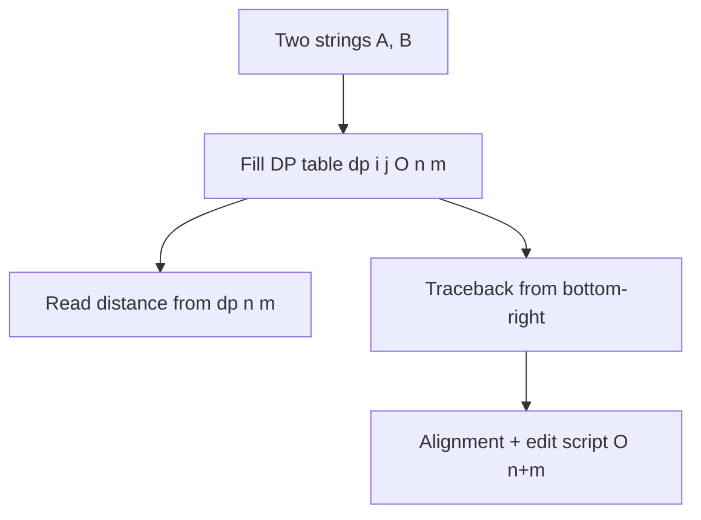

# Edit Distance — Measuring How Different Two Strings Are (String-Algorithms View) — Junior Level

> **One-line summary:** The **edit distance** (Levenshtein distance) between two strings is the minimum number of single-character **inserts**, **deletes**, and **substitutions** that turn one string into the other. Computing it is equivalent to finding the cheapest **alignment** of the two strings, and the same table you fill to get the number lets you trace back the exact sequence of edits.

---

## Table of Contents

1. [Introduction](#introduction)
2. [Prerequisites](#prerequisites)
3. [Glossary](#glossary)
4. [Core Concepts](#core-concepts)
5. [Big-O Summary](#big-o-summary)
6. [Real-World Analogies](#real-world-analogies)
7. [Pros & Cons](#pros--cons)
8. [Step-by-Step Walkthrough](#step-by-step-walkthrough)
9. [Code Examples](#code-examples)
10. [Coding Patterns](#coding-patterns)
11. [Error Handling](#error-handling)
12. [Performance Tips](#performance-tips)
13. [Best Practices](#best-practices)
14. [Edge Cases & Pitfalls](#edge-cases--pitfalls)
15. [Common Mistakes](#common-mistakes)
16. [Cheat Sheet](#cheat-sheet)
17. [Visual Animation](#visual-animation)
18. [Summary](#summary)
19. [Further Reading](#further-reading)

---

## Introduction

Suppose a search box shows you "Did you mean *receive*?" after you typed *recieve*. Behind that suggestion sits a single, very general question: *how different are two strings?* The standard answer is the **edit distance** — the smallest number of one-character edits needed to transform one string into the other. The three allowed edits are:

- **Insert** a character (`cat → cart`, insert `r`),
- **Delete** a character (`cart → cat`, delete `r`),
- **Substitute** one character for another (`cat → cot`, substitute `a→o`).

This particular flavor — insert, delete, substitute, each costing 1 — is named **Levenshtein distance** after Vladimir Levenshtein, who defined it in 1965. The edit distance between *recieve* and *receive* is **2** (one delete and one insert, or two substitutions, depending on how you count — both reach the target in two moves).

There are two complementary ways to *see* edit distance, and this topic emphasizes the second one because it belongs to the string-algorithms toolbox:

1. **As a number.** "These two strings are 2 edits apart." This is the classic dynamic-programming (DP) result, and a separate roadmap topic — `13-dynamic-programming/04-edit-distance` — derives that `O(n·m)` DP table in detail. We summarize it here but do **not** repeat the full derivation.
2. **As an alignment.** Write the two strings one above the other, inserting gaps (`-`) so that matching characters line up in columns. The edit distance is the cost of the *best* such alignment, and the alignment itself *is* the list of edits. This **alignment + traceback** view is the heart of string processing — it is how `diff` shows you what changed, how a spell-checker knows which letters to fix, and how biologists line up DNA sequences.

```
recieve        r e c i e v e
receive        r e c - e i v e   (one view of the alignment)
```

Once you have the table, you do not just read off a number — you **walk backward** through it to recover *which* edits were made and *where*. That backward walk is called **traceback**, and learning to do it is the main new skill in this file.

This file builds the intuition (measuring difference, filling the grid, tracing back the alignment). The `middle.md` file goes into global vs local alignment, affine gaps, transpositions, and small-distance speedups. The `senior.md` file covers production fuzzy search and bit-parallel tricks. The `professional.md` file proves the metric and complexity properties.

---

## Prerequisites

Before reading this file you should be comfortable with:

- **Strings and indexing** — accessing `s[i]`, lengths, substrings, and that strings are sequences of characters.
- **2D arrays / nested loops** — the DP fills a grid `dp[i][j]`, so you must be at ease with row/column iteration.
- **The `min` of a few values** — every cell is the minimum over three (or four) candidates.
- **Basic recursion or dynamic programming** — the idea that a big answer is built from smaller subproblem answers. (A first pass at `13-dynamic-programming/04-edit-distance` helps but is not required.)
- **Big-O notation** — `O(n·m)` time and space, `O(min(n,m))` space.

Optional but helpful:

- Familiarity with **`diff`** output (the `+`/`-` lines), since alignment produces exactly that kind of edit script.
- A glance at **prefixes** — `dp[i][j]` always compares the first `i` characters of one string with the first `j` of the other.

---

## Glossary

| Term | Meaning |
|------|---------|
| **Edit distance** | Minimum number of single-character edits to transform string `A` into string `B`. |
| **Levenshtein distance** | Edit distance where insert, delete, and substitute each cost `1`. The default meaning of "edit distance". |
| **Insert / Delete / Substitute** | The three elementary edit operations. Insert and delete are sometimes called *indels* together. |
| **Indel** | An **in**sertion or **del**etion — a gap in one of the two aligned strings. |
| **Alignment** | A way of writing the two strings with gap symbols (`-`) so each column is a match, a substitution, an insert, or a delete. |
| **Gap** | A `-` placed in one string, representing an insert or delete. |
| **Match** | A column where both characters are equal (cost 0). |
| **Mismatch / substitution** | A column where the two characters differ (cost 1 in Levenshtein). |
| **DP table** | The `(n+1) × (m+1)` grid `dp[i][j]` holding the edit distance between the first `i` chars of `A` and first `j` chars of `B`. |
| **Traceback** | Walking backward through the DP table from the bottom-right to the top-left to recover the actual edits. |
| **Prefix** | The first `i` characters of a string; the DP is defined over prefixes. |
| **Hamming distance** | A *simpler* relative: counts only substitutions, requires equal lengths, forbids inserts/deletes. |

---

## Core Concepts

### 1. Edit distance as a minimum-cost transformation

Given strings `A` (length `n`) and `B` (length `m`), the edit distance `D(A, B)` is the fewest insert/delete/substitute operations that change `A` into `B`. Because we can always do it character by character, the distance is at most `max(n, m)`; if the strings are equal it is `0`.

A key fact: the operations are **symmetric**. Deleting from `A` is the same as inserting into `B`, and a substitution looks the same in both directions. So `D(A, B) = D(B, A)` — the distance does not care which string you start from. This symmetry is part of what makes edit distance a true **metric** (proved in `professional.md`).

### 2. Alignment: the visual form of the answer

Every sequence of edits corresponds to an **alignment**: stack `A` over `B`, inserting `-` gaps so equal-length rows result. Each column is one of:

```
A:  k i t t e n            column types:
B:  s i t t i n g          k/s  = substitute
                           i/i  = match
                           t/t  = match
                           t/t  = match
                           e/i  = substitute
                           n/n  = match
                           -/g  = insert g
```

The cost of an alignment is `(#substitutions) + (#gaps)`. The **edit distance is the minimum cost over all possible alignments**. So computing edit distance and finding the best alignment are the *same problem* — and once you can do one, traceback gives you the other.

### 3. The recurrence (brief — full derivation in the DP topic)

Let `dp[i][j]` be the edit distance between `A[0..i)` (first `i` chars) and `B[0..j)`. The classic recurrence compares the last characters:

```
dp[i][j] = dp[i-1][j-1]                       if A[i-1] == B[j-1]   (free match)
         = 1 + min( dp[i-1][j-1],   // substitute A[i-1] -> B[j-1]
                    dp[i-1][j],     // delete A[i-1]
                    dp[i][j-1] )    // insert B[j-1]
                                               otherwise
```

with base cases `dp[0][j] = j` (insert `j` chars into the empty string) and `dp[i][0] = i` (delete `i` chars). The final answer is `dp[n][m]`. Filling this grid is `O(n·m)` time and space. *(The why-it-is-correct argument lives in `13-dynamic-programming/04-edit-distance`; this topic takes that as given and focuses on the alignment/traceback and string-matching uses.)*

### 4. Traceback: turning the table back into edits

The number alone (`dp[n][m]`) is rarely enough. To get the *diff*, start at the bottom-right cell `(n, m)` and repeatedly step to the predecessor cell the value came from:

- If `A[i-1] == B[j-1]` and `dp[i][j] == dp[i-1][j-1]` → **match**, move diagonally to `(i-1, j-1)`.
- Else if `dp[i][j] == dp[i-1][j-1] + 1` → **substitute**, move diagonally.
- Else if `dp[i][j] == dp[i-1][j] + 1` → **delete** `A[i-1]`, move up to `(i-1, j)`.
- Else (`dp[i][j] == dp[i][j-1] + 1`) → **insert** `B[j-1]`, move left to `(i, j-1)`.

Collect the operations as you go, then reverse them. This walk is `O(n + m)`. It is exactly how `diff` and aligners produce their output, and it is the single most important "string" skill of this topic.

### 5. The grid is a graph (preview)

Notice the traceback moves through a grid following arrows. In fact the DP table is secretly a **graph**: cells are vertices, the three moves are weighted edges, and edit distance is the shortest path from corner to corner. That "edit distance is shortest path in the edit grid" view is what unlocks the faster algorithms in later files. For now, just hold the picture: *aligning two strings = finding a cheapest path through a grid.*

---

## Big-O Summary

| Operation | Time | Space | Notes |
|-----------|------|-------|-------|
| Full DP table (distance only) | **O(n·m)** | O(n·m) | The classic textbook fill. |
| Distance only, two-row trick | O(n·m) | **O(min(n,m))** | Keep only the previous and current row. |
| Traceback (recover edits) | O(n + m) | — | Needs the full table (or Hirschberg, see middle). |
| Hamming distance (equal lengths) | O(n) | O(1) | Substitutions only — a much weaker relative. |
| Check "distance ≤ k?" (banded) | O(k · min(n,m)) | O(min(n,m)) | Only compute a diagonal band (middle.md). |

The headline number for the basic algorithm is **`O(n·m)`** — proportional to the product of the two lengths. For two 1000-character strings that is a million cells, which is fine; for two 1-million-character strings it is `10^12`, which is far too slow and motivates the smarter algorithms in the later files.

---

## Real-World Analogies

| Concept | Analogy |
|---------|---------|
| Edit distance | The number of keystrokes (insert/delete/replace) a copy editor needs to fix a misspelled word into the correct one. |
| Alignment | Laying two ribbons of text side by side and sliding them until the matching letters line up, padding with blanks where one has extra letters. |
| Insert / delete (gap) | Adding or removing a single train car so two trains have matching cars in the same positions. |
| Substitution | Swapping out one Lego brick for a different-colored one in the same slot. |
| Traceback | Retracing your steps on a hiking trail to remember exactly which turns you took to reach the summit. |
| "Distance ≤ k?" | A spell-checker that only suggests words within 2 typos — it does not care *how* far the truly-distant words are. |

Where the analogy breaks: real editors care about *which* edit is most natural (a swap vs two replacements); plain Levenshtein treats all single-character edits as equal cost. The `middle.md` file relaxes that with weighted and affine-gap costs.

---

## Pros & Cons

| Pros | Cons |
|------|------|
| Simple, exact, and a true mathematical **metric** (symmetry + triangle inequality). | `O(n·m)` is too slow for very long strings (think whole documents/genomes). |
| The same table yields both the **number** and the **alignment** (via traceback). | Full traceback needs `O(n·m)` memory unless you use the Hirschberg trick. |
| Handles inserts, deletes, and substitutions uniformly — robust to all common typos. | Plain Levenshtein charges 2 for a transposition (`teh→the`); needs Damerau variant to fix. |
| Easy to customize: weight operations, add a band for small distances. | All edits cost the same by default, which is unrealistic for some applications. |
| Foundation for diff, spell-check, fuzzy search, and bioinformatics alignment. | Quadratic time is essentially unavoidable in the worst case (a deep result — see professional.md). |

**When to use:** comparing short-to-medium strings (words, identifiers, lines), spell-checking, fuzzy matching within a small edit budget, diffing, sequence alignment.

**When NOT to use:** two enormous strings where `n·m` is astronomical and you do not have a small-distance bound; cases where only substitutions matter (use Hamming); cases needing semantic similarity rather than character edits.

---

## Step-by-Step Walkthrough

Let us compute the edit distance between `A = "kitten"` and `B = "sitting"` and then trace back the alignment. `n = 6`, `m = 7`.

**Set up the grid** with the empty-prefix base cases (row 0 counts inserts, column 0 counts deletes):

```
        ""  s  i  t  t  i  n  g
    ""   0  1  2  3  4  5  6  7
    k    1  .  .  .  .  .  .  .
    i    2  .  .  .  .  .  .  .
    t    3  .  .  .  .  .  .  .
    t    4  .  .  .  .  .  .  .
    e    5  .  .  .  .  .  .  .
    n    6  .  .  .  .  .  .  .
```

**Fill cell by cell.** For example `dp[1][1]` compares `k` vs `s`: they differ, so `dp[1][1] = 1 + min(dp[0][0], dp[0][1], dp[1][0]) = 1 + min(0,1,1) = 1` (substitute `k→s`). Continuing the standard fill yields:

```
        ""  s  i  t  t  i  n  g
    ""   0  1  2  3  4  5  6  7
    k    1  1  2  3  4  5  6  7
    i    2  2  1  2  3  4  5  6
    t    3  3  2  1  2  3  4  5
    t    4  4  3  2  1  2  3  4
    e    5  5  4  3  2  2  3  4
    n    6  6  5  4  3  3  2  3
```

The bottom-right cell is `dp[6][7] = 3`. **The edit distance is 3.**

**Traceback from `(6, 7)`** (value 3), recovering each operation:

```
(6,7)=3  g vs n differ; came from (6,6)=2 via insert g   → INSERT g
(6,6)=2  n vs n match;  came from (5,5)=2 diagonally      → MATCH  n
(5,5)=2  e vs i differ; came from (4,4)=1 +1 substitute   → SUB e→i
(4,4)=1  t vs t match;  came from (3,3)=1 diagonally      → MATCH  t
(3,3)=1  t vs t match;  came from (2,2)=1 diagonally      → MATCH  t
(2,2)=1  i vs i match;  came from (1,1)=1 diagonally      → MATCH  i
(1,1)=1  k vs s differ; came from (0,0)=0 +1 substitute   → SUB k→s
(0,0)=0  start
```

Reverse the collected ops to read them left-to-right:

```
SUB k→s, MATCH i, MATCH t, MATCH t, SUB e→i, MATCH n, INSERT g
```

As an alignment:

```
k i t t e n -
s i t t i n g
^       ^   ^
sub     sub insert     →  2 substitutions + 1 insert = distance 3 ✓
```

The number (3) and the alignment (the columns above) came from *the same table*: fill once, read the number from the corner, trace back for the edits.

---

## Code Examples

### Example: Edit distance plus a reconstructed alignment

Each program fills the DP table, prints the distance, and traces back to print the aligned strings.

#### Go

```go
package main

import (
	"fmt"
	"strings"
)

func min3(a, b, c int) int {
	m := a
	if b < m {
		m = b
	}
	if c < m {
		m = c
	}
	return m
}

func editDistanceWithAlignment(a, b string) (int, string, string) {
	n, m := len(a), len(b)
	dp := make([][]int, n+1)
	for i := range dp {
		dp[i] = make([]int, m+1)
		dp[i][0] = i // delete i chars
	}
	for j := 0; j <= m; j++ {
		dp[0][j] = j // insert j chars
	}
	for i := 1; i <= n; i++ {
		for j := 1; j <= m; j++ {
			if a[i-1] == b[j-1] {
				dp[i][j] = dp[i-1][j-1]
			} else {
				dp[i][j] = 1 + min3(dp[i-1][j-1], dp[i-1][j], dp[i][j-1])
			}
		}
	}
	// traceback
	var topRow, botRow strings.Builder
	i, j := n, m
	for i > 0 || j > 0 {
		switch {
		case i > 0 && j > 0 && a[i-1] == b[j-1] && dp[i][j] == dp[i-1][j-1]:
			topRow.WriteByte(a[i-1])
			botRow.WriteByte(b[j-1])
			i, j = i-1, j-1
		case i > 0 && j > 0 && dp[i][j] == dp[i-1][j-1]+1:
			topRow.WriteByte(a[i-1]) // substitute
			botRow.WriteByte(b[j-1])
			i, j = i-1, j-1
		case i > 0 && dp[i][j] == dp[i-1][j]+1:
			topRow.WriteByte(a[i-1]) // delete from a
			botRow.WriteByte('-')
			i--
		default:
			topRow.WriteByte('-') // insert into a
			botRow.WriteByte(b[j-1])
			j--
		}
	}
	return dp[n][m], reverse(topRow.String()), reverse(botRow.String())
}

func reverse(s string) string {
	r := []byte(s)
	for i, j := 0, len(r)-1; i < j; i, j = i+1, j-1 {
		r[i], r[j] = r[j], r[i]
	}
	return string(r)
}

func main() {
	d, top, bot := editDistanceWithAlignment("kitten", "sitting")
	fmt.Println("distance =", d) // 3
	fmt.Println(top)
	fmt.Println(bot)
}
```

#### Java

```java
public class EditDistance {
    static int min3(int a, int b, int c) {
        return Math.min(a, Math.min(b, c));
    }

    public static void main(String[] args) {
        String a = "kitten", b = "sitting";
        int n = a.length(), m = b.length();
        int[][] dp = new int[n + 1][m + 1];
        for (int i = 0; i <= n; i++) dp[i][0] = i; // delete
        for (int j = 0; j <= m; j++) dp[0][j] = j; // insert
        for (int i = 1; i <= n; i++) {
            for (int j = 1; j <= m; j++) {
                if (a.charAt(i - 1) == b.charAt(j - 1)) {
                    dp[i][j] = dp[i - 1][j - 1];
                } else {
                    dp[i][j] = 1 + min3(dp[i - 1][j - 1], dp[i - 1][j], dp[i][j - 1]);
                }
            }
        }
        System.out.println("distance = " + dp[n][m]); // 3

        // traceback
        StringBuilder top = new StringBuilder(), bot = new StringBuilder();
        int i = n, j = m;
        while (i > 0 || j > 0) {
            if (i > 0 && j > 0 && a.charAt(i - 1) == b.charAt(j - 1)
                    && dp[i][j] == dp[i - 1][j - 1]) {
                top.append(a.charAt(i - 1)); bot.append(b.charAt(j - 1)); i--; j--;
            } else if (i > 0 && j > 0 && dp[i][j] == dp[i - 1][j - 1] + 1) {
                top.append(a.charAt(i - 1)); bot.append(b.charAt(j - 1)); i--; j--; // sub
            } else if (i > 0 && dp[i][j] == dp[i - 1][j] + 1) {
                top.append(a.charAt(i - 1)); bot.append('-'); i--; // delete
            } else {
                top.append('-'); bot.append(b.charAt(j - 1)); j--; // insert
            }
        }
        System.out.println(top.reverse());
        System.out.println(bot.reverse());
    }
}
```

#### Python

```python
def edit_distance_with_alignment(a, b):
    n, m = len(a), len(b)
    dp = [[0] * (m + 1) for _ in range(n + 1)]
    for i in range(n + 1):
        dp[i][0] = i  # delete i chars
    for j in range(m + 1):
        dp[0][j] = j  # insert j chars
    for i in range(1, n + 1):
        for j in range(1, m + 1):
            if a[i - 1] == b[j - 1]:
                dp[i][j] = dp[i - 1][j - 1]
            else:
                dp[i][j] = 1 + min(dp[i - 1][j - 1], dp[i - 1][j], dp[i][j - 1])

    # traceback
    top, bot = [], []
    i, j = n, m
    while i > 0 or j > 0:
        if i > 0 and j > 0 and a[i - 1] == b[j - 1] and dp[i][j] == dp[i - 1][j - 1]:
            top.append(a[i - 1]); bot.append(b[j - 1]); i, j = i - 1, j - 1
        elif i > 0 and j > 0 and dp[i][j] == dp[i - 1][j - 1] + 1:
            top.append(a[i - 1]); bot.append(b[j - 1]); i, j = i - 1, j - 1  # sub
        elif i > 0 and dp[i][j] == dp[i - 1][j] + 1:
            top.append(a[i - 1]); bot.append("-"); i -= 1  # delete
        else:
            top.append("-"); bot.append(b[j - 1]); j -= 1  # insert
    return dp[n][m], "".join(reversed(top)), "".join(reversed(bot))


if __name__ == "__main__":
    d, top, bot = edit_distance_with_alignment("kitten", "sitting")
    print("distance =", d)  # 3
    print(top)
    print(bot)
```

**What it does:** fills the `kitten`/`sitting` table, prints distance `3`, and prints the aligned rows recovered by traceback.
**Run:** `go run main.go` | `javac EditDistance.java && java EditDistance` | `python ed.py`

---

## Coding Patterns

### Pattern 1: Distance-only with two rows

**Intent:** When you only need the *number* (not the alignment), keep just the previous and current rows to cut memory to `O(min(n,m))`.

```python
def edit_distance(a, b):
    if len(a) < len(b):
        a, b = b, a  # ensure b is the shorter -> smaller rows
    prev = list(range(len(b) + 1))
    for i, ca in enumerate(a, 1):
        cur = [i] + [0] * len(b)
        for j, cb in enumerate(b, 1):
            cur[j] = prev[j - 1] if ca == cb else 1 + min(prev[j - 1], prev[j], cur[j - 1])
        prev = cur
    return prev[-1]
```

Note: this gives the number but **not** the alignment — traceback needs the full table (or Hirschberg's clever divide-and-conquer, covered in `middle.md`).

### Pattern 2: One-edit-away check

**Intent:** Quickly decide if two strings are at most one edit apart without filling a full table — a common interview/spell-check primitive.

```python
def one_edit_away(a, b):
    if abs(len(a) - len(b)) > 1:
        return False
    # walk both, allow a single mismatch absorbed as sub/insert/delete
    ...
```

### Pattern 3: Traceback to build an edit script

**Intent:** Produce a `diff`-style list of operations (`SUB a@2 e->i`, `INS @6 g`) by recording each move during traceback. This is what diff/patch tooling does.



---

## Error Handling

| Error | Cause | Fix |
|-------|-------|-----|
| Off-by-one in the table | Confusing `dp[i][j]` (prefix lengths) with 0-based char indices `A[i-1]`. | Remember: row/col `i` means "first `i` chars"; the char is `A[i-1]`. |
| Wrong base cases | Forgot `dp[0][j] = j` / `dp[i][0] = i`. | Empty-to-prefix needs `j` inserts (or `i` deletes). |
| Traceback runs off the grid | Not handling `i == 0` (only inserts left) or `j == 0` (only deletes left). | Guard each branch with `i > 0` / `j > 0`. |
| Reversed alignment printed | Traceback collects ops bottom-up. | Reverse the collected sequences before printing. |
| Unicode miscount | Indexing bytes instead of characters on multi-byte input. | Convert to a rune/char array first (see Edge Cases). |

---

## Performance Tips

- **Make the shorter string the inner dimension.** Memory in the two-row version is `O(min(n,m))`; iterate so the shorter string indexes the row.
- **Use the two-row trick** whenever you only need the number — it cuts memory from `O(n·m)` to `O(min(n,m))`.
- **Early-exit on a length gap.** If `|n - m| > k` and you only care about "≤ k", the answer is already `> k`; skip the DP.
- **Band the table** when the allowed distance `k` is small — compute only the diagonal stripe (see `middle.md`); this turns `O(n·m)` into `O(k·n)`.
- **Avoid recomputation** — never call a recursive edit distance without memoization; the naive recursion is exponential.

---

## Best Practices

- Decide up front whether you need the **number** or the **alignment**; the latter forces you to keep the full table (or use Hirschberg).
- Always set and test the base-case row/column first — most bugs hide there.
- Write `min3` (or use the language's min) as a tiny helper so the recurrence reads cleanly.
- When tracing back, prefer **matches over substitutions over indels** consistently, so your alignment is deterministic and reproducible.
- For user-facing text, operate on **characters/runes**, not raw bytes, to handle accents and emoji correctly.
- Cross-check small cases by hand (`""` vs `"abc"` is `3`; `"abc"` vs `"abc"` is `0`).

---

## Edge Cases & Pitfalls

- **Empty strings** — `D("", s) = len(s)` (all inserts) and `D(s, "") = len(s)` (all deletes). Make sure base cases cover these.
- **Identical strings** — distance `0`, alignment is all matches.
- **Completely different equal-length strings** — distance equals the length (all substitutions).
- **Transposition trap** — `teh → the` is a single human swap but Levenshtein charges **2** (delete + insert, or two subs). If swaps must cost 1, you need **Damerau-Levenshtein** (see `middle.md`).
- **Case sensitivity** — `"Cat"` vs `"cat"` is distance 1 unless you lowercase first; decide deliberately.
- **Multi-byte characters** — indexing UTF-8 bytes gives wrong distances for accented letters/emoji; index runes/code points.
- **Ties in traceback** — several predecessors may give the same value, so multiple optimal alignments exist; pick a consistent rule.

---

## Common Mistakes

1. **Returning `dp[n][m]` but mixing up `n` and `m`** — the answer is at the bottom-right; keep dimensions straight.
2. **Forgetting the base-case row/column** — leaving them as zeros makes every distance wrong.
3. **Charging 0 for a substitution when characters match but you still take the `+1` branch** — match must be the *free* diagonal move.
4. **Indexing `A[i]` instead of `A[i-1]`** in the recurrence — the table is 1-indexed over prefixes.
5. **Trying to trace back from a two-row table** — you discarded the history; keep the full table for traceback.
6. **Assuming a swap costs 1** — plain Levenshtein does not model transpositions.
7. **Using recursion without memoization** — the plain recursive formula is exponential; always use the table.

---

## Cheat Sheet

| Question | Tool | Formula / Note |
|----------|------|----------------|
| How different are two strings? | Levenshtein distance | `dp[n][m]`, `O(n·m)` |
| What are the actual edits? | Traceback | Walk back from `(n,m)`, `O(n+m)` |
| Only need the number, save memory? | Two-row DP | `O(min(n,m))` space |
| Is the distance ≤ k? | Banded DP | `O(k·n)`, see `middle.md` |
| Only substitutions, equal length? | Hamming distance | `O(n)`, count mismatches |
| Distance between empty and `s`? | base case | `len(s)` |

Core recurrence:

```
dp[i][0] = i ;  dp[0][j] = j
dp[i][j] = dp[i-1][j-1]                         if A[i-1]==B[j-1]
         = 1 + min(dp[i-1][j-1],   # substitute
                   dp[i-1][j],     # delete
                   dp[i][j-1])     # insert      otherwise
answer = dp[n][m]   # O(n·m)
```

---

## Visual Animation

> See [`animation.html`](./animation.html) for an interactive visualization.
>
> The animation demonstrates:
> - Filling the edit-distance DP grid cell by cell with the three-case minimum
> - The traceback path from the bottom-right corner back to the origin
> - Coloring each step as **match**, **substitute**, **insert**, or **delete**
> - Producing the final aligned strings from the traceback
> - Play / Pause / Step controls and editable input strings

---

## Summary

Edit distance answers "how different are two strings?" by counting the minimum inserts, deletes, and substitutions to turn one into the other — the **Levenshtein** distance when each edit costs 1. The deeper string-algorithms view is that this is an **alignment** problem: line the two strings up with gaps, and the cheapest alignment's cost *is* the edit distance. You compute it by filling an `O(n·m)` DP grid (derivation detailed in the sibling `13-dynamic-programming/04-edit-distance` topic), read the number from the bottom-right corner, and then **trace back** through the grid to recover the actual edits and the alignment in `O(n+m)`. Keep two rows if you only need the number; keep the whole grid (or use Hirschberg) if you need the alignment. Master fill + traceback here, and the later files build the fast approximate-matching machinery on top of it.

---

## Further Reading

- *Introduction to Algorithms* (CLRS) — the edit-distance dynamic program and longest common subsequence.
- Sibling topic `13-dynamic-programming/04-edit-distance` — the full DP derivation, weighted costs, and Damerau details.
- Gusfield, *Algorithms on Strings, Trees, and Sequences* — alignment, traceback, and bioinformatics applications.
- Levenshtein (1965), "Binary codes capable of correcting deletions, insertions, and reversals."
- cp-algorithms.com — "Edit distance" and "Longest common subsequence".
- The Unix `diff` utility and Myers' diff algorithm for line-level alignment.
