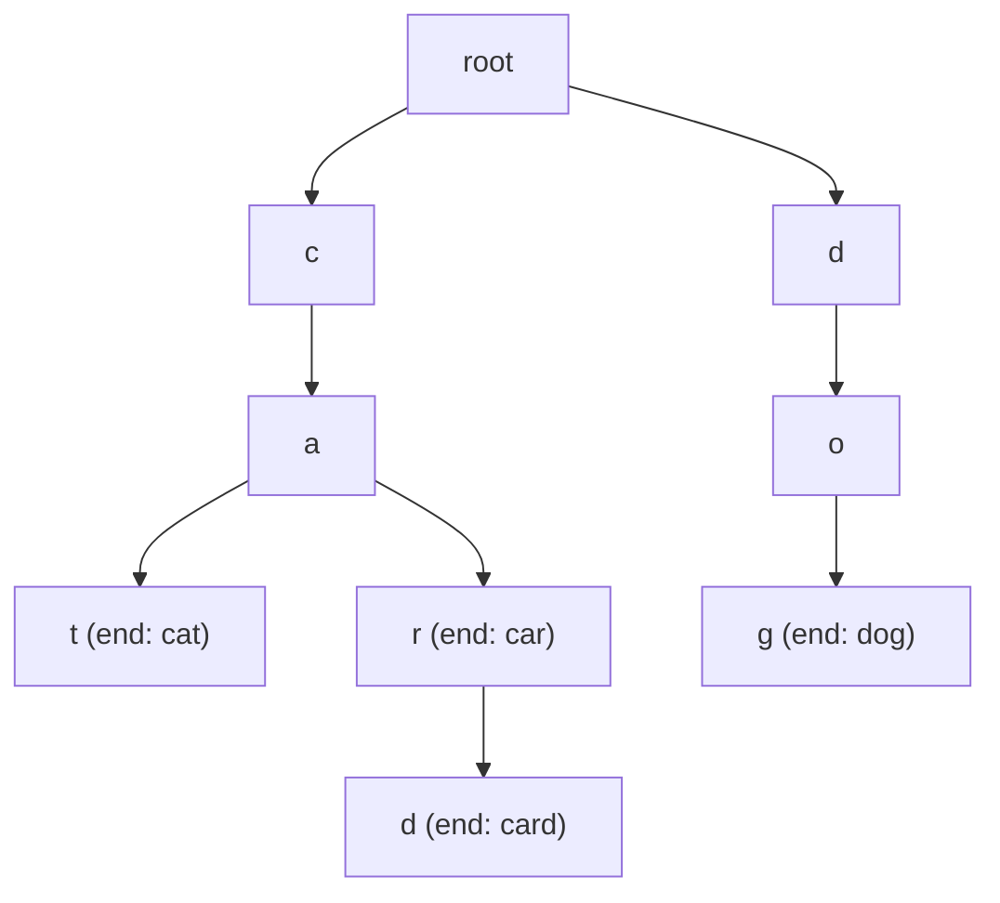

# Tries (Prefix Trees) for String Processing — Junior Level

> **One-line summary:** A **trie** (prefix tree) stores a set of strings as a tree where each edge is one character, so all keys that share a prefix share a path from the root. Insert, search, and `startsWith` each cost `O(L)` where `L` is the length of the query — completely independent of how many words the trie holds.

---

## Table of Contents

1. [Introduction](#introduction)
2. [Prerequisites](#prerequisites)
3. [Glossary](#glossary)
4. [Core Concepts](#core-concepts)
5. [Big-O Summary](#big-o-summary)
6. [Real-World Analogies](#real-world-analogies)
7. [Pros & Cons](#pros--cons)
8. [Step-by-Step Walkthrough](#step-by-step-walkthrough)
9. [Code Examples](#code-examples)
10. [Coding Patterns](#coding-patterns)
11. [Error Handling](#error-handling)
12. [Performance Tips](#performance-tips)
13. [Best Practices](#best-practices)
14. [Edge Cases & Pitfalls](#edge-cases--pitfalls)
15. [Common Mistakes](#common-mistakes)
16. [Cheat Sheet](#cheat-sheet)
17. [Visual Animation](#visual-animation)
18. [Summary](#summary)
19. [Further Reading](#further-reading)

---

## Introduction

Imagine you are building the search box on a phone keyboard or a website. The moment a user types `c`, then `a`, then `t`, you want to instantly answer two kinds of questions: *"Is `cat` a real word in my dictionary?"* and *"What words start with `cat`?"* (so you can suggest `cat`, `catch`, `category`, `caterpillar`). A hash set can answer the first question, but it is useless for the second — hashing destroys the relationship between `cat` and `catch`, because it scrambles every string into an unrelated bucket.

A **trie** (the name comes from re**trie**val, and is usually pronounced "try") solves both problems at once. It is a tree built so that **every edge is labeled with a single character**, and **every path from the root spells out a prefix** of one or more stored keys. Words that share a prefix literally share the same nodes near the root and only branch apart where they start to differ. So `cat`, `catch`, and `car` all share the `c → a` path; then `cat`/`catch` continue down `t` while `car` peels off down `r`.

Because of this shape, walking the trie one character at a time *is* the algorithm:

> **To search for a key of length `L`, you follow `L` edges from the root. To check a prefix, you follow the prefix's edges. To autocomplete, you follow the prefix's edges and then collect everything below.**

The headline property is that the cost depends on the **length of the string you are working with**, not on the **number of strings stored**. Searching `cat` in a trie of 10 words and a trie of 10 million words both take 3 steps. That single fact is what makes tries the natural backbone of autocomplete, spell-checkers, IP routing tables, and dictionary-driven algorithms.

This topic focuses on the **string / prefix** trie: string keys, prefix queries, frequency counting, and autocomplete. Closely related variants live in sibling topics — the **binary (XOR) trie** for integers is in `18-bit-manipulation/06`, a tree-flavored trie in `09-trees/05`, and **compressed tries** (radix trees, Patricia, ternary search tries) get full treatment in `21-advanced-structures/24-25`. We will mention those where relevant and point you there rather than duplicating them.

---

## Prerequisites

Before reading this file you should be comfortable with:

- **Strings and characters** — indexing a string, iterating character by character, ASCII / Unicode basics.
- **Trees and recursion** — a node with children, parent/child relationships, depth-first traversal (DFS). See sibling section `09-trees`.
- **Hash maps / dictionaries** — `map[char]node`, key lookup, because one common way to store children is a map.
- **Arrays** — the other common way to store children is a fixed-size array (e.g. 26 slots for lowercase letters).
- **Big-O notation** — `O(L)`, `O(L + n)`, and why "independent of `n`" matters.
- **Hash sets** — so you can compare the trie against the obvious alternative.

Optional but helpful:

- A glance at **DFS / backtracking** (sibling `15-recursion-backtracking`), since collecting all words under a prefix is a DFS.
- Familiarity with **sorting strings**, because a trie traversal produces them in sorted order for free.

---

## Glossary

| Term | Meaning |
|------|---------|
| **Trie / prefix tree** | A tree where each edge is one character and each root-to-node path spells a prefix of stored keys. |
| **Node** | A point in the trie. Holds links to children (one per possible next character) and an end-of-word flag. |
| **Root** | The top node, representing the empty prefix `""`. It stores no character itself. |
| **Edge** | A labeled link from a node to a child, carrying exactly one character. |
| **Children map / array** | How a node stores its outgoing edges: a `map[char]node`, or a fixed array indexed by character. |
| **End-of-word flag** | A boolean (`isEnd`) marking that the path to this node spells a *complete* stored key, not just a prefix. |
| **Prefix** | Any leading substring of a key. `c`, `ca`, `cat` are all prefixes of `cat` and `catch`. |
| **`startsWith(p)`** | Returns true if **any** stored key has `p` as a prefix. Walks `p`'s edges; ignores the end-of-word flag. |
| **Autocomplete / typeahead** | Given a prefix, return all (or the top-ranked) stored keys that begin with it. |
| **Compressed / radix trie** | A trie where chains of single-child nodes are merged into one edge labeled with a substring. See `21/24`. |
| **Ternary search trie (TST)** | A space-saving hybrid of a trie and a BST; pointer to `21/24`. |

---

## Core Concepts

### 1. The Node Structure

Every trie node holds two things:

```
node {
    children : map or array of next characters → child node
    isEnd    : boolean — does a stored key end exactly here?
}
```

That is it. The node does **not** need to store its own character — the character is implied by which edge you took to reach it. The root represents the empty string. A node is "an end of word" when some inserted key terminates precisely at that node.

### 2. Insert in O(L)

To insert a key, start at the root and walk down one character at a time. For each character, if the corresponding child does not exist yet, create it; then descend into it. After the last character, set `isEnd = true` on the node you land on.

```
insert("cat"):
  root -> child['c'] (create) -> child['a'] (create) -> child['t'] (create), mark isEnd
insert("car"):
  root -> child['c'] (exists!) -> child['a'] (exists!) -> child['r'] (create), mark isEnd
```

Notice `car` reused the `c` and `a` nodes that `cat` created. That sharing is the whole point. The cost is exactly `L` steps (`L` = length of the key).

### 3. Search vs startsWith

These two operations are almost identical — they differ only in **what you check at the end**:

- **`search(word)`**: walk the word's characters. If any edge is missing, return false. After the last character, return the node's `isEnd` flag. (The path must exist **and** spell a complete word.)
- **`startsWith(prefix)`**: walk the prefix's characters. If any edge is missing, return false. If you reach the end of the prefix, return **true** regardless of `isEnd`. (You only need the path to exist.)

This distinction is the single most important thing about tries. `search("cat")` is true only if `cat` was inserted; `startsWith("ca")` is true if `cat` (or `car`, or `cab`) was inserted, even though `ca` itself was never inserted as a word.

### 4. Autocomplete = walk to the prefix, then DFS below

To suggest completions for a prefix `p`:

1. Walk `p`'s edges to find the node where the prefix ends. If the path breaks, there are no suggestions.
2. From that node, run a DFS that collects every descendant marked `isEnd`, prepending `p` to each path you find.

```
autocomplete("ca"):
  walk c -> a  (land on "ca" node)
  DFS below it: "cat", "catch", "car"   (all the isEnd nodes underneath)
```

The cost is `O(L)` to reach the prefix node plus `O(size of the subtree)` to collect the matches.

### 5. Prefix counting and frequency

Two small extra fields on each node unlock powerful queries:

- `passCount` (a.k.a. prefix count): how many inserted keys pass through this node. Incremented on every insert as you descend. Then `startsWith`-style counting becomes "walk to the prefix node and read `passCount`" — `O(L)`, no DFS needed.
- `wordCount`: how many times the exact word ending here was inserted (supports duplicates / frequencies).

### 6. Array children vs map children

- **Array of 26 (or 256)**: `children[c - 'a']`. Fastest lookup (direct index), but every node wastes 26 pointers even if it has one child — memory-hungry for sparse alphabets.
- **Hash map `char → node`**: only stores the children that actually exist. Saves memory on sparse data and supports any alphabet (Unicode), but each lookup hashes a key. The middle file covers the trade-off in depth.

---

## Big-O Summary

Let `L` = length of the query string, `n` = number of stored keys, `Σ` = alphabet size, `m` = total characters across all keys.

| Operation | Time | Space | Notes |
|-----------|------|-------|-------|
| `insert(word)` | **O(L)** | O(L) new nodes worst case | Independent of `n`. |
| `search(word)` | **O(L)** | O(1) | Walk + check `isEnd`. |
| `startsWith(prefix)` | **O(L)** | O(1) | Walk only; ignore `isEnd`. |
| `countPrefix(prefix)` | **O(L)** | O(1) | With a `passCount` field. |
| `autocomplete(prefix)` | O(L + size of subtree) | O(output) | Walk then DFS. |
| Build trie of all keys | O(m) | O(m · Σ) array / O(m) map | `m` = sum of key lengths. |
| Sorted iteration of all keys | O(m) | O(L) recursion | Pre-order DFS = lexicographic. |
| Hash set lookup (for comparison) | O(L) average | O(m) | No prefix queries at all. |

The headline is that the core operations are **`O(L)`, not `O(L log n)` or `O(n)`** — they do not depend on how many words you store. That is the trie's superpower.

---

## Real-World Analogies

| Concept | Analogy |
|---------|---------|
| Trie structure | A library's nested signage: "Floor 2 → Science → Biology → Genetics." Each turn narrows the set of books, and many subjects share the same early hallways. |
| Shared prefix | Phone numbers in one country share a dialing prefix; the trie shares those leading digits in one path instead of repeating them per number. |
| `startsWith` | Asking "is there *any* street starting with `Wash`?" without caring whether `Wash` itself is a full street name. |
| Autocomplete | The keyboard suggestion bar: you have typed `unb`, it offers `unbelievable`, `unbox`, `unbound` — exactly the DFS-below-prefix operation. |
| Prefix count | A toll-road counter at a junction: it tells you how many cars have passed through, i.e. how many words share that prefix. |
| Longest-prefix match | A mail sorter routing a package to the most specific matching ZIP region — the deepest matching prefix wins. |

Where the analogy breaks: real signage is built once by hand; a trie rebuilds its branching automatically as you insert keys, and it stores the end-of-word flag so it can distinguish a real word from a mere waypoint.

---

## Pros & Cons

| Pros | Cons |
|------|------|
| `insert`/`search`/`startsWith` are `O(L)` — independent of the number of keys `n`. | Memory can be large: each node may hold an array of `Σ` child pointers. |
| **Native prefix queries** — `startsWith`, prefix counting, autocomplete are trivial. A hash set cannot do these at all. | Worse cache locality than a flat hash table; nodes are scattered in memory. |
| Keys come out **sorted** with a single pre-order DFS — sorting strings for free. | For a plain membership test only, a hash set is usually simpler and lighter. |
| No hash collisions, no rehashing, predictable worst case. | Implementing deletion correctly (pruning empty nodes) is fiddly. |
| Shared prefixes are stored once, saving space when keys overlap heavily. | Sparse, deep keys with little overlap can waste nodes vs. a hash set. |
| Foundation for Aho-Corasick, radix trees, IP routing, word-search puzzles. | Unicode / large alphabets push you toward maps, adding per-node overhead. |

**When to use:** prefix search, autocomplete/typeahead, dictionary with `startsWith` semantics, spell-check candidate generation, longest-prefix matching (routing), sorted string output, or as the dictionary backbone for multi-pattern matching (Aho-Corasick, sibling `05`).

**When NOT to use:** you only ever need exact membership (use a hash set), memory is tight and keys barely overlap, or you need range/numeric queries better served by a balanced BST.

---

## Step-by-Step Walkthrough

Let us insert `cat`, `car`, `card`, `dog` and then run a few queries. We will draw the trie growing.

**Insert `cat`.** From the root, no `c` child exists → create `c`; no `a` under `c` → create `a`; no `t` → create `t`; mark `t` as end-of-word.

```
root
 └─ c ─ a ─ t*       (* = isEnd)
```

**Insert `car`.** `c` exists, `a` exists, no `r` under `a` → create `r`, mark end.

```
root
 └─ c ─ a ─┬─ t*
           └─ r*
```

**Insert `card`.** `c`, `a`, `r` all exist, no `d` under `r` → create `d`, mark end. Note `r` is *both* an end-of-word (for `car`) and a waypoint (for `card`).

```
root
 └─ c ─ a ─┬─ t*
           └─ r* ─ d*
```

**Insert `dog`.** No `d` under root → create a whole new branch `d → o → g*`.

```
root
 ├─ c ─ a ─┬─ t*
 │         └─ r* ─ d*
 └─ d ─ o ─ g*
```

**Query `search("car")`.** Walk `c → a → r`. The path exists, and the `r` node has `isEnd = true`. → **true**.

**Query `search("ca")`.** Walk `c → a`. Path exists, but the `a` node has `isEnd = false` (no word ends there). → **false**. (`ca` is only a prefix, never inserted as a word.)

**Query `startsWith("ca")`.** Walk `c → a`. Path exists — we do not check `isEnd`. → **true**.

**Query `search("cab")`.** Walk `c → a`, then look for `b` under `a` — missing. → **false**.

**Query `autocomplete("car")`.** Walk to the `r` node. DFS below it, collecting end-of-word nodes: `car` (the `r` node itself is an end) and `card`. → `["car", "card"]`.

Each query touched at most as many nodes as the query length (plus the subtree for autocomplete). Counting the words stored never entered the picture.

---

## Code Examples

### Example: A Trie with insert, search, startsWith, and autocomplete

#### Go

```go
package main

import (
	"fmt"
	"sort"
)

type TrieNode struct {
	children map[rune]*TrieNode
	isEnd    bool
}

func newNode() *TrieNode {
	return &TrieNode{children: make(map[rune]*TrieNode)}
}

type Trie struct{ root *TrieNode }

func NewTrie() *Trie { return &Trie{root: newNode()} }

func (t *Trie) Insert(word string) {
	cur := t.root
	for _, ch := range word {
		nxt, ok := cur.children[ch]
		if !ok {
			nxt = newNode()
			cur.children[ch] = nxt
		}
		cur = nxt
	}
	cur.isEnd = true
}

// walk returns the node where prefix ends, or nil if the path breaks.
func (t *Trie) walk(prefix string) *TrieNode {
	cur := t.root
	for _, ch := range prefix {
		nxt, ok := cur.children[ch]
		if !ok {
			return nil
		}
		cur = nxt
	}
	return cur
}

func (t *Trie) Search(word string) bool {
	n := t.walk(word)
	return n != nil && n.isEnd
}

func (t *Trie) StartsWith(prefix string) bool {
	return t.walk(prefix) != nil
}

func (t *Trie) Autocomplete(prefix string) []string {
	node := t.walk(prefix)
	var out []string
	if node == nil {
		return out
	}
	var dfs func(n *TrieNode, path string)
	dfs = func(n *TrieNode, path string) {
		if n.isEnd {
			out = append(out, path)
		}
		// sort child keys so output is lexicographic
		keys := make([]rune, 0, len(n.children))
		for k := range n.children {
			keys = append(keys, k)
		}
		sort.Slice(keys, func(i, j int) bool { return keys[i] < keys[j] })
		for _, k := range keys {
			dfs(n.children[k], path+string(k))
		}
	}
	dfs(node, prefix)
	return out
}

func main() {
	t := NewTrie()
	for _, w := range []string{"cat", "car", "card", "dog"} {
		t.Insert(w)
	}
	fmt.Println(t.Search("car"))        // true
	fmt.Println(t.Search("ca"))         // false
	fmt.Println(t.StartsWith("ca"))     // true
	fmt.Println(t.Autocomplete("car"))  // [car card]
}
```

#### Java

```java
import java.util.*;

public class Trie {
    static class Node {
        Map<Character, Node> children = new HashMap<>();
        boolean isEnd = false;
    }

    private final Node root = new Node();

    public void insert(String word) {
        Node cur = root;
        for (char ch : word.toCharArray()) {
            cur = cur.children.computeIfAbsent(ch, k -> new Node());
        }
        cur.isEnd = true;
    }

    private Node walk(String prefix) {
        Node cur = root;
        for (char ch : prefix.toCharArray()) {
            cur = cur.children.get(ch);
            if (cur == null) return null;
        }
        return cur;
    }

    public boolean search(String word) {
        Node n = walk(word);
        return n != null && n.isEnd;
    }

    public boolean startsWith(String prefix) {
        return walk(prefix) != null;
    }

    public List<String> autocomplete(String prefix) {
        List<String> out = new ArrayList<>();
        Node node = walk(prefix);
        if (node == null) return out;
        dfs(node, new StringBuilder(prefix), out);
        return out;
    }

    private void dfs(Node n, StringBuilder path, List<String> out) {
        if (n.isEnd) out.add(path.toString());
        List<Character> keys = new ArrayList<>(n.children.keySet());
        Collections.sort(keys);                 // lexicographic output
        for (char k : keys) {
            path.append(k);
            dfs(n.children.get(k), path, out);
            path.deleteCharAt(path.length() - 1); // backtrack
        }
    }

    public static void main(String[] args) {
        Trie t = new Trie();
        for (String w : new String[]{"cat", "car", "card", "dog"}) t.insert(w);
        System.out.println(t.search("car"));       // true
        System.out.println(t.search("ca"));        // false
        System.out.println(t.startsWith("ca"));    // true
        System.out.println(t.autocomplete("car")); // [car, card]
    }
}
```

#### Python

```python
class TrieNode:
    __slots__ = ("children", "is_end")

    def __init__(self):
        self.children = {}      # char -> TrieNode
        self.is_end = False


class Trie:
    def __init__(self):
        self.root = TrieNode()

    def insert(self, word):
        cur = self.root
        for ch in word:
            if ch not in cur.children:
                cur.children[ch] = TrieNode()
            cur = cur.children[ch]
        cur.is_end = True

    def _walk(self, prefix):
        cur = self.root
        for ch in prefix:
            if ch not in cur.children:
                return None
            cur = cur.children[ch]
        return cur

    def search(self, word):
        node = self._walk(word)
        return node is not None and node.is_end

    def starts_with(self, prefix):
        return self._walk(prefix) is not None

    def autocomplete(self, prefix):
        node = self._walk(prefix)
        out = []
        if node is None:
            return out

        def dfs(n, path):
            if n.is_end:
                out.append(path)
            for ch in sorted(n.children):       # lexicographic output
                dfs(n.children[ch], path + ch)

        dfs(node, prefix)
        return out


if __name__ == "__main__":
    t = Trie()
    for w in ["cat", "car", "card", "dog"]:
        t.insert(w)
    print(t.search("car"))       # True
    print(t.search("ca"))        # False
    print(t.starts_with("ca"))   # True
    print(t.autocomplete("car")) # ['car', 'card']
```

**What it does:** builds the trie from the walkthrough and runs the same queries, printing the expected answers.
**Run:** `go run main.go` | `javac Trie.java && java Trie` | `python trie.py`

---

## Coding Patterns

### Pattern 1: The shared `walk` helper

**Intent:** `search`, `startsWith`, `countPrefix`, and `autocomplete` all begin by walking a string to a node. Factor that into one helper that returns the node or `nil`. Then `search` adds an `isEnd` check, `startsWith` just checks non-nil, and autocomplete continues with a DFS. This removes duplicated traversal logic and the bugs that come with it.

### Pattern 2: DFS collection under a prefix

**Intent:** Autocomplete and "list all words" both walk to a node then DFS, appending the path whenever `isEnd` is true. Build the path string incrementally (append on descend, pop on return) so you never rebuild it from scratch.

```python
def collect(node, path, out):
    if node.is_end:
        out.append(path)
    for ch in sorted(node.children):
        collect(node.children[ch], path + ch, out)
```

### Pattern 3: Prefix counting via a counter field

**Intent:** Maintain `pass_count` on each node, incremented during insert. Then "how many words start with `p`?" is just `walk(p).pass_count` in `O(L)` — no DFS.



---

## Error Handling

| Error | Cause | Fix |
|-------|-------|-----|
| `NullPointerException` / `nil` deref while walking | Child does not exist and you descended anyway. | Check the child for `null`/missing **before** descending; return early. |
| `search` returns true for a prefix-only string | You forgot the `isEnd` check and only verified the path exists. | `search` must return `node != null && node.isEnd`. |
| Inserting the empty string does nothing | The loop body never runs for `""`. | Mark `root.isEnd = true` so the empty word is searchable, if your spec allows it. |
| `KeyError` / index out of range | Array-backed trie indexed with `ch - 'a'` for a non-lowercase char. | Validate the alphabet, or use a map for arbitrary characters. |
| Autocomplete returns nothing for a valid prefix | Walked to a node but DFS started from the wrong node (root). | DFS must start from the **prefix node**, with `path = prefix`. |
| Stack overflow on autocomplete | Very deep trie + recursive DFS. | Use an explicit stack, or cap depth; long keys are rare but possible. |

---

## Performance Tips

- **Choose children storage to match the alphabet.** Fixed 26-slot arrays are fastest for lowercase-only data; maps win for large or sparse alphabets (Unicode). See the middle file for the trade-off.
- **Use `computeIfAbsent` / `setdefault`** to insert-or-get a child in one lookup instead of two.
- **Avoid rebuilding path strings.** Pass a `StringBuilder` / list and append-and-pop during DFS, rather than concatenating new strings at every node.
- **Cap autocomplete output.** Stop the DFS after collecting `k` results if you only show the top `k` suggestions.
- **Reuse one trie.** Building it is `O(m)`; queries are cheap. Build once, query many times.
- **Prefer `__slots__` (Python)** on the node class to cut per-node memory significantly.

---

## Best Practices

- Keep `search` and `startsWith` distinct and obvious: the only difference is the final `isEnd` check. Document it in a comment.
- Centralize traversal in one `walk` helper so all four operations share identical, tested descent logic.
- Decide your alphabet up front (lowercase a–z? printable ASCII? full Unicode?) and pick array vs map accordingly.
- If you need frequencies or prefix counts, add `passCount`/`wordCount` fields at construction time, not as a bolt-on later.
- Test against a brute-force list-of-strings oracle: `search`, `startsWith`, and autocomplete must match a linear scan over the inserted words on random small inputs.
- For sorted output, sort child keys during DFS (or use an ordered map / array indexing), and note that this gives lexicographic order automatically.

---

## Edge Cases & Pitfalls

- **Empty string `""`** — represents the root itself. Decide whether it is a valid key; if so, set `root.isEnd`.
- **Duplicate inserts** — inserting `cat` twice should be idempotent for membership; if you track frequency, increment `wordCount` instead.
- **A word that is a prefix of another** — `car` and `card` coexist; the `r` node is both an end-of-word and a waypoint. The `isEnd` flag handles this exactly.
- **`startsWith` vs `search`** — `startsWith("ca")` is true while `search("ca")` is false if only `cat`/`car` were inserted. Mixing these up is the #1 trie bug.
- **Case sensitivity** — `Cat` and `cat` are different keys unless you normalize (lowercase) on both insert and query.
- **Non-alphabet characters** — apostrophes, digits, spaces. An array-backed trie crashes on these; a map handles them.
- **Deletion** — removing a word may need to prune now-empty nodes, but only if no other word passes through them (check `passCount` or child emptiness). Get this wrong and you delete `car` while breaking `card`.

---

## Common Mistakes

1. **Returning `true` from `search` when only the path exists** — you must also check `isEnd`. Otherwise every prefix looks like a stored word.
2. **Storing the character inside the node instead of on the edge** — redundant; the edge label already identifies the character.
3. **Using an array for a Unicode alphabet** — `ch - 'a'` goes negative or out of range. Use a map for anything beyond a known small alphabet.
4. **Forgetting to mark `isEnd` after insert** — the word is structurally present but `search` returns false.
5. **Starting autocomplete DFS at the root** — you must start at the prefix node and seed `path` with the prefix.
6. **Confusing length with depth** — a key of length `L` lives at depth `L` (the root is depth 0).
7. **Comparing tries and hash sets only on membership** — that misses the entire point; tries exist for the *prefix* operations a hash set cannot do.

---

## Cheat Sheet

| Question | Operation | Cost |
|----------|-----------|------|
| Add a key | `insert(word)` | `O(L)` |
| Is this exact word stored? | `walk(word) != nil && isEnd` | `O(L)` |
| Does any word start with `p`? | `walk(p) != nil` | `O(L)` |
| How many words start with `p`? | `walk(p).passCount` | `O(L)` |
| Suggest completions of `p` | walk to `p`, DFS collect `isEnd` | `O(L + subtree)` |
| All keys in sorted order | pre-order DFS of whole trie | `O(m)` |

Core operations:

```
insert(word):
    cur = root
    for ch in word:
        cur = cur.children.get_or_create(ch)
    cur.isEnd = true

walk(s):                 # shared by search / startsWith / autocomplete
    cur = root
    for ch in s:
        cur = cur.children.get(ch)
        if cur is null: return null
    return cur

search(word):    n = walk(word); return n != null and n.isEnd
startsWith(pre): return walk(pre) != null
```

---

## Visual Animation

> See [`animation.html`](./animation.html) for an interactive visualization.
>
> The animation demonstrates:
> - Inserting several words one character at a time, building shared-prefix branches
> - Running a `search` / `startsWith` walk that highlights the traversed path and shows the final `isEnd` decision
> - An autocomplete walk that lands on the prefix node and lights up every matching word below it
> - Step / Run / Reset controls plus an editable word list so you can build your own trie

---

## Summary

A trie stores strings as a tree of single-character edges, so keys that share a prefix share a path. Insert, search, and `startsWith` each cost `O(L)` — the length of the query — completely independent of how many words are stored. The end-of-word flag distinguishes a complete key from a mere prefix, which is exactly what separates `search` (path exists **and** `isEnd`) from `startsWith` (path exists). Autocomplete is "walk to the prefix node, then DFS below it," and adding a `passCount` field gives `O(L)` prefix counting. Tries shine wherever prefixes matter — autocomplete, spell-check, routing, sorted output — precisely the queries a hash set cannot answer. Master the `walk` helper and the `search`/`startsWith` distinction and the rest follows.

---

## Further Reading

- *Algorithms* (Sedgewick & Wayne), Chapter 5 — tries, TSTs, and string symbol tables.
- Sibling topic `17-string-algorithms/05` — Aho-Corasick, which uses a trie as its pattern dictionary.
- Sibling topic `21-advanced-structures/24-25` — compressed/radix tries and ternary search tries in depth.
- Sibling topic `18-bit-manipulation/06` — the binary (XOR) trie for integers.
- Sibling topic `15-recursion-backtracking` — DFS/backtracking behind Word Search and autocomplete collection.
- cp-algorithms.com — "Trie" and "Aho-Corasick algorithm".
