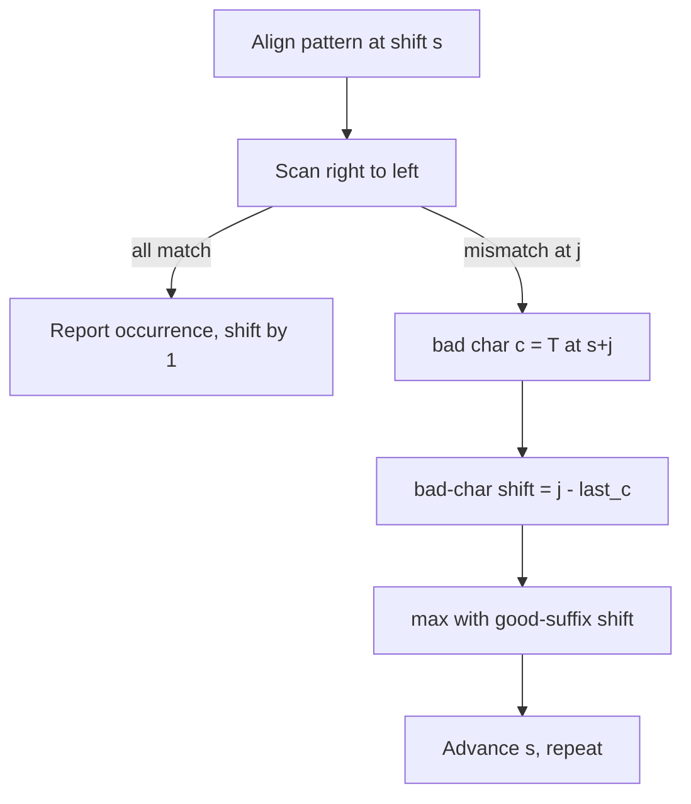

# Boyer-Moore String Matching — Junior Level

> **One-line summary:** Boyer-Moore searches for a pattern `P` inside a text `T` by aligning the pattern under the text and comparing **right to left**. On a mismatch it uses precomputed rules — the **bad-character rule** and the **good-suffix rule** — to slide the pattern forward by *many* characters at once, often skipping past whole chunks of the text. This makes it **sublinear on average**: it can find a match while looking at *fewer* than `n` characters.

---

## Table of Contents

1. [Introduction](#introduction)
2. [Prerequisites](#prerequisites)
3. [Glossary](#glossary)
4. [Core Concepts](#core-concepts)
5. [Big-O Summary](#big-o-summary)
6. [Real-World Analogies](#real-world-analogies)
7. [Pros & Cons](#pros--cons)
8. [Step-by-Step Walkthrough](#step-by-step-walkthrough)
9. [Code Examples](#code-examples)
10. [Coding Patterns](#coding-patterns)
11. [Error Handling](#error-handling)
12. [Performance Tips](#performance-tips)
13. [Best Practices](#best-practices)
14. [Edge Cases & Pitfalls](#edge-cases--pitfalls)
15. [Common Mistakes](#common-mistakes)
16. [Cheat Sheet](#cheat-sheet)
17. [Visual Animation](#visual-animation)
18. [Summary](#summary)
19. [Further Reading](#further-reading)

---

## Introduction

You want to find the word `"EXAMPLE"` inside a long document. The obvious approach — the **naive** algorithm — lines the pattern up at the very start of the text, compares character by character from the left, and if anything fails to match, slides the pattern forward by exactly **one** position and tries again. That works, but it is wasteful: a mismatch deep into the pattern throws away everything it just learned and re-checks almost the same characters from a position only one step to the right.

In 1977, Robert S. Boyer and J Strother Moore published an algorithm that flipped two of the naive algorithm's assumptions and produced one of the fastest practical string searchers ever invented:

1. **Compare the pattern right to left**, not left to right. Align `P` under `T`, then start comparing at the *last* character of `P` and walk backward toward its first character.
2. **On a mismatch, slide the pattern forward by more than one** position, using information about *which* text character caused the mismatch and *what suffix of the pattern had already matched*.

The magic of the right-to-left scan is that a single mismatch at the *end* of the pattern can tell you the alignment is hopeless for many shifts to come — so you can jump the pattern forward by a big stride instead of crawling one step at a time. The longer the pattern and the bigger the alphabet, the bigger those jumps tend to be. This is why Boyer-Moore (and its lighter cousin, **Horspool**, covered in sibling `09-horspool`) is the engine behind real-world tools: classic `grep`, `memmem`, and many `strstr`/`String.indexOf` implementations are built on these ideas.

Boyer-Moore uses **two heuristics** and, on each mismatch, takes the **larger** of the two shifts they suggest (a bigger safe jump is always better):

- The **bad-character rule** looks at the text character that caused the mismatch and shifts the pattern so that character lines up with its last occurrence in the pattern (or past it entirely, if it does not occur).
- The **good-suffix rule** looks at the portion of the pattern that *did* match (a suffix) and shifts so that this matched suffix re-aligns with another occurrence of it in the pattern.

At junior level we focus on the right-to-left scan and the bad-character rule — they are enough to understand why the algorithm is fast and to write a correct (if slightly simplified) searcher. The good-suffix rule, the combined-shift correctness, and the linear-time worst case are developed in `middle.md` and proved in `professional.md`.

Contrast this with **KMP** (Knuth-Morris-Pratt, sibling `01-kmp`): KMP scans **left to right**, never re-examines a text character, and guarantees `O(n + m)` worst case. Boyer-Moore scans **right to left**, *skips* text characters, and is usually faster in practice but needs Galil's rule to also guarantee linear worst case. KMP is the "never look back" algorithm; Boyer-Moore is the "look at as little as possible" algorithm.

---

## Prerequisites

Before reading this file you should be comfortable with:

- **Strings as arrays of characters** — indexing `T[i]`, length `n = len(T)`, `m = len(P)`.
- **The naive (brute-force) substring search** — slide a window, compare, advance by one. Boyer-Moore is a smarter version of this loop.
- **Zero-based indexing** — the last character of `P` is `P[m-1]`.
- **Big-O notation** — `O(n)`, `O(nm)`, `O(m + σ)` where `σ` is the alphabet size.
- **Arrays / hash maps** — the bad-character rule stores a small lookup table keyed by character.
- **ASCII / character codes** — mapping a character to an integer index (e.g. `'A'` → `65`).

Optional but helpful:

- A glance at **KMP** (sibling `01-kmp`) to appreciate the left-to-right vs right-to-left contrast.
- The notion of a **prefix** (start) and a **suffix** (end) of a string.

---

## Glossary

| Term | Meaning |
|------|---------|
| **Text `T`** | The (usually long) string we search inside. Length `n`. |
| **Pattern `P`** | The (usually short) string we search for. Length `m`. |
| **Alignment / shift** | A position `s` where the pattern's first character sits under `T[s]`, so `P[j]` is compared with `T[s + j]`. |
| **Right-to-left scan** | Comparing `P[m-1]` with `T[s+m-1]` first, then moving leftward toward `P[0]`. |
| **Mismatch** | A position `j` where `P[j] != T[s+j]` during the scan. |
| **Bad character** | The text character `T[s+j]` that caused the mismatch. |
| **Good suffix** | The already-matched suffix `P[j+1 .. m-1]` to the right of a mismatch. |
| **Bad-character rule** | Heuristic that shifts `P` to align the bad character with its last occurrence in `P`. |
| **Good-suffix rule** | Heuristic that shifts `P` so the matched suffix re-aligns with another copy (or a prefix) of itself. |
| **Last-occurrence table** | A table `last[c]` = index of the rightmost occurrence of character `c` in `P`, or `-1` if absent. |
| **Sublinear** | Examining *fewer* than `n` characters on average — Boyer-Moore's claim to fame. |
| **σ (sigma)** | The alphabet size (e.g. 256 for bytes, 26 for lowercase letters). |
| **Galil's rule** | A bookkeeping trick that makes the worst case `O(n)` (covered in `middle.md`/`professional.md`). |

---

## Core Concepts

### 1. The Right-to-Left Scan

Place the pattern under the text at some shift `s` (initially `s = 0`). The naive algorithm compares from the *left*. Boyer-Moore compares from the *right*:

```
T:  . . . X Y Z . . .
P:        P[0] ... P[m-1]
              ^ start here (P[m-1]) and move ←
```

Concretely, we set `j = m - 1` and compare `P[j]` with `T[s + j]`. If they match, decrement `j` and compare again. If we reach `j = -1`, the whole pattern matched at `s` — report an occurrence. If `P[j] != T[s+j]` for some `j`, we have a mismatch and must compute how far to slide.

Why right-to-left? Because the *last* character of the pattern is compared against a *new* region of the text first. If that single character is one that does not even appear in the pattern, we instantly know the pattern cannot match anywhere that overlaps it — so we can leap the whole pattern past it.

### 2. The Bad-Character Rule (the entry point)

When `P[j]` mismatches the text character `c = T[s + j]`, the bad-character rule asks: *"Where is the rightmost occurrence of `c` in the pattern?"*

- If `c` occurs in `P` at some index `k < j`, slide the pattern so that `P[k]` lines up under the mismatched text position. The shift is `j - k`.
- If `c` occurs in `P` only at indices `> j` (to the right of the mismatch), that occurrence is useless here; treat it as not helping and fall back to a shift of `1` (or let the good-suffix rule take over).
- If `c` does **not** occur in `P` at all, slide the pattern *completely past* `c`: the shift is `j + 1`.

We precompute a **last-occurrence table** `last[c]` once, in `O(m + σ)`, so each lookup is `O(1)`.

```
T:  . . . a b X d . . .        mismatch: P[j] != 'X'
P:        ? ? ? ? ?            'X' is not in P
                              → shift P right past 'X' (big jump)
```

### 3. The Good-Suffix Rule (a preview)

Sometimes the *suffix* you already matched is itself informative. Suppose the last three characters matched but the fourth-from-last mismatched. That matched suffix is a known substring of the text. The good-suffix rule slides the pattern so that another copy of that suffix inside the pattern lines up — or, if none exists, so that the longest pattern *prefix* that equals a suffix of the matched part lines up. This rule is fully developed in `middle.md`; for now, just know it is the *second* shift candidate.

### 4. Take the Maximum Shift

On every mismatch you compute **both** the bad-character shift and the good-suffix shift, and you slide by the **larger** of the two. A larger shift is always safe as long as each rule is individually safe (it never skips a real match — proved in `professional.md`). The bigger jump simply finishes the search faster.

### 5. Why It Is Sublinear

Because a mismatch at the right end of the pattern can trigger a shift of up to `m`, the algorithm often advances by close to a full pattern length per probe. On English text with a moderate alphabet, it commonly examines only about `n / m` characters in the best regions — **fewer than `n`**. That is the headline result: Boyer-Moore can run faster than reading every character of the text.

---

## Big-O Summary

| Operation | Time | Space | Notes |
|-----------|------|-------|-------|
| Build last-occurrence (bad-char) table | **O(m + σ)** | O(σ) | One pass over `P`, one init of the table. |
| Build good-suffix table | **O(m)** | O(m) | Two linear passes (see `middle.md`). |
| Single alignment scan | O(m) | O(1) | Right-to-left comparison loop. |
| Search, average case | **O(n / m)** to O(n) | — | Sublinear on typical text/large alphabet. |
| Search, best case | **O(n / m)** | — | Every probe mismatches on the last char and jumps by `m`. |
| Search, worst case (no Galil) | **O(nm)** | — | Pathological repetitive inputs. |
| Search, worst case (with Galil) | **O(n)** | — | Galil's rule caps re-comparisons. |

The headline numbers are **`O(m + σ)` preprocessing** and an **average-case sublinear** search that, in the best case, costs only `O(n / m)`.

---

## Real-World Analogies

| Concept | Analogy |
|---------|---------|
| Right-to-left scan | Checking a long shelf for a specific book by glancing at the *last* letter of each candidate spine first — a quick way to reject most books instantly. |
| Bad-character rule | You are looking for the word ending in `"...ING"`, you glance at a spot and see a `Q` where you expected `G`. Since `Q` is nowhere in your target word, you skip the whole word and jump ahead. |
| Good-suffix rule | You matched `"ING"` at the end but the letter before it was wrong; you slide forward to the *next* place in your word where `"ING"` (or part of it) could line up again. |
| Taking the max shift | Two friends each suggest how far to fast-forward a video; you trust whoever says "skip further" because both are guaranteeing you won't miss the scene. |
| Sublinear search | Skimming a book by reading only every fifth word and still reliably finding the chapter you want — you touch far fewer words than the book contains. |
| Last-occurrence table | A cheat sheet that, for each letter, tells you the rightmost spot that letter appears in the word you're hunting. |

Where the analogy breaks: real shelves do not let you "slide" your search target, and the safety guarantee (never skipping a real occurrence) is a precise mathematical property, not just intuition — see `professional.md`.

---

## Pros & Cons

| Pros | Cons |
|------|------|
| **Sublinear on average** — can examine far fewer than `n` characters. | Worst case is `O(nm)` without Galil's rule. |
| Gets **faster as the pattern grows** (bigger possible jumps). | Preprocessing and tables add fixed overhead — overkill for tiny patterns. |
| Excellent on **large alphabets** (bad-character jumps are large). | Less effective on **small/binary alphabets** (few distinct chars → small jumps). |
| The **bad-character rule alone** (Horspool, sibling `09`) is tiny and very practical. | The full good-suffix table is fiddly and easy to get subtly wrong. |
| Underpins production `grep`, `memmem`, many `strstr`. | For very short patterns, naive or `memchr`-style scanning can win. |
| No re-reading of the text in the common case. | Cache behaviour can suffer from large jumps on huge texts. |

**When to use:** searching for a moderately long pattern in a long text, especially over a large alphabet (bytes, Unicode, natural language); when average speed matters more than worst-case guarantees.

**When NOT to use:** very short patterns (the jumps are tiny), tiny/binary alphabets (use KMP or specialized methods), or hard real-time systems that need a guaranteed `O(n)` bound without implementing Galil's rule.

---

## Step-by-Step Walkthrough

Search for `P = "EXAMPLE"` (length `m = 7`) in `T = "HERE IS A SIMPLE EXAMPLE"`. We will use only the bad-character rule for clarity.

**Step 0 — build the last-occurrence table for `P`.** For each character, record its rightmost index in `P = E X A M P L E` (indices `0..6`):

```
E -> 6   (rightmost E is at index 6)
X -> 1
A -> 2
M -> 3
P -> 4
L -> 5
all other characters -> -1
```

**Step 1 — align at `s = 0`.** Compare right to left starting at `P[6]='E'` vs `T[6]`.

```
T: H E R E   I S ...
P: E X A M P L E
                ^ P[6]='E' vs T[6]='S'  → mismatch, bad char = 'S'
```

`'S'` is not in `P`, so `last['S'] = -1`. Bad-character shift = `j - last[c] = 6 - (-1) = 7`. Slide the pattern forward by 7 — we skip the entire first window.

**Step 2 — align at `s = 7`.** Now `P[6]='E'` lines up with `T[13]`.

```
T: ...A   S I M P L E   E X A M P L E
P:          E X A M P L E
                        ^ compare P[6]='E' vs T[s+6]
```

Suppose `T[s+6] = 'E'` matches; move left. `P[5]='L'` vs `T[s+5]`, and so on. If a mismatch occurs at some `j` with bad character `c`, compute `j - last[c]` and jump again. Whenever `c` is absent from `P`, the jump is the full `j + 1`.

**Step 3 — eventually align at the real occurrence.** When the window sits exactly over the `"EXAMPLE"` at the end of `T`, the right-to-left scan matches `P[6], P[5], …, P[0]` all the way down to `j = -1`. That is a reported match. Then we shift by 1 (or by the good-suffix prefix shift) to continue searching for further occurrences.

**The key observation:** at `s = 0` we examined a *single* character (`T[6]='S'`) and immediately jumped 7 positions. The naive algorithm would have advanced by 1 and re-examined nearly the same window. That is the sublinear behaviour in action.

---

## Code Examples

### Example: Boyer-Moore with the Bad-Character Rule

This builds the last-occurrence table and searches with the right-to-left scan, falling back to a shift of `1` when the bad-character rule would not advance.

#### Go

```go
package main

import "fmt"

const SIGMA = 256

// buildLast returns last[c] = rightmost index of byte c in p, or -1.
func buildLast(p string) [SIGMA]int {
	var last [SIGMA]int
	for i := 0; i < SIGMA; i++ {
		last[i] = -1
	}
	for i := 0; i < len(p); i++ {
		last[p[i]] = i
	}
	return last
}

// search returns all start indices where p occurs in t.
func search(t, p string) []int {
	res := []int{}
	n, m := len(t), len(p)
	if m == 0 || m > n {
		return res
	}
	last := buildLast(p)
	s := 0 // current alignment
	for s <= n-m {
		j := m - 1
		for j >= 0 && p[j] == t[s+j] {
			j-- // scan right to left
		}
		if j < 0 {
			res = append(res, s) // full match at s
			s++                  // shift by 1 to find overlaps
		} else {
			c := t[s+j]
			shift := j - last[c] // bad-character shift
			if shift < 1 {
				shift = 1 // never go backward or stall
			}
			s += shift
		}
	}
	return res
}

func main() {
	t := "HERE IS A SIMPLE EXAMPLE"
	p := "EXAMPLE"
	fmt.Println(search(t, p)) // [17]
	fmt.Println(search("aaaaa", "aa")) // [0 1 2 3]
}
```

#### Java

```java
import java.util.*;

public class BoyerMooreBadChar {
    static final int SIGMA = 256;

    static int[] buildLast(String p) {
        int[] last = new int[SIGMA];
        Arrays.fill(last, -1);
        for (int i = 0; i < p.length(); i++) {
            last[p.charAt(i)] = i;
        }
        return last;
    }

    static List<Integer> search(String t, String p) {
        List<Integer> res = new ArrayList<>();
        int n = t.length(), m = p.length();
        if (m == 0 || m > n) return res;
        int[] last = buildLast(p);
        int s = 0;
        while (s <= n - m) {
            int j = m - 1;
            while (j >= 0 && p.charAt(j) == t.charAt(s + j)) {
                j--; // right to left
            }
            if (j < 0) {
                res.add(s);
                s++;
            } else {
                char c = t.charAt(s + j);
                int shift = j - last[c];
                if (shift < 1) shift = 1;
                s += shift;
            }
        }
        return res;
    }

    public static void main(String[] args) {
        System.out.println(search("HERE IS A SIMPLE EXAMPLE", "EXAMPLE")); // [17]
        System.out.println(search("aaaaa", "aa")); // [0, 1, 2, 3]
    }
}
```

#### Python

```python
SIGMA = 256


def build_last(p):
    """last[c] = rightmost index of char c in p, else -1."""
    last = [-1] * SIGMA
    for i, ch in enumerate(p):
        last[ord(ch)] = i
    return last


def search(t, p):
    res = []
    n, m = len(t), len(p)
    if m == 0 or m > n:
        return res
    last = build_last(p)
    s = 0
    while s <= n - m:
        j = m - 1
        while j >= 0 and p[j] == t[s + j]:
            j -= 1  # scan right to left
        if j < 0:
            res.append(s)
            s += 1
        else:
            c = ord(t[s + j])
            shift = j - last[c]      # bad-character shift
            s += max(1, shift)       # never stall
    return res


if __name__ == "__main__":
    print(search("HERE IS A SIMPLE EXAMPLE", "EXAMPLE"))  # [17]
    print(search("aaaaa", "aa"))                          # [0, 1, 2, 3]
```

**What it does:** builds the last-occurrence table, slides the pattern with the bad-character rule, and reports every start index where `P` occurs.
**Run:** `go run main.go` | `javac BoyerMooreBadChar.java && java BoyerMooreBadChar` | `python bm.py`

---

## Coding Patterns

### Pattern 1: Naive Search (the oracle you test against)

**Intent:** Before trusting Boyer-Moore, compare its output against the dead-simple naive search on small inputs.

```python
def naive_search(t, p):
    n, m = len(t), len(p)
    res = []
    for s in range(n - m + 1):
        if t[s:s + m] == p:
            res.append(s)
    return res
```

This is `O(nm)` but obviously correct. Boyer-Moore must return the *same* list of indices.

### Pattern 2: First-Occurrence-Only (strstr-style)

**Intent:** Return the first match index (or `-1`), like `strstr` / `indexOf`. Just `return s` on the first full match instead of collecting all.

### Pattern 3: Last-Occurrence Table as a Hash Map

**Intent:** For large or sparse alphabets (Unicode), use a hash map `{char: index}` instead of a size-`σ` array. Lookups default to `-1` for absent characters.



---

## Error Handling

| Error | Cause | Fix |
|-------|-------|-----|
| Infinite loop | Computed shift was `0` (or negative) and `s` never advanced. | Clamp `shift = max(1, shift)`. |
| Missed match at the very end | Loop condition `s < n-m` instead of `s <= n-m`. | Use `s <= n - m` so the last window is checked. |
| Index out of range | Comparing `T[s+j]` with `s+j >= n`. | Loop only while `s <= n-m`; then `s+j < n` always holds. |
| Wrong results on empty pattern | `m == 0` not handled. | Decide a convention (e.g. match at every position) and guard it. |
| Non-ASCII characters crash the array table | Char code exceeds `σ`. | Use a hash map, or size the table to the real alphabet. |
| Off-by-one in `last[c]` | Stored leftmost instead of rightmost occurrence. | Overwrite during a left-to-right pass so the last write wins. |

---

## Performance Tips

- **Use an array table for byte alphabets** (`σ = 256`) — `O(1)` lookups with no hashing overhead.
- **Use a hash map for large/sparse alphabets** (Unicode) to avoid a huge mostly-empty array.
- **Clamp the shift to at least 1**, but never *more* — that would skip real matches.
- **Add the good-suffix rule** (see `middle.md`) for materially larger jumps on patterns with repeated suffixes.
- **For very short patterns**, a `memchr`-style scan for the first character may beat full Boyer-Moore — measure.
- **Reuse the precomputed tables** across many searches with the same pattern; build them once.

---

## Best Practices

- Always validate Boyer-Moore against the naive oracle (Pattern 1) on random small strings before trusting it.
- Decide and document your **empty-pattern** and **empty-text** conventions up front.
- Keep `buildLast` and `search` as separate, individually testable functions.
- Name the alphabet-size constant once (`SIGMA = 256`); never sprinkle magic numbers.
- State clearly whether you return the **first** match or **all** matches.
- For production, prefer the well-tested library `strstr`/`indexOf` unless you have a measured reason to roll your own (see `senior.md`).

---

## Edge Cases & Pitfalls

- **Empty pattern (`m = 0`)** — define behaviour explicitly; many libraries return position 0.
- **Pattern longer than text (`m > n`)** — no match possible; return empty/`-1` immediately.
- **Pattern equals text** — a single match at `s = 0`.
- **Overlapping matches** — `"aa"` in `"aaaa"` occurs at 0, 1, 2; shift by 1 after a match to catch overlaps.
- **All-same-character inputs** — `"aaaa"` in `"aaaaaaaa"` is the worst case for the bad-character rule (tiny jumps); this is where Galil's rule matters (`middle.md`).
- **Case sensitivity** — `"Example"` ≠ `"example"`; normalize case beforehand if needed.
- **Bad character to the *right* of the mismatch** — `j - last[c]` can be `≤ 0`; you must clamp to `1`.

---

## Common Mistakes

1. **Forgetting to clamp the shift** to at least 1 — the program loops forever when `last[c] >= j`.
2. **Storing the leftmost occurrence** in the table instead of the rightmost — produces wrong (sometimes negative) shifts.
3. **Scanning left to right** by habit — that is the naive/KMP direction, not Boyer-Moore; the whole speedup vanishes.
4. **Using `s < n-m`** and missing a match in the final window.
5. **Skipping the `max(1, shift)`** because "the bad-character shift is always positive" — it is *not* when the bad character occurs to the right of `j`.
6. **Confusing length with index** — the last character is `P[m-1]`, and a shift past an absent character is `j + 1`, not `j`.
7. **Assuming `O(n)` worst case** without Galil's rule — the plain algorithm can degrade to `O(nm)`.

---

## Cheat Sheet

| Question | Tool | Formula |
|----------|------|---------|
| Where to start each comparison | right-to-left scan | begin at `j = m - 1` |
| Bad-character shift | last-occurrence table | `shift = j - last[c]` (clamp to `≥ 1`) |
| Char `c` absent from `P` | `last[c] = -1` | shift `= j + 1` |
| After a full match | continue searching | shift by 1 (or good-suffix prefix shift) |
| Combine both rules | take the larger | `shift = max(badChar, goodSuffix)` |
| Build table cost | preprocessing | `O(m + σ)` |
| Average search cost | sublinear | down to `O(n / m)` |

Core algorithm (bad-character only):

```
build last[c] for all c          # O(m + σ)
s = 0
while s <= n - m:
    j = m - 1
    while j >= 0 and P[j] == T[s+j]: j -= 1   # scan right→left
    if j < 0: report match at s; s += 1
    else: s += max(1, j - last[T[s+j]])       # bad-character jump
```

---

## Visual Animation

> See [`animation.html`](./animation.html) for an interactive visualization.
>
> The animation demonstrates:
> - Aligning the pattern under the text and scanning **right to left**
> - Highlighting the mismatched **bad character** in the text
> - Showing the **bad-character** and **good-suffix** shift candidates side by side
> - Jumping the pattern forward by the **chosen (maximum) shift**
> - Play / Pause / Step controls and editable text and pattern fields

---

## Summary

Boyer-Moore searches for a pattern by aligning it under the text and comparing **right to left**. On a mismatch it slides the pattern forward by the **larger** of two precomputed shifts: the **bad-character rule** (align the mismatched text character with its last occurrence in the pattern, or jump past it if it is absent) and the **good-suffix rule** (re-align the suffix you already matched). Because a mismatch near the right end can authorize a jump of almost a full pattern length, the search is **sublinear on average** — it can find a match while examining fewer than `n` characters. Preprocessing the tables costs `O(m + σ)`. The plain algorithm's worst case is `O(nm)`; Galil's rule brings it down to `O(n)`. Master the right-to-left scan and the bad-character table here, then add the good-suffix rule in `middle.md`. Contrast with KMP (sibling `01-kmp`), the left-to-right, never-look-back algorithm, and Horspool (sibling `09-horspool`), the bad-character-only simplification that powers real `grep`.

---

## Further Reading

- Boyer, R. S., & Moore, J S. (1977). *A Fast String Searching Algorithm*. Communications of the ACM.
- *Introduction to Algorithms* (CLRS) — the string-matching chapter and the Boyer-Moore exercises.
- Gusfield, D. *Algorithms on Strings, Trees, and Sequences* — the definitive treatment of the good-suffix rule.
- Sibling topic `01-kmp` — the left-to-right, linear-time alternative for contrast.
- Sibling topic `09-horspool` — the simplified bad-character-only variant used in practice.
- cp-algorithms.com — "Prefix function" and string-matching foundations.
