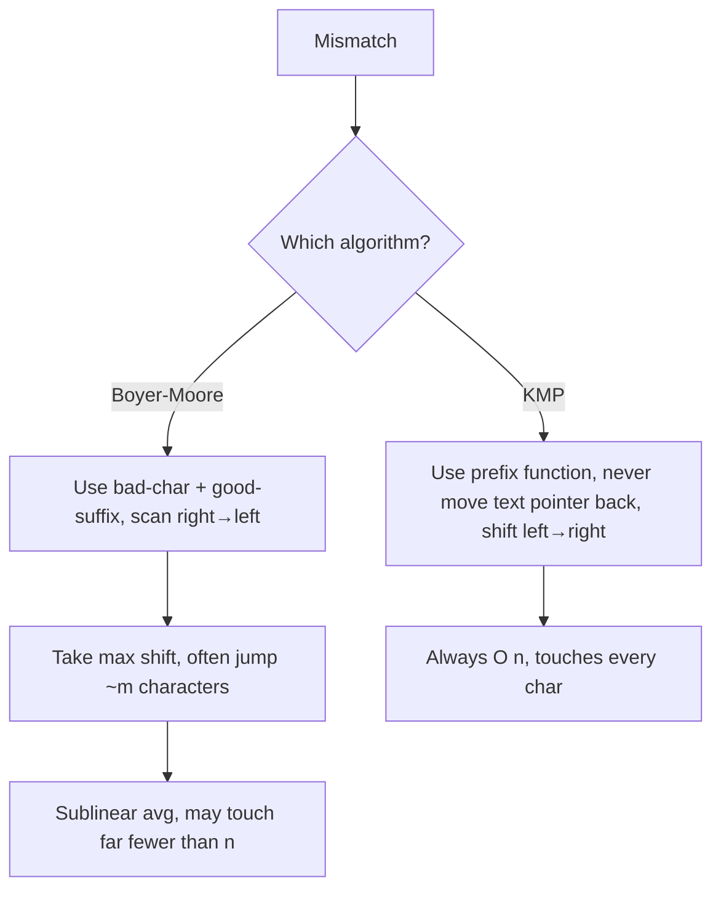

# Boyer-Moore String Matching — Middle Level

> **Focus:** The two heuristics in full — the bad-character last-occurrence table and the **good-suffix** table (both its cases) — how to combine them by taking the maximum shift, why the average case is sublinear, the `O(nm)` worst case and **Galil's rule** that makes it linear, and how Boyer-Moore compares to KMP (sibling `01-kmp`) and Horspool (sibling `09-horspool`).

---

## Table of Contents

1. [Introduction](#introduction)
2. [Deeper Concepts](#deeper-concepts)
3. [The Good-Suffix Table (Both Cases)](#the-good-suffix-table-both-cases)
4. [Combining the Two Shifts](#combining-the-two-shifts)
5. [Average-Case Sublinearity](#average-case-sublinearity)
6. [The O(nm) Worst Case and Galil's Rule](#the-onm-worst-case-and-galils-rule)
7. [Comparison with Alternatives](#comparison-with-alternatives)
8. [Code Examples](#code-examples)
9. [Error Handling](#error-handling)
10. [Performance Analysis](#performance-analysis)
11. [Best Practices](#best-practices)
12. [Visual Animation](#visual-animation)
13. [Summary](#summary)

---

## Introduction

At junior level the message was: scan right to left, and on a mismatch jump by the bad-character rule. At middle level you learn the *second* heuristic that makes Boyer-Moore genuinely strong, and the engineering facts that decide correctness and worst-case behaviour:

- How do you build the **good-suffix table** — both the "another occurrence of the matched suffix exists" case and the "only a prefix of the pattern matches a suffix of the matched part" case?
- Why do you take the **maximum** of the bad-character and good-suffix shifts, and why is that always safe (never skips a match)?
- Why is the average case **sublinear**, and what makes a large alphabet so favourable?
- What pathological input forces the plain algorithm into `O(nm)`, and how does **Galil's rule** restore `O(n)`?
- When should you reach for KMP or Horspool instead?

These are the questions that separate "I can write the bad-character version" from "I understand the full algorithm and its guarantees."

---

## Deeper Concepts

### The two heuristics, restated

On a mismatch at pattern index `j` (text index `s + j`), with bad character `c = T[s + j]` and already-matched suffix `P[j+1 .. m-1]`:

- **Bad-character shift:** `bc = j - last[c]`. Align `c` with its rightmost occurrence in `P` at or before `j`. If `c` is absent (`last[c] = -1`), `bc = j + 1` jumps `P` past `c`. If `last[c] > j`, the value is `≤ 0` and the rule offers no help — we rely on the good-suffix rule (and clamp to `1`).
- **Good-suffix shift:** `gs = goodSuffix[j]` (precomputed). Re-align the matched suffix `P[j+1 .. m-1]` with another occurrence inside `P`, or with the longest prefix of `P` that is also a suffix of the matched part.

The actual shift is `max(bc, gs)`, clamped to at least `1`.

### Two flavours of the bad-character rule

There are two common formulations:

1. **Last-occurrence (original Boyer-Moore):** `last[c]` = rightmost index of `c` in all of `P`. Simple, `O(m + σ)`, but can yield a non-positive shift when `last[c] > j`.
2. **Extended / "good" bad-character (per-position):** `bcr[c][j]` = rightmost occurrence of `c` strictly left of `j`. This always gives a positive shift but costs `O(mσ)` space. Horspool (sibling `09`) uses a cleaner single-table variant keyed only on the *text character aligned with the last pattern position*.

This file uses the classic last-occurrence table and leans on the good-suffix rule (and the `max(1, ·)` clamp) to cover its blind spot.

---

## The Good-Suffix Table (Both Cases)

After matching the suffix `t = P[j+1 .. m-1]` and mismatching at `j`, we want to slide `P` to the next alignment that is *consistent* with having seen `t` in the text. There are two situations.

### Case 1: another occurrence of the matched suffix exists in `P`

If the matched suffix `t` occurs somewhere else inside `P` — as a substring whose preceding character differs from `P[j]` (so we don't immediately re-mismatch) — slide `P` so that *other* occurrence lines up with the text we just matched.

```
P = ...t...t        (t appears again to the left)
matched suffix is the right t; slide so the left t aligns
```

### Case 2: only a prefix of `P` matches a suffix of the matched part

If `t` does **not** reappear in full, the best we can do is align the longest **prefix** of `P` that equals a **suffix** of `t`. This is the same "border" idea KMP uses, applied to suffixes.

```
P = ab....xyab      matched suffix "xyab" has no other copy,
                    but prefix "ab" = suffix "ab" → slide so prefix ab aligns
```

### Constructing the table in O(m)

The standard construction uses an auxiliary array often called `suffixes` (or via a `border`/`z`-style computation). One clean two-pass method:

1. Compute, for each position, the length of the longest substring ending there that is also a suffix of `P` (this is the reverse of the `Z`-function / prefix-function machinery; see `professional.md`).
2. First pass fills Case 1 shifts where a re-occurrence exists; second pass fills Case 2 (prefix-equals-suffix) shifts for positions not covered by Case 1.

Both passes are linear, so the good-suffix table is built in `O(m)` time and `O(m)` space. The full proof of correctness lives in `professional.md`.

```python
def build_good_suffix(p):
    m = len(p)
    # border position array
    border = [0] * (m + 1)
    shift = [0] * (m + 1)
    i, j = m, m + 1
    border[i] = j
    while i > 0:
        while j <= m and p[i - 1] != p[j - 1]:
            if shift[j] == 0:
                shift[j] = j - i      # Case 1 contributions
            j = border[j]
        i -= 1
        j -= 1
        border[i] = j
    # Case 2: prefix that is also a suffix
    j = border[0]
    for i in range(m + 1):
        if shift[i] == 0:
            shift[i] = j
        if i == j:
            j = border[j]
    return shift   # shift[j+1] is the good-suffix shift after mismatch at j
```

The returned `shift` array is indexed so that, after a mismatch at pattern position `j`, the good-suffix shift is `shift[j + 1]`. A full pattern match uses `shift[0]` to continue past the occurrence.

---

## Combining the Two Shifts

On each mismatch, compute both candidates and take the **maximum**:

```
c  = T[s + j]
bc = j - last[c]          # bad-character (may be <= 0)
gs = goodSuffix[j + 1]    # good-suffix (always >= 1 by construction)
s += max(1, bc, gs)
```

Why the maximum is safe: each rule is *individually* proven never to skip a real occurrence (`professional.md`). The bad-character rule guarantees no match is skipped by sliding to align `c`; the good-suffix rule guarantees no match is skipped by sliding to re-align the matched suffix. Whichever proposes the *larger* jump is still bounded by "the smallest shift that could possibly produce a match," so taking the larger one never overshoots a real occurrence — it only discards alignments that *both* rules certify as hopeless. A bigger safe jump simply finishes faster.

On a **full match** (`j` reaches `-1`), there is no bad character; you shift by `goodSuffix[0]`, which equals `m - (length of the longest proper prefix that is also a suffix of P)`. This correctly finds overlapping occurrences (e.g. `"aa"` in `"aaaa"`).

---

## Average-Case Sublinearity

The reason Boyer-Moore can be **sublinear** — examining fewer than `n` characters — is the combination of the right-to-left scan and large jumps:

- Each alignment first compares the *last* pattern character against a fresh text character. If that character does not occur in `P` (probability `≈ (σ-m)/σ` on a uniform alphabet), the bad-character rule jumps the whole pattern length `m` after a *single* comparison.
- The expected number of characters examined per alignment is small, and the expected shift is large (close to `m` for large `σ`).

A standard analysis gives an expected running time of roughly `O(n / m · something)`, and in the best case exactly `O(n / m)` comparisons: every `m`-th character is probed and each probe jumps the pattern by `m`. The **bigger the alphabet `σ` and the longer the pattern `m`, the closer to this best case** real text behaves. On natural-language text and byte data, Boyer-Moore routinely beats `O(n)` algorithms like KMP that must touch every character.

The intuition is worth internalizing: KMP's strength is *never re-reading* a character (`O(n)` exactly); Boyer-Moore's strength is *never reading most characters at all* (sublinear when lucky, which is most of the time on large alphabets).

---

## The O(nm) Worst Case and Galil's Rule

### Where it breaks down

The plain algorithm degrades when shifts are forced to be tiny *and* each alignment re-scans many characters. The classic adversary is a highly repetitive text and pattern over a small alphabet, e.g. `T = "aaaa…a"`, `P = "baaa"` or `P = "aaa"`. Each alignment scans nearly all `m` characters before mismatching, and the shift is only `1`, giving `Θ(nm)` total work — the same as naive search. The bad-character rule alone offers no help when every text character also appears in the pattern.

### Galil's rule restores O(n)

Zvi Galil (1979) observed the wasted work: after a shift, the algorithm sometimes re-compares text characters it *already knows* match, because the matched suffix overlaps the new alignment. Galil's rule adds bookkeeping so that, when the good-suffix shift slides the pattern by an amount that leaves a known-matching prefix overlapping, the scan **skips** re-comparing that overlap and resumes only at the genuinely new region.

Concretely, after a *full match* (or certain good-suffix shifts), record the boundary up to which characters are guaranteed to match in the next alignment; the right-to-left scan stops (declares a match for the overlap) once it reaches that boundary rather than re-checking it. This caps the total number of character comparisons at `O(n)`, turning the worst case from `O(nm)` into **linear** `O(n)`. The combination "good-suffix rule + Galil's rule" is what makes Boyer-Moore both fast on average *and* linear in the worst case, the version proved correct in `professional.md`.

```python
# Galil's rule (sketch): only the matching phase changes.
# After a match, we know P[0 .. memory-1] will re-match at the next
# alignment, so we stop the leftward scan at index `memory` instead of -1.
def search_galil(t, p, last, gs):
    n, m = len(t), len(p)
    res = []
    s = 0
    memory = -1  # boundary up to which a match is guaranteed
    while s <= n - m:
        j = m - 1
        while j >= 0 and (j <= memory or p[j] == t[s + j]):
            if j == memory:      # reached known-matching region
                j = -1           # treat the rest as matched
                break
            j -= 1
        if j < 0:
            res.append(s)
            shift = gs[0]
            memory = m - shift - 1   # remember the overlap for next time
            s += shift
        else:
            memory = -1
            c = ord(t[s + j])
            s += max(1, j - last[c], gs[j + 1])
    return res
```

---

## Comparison with Alternatives

### Boyer-Moore vs KMP vs Horspool vs naive

| Algorithm | Scan direction | Preprocess | Worst case | Average case | Best for |
|-----------|----------------|-----------|------------|--------------|----------|
| Naive | left→right | none | `O(nm)` | `O(nm)` | tiny inputs, teaching |
| KMP (`01-kmp`) | left→right | `O(m)` | `O(n + m)` | `O(n + m)` | small alphabets, worst-case guarantee, streaming |
| Boyer-Moore | right→left | `O(m + σ)` | `O(nm)` plain / `O(n)` Galil | **sublinear**, down to `O(n/m)` | long patterns, large alphabets |
| Horspool (`09`) | right→left | `O(m + σ)` | `O(nm)` | sublinear, simpler | practical default, byte data |

### Key contrasts

- **vs KMP:** KMP *guarantees* `O(n + m)` and never re-reads a character; it shines on small alphabets and adversarial inputs and supports streaming (one text pass). Boyer-Moore *usually* beats KMP on large alphabets by skipping characters, but needs Galil's rule to match KMP's worst-case bound. KMP scans left-to-right; Boyer-Moore right-to-left — the single most important conceptual difference.
- **vs Horspool:** Horspool drops the good-suffix rule and uses only a simplified bad-character table keyed on the text character aligned with the *last* pattern position. It is dramatically simpler, almost always sublinear in practice, and is what many real `memmem`/`strstr` implementations actually use. Boyer-Moore's good-suffix rule wins on patterns with repeated suffixes and is required for the `O(n)` Galil guarantee.
- **vs naive:** Boyer-Moore is naive search plus two skip heuristics and a reversed scan; the heuristics are exactly what convert `O(nm)` into average sublinear.

### Why direction matters



---

## Code Examples

### Full Boyer-Moore: bad-character + good-suffix, max shift

#### Go

```go
package main

import "fmt"

const SIGMA = 256

func buildLast(p string) [SIGMA]int {
	var last [SIGMA]int
	for i := range last {
		last[i] = -1
	}
	for i := 0; i < len(p); i++ {
		last[p[i]] = i
	}
	return last
}

func buildGoodSuffix(p string) []int {
	m := len(p)
	border := make([]int, m+1)
	shift := make([]int, m+1)
	i, j := m, m+1
	border[i] = j
	for i > 0 {
		for j <= m && p[i-1] != p[j-1] {
			if shift[j] == 0 {
				shift[j] = j - i
			}
			j = border[j]
		}
		i--
		j--
		border[i] = j
	}
	j = border[0]
	for i = 0; i <= m; i++ {
		if shift[i] == 0 {
			shift[i] = j
		}
		if i == j {
			j = border[j]
		}
	}
	return shift
}

func search(t, p string) []int {
	res := []int{}
	n, m := len(t), len(p)
	if m == 0 || m > n {
		return res
	}
	last := buildLast(p)
	gs := buildGoodSuffix(p)
	s := 0
	for s <= n-m {
		j := m - 1
		for j >= 0 && p[j] == t[s+j] {
			j--
		}
		if j < 0 {
			res = append(res, s)
			s += gs[0]
		} else {
			bc := j - last[t[s+j]]
			shift := gs[j+1]
			if bc > shift {
				shift = bc
			}
			if shift < 1 {
				shift = 1
			}
			s += shift
		}
	}
	return res
}

func main() {
	fmt.Println(search("HERE IS A SIMPLE EXAMPLE", "EXAMPLE")) // [17]
	fmt.Println(search("aaaaa", "aa"))                         // [0 1 2 3]
	fmt.Println(search("abababab", "abab"))                    // [0 2 4]
}
```

#### Java

```java
import java.util.*;

public class BoyerMooreFull {
    static final int SIGMA = 256;

    static int[] buildLast(String p) {
        int[] last = new int[SIGMA];
        Arrays.fill(last, -1);
        for (int i = 0; i < p.length(); i++) last[p.charAt(i)] = i;
        return last;
    }

    static int[] buildGoodSuffix(String p) {
        int m = p.length();
        int[] border = new int[m + 1];
        int[] shift = new int[m + 1];
        int i = m, j = m + 1;
        border[i] = j;
        while (i > 0) {
            while (j <= m && p.charAt(i - 1) != p.charAt(j - 1)) {
                if (shift[j] == 0) shift[j] = j - i;
                j = border[j];
            }
            i--; j--;
            border[i] = j;
        }
        j = border[0];
        for (i = 0; i <= m; i++) {
            if (shift[i] == 0) shift[i] = j;
            if (i == j) j = border[j];
        }
        return shift;
    }

    static List<Integer> search(String t, String p) {
        List<Integer> res = new ArrayList<>();
        int n = t.length(), m = p.length();
        if (m == 0 || m > n) return res;
        int[] last = buildLast(p);
        int[] gs = buildGoodSuffix(p);
        int s = 0;
        while (s <= n - m) {
            int j = m - 1;
            while (j >= 0 && p.charAt(j) == t.charAt(s + j)) j--;
            if (j < 0) {
                res.add(s);
                s += gs[0];
            } else {
                int bc = j - last[t.charAt(s + j)];
                int shift = Math.max(bc, gs[j + 1]);
                s += Math.max(1, shift);
            }
        }
        return res;
    }

    public static void main(String[] args) {
        System.out.println(search("HERE IS A SIMPLE EXAMPLE", "EXAMPLE")); // [17]
        System.out.println(search("aaaaa", "aa"));                        // [0,1,2,3]
        System.out.println(search("abababab", "abab"));                   // [0,2,4]
    }
}
```

#### Python

```python
SIGMA = 256


def build_last(p):
    last = [-1] * SIGMA
    for i, ch in enumerate(p):
        last[ord(ch)] = i
    return last


def build_good_suffix(p):
    m = len(p)
    border = [0] * (m + 1)
    shift = [0] * (m + 1)
    i, j = m, m + 1
    border[i] = j
    while i > 0:
        while j <= m and p[i - 1] != p[j - 1]:
            if shift[j] == 0:
                shift[j] = j - i
            j = border[j]
        i -= 1
        j -= 1
        border[i] = j
    j = border[0]
    for i in range(m + 1):
        if shift[i] == 0:
            shift[i] = j
        if i == j:
            j = border[j]
    return shift


def search(t, p):
    res = []
    n, m = len(t), len(p)
    if m == 0 or m > n:
        return res
    last = build_last(p)
    gs = build_good_suffix(p)
    s = 0
    while s <= n - m:
        j = m - 1
        while j >= 0 and p[j] == t[s + j]:
            j -= 1
        if j < 0:
            res.append(s)
            s += gs[0]
        else:
            bc = j - last[ord(t[s + j])]
            shift = max(bc, gs[j + 1])
            s += max(1, shift)
    return res


if __name__ == "__main__":
    print(search("HERE IS A SIMPLE EXAMPLE", "EXAMPLE"))  # [17]
    print(search("aaaaa", "aa"))                          # [0, 1, 2, 3]
    print(search("abababab", "abab"))                     # [0, 2, 4]
```

---

## Error Handling

| Scenario | What goes wrong | Correct approach |
|----------|-----------------|------------------|
| Good-suffix index off by one | Used `gs[j]` instead of `gs[j+1]` after a mismatch at `j`. | After mismatch at `j`, the good-suffix shift is `gs[j+1]`; `gs[0]` is used after a full match. |
| Non-positive combined shift | Both `bc <= 0` and a buggy `gs` gave `0`. | Always `s += max(1, bc, gs)`; a correct `gs` is `>= 1`. |
| Wrong table for repeated patterns | Good-suffix Case 2 (prefix) not filled. | Run the second pass that fills prefix-equals-suffix shifts. |
| Missing overlaps | Shifted by `m` after a match instead of `gs[0]`. | Use `gs[0]` to find overlapping occurrences. |
| Worst-case blow-up | Plain algorithm on repetitive small-alphabet input. | Add Galil's rule to cap re-comparisons at `O(n)`. |
| Unicode array overflow | Char code `> σ` indexes the array. | Use a hash-map bad-character table for large alphabets. |

---

## Performance Analysis

| Input profile | Bad-char alone | + Good-suffix | + Galil |
|---------------|----------------|---------------|---------|
| Random text, large σ, long `P` | sublinear, ~`O(n/m)` | sublinear | sublinear, `O(n)` worst |
| English text | strongly sublinear | strongly sublinear | `O(n)` worst |
| Small alphabet, repetitive | can be `O(nm)` | better, still up to `O(nm)` | **`O(n)`** |
| Binary alphabet | poor (small jumps) | helps a little | `O(n)` |

The dominant practical lever is **alphabet size**: large `σ` means the bad character is usually absent from `P`, giving near-`m` jumps. The good-suffix rule rescues patterns with repeated suffixes that the bad-character rule handles poorly. Galil's rule is what you add when you need a hard `O(n)` guarantee regardless of input.

```python
# Quick empirical comparison sketch (counts characters examined).
def count_examined(search_fn, t, p):
    # instrument the inner comparison to tally character touches;
    # on random large-alphabet text, full Boyer-Moore touches << len(t).
    ...
```

The single biggest constant-factor win is keeping the bad-character table as a flat array for byte data and skipping the good-suffix table entirely (Horspool) when patterns rarely have repeated suffixes.

### Worked shift comparison

For `P = "ANPANMAN"` searching in `"...ANPANMAN..."`, when a mismatch occurs after matching the suffix `"MAN"` with bad character `'X'` (absent from `P`):

| Rule | Shift | Reasoning |
|------|-------|-----------|
| Bad-character | `j - (-1) = j+1` | `'X'` absent → jump fully past it |
| Good-suffix | depends on `gs[j+1]` | re-align `"MAN"` / its prefix-suffix |
| Chosen | `max` of the two | the larger safe jump |

On a large alphabet the bad-character rule usually dominates (absent characters give the full jump); on patterns with repeated suffixes over a small alphabet the good-suffix rule earns its keep. The combination is robust precisely because it uses whichever rule is stronger at each mismatch — neither alone is best on all inputs.

### Quick self-test checklist

Before trusting a middle-level implementation, confirm:

- `gs[0]` equals the pattern's period (`m -` longest proper border length); for `"aa"` it is 1.
- After a mismatch at `j`, you read `gs[j+1]`, not `gs[j]`.
- The combined shift is `max(1, bc, gs[j+1])` — the clamp is present.
- All-occurrences mode advances by `gs[0]` after a full match (catches overlaps).
- The searcher matches a naive oracle on random 2-4 symbol strings, where overlaps and good-suffix paths are exercised hardest.
- On the adversary `"a"*N` / `"a"*m`, the plain version is `O(nm)` (expected) and the Galil version is `O(n)`.

---

## Best Practices

- **Build both tables once** per pattern; reuse across many searches.
- **Always take `max(1, bc, gs)`** — the clamp protects against the bad-character rule's non-positive case.
- **Use `gs[0]` after a full match** to catch overlapping occurrences correctly.
- **Add Galil's rule** only if you need the `O(n)` worst-case guarantee; for typical data the plain version is already fast.
- **Prefer Horspool** (sibling `09`) when simplicity matters and patterns lack repeated suffixes.
- **Validate against the naive oracle** on random small strings, including overlapping-match cases like `"aaaa"`.
- **Choose KMP** (sibling `01`) for small/binary alphabets or streaming where one left-to-right pass and a hard `O(n+m)` bound are required.

---

## Visual Animation

> See [`animation.html`](./animation.html) for an interactive view.
>
> The middle-level animation highlights:
> - The right-to-left scan and the exact mismatch position `j`.
> - The **bad-character** shift candidate (`j - last[c]`) and the **good-suffix** shift candidate side by side.
> - The chosen **max** shift jumping the pattern forward.
> - Editable text and pattern so you can construct your own worst-case (e.g. `"aaaa"`) and watch the small jumps.

---

## Summary

The full Boyer-Moore algorithm combines two heuristics. The **bad-character rule** uses a last-occurrence table (`O(m + σ)`) to align the mismatched text character with its rightmost copy in the pattern, or jump past it if absent. The **good-suffix rule** uses an `O(m)` table to re-align the already-matched suffix: Case 1 slides to another occurrence of that suffix in the pattern, Case 2 slides to the longest pattern prefix that equals a suffix of the matched part. On each mismatch you take the **maximum** of the two shifts (always safe — neither rule skips a real match), clamped to at least `1`. The right-to-left scan plus large jumps make the search **sublinear on average**, especially on long patterns and large alphabets, often touching far fewer than `n` characters. The plain algorithm's worst case is `O(nm)` on repetitive small-alphabet inputs; **Galil's rule** caps re-comparisons and restores `O(n)`. Compared to KMP (sibling `01`, left-to-right, guaranteed `O(n+m)`), Boyer-Moore trades a worst-case guarantee for average speed; Horspool (sibling `09`) is the simplified bad-character-only variant that powers much of real `grep`/`memmem`.
