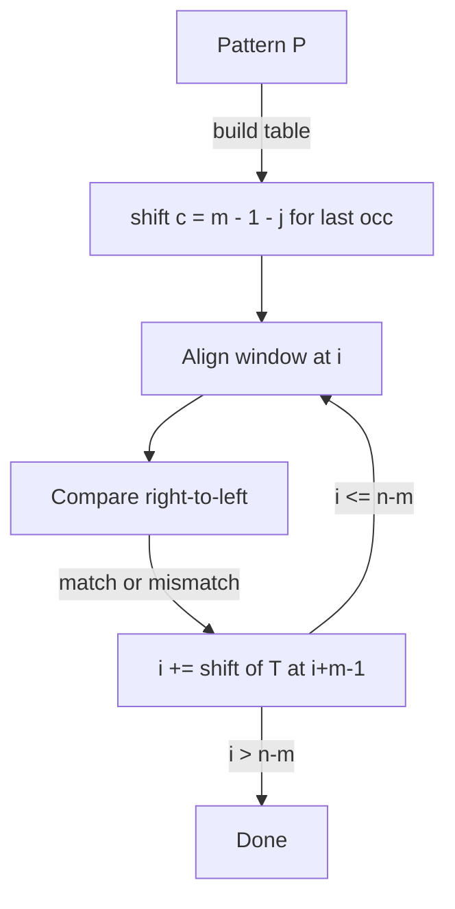

# Boyer-Moore-Horspool — Junior Level

> **One-line summary:** Horspool is the simplified, practical cousin of Boyer-Moore. It keeps **only one shift rule** — a "bad-character" table keyed on the text character aligned with the **last position** of the pattern window — drops the complicated good-suffix rule, compares right-to-left, and on a mismatch jumps forward by the table value. One small `O(sigma)` table plus a tiny loop gives near-Boyer-Moore speed with far less code.

---

## Table of Contents

1. [Introduction](#introduction)
2. [Prerequisites](#prerequisites)
3. [Glossary](#glossary)
4. [Core Concepts](#core-concepts)
5. [Big-O Summary](#big-o-summary)
6. [Real-World Analogies](#real-world-analogies)
7. [Pros & Cons](#pros--cons)
8. [Step-by-Step Walkthrough](#step-by-step-walkthrough)
9. [Code Examples](#code-examples)
10. [Coding Patterns](#coding-patterns)
11. [Error Handling](#error-handling)
12. [Performance Tips](#performance-tips)
13. [Best Practices](#best-practices)
14. [Edge Cases & Pitfalls](#edge-cases--pitfalls)
15. [Common Mistakes](#common-mistakes)
16. [Cheat Sheet](#cheat-sheet)
17. [Visual Animation](#visual-animation)
18. [Summary](#summary)
19. [Further Reading](#further-reading)

---

## Introduction

Suppose you are searching a long document for a word. Naive searching tries every starting position and, at each one, compares character by character — slow when the document is huge. The **Boyer-Moore** family (sibling `08-boyer-moore`) made substring search famously fast by doing two clever things: comparing the pattern **right-to-left**, and on a mismatch **skipping ahead by many characters at once** instead of inching forward by one. But full Boyer-Moore carries *two* shift rules (the bad-character rule and the good-suffix rule), and the good-suffix preprocessing is fiddly and error-prone.

**Boyer-Moore-Horspool** (usually just "Horspool", after R. Nigel Horspool, 1980) is the **simplified** variant. It throws away the good-suffix rule entirely and keeps a single, very easy shift:

> **Look at the text character currently aligned with the *last* position of the pattern window. Shift the pattern forward so that character lines up with its rightmost occurrence in the pattern (excluding the last character). If the character does not occur, shift past it entirely.**

That single rule is precomputed once into a tiny array — the **shift table** — indexed by character. Searching then becomes a short loop: align the window, compare the pattern against the window right-to-left, and on any mismatch (or after a full match) jump forward by `shift[text char at the window's last position]`.

The payoff is huge for how little code it takes. On typical English text or DNA, Horspool examines far fewer than `n` characters and runs **close to full Boyer-Moore in practice**, yet it fits in a dozen lines. That simplicity is exactly why Horspool (and its even-simpler sibling, the **Sunday** variant) show up inside real libraries and editors. The cost is a worse theoretical worst case (`O(nm)`), but for everyday text that worst case almost never appears.

Throughout this file we use `n` for the text length, `m` for the pattern length, and `sigma` (σ) for the alphabet size (256 for bytes, 4 for DNA, etc.). We will contrast Horspool explicitly with full Boyer-Moore (sibling `08`) and with KMP (sibling `01`) so you know exactly when to reach for which.

---

## Prerequisites

Before reading this file you should be comfortable with:

- **Strings as arrays of characters** — indexing `text[i]`, `pattern[j]`, and zero-based positions.
- **The naive substring search** — slide a window of length `m` across the text and compare; `O(nm)` worst case. (Background for sibling `01-kmp` and `08-boyer-moore`.)
- **Arrays / maps as lookup tables** — we precompute a table indexed by character (an array of size `sigma`, or a hash map for large alphabets).
- **Big-O notation** — `O(n)`, `O(m)`, `O(nm)`, `O(sigma)`.
- **ASCII / Unicode basics** — what "alphabet size" means and why a byte alphabet has 256 symbols.

Optional but helpful:

- A glance at **Boyer-Moore** (sibling `08`) to appreciate what Horspool *removes*.
- A glance at **KMP** (sibling `01`) to contrast a left-to-right, never-skip-text approach with Horspool's right-to-left, big-skip approach.

---

## Glossary

| Term | Meaning |
|------|---------|
| **Pattern** | The string `P` of length `m` we are searching for. |
| **Text** | The string `T` of length `n` we search within. |
| **Window** | The current `m`-length slice of the text aligned with the pattern; we compare them. |
| **Alignment** | The position `i` in the text where the window's first character sits. |
| **Bad-character rule** | Use a mismatched (or aligned) text character to decide how far to shift. |
| **Horspool shift** | The single rule: shift based on the text char aligned with the pattern's **last** position. |
| **Shift table** | An array (or map) `shift[c]` giving how far to jump when text char `c` is at the window's last position. |
| **sigma (σ)** | The alphabet size (number of distinct symbols), e.g. 256 for bytes. |
| **Sunday variant** | A close relative that keys the shift on the char **just past** the window for a slightly bigger jump. |
| **Good-suffix rule** | The *other* Boyer-Moore rule that Horspool **drops** — it shifts using a matched suffix. |
| **Occurrence** | A position where the whole pattern matches the text. |

---

## Core Concepts

### 1. Right-to-Left Comparison

Like Boyer-Moore, Horspool aligns the pattern with a text window and compares **from the right end of the pattern toward the left**. If the last character of the window already differs from the last character of the pattern, you can often skip a lot of text immediately, without ever looking at the middle. This right-to-left scan is what lets the algorithm "see the end first" and jump.

### 2. The Single Shift Table (the heart of Horspool)

Full Boyer-Moore's bad-character rule keys the shift on *which* character mismatched and *where*. Horspool simplifies this: **it always uses the text character aligned with the last position of the window**, regardless of where the mismatch actually happened. That one character decides the jump.

The table is built from the pattern only:

```
for every character c:           shift[c] = m          # default: char not in pattern (except possibly last)
for j = 0 .. m-2:                 shift[P[j]] = m - 1 - j   # rightmost occurrence, excluding the last char
```

Note the loop runs to `m-2`, **excluding the last character** `P[m-1]`. That exclusion is the subtle, essential detail: the last character is the one we key the shift on, so it must not set its own shift to zero. (If `P[m-1]` also appears earlier, that earlier occurrence still updates the table.)

The default `m` means: "this character does not occur in the relevant part of the pattern, so we can slide the whole window past it." Smaller values mean "this character occurs near the right end, so only shift a little."

### 3. The Matching Loop

```
build shift table from P
i = 0
while i <= n - m:
    j = m - 1
    while j >= 0 and T[i+j] == P[j]:   # compare right-to-left
        j -= 1
    if j < 0:
        report match at i
        i += shift[T[i + m - 1]]        # shift keyed on the last-window char
    else:
        i += shift[T[i + m - 1]]        # same shift on mismatch
```

The beauty: **whether it matched or mismatched, the shift is the same** — it is always `shift[T[i + m - 1]]`, the table value for the text character at the window's last position. That uniformity is what makes Horspool so short.

### 4. Why the Shift Is Safe

The shift never skips a possible match. The character at the window's last position must be matched by *some* pattern position in any future alignment that succeeds; the table moves the pattern the smallest amount that re-aligns that character with its rightmost matching position in the pattern (or past it if it never matches). Shifting less would be wasteful; shifting more could miss a match. (The formal argument is in `professional.md`.)

### 5. The Sunday Variant (a tiny upgrade)

The **Sunday** algorithm (D.M. Sunday, 1990) is Horspool's close relative. Instead of keying on the char aligned with the window's last position, it keys on the character **one position past** the window (`T[i + m]`). Because that character must be covered by *any* next alignment, you can often shift by up to `m + 1`. The table is built the same way but over all `m` characters of the pattern (including the last), and the default becomes `m + 1`. Sunday sometimes jumps slightly farther; Horspool is slightly simpler. Both are practical favorites.

### 6. Contrast in One Breath

- **KMP (sibling `01`)** scans left-to-right, never re-reads text, and has a guaranteed `O(n + m)`. It never *skips* text.
- **Full Boyer-Moore (sibling `08`)** uses two rules (bad-character + good-suffix) for the best worst case and big skips, but with complex preprocessing.
- **Horspool** keeps only the simplified bad-character shift on the last-window char: tiny code, great average case, `O(nm)` worst case.

---

## Big-O Summary

| Operation | Time | Space | Notes |
|-----------|------|-------|-------|
| Build shift table | **O(m + sigma)** | O(sigma) | Fill defaults (`sigma`), then scan `P` once (`m`). |
| Search (average, random-ish text) | **O(n / m)**-ish skips, ~`O(n)` chars examined | O(1) extra | Often **sub-linear** in characters examined. |
| Search (worst case) | **O(nm)** | O(1) extra | Adversarial pattern/text (e.g. all same char). |
| Single shift lookup | O(1) | — | One array index. |
| Sunday variant build | O(m + sigma) | O(sigma) | Same table shape, default `m+1`. |
| Report all occurrences | O(occ) added | — | `occ` = number of matches. |

The headline numbers: preprocessing is **`O(m + sigma)`**, the table costs **`O(sigma)`** space, average search is excellent (frequently sub-linear in characters examined), and the worst case is **`O(nm)`** — the price paid for dropping the good-suffix rule.

---

## Real-World Analogies

| Concept | Analogy |
|---------|---------|
| Right-to-left compare | Reading the last letter of a word on a shelf first; if it is wrong, you don't bother reading the rest. |
| Shift table | A cheat-sheet that says "if the rightmost letter you see is `z`, jump 4 shelves; if it's `e`, jump 1." |
| Keying on the last-window char | Always judging your jump by the single letter at the right edge of the window — simple and consistent. |
| Default shift = `m` | If the right-edge letter never appears in your word, the whole word can't possibly overlap there, so leap past it. |
| Sunday variant | Peeking one shelf *beyond* the window before deciding the jump — sometimes you can leap even farther. |
| Dropping the good-suffix rule | Carrying one rule of thumb instead of two; you lose a little in the worst case but the rulebook is tiny. |

Where the analogy breaks: real shelves don't have adversarial arrangements, but a malicious input (a pattern of all `a`s in a text of all `a`s) forces Horspool into its slow `O(nm)` behavior — the analogy's "rare bad luck" becomes a guaranteed slowdown.

---

## Pros & Cons

| Pros | Cons |
|------|------|
| **Tiny code** — one table plus a short loop; far simpler than full Boyer-Moore. | **`O(nm)` worst case** — no good-suffix rule to bound it. |
| **Excellent average case** — frequently examines far fewer than `n` characters. | Average-case advantage shrinks as the alphabet shrinks (DNA: `sigma=4`). |
| **`O(sigma)` space** — a single small table. | Needs a table sized to the alphabet; large/Unicode alphabets use a map. |
| **Cache-friendly, branch-light** — common in real libraries for raw speed. | For tiny patterns (`m=1,2`) the skip benefit nearly vanishes. |
| **Uniform shift** (same on match or mismatch) keeps the loop branch-simple. | Worst case is data-dependent and hard to predict from the pattern alone. |

**When to use:** general substring search over byte/ASCII text, large alphabets where mismatches are common, simple library implementations, editors and `grep`-like tools, when you want most of Boyer-Moore's speed without its complexity.

**When NOT to use:** when you need a guaranteed linear worst case (use KMP, sibling `01`, or full Boyer-Moore, sibling `08`), tiny alphabets where skips are small, or when the pattern is length 1 or 2 (a specialized scan is simpler).

---

## Step-by-Step Walkthrough

Let `T = "TRUSTHARDTEETH"` and `P = "TEETH"` (so `n = 14`, `m = 5`, last position `m-1 = 4`).

**Build the shift table** (loop `j = 0..3`, excluding the last char at index 4):

```
P = T E E T H
    0 1 2 3 4

default shift[c] = m = 5  for every c

j=0: P[0]='T' -> shift['T'] = 5-1-0 = 4
j=1: P[1]='E' -> shift['E'] = 5-1-1 = 3
j=2: P[2]='E' -> shift['E'] = 5-1-2 = 2   (overwrites, rightmost wins)
j=3: P[3]='T' -> shift['T'] = 5-1-3 = 1   (overwrites)

Result: shift['T']=1, shift['E']=2, shift['H']=5 (default), all others 5
```

(Note `shift['H']` stays at the default `5` because `H` only appears as the last char, which we exclude.)

**Search.** Start with the window at `i = 0`:

```
i=0:  T R U S T H A R D T E E T H
      T E E T H
window last char = T[i+4] = T[4] = 'T'
compare right-to-left: P[4]='H' vs T[4]='T' -> mismatch immediately
shift = shift['T'] = 1 -> i = 1
```

```
i=1:  T R U S T H A R D T E E T H
        T E E T H
window last char = T[5] = 'H'
compare: P[4]='H' vs T[5]='H' ok; P[3]='T' vs T[4]='T' ok; P[2]='E' vs T[3]='S' mismatch
shift = shift[T[i+4]] = shift['H'] = 5 -> i = 6
```

```
i=6:  T R U S T H A R D T E E T H
                  ... T E E T H  (window at 6..10)
window last char = T[10] = 'E'
compare: P[4]='H' vs T[10]='E' -> mismatch
shift = shift['E'] = 2 -> i = 8
```

```
i=8:  window at 8..12, last char = T[12] = 'T'
compare: P[4]='H' vs T[12]='T' -> mismatch
shift = shift['T'] = 1 -> i = 9
```

```
i=9:  window at 9..13 = "TEETH"
last char = T[13] = 'H'
compare right-to-left: H=H, T=T, E=E, E=E, T=T -> full match at i=9!
shift = shift['H'] = 5 -> i = 14 (loop ends, i > n-m)
```

We found `"TEETH"` at index 9, having examined only a handful of characters thanks to the big jumps. Notice each shift used **only the character at the window's last position** — that single, uniform rule is the whole algorithm.

---

## Code Examples

### Example: Horspool Search (find first occurrence, or all occurrences)

#### Go

```go
package main

import "fmt"

// buildShift builds the Horspool bad-character table over a byte alphabet.
func buildShift(pattern string) [256]int {
	m := len(pattern)
	var shift [256]int
	for c := 0; c < 256; c++ {
		shift[c] = m // default: char not in P[0..m-2]
	}
	for j := 0; j < m-1; j++ { // exclude the last character
		shift[pattern[j]] = m - 1 - j // rightmost occurrence wins
	}
	return shift
}

// horspool returns the index of the first occurrence of pattern in text, or -1.
func horspool(text, pattern string) int {
	n, m := len(text), len(pattern)
	if m == 0 {
		return 0
	}
	if m > n {
		return -1
	}
	shift := buildShift(pattern)
	i := 0
	for i <= n-m {
		j := m - 1
		for j >= 0 && text[i+j] == pattern[j] { // right-to-left
			j--
		}
		if j < 0 {
			return i // full match
		}
		i += shift[text[i+m-1]] // shift keyed on the last-window char
	}
	return -1
}

func main() {
	fmt.Println(horspool("TRUSTHARDTEETH", "TEETH")) // 9
	fmt.Println(horspool("abcabcabc", "cab"))        // 2
	fmt.Println(horspool("hello", "xyz"))            // -1
}
```

#### Java

```java
public class Horspool {

    static int[] buildShift(String pattern) {
        int m = pattern.length();
        int[] shift = new int[256];
        for (int c = 0; c < 256; c++) shift[c] = m;     // default
        for (int j = 0; j < m - 1; j++) {               // exclude last char
            shift[pattern.charAt(j) & 0xFF] = m - 1 - j; // rightmost wins
        }
        return shift;
    }

    static int horspool(String text, String pattern) {
        int n = text.length(), m = pattern.length();
        if (m == 0) return 0;
        if (m > n) return -1;
        int[] shift = buildShift(pattern);
        int i = 0;
        while (i <= n - m) {
            int j = m - 1;
            while (j >= 0 && text.charAt(i + j) == pattern.charAt(j)) {
                j--;                                     // right-to-left
            }
            if (j < 0) return i;                         // match
            i += shift[text.charAt(i + m - 1) & 0xFF];   // last-window char
        }
        return -1;
    }

    public static void main(String[] args) {
        System.out.println(horspool("TRUSTHARDTEETH", "TEETH")); // 9
        System.out.println(horspool("abcabcabc", "cab"));        // 2
        System.out.println(horspool("hello", "xyz"));            // -1
    }
}
```

#### Python

```python
def build_shift(pattern):
    m = len(pattern)
    shift = {}                       # default handled in search via .get(c, m)
    for j in range(m - 1):           # exclude the last character
        shift[pattern[j]] = m - 1 - j  # rightmost occurrence wins
    return shift


def horspool(text, pattern):
    n, m = len(text), len(pattern)
    if m == 0:
        return 0
    if m > n:
        return -1
    shift = build_shift(pattern)
    i = 0
    while i <= n - m:
        j = m - 1
        while j >= 0 and text[i + j] == pattern[j]:   # right-to-left
            j -= 1
        if j < 0:
            return i                                    # full match
        i += shift.get(text[i + m - 1], m)             # last-window char
    return -1


if __name__ == "__main__":
    print(horspool("TRUSTHARDTEETH", "TEETH"))  # 9
    print(horspool("abcabcabc", "cab"))         # 2
    print(horspool("hello", "xyz"))             # -1
```

**What it does:** builds the single Horspool shift table from the pattern, then slides the window, comparing right-to-left and always shifting by the table value of the last-window character.
**Run:** `go run main.go` | `javac Horspool.java && java Horspool` | `python horspool.py`

---

## Coding Patterns

### Pattern 1: Naive Search (the oracle you test against)

**Intent:** Before trusting Horspool, search the slow, obvious way and confirm both find the same matches on small inputs.

```python
def naive_search(text, pattern):
    n, m = len(text), len(pattern)
    hits = []
    for i in range(n - m + 1):
        if text[i:i + m] == pattern:
            hits.append(i)
    return hits
```

This is `O(nm)` but unmistakably correct. Horspool must report exactly the same occurrence positions.

### Pattern 2: Count All Occurrences

**Intent:** Find *every* match, not just the first. After a match (or mismatch), shift by the same `shift[T[i+m-1]]` and keep going.

```python
def horspool_all(text, pattern):
    n, m = len(text), len(pattern)
    if m == 0 or m > n:
        return [] if m > n else list(range(n + 1))
    shift = build_shift(pattern)
    res, i = [], 0
    while i <= n - m:
        j = m - 1
        while j >= 0 and text[i + j] == pattern[j]:
            j -= 1
        if j < 0:
            res.append(i)
        i += shift.get(text[i + m - 1], m)
    return res
```

### Pattern 3: Sunday Shift (key on the char *past* the window)

**Intent:** A slightly larger jump using `T[i + m]` (one past the window). Build the table over all `m` chars; default is `m + 1`.



---

## Error Handling

| Error | Cause | Fix |
|-------|-------|-----|
| Misses matches near the end | Loop condition wrong (`i < n-m` instead of `i <= n-m`). | Use `i <= n - m` so the last window is checked. |
| `IndexError` / out-of-bounds | Empty pattern, or `m > n` not handled. | Guard `m == 0` and `m > n` before the loop. |
| Wrong shifts | Included the last char when building the table. | Loop `j` only to `m-2` (exclude `P[m-1]`). |
| Infinite loop | Shift of `0` (last char gave a zero shift). | Excluding the last char guarantees shift `>= 1`. |
| Bad lookups for non-ASCII | Byte table indexed by a multi-byte char. | Use a map for large/Unicode alphabets, or operate on bytes. |
| Negative index in some langs | `c & 0xFF` omitted for signed bytes (Java). | Mask the char to an unsigned byte before indexing. |

---

## Performance Tips

- **Default the table to `m` once**, then overwrite — do not loop over the alphabet per search; build the table a single time.
- **Use an array, not a map, for byte/ASCII alphabets** — array indexing is far faster than hashing; reserve maps for huge alphabets.
- **Exclude the last char correctly** — this both guarantees a positive shift (no infinite loop) and produces the right jumps.
- **Reuse the table across many searches** of the same pattern — preprocessing is `O(m + sigma)`; amortize it.
- **Prefer the inner right-to-left loop to bail early** — most windows mismatch at the last char and shift immediately, which is where the speed comes from.

---

## Best Practices

- Always test Horspool against the naive oracle (Pattern 1) on random small inputs before trusting it on large text.
- Guard the degenerate cases first: empty pattern, `m > n`, and pattern length 1.
- Build the shift table once per pattern and pass it into the search if you search the same pattern repeatedly.
- Comment the **last-character exclusion** in the table build — it is the line most people get wrong.
- State your alphabet assumption (bytes? ASCII? Unicode?) and size the table accordingly.
- If you need a guaranteed linear bound, document that you chose KMP/Boyer-Moore instead and why.

---

## Edge Cases & Pitfalls

- **Empty pattern (`m = 0`)** — by convention, matches at position 0 (and arguably at every position); decide and document.
- **Pattern longer than text (`m > n`)** — no match; return early before building anything heavy.
- **Pattern length 1** — the table is all-default `m = 1`; the algorithm degenerates to a simple scan, which is fine.
- **Last character repeated earlier** — e.g. `P = "abca"`; the earlier `a` (index 0) sets `shift['a'] = m-1-0`, which is correct; the final `a` is excluded.
- **All-same-character pattern and text** (`P="aaaa"`, `T="aaaa...a"`) — this is the `O(nm)` worst case: every window fully matches/compares but shifts only by 1.
- **Unicode / multi-byte** — a byte-indexed table is wrong for code points above 255; use a map keyed on the rune/character.
- **Off-by-one in the window** — the last-window char is `T[i + m - 1]`, not `T[i + m]` (that is Sunday's char).

---

## Common Mistakes

1. **Including the last character when building the table** — sets a shift of `0`, causing an infinite loop or wrong jumps. Loop `j` to `m-2`.
2. **Keying the shift on the mismatched position** instead of the window's last position — that is full Boyer-Moore's rule, not Horspool's. Horspool always uses `T[i + m - 1]`.
3. **Using `i < n - m`** so the final window is never checked — must be `i <= n - m`.
4. **Forgetting the default `m`** for characters absent from the pattern — they should let you leap the whole window.
5. **Confusing Horspool's char with Sunday's** — Horspool uses the *last-window* char (`i+m-1`); Sunday uses the char *past* the window (`i+m`).
6. **Assuming a guaranteed linear time** — Horspool is `O(nm)` worst case; do not promise `O(n+m)`.
7. **Indexing a byte array with a signed/negative char** — mask with `& 0xFF` (Java) or operate on bytes.

---

## Cheat Sheet

| Question | Tool | Formula / Rule |
|----------|------|----------------|
| Build shift for char `c` | table | `shift[c] = m` default; `shift[P[j]] = m-1-j` for `j=0..m-2` |
| How far to jump | last-window char | `i += shift[T[i + m - 1]]` (match or mismatch) |
| Compare direction | right-to-left | start `j = m-1`, decrement |
| Char absent from pattern | default | shift by `m` (whole window) |
| Sunday's key char | one past window | `T[i + m]`, default `m + 1` |
| Worst case | adversarial | `O(nm)` |
| Preprocessing | once | `O(m + sigma)` time, `O(sigma)` space |

Core algorithm:

```
build shift table from P (exclude last char; default m)
i = 0
while i <= n - m:
    j = m - 1
    while j >= 0 and T[i+j] == P[j]: j -= 1
    if j < 0: report match at i
    i += shift[T[i + m - 1]]      # same shift on match or mismatch
# cost: O(m + sigma) preprocess, ~O(n) average, O(nm) worst
```

---

## Visual Animation

> See [`animation.html`](./animation.html) for an interactive visualization.
>
> The animation demonstrates:
> - Aligning the pattern window over the text
> - Comparing right-to-left and bailing on the first mismatch
> - Reading the text char at the window's **last position** and shifting by `shift[that char]`
> - The shift table displayed and highlighted as it is consulted
> - Step / Run / Reset controls and editable text and pattern

---

## Summary

Boyer-Moore-Horspool is the practical, stripped-down Boyer-Moore: keep the right-to-left comparison and big skips, but **drop the good-suffix rule** and keep only a **single bad-character shift keyed on the text character aligned with the pattern's last position**. That shift lives in one `O(sigma)`-space table built in `O(m + sigma)` (excluding the last pattern character so the shift is always positive). The matching loop is tiny — align, compare right-to-left, and on match *or* mismatch jump by `shift[T[i+m-1]]`. The Sunday variant keys on the char just past the window for a slightly bigger jump. You trade full Boyer-Moore's strong worst case (`O(nm)` instead of bounded) for dramatically simpler code with near-Boyer-Moore average speed — which is exactly why Horspool and Sunday are favorites in real libraries.

---

## Further Reading

- R. N. Horspool, "Practical fast searching in strings" (*Software: Practice and Experience*, 1980) — the original paper.
- D. M. Sunday, "A very fast substring search algorithm" (*Communications of the ACM*, 1990) — the Sunday variant.
- Sibling topic `08-boyer-moore` — the full algorithm with the good-suffix rule.
- Sibling topic `01-kmp` — the left-to-right, guaranteed-linear alternative that never skips text.
- *Introduction to Algorithms* (CLRS) — string matching chapter.
- cp-algorithms.com — string searching algorithms and benchmarks.
